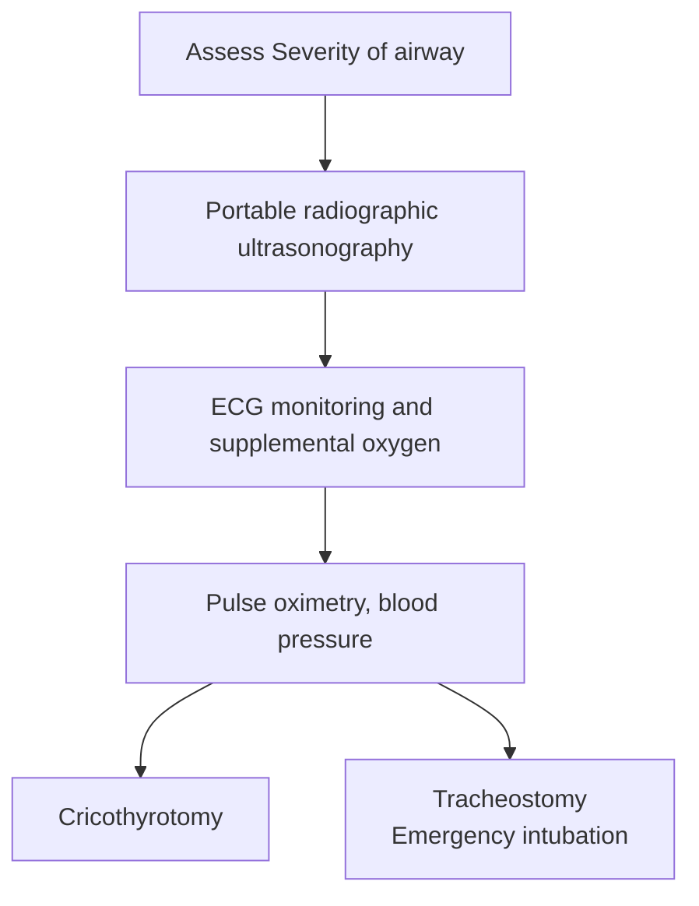

### ACUTE AIRWAY OBSTRUCTION

The cause of acute airway obstruction can be underlying malignancy, abscess, laryngeal cyst or laryngocele. It is necessary to assess the severity of the condition before initiating the treatment.

**_Emergency treatment_**

- Head extension with lower jaw thrust forward
- Suctioning for clearing secretions

54

_Emergency Conditions_

- Ventilatory mask with 100% oxygen
- Endotracheal intubation or tracheostomy

**In stable patient**

- Plain X-ray neck
- Fibre optic endoscopy / micro-laryngoscopy / bronchoscopy to find out the cause

**Treatment guidelines**

