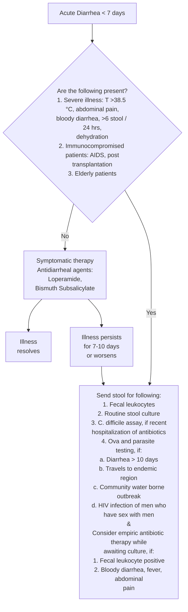

### ACUTE GASTRO ENTERITIS

It is a self-limiting illness characterized by diarrhoea, abdominal cramps, nausea and vomiting, usually caused by viruses or bacteria (_E. coli, V. cholerae, Staph. aureus, Bacillus cereus_, etc). Most of these are noninvasive or toxic diarrhoea. Less commonly patients present mainly with diarrhoea with passage of mucous and/or blood in stools. This may be associated with significant systemic symptoms like fever, malaise, etc.

#### Salient features

> - Watery profuse loose motions which are unaffected by fasting, nausea and vomiting, abdominal cramps, dehydration, hypotension

**Pharmacological treatment (Figure 1)**

- In acute gastro enteritis the aim is to correct dehydration and electrolyte imbalance. There is usually no need to investigate for the etiology immediately.
- Further investigations are necessary if there is bloody diarrhea, clinical evidence of toxicity or prolonged diarrhea.
- Oral rehydration salt (ORS) : given in mild to moderate dehydration , 75 ml/kg in 4 hours in case of moderate dehydration
- IV fluid given in patients with severe dehydration (100 ml/kg). 30 ml/kg to be given in 30 minutes followed by 70 ml/kg in 2½ hours
- Tab ciprofloxacin 500 mg two times a day for 3 to 5 days. Indicated only in very ill patients with systemic symptoms associated with bloody diarrhea
- In amoebic dysentery Tab. metronidazole 400mg three times a day for 5 to 7 days. Oral Tab. tinidazole 600 mg twice a day for 3 to 5 days.

128

Gastrointestinal Diseases

- In acute giardiasis Tab. tinidazole 1000 mg single dose or Tab. metronidazole 400 mg three times a day for 3 days. Hospitalization is needed when there are clinical signs of dehydration especially in young children or in the elderly, suspected cholera, immune suppressed patients and those with severe systemic symptoms.

**Patient education**

- In the absence of vomiting patient should be asked to take sips of fluid.
- Fluids used at home can be juices, soups and ORS.
- Milk and related products are avoided for at least 2 weeks, because of secondary lactase deficiency.

**Figure 1. Algorithm for the treatment of acute diarrhea**

129

Gastrointestinal Diseases

