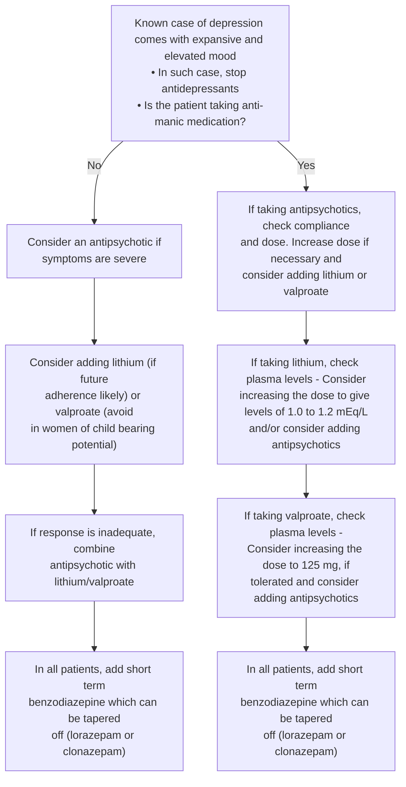

### BIPOLAR MOOD DISORDER

Bipolar mood disorders are characterized by episodes of mania and depression or mania alone with intervening periods of normalcy.

#### Salient features

> - In manic episode, an elevated, expansive or irritable mood is the hallmark. The elevated mood is euphoric and characterized by euphoria, impaired judgement, denial of illness, overtly religious, over familiar behavior, increased talkativeness, increased self esteem, increased psychomotor activities and goal directed activities, increased sexual drive and engaging into high risk behavior.
> - Patients with depressed mood experience loss of energy and interest, feelings of guilt, difficulty in concentrating, loss of appetite and thoughts of death or suicide.
> - Other signs and symptoms of mood disorders include change in activity level, cognitive abilities, speech and vegetative functions (e.g. sleep, appetite, sexual activity and other biological rhythms).
> - These disorders virtually always result in impaired interpersonal, social and occupational aspects of life.

**Non pharmacological treatment**

- Psychoeducation, family therapy and rehabilitation for manic phases
- Psychotherapeutic measures same as in unipolar depression for depressive phases.

**Pharmacological treatment (Figure 2, Table 2)**

- Antipsychotics like risperidone and olanzapine are used as an adjuvant in treatment.
- Episode of depression is to be treated as in major depressive disorder but Tab. lamotrigine 25-100 mg is the treatment of choice.
- Prophylactic treatment: to be given to prevent recurrent episodes: Tab. lithium carbonate 900-1500 mg /day in divided doses or Tab. sodium valproate 600- 2000 mg /day in divided doses or Tab. carbamazepine 600-1200 mg / day in divided doses

290

Psychiatry Disorders

### Figure 2. Management of current manic episode

### Table 2. Dosage schedule of anti-manic drugs

<table>
  <thead>
    <tr>
        <th>Drug treatment of mania : recommended doses</th>
        <th colspan="2">Dosage schedule</th>
    </tr>
  </thead>
  <tbody>
    <tr>
        <td>Lithium</td>
        <td>400 mg / per day. Adjusted after 3 – 4 days according to plasma levels</td>
        <td>Start with 600 to 900 mg/day after getting baseline investigations done</td>
    </tr>
    <tr>
        <td>Sodium valproate</td>
        <td>As sodium valproate slow release: Dose is 20 – 30 mg/ kg/ day</td>
        <td>Start with 200mg thrice a day and gradually increase upto the per kg maximum dose if no or less response</td>
    </tr>
    <tr>
        <td>Oxcarbazepine</td>
        <td>300mg, build upto 1500 mg</td>
        <td>Has lesser side effect than carbamazepine</td>
    </tr>
  </tbody>
</table>

**Patient education**

- Emphasize about recurrent course of illness and not to get too much worried regarding recurrences.
- Relapses can be treated as successfully as the first episode.
- When on lithium, advice to take plenty of fluids especially during summer; not to restrict salt.

291

_Psychiatry Disorders_

- If fever, vomiting or diarrhea develops while on lithium, reduce the dose of lithium to half and contact the physician or the psychiatrist.

