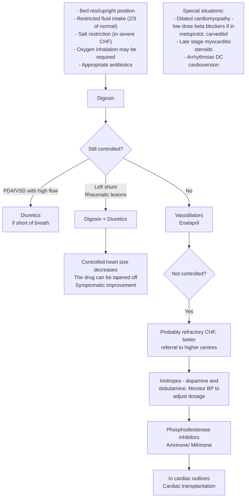

### CARDIAC FAILURE

Cardiac failure is defined as a state in which the heart cannot deliver an adequate cardiac output to meet the metabolic needs of the body. Clinical presentation is dependent on age and degree of cardiac reserve. Common causes according to age of presentation are: Neonate – Severe anaemia, heart block, congenital heart disease e.g. hypoplastic left heart, coarctation, left to right shunt and large mixing cardiac defects. Infant – Left to right shunt, supraventricular tachycardia Children – Rheumatic fever, myocarditis, cardiomyopathy, acute hypertension.

#### Salient features

> - Exertional dyspnoea, poor weight gain, feeding difficulties, fast breathing with improvement when upright, persistent cough and wheezing, excessive perspiration and irritability, puffiness of face and pedal oedema.
> - Tachypnoea, tachycardia, small volume pulse, peripheral cyanosis, pedal/facial/ sacral oedema, hepatomegaly, raised JVP (appreciated well in older children), gallop rhythm, cardiomegaly and failure to thrive.

**_Non- pharmacological treatment_**

- Restricted activity and bed rest with upright posture depending on cardiac reserve.
- In severe CHF, dietary modifications in infants by increasing calories per feed. Breast-feed supplementation, naso-gastric feed to avoid the exertion of active feeding.
- No added salt in diet and fluid restriction. Cold sponging in case of fever.

**_Pharmacological treatment_**
Identify and treat the underlying cause. Algorithm for treatment is shown in figure.

- Elixir/Tab. digoxin (Elixir 0.25 mg/5 ml, Tab. 0.25 mg)

Method of digitalization: 0.5 x digitalization dose initially, 0.25 x digitalizing dose 8 and 16 hours later.

Digitalizing dose: Newborn = IV, IM: 0.010 - 0.030 mg/kg divided or orally: 0.040 mg/kg divided in fractions.
Infants = IV, IM 0.030 - 0.040 mg/kg or orally 0.050 mg/kg in fractions.
Children = IV, IM, PO: 0.010 - 0.015 mg/kg in fractions.

395

Pediatric Conditions

- Maintenance dosage 24 hours after 1st fraction of digitalizing dose. Newborn = PO: 0.005 - 0.010 mg/kg/24 hours, divided every 12 hours. In infants and children orally 0.002 - 0.005 mg/kg/24 hours divided every 12 hours. (Caution: Avoid hypokalaemia during therapy with digoxin)
- Tab. furosemide 1-2 mg/kg every 12 hourly (may need K supplement). Or Tab. chlorothiazide 20-50 mg/kg/day in 2 divided doses. Or Tab. spironolactone 1-3 mg/kg/day in 2 divided doses.
- In cases with regurgitant cardiac lesions like severe MR where reduction in after load is required, Tab. captopril 0.1-0.2 mg kg/dose 8-12 hourly (maximum 4 mg/kg/day). Or Tab. enalapril 0.08-0.5 mg/kg/dose 12-24 hourly (maximum 1 mg/kg/day).
- Patients with hypotension and low cardiac output should be referred to a higher center for Inj. dopamine infusion (40 mg/ml) 2-20 mcg/kg/min prepared in normal saline or 5% dextrose. Hypovolaemia should be corrected before infusion is started and BP is monitored during the infusion. Or Inj. dobutamine infusion (250 mg/5 ml) 2- 20 mcg/kg/min. Both the drugs can be used simultaneously to have added response.

**Patient education**

- Decreased salt intake, sufficient rest and adequate sleep must be emphasized. Strict bed rest is necessary only in severe cases. Semi-upright position during sleep may make the patient more comfortable.

**Figure 1. Algorithm for treatment of congestive cardiac failure**

396

Pediatric Conditions

