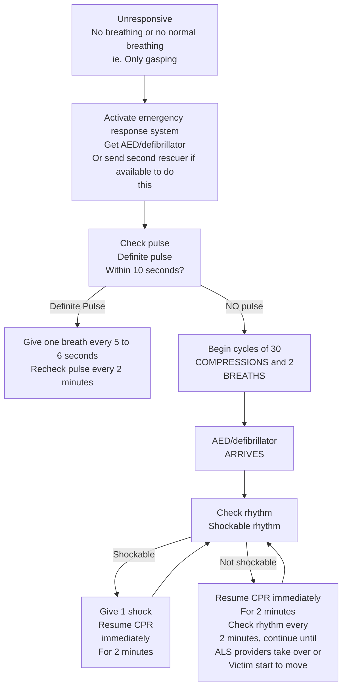
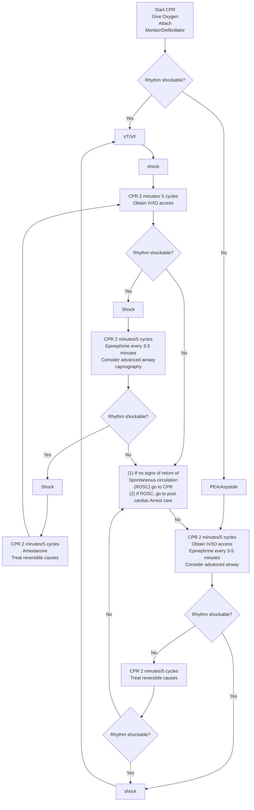

## CARDIOPULMONARY RESUSCITATION

Cardiopulmonary resuscitation (CPR) consists of a series of maneuvers by which oxygenated blood supply to brain and vital organs is maintained during cardiopulmonary arrest (CPA) i.e. cessation of respiration and circulation. In children, CPA is not sudden but end result of long period of hypoxaemia secondary to inadequate ventilation, oxygenation or circulation. Therefore, prompt management of these is essential to prevent CPA, the outcome of which is poor.

**Diagnosis of cardiopulmonary and cardiac arrest**

1. Absence of pulse in major arteries (carotid or femoral in older children and femoral or brachial in infants as carotid is difficult to palpate due to short neck).
2. Absence of heart sounds on auscultation.
3. Asystole /ventricular fibrillation on ECG.

**Respiratory arrest**
Absence of respiration on examination (absent chest movements), listening (absent air flow on bringing ears in front of mouth) and feeling (absent air flow on keeping hands in front of mouth or nose).

**Levels of CPR**
**Basic life support (BLS):** The elements of CPR are provided without additional equipment. Skill and speed are most essential.
**Advanced cardiac life support (ACLS):** Use of equipment and drugs for assisting ventilation or circulation.

**Primary survey to assess the patient's condition:**

- Tap the patient on the shoulder and ask, "Are you all right?"
- If the patient does not respond, call for help.
- Give 2 minutes (5 cycles) of CPR before leaving patient to call for help.
- Check for pulse or any other signs of life; begin CPR, 30 compressions to 2 respirations (push hard and fast--100/minute and release chest completely).
- Open airway and check for breathing. Give 2 breaths that make the chest rise.
- Start an IV line.
- Begin oxygen.
- Attach a monitor
- Intravenous / Intra osseous (IO) access is a priority over advanced airway management. If an advanced airway is placed, change to continuous chest compressions without pauses for breaths. Give 8 to 10 breaths per minute and check rhythm every 2 minutes.

47

Emergency Conditions

# CHART

# SIMPLIFIED ADULT BLS

```mermaid
graph TD
    A[Unresponsive<br/>No breathing or<br/>No normal breathing<br/>(only gasping)] --> B[Activate<br/>Emergency<br/>Response]
    B --> C[Get<br/>Defibrillator]
    B --> D[Start CPR]
    C --> E[Check rhythm/ shock if<br/>Indicated<br/>Repeat every 2 minutes]
    D --> E
    E --> D
```

Source 2010 American Heart Association Guidelines

48

Emergency Conditions

# ADULT BLS HEALTHCARE PROVIDERS



Source 2010 American Heart Association Guidelines

49

_Emergency Conditions_

# AHA ACLS ADULT CARDIAC ARREST ALGORITHM

**Shout for Help/activate Emergency Response**

```mermaid
graph TD
    Start[Start CPR<br/>Give Oxygen<br/>Attach<br/>Monitor/Defibrillator] --> Rhythm{Rhythm shockable?}

    Rhythm -- Yes --> VT_VF[VT/VF]
    Rhythm -- No --> PEA_Asystole[PEA/Asystole]

    VT_VF --> Shock1[shock]
    Shock1 --> CPR1[CPR 2 minutes/ 5 cycles<br/>Obtain IV/IO access]

    CPR1 --> Rhythm2{Rhythm shockable?}
    Rhythm2 -- shock --> Shock2[shock]

    Shock2 --> CPR2[CPR 2 minutes/5 cycles<br/>Epinephrine every 3-5 minutes<br/>Consider advanced airway<br/>capnography]

    CPR2 --> Rhythm3{Rhythm shockable?}
    Rhythm3 -- shock --> Shock3[shock]

    Shock3 --> CPR3[CPR 2 minutes/5 cycles<br/>Amiodarone<br/>Treat reversible causes]

    PEA_Asystole --> CPR4[CPR 2 minutes/5 cycles<br/>Obtain IV/IO access<br/>Epinephrine every 3-5 minutes<br/>Consider advanced airway]

    CPR4 --> Rhythm4{Rhythm shockable?}

    Rhythm4 -- No --> CPR5[CPR 2 minutes/5 cycles<br/>Treat reversible causes]

    CPR5 --> Rhythm5{Rhythm shockable?}

    Rhythm5 -- No --> CPR5
    Rhythm5 -- Yes --> Shock4[Shock]

    Rhythm4 -- yes --> Shock4

    Rhythm2 -- No --> ROSC_Check
    Rhythm3 -- No --> ROSC_Check

    ROSC_Check[If signs return of<br/>Spontaneous circulation<br/>(ROSC) is present,<br/>give post cardiac Arrest care]

    style Start fill:#fff,stroke:#000
    style VT_VF fill:#fff,stroke:#000
    style PEA_Asystole fill:#fff,stroke:#000
    style CPR1 fill:#fff,stroke:#000
    style CPR2 fill:#fff,stroke:#000
    style CPR3 fill:#fff,stroke:#000
    style CPR4 fill:#fff,stroke:#000
    style CPR5 fill:#fff,stroke:#000
    style ROSC_Check fill:#fff,stroke:#000
    style Shock4 fill:#fff,stroke:#000
```

Source: 2010 American heart association guidelines

**Source 2010 American Heart Association Guidelines**

50

Emergency Conditions

# AHA ACLS ADULT CARDIAC ARREST ALGORITHM

**Shout for Help/activate Emergency Response**



**<u>Core iv/io Drugs Dosage:</u>**

- **Epinephrine:** 1 mg
- **Vasopressin:** 40 units
- <u>Can replace 1<sup>st</sup> or 2<sup>nd</sup> dose of Epinephrine</u>
- **Amiodarone:** 1<sup>st</sup> dose 300mg
  - 2<sup>nd</sup> dose 150mg

Source 2010 American Heart Association Guidelines

51

_Emergency Conditions_

