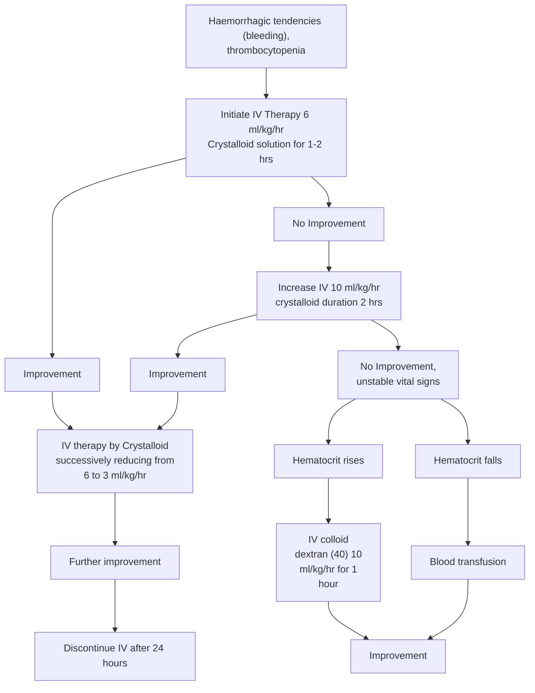

### DENGUE

Dengue is the most important emerging tropical viral disease of human beings in the world today. All four dengue virus (Dengue 1, 2, 3 and 4) infections may be asymptomatic, may lead to dengue fever (DF), dengue hemorrhagic fever (DHF) or when associated with plasma leakage may lead to hypovolemic shock and dengue shock syndrome (DSS).

21

Common Conditions

### Salient features

> - Dengue fever is an acute febrile illness of 2-7 days with two or more of the following manifestations. Headache, retro orbital pain, myalgia, arthralgia, rash.
> - Hemorrhagic manifestation (petechiae and positive tourniquet test) and Leucopenia

**Dengue hemorrhagic fever (DHF), if one or more of the following are present**

- Positive tourniquet test
- Petechiae, purpura or ecchymosis
- Bleeding from mucosa
- Haematemesis, melena
- Thrombocytopenia (platelets 100,000 cells/mm<sup>3</sup> or less) and evidence of plasma leakage.

**Dengue shock syndrome (DSS)**

- All the above criteria of DHF plus signs of circulatory failure.

Notes: The tourniquet test is performed by inflating a blood pressure cuff to mid way between the systolic and diastolic pressure.

**_Non pharmacological treatment_**

- Bed rest is advisable during the acute phase.
- Use cold sponging to keep temperature below 39ºC

**_Pharmacological treatment_**

- Management of dengue fever is symptomatic and supportive
- Antipyretics may be used to lower the body temperature. Aspirin/NSAIDs like ibuprofen etc should be avoided since it may cause gastritis, vomiting, acidosis and platelet dysfunction.
- Paracetamol is preferable in the doses as follows: 1-2 years: 60 –120 mg/doses, 3-6 years: 120 mg/dose, 7-12 years: 240 mg/dose, Adult : 500mg/dose
  Note: In children the dose is calculated as per 10mg/kg body weight per dose which can be repeated at the interval of 6 hrs.
- Oral fluid and electrolyte therapy are recommended for patients with excessive sweating or vomiting.
- Patients should be monitored in DHF endemic area until they become afebrile for one day without the use of antipyretics and after platelet and haematocrit determinations are stable, platelet count is more than 50,000/mm<sup>3</sup>.

**Management of Dengue Hemorrhagic Fever (Febrile Phase)**

- The management of febrile phase is similar to that of DF.
- Paracetamol is recommended to keep the temperature below 39ºC. Copious amount of fluid should be given orally, to the extent the patient tolerates, oral hydration solution (ORS), such as those used for the treatment of diarrhoeal diseases and/or fruit juices are preferable to plain water

22

Common Conditions

- IV fluid may be administered if the patient is vomiting persistently or refusing to feed.
- Patients should be closely monitored for the initial signs of shock. The critical period is during the transition from the febrile to the afebrile stage and usually occurs after the third day of illness.
- Serial haematocrit determinations are essential guide for treatment, since they reflect the degree of plasma leakage and need for intravenous administration of fluids.
- Haematocrit should be determined daily from the third day until the temperature has remained normal for one or two days. If haematocrit determination is not possible, haemoglobin determination may be carried out as an alternative.
- The details of IV treatment when required for patients are given in Figure 4.

### Figure 4. Treatment algorithm of dengue



23

Common Conditions

**Management of DHF Grade I and Grade II:**

- Any person who has dengue fever with thrombocytopenia and haemoconcentration and presents with abdominal pain, black tarry stools, epistaxis, bleeding from the gums and infection etc needs to be hospitalized.
- All these patients should be observed for signs of shock. The critical period for development of shock is transition from febrile to abferile phase of illness, which usually occurs after third day of illness.
- A rise of haemoconcentration indicates need for IV fluid therapy. If despite the treatment, the patient develops fall in BP, decrease in urine output or other features of shock, the management for Grade III/IV DHF/DSS should be instituted.
- Oral rehydration should be given along with antipyretics like paracetamol sponging, etc. as described above.
- The detailed treatment for patient with DHF Grade I and II is given at Figure 5. Common signs of complications are observed during the afebrile phase of DHF. Immediately after hospitalization, the haematocrit, platelet count and vital signs should be examined to assess the patient's condition and intravenous fluid therapy should be started. The patient requires regular and sustained monitoring.

**Figure 5. Volume replacement flow chart for patients with dengue haemorrhagic fever grade I and II**

```mermaid
graph TD
    A[UNSTABLE VITAL SIGNS<br/>Urine output falls signs of shock] --> B[Immediate rapid volume replacement: initiate IV therapy 10-<br/>20 ml/kg/hr crystalloid solution for 1 hrs]
    B --> C[Improvement]
    B --> D[No Improvement]
    C --> E[IV therapy by Crystalloid<br/>successively reducing from 20 to 10,<br/>10 to 6 and 6 to 3]
    E --> F[Further Improvement]
    F --> G[Discontinue IV after 24 hrs]
    D --> H[Oxygen]
    H --> I[Haematocrit Rises]
    H --> J[Haematocrit Falls Rapidly<br/>(Due to haemorrhage)]
    I --> K[IV Colloid (Dextran 40) or<br/>plasma 10 ml/kg/hr<br/>(10ml/kg/hr) as intravenous<br/>bolus (repeat if necessary)]
    J --> L[Blood transfusion<br/>(10ml/kg/hr)]
```

24

Common Conditions

**Fluid requirement**

- The volume of fluid required to be replaced should be just sufficient to maintain effective circulation during the period of plasma leakage. To ensure adequate fluid replacement and avoid over-fluid infusion, the rate of intravenous fluid should be adjusted throughout the 24 to 48 hour period of plasma leakage by periodic haematocrit determinations and assessment of vital signs.
- The required regimen of fluid should be calculated on the basis of body weight and charted on a 1-3 hourly basis, or more frequently in the case of shock. The flow of fluid and the time of infusion are dependent on the severity of DHF. The schedule given below is a guideline and calculated for moderate dehydration of about 6% deficit (plus maintenance) (Table 5).

**Table 5. Fluid requirement as per body weight of the patient**

<table>
  <thead>
    <tr>
        <th>Weight on admission (kg)</th>
        <th>Fluid requirement/kg body weight/day (ml/kg)</th>
    </tr>
  </thead>
  <tbody>
    <tr>
        <td>&lt;7</td>
        <td>220</td>
    </tr>
    <tr>
        <td>7-11</td>
        <td>165</td>
    </tr>
    <tr>
        <td>12-18</td>
        <td>130</td>
    </tr>
    <tr>
        <td>18</td>
        <td>90</td>
    </tr>
  </tbody>
</table>

- In older children who weigh more than 40 kg, the volume needed for 24 hours should be calculated as twice that required for maintenance (using the Holiday and Segar formula). The maintenance fluid should be calculated as follows:

**Table 6. Maintenance fluid requirement according to Holiday and Segar formula**

<table>
  <thead>
    <tr>
        <th>Body weight in kg</th>
        <th>Maintenance volume for 24 hours</th>
    </tr>
  </thead>
  <tbody>
    <tr>
        <td>&lt;10kg</td>
        <td>100 ml / kg</td>
    </tr>
    <tr>
        <td>10-20kg</td>
        <td>1000+50 ml / kg</td>
    </tr>
    <tr>
        <td>20kg</td>
        <td>1500+20 ml / kg</td>
    </tr>
  </tbody>
</table>

For a child weighing 40 kgs, the maintenance is: $1500 + (20 \times 20) = 1900$ ml. This means that the child requires 3800 ml IV fluid during 24 hours.

**Indications of red cell transfusion**

- Loss of blood (overt blood) -10% or more of total blood volume
- Preferably whole blood/ component to be used
- Refractory shock despite adequate fluid administration and declining haematocrit - replacement volume should be 10 ml/kg body wt at a time and coagulogram should be done.

25

Common Conditions

- If fluid overload is present, PCV is to be given

**Indications of platelet transfusion**

- In general there is no need to give prophylactic platelets even at less than 20,000 cells/mm<sup>3</sup>.
- Prophylactic platelet transfusion may be given at level of less than 10,000 cells/mm<sup>3</sup> in absence of bleeding manifestations.
- Prolonged shock; with coagulopathy and abnormal coagulogram.
- In case of systemic massive bleeding, platelet transfusion may be needed in addition to red cell transfusion.

