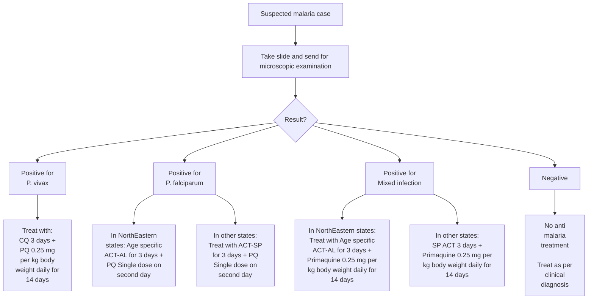
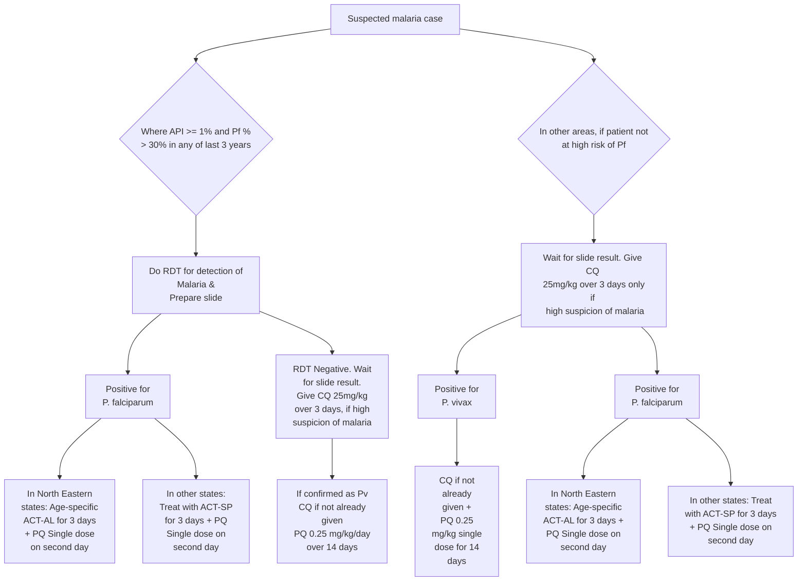
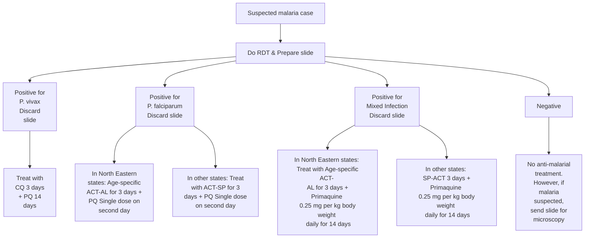

# MALARIA

Parastitic infection due to protozoa of genus _Plasmodium_ transmitted by the female anopheles mosquito. There are four plasmodia species: _Plasmodium falciparum_, _Plasmodium vivax_, _Plasmodium malaria_, _Plasmodium ovale_.

## Salient features

> - It is an acute and chronic illness characterized by paroxysms of fever, chills, sweats, fatigue, anemia and splenomegaly. _P. falciparum_ malaria (severe and complicated malaria) is associated in varying degrees with the following clinical signs.
> - Symptoms of cerebral malaria include mental clouding, coma, convulsions, delirium and occasionally localizing signs, hyperpyrexia (more than 40.5°C), haemolysis, oliguria, anuria, pulmonary edema and macroscopic haemoglobinuria.

## Investigations

Diagnosis is made by presence of protozoa in the blood in thick and thin smear slides (thick smear for easy detection of parasite and thin smear for identification of species).

Note: That blood films may be negative even in a severe attack because of parasites in the deep capillaries.

**Pharmacological treatment (Figure 1, 2 and 3)**

### Figure 1. Treatment where microscopy result is available within 24 hours

**ACT-AL** - Artemisinin-based Combination Therapy - Artemether - Lumefantrine
**ACT-SP** - Artemisinin-based Combination Therapy (Artesunate+Sulfadoxine-Pyrimethamine)
**CQ** - Chloroquine
**PQ** - Primaquine

18

Common Conditions

## Figure 2. Treatment where microscopy result is not available within 24 hours and monovalent RDT is used

API - Annual Parasite Incidence

**Note: If a patient has severe symptoms at any stage, then immediately refer to a nearest PHC or other health facility with indoor patient management or a registered medical doctor.**

**Note: PQ is contra-indicated in pregnancy and in children under 1 year (Infant).**

**ACT-AL** - Artemisinin-based Combination Therapy - Artemether - Lumefantrine
**ACT-SP** - Artemisinin based Combination Therapy (Artesunate + Sulfadoxine Pyrimethamine)
**CQ** - Chloroquine
**PQ** - Primaquine

## Figure 3. Treatment where microscopy result is not available within 24 hours and bivalent RDT is used

Where microscopy result is not available within 24 hours and Bivalent RDT is used

**Note: if a patient has severe symptoms at any stage, then immediately refer to a nearest PHC or other health facility with indoor patient management or a registered medical doctor.**

**Note: PQ is contra-indicated in pregnancy and in children under 1 year (Infant).**

**ACT-AL** - Artemisinin-based Combination Therapy - Artemether - Lumefantrine
**ACT-SP** - Artemisinin based Combination Therapy (Artesunate + Sulfadoxine Pyrimethamine)
**CQ** - Chloroquine
**PQ** - Primaquine

19

Common Conditions

### Treatment of _P.vivax_ malaria

- Tab. chloroquine: 25 mg/kg body weight divided over three days i.e.
  - 10 mg/kg on day 1
  - 10 mg/kg on day 2
  - 5 mg/kg on day 3
- Tab. primaquine: 0.25 mg/kg body weight daily for 14 days.
- Primaquine is contraindicated in infants, pregnant women and individuals with G6PD deficiency. 14 day regimen of primaquine should be given under supervision.

### Treatment of _P. falciparum_ malaria

- **Artemisinin based Combination Therapy (ACT-SP)** – Tab. artesunate 4 mg/kg body weight daily for 3 days plus sulfadoxine (25 mg/kg body weight) - pyrimethamine (1.25 mg/kg body weight) on first day.
- Tab. primaquine: 0.75 mg/kg body weight on day 2

### Treatment of mixed infections (_P.vivax_ + _P.falciparum_) cases

All mixed infections should be treated with full course of ACT and primaquine 0.25 mg per kg body weight daily for 14 days (Table 3).

**Table 3. Dosage schedule for treatment of mixed infection (_P.vivax_ + _P.falciparum_)**

<table>
  <thead>
    <tr>
        <th rowspan="2">Age</th>
        <th colspan="3">Day 1</th>
        <th colspan="2">Day 2</th>
        <th colspan="2">Day 3</th>
        <th>Days 4-14</th>
    </tr>
    <tr>
        <th>AS (50 mg)</th>
        <th>SP (500 mg + 25 mg)</th>
        <th>PQ (2.5 mg)</th>
        <th>AS tablet (50 mg)</th>
        <th>PQ (2.5 mg)</th>
        <th>AS tablet (50 mg)</th>
        <th>PQ (2.5 mg)</th>
        <th>PQ (2.5 mg)</th>
    </tr>
  </thead>
  <tbody>
    <tr>
        <td>Less than 1 yr</td>
        <td>1/2</td>
        <td>1/2</td>
        <td>0</td>
        <td>1/2</td>
        <td>0</td>
        <td>1/2</td>
        <td>0</td>
        <td>0</td>
    </tr>
    <tr>
        <td>1-4 years</td>
        <td>1</td>
        <td>1</td>
        <td>1</td>
        <td>1</td>
        <td>1</td>
        <td>1</td>
        <td>1</td>
        <td>1</td>
    </tr>
    <tr>
        <td>5-8 years</td>
        <td>2</td>
        <td>1.5</td>
        <td>2</td>
        <td>2</td>
        <td>2</td>
        <td>2</td>
        <td>2</td>
        <td>2</td>
    </tr>
    <tr>
        <td>9-14 years</td>
        <td>3</td>
        <td>2</td>
        <td>4</td>
        <td>3</td>
        <td>4</td>
        <td>3</td>
        <td>4</td>
        <td>4</td>
    </tr>
    <tr>
        <td>15 yrs or more</td>
        <td>4</td>
        <td>3</td>
        <td>6</td>
        <td>4</td>
        <td>6</td>
        <td>4</td>
        <td>6</td>
        <td>6</td>
    </tr>
  </tbody>
</table>
AS – artesunate, SP – sulfadoxine-pyrimethamine, PQ - primaquine

20

Common Conditions

### Treatment of complicated or severe malaria (Table 4)

#### Table 4. Treatment of severe and complicated malaria

<table>
  <thead>
    <tr>
        <th>Initial parenteral treatment for at least 48hrs. Choose any one of the following</th>
        <th>Follow-up treatment, when patient can take oral medications following parenteral treatment</th>
    </tr>
  </thead>
  <tbody>
    <tr>
        <td>**Quinine:** 20mg quinine salt/kg body weight on admission (IV infusion or divided IM injection) followed by maintenance dose of 10 mg/kg 8 hourly; infusion rate should not exceed 5 mg/kg per hour. Loading dose of 20mg/kg should not be given, if the patient has already received quinine.</td>
        <td>Quinine 10 mg/kg three times a day plus doxycycline 100 mg once a day or clindamycin in pregnant women and children under 8 years of age, to complete 7 days of treatment.</td>
    </tr>
    <tr>
        <td>**Artesunate:** 2.4 mg/kg IV or IM given on admission, then at 12 h and 24 h, then once a day or **Artemether:** 3.2 mg/kg IM given on admission then 1.6 mg/kg per day or **Arteether:** 150 mg daily IM for 3 days in adults only (not recommended for children).</td>
        <td>Treat with: ACT-SP for 3 days + PQ single dose on second day to complete 7 days of treatment.</td>
    </tr>
  </tbody>
</table>

**Note:** The parenteral treatment in severe malaria cases should be given for minimum of 24 hours once started (irrespective of the patient's ability to tolerate oral medication earlier than 24 hours).

#### Chemoprophylaxis of malaria

**Short term chemoprophylaxis (up to 6 weeks)**
**Doxycycline:** 100 mg once daily for adults and 1.5 mg/kg once daily for children (contraindicated in children below 8 years). The drug should be started 2 days before travel and continued for 4 weeks after leaving the malarious area.
**Chemoprophylaxis for longer stay (more than 6 weeks)**
**Mefloquine:** 250 mg weekly for adults and should be administered two weeks before, during and four weeks after exposure.

