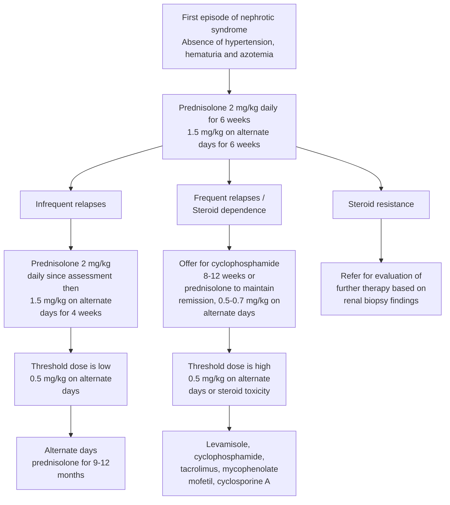

# NEPHROTIC SYNDROME

Nephrotic syndrome is an important chronic disorder in children. It can be primary (idiopathic) or secondary (SLE, Henoch Schonlein purpura, amyloidosis etc). About 90% children with idiopathic nephrotic syndrome have 'minimal lesion' on renal histology and respond promptly to corticosteroids. Approximately three fourth patients have one or more relapses. Steroid toxicity and frequent serious infection complicate such cases.

### Salient features

> - Heavy proteinuria, hypoalbuminemia (S, Albumin <2.5 g/dl), hyperlipidemia (S. cholesterol >200 mg/dl) and oedema. Dipstick or heat coagulation of urine shows 3+/4+ proteinuria.
> - Investigations which help in diagnosis and management are urine analysis, blood counts, S. cholesterol, S. proteins, blood urea, S.creatinine, urine culture, X-ray chest, Mantoux, HBsAg.

### _Pharmacological treatment_

Definitions useful for guiding treatment are as follows:

- Remission: Urine albumin nil or trace (or proteinuria <4 mg/m2/h) for 3 consecutive days.
- Relapse: Urine albumin 3+ or 4+ (or proteinuria >40 mg/m2/h) for 3 consecutive days having been in remission previously.
- Frequent relapses: Two or more relapses in six months of initial response, or more than three relapses in any twelve months.
- Steroid dependence: Two consecutive relapses when on alternate day steroids or within 14 days of its discontinuation.
- Steroid resistance: Absence of remission despite therapy with 4 weeks of daily prednisolone in a dose of 2 mg/kg per day

* **Steroid Sensitive Nephrotic Syndrome (SSNS)**

- **The first episode:** Prednisolone 2 mg/kg/day (or 60 mg/m2/day) after food for 6 weeks, followed by 1.5 mg/kg/alternate day (or 40 mg/m2/alternate day) for 6 weeks.
- **Infrequent relapses:** Prednisolone 2 mg/kg/day until remission followed by 1.5 mg/kg/day for 4 weeks.
- **Frequent relapses and steroid dependant (SDNS):** the following options are used successively.
- Prednisolone for achievement of remission followed by maintenance of a low dose (<than 0.5 mg/kg) on alternate day basis for 12-18 months.
- Levamisole 2.5 mg/kg/alternate day for 6 to 24 months. Monitoring of CBC is required 1-2 monthly.
- Cyclophosphamide (CP) 2-3 mg/kg/day for 2-3 months to achieve a cumulative dose of 168 mg/kg. CBC monitoring is required 1-2 weekly.
- Mycophenolate mofetil (MMF) 20-30 mg/kg/day
- Tacrolimus (TAC) 0.1- 0.2 mg/kg/day

404

Pediatric Conditions

- Cyclosporine A (CSA) 3-5 mg/kg day
- Rituximab (RTX) is a relatively new and potent therapy which is used only rarely for extremely difficult cases that does not respond to other options.
- Note: A renal biopsy is advised before starting TAC or CSA. Immuno-suppressive therapy requires supervision by paediatric nephrologist and monitoring of hemograms (for all), liver function (MMF and TAC) and glucose and magnesium levels (TAC), renal function (TAC and CSA) and drug levels (MMF, TAC, CSA).

**Figure 2. Treatment of steroid sensitive nephritic syndrome without hypertension, hematuria and azotemia**

### Supportive Treatment

- Detect and treat infections rapidly.
- Mobilize the patient early
- Antacids, H2 receptor blockers or proton pump inhibitors are often prescribed along with steroids but they are no definite evidence to support this in patients who do not have any symptoms of gastritis.
- Calcium and vitamin D supplements may be used to reduce osteopenic effects of steroids, however definitive evidence and guidelines are not yet available.
- Diet: Avoid excessive salt intake in edematous patient. A balanced diet with less than 30% fats and at least 2 gm/kg/day protein is advised.
- Edema should be treated cautiously with diuretics while closely monitoring hypovolemia and renal function.
- Hypovolemia should be detected rapidly and treated by fluids and colloids.
- Patients who are chronically nephritic may have hyperlipidemia which is managed by diet and if persistent, with statins.
- Hypertension should be controlled and BP maintained below 90th percentile of age.

405

Pediatric Conditions

- Complete immunization when the patient is in remission. Vaccinate for varicella and pneumococcus. Avoid live vaccines during immunosuppressive therapy and for 3 months after cessation.
- Stress dose of hydrocortisone (2-4 mg/kg/day) should be used in patients who have received high dose steroids for 2 weeks or more in the past year, when they present with serious infections or other critical illnesses, or if undergoing major surgery.

**Follow up and monitoring**

- Monitor urinary protein at home and attend if it is 2+ or more
- Monitor blood pressure, growth and eye examination yearly
- Urine output and weight record

**Parent education**

- Assurance that despite a relapsing course, progression to end stage renal disease is rare
- Urine examination by sulfosalicylic acid (SSA), dipstick or boiling should be taught.
- Maintain a diary showing proteinuria and medication received.
- Ensure normal activity.
- Protection against infection

