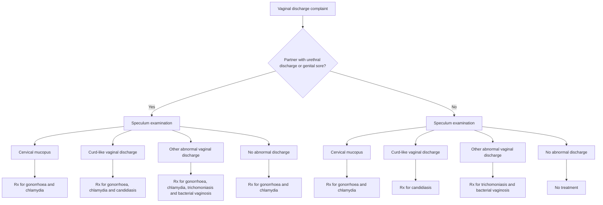

### VAGINAL DISCHARGE

Reproductive tract infections (RTI), including sexually transmitted infections (STI), represent a major public health problem. Syndromic management of symptomatic individuals is recommended. NACO algorithm for the management of vaginal discharge (Figure 1, Table 8):

266

Obstetrics and Gynecology

# Figure 1. NACO algorithm for the management of vaginal discharge

# Table 8. NACO algorithm for the management of vaginal discharge

There are seven pre-packed colour coded STI/RTI drug kits under NACP for syndromic management of STI/RTI and procured by NACO. These drug kits have been developed based on the National Guidelines on Prevention, Management and Control of Reproductive Tract Infections including Sexually Transmitted Infections, Ministry of Health & FW, August 2007. Syndromic Case Management Protocol

<table>
  <thead>
    <tr>
        <th>Kit No.</th>
        <th>Syndrome</th>
        <th>Colour</th>
        <th>Contents</th>
    </tr>
  </thead>
  <tbody>
    <tr>
        <td>Kit 1</td>
        <td>Cervicitis Urethral Discharge Presumptive treatment</td>
        <td>Grey</td>
        <td>T. Azithromycin 1 g (1) and T. Cefixime 400 mg (1)</td>
    </tr>
    <tr>
        <td>Kit 2</td>
        <td>Vaginitis</td>
        <td>Green</td>
        <td>T. Secnidazole 2g (1) and T. Fluconazole 150 mg (1)</td>
    </tr>
    <tr>
        <td>Kit 3</td>
        <td>Genital Ulcer Disease – Non Herpetic</td>
        <td>White</td>
        <td>Inj. Benzathine Penicillin 2.4 MU (1) and T. Azithromycin 1 g (1)</td>
    </tr>
    <tr>
        <td>Kit 4</td>
        <td>Genital Ulcer Disease – Non Herpetic (for patients allergic to Penicillin)</td>
        <td>Blue</td>
        <td>T. Doxycycline 100 mg (30) and T. Azithromycin 1 g (1)</td>
    </tr>
    <tr>
        <td>Kit 5</td>
        <td>Genital Ulcer Disease - Herpetic</td>
        <td>Red</td>
        <td>T. Acyclovir 400 mg (21)</td>
    </tr>
    <tr>
        <td>Kit 6</td>
        <td>Lower Abdominal Pain (PID)</td>
        <td>Yellow</td>
        <td>T. Cefixime 400 mg (1) and T. Doxycycline 100 mg (28) and T. Metronidazole 400 mg (28)</td>
    </tr>
    <tr>
        <td>Kit 7</td>
        <td>Inguinal Bubo</td>
        <td>Black</td>
        <td>T. Doxycycline 100 mg (42) and T. Azithromycin 1 g (1)</td>
    </tr>
  </tbody>
</table>

267

Obstetrics and Gynecology

