# <span style="color:red">STANDARD TREATMENT GUIDELINES</span>

## _A Manual for Medical Therapeutics_

### First Edition, 2013


### <span style="color:red">Gujarat Medical Services Corporation Limited</span>

## Health & Family Welfare Department

## Government of Gujarat

i

# Message

## (Health Minister)

ii

# Message

## (Principal Secretary)

iii

# Message

## (Commissionerate)

iv

# PREFACE TO FIRST EDITION

The _Rational Use of Medicines_ results into a more effective treatment at an affordable cost. Essential Medicines List (EML) and the Standard Treatment Guidelines (STG) are an important component of promoting rational use of medicines. Gujarat Medical Service Corporation Limited under the auspices of Department of Health & Family Welfare, Government of Gujarat finalizes EML and has undertaken the task to develop STG for the State. The objective is to improve the availability of quality drugs at each health facility and to achieve maximum public health improvement using available resources. B. J. Medical College & Civil Hospital, Ahmedabad has been instrumental in the preparation of the STG. An attempt has been made in this manual to provide guidelines for the treatment of common diseases, keeping in mind the rational use of medicines. It is a blend of evidence from standard text and reference books with consensus of specialists. The guidelines are comprehensive, concise and seek to summarize treatment plan for patients with priority diseases. It is assumed that the patient has been fully evaluated and all co-morbidities identified. Under each clinical condition, the treatment plan has been suggested that can be applied to average patient with common presentation. However, there may be great variations in patient presentation, their family history, treatment preferences and tolerance for different side effect. Therefore, these guidelines can be viewed as an expert consultation and weighed with respect to other information. Moreover, the recommendations do not replace clinical judgment nor encroach on clinical flexibility, which must be tailored to the particular needs of each clinical situation.

A large number of experienced clinicians have contributed in the preparation of these guidelines. The manual begins with a brief introduction to the concept of _Rational Use of Medicines_ along with its important components. This is followed by chapters on common diseases and emergency conditions which may be general to all specialties. Remaining chapters describe frequent clinical conditions in each specialty, for example ENT, Psychiatry, Obstetrics and Gynecology etc. The format of the guidelines includes important salient features, diagnostic tests followed by non-pharmacological, pharmacological treatment plan and patient education, if applicable. Medicines are mentioned in generic names and choice is based on the balanced criteria of efficacy, safety, suitability and cost.

This manual will be useful as ready reference for the health care providers and supply management staff. We hope this manual will help in pursuance of the objectives of _Rational Use of Medicines_ and make the treatment more specific and effective. We thank all the experts for sharing their valuable time and expertise in developing the book.

**Dr. Mira Desai**
**Dr. Samidh Shah**
**Dr. Geetha Iyer**

v

# ACKNOWLEDGEMENTS

The standard treatment guidelines have been developed after several meetings and discussions among the core committee members and expert clinicians. These guidelines include material from the many sources, recommendations and advice from numerous individuals.

We extend our sincere thanks to all those who have contributed as members, subject experts and provided technical and editorial expertise. The resident doctors from various departments have immensely helped in literature search, data entry, computer processing and communication with editors.

The contribution made by resident doctors Dr. R P. Pole, Dr. Saloni Shah, Dr. Trupal Solanki, Dr. Falguni Parmar, Dr. Dhaval Mistry, Dr. Mitali Desai, Dr Pinakin Patel, Dr. Abhinav Jain, Dr. Roopesh Singhal, Dr. Satyam Satyarth, Dr. Ravi Varmora, Dr. Hardik Rughwani, Dr. Mayank Andrepa, Dr Mayur Patil, Dr. Rachel Shah, Dr. Dharmesh Vaghasiya, Dr. Bhavik Prajapati, Dr. Nayan Pawnikar, Dr. Shailesh Patel, Dr. Jaydeep Odhvani, Dr. Pankaj Vyas and Dr. Dhrumil Patel are gratefully acknowledged.

Without their dedication, it might have not been possible to bring out this publication. Once again we express our heartfelt gratitude to the generous support given by each and every one of our team.

**_November, 2013_**
**_Ahmedabad_**
**Editors**

vi

# CONTRIBUTORS TO FIRST EDITION

**Core - Committee Members**

**Shri H. K. Patel**, Managing Director, GMSCL, Gandhinagar
**Dr. A. B. Solanki**, General Manager, GMSCL, Gandhinagar
**Dr. B. J. Shah**, Dean, B. J. Medical College, Ahmedabad
**Dr. Kamlesh Parmar**, MO, Gandhinagar
**Dr. Mira Desai**, Professor & Head, Department of Pharmacology, B. J. Medical College & Civil Hospital, Ahmedabad Ahmedabad

**Medicine**

**Dr. Asha Shah**, Professor & Head, Department of Medicine, B. J. Medical College & Civil Hospital, Ahmedabad
**Dr. B. K. Amin**, Additional Professor, Department of Medicine, B. J. Medical College & Civil Hospital, Ahmedabad
**Dr. B. B. Solanki**, Additional Professor, Department of Medicine, B. J. Medical College & Civil Hospital, Ahmedabad
**Dr. K. J. Upadhyay**, Additional Professor, Department of Medicine, B. J. Medical College & Civil Hospital, Ahmedabad
**Dr. Shivani Patel**, Associate Professor, Department of Medicine, B. J. Medical College & Civil Hospital, Ahmedabad

**Emergency Medicine**

**Dr. Samira Parikh**, Professor & Head, Department of Emergency Medicine, B. J. Medical College & Civil Hospital, Ahmedabad
**Dr. Nilima Shah**, Professor & Head, Department of Emergency Medicine, B. J. Medical College & Civil Hospital, Ahmedabad
**Dr. Shruti Sangani**, Professor & Head, Department of Emergency Medicine, B. J. Medical College & Civil Hospital, Ahmedabad

**Surgery**

**Dr. P. N. Kantharia**, Professor, Department of Surgery, B. J. Medical College & Civil Hospital, Ahmedabad
**Dr. Subham Negi**, Assistant Professor Department of Surgery, B. J. Medical College & Civil Hospital, Ahmedabad

**Pharmacology**

**Dr. Mira Desai**, Professor & Head, Department of Pharmacology, B. J. Medical College & Civil Hospital, Ahmedabad
**Dr. Samidh Shah**, Assistant Professor, Department of Pharmacology, B. J. Medical College & Civil Hospital, Ahmedabad
**Dr. Geetha Iyer**, Assistant Professor, Department of Pharmacology, B. J. Medical College & Civil Hospital, Ahmedabad

vii

**Obstetrics and Gynecology**

**Dr. Malini R. Desai** Professor & Head, Department of OB & Gy, B. J. Medical College & Civil Hospital, Ahmedabad
**Dr. Tejal L. Patel**, Associate Professor, Department of OB & Gy, B. J. Medical College & Civil Hospital, Ahmedabad
**Dr. Dhaval Swaminarayan**, Assistant Professor, Department of OB & Gy, B. J. Medical College & Civil Hospital, Ahmedabad
**Dr. Pallavi Ninama**, Assistant Professor, Department of OB & Gy, B. J. Medical College & Civil Hospital, Ahmedabad
**Dr. Shirish Toshniwal**, Assistant Professor, Department of OB & Gy, B. J. Medical College & Civil Hospital, Ahmedabad

**Dermatology**

**Dr. Kirti Parmar**, Associate Professor, Department of Dermatology, B. J. Medical College & Civil Hospital, Ahmedabad
**Dr. Rima Joshi**, Assistant Professor, Department of Dermatology, B. J. Medical College & Civil Hospital, Ahmedabad
**Dr. Brijesh Parmar**, Assistant Professor, Department of Dermatology, B. J. Medical College & Civil Hospital, Ahmedabad

**Ophthalmology**

**Dr. Mariam Mansuri**, Professor and Head of Unit- Glaucoma, M & J Institute of Ophthalmology, Civil Hospital, Ahmedabad.
**Dr. Purvi Bhagat**, Associate Professor, M & J Institute of Ophthalmology, Civil Hospital, Ahmedabad.
**Dr. Rupal Bhatt**, Assistant Professor, M & J Institute of Ophthalmology, Civil Hospital, Ahmedabad.
**Dr. Pooja Negi**, Tutor, M & J Institute of Ophthalmology, Civil Hospital, Ahmedabad.
**Dr. Kalpit Shah**, Assistant Professor, M & J Institute of Ophthalmology, Civil Hospital, Ahmedabad.

**Psychiatry**

**Dr. G.K. Vankar**, Professor & Head, Department of Psychiatry, B. J. Medical College & Civil Hospital, Ahmedabad
**Dr. Minakshi Parikh**, Professor, Department of Psychiatry, B. J. Medical College & Civil Hospital, Ahmedabad

**Orthopedics**

**Dr. M.M. Prabhakar**, Professor & Head, Department of Orthopedics, Superintendent Director, paraplegia, B. J. Medical College & Civil Hospital, Ahmedabad
**Dr. G D Tharadara**, Additional Professor, Department of Orthopedics, B. J. Medical College & Civil Hospital, Ahmedabad

viii

**ENT**

**Dr. Rajesh Vishwakarma**, Professor, Department of ENT, B. J. Medical College & Civil Hospital, Ahmedabad

**Dr Kalpesh Patel**, Assistant Professor, Department of ENT, B. J. Medical College & Civil Hospital, Ahmedabad

**Dr. Dipesh Darji**, Assistant Professor, Department of ENT, B. J. Medical College & Civil Hospital, Ahmedabad

**TB and Chest Diseases**

**Dr. Rajesh N. Solanki**, Additional Professor, Department of Pulmonary Medicine, B J Medical College and Civil Hospital, Ahmedabad

**Dr. Amit R. Dedun**, Assistant Professor, Department of Pulmonary Medicine, B J Medical College and Civil Hospital, Ahmedabad

**Dr. (Mrs.) Purvi Nayak**, Medical Officer (Drug Resistance TB), State TB Training and Demonstration Center, Ahmedabad

**Paediatrics**

**Dr. Bela Shah**, Additional Professor, Department of Paediatrics, B. J. Medical College and Civil Hospital, Ahmedabad.

**Dr. Gargi Pathak**, Additional Professor, Department of Paediatrics, B. J. Medical College and Civil Hospital, Ahmedabad.

**Dr. Bharat Parmar**, Professor, Department of Paediatrics, B. J. Medical College and Civil Hospital, Ahmedabad.

**Dental**

**Dr. Piyush Limdiwala**, Assistant Professor, Oral Medicine & Radiology Department, Government Dental College & Hospital, Ahmedabad

**Dr. Janki Shah**, Assistant Professor, Department of Preventive & Community Medicine, Government Dental College & Hospital, Ahmedabad.

**Dr. Girish Parmar**, Dean, Government Dental College & Hospital, Ahmedabad

ix

# LIST OF ABBREVIATIONS

AED: Automated External Defibrillator
AHA: American Heart Association
APACHE: Acute Physiology and Chronic Health Evaluation
APTT: Activated Partial Thromboplastin Time
BERA: Brainstem Evoked Response Audiometry
BPS: Bio Physical Profile Scoring
CIN: Cervical Intraepithelial Neoplasia
CRP: C - reactive protein
CRT: Corneal Refractive Therapy
CT-IVP: Computed Tomography Intravenous Pyelogram
DMPA: Depot Medroxy Progesterone Acetate
DMSA: Dimercapto Succinic Acid
ELISA: Enzyme-Linked Immunosorbent Assay
FDP: Fibrin Degradation Product
FML: Flurometholone Ophthalmic Suspension
FTA-ABS: Fluorescent Treponemal Antibody-Absorption
HPV: Human Papilloma Virus
LNG IUCD: Levonornestrel Intra Uterine Contraceptive Device
LR SHUNT: Left to Right Shunt
LSD: Lysergic Acid Diethylamine
MHA-TP: Microhemagglutination Assay Treponema Pallidum
NCHS: National Center For Health Statistics
NET-EN: Norethisterone Enanthate
NLEP: National Leprosy Eradication Programme
NPSP: National Polio Surveillance Project
NST: Non Stress Test
PAIR: Puncture, Aspiration, Injection (Of A Scolicidal Agent), Reaspiration
PC: Product Code
PDA: Patent Ductus Arteriosus
PEA: Pulseless Electrical Activity
PET: Positron Emission Tomography
PWB: Patient Wise Box

x

RDA: Recommended Daily Allowance
RPR: Rapid Plasma Regain
S.PSA: Serum Prostate Specific Antigen
SLE: Systemic Lupus Erythematosus
TAPP: Trans Abdominal Preperitoneal Meshplasty
TEP: Totally Extra Peritoneal Meshplasty
TMJ: Temporo Mandibular Joint
TMT: Trabecular Meatel Technology
TPHA: Treponema Pallidum Haemagglutination Assays
TT: Tetanus Toxoid
USAID: Us Agency For International Development
USG-Kub: Ultrasonogram Kidney Ureter Bladder
VDRL: Venereal Disease Research Laboratory,

xi

# INDEX

<table>
  <thead>
    <tr>
        <th>Topic</th>
        <th>Page No.</th>
    </tr>
  </thead>
  <tbody>
    <tr>
        <td>**1. Introduction to Rational Use of Medicines**<br/>Concept of essential medicines, Standard treatment guidelines, Drug formulary, Rational approach to therapeutics, Adverse drug effects and drug interactions, Prescription writing</td>
        <td>1</td>
    </tr>
    <tr>
        <td>**2. Common Conditions**<br/>fever, Fever of unknown origin, Acute rheumatic fever, Anaemia, Typhoid fever, Malaria, Dengue, Chikungunya, Tuberculosis and RNTCP, Epilepsy, Status epilepticus, Urinary tract infection</td>
        <td>11</td>
    </tr>
    <tr>
        <td>**3. Emergency Conditions**<br/>Cardiopulmonary resuscitation, Anaphylaxis, Acute airway obstruction, Stridor, Shock, Fluid and electrolyte imbalance, Septicemia, Organophosphorus poisoning, Kerosene and petrol poisoning, Datura poisoning, Abdominal injury, Foreign body in ear, Chemical injuries of the eye, Corneal and conjunctival foreign bodies, Traumatic hyphema, Animal bites- Dog bite, Snake bite, Insect and Arachnid bites, Scorpion bite</td>
        <td>47</td>
    </tr>
    <tr>
        <td>**4. Cardiovascular Diseases**<br/>Infective endocarditis, Acute pericarditis, Cardiomyopathy, Hypertension, Angina pectoris, Myocardial infarction, Congestive heart failure, Arrhythmias, Ventricular tachycardia, Atrial fibrillation, bradyarrhythmias</td>
        <td>80</td>
    </tr>
    <tr>
        <td>**5. Central Nervous System Diseases**<br/>Migraine, Tension headache, Cluster headache, Stroke, Facial palsy, Parkinson’s disease, Dementia, Guillain- Barre Syndrome, Acute bacterial meningitis, Viral encephalitis, Neurocysticercosis, Paraplegia and quadriplegia, Vertigo</td>
        <td>91</td>
    </tr>
    <tr>
        <td>**6. Genitourinary Diseases**<br/>Nephrotic syndrome, Chronic kidney disease, Acute renal failure, Hypokalemia, Hyperkalemia</td>
        <td>107</td>
    </tr>
    <tr>
        <td>**7. Endocrine Diseases**<br/>Hypothyroidism, Hyperthyroidism, Hypocalcemia, Hypercalcemia, Diabetes mellitus, Diabetes ketoacidosis</td>
        <td>112</td>
    </tr>
  </tbody>
</table>

xii

<table>
  <thead>
    <tr>
        <th>Topic</th>
        <th>Page No.</th>
    </tr>
  </thead>
  <tbody>
    <tr>
        <td>**8. Gastrointestinal Diseases**<br/>Aphthous ulcers, Dyspepsia, Peptic ulcer disease, Vomiting, Irritable bowel syndrome, Acute gastroenteritis, Ulcerative colitis, Gastroesophageal reflux disorder, Upper gastrointestinal bleeding, Acute pancreatitis, Chronic pancreatitis, Constipation, Amoebic liver abscess, Pyogenic liver abscess</td>
        <td>**125**</td>
    </tr>
    <tr>
        <td>**9. Infections**<br/>Tetanus, Leptospirosis, Cholera, Influenza infection, HIV and AIDS, Opportunistic infections, Amoebiasis, Giardiasis, Hookworm infestation, Roundworm infestation, Enterobiasis, Filariasis</td>
        <td>**138**</td>
    </tr>
    <tr>
        <td>**10. ENT Diseases**<br/>Ear wax, Keratosis obturans, Furuncle, Otomycosis, Malignant otitis externa, Acute suppurative otitis media, Chronic suppurative otitis media, Serous otitis media, Acute sinusitis, Epistaxis, Allergic rhinitis, Common cold, Furunculosis of nose, Acute tonsillitis, Chronic tonsillitis, Acute parotitis, Bacterial parotitis</td>
        <td>**156**</td>
    </tr>
    <tr>
        <td>**11. Eye Diseases**<br/>Stye, Chalazion, Viral conjunctivitis, Allergic conjunctivitis, Atopic conjunctivitis, Non gonococcal conjunctivitis, Gonococcal conjunctivitis, Trachoma, Corneal Ulcer, Bacterial keratitis, Fungal keratitis, Viral keratitis, Glaucoma, Primary open angle glaucoma, Primary angle closure glaucoma, Lens induced glaucoma, Anterior Uveitis, Orbital cellulitis, Endophthalmitis, Optic neuritis, Diabetic retinopathy, Retinal detachment, Vitamin A deficiency, Senile cataract, Refractive errors, Strabismus, Computer vision syndrome</td>
        <td>**169**</td>
    </tr>
    <tr>
        <td>**12. Skin Diseases**<br/>Bacterial skin infections, Leprosy, Cutaneous tuberculosis, Scabies, Pediculosis, Myiasis, Pityrosporum infections, Pityriasis, Tinea corporis, Capitis, Onychomycosis, Candidiasis, Diaper dermatitis, Herpes labialis, Chickenpox, Herpes zoster, Molluscum contagiosum, Wart, Acne vulgaris, Miliaria, Eczema, Contact dermatitis, Pityriasis alba, Vitiligo, Albinism, Melasma, Urticaria, Psoriasis, Lichen planus, Alopecia areata, Pemphigus vulgaris, Cutaneous reactions to drugs, Herpes genitalis, Syphilis, Chancroid, Lymphogranuloma venerum, Urethral discharge, Dermatological emergencies</td>
        <td>**196**</td>
    </tr>
  </tbody>
</table>

xiii

<table>
  <thead>
    <tr>
        <th>Topic</th>
        <th>Page No.</th>
    </tr>
  </thead>
  <tbody>
    <tr>
        <td>**13. Obstetrics and Gynecology**<br/>Normal Pregnancy, Nausea and vomiting in pregnancy, First trimester bleeding, Anaemia in pregnancy, Pregnancy induced hypertension, Pregnancy with diabetes, Pregnancy with heart disease, Antepartum haemorrhage, Premature rupture of membranes, Preterm labour, Normal labour, Fetal distress in labour, Meconium stained liquor, Induction and augmentation of labour, Postpartum haemorrhage, Prevention of maternal to child transmission, Vaginal discharge, Pelvic inflammatory disease, Pre-Menstrual syndrome, Dysfunctional uterine bleeding , Menopause, Postmenopausal bleeding, Screening guidelines for early detection of cancer, Contraception</td>
        <td>229</td>
    </tr>
    <tr>
        <td>**14. Psychiatry Disorders**<br/>Schizophrenia and other psychotic disorders, Major depressive disorders, Bipolar mood disorder, Insomnia, Generalized anxiety disorders, Panic disorder, Obsessive compulsive disorder, Phobic disorder, Post-traumatic stress disorder, Conversion disorder, Dissociative disorder, Alcohol use disorder, Opioid use disorder, Cannabis use disorder, Autistic disorder, Attention deficit hyperactivity disorder, Mental retardation, Suicidal patient, Psychotropic drugs in special population, Management of wandering mentally ill patient, Personality disorder.</td>
        <td>284</td>
    </tr>
    <tr>
        <td>**15. Orthopedic Conditions**<br/>Osteoarthritis, Rheumatoid arthritis, Cervical and lumbar spondylosis, Sprains, Acute pyogenic osteomyelitis, Acute septic arthritis.</td>
        <td>308</td>
    </tr>
    <tr>
        <td>**16. Surgery**<br/>Pre-operative assessment and preparations, Post-operative care, Surgical site infection, Wound care, Sterilization and disinfection, Suturing of primary wound, Acute appendicitis, Hernia, Hydrocele, Cholelithiasis, Hydatid disease of liver, Obstructive jaundice, Intestinal obstruction, Typhoid perforation, Small bowel tuberculosis, Anal fissure, Fistula in ano, Hemorrhoids, Diabetic foot, Varicose veins, Deep vein thrombosis, Cervical lymphadenopathy, Thyroid nodule, Benign breast diseases, Breast abscess, Carcinoma breast, Renal stones, Urinary retention</td>
        <td>317</td>
    </tr>
  </tbody>
</table>

xiv

<table>
  <thead>
    <tr>
        <th>Topic</th>
        <th>Page No.</th>
    </tr>
  </thead>
  <tbody>
    <tr>
        <td>**17. Respiratory Diseases**<br/>Community acquired pneumonia, Hospital acquired pneumonia, Bronchial asthma, Chronic obstructive pulmonary diseases, Bronchiectasis</td>
        <td>**348**</td>
    </tr>
    <tr>
        <td>**18. Pediatrics**<br/>Newborn care, Low birth weight baby, Neonatal jaundice, Management of common clinical problems in new born, Immunization schedule, Fluid and electrolyte therapy in children, Iron deficiency anemia, Megaloblastic anemia, Protein energy malnutrition, Nutritional rickets, Pica, Primary nocturnal enuresis, Wheezy child, Acute bronchiolitis, Pneumonia, Thrush (oral candidiasis), Constipation, Acute diarrhea, Acute viral hepatitis, Chicken pox(varicella), Measles, Mumps, Acute flaccid paralysis, Pertusis, Cardiac failure, Diabetes mellitus, Hypothyroidism, Urinary tract infection, Post streptococcal acute glomerulonephritis, Nephrotic syndrome, Febrile seizure, Acute pyogenic meningitis, Tubercular meningitis, Status epilepticus, Hypovolemic shock, Diphtheria, Severe malaria, Hypertensive encephalopathy, Acute severe asthma</td>
        <td>**365**</td>
    </tr>
    <tr>
        <td>**19. Dental Conditions**<br/>Tooth avulsion, Toothache, Tooth/maxillary fracture, Dental caries, Dental abscess, Adult type periodontitis, Juvenile periodontitis, Inflammatory gingival enlargement, Dental fluorosis, Trigeminal neuralgia, Oral submucous fibrosis, Cyst of tumor of jaw, Oral hygiene, Antibiotic prophylaxis in dental procedure</td>
        <td>**416**</td>
    </tr>
  </tbody>
</table>

xv

**Chapter 1**

# INTRODUCTION TO RATIONAL USE OF MEDICINES

_Rational Use of Medicines_ requires that patients receive medications appropriate to their clinical needs, in doses that meet their own individual requirements, for an adequate period of time, and at affordable cost to them and the community (WHO, 1985). In other words, <mark>rational use means ‘prescribing right medicines, in adequate dose for the sufficient duration and appropriate to the clinical needs of the patient at lowest cost’</mark>. Medicine use is a complex cyclical process and in the clinical context, rational drug use implies correct drug, appropriate indication and selection with respect to efficacy, safety, suitability for the patient and cost. The concept of _Rational Use of Medicines_ is age old; however, it has attained more significance and momentum in terms of medical and socioeconomic aspects recently. Three tools have been identified to implement _Rational Use of Medicines_ effectively. These include Essential Medicines List, Standard Treatment Guidelines and Drug Formulary. To be meaningful, all three tools should work in concert and subject for periodic review and update.

### I. The concept of Essential Medicines

Essential Medicines (EM) are those that satisfy the health care needs of the majority of the population and therefore should be available at all times in appropriate amounts and in appropriate dosage forms. Following the concept of EM, WHO published the first Essential Medicine List (EML) in 1977, which has been updated successively every 5 year in view of changing world scenario about the medical needs and availability of new and better drugs. The selection of these medicines is based on public health relevance, evidence of efficacy and safety and comparative cost-effectiveness. These priority medicines should be available at each functioning health care facility with assured quality and adequate information at a price the individual and the community can afford.

The selection of essential medicines depends upon level of health care facility, adequate data on the efficacy, safety, suitability and comparative cost effectiveness of available treatments. In addition, stability of the product, need for special diagnostic or treatment facilities and pharmacokinetic properties are also considered. Most essential medicines are formulated as single compound. However, fixed dose combinations are selected only when it has proven pharmacokinetic and/or pharmacodynamic advantages over single compound administered separately. While comparing the cost of medicines among the alternative treatments, the cost of total treatment and not the unit cost is considered. Other factors taken into account include pattern of diseases, treatment facilities, training and experience of the available personnel, financial resources etc.

#### Advantages of Essential Medicines

The implementation of the concept of EM has several logistic and prescribing advantages. For example better management of medicines i.e. easier procurement, storage,

1

_Introduction to Rational Use of Medicines_

distribution, more manageable stock, better quality assurance, easier dispensing, less fragmentation of budget with improve drug availability. Moreover, prescribing improves due to focused training and drug information, better recognition of adverse drug reactions, drug interactions and focused education efforts. The list of EM closely relates to treatment guidelines for clinical diseases and is also used for the procurement and supply of medicines in public sector, schemes for reimburses medicines costs and local medicine production.

Its implementation is intended to be flexible and adaptable to different situations; which medicines are regarded as essential remains a national responsibility.

## II. Standard Treatment Guidelines

Standard Treatment Guidelines (STGs), treatment protocols, and prescribing policies are defined as systematically developed statements designed to assist prescribers in making decisions about the appropriate treatment and health care for specific clinical problem. These guidelines usually reflect the consensus on the optimal treatment options within a health facility or system. In fact, they represent one of the approaches to promote therapeutically effective and economically efficient use of medicines.

STGs list the preferred pharmacological and non-pharmacological treatment for common health problems experienced by people in a specific health system. The pharmacological treatment should include the name, dosage form, strength, average dose (pediatric and adult), number of doses per day, and duration of treatment. Other information on diagnosis and advice to the patient may also be included. The most common diseases and serious medical conditions that have high morbidity and mortality rate are selected. Treatment guidelines must have the most up-to-date and evidence based information to determine appropriate treatment options by expert authors and reviewers. Effective implementation, however, is perhaps the greatest challenge in introducing STGs. When implemented effectively, it offers several advantages to patients, health care providers, supply management personnel and policy makers as follows:

_Patients,_

- Most cost-effective optimal therapy is provided.
- Better compliance through consistency among prescribers.
- Improvement in availability of drugs.
- Overall better quality of care.

_Health care providers,_

- Provides standardized guidance to practitioners
- Quality of care standard- based on expert consensus and basis for monitoring
- Utilizes only formulary or essential medicines, so the health care system needs to provide only the medicines in the STGs.

_Supply managers,_

- Identification of medicines to be available for the most commonly treated problems.

2

_Introduction to Rational Use of Medicines_

- Facilitation of prepackaging of course-of-therapy quantities of commonly prescribed items.
- Medicine demand more predictable, so forecasting more reliable

_Health care policy makers,_

- Provides focus therapeutic integration of special programs (diarrhea disease control, acute respiratory infection)
- Provides a system for controlling cost by using funds more efficiently

STGs also have certain drawbacks. Establishing, developing and implementation of STGs is a difficult, lengthy and time consuming process. Moreover, it needs to be updated regularly to reflect changes in treatment strategies. If a regular schedule for updating the STGs is not followed, they lose credibility and become obsolete. The extent of information to be provided in each medical condition is often a difficult decision. However, the STG manual should be concise and small enough to carry it easily.

**Key features of a successful STG manual**
_Simplicity_- The number of health problem is limited to commonly observed conditions. Each clinical condition list a few salient features with clear and concise information on pharmacological and non- pharmacological treatment.
_Credibility_- Guidelines developed by the most respected experienced clinicians in the country and revision is based on actual experience.
_Treatment standards for all levels of health care facility_- Health care providers use the same standard treatment; however, the referral criterion differs. While the first choice treatment for a patient depends upon the patient’s diagnosis and condition and not on the prescriber.
_Medicine supply based on standards_- The supply of medicines must match with the standard treatment and list of essential medicines.
_Regular updating_- Any change in the therapeutic options, bacterial resistance pattern should be incorporated in the revised version to reflect current recommendations.
_User friendly_- The STGs should be published as small, durable pocket manual which make it convenient to carry and use.

### III. Drug Formulary

A formulary is a compendium of practical drug information for clinical practice adapted for use at a particular health care facility. It is a ready reference to key information on the selection, prescribing, dispensing and administration of medicines. Although the concept of formulary is old, a drug formulary is considered an essential element in achieving rational prescribing in addition to controlling the costs. The task of development of a formulary in a hospital is usually undertaken by Drugs and Therapeutics Committee with a multidisciplinary membership of doctors, pharmacists, nurses and administrative staff.

3

_Introduction to Rational Use of Medicines_

The consultants place a request for inclusion of medicines along with its dosage formulations to Drugs and Therapeutics Committee. The committee may accept the request and include it in formulary or reject and suggest an alternative with information to the prescriber. The committee then monitors the impact, cost and benefits of various medicines in the health care facility. Depending on the outcome, the use of medicine is extended or curtailed. Formularies have significant advantages for patients care. However, the introduction of formularies may cause friction since it may be viewed as a major threat to their clinical freedom. Effective multidisciplinary working methods and consultation is needed to overcome this attitude. Potential advantages and disadvantages of drug formularies are as follows:

**Advantages**

- Reduces range of products to be purchased / stored / distributed
- Encourages generic prescribing
- Lowers drug costs
- Improved knowledge of a limited number of medicines
- Improves drug safety
- Improves patient care
- Provides opportunity for multidisciplinary work

**Disadvantages**

- Restricts prescribing choice
- Reduces treatment options
- Inhibits introduction of new products
- Restricts research efforts

## IV. Rational Approach To Therapeutics

Medicines should only be prescribed when necessary, and the benefit of administering the medicine should be considered in relation to the risks involved. Bad prescribing habits lead to ineffective and unsafe treatment, exacerbation or prolongation of illness, distress and harm to the patient, and higher cost. _The Guide to Good Prescribing; WHO; 1994_, provides medical undergraduates with important tools for training in the process of rational prescribing.

The following steps will help to remind prescribers of the rational approach to therapeutics.

### 1. Define the patient's problem

Whenever possible, making the right diagnosis is based on integrating many pieces of information: the complaint as described by the patient; a detailed history; physical examination; laboratory tests; X-rays and other investigations. This will help in rational prescribing, always bearing in mind that disease are evolutionary process.

4

_Introduction to Rational Use of Medicines_

**2. Specify the therapeutic objective**
Doctors must clearly state their therapeutic objectives based on the pathophysiology underlying the clinical situation. Very often physicians must select more than one therapeutic goal for each patient.

**3. Selecting therapeutic strategies**
The selected strategy should be discussed with the patient. The selected treatment can be non-pharmacological and/or pharmacological; it also needs to take into account the total cost of all therapeutic options.

**a. Non-pharmacological treatment**
The patient does not always need a medicine for treatment of the condition. Very often, health problems can be resolved by a change in life style, dietary habits, use of physiotherapy or exercise, provision of adequate psychological support and other non-pharmacological treatments; they have the same importance as a prescription drug and instructions must be written, explained and monitored in the same way.

**b. Pharmacological treatment**
_Selecting the correct group of drugs_
Knowledge about the pathophysiology involved in the clinical situation of each patient and the pharmacodynamics of the chosen group of drugs, are two of the fundamental principles for rational therapeutics.

_Selecting the drug from the chosen group_
The selection process must consider benefit/risk/cost information. This step is based on evidence about maximal clinical benefits of the drug for a given indication (efficacy) with minimum production of adverse effects (safety).

It must be remembered that each drug has adverse effects and it is estimated that up to 10% of hospital admissions in industrialized countries are due to adverse effects. Not all drug-induced injury can be prevented but much of it is caused by inappropriate selection of drugs.

In cost comparisons between drugs, the cost of total treatment and not only the unit cost of the drug must be considered.

_Verifying the suitability of the chosen pharmaceutical treatment of each patient_
The prescriber must check suitability of the chosen active substance, its dosage form, dosage schedule and duration of treatment are suitable for each patient. Drug treatment should be individualized to the needs of each patient.

_Prescription writing_
The prescription is the link between the prescriber, the pharmacist (or dispenser) and the patient so it is important for successful management of presenting medical condition. The item is covered in more detail in the following section.

_Giving information, instructions and warnings_
This step is important to ensure patient adherence and is covered in detail in the following section.

5

_Introduction to Rational Use of Medicines_

_Monitoring treatment_
Evaluation of the follow up and the outcome of treatment provides information whether the patient’s problem is solved or to reformulate, if necessary. This step gives rise to important information about the effects and adverse effects of medicines, contributing to the evidence of knowledge, necessary to promote the rational use of drugs.

### V. Adverse Drug Effects and Drug Interactions

**Adverse drug reactions**
An adverse drug reaction (ADR) may be defined as ‘_A response to a drug which is noxious, unintended and occurs at doses normally used for prophylaxis, diagnosis or therapy of disease, or for the modification of physiological function_’. ADRs are therefore unwanted or unintended effects of a medicine, including idiosyncratic effects, which occur during its proper use.

An adverse drug event (ADE) is defined as ‘_Any untoward medical occurrence that may present during treatment with a medicine but which does not necessarily have a causal relationship with this treatment_’.
Two types of ADRs and their differentiating characteristics have been identified. The common, predictable, dose related reaction with low mortality is type ‘A’ ADR. For example, anticholinergic effect of tricyclic antidepressants and digoxin toxicity. ADRs may also be unrelated to the known pharmacological action of a drug. These are uncommon, non-dose related bizarre ‘B’ type reactions, for example, anaphylaxis with penicillins, malignant hyperthermia with halothane.
Thalidomide marked the first recognized public health disaster related to the introduction of a new drug. It is now recognized that clinical trials, however through, cannot be guaranteed to detect all adverse effects likely to be caused by a drug. Health workers are thus encouraged to record and report to their national pharmacovigilance centre any unexpected adverse effects with any drug to achieve faster recognition of serious related problems. The Central Drugs Standard Control Organization (CDSCO), Director General of Health Services under the influence of Ministry of Health & Family Welfare, has initiated a nationwide Pharmacovigilance programme for protecting the health of the patients by assuring drug safety.
The specific aims and objectives of the National Pharmacovigilance Programme are:

- To monitor ADRs in Indian population.
- To create awareness amongst health care professionals about the importance of ADR reporting in India
- To ensure that the benefits of use of medicine outweighs the risks and thus safeguard the health of the Indian population
- To generate independent, evidence based recommendations on the safety of medicines

6

_Introduction to Rational Use of Medicines_

- To encourage safe, rational and cost effective use of medicines.

Under the National Coordinating Center, several ADR monitoring centers operates to detect ADEs. These ADR monitoring centers are located at MCI approved medical colleges and hospitals, private hospitals, public health programmes, and autonomous institutions such as Indian Council of Medical Research etc. The ADR monitoring centers record and analyze the ADEs and submit them to the National Coordinating center via online reporting system known as Vigiflow.

### Spontaneous reporting

Spontaneous reporting is the reporting of ADRs by healthcare professionals (and in some countries consumers) to identify and report any suspected adverse drug reaction to a pharmacovigilance center and/or to the manufacturer. It is one of the important methods of collecting information about ADRs.

All suspected adverse reactions, known or unknown, serious or otherwise should be reported. It is important to report even minor reactions of new drugs. For established drugs, the reporting of serious ADRs is important. An increased frequency of a known ADR to a drug is also important.

Adverse drug reactions may be reported or notified to the nearest ADR monitoring centre under the National Pharmacovigilance Program. The Department of Pharmacology, B. J. Medical College is one of the approved ADR monitoring center in Gujarat state. The ADRs can be reported by the forms available at the department. Reporting is the process of providing ADR information by filling in the ADR form appropriately giving details of the clinical case as well as the ADR ( Appendix – I).

### Major factors predisposing to adverse drug effects

It is well known that different patients often respond differently to a given treatment regimen. For example, patients taking combinations of drugs known to interact, only a small number show any clinical evidence of interactions. In addition to the pharmaceutical properties of drug therefore, there are characteristics of the patient which predispose to ADRs.

_Extremes of age:_ The very old and the very young are more susceptible to ADRs. Drugs which commonly cause problems in the elderly include hypnotics, diuretics, non-steroidal anti-inflammatory drugs, antihypertensives, psychotropics and digoxin.

All children and particularly neonates, differ from adults in their response to drugs. Some drugs are likely to cause problems in neonates (for example morphine), but are generally tolerated in children. Other drugs (for example valproic acid) are associated with increased risk of ADRs in children of all ages. Other drugs associated with problems in children include chloramphenicol (Grey baby syndrome), antiarrhythmics (worsening of arrhythmias), acetylsalicylic acid (Reye syndrome).

_Intercurrent illness:_ If besides the condition being treated, the patient suffers from another disease, such as kidney, liver or heart disease, special precautions may be

7

_Introduction to Rational Use of Medicines_

necessary to prevent ADRs. The genetic make-up of the individual patient may also predispose to ADRs.

_Drug interactions:_ May occur between drugs which compete for the same receptor or act on the same physiological system. They may also occur indirectly when a drug-induced disease or a change in fluid or electrolyte balance alters the response to another drug.

**Incompatibilities between drugs and intravenous fluids**
Drugs should not be added to blood, amino acid solutions or fat emulsions. Certain drugs, when added to intravenous fluids, may be inactivated by pH changes, by precipitation or chemical reaction. Benzylpenicillin and ampicillin lose potency after 6-8 hours if added to dextrose solutions, due to the acidity of the solutions. Some drugs bind to plastic containers and tubing, for example diazepam and insulin. Aminoglycosides are incompatible with penicillins and heparin. Hydrocortisone is incompatible with heparin, tetracycline and chloramphenicol.

**Adverse effects caused by traditional medicines**
Patients who have been or are taking traditional herbal remedies may develop ADRs. It is not always easy to identify the responsible plant or plant constituent. Refer to the drug and toxicology information service if available or to suitable literature.

**The effect of food on drug absorption**
Food delays gastric emptying and reduces the rate of absorption of many drugs; the total amount of drug absorbed may or may not be reduced. However, some drugs are preferably taken with food, either to increase absorption or to decrease the irritant effect on the stomach.

## VI. Prescription writing

A prescription is an instruction from a prescriber to a dispenser. Every country has its own standards for the minimum information required for a prescription, and its own laws and regulations to define which drugs require a prescription and who is entitled to write it. Many countries have separate regulations for prescriptions for controlled drugs such as opioid analgesics. The following guidelines will help to ensure that prescriptions are correctly interpreted and leave no doubt the intension of the prescriber. The guidelines are relevant for primary care prescribing; they may, however, be adapted for use in hospitals or other specialist units.

### Prescription form

The most important requirement is that the prescription be **clear and legible** and indicate precisely what should be given. The local language may be preferred.

The following details should be shown on the form:

- The prescriber’s name, address and telephone number. This will allow either the patient or the dispenser to contact the prescriber for any clarification or potential problem with the prescription.

8

_Introduction to Rational Use of Medicines_

- Date of the prescription. In many countries the validity of a prescription has no time limit, but in some countries pharmacists do not dispense drugs on prescriptions older than 3 to 6 months.
- Name, form and strength of the drug. The International Non-proprietary Name of the drug should always be used. If there is a specific reason to prescribe a special brand, the trade name can be added. Generic substitution is allowed in some countries. The pharmaceutical form (for example 'tablet', 'oral solution', 'eye ointment') should also be stated.
- The strength of the drug should be stated in standard units using abbreviations that are consistent with the System International (SI). 'Microgram' and 'nanogram' should not, however, be abbreviated. Also, 'units' should not be abbreviated. Avoid decimals whenever possible. If unavoidable, a zero should be written in front of the decimal point.
- Specific areas for filling in details about the patient including name, address and age.

**Directions**
Directions specifying the route, dose and frequency should be clear and explicit; use of phrases such as 'take as directed' or 'take as before' should be avoided.

For preparations which are to be taken on an 'as required' basis, the minimum dose interval should be stated together with, where relevant, the maximum daily dose. It is good practice to qualify such prescriptions with the purpose of the medication (for example 'every 6 hours as required for pain', 'at night as required to sleep').

It is good practice to explain the directions to the patient; these directions will then be reinforced by the label on the medicinal product and possibly by appropriate counseling by the dispenser. It may be worthwhile giving a written note for complicated regimens although it must be borne in mind that the patient may lose the separate note.

**Quantity to be dispensed**
The quantity of the medicinal product to be supplied should be stated such that it is not confused with either the strength of the product or the dosage directions.

Alternatively, the length of the treatment course may be stated (for example 'for 5 days'). Wherever possible, the quantity should be adjusted to match the pack sizes available.

For liquid preparations the quantity should be stated in milliliters (abbreviated as 'ml') or litres (preferably not abbreviated since the letter 'l' could be confused with the figure '1').

**Narcotics and controlled substances**
The prescribing of a medicinal product that is liable to abuse requires special attention and may be subject to specific statutory requirements. Practitioners may need to be authorized to prescribe controlled substances; in such cases it might be necessary to indicate details of authority on the prescription.

In particular, the strength, directions and the quantity of the controlled substance to be dispensed should be stated clearly, with all quantities written in words as well as in

9

Introduction to Rational Use of Medicines

figures to prevent alteration. Other details such as patient particulars and date should also be filled in carefully to avoid alteration.

**References**

1. _The Guide to Good Prescribing_; Geneva: WHO; 1994
2. _WHO Model Formulary 2008_.
3. <u>www.cdsco.nic.in/pharmacovigilance.htm</u>

10

_Chapter 2_

# COMMON CONDITIONS

## FEVER

A body temperature greater than 37.7°C is defined as fever. Fever may be continuous, intermittent or remittent.

**Investigations**
A meticulous history of chronology of symptoms, any associated focal symptom(s), exposure to infectious agents and occupational history may be useful. A thorough physical examination repeated on a regular basis may provide potentially diagnostic clues.

- If there are no clinical clues, the tests include a complete haemogram with ESR, smear for malaria parasite, blood culture, Widal test and urine analysis including urine culture.
- If the febrile illness is prolonged to more than 2 weeks, an X-ray chest is indicated even in the absence of respiratory symptoms. Any abnormal fluid collection should be sampled.

**Treatment**
Routine use of antipyretics in low-grade fever is not justified. This may mask important clinical indications. However, in acute febrile illnesses suggestive of viral or bacterial cause, fever should be treated.

**_Non pharmacological treatment_**
Hydrotherapy and rest

**_Pharmacological treatment_**
**Non-specific**

- Tab. paracetamol 500-1000 mg 6-8 hourly. Or Tab. ibuprofen 400-600 mg 8 hourly.

**Specific**

- Antibiotics/antimalarials depending upon the cause suggested by clinical and laboratory evaluation.

**Outcome**
In most cases of fever, patient may either recover spontaneously or a diagnosis is reached after repeated clinical evaluation and investigations. If no diagnosis is reached in up to 3 weeks, patient is said to be having fever of unknown origin (FUO) and should be managed accordingly.

**Patient education**

- Self medication should be avoided.
- Antibiotics should be taken only on advice of a physician.
- Avoid covering the patient having high fever with blanket etc.
- Plenty of fluids should be taken. Stay in cool environment. Cold sponging of face and limbs should be done repeatedly.

11

_Common Conditions_

**References**

1. Alterations in Body Temperature. In: Harrison's Principles of Internal Medicine. Kasper DL, Braunwald E, Fauci AS et al (eds), 16th Edition, 2005, McGraw Hill Company Inc., New York, pp 104-25.
2. Physiological Changes in Infected Patients. In: Oxford Textbook of Medicine. Warrell DA, Cox TM, Firth JD, Benz EJ Jr (eds), 4th Edition, 2003. Oxford University Press, 1289-92.

### FEVER OF UNKNOWN ORIGIN (FUO)

FUO is defined as the presence of fever of 38.3°C or more recorded on several occasions, evolving for at least 3 weeks with no diagnosis reached even after one week of relevant and intelligent investigations. FUO is usually an uncommon presentation of common diseases.

> **Salient features**
>
> - Common causes include
>   - Infections, particularly extrapulmonary tuberculosis, typical and atypical mycobacterial infections, _Pneumocystis carinii_ pneumonia, toxoplasmosis, lymphoma etc. In neutropenic patients, gram negative bacterial, staphylococcal and fungal infections are important causes.
>   - Neoplastic conditions
>   - Noninfectious inflammatory causes collagen vascular diseases, drug fevers
> - Prolonged unexplained fever, often with no localizing clue on history, physical examination and basic laboratory investigations.

**Investigations**

- A detailed clinical history, repeated physical examination to provide potentially diagnostic clues (PDC).
- No single algorithmic approach to diagnosis can be recommended for all patients of FUO and diagnostic approach needs to be individualized.
- A complete haemogram including peripheral blood smear for malaria parasite, serum biochemistry particularly liver function tests, a tuberculin test and an X-ray of chest should be done in every patient with prolonged fever.
- Other investigations which are often helpful include tests related to collagen vascular diseases, an ultrasonography to localize intra-abdominal foci of infections and a contrast enhanced computed tomography (CECT) of chest and abdomen in detecting mediastinal lymph nodes and parenchymal lung abnormalities not seen on conventional chest X-ray.
- Further, diagnostic approach should take into consideration the PDCs from the evaluation of history, results of repeated physical examination, basic investigations and any investigations done prior to this episode. If any abnormal or doubtful lesion is detected FNAC/biopsy should be obtained.

**_Treatment_**
Sometimes evaluation may need discontinuation of all drugs being taken by the patient to rule out drug fever as the cause of FUO.
**_Symptomatic treatment for fever_** _(for details see section on fever)_

12

Common Conditions

- Cold sponging may be done if fever produces discomfort. The emphasis in patients with classic FUO is on continued observation and examination.
- (Caution: Avoid 'shotgun' trials. Empirical therapies consisting of therapeutic trials commonly used in patients with FUO are: antibiotics, anti-tubercular treatment (ATT) and corticosteroids).
- _The ability of glucocorticoids and NSAIDs to mask fever while permitting the spread of infection dictates that their use should be avoided unless infection has been largely ruled out._
- If on the basis of clinical evaluation and inability to reach a definitive diagnosis, a therapeutic trial is started, the following principles must be kept in mind:
  - Give only one set of trial at a given time
  - The doses of drugs and period of therapeutic trial must be adequate-
  - The patient must be followed closely for response

**Patient education**

- Self medication should be avoided.
- Antibiotics should be taken only on advice of a physician.
- Plenty of fluids should be taken. Stay in a cool environment.

### ACUTE RHEUMATIC FEVER

Rheumatic fever is due to an autoimmune reaction to group streptococci and involves many organs, primarily the heart, the joints and the central nervous system.

#### Salient features

> - Major criteria are pancarditis, polyarthritis, chorea, erythema marginatum and subcutaneous nodule.
> - Minor criteria are arthralgia, fever, raised PR interval.

**_Non pharmacological treatment_**

- Bed rest for two weeks followed by gradual ambulation

**_Pharmacological treatment_**

- Tab. penicillin V 500 mg BD for 10 days or Inj. benzathine penicillin G- 1.2 million units in single does or Tab. erythromycin 250 mg QID for 10 days – if patient is allergic to penicillin.
- For secondary prophylaxis for rheumatic fever, give Inj. benzathine penicillin 1.2 million units every 3 weeks or Tab. penicillin V 250 mg BD daily or Tab. erythromycin 250 mg twice daily.
- Duration of prophylaxis is given in Table 1.

13

_Common Conditions_

**Table 1. Duration of secondary prophylaxis in acute rheumatic fever**

<table>
  <thead>
    <tr>
        <th>Category of Patient</th>
        <th>Duration of Prophylaxis</th>
    </tr>
  </thead>
  <tbody>
    <tr>
        <td>Rheumatic fever without carditis</td>
        <td>For 5 years after the last attack or 21 years of age (whichever is longer).</td>
    </tr>
    <tr>
        <td>Rheumatic fever with carditis but no residual valvular disease</td>
        <td>For 10 years after the last attack, or 21 years of age (whichever is longer).</td>
    </tr>
    <tr>
        <td>Rheumatic fever with persistent valvular disease, evident clinically or on echocardiography</td>
        <td>For 10 years after the last attack, or 40 years of age (whichever is longer). Sometimes lifelong prophylaxis may be required.</td>
    </tr>
  </tbody>
</table>

- **Arthritis:** Tab. aspirin 2 g QID in adults and 80-100 mg/kg/day in children till symptoms persist or Tab. naproxen: 10-20 mg/kg/day can also be used.
- **Carditis:** Tab. prednisolone 1-2 mg/kg/day can be used for short periods or up to a maximum of 3 weeks.
- **Chorea:** It occurs as a long term sequelae (3-6 months). Carbamazepine or sodium valproate is preferred to haloperidol (0.05 mg/kg/day) to reduce the abnormal movements but response may take up to 2 weeks. Treatment should continue up to 1-2 weeks after symptoms subside.

### ANAEMIA

Anaemia is defined as a low haemoglobin level (less than 13.5 g/dl in males and less than 13.5 gm/dl in females). The common causes of anaemia in India includes, reduced production due to deficiency of iron, folic acid, rarely vitamin B<sub>12</sub>, or an ineffective erythropoiesis secondary to many causes (anaemia of chronic disease, secondary to infections and inflammation, endocrinal disorders, primary bone marrow disorders like infiltration or hypoplasia), blood loss (which also leads to iron deficiency) and increased destruction of RBCs (haemolysis due to many causes of which thalassaemia is the commonest).

14

Common Conditions

### Salient features

- Tiredness, weakness and lack of desire to work.
- Nails and tongue look pale. Severe anaemia produces general pallor and swelling of feet.
- Most aetiologies may be determined on the basis of MCV performed in an accurate cell counter as follows:
- Low MCV - Iron deficiency or haemoglobfnopathy like thalassaemia.
- High MCV - Folic acid or B<sub>12</sub> deficiency. Less commonly alcohol intake, liver disease, haemolysis and hypothyroidism.
- Normal MCV - Anaemia of chronic disease, primary bone marrow disorders, renal failure, haemolysis.
- In case of associated leucocyte and platelet abnormalities or if anaemia does not respond to therapy in 4 weeks despite correcting the apparent cause, a bone marrow examination by aspiration/biopsy should be performed.

### _Pharmacological treatment_

#### Iron deficiency anaemia

- Treat the underlying cause: menorrhagia in women, gastrointestinal blood loss in all age groups including hookworm infestation, dietary deficiency, rarely malabsorption.
- Tab. ferrous sulfate 200 mg 3 times a day.
- Reduce the dose as haemoglobin rises to over 10 g/dl. Once haemoglobin is normal, continue with 1 tablet daily for at least three months.
- Other preparations of iron are not superior, but they can be tried if patient does not find ferrous sulfate suitable. These include ferrous fumarate and ferrous gluconate. The rate of rise of haemoglobin should be 1 g/dl per week.
- If this does not occur, consider ongoing blood loss, noncompliance, and associated haemoglobinopathy like thalassaemia carrier status, malabsorption, or an incorrect diagnosis.
- Parenteral iron does not lead to a faster rise in haemoglobin. It is indicated in the following situations: (i) malabsorption of iron, (ii) intolerance of oral iron, (iii) in late pregnancy to ensure that foetal stores of iron are replenished rapidly, (iv) if ongoing blood loss exceeds the capacity to absorb oral iron (like in inoperable malignancy) and (v) in noncompliant patient. There is danger of anaphylactoid reactions; hence facilities to manage these should be readily available.

#### Folic acid deficiency

- Treat the cause: Dietary deficiency, increased requirement as in pregnancy and children, haemolytic anaemia.
- Tab. folic acid 5 mg daily. This dose is adequate even in malabsorption syndrome.

#### Vitamin B<sub>12</sub> deficiency

15

Common Conditions

- Treat the cause: Dietary deficiency in vegetarians, pernicious anaemia. Although uncommon, it is also under diagnosed due to lack of facilities.
- Tab. vitamin B complex, as in haematinic tablets. Or Inj. B<sub>12</sub> 1000 mcg IM, one injection on alternate days for total 5 injections, then once a week for 5 weeks, then once in 3 to 6 months will be adequate for most patients.

**Patient education**

- Educate the patient about preventive measures for worm infestation.
- Inform about importance of taking adequate food with green leafy vegetables to meet the nutritional requirement.
- Cooking food in iron utensils may increase iron content in the diet.
- Instruct the patient to take iron tablets after food; iron tablets sometimes produce stomach upset.
- Inform the patient that the stools could turn black during iron therapy
- Reduce the dose of iron if it produces stomach ache, diarrhoea or constipation.
- Explain that the response to iron therapy is gradual and it takes weeks or months for blood to become normal. Continue iron tablets for six months.
- Keep iron tablets out of the reach of children. They may swallow the tablets as candies causing adverse reactions including death.

### TYPHOID FEVER

It is caused by _Salmonella typhi_ and _Salmonella paratyphi_. _Salmonella typhi_ causes a variety of illnesses including asymptomatic carrier state, gastro-enteritis and enteric fever.

**Salient features**

> - The onset of fever is typically gradual, continuous (temperature upto 40° C) constitutional symptoms such as malaise, anorexia, lethargy, headache.
> - Constipation or diarrhea (pea-soup stools) which may be associated with abdominal pain and tenderness.
> - Hepatomegaly and splenomegaly may be observed.
> - Complications such as hepatitis, meningitis, pneumonitis and myocarditis can occur after the first week.

**Investigations**

- Diagnosis is suggested by
  - Rising of O antibodies (Widal test) and
  - Confirmed by isolation of organism in blood, bone marrow, urine or stool

**Pharmacological treatment**

- Most patients with uncomplicated enteric fever can be managed at home with oral antibiotics and antipyretics.

16

Common Conditions

- Patients with persistent vomiting, diarrhea, and/or abdominal distension should be hospitalized and given supportive therapy as well as a parenteral third-generation cephalosporin or fluoroquinolone, depending on the susceptibility profile (Table 2).
- Therapy should be administered for at least 10 days or for 5 days after fever resolution.

**Table 2. Dosage schedule of antibiotics in treatment of typhoid fever**

<table>
  <tbody>
    <tr>
        <td>Indication</td>
        <td>Agent</td>
        <td>Dosage (Route)</td>
        <td>Duration, Days</td>
    </tr>
    <tr>
        <td>Empirical Treatment</td>
        <td>Ceftriaxone<sup>a</sup></td>
        <td>1-2 g/d IV</td>
        <td>7–14</td>
    </tr>
    <tr>
        <td rowspan="5">Fully Susceptible</td>
        <td>Ciprofloxacin<sup>b</sup> (first line)</td>
        <td>500 mg BD (PO) or 400 mg BD (IV)</td>
        <td>5–7</td>
    </tr>
    <tr>
        <td>Amoxicillin (second line)</td>
        <td>1 g TDS (PO) or 2 g QID (IV)</td>
        <td>14</td>
    </tr>
    <tr>
        <td>Chloramphenicol</td>
        <td>25 mg/kg TDS (PO or IV)</td>
        <td>14–21</td>
    </tr>
    <tr>
        <td>Trimethoprim-sulfamethoxazole</td>
        <td>160/800 mg BD (PO)</td>
        <td>7–14</td>
    </tr>
    <tr>
        <td>Ciprofloxacin</td>
        <td>500 mg BD (PO) or 400 mg BD (IV)</td>
        <td>5–7</td>
    </tr>
    <tr>
        <td rowspan="4">Multidrug-Resistant</td>
        <td>Ceftriaxone</td>
        <td>2–3 g/day (IV)</td>
        <td>7–14</td>
    </tr>
    <tr>
        <td>Azithromycin</td>
        <td>1 g/day (PO)<sup>c</sup></td>
        <td>5</td>
    </tr>
    <tr>
        <td>Ceftriaxone</td>
        <td>2–3 g/d (IV)</td>
        <td>7–14</td>
    </tr>
    <tr>
        <td>Azithromycin</td>
        <td>1 g/d (PO)</td>
        <td>5</td>
    </tr>
    <tr>
        <td>Nalidixic Acid–Resistant</td>
        <td>High-dose ciprofloxacin</td>
        <td>750 mg bid (PO) or 400 mg q8h (IV)</td>
        <td>10–14</td>
    </tr>
  </tbody>
</table>

<sup>a</sup>Or another third-generation cephalosporin [e.g., cefotaxime, 2 g TDS (IV); or cefixime, 400 mg bid (PO)].
<sup>b</sup>Or ofloxacin 400 mg bid (PO) for 2–5 days.
<sup>c</sup>Or 1 g on day 1 followed by 500 mg/day PO for 6 days.

- The 1–5% of patients who develop chronic carriage of _Salmonella_ can be treated for 4–6 weeks with an appropriate oral antibiotic.
- Treatment with oral amoxicillin, cotrimoxazole, ciprofloxacin, or norfloxacin is 80% effective in eradicating chronic carriage of susceptible organisms.
- However, in cases of anatomic abnormality (e.g., biliary or kidney stones), eradication often requires both antibiotic therapy and surgical correction.

17

Common Conditions

# MALARIA

Parastitic infection due to protozoa of genus _Plasmodium_ transmitted by the female anopheles mosquito. There are four plasmodia species: _Plasmodium falciparum_, _Plasmodium vivax_, _Plasmodium malaria_, _Plasmodium ovale_.

## Salient features

> - It is an acute and chronic illness characterized by paroxysms of fever, chills, sweats, fatigue, anemia and splenomegaly. _P. falciparum_ malaria (severe and complicated malaria) is associated in varying degrees with the following clinical signs.
> - Symptoms of cerebral malaria include mental clouding, coma, convulsions, delirium and occasionally localizing signs, hyperpyrexia (more than 40.5°C), haemolysis, oliguria, anuria, pulmonary edema and macroscopic haemoglobinuria.

## Investigations

Diagnosis is made by presence of protozoa in the blood in thick and thin smear slides (thick smear for easy detection of parasite and thin smear for identification of species).

Note: That blood films may be negative even in a severe attack because of parasites in the deep capillaries.

**Pharmacological treatment (Figure 1, 2 and 3)**

### Figure 1. Treatment where microscopy result is available within 24 hours

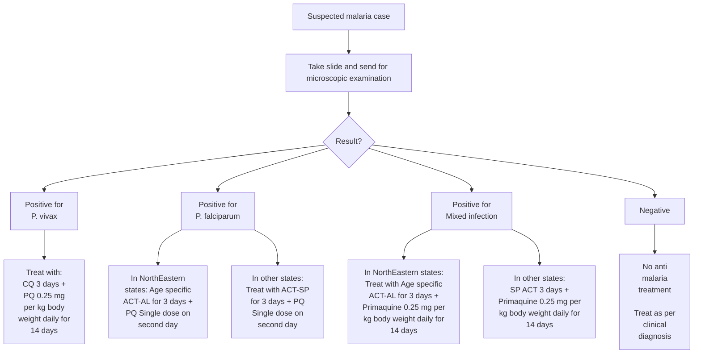

**ACT-AL** - Artemisinin-based Combination Therapy - Artemether - Lumefantrine
**ACT-SP** - Artemisinin-based Combination Therapy (Artesunate+Sulfadoxine-Pyrimethamine)
**CQ** - Chloroquine
**PQ** - Primaquine

18

Common Conditions

## Figure 2. Treatment where microscopy result is not available within 24 hours and monovalent RDT is used

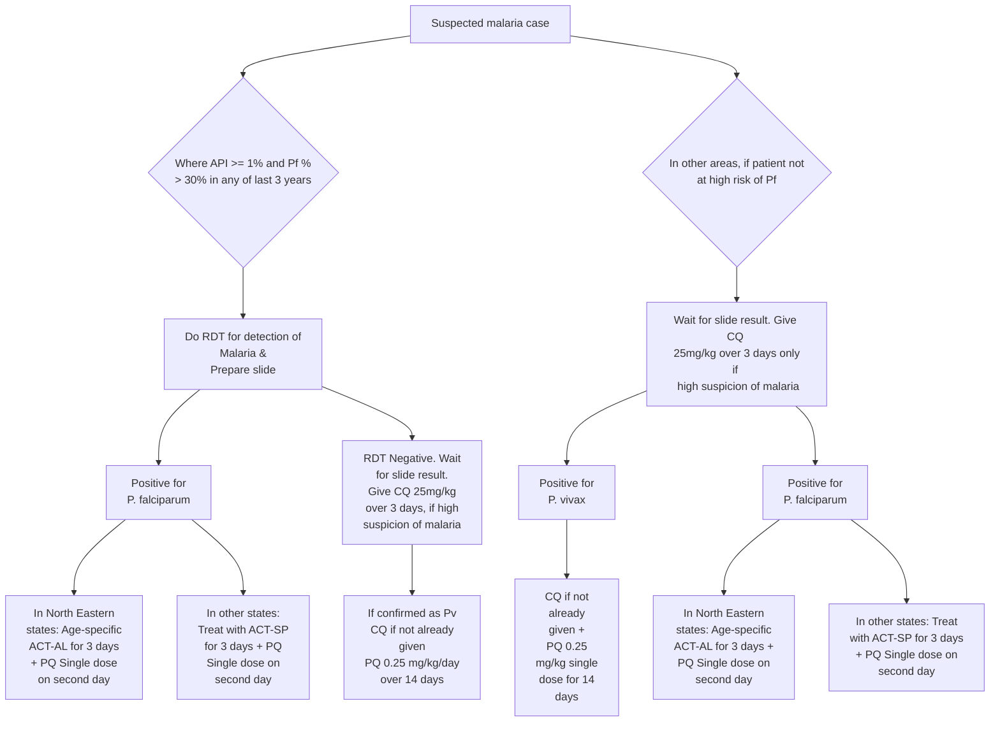

API - Annual Parasite Incidence

**Note: If a patient has severe symptoms at any stage, then immediately refer to a nearest PHC or other health facility with indoor patient management or a registered medical doctor.**

**Note: PQ is contra-indicated in pregnancy and in children under 1 year (Infant).**

**ACT-AL** - Artemisinin-based Combination Therapy - Artemether - Lumefantrine
**ACT-SP** - Artemisinin based Combination Therapy (Artesunate + Sulfadoxine Pyrimethamine)
**CQ** - Chloroquine
**PQ** - Primaquine

## Figure 3. Treatment where microscopy result is not available within 24 hours and bivalent RDT is used

Where microscopy result is not available within 24 hours and Bivalent RDT is used

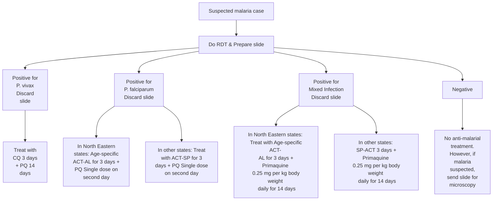

**Note: if a patient has severe symptoms at any stage, then immediately refer to a nearest PHC or other health facility with indoor patient management or a registered medical doctor.**

**Note: PQ is contra-indicated in pregnancy and in children under 1 year (Infant).**

**ACT-AL** - Artemisinin-based Combination Therapy - Artemether - Lumefantrine
**ACT-SP** - Artemisinin based Combination Therapy (Artesunate + Sulfadoxine Pyrimethamine)
**CQ** - Chloroquine
**PQ** - Primaquine

19

Common Conditions

### Treatment of _P.vivax_ malaria

- Tab. chloroquine: 25 mg/kg body weight divided over three days i.e.
  - 10 mg/kg on day 1
  - 10 mg/kg on day 2
  - 5 mg/kg on day 3
- Tab. primaquine: 0.25 mg/kg body weight daily for 14 days.
- Primaquine is contraindicated in infants, pregnant women and individuals with G6PD deficiency. 14 day regimen of primaquine should be given under supervision.

### Treatment of _P. falciparum_ malaria

- **Artemisinin based Combination Therapy (ACT-SP)** – Tab. artesunate 4 mg/kg body weight daily for 3 days plus sulfadoxine (25 mg/kg body weight) - pyrimethamine (1.25 mg/kg body weight) on first day.
- Tab. primaquine: 0.75 mg/kg body weight on day 2

### Treatment of mixed infections (_P.vivax_ + _P.falciparum_) cases

All mixed infections should be treated with full course of ACT and primaquine 0.25 mg per kg body weight daily for 14 days (Table 3).

**Table 3. Dosage schedule for treatment of mixed infection (_P.vivax_ + _P.falciparum_)**

<table>
  <thead>
    <tr>
        <th rowspan="2">Age</th>
        <th colspan="3">Day 1</th>
        <th colspan="2">Day 2</th>
        <th colspan="2">Day 3</th>
        <th>Days 4-14</th>
    </tr>
    <tr>
        <th>AS (50 mg)</th>
        <th>SP (500 mg + 25 mg)</th>
        <th>PQ (2.5 mg)</th>
        <th>AS tablet (50 mg)</th>
        <th>PQ (2.5 mg)</th>
        <th>AS tablet (50 mg)</th>
        <th>PQ (2.5 mg)</th>
        <th>PQ (2.5 mg)</th>
    </tr>
  </thead>
  <tbody>
    <tr>
        <td>Less than 1 yr</td>
        <td>1/2</td>
        <td>1/2</td>
        <td>0</td>
        <td>1/2</td>
        <td>0</td>
        <td>1/2</td>
        <td>0</td>
        <td>0</td>
    </tr>
    <tr>
        <td>1-4 years</td>
        <td>1</td>
        <td>1</td>
        <td>1</td>
        <td>1</td>
        <td>1</td>
        <td>1</td>
        <td>1</td>
        <td>1</td>
    </tr>
    <tr>
        <td>5-8 years</td>
        <td>2</td>
        <td>1.5</td>
        <td>2</td>
        <td>2</td>
        <td>2</td>
        <td>2</td>
        <td>2</td>
        <td>2</td>
    </tr>
    <tr>
        <td>9-14 years</td>
        <td>3</td>
        <td>2</td>
        <td>4</td>
        <td>3</td>
        <td>4</td>
        <td>3</td>
        <td>4</td>
        <td>4</td>
    </tr>
    <tr>
        <td>15 yrs or more</td>
        <td>4</td>
        <td>3</td>
        <td>6</td>
        <td>4</td>
        <td>6</td>
        <td>4</td>
        <td>6</td>
        <td>6</td>
    </tr>
  </tbody>
</table>
AS – artesunate, SP – sulfadoxine-pyrimethamine, PQ - primaquine

20

Common Conditions

### Treatment of complicated or severe malaria (Table 4)

#### Table 4. Treatment of severe and complicated malaria

<table>
  <thead>
    <tr>
        <th>Initial parenteral treatment for at least 48hrs.<br/>Choose any one of the following</th>
        <th>Follow-up treatment, when patient can take oral medications following parenteral treatment</th>
    </tr>
  </thead>
  <tbody>
    <tr>
        <td>**Quinine:** 20mg quinine salt/kg body weight on admission (IV infusion or divided IM injection) followed by maintenance dose of 10 mg/kg 8 hourly; infusion rate should not exceed 5 mg/kg per hour. Loading dose of 20mg/kg should not be given, if the patient has already received quinine.</td>
        <td>Quinine 10 mg/kg three times a day plus doxycycline 100 mg once a day or clindamycin in pregnant women and children under 8 years of age, to complete 7 days of treatment.</td>
    </tr>
    <tr>
        <td>**Artesunate:** 2.4 mg/kg IV or IM given on admission, then at 12 h and 24 h, then once a day or<br/>**Artemether:** 3.2 mg/kg IM given on admission then 1.6 mg/kg per day or<br/>**Arteether:** 150 mg daily IM for 3 days in adults only (not recommended for children).</td>
        <td>Treat with: ACT-SP for 3 days + PQ single dose on second day to complete 7 days of treatment.</td>
    </tr>
  </tbody>
</table>

**Note:** The parenteral treatment in severe malaria cases should be given for minimum of 24 hours once started (irrespective of the patient's ability to tolerate oral medication earlier than 24 hours).

#### Chemoprophylaxis of malaria

**Short term chemoprophylaxis (up to 6 weeks)**
**Doxycycline:** 100 mg once daily for adults and 1.5 mg/kg once daily for children (contraindicated in children below 8 years). The drug should be started 2 days before travel and continued for 4 weeks after leaving the malarious area.
**Chemoprophylaxis for longer stay (more than 6 weeks)**
**Mefloquine:** 250 mg weekly for adults and should be administered two weeks before, during and four weeks after exposure.

### DENGUE

Dengue is the most important emerging tropical viral disease of human beings in the world today. All four dengue virus (Dengue 1, 2, 3 and 4) infections may be asymptomatic, may lead to dengue fever (DF), dengue hemorrhagic fever (DHF) or when associated with plasma leakage may lead to hypovolemic shock and dengue shock syndrome (DSS).

21

Common Conditions

### Salient features

> - Dengue fever is an acute febrile illness of 2-7 days with two or more of the following manifestations. Headache, retro orbital pain, myalgia, arthralgia, rash.
> - Hemorrhagic manifestation (petechiae and positive tourniquet test) and Leucopenia

**Dengue hemorrhagic fever (DHF), if one or more of the following are present**

- Positive tourniquet test
- Petechiae, purpura or ecchymosis
- Bleeding from mucosa
- Haematemesis, melena
- Thrombocytopenia (platelets 100,000 cells/mm<sup>3</sup> or less) and evidence of plasma leakage.

**Dengue shock syndrome (DSS)**

- All the above criteria of DHF plus signs of circulatory failure.

Notes: The tourniquet test is performed by inflating a blood pressure cuff to mid way between the systolic and diastolic pressure.

**_Non pharmacological treatment_**

- Bed rest is advisable during the acute phase.
- Use cold sponging to keep temperature below 39ºC

**_Pharmacological treatment_**

- Management of dengue fever is symptomatic and supportive
- Antipyretics may be used to lower the body temperature. Aspirin/NSAIDs like ibuprofen etc should be avoided since it may cause gastritis, vomiting, acidosis and platelet dysfunction.
- Paracetamol is preferable in the doses as follows: 1-2 years: 60 –120 mg/doses, 3-6 years: 120 mg/dose, 7-12 years: 240 mg/dose, Adult : 500mg/dose
  Note: In children the dose is calculated as per 10mg/kg body weight per dose which can be repeated at the interval of 6 hrs.
- Oral fluid and electrolyte therapy are recommended for patients with excessive sweating or vomiting.
- Patients should be monitored in DHF endemic area until they become afebrile for one day without the use of antipyretics and after platelet and haematocrit determinations are stable, platelet count is more than 50,000/mm<sup>3</sup>.

**Management of Dengue Hemorrhagic Fever (Febrile Phase)**

- The management of febrile phase is similar to that of DF.
- Paracetamol is recommended to keep the temperature below 39ºC. Copious amount of fluid should be given orally, to the extent the patient tolerates, oral hydration solution (ORS), such as those used for the treatment of diarrhoeal diseases and/or fruit juices are preferable to plain water

22

Common Conditions

- IV fluid may be administered if the patient is vomiting persistently or refusing to feed.
- Patients should be closely monitored for the initial signs of shock. The critical period is during the transition from the febrile to the afebrile stage and usually occurs after the third day of illness.
- Serial haematocrit determinations are essential guide for treatment, since they reflect the degree of plasma leakage and need for intravenous administration of fluids.
- Haematocrit should be determined daily from the third day until the temperature has remained normal for one or two days. If haematocrit determination is not possible, haemoglobin determination may be carried out as an alternative.
- The details of IV treatment when required for patients are given in Figure 4.

### Figure 4. Treatment algorithm of dengue

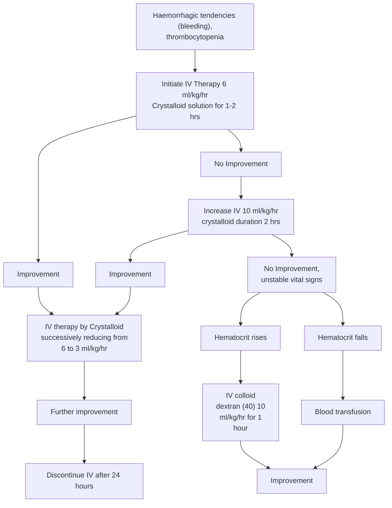

23

Common Conditions

**Management of DHF Grade I and Grade II:**

- Any person who has dengue fever with thrombocytopenia and haemoconcentration and presents with abdominal pain, black tarry stools, epistaxis, bleeding from the gums and infection etc needs to be hospitalized.
- All these patients should be observed for signs of shock. The critical period for development of shock is transition from febrile to abferile phase of illness, which usually occurs after third day of illness.
- A rise of haemoconcentration indicates need for IV fluid therapy. If despite the treatment, the patient develops fall in BP, decrease in urine output or other features of shock, the management for Grade III/IV DHF/DSS should be instituted.
- Oral rehydration should be given along with antipyretics like paracetamol sponging, etc. as described above.
- The detailed treatment for patient with DHF Grade I and II is given at Figure 5. Common signs of complications are observed during the afebrile phase of DHF. Immediately after hospitalization, the haematocrit, platelet count and vital signs should be examined to assess the patient's condition and intravenous fluid therapy should be started. The patient requires regular and sustained monitoring.

**Figure 5. Volume replacement flow chart for patients with dengue haemorrhagic fever grade I and II**

```mermaid
graph TD
    A[UNSTABLE VITAL SIGNS<br/>Urine output falls signs of shock] --> B[Immediate rapid volume replacement: initiate IV therapy 10-<br/>20 ml/kg/hr crystalloid solution for 1 hrs]
    B --> C[Improvement]
    B --> D[No Improvement]
    C --> E[IV therapy by Crystalloid<br/>successively reducing from 20 to 10,<br/>10 to 6 and 6 to 3]
    E --> F[Further Improvement]
    F --> G[Discontinue IV after 24 hrs]
    D --> H[Oxygen]
    H --> I[Haematocrit Rises]
    H --> J[Haematocrit Falls Rapidly<br/>(Due to haemorrhage)]
    I --> K[IV Colloid (Dextran 40) or<br/>plasma 10 ml/kg/hr<br/>(10ml/kg/hr) as intravenous<br/>bolus (repeat if necessary)]
    J --> L[Blood transfusion<br/>(10ml/kg/hr)]
```

24

Common Conditions

**Fluid requirement**

- The volume of fluid required to be replaced should be just sufficient to maintain effective circulation during the period of plasma leakage. To ensure adequate fluid replacement and avoid over-fluid infusion, the rate of intravenous fluid should be adjusted throughout the 24 to 48 hour period of plasma leakage by periodic haematocrit determinations and assessment of vital signs.
- The required regimen of fluid should be calculated on the basis of body weight and charted on a 1-3 hourly basis, or more frequently in the case of shock. The flow of fluid and the time of infusion are dependent on the severity of DHF. The schedule given below is a guideline and calculated for moderate dehydration of about 6% deficit (plus maintenance) (Table 5).

**Table 5. Fluid requirement as per body weight of the patient**

<table>
  <thead>
    <tr>
        <th>Weight on admission (kg)</th>
        <th>Fluid requirement/kg body weight/day (ml/kg)</th>
    </tr>
  </thead>
  <tbody>
    <tr>
        <td>&lt;7</td>
        <td>220</td>
    </tr>
    <tr>
        <td>7-11</td>
        <td>165</td>
    </tr>
    <tr>
        <td>12-18</td>
        <td>130</td>
    </tr>
    <tr>
        <td>18</td>
        <td>90</td>
    </tr>
  </tbody>
</table>

- In older children who weigh more than 40 kg, the volume needed for 24 hours should be calculated as twice that required for maintenance (using the Holiday and Segar formula). The maintenance fluid should be calculated as follows:

**Table 6. Maintenance fluid requirement according to Holiday and Segar formula**

<table>
  <thead>
    <tr>
        <th>Body weight in kg</th>
        <th>Maintenance volume for 24 hours</th>
    </tr>
  </thead>
  <tbody>
    <tr>
        <td>&lt;10kg</td>
        <td>100 ml / kg</td>
    </tr>
    <tr>
        <td>10-20kg</td>
        <td>1000+50 ml / kg</td>
    </tr>
    <tr>
        <td>20kg</td>
        <td>1500+20 ml / kg</td>
    </tr>
  </tbody>
</table>

For a child weighing 40 kgs, the maintenance is: $1500 + (20 \times 20) = 1900$ ml. This means that the child requires 3800 ml IV fluid during 24 hours.

**Indications of red cell transfusion**

- Loss of blood (overt blood) -10% or more of total blood volume
- Preferably whole blood/ component to be used
- Refractory shock despite adequate fluid administration and declining haematocrit - replacement volume should be 10 ml/kg body wt at a time and coagulogram should be done.

25

Common Conditions

- If fluid overload is present, PCV is to be given

**Indications of platelet transfusion**

- In general there is no need to give prophylactic platelets even at less than 20,000 cells/mm<sup>3</sup>.
- Prophylactic platelet transfusion may be given at level of less than 10,000 cells/mm<sup>3</sup> in absence of bleeding manifestations.
- Prolonged shock; with coagulopathy and abnormal coagulogram.
- In case of systemic massive bleeding, platelet transfusion may be needed in addition to red cell transfusion.

### CHIKUNGUNYA

Chikungunya is caused by an alpha virus closely related to O' nyong – nyong virus. The main vector is Aedes aegypti mosquito.

#### Salient features

> - Acute self limiting illness Incubation period is of 2 to 4 days. Abrupt onset presenting as fever with severe joint pain
> - After 1 – 4 days, fever subsides, there will be a afebrile period 3 days, fever returns with an itching maculopapular rash on trunk and extensor surfaces of limbs.
> - After another 3-6 days fever subsides and there is complete recovery.
> - Cripping arthropathy can occur intermittently for upto 4 months, in some cases even upto 5 years.

**_Non pharmacological treatment_**

- Mild exercises and physiotherapy may be suggested in recovering persons.
- Exposure to warm environment may be suggested
- Non weight bearing exercises
- Surgery in severely damaged joints

**_Pharmacological treatment_**

- Acute stage of illness
- Treat symptomatically (Tab. paracetamol 1 gm 3-4 times a day for fever, headache and pain.)
- Avoid aspirin and steroid because of risk of GI side effects and Reye's syndrome with aspirin.
- Tab. hydroxychloroquinine 200mg orally once daily or Tab. chloroquinine phosphate 300mg per day for a period of 4 weeks in cases where arthralgia is refractory to other drugs.
- Side effects of hydroxychloroquinine include retinal damage and elevated liver enzymes.

26

_Common Conditions_

# TUBERCULOSIS

## Salient features

> **Pulmonary tuberculosis (PTB):** The most common symptom of PTB is a persistent cough of two weeks or more, with or without expectoration. It may be accompanied by one or more of the following symptoms,
>
> - Fever, night sweats, weight loss
> - Chest pain, hemoptysis, shortness of breath, tiredness and loss of appetite
>
> Such patients should be selected and subjected for sputum examination. This enhances the chances of detection of the bacilli in the smear microscopy.
>
> **Extra pulmonary tuberculosis:** A person with extra-pulmonary TB may have symptoms related to the organs affected along with constitutional symptoms stated above.
>
> - Enlarged cervical lymph nodes with or without discharging sinuses (TB Lymphadenitis)
> - Chest pain with or without dyspnoea in pleural TB
> - Pain and swelling of the joints in bone tuberculosis (fever, backache, deformity in spinal TB).
> - Signs of raised intra-cranial tension like irritability, headache, vomiting, fever, stiffness of the neck and mental confusion in TB meningitis
> - Painless haematuria or sterile pyuria in renal tuberculosis and, infertility in genito-urinary TB.

### Investigations

- **Pulmonary TB in adults (Figure 6)**
  - Sputum smear microscopy
  - Chest x-ray
  - Sputum culture and drug sensitivity testing(DST) for diagnosis of Drug Resistant TB.
  - Newer rapid diagnostic tools for detection of multi drug resistant (MDR) TB.
  - Newer tools under evaluation for diagnosis of MDR/XDR TB

27

Common Conditions

### Figure 6. Algorithm for diagnosis of pulmonary tuberculosis

```mermaid
graph TD
    A[Cough of two weeks or more] --> B[2 sputum smears]
    B --> C[One or two positives]
    B --> D[2 negatives]
    C --> E[Sputum positive TB (initiate treatment regimen for TB)]
    D --> F[Antibiotics for 10-14 days. If cough persists, repeat sputum examinations]
    F --> G[One or two positives]
    F --> H[2 negatives. Perform chest X-ray]
    G --> E
    H --> I[Suggestive of TB]
    H --> J[Non TB]
    I --> K[Sputum negative TB (initiate treatment regimen for TB)]
```

- **Paediatric TB patients (Figure 7)**
  - In all children with presumptive intra-thoracic TB, microbiological confirmation should be sought through examination of respiratory specimens (like sputum by expectoration, gastric aspirate, induced sputum, bronchio-alveolar lavage or any other appropriate specimen) with diagnostic test like smear microscopy or rapid molecular test or culture.
  - In the event of negative or unavailable microbiological results, a diagnosis of probable TB in children should be based on the presence of abnormalities consistent with TB on radiography, a history of exposure to an infectious case, evidence of TB infection and clinical findings suggestive of TB.
  - For children with presumptive extra-pulmonary TB, appropriate specimens from the presumed sites of involvement should be obtained for microscopy, culture and DST, rapid molecular test and histopathological examination.

28

Common Conditions

### Figure 7. Diagnostic algorithm for pediatric pulmonary tuberculosis

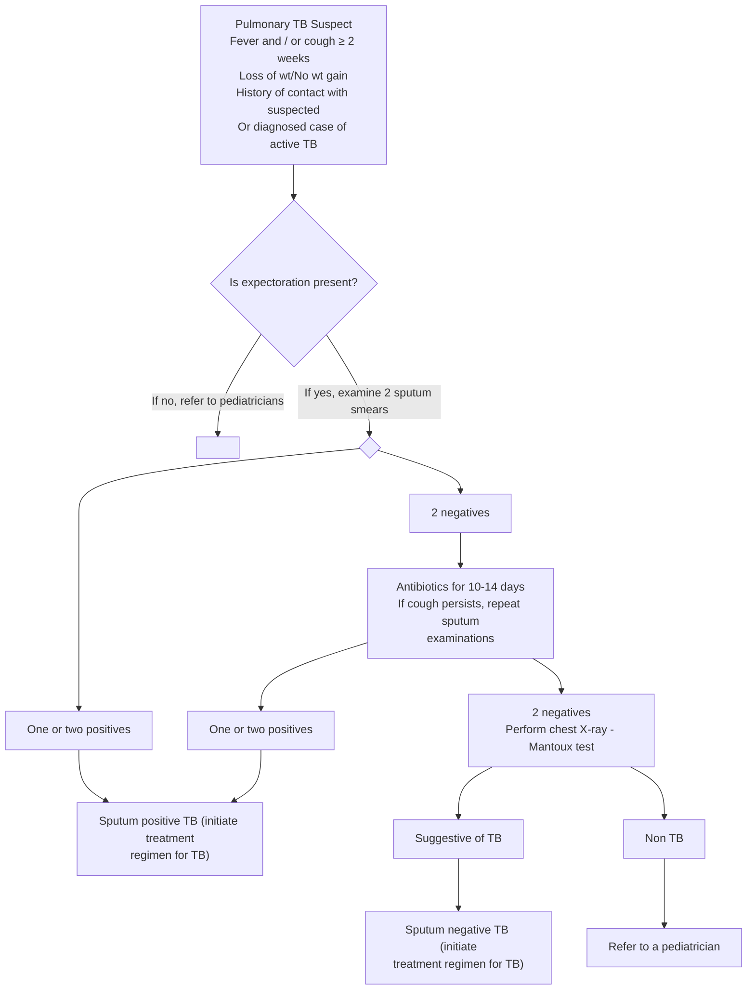

- **Extra-pulmonary TB**
  - Demonstration of AFB bacilli in a smear from extra pulmonary site is often difficult because of low bacillary load. The clinical features pertaining to the system affected should be considered in the diagnosis of extra pulmonary tuberculosis.
  - However, the following are some of the special investigations which are helpful in diagnosing extra pulmonary tuberculosis. These may be radiological, cytological / pathological, biochemical and immunological (Figure 8).
    (a) Fine Needle Aspirations Cytology and direct smear examination
    (b) Excision / Biopsy of specimen for histopathological examination
    (c) Fluid for cytology, biochemical analysis and smear examination
    (d) X-ray of the involved region
    (e) Ultrasonography for abdominal tuberculosis
    (f) Culture for _Mycobacterium tuberculosis_
    (g) Computerized tomography (CT) and magnetic resonance imaging (MRI)

29

Common Conditions

**Figure 8. Diagnostic algorithm for TB lymphadenitis**

```mermaid
graph TD
    A[Lymph node enlargement of > 2 cm in one or more sites, <br/> with or without periadenitis, <br/> evidence of TB elsewhere, abscess, discharging sinus] --> B[Prescribe course of antibiotics for two weeks]
    B --> C[If lymph node enlargement persists, <br/> suspect TB lymphadenitis]
    C --> D[Pus from sinus / Fine Needle Aspiration <br/> Cytology (FNAC) <br/> Mantoux test for children < 14 years]
    D --> E[Diagnosis confirmed if the pus / aspirate from <br/> FNAC shows: <br/> ZN smear positive for AFB in pus / aspirate <br/> Histopathological changes suggestive of TB]
    E --> F[Excision biopsy, if FNAC <br/> results are inconclusive]
    F --> G[Start treatment]
    E --> G
```

- **Diagnosis of Pleural TB**
  - Tubercular pleural effusion is considered as extra pulmonary tuberculosis. TB Patients presenting with chest pain with or without difficulty in breathing for more than two weeks should be referred for chest radiograph.
  - In pleural effusion, chest X-ray features may include obliteration of costophrenic angle and varying degree of effusion.
  - Biochemical and cytological analysis of the aspirated pleura fluid will help in confirming the diagnosis. Pleural fluid is generally an exudate with mainly lymphocytes and few mesothelial cells.
  - Pleural biopsy is confirmatory in a high proportion of patients.

**_Pharmacological treatment_**
Revised National Tuberculosis Control Programme (RNTCP) uses _short course chemotherapy_ given intermittently - thrice weekly under _Direct Observation_ for both pulmonary and extra pulmonary tuberculosis patients.

**Treatment regimens**
For the purpose of treatment regimen to be used, TB patients are classified into two groups, namely, "New" or "Previously Treated", based on the history of previous treatment.

30

Common Conditions

- **Regimen for New cases:** This regimen is prescribed to all new pulmonary (smear positive and negative) and extra pulmonary tuberculosis. The regimen is **_2H<sub>3</sub>R<sub>3</sub>Z<sub>3</sub> E<sub>3</sub> / 4 H<sub>3</sub>R<sub>3</sub>_**.
- **Regimen for Previously Treated cases:** This regimen is prescribed for TB patients who have had more than one month anti-tuberculosis treatment previously. These patients are at a higher risk of having drug resistance. Hence, 5 drugs are prescribed in the intensive phase and the total duration of treatment is 8 months. Relapses, treatment after Default, Failures and Others are treated with this regimen. The regimen is _2S<sub>3</sub>H<sub>3</sub>R<sub>3</sub>Z<sub>3</sub> E<sub>3</sub> / 1H<sub>3</sub>R<sub>3</sub>Z<sub>3</sub> E<sub>3</sub> / 5 H<sub>3</sub>R<sub>3</sub> E<sub>3</sub>_. The table below indicates the treatment regimen, type of patients and regimens prescribed (Table 6).

**Table 6. Treatment regimens recommended by RNTCP for treatment of Tuberculosis**

<table>
  <thead>
    <tr>
        <th>Treatment groups</th>
        <th>Type of patient</th>
        <th colspan="2">Regimen1</th>
    </tr>
    <tr>
        <th></th>
        <th></th>
        <th>Intensive Phase (IP)</th>
        <th>Continuation Phase (CP)</th>
    </tr>
  </thead>
  <tbody>
    <tr>
        <td>New*</td>
        <td>Sputum smear-positive<br/>Sputum smear-negative<br/>Extra-pulmonary<br/>Others</td>
        <td>2H<sub>3</sub>R<sub>3</sub>Z<sub>3</sub>E<sub>3</sub></td>
        <td>4H<sub>3</sub>R<sub>3</sub></td>
    </tr>
    <tr>
        <td>Previously Treated**</td>
        <td>Smear-positive relapse<br/>Smear-positive failure<br/>Smear-positive treatment after default<br/>Others<sup>1</sup></td>
        <td>2H<sub>3</sub>R<sub>3</sub>Z<sub>3</sub>E<sub>3</sub>S<sub>3</sub> / 1H<sub>3</sub>R<sub>3</sub>Z<sub>3</sub>E<sub>3</sub></td>
        <td>5H<sub>3</sub>R<sub>3</sub>E<sub>3</sub></td>
    </tr>
  </tbody>
</table>

\* New includes former categories I and III
\*\* Previously treated is former category II.
1 - In rare and exceptional cases, patients who are sputum smear-negative or who have extra-pulmonary disease can have recurrence or non-response. This diagnosis in all such cases should always be made by an MO and should be supported by culture or histological evidence of current, active TB. In these cases, the patient should be typed as ‘Others’ and given treatment regimen for previously treated

- The number before the letters refers to the number of months of treatment. The subscript after the letters refers to the number of doses per week.
- The dosage strengths are as follows: isoniazid (H) 600 mg, rifampicin (R) 450 mg, pyrazinamide (Z) 1500 mg, ethambutol (E) 1200 mg, streptomycin (S) 750 mg.
- Patients who weigh 60 kg or more receive additional rifampicin 150 mg.
- Patients more than 50 years old receive streptomycin 500 mg. Patients who weigh less than 30kg, receive drugs as per paediatric weight band boxes according to body weight (Table 7).

31

Common Conditions

### Table 7. Drug dosages for adults in the blister packs

<table>
  <thead>
    <tr>
        <th>Drugs</th>
        <th>Dose<br/>(thrice a week)</th>
        <th>Number of tablets in blister<br/>pack</th>
    </tr>
  </thead>
  <tbody>
    <tr>
        <td>Isoniazid (H)</td>
        <td>600mg</td>
        <td>2 x 300 mg</td>
    </tr>
    <tr>
        <td>Rifampicin (R)</td>
        <td>450mg</td>
        <td>1 x 450 mg</td>
    </tr>
    <tr>
        <td>Pyrazinamide (Z)</td>
        <td>1500mg</td>
        <td>2 x 750 mg</td>
    </tr>
    <tr>
        <td>Ethambutol (E)</td>
        <td>1200mg</td>
        <td>2 x 600 mg</td>
    </tr>
    <tr>
        <td>Streptomycin (S)</td>
        <td>0.75g</td>
        <td>-</td>
    </tr>
  </tbody>
</table>

- **Treatment of Pediatric TB (Table 8, 9 and 10, Figure 9)**
  Pediatric cases are to be treated under RNTCP with the same thrice weekly short course chemotherapy regimens ("New" or "Previously treated") given under Directly Observed Treatment Short Course (DOTS) as for adult patients. They are to be registered in the respective RNTCP TB Register. Pediatric patient-wise boxes are available with different dosages under two weight bands for children weighing 6 to 10 kg and 11 to 17 kg. Wherever possible, before a child is started on the "Previously Treated" regimen, she/he should be examined by a pediatrician or TB expert.

### Table 8. Pediatric patient wise boxes (PWB) with dosages

<table>
  <thead>
    <tr>
        <th rowspan="2">DRUGS</th>
        <th colspan="2">Product code (PC) -13</th>
        <th colspan="2">Product code (PC) -14</th>
        <th>PC-15</th>
        <th>PC-16</th>
    </tr>
    <tr>
        <th>IP<br/>24 blisters</th>
        <th>CP<br/>18 blisters</th>
        <th>IP<br/>24 blisters</th>
        <th>CP<br/>18 blister</th>
        <th>12 blisters</th>
        <th>12 blisters</th>
    </tr>
  </thead>
  <tbody>
    <tr>
        <td>Isoniazid</td>
        <td>75 mg</td>
        <td>75 mg</td>
        <td>150 mg</td>
        <td>150 mg</td>
        <td rowspan="4">Prolongation of IP for PC 13</td>
        <td rowspan="4">Prolongation of IP for PC 14</td>
    </tr>
    <tr>
        <td>Rifampicin</td>
        <td>75 mg</td>
        <td>75 mg</td>
        <td>150 mg</td>
        <td>150 mg</td>
    </tr>
    <tr>
        <td>Pyrazinamide</td>
        <td>250 mg</td>
        <td></td>
        <td>500 mg</td>
        <td></td>
    </tr>
    <tr>
        <td>Ethambutol</td>
        <td>200 mg</td>
        <td></td>
        <td>400 mg</td>
        <td></td>
    </tr>
  </tbody>
</table>
IP – Intensive phase, CP – Continuation phase

### Table 9. Pediatric patient wise boxes (PWB) for new cases according to weight band

<table>
  <thead>
    <tr>
        <th rowspan="2">Weight band</th>
        <th colspan="2">For New cases</th>
        <th rowspan="2">Prolongation of IP</th>
    </tr>
    <tr>
        <th>IP</th>
        <th>CP</th>
    </tr>
  </thead>
  <tbody>
    <tr>
        <td>6-10 Kg</td>
        <td colspan="2">PC 13</td>
        <td>PC 15</td>
    </tr>
    <tr>
        <td>11-17 Kg</td>
        <td colspan="2">PC 14</td>
        <td>PC 16</td>
    </tr>
    <tr>
        <td>18-25 Kg</td>
        <td colspan="2">PC 13 + PC 14</td>
        <td>PC 15 + PC16</td>
    </tr>
    <tr>
        <td>26-30 kg*</td>
        <td colspan="2">PC 14 x 2</td>
        <td>PC 16 x 2</td>
    </tr>
  </tbody>
</table>
\* For children weighing >30 kgs, adult PWB are to be used
IP – Intensive phase, CP – Continuation phase

32

Common Conditions

**Table 10. Pediatric patient wise boxes for previously treated cases according to weight band**

<table>
  <thead>
    <tr>
        <th>Weight</th>
        <th colspan="2">For previously treated cases</th>
        <th>Prolongation of IP</th>
    </tr>
    <tr>
        <th></th>
        <th>IP (Intensive phase)</th>
        <th>CP (Continuation phase)</th>
        <th></th>
    </tr>
  </thead>
  <tbody>
    <tr>
        <td>6-10 Kg</td>
        <td>(PC 13+ PC15)<br/>+<br/>(24 vials Inj sm*)</td>
        <td>(PC 13 + 54 Tab E 200 mg)<br/>+<br/>(PC 15 without Z)</td>
        <td>PC 15</td>
    </tr>
    <tr>
        <td>11-17 Kg</td>
        <td>(PC 14 + PC16)<br/>+<br/>(24 vials Inj sm*)</td>
        <td>(PC 14 + 54 E 400 mg)<br/>+<br/>(PC 16 without Z)</td>
        <td>PC 16</td>
    </tr>
    <tr>
        <td>18-25 Kg</td>
        <td>(PC 13 + PC 14 + PC 15 + PC 16)<br/>+<br/>(24 vials Inj sm*)</td>
        <td>(PC 13 + PC14 + 54 Tab E 600 mg)<br/>+<br/>(PC 15+ PC 16 without Z)</td>
        <td>PC 15 + PC 16</td>
    </tr>
    <tr>
        <td>26-30 kg</td>
        <td>(PC 14 x 2)+ (PC 16 x 2)<br/>+<br/>(24 vials Inj sm*)</td>
        <td>(PC 14 x 2+ 54 Tab E 800 mg)<br/>+<br/>(PC 16 x 2 without Z)</td>
        <td>PC 16 x 2</td>
    </tr>
  </tbody>
</table>
\* Injection streptomycin 15mg/kg body weight

**Figure 9. Clinical monitoring of children with Tuberculosis**

```mermaid
graph TD
    A[Patient on regimen for new cases] --> B[Review at 2 months, satisfactory<br/>response assessed by:<br/>* improvement in symptoms<br/>* no weight loss and or weight gain]
    A --> C[Review at 2 months, non-satisfactory<br/>response assessed by:<br/>* adherence to treatment<br/>* weight loss<br/>* worsening of symptoms]

    B --> D[Follow up clinically]
    D --> E[Clinical assessment<br/>and X-ray at<br/>completion of<br/>treatment]

    C --> F[Refer to Pediatrician / TB specialist<br/>for assessment (consider sputum<br/>examination)]

    F --> G[Sputum positive]
    F --> H[Sputum negative<br/>or not available]

    G --> I[Failure]
    I --> J[Regimen for<br/>previously treated]

    H --> K[Review diagnosis<br/>Extend IP by 1 month]
    K --> L["No improvement =<br/>Pollution non-responder"]
    L --> J
```

33

_Common Conditions_

**Non DOTS (ND) treatment regimen under RNTCP**
In rare and exceptional situations, non-DOTS treatment (with a self-administered non-rifampicin containing regimen) may be needed in a few TB cases. Examples include:

- Those with adverse reactions to rifampicin and / or pyrazinamide
- "New" patients who refuse DOTS despite all efforts

This is a treatment regimen of 12-month duration comprising 2 months of SHE and 10 months of HE (2SHE / 10HE). Dosages administered per day in the regimen are:

- **Isoniazid** - 300 mg
- **Ethambutol** - 800 mg
- **Streptomycin** - 750 mg (500 mg for those >50 years of age)

Those who weigh less than 30 kg receive dosages calculated as per body-weight.

- **Drug resistant tuberculosis (MDR/XDR-TB)**
  **MDR TB suspect:** A patient suspected of drug-resistant tuberculosis, based on RNTCP criteria for submission of specimens for drug-susceptibility testing.

**MDR TB suspect criteria**
**Criteria A**

- All failures of new TB cases
- Smear positive previously treated cases who remain smear positive at 4th month onwards
- All pulmonary TB cases who are contacts of known MDR TB case

**Criteria B** (in addition to Criteria A)

- All smear positive previously treated pulmonary TB cases at diagnosis
- Any smear positive follow up result in new or previously treated cases

**Criteria C** (in addition to Criteria B)

- All smear negative previously treated pulmonary TB cases at diagnosis,
- HIV TB co-infected cases at diagnosis

In other words, for districts implementing MDR Suspect Criteria B, any smear-positive diagnostic (except in a new patient) or any smear-positive follow-up result, should prompt a referral for DST.

**MDR-TB case:** A TB patient whose sputum is culture positive for _Mycobacterium tuberculosis_ and is resistant _in-vitro_ to isoniazid and rifampicin with or without other anti-tubercular drugs based on DST results from an RNTCP-certified culture and DST laboratory

**Extensive Drug Resistant Tuberculosis (XDR TB) case:** An MDR TB case whose recovered _M. tuberculosis_ isolate is resistant to at least isoniazid, rifampicin, a fluoroquinolone (ofloxacin, levofloxacin, or moxifloxacin) and a second-line injectable anti-TB drug (kanamycin, amikacin, or capreomycin) at a RNTCP-certified culture and DST laboratory. A patient is confirmed to have MDR or XDR TB only when the results are from a RNTCP quality-assured culture and DST Laboratory and by a RNTCP-endorsed testing method mentioned as below:

34

Common Conditions

## Choice of Diagnostic Technology

Currently, the programme is scaling up the laboratory capacity of various culture and DST laboratories at state level IRLs and other laboratories. The choice of technology to be used for diagnosis of MDR TB has been determined as per recommendations of the National Laboratory Committee. Thus, for DST at certified laboratory, wherever available Molecular DST (e.g. Line Probe Assay (LPA)) is preferred diagnostic method because of the rapid and highly-accurate rifampicin results, followed in preference by Liquid C-DST and then Solid C-DST.

### MDR Diagnostic Technology Choice

- **First**: Molecular DST (e.g. LPA DST)
- **Second**: Liquid culture isolation and LPA DST
- **Third**: Solid culture isolation and LPA DST
- **Fourth**: Liquid culture isolation and Liquid DST
- **Fifth**: Solid culture isolation and DST

Similarly for follow up cultures, wherever available, liquid culture will be preferred over solid culture. However, this will be liquid cultures for at least the crucial months of follow-up (IP-3, 4, 5, 6 and CP-18, 21, 24) and over and beyond this, it will be determined by the workload of individual laboratories.

**Table 11. Grouping anti-TB agents (first line and second line drugs)**

<table>
  <tbody>
    <tr>
        <td>Grouping</td>
        <td>Drugs</td>
    </tr>
    <tr>
        <th>Group 1: First-line oral anti-TB agents</th>
        <th>Isoniazid (H); Rifampicin (R); Ethambutol (E); Pyrazinamide(Z)</th>
    </tr>
    <tr>
        <th>Group 2: Injectable anti-TB agents</th>
        <th>Streptomycin (S); Kanamycin (Km); Amikacin (Am); Capreomycin (Cm); Viomycin (Vm).</th>
    </tr>
    <tr>
        <th>Group 3: Fluoroquinolones</th>
        <th>Ciprofloxacin (Cfx); Ofloxacin (Ofx); Levofloxacin (Lvx);<br/>Moxifloxacin (Mfx); Gatifloxacin (Gfx)</th>
    </tr>
    <tr>
        <th>Group 4: Oral second-line anti-TB agents</th>
        <th>Ethionamide (Eto); Prothionamide (Pto); Cycloserine (Cs);<br/>Terizadone (Trd); para-aminosalicylic acid (PAS)</th>
    </tr>
    <tr>
        <th>Group 5: Agents with unclear efficacy (not recommended by WHO for routine use in MDR-TB patients)</th>
        <th>Clofazimine (Cfz); Linezolid (Lzd); Amoxicillin / Clavulanate<br/>(Amx/Clv); thioacetazone (Thz); imipenem/cilastatin ( Ipm / Cln);<br/>high-dose isoniazid (high-dose H); Clarithromycin (Clr)</th>
    </tr>
  </tbody>
</table>

- All drugs should be given in a single daily dosage under directly observed treatment (DOT) by a DOT Provider. All patients will receive drugs under direct observation on 6 days of the

35

Common Conditions

week. On Sunday, the oral drugs will be administered unsupervised whereas injection kanamycin will be omitted.

- If intolerance occurs to the drugs, ethionamide, cycloserine and PAS may be split into two dosages and the morning dose administered under DOT. The evening dose will be self-administered. The empty blister packs of the self-administered doses will be checked the next morning during DOT.
- Pyridoxine should be administered to all patients on an RNTCP Category IV regimen.
  Drug dosages for MDR-TB cases are base on the weight bands as shown in below (Table 12).

* **Treatment of MDR TB (Category IV regimen)**
  - RNTCP will be using a standardised treatment tegimen (Cat IV) for the treatment of MDR-TB cases (and those with rifampicin resistance) under the programme.
  - Cat IV regimen comprises of 6 drugs (Table 11) kanamycin, high dose levofloxacin, ethionamide, pyrazinamide, ethambutol and cycloserine during 6-9 months of the intensive phase (IP) and 4 drugs- high dose levofloxacin, ethionamide, ethambutol and cycloserine during the 18 months of the continuation phase (CP).
  - P-aminosalicylic acid (PAS) is included in the regimen as a substitute drug in case of intolerance i.e. severe ADR leading to discontinuation of drug to any of the drug in the Cat IV regimen.
  - For management of patients with Km mono resistance, the committee recommended replacement of Km with capreomycin, If Km is intolerant, substitute amikacin (AK) if possible, or PAS if injectable agent not feasible.

* **Drug dosages and administration**
  **Table 12. Dosage and weight band recommendations of second line drugs**

<table>
  <thead>
    <tr>
        <th>S.No</th>
        <th>Drugs</th>
        <th>16-25 Kgs</th>
        <th>26-45 Kgs</th>
        <th>46-70 Kgs</th>
    </tr>
  </thead>
  <tbody>
    <tr>
        <td>1</td>
        <td>Kanamycin</td>
        <td>500 mg</td>
        <td>500 mg</td>
        <td>750 mg</td>
    </tr>
    <tr>
        <td>2</td>
        <td>Levofloxacin (High Dose)</td>
        <td>250 mg</td>
        <td>750 mg</td>
        <td>1000 mg</td>
    </tr>
    <tr>
        <td>3</td>
        <td>Ethionamide</td>
        <td>375 mg</td>
        <td>500 mg</td>
        <td>750 mg</td>
    </tr>
    <tr>
        <td>4</td>
        <td>Ethambutol</td>
        <td>400 mg</td>
        <td>800 mg</td>
        <td>1200 mg</td>
    </tr>
    <tr>
        <td>5</td>
        <td>Pyrazinamide</td>
        <td>500 mg</td>
        <td>1250 mg</td>
        <td>1500 mg</td>
    </tr>
    <tr>
        <td>6</td>
        <td>Cycloserine</td>
        <td>250 mg</td>
        <td>500 mg</td>
        <td>750 mg</td>
    </tr>
    <tr>
        <td>7</td>
        <td>PAS (80% Bioavailability)<sup>1</sup></td>
        <td>5 gm</td>
        <td>10 gm</td>
        <td>12 gm</td>
    </tr>
    <tr>
        <td>8</td>
        <td>Pyridoxine</td>
        <td>50 mg</td>
        <td>100mg</td>
        <td>100mg</td>
    </tr>
  </tbody>
</table>
<sup>1</sup> *In case of PAS with 60% bioavailability the dose will be increased to 7 gm (16-25 Kg); 14 gm (26-45 Kg) and 16 gm (> 45 Kg)*

- If a patient gains 5 kg or more in weight during treatment and crosses the weight-band range, the DOTS–Plus site committee may consider moving the patient to the higher weight-band drug dosages.

36

Common Conditions

- Similarly if a patient loses 5 kgs or more in weight during treatment and crosses the weight band the DOTS Plus site committee may consider moving the patient to the lower weight band.
- The new higher/lower dosages are provided whenever the patient is due for the next supply of drugs in the normal course of treatment and not as soon as change of weight is noted.
- The dosages of 2nd line drugs for MDR TB cases in paediatric age group weighing < 16 kg as per the Table 13.

**Table 13. Dosage of 2<sup>nd</sup> line drugs for treatment of pediatric MDR TB cases**

<table>
  <tbody>
    <tr>
        <td>Drug</td>
        <td>Daily Dose – mg/kg body weight</td>
    </tr>
    <tr>
        <td>Kanamycin</td>
        <td>15-30</td>
    </tr>
    <tr>
        <td>Levofloxacin</td>
        <td>7.5-10</td>
    </tr>
    <tr>
        <td>Ethionamide</td>
        <td>15-20</td>
    </tr>
    <tr>
        <td>Cycloserine</td>
        <td>15-20</td>
    </tr>
    <tr>
        <td>PAS</td>
        <td>150</td>
    </tr>
    <tr>
        <td>Ethambutol</td>
        <td>25</td>
    </tr>
    <tr>
        <td>Pyrazinamide</td>
        <td>30-40</td>
    </tr>
  </tbody>
</table>

- The dosages for higher weight patients include use additional dosages of some 2nd line drugs for MDR TB cases in patients weighing > 70 kg taking the dosage to kanamycin (1 gm), ethionamide (1 gm), cycloserine (1 gm), ethambutol (1.6 gm) and pyrazinamide (2 gm). All these are well within the maximum permissible dosage for each drug as per the WHO guidelines.

### ● Treatment of XDR-TB (Category V)

All XDR-TB patients who are considered for category V regimen, will be screened by the DOTS-Plus committee and if found suitable will be referred to a thoracic surgeon for consideration of surgery to improve the treatment outcomes. Identification must be done for the site (tertiary centres) with such surgical facilities.

**XDR Regimen (Table 14)**
6-12 months Cm, PAS, Mfx, High dose-H, Cfz, Lzd, Amx/Clv
18 months PAS, Mfx, High dose-H, Cfz, Lzd, Amx/Clv

- The Category V treatment regimen consists of 7 drugs, with 2 reserve/substitute drugs. The dosage of the drugs would vary as per the weight of the patient (≤ 45Kg or > 45Kg). All drugs are to be given on a daily basis. Injections of capreomycin will be given for 6 days/week (not on Sundays).

37

_Common Conditions_

- All morning doses are to be supervised by the DOT Provider except on Sundays. After taking DOT for morning doses on Saturday, next day medicines would be given to the patient to be taken at home on Sunday.
- Empty blisters of medicines taken unsupervised in evening and on Sundays are to be collected by DOT Provider.
- The change from IP to CP will be done only after achievement of culture conversion i.e. 2 consecutive negative cultures taken at least one month apart. In case of delay in culture conversion, the IP can be extended from 6 months up to a maximum of 12 months. In case of extension, the DOTS – Plus site Committee, which will be responsible for initiating and monitoring the Category V regimen, can decide on administering capreomycin injection intermittently (3 times/week) for the months 7 to 12.

**Table 14. Drugs and Dosages for management of XDR TB**

<table>
  <thead>
    <tr>
        <th>Drugs</th>
        <th colspan="2">Dosage/day</th>
    </tr>
    <tr>
        <th></th>
        <th>≤ 45 Kgs</th>
        <th>&gt; 45 Kgs</th>
    </tr>
  </thead>
  <tbody>
    <tr>
        <td>Inj. Capreomycin (Cm)</td>
        <td>750 mg</td>
        <td>1000 mg</td>
    </tr>
    <tr>
        <td>PAS</td>
        <td>10 gm</td>
        <td>12 gm</td>
    </tr>
    <tr>
        <td>Moxifloxacin (Mfx)</td>
        <td>400 mg</td>
        <td>400 mg</td>
    </tr>
    <tr>
        <td>High dose INH (High dose-H)</td>
        <td>600 mg</td>
        <td>900 mg</td>
    </tr>
    <tr>
        <td>Clofazimine (Cfz)</td>
        <td>200 mg</td>
        <td>200 mg</td>
    </tr>
    <tr>
        <td>Linezolid (Lzd)</td>
        <td>600 mg</td>
        <td>600 mg</td>
    </tr>
    <tr>
        <td>Amoxiclav (Amx/Clv)</td>
        <td>875/125 mg BD</td>
        <td>875/125 mg BD</td>
    </tr>
    <tr>
        <td>Pyridoxine</td>
        <td>100 mg</td>
        <td>100 mg</td>
    </tr>
    <tr>
        <td>Reserve/Substitute drugs</td>
        <td></td>
        <td></td>
    </tr>
    <tr>
        <td>Clarithromycin (Clr)</td>
        <td>500 mg BD</td>
        <td>500 mg BD</td>
    </tr>
    <tr>
        <td>Thiacetazone (Thz)#</td>
        <td>150 mg</td>
        <td>150 mg</td>
    </tr>
  </tbody>
</table>

# Depending on availability, not to be given to HIV positive cases

The reserve/substitute drugs would be used in the following conditions:

- In case the patient was on PAS in Category IV, PAS will be replaced with one of the reserve drugs in the Category V regimen
- If the patient is unable to tolerate one or more of the drugs
- If the patient is found to be resistant to capreomycin

- **HIV co-infection with TB**
  - TB patients living with HIV should receive the same duration of TB treatment with daily regimen as HIV negative TB patients.
  - Antiretroviral therapy (ART) must be offered to all patients with HIV and TB as well as drug-resistant TB requiring second-line anti-TB drugs, irrespective of CD4 cell-count, as early as possible (within the first 8 weeks) following initiation of anti-TB treatment. Appropriate arrangements for access to antiretroviral drugs should be made

38

Common Conditions

for patients. However, initiation of treatment for TB should not be delayed. Patients with TB and HIV infection should also receive co-trimoxazole as prophylaxis for other infections.

- People living with HIV should be screened for TB using four symptom complex (current cough or, fever or weight loss or night sweats) at HIV care settings and those with any of these symptoms should be evaluated for ruling out active TB. Such patients in whom active TB is ruled out, Isoniazid Preventive Therapy (IPT) in the dosage of 10 mg/Kg body weight should be offered to them for 6 months.

* **Adherence**
  - Supervision and support should be individualized.
  - Ensuring Adherence in M/XDR TB patients: Patient support systems, including direct observation of treatment, are required to ensure adherence. It should be ensured that the patient consumes all the dosages of the drugs.
  - Trained treatment supporter for treatment adherence: Such measures may include identification and training of a treatment supporter (for TB and, if appropriate, for HIV, diabetes mellitus etc.) who is acceptable, accessible and accountable to the patient and to the health system.
  - Information Communication Technology to promote treatment literacy and adherence: Optimal use of Information Communication Technology (ICT) should be done to promote treatment literacy and adherence

**Other important points to remember**

- Public Health Responsibility- Any practitioner treating a TB patient is assuming an important public health responsibility to prevent ongoing transmission of the infection and the development of drug resistance. To fulfill this responsibility the practitioner must not only prescribe an appropriate regimen, but also utilize local public health services / community health services, and other agencies including NGOs when necessary, to assess the adherence of the patient and to address poor adherence when it occurs.
- Maintain Records for all TB patients: A written record of all medications given, microbiological response and adverse reactions should be maintained for all patients. Every patient's clinical outcome should be recorded in the case register and available for public health monitoring.
- Notification of TB Cases: All health establishments must report all TB cases and their treatment outcomes to public health authorities (District Nodal Officer for Notification). Proper feedback need to be ensured to all health care providers who refer cases to public health system on the outcome of the patients which they had referred.
- Contact Investigation:
  All providers of care for patients with TB should ensure all household contacts (including children) and other persons who are in close contact with TB patients are screened for TB as per defined diagnostic standards.

39

Common Conditions

In case of pediatric TB patients, reverse contact tracing for search of any active TB case in the household of the child must be undertaken.

The highest priority contacts of known TB cases for intensive case finding (such as are:

- Persons with symptoms suggestive of TB
- Children aged <6 years
- Known or suspected immune-compromised patient, particularly HIV infection.
- Diabetes Mellitus
- Other higher risks including pregnancy, mental disorders, smokers and alcoholics etc.
- Patients with DR-TB - In case of contact with a DR-TB index case, close clinical monitoring should be provided, as there is no evidence that treatment of latent infection with available drugs is presently effective

### Follow up

**Follow up smear and culture schedule during treatment**

- For follow up examination two sputum specimens will be collected and examined by smear and culture at least 30 days apart from the 3rd to 7th month of treatment (i.e. at the end of the months 3, 4, 5, 6 and 7) and at 3-monthly intervals from the 9th month onwards till the completion of treatment (i.e. at the end of the months 9, 12, 15, 18, 21 and 24).
- The two specimens for smear and culture at the RNTCP accredited lab (one early morning and one supervised spot) will be collected and transported from the respective DTC to the RNTCP accredited laboratory.
- If any of the cultures in the last three quarters becomes positive, it will be followed up by monthly cultures in the following 3 months.

**Table 15. Common adverse effects of 2<sup>nd</sup> line drugs and management strategies**

<table>
  <tbody>
    <tr>
        <td>Adverse effects</td>
        <td>Suspected agent(s)</td>
        <td>Suggested management strategies</td>
    </tr>
    <tr>
        <th>Gastrointestinal</th>
        <th colspan="2"></th>
    </tr>
    <tr>
        <td>Nausea and vomiting</td>
        <td>PAS, isoniazid, moxifloxacin<br/>linezolid, clofazamine<br/>amoxyclav, alarithromycin<br/>thioacetazone</td>
        <td>- Assess for dehydration; initiate rehydration if indicated<br/>- Initiate anti-emetic therapy<br/>- Discontinue suspected agent if this can be done without compromising regimen – rarely necessary</td>
    </tr>
    <tr>
        <td>Gastritis</td>
        <td>PAS, moxifloxacin<br/>isoniazid, linezolid<br/>amoxiclav, clarithromycin<br/>thioacetazone</td>
        <td>- H2-blockers, proton-pump inhibitors, or antacids<br/>- Stop suspected agent(s) for short periods of time (e.g., one to seven days)<br/>- Lower dose of suspected agent, if this can be done without compromising regimen<br/>- Discontinue suspected agent if this can be done without compromising regimen</td>
    </tr>
    <tr>
        <td>Hepatitis</td>
        <td>Isoniazid, PAS, moxifloxacin<br/>linezolid</td>
        <td>- Stop all therapy pending resolution of hepatitis</td>
    </tr>
  </tbody>
</table>

40

_Common Conditions_

<table>
  <thead>
    <tr>
        <th></th>
        <th colspan="2"></th>
        <th></th>
    </tr>
  </thead>
  <tbody>
    <tr>
        <td>-</td>
        <td>-</td>
        <td>- Eliminate other potential causes of hepatitis<br/>- Consider suspending most likely agent permanently. Reintroduce remaining drugs, one at a time with the most hepatotoxic agents last, while monitoring liver function</td>
        <td></td>
    </tr>
    <tr>
        <th colspan="3">Cutaneous and hypersensitivity reactions</th>
        <th></th>
    </tr>
    <tr>
        <td>Hypersensitivity</td>
        <td>PAS, linezolid, clarithromycin</td>
        <td>- Withhold all drugs and treat symptomatically with antihistamines/ steroids till the reaction subsides.<br/>- Identify offending drug in severe forms<br/>- Attempt desensitization of the offending drug<br/>- Discontinue suspected agent and substitute with the reserve drug</td>
        <td></td>
    </tr>
    <tr>
        <td>Cutaneous</td>
        <td>Linezolid, clofazamine</td>
        <td>- Treat symptomatically with antihistamines till the reaction subsides.<br/>- Patient should be counseled on the skin discoloration with long term use of clofazamine</td>
        <td></td>
    </tr>
    <tr>
        <th colspan="3">Psychiatric</th>
        <th></th>
    </tr>
    <tr>
        <td>Depression</td>
        <td>Socio-economic circumstances, chronic disease, moxifloxcin, isoniazid</td>
        <td>- Improve socioeconomic conditions<br/>- Group or individual counseling<br/>- Initiate antidepressant therapy<br/>- Lower dose of suspected agent if this can be done without compromising the regimen<br/>- Discontinue suspected agent if this can be done without compromising regimen</td>
        <td></td>
    </tr>
    <tr>
        <th colspan="3">Neurological</th>
        <th></th>
    </tr>
    <tr>
        <td>Peripheral neuropathy</td>
        <td>Isoniazid, linezolid</td>
        <td>- Increase pyridoxine to maximum daily dose (200 mg per day)<br/>- Initiate therapy with tricyclic antidepressants such as amitriptyline. Non-steroidal anti-inflammatory drugs or acetaminophen may help alleviate symptoms<br/>- Lower dose of suspected agent, if this can be done without compromising regimen<br/>- Discontinue suspected agent if this can be done without compromising regimen</td>
        <td></td>
    </tr>
    <tr>
        <td>Convulsions</td>
        <td>Isoniazid, moxifloxacin, linezolid</td>
        <td>- Suspend suspected agent pending resolution of convulsions<br/>- Initiate anticonvulsant therapy (e.g. phenytoin, valproic acid)<br/>- Increase pyridoxine to maximum daily dose (200 mg per day).<br/>- Restart suspected agent or reinitiate suspected agent at lower dose, if essential to the regimen</td>
        <td></td>
    </tr>
  </tbody>
</table>

41

Common Conditions

<table>
  <thead>
    <tr>
        <th></th>
        <th></th>
        <th></th>
    </tr>
  </thead>
  <tbody>
    <tr>
        <td rowspan="2">Hearing loss</td>
        <td rowspan="2">Capreomycin<br/>clarithromycin</td>
        <td>- Discontinue suspected agent if this can be done without compromising regimen</td>
    </tr>
    <tr>
        <td rowspan="2"></td>
        <td>- Document hearing loss and compare with baseline audiometry if available<br/>- Change parenteral treatment to capreomycin if patient has documented susceptibility to capreomycin<br/>- Increase frequency and/or lower dose of suspected agent if this can be done without compromising the regimen(consider administration three times per week)<br/>- Discontinue suspected agent if this can be done without compromising the regimen</td>
    </tr>
    <tr>
        <td>Ocular</td>
        <td>Linezolid</td>
        <td>In consultation with the ophthalmologist</td>
    </tr>
    <tr>
        <td colspan="3">**Musculoskeletal**</td>
    </tr>
    <tr>
        <td>Arthralgia</td>
        <td>Moxifloxacin</td>
        <td>- Initiate therapy with non-steroidal anti-inflammatory drugs.<br/>- Lower dose of suspected agent, if this can be done without compromising regimen.<br/>- Discontinue suspected agent if this can be done without compromising regimen</td>
    </tr>
    <tr>
        <td>Musculoskeletal</td>
        <td>Moxifloxacin</td>
        <td>In consultation with the orthopedician</td>
    </tr>
    <tr>
        <td colspan="3">**Haematological**</td>
    </tr>
    <tr>
        <td>Haematalogic</td>
        <td>Capreomycin, PAS, linezolid, clarithromycin</td>
        <td>Monitor for anemia, bleeding tendency and cell counts</td>
    </tr>
    <tr>
        <td colspan="3">**Renal**</td>
    </tr>
    <tr>
        <td>Renal toxicity</td>
        <td>Capreomycin<br/>linezolid<br/>clarithromycin</td>
        <td>- Discontinue suspected agent<br/>- Consider using capreomycin if an aminoglycoside had been the prior injectable in regimen<br/>- Consider dosing 2 to 3 times a week if drug is essential to the regimen and patient can tolerate (close monitoring of creatinine)<br/>- Adjust all TB medications according to the creatinine clearance</td>
    </tr>
    <tr>
        <td colspan="3">**Metabolic and Electrolytes**</td>
    </tr>
    <tr>
        <td>Metabolic and electrolyte</td>
        <td>Capreomycin, linezolid<br/>moxifloxacin</td>
        <td>Periodic monitoring of serum electrolytes and blood sugar</td>
    </tr>
    <tr>
        <td colspan="3">**Endocrine**</td>
    </tr>
    <tr>
        <td>Thyroid dysfunction</td>
        <td>PAS</td>
        <td>Supplement with thyroxine</td>
    </tr>
    <tr>
        <td colspan="3">**Cardiovascular**</td>
    </tr>
    <tr>
        <td>QT prolongation</td>
        <td>Moxifloxacin, clarithromycin</td>
        <td>- Monitor for QT prolongation, monitor platelet count, bleeding tendencies</td>
    </tr>
  </tbody>
</table>

42

_Common Conditions_

- **Chemoprophylaxis of contacts of MDR-TB cases**
  Among contacts of patients with MDR-TB, the use of isoniazid may reasonably be questioned. Although alternative prophylaxis treatments have been suggested, there is no consensus regarding the choice of the drug(s) and the duration of treatment. Prompt treatment of MDR-TB is the most effective way of preventing the spread of infection to others. The following measures should be taken to prevent spread of MDR-TB infection:
  - Early diagnosis and appropriate treatment of MDR-TB cases;
  - Screening of contacts as per RNTCP guidelines
  - Further research into effective and non-toxic chemoprophylaxis in areas of high MDR-TB prevalence.

**Patient education**

- Providing counseling and health education to the MDR-TB patient and their family members about the disease and about the necessity of taking regular and adequate treatment is of utmost importance.
- Health education and counseling is provided to all patients and family members at different levels of health care, right from one at the periphery to those at the DOTS-Plus site facility. It is started at the initial point of contact and carried on a continuous basis at all visits by the patient to a health facility. The counseling and motivation is required to be done not only of the patient but also of the family members.

### EPILEPSY

A seizure is a paroxysmal event due to abnormal excessive or synchronous neuronal activity in the brain. Epilepsy describes a condition in which a person has recurrent seizures due to a chronic, underlying process.

**Classification of Seizures**

- Generalized seizures
  Tonic clonic, clonic, tonic, absence (typical/ atypical), atonic and myoclonic
  May be focal, generalized, or unclear epileptic spasms
- Focal seizures (can be further described as having motor, sensory, autonomic, cognitive, or other features) with and without dyscognitive features

**Investigations**
It should be made sure that the patient had a seizure and other differentials should be ruled out. In the patient with prior seizures or a known history of epilepsy, the evaluation is directed toward (1) underlying cause and precipitating factors (2) adequacy of current therapy.

**Pharmacological treatment**

- Treatment of underlying conditions
  - Metabolic imbalances such as abnormal serum electrolytes and glucose, medications (theophylline), illicit drug use (e.g., cocaine), structural CNS lesion such as a brain tumor, vascular malformation, or brain abscess.

43

Common Conditions

- Avoidance of precipitating factors like sleep deprivation, alcohol, bright light, etc.
- Antiepileptic drug therapy mainstay of treatment for most patients with epilepsy.

**Table 16. Selection of antiepileptic drugs according to classification of epilepsy**

<table>
  <thead>
    <tr>
        <th>Generalized tonic clonic seizures</th>
        <th>Focal seizures</th>
        <th>Typical absence seizures</th>
        <th>Atypical absence, myoclonic and atonic seizures</th>
    </tr>
    <tr>
        <th colspan="4">First line drugs</th>
    </tr>
  </thead>
  <tbody>
    <tr>
        <td>Valproic acid</td>
        <td>Lamotrigine</td>
        <td>Valproic acid</td>
        <td>Valproic acid</td>
    </tr>
    <tr>
        <td>Lamotrigine</td>
        <td>Capbamazepine</td>
        <td>Ethosuximide</td>
        <td>Lamotrigine</td>
    </tr>
    <tr>
        <td>Topiramate</td>
        <td>Oxcarbazepine</td>
        <td></td>
        <td>Topiramate</td>
    </tr>
    <tr>
        <td></td>
        <td>Phenytoin</td>
        <td></td>
        <td></td>
    </tr>
    <tr>
        <td></td>
        <td>Levetiracetam</td>
        <td></td>
        <td></td>
    </tr>
    <tr>
        <th colspan="4">Alternatives</th>
    </tr>
    <tr>
        <td>Zonisamide</td>
        <td>Topiramate</td>
        <td>Lamotrigine</td>
        <td>Clonazepam</td>
    </tr>
    <tr>
        <td>Phenytoin</td>
        <td>Zonisamide</td>
        <td>Clonazepam</td>
        <td>Felbamate</td>
    </tr>
    <tr>
        <td>Capbamazepine</td>
        <td>Valproic acid</td>
        <td></td>
        <td></td>
    </tr>
    <tr>
        <td>Oxcarbazepine</td>
        <td>Tiagabine</td>
        <td></td>
        <td></td>
    </tr>
    <tr>
        <td>Phenobarbitone</td>
        <td>Gabapentin</td>
        <td></td>
        <td></td>
    </tr>
    <tr>
        <td>Primidone</td>
        <td>Lacosamide</td>
        <td></td>
        <td></td>
    </tr>
    <tr>
        <td>Felbamate</td>
        <td>Phenobarbitone</td>
        <td></td>
        <td></td>
    </tr>
    <tr>
        <td></td>
        <td>Primidone</td>
        <td></td>
        <td></td>
    </tr>
    <tr>
        <td></td>
        <td>Felbamate</td>
        <td colspan="2"></td>
    </tr>
  </tbody>
</table>

### Pregnancy

- Most women with epilepsy who become pregnant will have an uncomplicated gestation and deliver a normal baby. Since the potential harm of uncontrolled convulsive seizures on the mother and fetus is considered greater than the teratogenic effects of antiepileptic drugs, it is currently recommended that pregnant women be maintained on effective drug therapy. Patients should take folic acid (1–4 mg/d), to prevent development of neural tube defects.

### Contraception

- Drugs such as carbamazepine, phenytoin, phenobarbital, and topiramate can significantly decrease the efficacy of oral contraceptives via enzyme induction and other mechanisms. Patients should be advised to consider alternative forms of contraception.

44

Common Conditions

# STATUS EPILEPTICUS

Status epilepticus refers to continuous seizures or repetitive, discrete seizures with impaired consciousness in the interictal period. The duration of seizure activity sufficient to meet the definition of status epilepticus has traditionally been specified as 15–30 minutes. The treatment plan for an adult with status epilepticus is as in Figure 10.

**Figure 10. Treatment algorithm for generalized tonic clonic status epilepticus in adults**

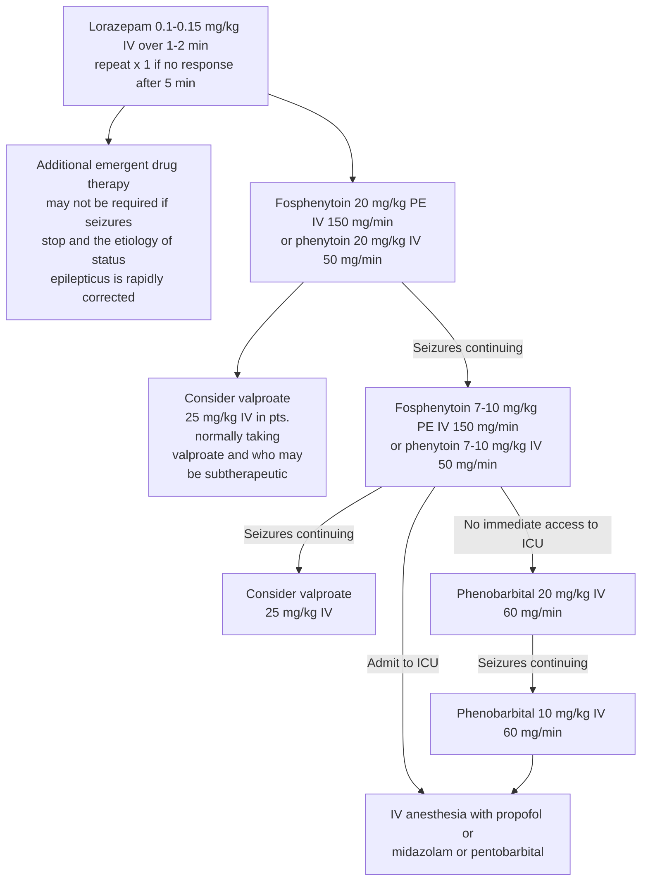

45

Common Conditions

# URINARY TRACT INFECTION

Urinary tract infections include infection of any part of urinary tract from kidneys to urethra. It can be caused by unhygenic lifestyle, sexually transmitted, per urethral catheterization, renal calculus disease and vesicoureteric reflux.

### Salient features

> - Burning micturition, urinary frequency, flank pain, fever
> - Predisposing factors are diabetes mellitus, large prostate, and circumcision.
> - Common organisms are _E. coli_, _Pseudomonas_, _Klebsiella_.

**Investigations**

- TC with DC, X-ray KUB, USG-KUB, Urine (routine and microbiological examination)
- Urine culture and sensitivity to be done if bacterial colony count is more than 1000.

**_Non pharmacological treatment_**
Plenty of fluids orally, maintain hygiene

**_Pharmacological treatment_**

- Tab. ciprofloxacin 500 mg twice a day for five days.
- In resistance cases 3<sup>rd</sup> generation cephalosporins (cefixime) followed by antibiotics as per culture and sensitivity report.
- If fever then Tab. paracetamol 500 mg thrice a day for three days.

46

_Chapter 3_

# EMERGENCY CONDITIONS

## CARDIOPULMONARY RESUSCITATION

Cardiopulmonary resuscitation (CPR) consists of a series of maneuvers by which oxygenated blood supply to brain and vital organs is maintained during cardiopulmonary arrest (CPA) i.e. cessation of respiration and circulation. In children, CPA is not sudden but end result of long period of hypoxaemia secondary to inadequate ventilation, oxygenation or circulation. Therefore, prompt management of these is essential to prevent CPA, the outcome of which is poor.

**Diagnosis of cardiopulmonary and cardiac arrest**

1. Absence of pulse in major arteries (carotid or femoral in older children and femoral or brachial in infants as carotid is difficult to palpate due to short neck).
2. Absence of heart sounds on auscultation.
3. Asystole /ventricular fibrillation on ECG.

**Respiratory arrest**
Absence of respiration on examination (absent chest movements), listening (absent air flow on bringing ears in front of mouth) and feeling (absent air flow on keeping hands in front of mouth or nose).

**Levels of CPR**
**Basic life support (BLS):** The elements of CPR are provided without additional equipment. Skill and speed are most essential.
**Advanced cardiac life support (ACLS):** Use of equipment and drugs for assisting ventilation or circulation.

**Primary survey to assess the patient's condition:**

- Tap the patient on the shoulder and ask, "Are you all right?"
- If the patient does not respond, call for help.
- Give 2 minutes (5 cycles) of CPR before leaving patient to call for help.
- Check for pulse or any other signs of life; begin CPR, 30 compressions to 2 respirations (push hard and fast--100/minute and release chest completely).
- Open airway and check for breathing. Give 2 breaths that make the chest rise.
- Start an IV line.
- Begin oxygen.
- Attach a monitor
- Intravenous / Intra osseous (IO) access is a priority over advanced airway management. If an advanced airway is placed, change to continuous chest compressions without pauses for breaths. Give 8 to 10 breaths per minute and check rhythm every 2 minutes.

47

Emergency Conditions

# CHART

# SIMPLIFIED ADULT BLS

```mermaid
graph TD
    A[Unresponsive<br/>No breathing or<br/>No normal breathing<br/>(only gasping)] --> B[Activate<br/>Emergency<br/>Response]
    B --> C[Get<br/>Defibrillator]
    B --> D[Start CPR]
    C --> E[Check rhythm/ shock if<br/>Indicated<br/>Repeat every 2 minutes]
    D --> E
    E --> D
```

Source 2010 American Heart Association Guidelines

48

Emergency Conditions

# ADULT BLS HEALTHCARE PROVIDERS

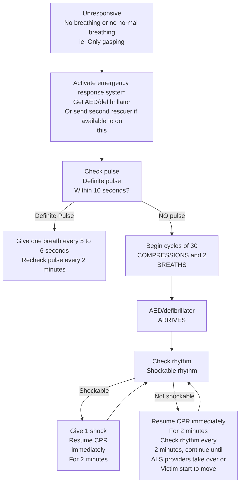

Source 2010 American Heart Association Guidelines

49

_Emergency Conditions_

# AHA ACLS ADULT CARDIAC ARREST ALGORITHM

**Shout for Help/activate Emergency Response**

```mermaid
graph TD
    Start[Start CPR<br/>Give Oxygen<br/>Attach<br/>Monitor/Defibrillator] --> Rhythm{Rhythm shockable?}

    Rhythm -- Yes --> VT_VF[VT/VF]
    Rhythm -- No --> PEA_Asystole[PEA/Asystole]

    VT_VF --> Shock1[shock]
    Shock1 --> CPR1[CPR 2 minutes/ 5 cycles<br/>Obtain IV/IO access]

    CPR1 --> Rhythm2{Rhythm shockable?}
    Rhythm2 -- shock --> Shock2[shock]

    Shock2 --> CPR2[CPR 2 minutes/5 cycles<br/>Epinephrine every 3-5 minutes<br/>Consider advanced airway<br/>capnography]

    CPR2 --> Rhythm3{Rhythm shockable?}
    Rhythm3 -- shock --> Shock3[shock]

    Shock3 --> CPR3[CPR 2 minutes/5 cycles<br/>Amiodarone<br/>Treat reversible causes]

    PEA_Asystole --> CPR4[CPR 2 minutes/5 cycles<br/>Obtain IV/IO access<br/>Epinephrine every 3-5 minutes<br/>Consider advanced airway]

    CPR4 --> Rhythm4{Rhythm shockable?}

    Rhythm4 -- No --> CPR5[CPR 2 minutes/5 cycles<br/>Treat reversible causes]

    CPR5 --> Rhythm5{Rhythm shockable?}

    Rhythm5 -- No --> CPR5
    Rhythm5 -- Yes --> Shock4[Shock]

    Rhythm4 -- yes --> Shock4

    Rhythm2 -- No --> ROSC_Check
    Rhythm3 -- No --> ROSC_Check

    ROSC_Check[If signs return of<br/>Spontaneous circulation<br/>(ROSC) is present,<br/>give post cardiac Arrest care]

    style Start fill:#fff,stroke:#000
    style VT_VF fill:#fff,stroke:#000
    style PEA_Asystole fill:#fff,stroke:#000
    style CPR1 fill:#fff,stroke:#000
    style CPR2 fill:#fff,stroke:#000
    style CPR3 fill:#fff,stroke:#000
    style CPR4 fill:#fff,stroke:#000
    style CPR5 fill:#fff,stroke:#000
    style ROSC_Check fill:#fff,stroke:#000
    style Shock4 fill:#fff,stroke:#000
```

Source: 2010 American heart association guidelines

**Source 2010 American Heart Association Guidelines**

50

Emergency Conditions

# AHA ACLS ADULT CARDIAC ARREST ALGORITHM

**Shout for Help/activate Emergency Response**

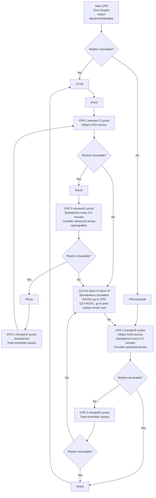

**<u>Core iv/io Drugs Dosage:</u>**

- **Epinephrine:** 1 mg
- **Vasopressin:** 40 units
- <u>Can replace 1<sup>st</sup> or 2<sup>nd</sup> dose of Epinephrine</u>
- **Amiodarone:** 1<sup>st</sup> dose 300mg
  - 2<sup>nd</sup> dose 150mg

Source 2010 American Heart Association Guidelines

51

_Emergency Conditions_

# ANAPHYLAXIS

It is a generalized hypersensitivity reaction characterized by hypotension, peripheral circulatory collapse and respiratory difficulty in the form of stridor and dyspnoea. Anaphylaxis can be due to food, inhaled/ingested allergens or drugs. Symptoms occur instantaneously or within a few minutes following exposure to the offending agent. Anaphylaxis to oral drugs may take 1-2 hours, but in many patients it can be instantaneous. A severe anaphylactoid reaction is a life-threatening emergency. Effective treatment depends on prompt diagnosis and rapid supplementation of appropriate therapy.

**Clinical criteria for diagnosis**
Anaphylaxis is highly likely when any one of the following three criteria is fulfilled:

1. Acute onset of an illness (minutes to several hours) with involvement of the skin, mucosal tissue, or both (e.g., generalized urticaria, itching or flushing, swollen lips/tongue/uvula) with one of the following,
   - Respiratory compromise (e.g., dyspnoea, wheeze-bronchospasm, stridor, reduced peak expiratory flow (PEF), hypoxemia)
   - Reduced blood pressure or associated symptoms of end-organ dysfunction (e.g. hypotonia, collapse, syncope, incontinence)
   - Involvement of the skin-mucosal tissue
   - Persistent gastrointestinal symptoms (e.g., cramping abdominal pain, vomiting) or
2. Reduced blood pressure after exposure to known allergen,
   - Infants and children- low systolic blood pressure (age-specific) or greater than 30% decrease in systolic blood pressure
   - Adults- systolic blood pressure of less than 90 mm Hg or greater than 30% decrease from baseline

52

Emergency Conditions

### Salient features

> **Skin, subcutaneous tissue, and mucosa**
>
> - Flushing, itching, urticaria (hives), angioedema, morbilliform rash, piloerection
> - Periorbital itching, erythema and edema, conjunctival erythema, tearing
> - Itching of lips, tongue, palate, and external auditory canals; and swelling of lips, tongue, and uvula
> - Itching of genitalia, palms, and soles
>
> **Respiratory**
>
> - Nasal itching, congestion, rhinorrhea, sneezing
> - Throat itching and tightness, dysphonia, hoarseness, stridor, dry staccato cough
> - Lower airways: increased respiratory rate, shortness of breath, chest tightness, deep cough, wheezing/bronchospasm, decreased peak expiratory flow
> - Cyanosis, respiratory arrest
>
> **Gastrointestinal**
>
> - Abdominal pain, nausea, vomiting (stringy mucus), diarrhea, dysphagia
>
> **Cardiovascular system**
>
> - Chest pain
> - Tachycardia, bradycardia (less common), other arrhythmias, palpitations
> - Hypotension, feeling faint, urinary or fecal incontinence, shock
> - Cardiac arrest
>
> **Central nervous system**
>
> - Aura of impending doom, uneasiness (in infants and children, sudden behavioral change, e.g. irritability, cessation of play, clinging to parent); throbbing
> - Headache (pre-epinephrine), altered mental status, dizziness, confusion, tunnel vision

---

#### _Non pharmacological treatment_

- Remove exposure to trigger if possible (discontinue intravenous diagnostic or therapeutic agent that seems to triggering symptoms). Place the patient supine and elevate the extremities.
- Observe vital signs frequently and if possible, monitor electrocardiogram and pulse oximetry.
- For severe anaphylaxis with shock, initial management should be directed at the ABC of resuscitation, namely maintenance of adequate airway - suction, breathing, and circulation. If working alone, call for assistance.

#### _Pharmacological treatment_

- Inj. adrenaline 1:1000 (1mg/ml), 0.01 ml/kg (maximum 0.3 ml in children and 0.5 ml in adults) IM (mid anterolateral aspect of thigh). If necessary, dose can be repeated every 15 minutes.

53

_Emergency Conditions_

- If the anaphylaxis is due to an allergen extract or to a hymenoptera sting into an extremity, half the dose of adrenaline can be infiltrated locally, subcutaneously after dilution with 2 ml saline.
- High flow oxygen (4-6 lit/min by face mask or oropharyngeal airway).
- Establish two wide bore intravenous lines. Commence rapid fluid resuscitation with Inj. NS (0.9% normal saline) at rate of 5-10 ml/kg in 5 to 10 minutes. One to two litres of fluid bolus can be given.
- Intubate and commence intermittent positive pressure ventilation if severe laryngeal obstruction, bronchospasm, circulatory shock or coma.
- If no response to the initial intramuscular dose of adrenaline, administer adrenaline 5 mcg/kg slowly in to the intravenous line. Repeat at 5 minutes intervals depending on response. If the patient remains in shock, start an adrenaline infusion (preferably via a central venous line), commencing at 0.1 mcg/kg/min in children and 0.2 mcg/kg/min in adults with titration required to restore blood pressure. Large doses of adrenaline may be needed.
- Commence cardiopulmonary resuscitation, if necessary.
- If the only manifestation of anaphylaxis is urticaria or angioedema, initial IM dose of adrenaline should be given in addition to antagonists. If no other manifestation, patient can be kept under observation for at least 12 hours and then discharged.

**Additional measures**

- IV infusion of chlorpheniramine 10 mg (adult), 2.5-5 mg (child) or diphenhydramine 25-50 mg (adult) (1 mg/kg, maximum 50 mg [child]).
- Inj. salbutamol solution, 2.5 to 5 mg/3 ml given by nebulizer and face mask.
- IV hydrocortisone infusion 200 mg (adult), maximum 100 mg (child); or methylprednisolone 50-100 mg (adult); 1 mg/kg, maximum 50 mg (child).

**Supportive treatment**
All patients with severe anaphylactic reaction must be hospitalized. Patients who remain clinically unstable after initial resuscitation should be admitted to intensive care unit (ICU). Patients responding to the initial treatment should be observed for possible late reaction.

**Patient education**
To check and look for the cause (food, drugs etc.) and to avoid it in future

### ACUTE AIRWAY OBSTRUCTION

The cause of acute airway obstruction can be underlying malignancy, abscess, laryngeal cyst or laryngocele. It is necessary to assess the severity of the condition before initiating the treatment.

**_Emergency treatment_**

- Head extension with lower jaw thrust forward
- Suctioning for clearing secretions

54

_Emergency Conditions_

- Ventilatory mask with 100% oxygen
- Endotracheal intubation or tracheostomy

**In stable patient**

- Plain X-ray neck
- Fibre optic endoscopy / micro-laryngoscopy / bronchoscopy to find out the cause

**Treatment guidelines**

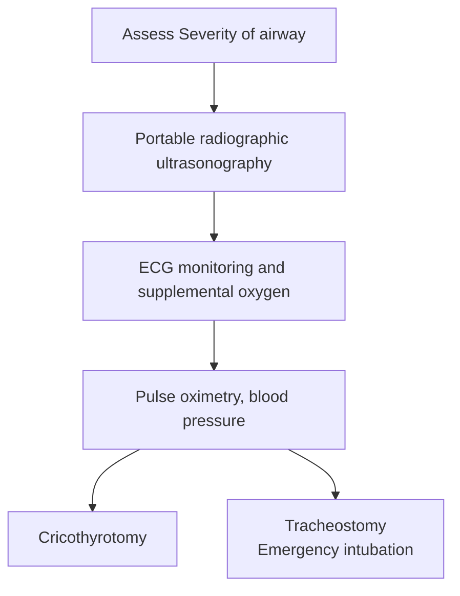

### STRIDOR

Stridor is noisy, harsh and difficult breathing due to obstruction of the airway. It is classified inspiratory, expiratory and biphasic type. Inspiratory stridor occurs due to an obstruction at or above the level of vocal cords. Expiratory stridor is due to obstruction at bronchiolar level such as bronchial asthma while biphasic stridor occurs in tracheal and subglottic stenosis. In children the stridor of laryngo-tracheo-bronchitis has a crowing quality and is called 'Croup'.

#### Salient features

> - Restlessness, anxiety and distress, labored / noisy breathing, predominantly on inspiration
> - Difficulty in swallowing and speaking
> - In children: cyanosis, chest retraction, tachypnea, altered level of consciousness, feeding difficulties

**_Pharmacological treatment_**

- Humidified oxygen
- Inj. hydrocortisone 100 mg IV stat and can be repeated as required.
- Inj. ampicillin 500mg QID IV/for 5-7 days
- Inj. adrenaline 0.2-0.5mg subcutaneously if necessary.

55

_Emergency Conditions_

# SHOCK

Shock is defined as a circulatory insufficiency that creates an imbalance between tissue oxygen supply and demand.

### Classification and causes of shock

**1. Haemorrhagic shock**

- Traumatic – blunt or penetrating injury, fractures of long bones and pelvis
- Non-traumatic - GI bleeds (e.g. peptic ulcer, gastric mucosal erosions, oesophageal varices, typhoid bleeds, disseminated intravascular coagulation (DIC), aortic dissection, rupture of aneurysm of a large vessel

**2. Hypovolaemic shock**

- Fluid loss from vomiting and/or diarrhoea e.g. in cholera, other GI infections
- Fluid loss in diabetes mellitus, adrenal insufficiency, excessive sweating, exfoliative dermatitis, diabetes insipidus, reaccumulation of ascites after tapping
- Sequestration of fluid e.g. in intestinal obstruction, pancreatitis, burns, crush injuries

**3. Cardiogenic shock**

- Acute myocardial infarction
- Cardiomyopathy, cardiac arrhythmias
- Mechanical causes e.g. valvular disease, outflow tract obstruction, ruptured ventricular septum

**4. Distributive or vasogenic (relative hypovolaemia)**

- Septic shock; toxic shock syndrome
- Anaphylactic
- Neurogenic

Shock is a progressive disorder, if untreated can lead to severe haemodynamic and metabolic deterioration causing multi-organ failure. Stages of shock can be arbitrarily classified as:

- **Early compensated shock** - Vital organ function is maintained by intrinsic compensatory mechanisms. Blood pressure is usually normal, there is increasing tachycardia and hypotension. The skin is cold and clammy, increased capillary refill time (>3 sec). If there is delay in treatment it may-lead to decompensated shock.
- **Decompensated shock** - There is fall in blood pressure and cardiac output. Features of peripheral poor perfusion are compounded with manifestations of vital organ impairment. Patient may have alteration of mentation (impaired cerebral perfusion), oliguria (renal hypoperfusion) and myocardial ischaemia (coronary flow impairment). Patient has acrocyanosis, cold and damp extremities and a pale look. If untreated, progress to irreversible state of shock.
- **Irreversible shock** is a term applied to the clinical situation in which even haemodynamic correction does not halt the progressive organ failure.

56

_Emergency Conditions_

### Salient features

> - Tachycardia, blood pressure may be normal or elevated due to compensatory mechanisms, later falls as cardiovascular compensation fails. Neck veins may be distended or flattened, depending on the etiology of shock. Decreased coronary perfusion pressures can lead to ischemia, decreased ventricular compliance, and increased left ventricular diastolic pressure and pulmonary edema.
> - Tachypnea, increased minute ventilation, and increased dead space are common. Bronchospasm, hypocapnia with progression to respiratory failure, and adult respiratory distress syndrome can be seen.
> - Skin pale, dusky, clammy skin with cyanosis, sweating, altered temperature, and decreased capillary refill, oliguria.

---

#### _Treatment_

- Start oxygen 4-6 L/min
- Airway control, endotracheal intubation
- Adequate venous access. Large-bore peripheral intravenous catheters for adequate fluid resuscitation. Central venous access may be necessary for monitoring and employing pulmonary artery catheters, venous pacemakers, and long-term vasopressor therapy.
- Volume replacement. Isotonic, intravenous crystalloid fluids (0.9% NaCl, Ringer's lactate) are preferred for the initial resuscitation phase. Initial bolus volume is 20 to 40 ml/kg over 10 to 20 min (rapid infusion). Colloids (dextran, hetastarch, etc.) can be used till blood is available.
- Blood is the ideal resuscitative fluid for hemorrhagic shock or in the presence of significant anemia. Fully cross-matched blood is preferred, but if more rapid intervention is required, type specific or type O negative blood may be employed. The decision to use platelets or fresh frozen plasma (FFP) should be based on evidence of impaired hemostasis and on frequent monitoring of coagulation parameters. Platelets are generally given if there is ongoing hemorrhage and the platelet count is 50,000 or less; FFP is indicated if the prothrombin time is prolonged more than 1.5 times.
- Vasopressors should be used if there is persistent hypotension after adequate volume resuscitation. Inj. dobutamine 2.0 to 20.0 µg/kg/min for systolic BP over 100 mmHg, dopamine 2.5 to 20.0 µg/kg/min for systolic BP 70 to 100 mmHg, and Inj. norepinephrine 0.5 to 30.0 µg/min for systolic BP under 70 mmHg.
- Acidosis should be treated with adequate ventilation and fluid resuscitation. Use of sodium bicarbonate (1 meq/kg) is controversial. If it is used, it is given only in the setting of severe acidosis refractory to ventilation and fluid resuscitation.
- Early surgical or medical consultation for admission or transfer as indicated.

57

_Emergency Conditions_

**Monitoring**
Special care in ICU should be taken by careful and continuous monitoring of BP, pulse rate and respiratory rate, urine output and mental status frequently. Sedated patients should be allowed to awaken ("drug holiday") daily to assess their neurologic status and to shorten duration of ventilator support.

**Management guidelines for common causes of shock**
**Hemorrhagic Shock**

- Ensure adequate ventilation/oxygenation
- Provide immediate control of hemorrhage (e.g., traction for long bone fractures, direct pressure)
- Initiate judicious infusion of isotonic crystalloid solution (10–20 ml/kg) or colloid solution
- With evidence of poor organ perfusion and 30-minute anticipated delay to hemorrhage control, begin packed red blood cell (PRBC) infusion (5–10 ml/kg)
- Treat coincident dysrhythmias (e.g., atrial fibrillation with synchronized cardioversion)

**Cardiogenic Shock**

- Ameliorate increased work of breathing; provide oxygen and positive end-expiratory pressure (PEEP) for pulmonary edema
- Begin vasopressor or inotropic support; Inj. norepinephine (0.5 µg/min) and Inj. dobutamine (5 µg/kg/min)
- Seek to reverse the insult (e.g., initiate thrombolysis, arrange percutaneous transluminal angioplasty)
- Consider intra-aortic balloon pump counterpulsation for refractory shock

**Septic Shock**

- Ensure adequate oxygenation
- Administer 20 ml/kg of crystalloid (0.9% normal saline or RL) or 5 ml/kg of colloid (hemaccel or hetastarch), and titrate infusion to adequate central venous pressure and urine output
- Begin antimicrobial therapy; attempt surgical drainage or débridement
- Begin packed RBC infusion for hemoglobin < 8 g/dL
- If volume restoration fails to improve organ perfusion, begin vasopressor support; initial choice includes dopamine infusion at 5–15 µg/kg/min

**FLUID AND ELECTROLYTE IMBALANCE AND REPLACEMENT (IN ADULTS)**

58

Emergency Conditions

Disturbances in fluid and electrolyte balance occur in a wide spectrum of diseases such as following burns, trauma and major surgery. The conventional and easy method of evaluating disturbances in fluid and electrolyte balance is the frequent measurement of the concentration of serum electrolytes. It is crucial to remember that intracellular and extracellular electrolytes are normally constant, and that major shifts in and out of 'compartments' can occur in disease with minimal changes in serum electrolyte. Compositional changes also involve disturbances in acid-base balance.

# I. Volume deficit

- **Obvious causes**
  Vomiting, diarrhoea, intestinal fistulae, nasogastric suction, fluid loss following burns, sequestration of fluid in soft tissue injuries and infections, diuretics, renal disease/adrenal insufficiency
- **Less obvious causes**
  Inadequate fluid intake, fluid loss through excessive sweating as in high fever, hot humid temperature, haemodialysis, haemofiltration from surgical incisions and tetanus
  **Treatment**
  The first principle is to restore circulating volume through infusion of intravenous fluids. Once this is satisfactorily achieved, disturbances in electrolytes and acid-base balance if present need to be rectified. Various fluids used for volume replacement are given below:
  **Replacement fluids**
  - Replacement fluids are used to replace abnormal loss of blood, plasma or other extracellular fluids as first line treatment for hypovolemia in:
    - Patients with established hypovolemia e.g. haemorrhagic shock.
    - Maintenance of normovolaemia in patients with ongoing fluid losses e.g. surgical blood loss.
  - Intravenous replacement fluids are the first line of treatment for hypovolemia.
- Crystalloid maintenance fluids, which contain dextrose, are not suitable for use as replacement fluids. However, crystalloid solutions with a similar concentration of sodium to plasma (normal saline or balanced salt) solutions (Ringer's lactate or Hartmann's solutions) are effective as replacement fluids. These should be available in all hospitals where intravenous replacement fluids are used. Crystalloids should be infused in a volume at least three times the volume lost in order to correct hypovolemia.
- All colloid solutions (albumins, dextran, gelatins and hydroxyethyl starch solutions) are replacement fluids. However, they have not been shown to be superior to crystalloids in resuscitation. Colloid solutions should be infused in a volume equal to the blood volume deficit.
- Plasma should never be used as a replacement fluid.
- Plain water should never be infused intravenously as it can cause haemolysis.

59

_Emergency Conditions_

- In addition to the intravenous route, the intraosseous, oral, rectal or subcutaneous routes can be used for the administration of fluids, blood and certain drugs. However, with the exception of intraosseous route, other routes are generally unsuitable in severely hypovolemic patients.
- Rectal fluids are administered through a plastic or rubber enema tube which is inserted into the rectum and connected to a bag or bottle of fluid. A safe and effective solution for a rectal rehydration is 1 liter of clean drinking water with teaspoon of table salt.
- Subcutaneous fluids can be used when other route of administration of fluids are unavailable. A cannula or needle is inserted into the subcutaneous tissue (the abdominal wall is a preferred site) and sterile fluids are administered in a conventional manner. Do not give dextrose-containing solutions subcutaneously as they can cause sloughing of tissues.
- Oral and nasogastric fluids: Oral rehydration can often be used in mildly hypovolemic patients if the oral route is not contraindicated. Do not use if:
  - The patient is unconscious.
  - The patient has gastrointestinal lesions or reduced gut motility e.g. obstruction.
  - General anaesthesia and surgery is planned imminently.

**WHO/UNICEF formula for oral rehydration fluid:**
Dissolve in one litre of drinkable water

<table>
  <tbody>
    <tr>
        <td>Sodium chloride</td>
        <td>2.6 g/L</td>
    </tr>
    <tr>
        <td>Trisodium citrate, dihydrate</td>
        <td>2.9 g/L</td>
    </tr>
    <tr>
        <td>Potassium chloride</td>
        <td>1.5 g/L</td>
    </tr>
    <tr>
        <td>Glucose anhydrous</td>
        <td>13.5 g/L</td>
    </tr>
  </tbody>
</table>
Resulting concentrations
Na 75 mmol/L, Cl 65 mmol/L, K 20 mmol/L, Glucose anhydrous 75 mmol/L, Citrate 10 mmol/L, total osmolarity 245 mmol/L.

**Maintenance fluids**
Maintenance fluids are used to replace the normal physiological loss that occurs through skin, lung, faeces and urine. Since a considerable proportion of the loss is water, maintenance fluids are mainly composed of water in the form of a dextrose solution. Some electrolytes may also be included in these solutions.

Before giving any intravenous infusion:

- Check that the seal of the infusion fluid bottle or bag is not broken.
- Check the expiry date.
- Check that the solution is clear and free from visible particles.

### II. Volume excess

Volume excess is often iatrogenic when the fluid intake has consistently exceeded the output. Excessive intravenous infusions of saline and blood transfusions are important

60

_Emergency Conditions_

causes of hypervolemia. Renal insufficiency, congestive heart failure, liver disease and other causes of sodium retention, or excessive sodium administration can all produce increase in extracellular fluid content and hypervolemia.

### Salient features

> - Oedema, ascites, pleural effusion, neck veins full, pulmonary congestion, hyperdynamic circulation with tachycardia, a warm skin, and a bounding pulse.
> - Increase in the systolic pressure and pulse pressure.
> - Central venous Pressure (CVP) > 12 mmHg, Pulmonary Capillary Wedge Pressure (PCWP) >20 mmHg in the presence of pulmonary oedema.

**_Treatment_**
In moderate volume excess, salt restriction, restriction of fluid intake and the use of frusemide as a diuretic will solve the problem. Fulminant pulmonary oedema secondary to over hydration from over transfusion of blood or fluids is more appropriately dealt with by phlebotomy in stages so that pulmonary capillary wedge pressure is reduced below 15 mm Hg. Rarely ultrafiltration (dialysis) may be required.

**_References_**

1. Anaesthesia at the District Hospital. In: World Health Organization in collaboration with the World Federation of Societies of Anesthesiologists, Geneva, 2nd Edition, 2000, WHO.
2. Drugs Used in Anaesthesia. In: WHO Model Prescribing Information, 1989, World Health Organization.
3. Anaesthesia at the District Hospital. In: World Health Organization in collaboration with the World Federation of Societies of Anesthesiologists, Geneva, 1988, World Health Organization.

### SEPTICEMIA

Septicemia is a clinical syndrome caused by invasion of bloodstream by microorganisms. Gram-negative and gram-positive bacteria account for most common sepsis cases.

**Definitions**

- Bacteremia (fungemia): presence of viable bacteria (fungi) in the blood, as evidenced by positive blood cultures.
- Systemic Inflammatory Response Syndrome (SIRS): at least two of the following conditions: (1) oral temperature of >38° C or <35° C, (2) respiratory rate of >20 breaths/min or partial pressure of arterial carbon dioxide (PaCO<sub>2</sub>) of <32 mm Hg, (3) heart rate of >90 beats/min, (4) leukocyte count of >12,000/dl or <4000/dl or >10% bands.
- Severe sepsis: sepsis with one or more signs of organ dysfunction, hypoperfusion, or hypotension, such as metabolic acidosis, alteration in mental status, oliguria, or adult respiratory distress syndrome.

61

_Emergency Conditions_

- Septic shock: sepsis with hypotension that is unresponsive to fluid resuscitation plus organ dysfunction or perfusion abnormalities as listed for severe sepsis.
- Multiple Organ Dysfunction Syndrome (MODS): dysfunction of more than one organ, requiring intervention homeostasis.

62

_Emergency Conditions_

### Salient features

- Fever or hypothermia may be seen in sepsis. Hypothermia is more often seen in patients at the extremes of age and in immunocompromised patients.
- Other signs include tachycardia, wide pulse pressure, tachypnea, and hypotension.
- Mental status changes ranging from mild disorientation to coma are commonly seen.
- Ophthalmic manifestations include retinal hemorrhages, cotton-wool spots, and conjunctival petechiae.
- Cardiovascular manifestations initially include vasodilation, resulting in warm extremities.
- Cardiac output is maintained early in sepsis through a compensatory tachycardia. As sepsis progresses, hypotension may occur. Patients in septic shock may demonstrate a diminished response to volume replacement.
- Renal manifestations include azotemia, oliguria, and active urinary sediment due to acute tubular necrosis.
- Hepatic dysfunction present as cholestatic jaundice, increases in transaminases, alkaline phosphatase, and S.bilirubin. Painless mucosal erosions may occur in the stomach and duodenum and cause upper GI bleeds.
- Skin findings include cellulitis, erysipelas, and fasciitis. Hypotension and disseminated intravascular coagulation (DIC) can also produce skin changes, including acrocyanosis and necrosis of peripheral tissues.
- Hematologic changes include neutropenia, neutrophilia, thrombocytopenia, and DIC. Thrombocytopenia occurs in over 30 percent of patients with sepsis. DIC is more often associated with gram-negative sepsis. Decompensated DIC presents with clinical bleeding and thrombosis. Laboratory studies can show thrombocytopenia, prolonged prothrombin time (PT) and partial prothromboplastin time (PTT), decreased fibrinogen level and antithrombin levels, and increased fibrin monomer, fibrin split values, and D-dimer values.
- Hyperglycemia may be the result of increased catecholamines, cortisol, and glucagon. Increased insulin resistance, decreased insulin production, and impaired utilization of insulin may further contribute to hyperglycemia.
- Arterial blood gas (ABG) studies in early sepsis may reveal hypoxemia and respiratory alkalosis. As perfusion worsens and glycolysis increases, a metabolic acidosis results.

#### _Non pharmacological treatment_

- Aggressive airway management with high-flow oxygen and endotracheal intubation
- Rapid infusion of crystalloid IV fluid (Ringer’s lactate or normal saline) at 500 ml (20 ml/kg in children) every 5 to 10 min; 4 to 6 L (60 ml/kg in children)

63

_Emergency Conditions_

- Remove source of infection-remove indwelling IV catheters and send the tips for quantitative culture. Replace urinary drainage catheters if obstructed. Consult the appropriate specialist for drainage of intra-abdominal, sinus, or soft tissue abscesses.
- Monitor blood pressure, pulse, capillary refill, central venous pressure, pulmonary capillary wedge pressure, and urine output (>30 ml/h in adults, 1 ml/kg/h in children) to evaluate therapy. If blood loss is suspected, blood replacement may be necessary

**_Pharmacological treatment_**

- Inj. dopamine 5 to 20 µg/kg/min, titrated to response, if hypotension is refractory to IV fluid.
- If blood pressure remains <70 mmHg despite preceding measures, Inj. norepinephrine 8-12 µg/min loading dose and a 2-4 µg/min infusion to maintain mean arterial blood pressure of at least 60 mmHg should be started.
- Empiric antibiotic therapy. Dosages should be the maximum allowed and given intravenously. When source is unknown, therapy should be effective against both gram-positive and gram-negative organisms.
- In adults, a third-generation cephalosporin (ceftriaxone 1 g IV, cefotaxime 2 g IV, or ceftazidime 2 g IV) or an antipseudomonal beta lactamase–susceptible penicillin can also be used. Addition of an aminoglycoside (gentamicin 2 mg/ kg IV, tobramycin 2 mg/kg IV) to this regimen is recommended.
- In immunocompromised adults, ceftazidime 2 g IV, imipenem 750 mg IV, or meropenem 1 g IV alone is acceptable. If gram-positive infection is suspected (indwelling catheter or IV drug use), oxacillin 2 g IV or vancomycin 15 mg/ kg IV should be added. If an anaerobic source is suspected (intraabdominal, genital tract, odontogenic, and necrotizing soft tissue infection), metronidazole 7.5 mg/kg IV or clindamycin 900 mg IV should additionally be administered. If _Legionella_ is a potential source, erythromycin 500 mg IV should be added.
- Acidosis to be treated with oxygen, ventilation, and IV fluid replacement. If acidosis is severe, administration of sodium bicarbonate 1 meq/kg IV is acceptable as directed by ABGs.
- DIC should be treated with fresh-frozen plasma 15 to 20 ml/kg initially to keep PT at 1.5 to 2 times normal and treated with platelet infusion to maintain serum concentration of 50 to 100,000.
- Inj. hydrocortisone (100 mg IV) for adrenal insufficiency

### ORGANOPHOSPHOROUS POISONING

Organophosphorous (OP) insecticides are highly lipid soluble and are rapidly absorbed via dermal, gastrointestinal and respiratory routes. Common agents for OP poisoning are malathion, parathion, chlorpyrifos, dichlorvos, methylparathion which are used as insecticides.

64

_Emergency Conditions_

### Salient features

> - Clinical features include dyspnoea, tightness around chest, nausea, vomiting, diarrhea, abdominal pain, excessive sweating and salivation, miosis, blurred vision, lacrimation, headache, giddiness, drowsiness, bradycardia, arrhythmias, QT prolongation, hypotension, fasciculation, muscle weakness, seizures and coma.
> - Diagnosis can be confirmed by red blood cell (RBC) cholinesterase and plasma cholinesterase level which is reduced to 20% of the normal values.

**Non pharmacological treatment**

- Maintain patent airway: oral airway/intubation/mechanical ventilation if required
- Monitor vitals- temperature, pulse, blood pressure, respiratory rate
- Start intravenous line placement: maintenance IV fluids
- Decontamination: remove of all clothes
- Gastric lavage with activated charcoal and sample collection
- Wash skin with soap and water

**Pharmacological treatment**

- Inj. atropine 2 mg IV bolus, repeat every 5-10 minutes until atropinization (pulse >80/min, pupillary dilation and drying of secretions) followed by atropine IV infusion at 0.02-0.08 mg/kg/min to maintain atropinasation (glycopyrronium can be used in place atropine to avoid CNS toxicity).
- Inj. pralidoxime IV 30mg/kg immediately followed by 8 mg/kg/hr continued for at least 24 hours. If an infusion cannot be used, 30 mg/kg every 4 hourly.
- Inj. obidoxime 4 mg/kg bolus initially followed by 0.5 mg/kg/hr infusion Alternatively, 4 mg/kg bolus followed by 2 mg/kg every 4 hourly.
- IV crystalloids: normal saline/ringer’s lactate.
- Benzodiazepines: midazolam/lorazepam/diazepam for treatment and prophylaxis of seizures

### KEROSENE AND PETROL POISONING

#### Salient features

> - Most common accidental poisoning in children.
> - Inhalational of vapours or pulmonary aspiration can cause toxicity. The lethal dose is 30-100 ml.
> - Mild- breathing difficulty, throat pain, nausea / vomiting, vision loss, low blood pressure, convulsions, headache, weakness, burns / irritation.
> - Severe: pulmonary edema, hemoptysis, mental confusion, hallucination, stupor, cyanosis, convulsions, coma, death (due to ventricular fibrillation / respiratory failure).

65

_Emergency Conditions_

**Investigations**
Chest x ray: perihilar densities, basal pneumonitis, atelectasis, consolidation

**_Treatment_**

- Remove all contaminated clothes of the patient
- Flush the skin and oral cavity for at least 15 minutes
- If the chemical is swallowed, immediately give the person water or milk
- If the person breathed in the poison, immediately move him or her to fresh air with patent airway with head low position
- Do not induce emesis
- Put the patient on monitor for vital signs – temperature, pulse, blood pressure, respiratory rate
- Provide oxygen through nasal cannula or face mask
- Take IV line – start intravenous crystalloids as a supportive therapy
- Patients should be monitored for respiratory complications.

### DATURA POISONING

_Datura stramonium_ (thorn apple) grows in India at high altitudes. The seeds and fruits are the most poisonous parts of the plant with hyoscine, hyoscyamine and traces of atropine, as the active principles.

#### Salient features

> - Gastric irritation within half an hour of taking the poison.
> - Bitter taste, dry mouth and throat, burning pain in the stomach and difficulty in swallowing and talking.
> - Giddiness, ataxia, incoordination of muscles, flushed appearance of the face, dry hot skin, rise in temperature, diplopia, dilated pupils with loss of accommodation, reddening of the conjunctiva and drowsiness. Sometimes, an erythematous rash appears all over the body.
> - Full, bounding pulse which later becomes weak and irregular.
> - Muttering delirium, tries to run away from the bed, picks at bed clothes, tries to pull imaginary threads from the tips of his fingers and develops dreadful hallucinations of sight and hearing. The condition may pass on to stupor, convulsions, coma and sometimes death from respiratory failure.
> - Death may occur within 4-24 hours.

**_Non pharmacological treatment_**

- Stomach wash with 1:10,000 potassium permanganate solution or 5% tannic acid solution.

66

_Emergency Conditions_

- Decontamination of the patient must be individualized, based on time since exposure, type of anticholinergic agent involved, route of exposure, probable amount ingested, and severity of the clinical condition.
- Early gastric emptying (within 1 hour) may be considered for large ingestions, when an asymptomatic patient presents immediately after ingestion.
- Measure core body temperature with a flexible rectal probe. Aggressive temperature reduction with ice water or evaporative cooling with mist and fans should be the first priority in the severely hyperthermic patient. Antipyretic agents and simple cooling blankets are ineffective.

**_Pharmacological treatment_**

- Benzodiazepines like midazolam or lorazepam can be used to control agitation and sedation.
  Inj. midazolam 0.01-0.1 mg/kg IV or Inj. lorazepam 0.05-0.1 mg/kg IV
- In severe poisoning, Inj. physostigmine 1.2 mg IM or IV, to be repeated after half an hour, if necessary. Watch for side effects (bradycardia, heart block, excessive secretions).
- Inj. diazepam 10 mg IV diluted slowly may be given for convulsions.

### ABDOMINAL INJURY

Abdominal injuries are quite common in this new era and it is must for a surgeon to quickly assess and promptly manage such injuries which can be fatal. They can be broadly classified as penetrating abdominal injury and blunt abdominal injury.

#### I. Penetrating abdominal injury

- Penetrating abdominal injuries caused by sharp weapon injury, missile injury/gunshot injury etc
- History of time and place of injury, nature of injury, direction of injuring weapon
- Physical examination assess vitals, assess wound thoroughly, look for peritoneal breach

**Investigations**

- Generally no investigations are required before proceeding for laparotomy.
- X-ray abdomen standing can be done in cases where peritoneal breach is in doubt

**Treatment**

- Resuscitate the patient, secure airway, maintain breathing, maintain circulation, arrange for compatible blood.
- Emergency exploratory laparotomy and further management according to organ injured.

#### II. Blunt abdominal injury

Blunt abdominal injuries can be due to assault by blunt objects, road traffic accidents and falls.

**Investigations**

- Haemoglobin levels, hematocrit, X-ray abdomen standing

67

_Emergency Conditions_

- USG- abdomen, CECT- abdomen and pelvis.

**_Treatment_**

- Resuscitate the patient, secure airway, maintain breathing, maintain circulation, arrange for compatible blood.
- Temperature, pulse, respiratory rate, blood pressure (TPRBP) charting, abdominal girth (AG) charting.
- Management of blunt abdominal trauma depends upon vitals of the patients and organs involved as per seen in USG- Abdomen and Contrast Enhanced Computed Tomography (CECT) abdomen.
- All patients whose vitals are unstable are to be explored. Emergency exploratory laparotomy and followed by management according to organ involved.
- All patients whose vitals are stable are reviewed by CECT-abdomen and pelvis and managed according to organs involved and grade of injury.

### FOREIGN BODY IN EAR

Occasionally a fly or an insect gets trapped in the external canal and cause distress and discomfort. The foreign body could be animate-insects or inanimate, organic -seeds or inorganic -stones, beads, cotton buds, match sticks etc.

**_Treatment_**

- Insects - immobilized using oil and remove with forceps
- Vegetable foreign bodies – remove with foreign body hook (syringing is not advisable).
- Non-organic foreign bodies- remove with syringing and foreign body hook.
- Impacted foreign bodies- remove under general anesthesia using the microscope

### CHEMICAL INJURIES OF EYE

#### Salient features

> - The common agents causing chemical injuries are alkalis (lime, cement, plasters), acids, solvents, detergents and irritants. Alkalis tend to penetrate more deeply than acids, as the latter coagulate surface proteins, forming a protective barrier.
> - Symptoms include redness, pain, photophobia, blepharospasm and watering of eyes.
> - Corneal epithelial defects ranging from scattered superficial punctate keratopathy (SPK), to focal epithelial loss, to sloughing of the entire epithelium may occur.
> - Focal areas of conjunctival chemosis, hyperemia, hemorrhages, or a combination of these
> - Mild eyelid edema, mild anterior chamber (AC) reaction and first- and second-degree burns of the periocular skin.

**Investigations**

68

_Emergency Conditions_

- **History:** Time of injury? Specific type of chemical? Time between exposure and irrigation of eyes? Duration and type of irrigation? Was the patient wearing eye protection?
- Slit-lamp examination with fluorescein staining.
- If you suspect an epithelial defect but do not see one with fluorescein staining, repeat the fluorescein application to the eye. Sometimes the defect is slow to take up the dye. If the entire epithelium sloughs off, only Bowman membrane remains, which may take up fluorescein poorly.
- Eyelid eversion to search for foreign bodies.
- Evaluate for conjunctival ulcerations/defects.
- Check the intraocular pressure (IOP). In the presence of a distorted cornea, IOP may be most accurately measured with a tonometer.

**Grading of severity**

- **Grade 1** is characterized by clear cornea (epithelial damage only) and no limbal ischemia (excellent prognosis).
- **Grade 2** shows hazy cornea but with visible iris details and less than one-third of the limbus being ischemic (good prognosis).
- **Grade 3** manifests total loss of corneal epithelium, stromal haze obscuring iris details and between one-third and half limbal ischemia (guarded prognosis).
- **Grade 4** shows opaque cornea and more than half limbal ischemia (very poor prognosis).

**_Non pharmacological treatment_**
A. Copious irrigation

- Place an eyelid speculum and instill topical anesthetic.
- Copious irrigation using saline or ringer lactate solution for at least 30 minutes. Tap water can be used in the absence of these solutions and may be more efficacious in inhibiting elevated intracameral pH than normal saline for alkali burns.
- Check pH and if not neutral, repeat irrigation.
- NEVER use acidic solutions to neutralize alkalis or vice versa.

B. Double-eversion of the upper eyelid:

- It should be performed so that any retained particulate matter trapped in the fornices is identified and removed with cotton tip applicator.
- Calcium hydroxide particles may be more easily removed with a cotton-tipped applicator soaked in disodium ethylenediaminetetraacetic acid (EDTA).

C. Debridement: Necrosed area of conjunctiva and cornea should be debrided to promote healing.
D. Hospitalization: It is required for severe injuries to ensure regular eye drop instillation.

**_Pharmacological treatment_**
The main aims of treatment of chemical burns are to reduce inflammation, promote epithelial regeneration and prevent corneal ulceration.

69

_Emergency Conditions_

- **Steroids**
  - It reduces inflammation. However, they also impair stromal healing by reducing collagen synthesis and inhibiting fibroblast migration.
  - So topical steroids may be used initially (usually 4–8 times daily, strength depending on injury severity) but must be tapered off after 7–10 days when sterile corneal ulceration is most likely to occur.
  - Steroids may be replaced by topical NSAIDs, which do not affect keratocyte function.
- Cycloplegia may improve comfort.
- Topical antibiotic drops are used for prophylaxis of bacterial infection
- **Ascorbic acid**
  Improves wound healing and promotes the synthesis of mature collagen by corneal fibroblasts. Topical sodium ascorbate 10% is given 2-hourly in addition to a systemic dose of 1–2 g vitamin C (L-ascorbic acid) QID (not in patients with renal disease).
- Tetracyclines should be considered if there is significant corneal melting and can be administered both topically (tetracycline ointment QID) and systemically (doxycycline 100 mg BD tapering to once daily).
- Symblepharon should be prevented by lysis of developing adhesions with a sterile glass rod or damp cotton bud.

**_Surgical treatment_**

- Early surgery may be necessary to promote revascularization of the limbus, restore the limbal cell population and re-establish the fornices.
- Keratoplasty should be delayed for at least 6 months and preferably longer to allow maximal resolution of inflammation.
- Keratoprosthesis may be required in very severely damaged eyes because the results of conventional grafting are poor.

### CORNEAL AND CONJUNCTIVAL FOREIGN BODIES IN EYE

#### Salient features

> - Symptoms include foreign body sensation, watering and redness with history of trauma
> - Conjunctival or corneal foreign body with or without rust ring, conjunctival injection, eyelid edema, mild anterior chamber reaction, and superficial punctuate keraptopathy.

**Investigations**

- Determine the mechanism of injury [e.g., metal striking metal, power tools or weed-whackers may suggest an intraocular foreign body (IOFB)]. Attempt to determine the size, weight, velocity, force, and shape of the object. Document visual acuity before any procedure is performed.

70

_Emergency Conditions_

- Examine closely for iris tears and transillumination defects, lens opacities, AC shallowing, and asymmetrically low IOP.
- If there is no evidence of perforation, evert the eyelids and inspect the fornices for additional foreign bodies.
- Dilate the eye and examine the posterior segment for a possible intraocular foreign body
- Avoid magnetic resonance imaging (MRI) if there is a history of possible metallic foreign body.

### **Treatment**

#### **Corneal foreign body**

- Apply topical anesthetic (e.g., proparacaine 0.5% eye drops).
- Remove the corneal foreign body with a cotton tip applicator, 26 no needle or fine forceps at a slit lamp.
- Multiple superficial foreign bodies may be more easily removed by irrigation.
- Remove the rust ring as completely as possible on the first attempt. This may require an ophthalmic drill. It is sometimes safer to leave a deep, central rust ring to allow time for the rust to migrate to the corneal surface, at which point it can be removed more easily.
- Measure the size of the resultant corneal epithelial defect.
- Treat epithelial defect with antibiotics and carboxy methyl cellulose (CMC) eyedrops, if necessary pad it.
- Alert the patient to return as soon as possible if there is any worsening of symptoms.

#### **Conjunctival foreign body**

- Remove foreign body under topical anesthesia.
  - Multiple or loose foreign bodies can often be removed with saline irrigation.
  - A foreign body can be removed with a cotton-tipped applicator soaked in topical anesthetic or with fine forceps.
  - For deeply embedded foreign bodies, consider pretreatment with a cotton-tipped applicator soaked in phenylephrine 2.5% to reduce conjunctival bleeding.
  - Small, relatively inaccessible, buried subconjunctival foreign bodies may sometimes be left in the eye without harm unless they are infectious or proinflammatory. Occasionally, they will surface with time, at which point they may be removed more easily.
- Sweep the conjunctival fornices with a glass rod or cotton-tipped applicator soaked with a topical anesthetic to catch any remaining pieces.
- A topical antibiotic (e.g., bacitracin ointment BD; trimethoprim/polymyxin B or moxifloxacin/ciprofloxacin/ofloxacin drops QID) may be used.
- Artificial tears may be given for irritation.

**Follow-up**

71

_Emergency Conditions_

- Corneal foreign body: Follow up as with corneal abrasion. If residual rust ring remains, reevaluate in 24 hours.
- Conjunctival foreign body: Follow up as needed, or in 1 week if residual foreign bodies were left in the conjunctiva.

72

_Emergency Conditions_

# TRAUMATIC HYPHEMA

## Salient features

> - The patient presents with blurred vision, history of blunt trauma and pain in eye.
> - Blood or clot or both can be observed in the anterior chamber, usually visible without a slit lamp.
> - A total (100%) hyphema may be black or red. When black, it is called an "8-ball" or "black ball" hyphema.
> - When red, the circulating blood cells may settle with time to become less than a 100% hyphema.

### Investigations

- History of traumatic event including force, velocity, type, and direction of injury should be taken.
- Use of medications with anticoagulant properties [aspirin, NSAIDs, warfarin or clopidogrel], personal or family history of sickle cell disease/trait, symptoms of coagulopathy (e.g., bloody nose-blowing, bleeding gums with tooth brushing, easy bruising)
- Ocular examination, first ruling out a ruptured globe. Document the extent (e.g., measure the hyphema height) and location of any clot and blood.
- Measure the IOP. Perform a dilated retinal evaluation without scleral depression.
- Consider a CT scan of the orbits and brain (axial and coronal views, with 1- to 3-mm sections through the orbits) when indicated (e.g., suspected orbital fracture or IOFB, loss of consciousness).

### Treatment

- Confine either to bed rest with bathroom privileges or to limited activity. Elevate head of bed to allow blood to settle.
- Place a shield (metal or clear plastic) over the involved eye at all times. Do not patch because this prevents recognition of sudden visual loss in the event of a rebleed.
- Atropine 1% solution BD to TDS or scopolamine 0.25% BD to TDS.
- No aspirin-containing products or NSAIDs.
- Mild analgesics only (e.g., acetaminophen). Avoid sedatives.
- Use topical steroids (e.g., prednisolone acetate 1% four to eight times per day) if any suggestion of iritis (e.g., photophobia, deep ache, ciliary flush), evidence of lens capsule rupture, any protein (e.g., fibrin), or definitive white blood cells in anterior chamber. Reduce the frequency of steroids as soon as signs and symptoms resolve to reduce the likelihood of steroid-induced glaucoma.
- For increased IOP:
  - Start with a beta-blocker (e.g., timolol 0.5% or levobunolol 0.5% BD).

73

_Emergency Conditions_

- If IOP still high, add topical alpha-agonist (e.g., apraclonidine 0.5%, or brimonidine 0.2% TDS) or topical carbonic anhydrase inhibitor (e.g., dorzolamide 2%, or brinzolamide 1% TDS). Avoid prostaglandin analogs and miotics (may increase inflammation). In children under 5, topical alpha-agonists are contraindicated.
- If topical therapy fails, add acetazolamide (500 mg orally, BD for adults, 20 mg/kg/day divided three times per day for children) or mannitol [1 to 2 g/kg intravenously IV over 45 minutes once a day]. If mannitol is necessary to control the IOP, surgical evacuation may be imminent.

* If hospitalized, use antiemetics for severe nausea or vomiting [e.g., prochlorperazine 10 mg IM TDS or 25 mg BD].
* Indications for surgical evacuation of hyphema:
  - Corneal stromal blood staining.
  - Significant visual deterioration.
  - Hyphema that does not decrease to <50% by 8 days [to prevent peripheral anterior synechiae (PAS)].
  - IOP >60 mm Hg for >48 hours, despite maximal medical therapy (to prevent optic atrophy).
  - IOP >25 mm Hg with total hyphema for >5 days (to prevent corneal stromal blood staining).

**Follow up**

- The patient should be seen daily for 3 days after initial trauma to check visual acuity, IOP, and for a slit-lamp examination.
- Look for new bleeding, increased IOP, corneal blood staining, and other intraocular injuries as the blood clears (e.g., iridodialysis; subluxated, dislocated, or cataractous lens). Hemolysis, which may appear as bright red fluid, should be distinguished from a rebleed, which forms a new, bright red clot. If the IOP is increased, treat as described earlier.
- The patient should be instructed to return immediately if a sudden increase in pain or decrease in vision is noted (which may be symptoms of a rebleed or secondary glaucoma). If a significant rebleed or an intractable IOP increase occurs, the patient should be hospitalized.
- After the initial close follow-up period, the patient may be maintained on a long-acting cycloplegic (e.g., atropine 1% solution OD to BD, scopolamine 0.25% OD to BD), depending on the severity of the condition. Topical steroids may be tapered as the blood, fibrin, and white blood cells resolve.
- Glasses or eye shield during the day and eye shield at night. As with any patient, protective eyewear (polycarbonate or Trivex lenses) should be worn any time a significant potential for an eye injury exists.
- The patient must refrain from strenuous physical activities (including bearing down or valsalva maneuvers) for 1 week after the initial injury or rebleed. Normal activities may

74

_Emergency Conditions_

be resumed 1 week from the date of injury or rebleed. This period should be extended if blood remains in the anterior chamber.

- If patient was hospitalized, see 2 to 3 days after discharge. If not hospitalized, see several days to 1 week after initial daily follow-up period, depending on severity of condition (amount of blood, potential for IOP increase, other ocular or orbital pathologic processes).

### DOG BITE (RABIES)

Rabies can be transmitted by dog bite or following non-bite exposure to mucous membrane or an open wound (one that has bled within 24 hours) with saliva. Bites from dogs in developing countries should always be considered high risk, and prophylaxis should be given without waiting for test results.

#### Salient features

> - Prodromal symptoms - such as headache, malaise, sore throat and fever last about 3-4 days. Pain and tingling at the bitten site.
> - Stage of excitation - patient is intolerant to noise, bright light or a cold draught. Aerophobia may be present. Hydrophobia is a characteristic symptom of rabies. Examination shows increased reflexes, dilatation of pupils, increased sweating, lacrimation and salivation. Mental changes include fear of death, anger, irritability and depression.
> - Convulsions may occur resulting in death, paralysis and coma. The total duration of illness lasts for 2-3 days.

**Guidelines for Determining Need for Rabies Prophylaxis** (Adapted from Human rabies prevention—United States, 1999. Recommendations of the Advisory Committee on Immunization Practices)

<table>
  <tbody>
    <tr>
        <td>Animal type &amp; evaluation</td>
        <td>Post-exposure prophylaxis recommendations</td>
    </tr>
    <tr>
        <th>Dogs, cats, and ferrets<br/>(healthy and available for 10-days) period*</th>
        <th>Do not start vaccination unless animal develops clinical signs of rabies during observation period*</th>
    </tr>
    <tr>
        <th>Rabid or suspected rabid</th>
        <th>Immediately vaccinate.</th>
    </tr>
    <tr>
        <th>Unknown (escaped)</th>
        <th>Consult public health officials.</th>
    </tr>
  </tbody>
</table>
\* 10-days observation period, begin postexposure prophylaxis at the first sign of rabies. If the animal exhibits clinical signs of rabies, it should be euthanized immediately and tested.

**Treatment of dog bite and Post-exposure prophylaxis of rabies**
Three steps: wound care, passive immunization, and active immunization.
**Immediate measures**

- Early treatment is essential (less than 3 hours after the bite/injury occurred).

75

_Emergency Conditions_

- Scrub the wound and its edges with soap and water.
- If the wound is a puncture, swab deeply in the wound and around its edges.
- Follow with application of a virucidal agent: 1% or 2% benzalkonium chloride _or_ povidone-iodine and rinse.
- Tetanus prophylaxis should be given as indicated by patient’s current immunization status.
- Do not suture bite wounds immediately. If suturing is required, hold it for 24-48 hours, applying minimum number of stitches under the cover of antirabies immunoglobulin locally.

**Non immunized persons**

- Human rabies immuno globulin (HRIG)- full dose should be infiltrated around wound(s), and the remaining volume should be administered IM at an anatomic site distant from vaccine administration. Do not administer vaccine in the same syringe as HRIG may partially suppress active production of antibody.
- Vaccine Human diploid cell vaccine (HDCV) injected IM (deltoid area), one each on days 0, 3, 7, 14, and 28. The vaccine should be administered in the deltoid rather than the gluteal region, to avoid accidental injection into fat, which will prevent antibody formation.
- Rabies vaccine adsorbed (RVA) and purified chick embryo culture (PCEC) vaccine- administered for prophylaxis by the intramuscular route and should have antibody titers checked at 2 to 4 weeks. It is associated with fewer hypersensitivity reactions in patients receiving boosters and prophylaxis during pregnancy does not increase in fetal wastage, congenital defects, should not be withheld when indicated.
- Corticosteroids, antimalarials, and other immunosuppressives can interfere with the development of active immunity and should be withheld during the course of treatment if possible.
- Patients with a history of hypersensitivity should nevertheless be cautiously given immunoprophylaxis in a controlled setting, with antihistamines and epinephrine available

**Previously immunized persons**

- HRIG should not be administered.
- Vaccine HDCV or PCECV 1.0 ml, IM (deltoid area), on days 0 and 3.

**References**

1. Human rabies prevention—United States, 1999. Recommendations of the Advisory Committee on Immunization Practices (ACIP).
2. MMWR Morb Mortal Wkly Rep 48:1, 1999.
3. http://www.cdc.gov/rabies/exposure/types.html; 2008.
4. Centers for Disease Control and Prevention: Rabies post-exposure.
5. http://www.cdc.gov/rabies/exposure/postexposure.html; 2008.
6. Rosen’s Textbook of Emergency Medicine, 7<sup>th</sup> edition

76

_Emergency Conditions_

# SNAKE BITE

India is estimated to have the highest snakebite mortality in the world, with WHO estimates placing the number of bites at 83,000 per annum with 11000 deaths. Most of the fatalities are due to the victim not reaching the hospital in time where definite treatment can be administered.

### Snakes in India

There are about 236 species of snakes in India, most of which are non-poisonous, however, there are 13 known species that are poisonous and four of these, namely Indian cobra, Russell's viper, saw-scaled viper and Indian krait are highly venomous and are believed to be responsible for most of the poisonous bites in India

### Salient features

> - **Viper envenomization (haemovasculotoxic):** swelling and local pain, tender enlargement of local lymph nodes, bleeding from any orifice, epistaxis, vomiting, hypotension, petechiae, purpura, ecchymoses
> - **Elapid envenomization (neurotoxic):** swelling and local pain, local necrosis and blistering, descending paralysis, ptosis, diplopia, ophthalmoplegia, paralysis of jaw and tongue, numbness around the lip and mouth, inadequate ventilation, paradoxical respiration.

### Investigations

- Identification of snake, local swelling within few minutes after bite is an important sig of viper envenomization.
- Blood stained sputum and non clotting of blood are diagnostic criteria for Russel viper and Saw scaled viper poisoning.
- Ptosis and glossopharyngeal palsy are diagnostic criteria for Cobra and Indian Krait poisoning.
- Investigations include
  - 20 minute whole blood clotting test
  - Hb/ platelet count/ peripheral smear/ PT/ APTT/ FDP/ D-Dimer
  - Urine examination for proteinuria/RBC/ hemoglobinuria/ myoglobinuria
  - Serum creatinine/ urea/ potassium
  - Oxygen saturation/ PR/BP/ RR/ postural blood pressure
  - ECG/ X-Ray/ CT/ ultrasound (the use of X-Ray and ultrasound are of unproven benefit, apart from identification of bleeding in viperine bites).
  - ELISA to confirm snake species

### Treatment

**First aid measures (RIGHT approach)**
**R:** reassure patient and control anxiety
**I:** immobilize bitten part by splinting the limb

77

_Emergency Conditions_

**G-H:** get to hospital- transfer the victim to the nearest treatment facility
**T:** tell the doctor about any symptoms
**_Do Not:_** _Apply tourniquet, wash the bite site with soap and any other solution, make cuts or incision on or near bitten area, apply extreme cold or herbal and folk remedies, suck venom, give the victim drink, alcohol or drugs_

- Ensure airway, breathing and shock management
- Pain can be relieved with non sedating analgesic- oral paracetamol
- Anti-snake venom (ASV) is the mainstay of treatment. In India polyvalent ASV is available which is effective against all the four common species. ASV should be administered only when there are definite signs of envenomation i.e. coagulopathy or neurotoxicity
- Mild and severe envenomation requires 8 to 10 vials. Each vial is 10 ml of reconstituted ASV. Children should receive the same ASV dosage as adults. ASV should be administered over 1 hour at constant speed and patient should be closely monitored for 2 hours.
- ASV reactions: Anaphylaxis may be life-threatening. if anaphylaxis is evident, ASV should be discontinued. Inj. hydrocortisone 100 mg + antihistamine or Inj. adrenaline subcutaneously can be administered for ASV reaction
- Repeat dose of 5-10 vials of ASV i.e. half to one full dose, should continue 6 hourly till coagulation is restored unless a species is identified against which polyvalent ASV is ineffective. Only for snakes which inject massive amounts of venom, such as the King Cobra or Australian elapids, massive doses of 50+ vials are required.

**Follow up**
A snakebite victim discharged within 24 hrs should be advised to return if there is any worsening of symptoms or signs such as bleeding, pain or swelling at the site of bite, difficulty in breathing, altered sensorium etc. Explain about the signs and symptoms of serum sickness which may manifest after 5-10 days.

### INSECT AND ARACHNID BITES

Insect arachnid (spider, scorpion) bites and stings are common and usually cause minor irritation. However, some stings can be painful and trigger a serious allergic reaction.

#### Salient features

> - Skin around the bite becomes red, swollen and itchy. The venom from a sting often causes a swollen, itchy, red mark (a weal) to form on the skin. This can be painful and itchy for a few days, but is harmless in most cases. They can usually be treated at home.
> - The severity of bites and stings varies depending on the type of insect and sensitivity of the person. In rare cases, some people can have a serious allergic reaction (anaphylaxis) to a bite or sting that requires immediate medical treatment.

78

_Emergency Conditions_

**_Non pharmacological treatment_**

- Remove a sting- by scraping it out with fingernails. Be careful during removing the sting, prevent further spread the venom into the skin and do not puncture venomous sac.
- Minor bites and stings can be treated by washing the affected area with soap and water, placing a cold compress (a cloth cooled with cold water) over the affected area to reduce swelling
- Do not scratch the area because it can become infected.
- Wrap an ice pack in a towel and place it on the swelling

**_Pharmacological treatment_**
If the bite or sting is painful or swollen

- Tab. paracetamol or ibuprofen(children under 16 years old should not be given aspirin)
- Apply a spray or cream that contains local anesthetic, antihistamine or mild hydrocortisone (1%) on the affected area to prevent itching and swelling
- Tab. cetrizine 10 mg once a day and topical administration of calamine lotion to relieve pruritus
- Systemic corticosteroids may be appropriate if there are severe side-effects.
- Any person who collapses, or complains of wheezing, feeling of anxiety or faintness, generalized itching, or tightness in the chest within 1 hour of being stung by an insect should be treated as having anaphylactic shock. Inj. adrenaline 1 mg (as hydrogen tartrate) 0.5-1.0 ml IM injection (1:1000 solution), repeat every 15-20 min if required. All patients should be observed at least for 24 hours for recurrent anaphylaxis (see section on anaphylactic shock).

### SCORPIONS BITE

- Simple analgesics, such as paracetamol and aspirin, can be given to relieve pain. However, because of the potential for severe reactions, every effort should be made to get the patient to a hospital as soon as possible.
- Vasodilators, administered in a hospital setting within 24 hours of the attack, may attenuate the cardiovascular response and possibly reduce mortality.
- In endemic area, species-specific antiscorpions sera may be available locally and this can be of value if administered within few hours.

**Reference**

1. Drugs used in Skin Diseases. In: WHO Model Prescribing Information, 1997, WHO, Geneva.

79

_Chapter 4_
**CARDIOVASCULAR DISEASES**

### INFECTIVE ENDOCARDITIS

It is a microbial infection of endothelial surface of heart. Acute bacterial endocarditis is caused by _S. aureus_, group A hemolytic streptococci, pnuemococci or gonococci. Sub acute bacterial endocarditis is caused by virulent _S. Viridans_ or other streptococci.

#### Salient features

> - Symptoms include fever, night sweats, weight loss, anorexia, cough, dyspnoea, arthralgia, chest pain.
> - Signs are murmur, splenomegaly, clubbing, embolic feature and signs of immune complex deposition, like Janeway lesions, Roth spots, splinter hemorrhages

**Pharmacological treatment**

- Empirical therapy: Pending the availability of diagnostic data, blood culture–negative sub acute native valve endocarditis is treated either with Inj. ampicillin-sulbactam 12 g every 24 h or with Inj. ceftriaxone 1 gm OD plus Inj. gentamicin 3 mg/kg QID IV; Tab. doxycycline 100 mg twice daily is added for _Bartonella_ coverage.
- After blood culture report organism specific antibiotic therapy are as under _Streptococci_:
  - Penicillin sensitive: Inj. penicillin G 2–3 MU IV q4h or Inj. ceftriaxone 2 g IV QID for 2 weeks plus Inj. gentamicin 3 mg/kg QID IV or IM, as a single dose or divided into equal doses TDS for 2 weeks.
  - Penicillin resistant: Inj. ceftriaxone 2 g IV QID for 4 weeks plus Inj. gentamicin 3 mg/kg QID IV or IM, as a single dose or divided into equal doses TDS for 2 weeks
- _Enterococci_: Inj. penicillin G 4–5 MU IV every 4 hours plus Inj. gentamicin 1 mg/kg IV TDS, both for 4–6 weeks.
- _Staphylococci_: Inj. nafcillin or oxacillin 2 g IV q4h for 4–6 weeks or Inj. cefazolin 2 g IV TDS for 4–6 weeks. If methicillin resistant: Inj. vancomycin 15 mg/kg IV 12 hours for 4 to 6 weeks.
- _HACEK group_: Inj. ceftriaxone 2 g OD IV for 4 weeks
- Prophylaxis for infective endocarditis in patients with vulnerable heart valve. Dental procedures wherein there is manipulation of gingival tissue or peri-apical regions of the teeth or perforation of the oral mucosa (including surgery on the respiratory track).

**Antibiotic regimens for prophylaxis**

- Tab. amoxicillin 2 g 1 hour before procedure
- Inability to take oral medication: Inj. ampicillin 2gm IV/IM 1 hour before procedure
- Penicillin allergy: Tab. clarithromycin or azithromycin 500 mg 1 hour before procedure or Tab. cephalexin 2 gm, 1 hour before procedure or Tab. clindamycin 600 mg 1 hour before procedure

80

Cardiovascular Diseases

- Penicillin allergy, inability to tolerate oral medication: Inj. cefazolin or ceftriaxone 1 gm IV/IM, 30 min before procedure or clindamycin 600 mg IV/IM, 1 hour before procedure.

### ACUTE PERICARDITIS

Inflammation of pericardium is called as pericarditis.

#### Salient features

> - May be caused by viruses, bacteria, mycobacteria, connective tissue disorders, uremia, malignancy, radiation or trauma.
> - Pleuritic chest pain which relieves on bending forward breathlessness, tachycardia
> - Fever, pleural rub, elevated ESR, irregular pulse, symmetric enlargement of cardiac silhouette

**_Pharmacological treatment_**

- Tab. aspirin 650 mg orally every 3-4 hours or other NSAIDs like Tab. indomethacin 100-150 mg orally daily in divided doses are usually effective.
- Tuberculosis pericarditis: Anti tuberculosis treatment
- Uremic pericarditis: dialysis
- Usually with antibiotics patients have to be carefully observed as they may develop pericardial effusion. If cardiac tamponade develops, pericardiocentesis must be carried out at once.

### CARDIOMYOPATHY

The cardiomyopathies are a group of diseases that affect the heart mused itself and are not the result of hypertension, congenital or acquired valvular, coronary or pericardial abnormalities.

#### Salient features

> - Fever, chest pain, basal rales, pedal edema, cardiomegaly, syncope, ventricular ectopy,
> - LVH, raised Jugular Venous Pressure (JVP), diffuse dyskinetic apex beat, S3, hepatomegaly, peripheral edema, murmurs of mitral and tricuspid regurgitation

**_Non pharmacological treatment_**

- Salt restriction, alcohol discontinuation

**_Pharmacological treatment_**
Standard therapy for heart failure with following drugs:

- Diuretics- hydrochlorothiazide 6.25–50 mg or chlorthalidone 25–50 mg, loop diuretics- furosemide 40–80 mg, aldosterone antagonists- spironolactone 25–100 mg
- Beta blockers: atenolol 25–100 mg, metoprolol 25–100 mg, propranolol 40–160 mg
- ACE inhibitors: captopril 25–200 mg, lisinopril 10–40 mg, ramipril 2.5–20 mg

81

Cardiovascular Diseases

- Angiotensin II antagonists: losartan 25–100 mg, valsartan 80–320 mg, candesartan 2–32 mg
- Calcium antagonists: nifedipine (long-acting) 30–60 mg, verapamil (long-acting) 120–360 mg, diltiazem (long-acting) 180-420 mg

**Hypertrophic cardiomyopathy**

- $\beta$ blockers is the first line of drug.
- Calcium channel blockers, especially verapamil, have also been effective in symptomatic patients. Diuretics for heart failure
- Dual chamber pacing for refractory cases
- Nonsurgical septal ablation with alcohol injection in septal branches.

**Drugs to be avoided**

- Calcium channel blockers and NSAIDs – in dilated cardiomyopathy
- Digitalis, Nitrates, Vasodilators, B-agonists- avoided in Hypertrophic obstructive cardiomyopathy (HOCM)

### HYPERTENSION

Usually asymptomatic and discovered on routine measurement of blood pressure. Secondary hypertension (HT) presents as a part of a symptom complex as in acromegaly, Cushing's disease, renovascular or renal parenchymal disease, connective tissue disorders (SLE, scleroderma, etc.), or coarctation of aorta.

#### Salient features

> - Nonspecific symptoms are fatigue, headache, epistaxis.
> - Uncontrolled hypertension can lead to target organ damage (TOD) such as coronary artery disease (CAD), left ventricular hypertrophy (LVH), cerebrovascular accidents (CVA), transient ischemic attacks (TIA), retinopathy, peripheral vascular diseases including dissecting aneurysm, renal disease.
> - Associated risk factors are - age >55 years in males and >65 years in females, smoking, diabetes mellitus, microalbuminuria or GFR <60 ml/hr, hyperlipidemia, family history, obesity, sedentary life-style and ethnic group.

**Investigations**
Routine laboratory tests recommended before initiating therapy include,

- Electrocardiogram
- Urinalysis;
- Blood glucose and hematocrit; serum potassium, creatinine (or the corresponding estimated GFR, and calcium;
- Lipid profile (after a 9-12 hour fast) that includes high-density lipoprotein, cholesterol, low-density lipoprotein cholesterol, and triglycerides.

82

_Cardiovascular Diseases_

- Optional tests include measurement of urinary albumin excretion or albumin/creatinine ratio. More extensive testing for identifiable causes is not indicated generally unless BP control is not achieved.

**Precautions to be taken while measuring BP**

- The auscultatory method of BP measurement with a properly calibrated and validated instrument should be used. BP should be measured using an appropriate size cuff in both upper limbs and at least one lower limb in both supine and erect posture.
- Patient should have been resting for at least 5 minutes and should not have consumed coffee, smoked during the last 30 minutes before measuring the blood pressure. At least 2 measurements should be made. Systolic BP is the point at which the first of 2 or more sounds are heard (phase 1) and diastolic BP is the point before the disappearance of sounds (phase 5).

**_Non pharmacological treatment_**

- Reduce dietary sodium intake to no more than 100 mmol per day (2.4 g sodium or 6 g sodium chloride).
- Adopt DASH eating plan- diet rich in fruits, vegetables, with low fat dairy products with a reduced content of saturated and total fat.
- Life-style modification - exercise consisting of vigorous aerobic exercise like brisk walking, swimming or jogging at least 20 to 30 minutes on most days of the week with the heart rate reaching 65-70% of maximal heart rate.
- Weight control using a combination of dietary and exercise measures to maintain normal body weight (body mass index 18.5-24.9 kg nr).
- Moderation of alcohol consumption - limit alcohol to no more than 2 drinks (1 oz or 30 ml ethanol; e.g., 24 oz beer, 10 oz wine, or 3 oz 80-proof whiskey) per day in most men and to no more than 1 drink per day in women and lighter weight persons.
- Cessation of smoking.
- Yoga

**_Pharmacological treatment_**

- Pre – hypertension: behavioral modification follow up
  Stage 1: thiazide diuretics OR calcium channel blockers or beta blockers or ACEI
  Stage 2: Combination therapy (dosages to be adjusted according to blood pressure response)
- Diuretics preferred in obese, elderly, CCF
- Beta blockers in young, coronary artery disease (CAD), vascular headache, atrial fibrillation
- Calcium channel blockers in elderly, CAD, ACEI in diabetic, LVF, young
- Alpha blockers: prostatitism, dyslipidemia
- Alpha methyl dopa- pregnancy

83

Cardiovascular Diseases

**Dose of commonly uses antihypertensive drugs**

- Tab. hydrochlorothiazide 12.5 -25 mg OD or BD
- Tab. frusemide 20-40 mg twice day
- Tab. frusemide 20 + spironolactone 50 mg 1-2 times day
- Tab. indapamide 2-5 mg daily
- Tab. atenolol 25-100 mg daily or Tab. metoprolol 25-150 mg BD
- Tab. amlodipine 2.5- 20 mg OD or Cap. nifedipine 20-80 mg as sustained release daily
- Tab. enalapril 2.5 mg OD or Tab. lisinopril 2.5 mg OD or Tab. ramipril 1.25-10 mg OD
- Tab. losartan 25-50 mg OD or BD
- Tab. prazosin 1-20 g OD at bed time
- Tab. clonidine 0.05-0.6 mg BD or Tab. methyldopa 250-1000 mg OD

**Accelerated hypertension**
Patients presenting with BP 200/140 mm Hg or more without papilledema

- Inj. enalapril 1.25-5 mg IV 6 hourly Or Inj. nitroprusside 0.25-1.0 mcg/Kg/min IV infusion (dose to be titrated with BP, maximum dose for 10 meg only) Or
- Inj. nitroglycerine 5-100mcg/min infusion Or
- Inj. hydralazine 10-20 mg IV or IM, if no response at 20 mg change the drug Or
- Inj. labetalol 20-80 mg IV every 5-10 min up to a total of 300 mg, infusion 0.5-2 mg/min, oral 100-600 mg 2 times a day. Or
- Inj. phentolamine 5-15 mg IV (especially useful in pheochromocytoma)

**Malignant hypertension**

- Patients presenting with BP 200/140 mm Hg and evidence of vascular damage like papilledema, deranged renal function, should be referred to a tertiary care centre.

**Resistant hypertension**

- Resistant hypertension is the failure to reach goal BP in patients who are adhering to full doses of an appropriate 3-drug regimen that includes a diuretic. Refer these patients to hypertension specialist.

**Follow up**

- Regular BP monitoring to ensure optimal or normal BP in young or middle aged or diabetic subjects (130/80 mm Hg) and at least high normal BP in elderly patients (140/90 mm Hg).
- Monitor all risk factors for coronary artery disease.
- Ensure compliance with life-style modification.
- Assess for complications and target organ damage.
- In accelerated or malignant HT, avoid sudden fall in diastolic BP to below 100 mm Hg

84

Cardiovascular Diseases

### Hypertension in children and adolescents

- In children and adolescents, hypertension is defined as BP that is, on repeated measurement, at the 95th percentile or greater adjusted for age, height, and gender. The fifth Korotkoff sound is used to define diastolic BP.
- Be alert for possibility of identifiable causes of hypertension in younger children (i.e., kidney disease, coarctation of aorta).
- Life style interventions are strongly recommended, with pharmacological therapy instituted for a higher levels of BP or if there is insufficient response to lifestyle modification.
- Choices of antihypertensive drugs are similar in children and adults, but effective doses for children are often smaller and should be adjusted carefully.

**Patient education**

- Explain consequences of uncontrolled HT and the need for the long-term control with medication.
- Advice regarding control of other risk factors likes diabetes, hyperlipidemia, etc.
- Diuretics should be taken in the morning and if two doses a day are required second dose should be given before 4 PM.
- Manage target organ damage - referral to a higher centre for CAD (PTCA/ CABG), nephropathy (prepare for dialysis or transplant), carotid doppler to determine presence of atheroma and possibility of end arterectomy

### ANGINA PECTORIS

It is clinically syndrome due to myocardial ischemia, caused by critical obstruction in coronary arteries due to atherosclerosis, calcific arotic stenosis, or due to spasm or emboli.

#### Salient features

> - Precordial chest pain due to stress or exertions, palpitation, breathlessness symptoms are typically associated with exertion and emotional upset and are relieved quickly by rest and/or sublingual nitrates ECG shows ST depression, T wave inversion, LVH.

**_Non- pharmacological treatment_**

- Avoid heavy exertion, take rest during acute stage, stop smoking, weight reduction.

**_Pharmacological treatment_**

- Tab. isosorbide dinitrate 5 mg sublingual during the attack, dose repeated as required or Tab nitroglycerine 0.3-0.6 mg sublingual
- If attack occurs twice in week, chronic prophylaxis is recommended with Tab. metoprolol 50 mg BD or Tab. atenolol 50 mg OD
- If beta blockers are contraindicated or angina persists- Tab. diltiazem- 60-120 mg/day
- Tab. aspirin 100-150 mg/ day or Tab. clopidogrel 75 mg/day

85

Cardiovascular Diseases

# MYOCARIDAL INFRACTION

Myocardial Infarction (MI) is due to the formation of occlusive thrombus at the site of rupture of an atheromatous plaque in a coronary artery.

### Salient features

> - Chest pain, breathlessness, perspiration, syncope, tachy or bardycardia, hypo or hypertension, sudden cardiac arrest, ECG changes showing ischemia or infarction, raised cardiac markers

### Pharmacological treatment

- Hospitalization and compete immobilization
- Oxygen – 4-6 liters / min
- Oral uncoated chewable Tab. aspirin – 325 mg
- Tab. isosorbide dinitrate – 5 mg up to 3 times sublingually
- Tab. atorvastatin – 80 mg
- Tab. clopidogrel – 300 mg
- Inj. morphine sulphate 10 mg or Inj. diamorphine 5 mg IV
- Consider thrombolysis with intravenous streptokinase or alteplase. Thrombolysis to be done within 30 mins of time of admission.
- Inj. streptokinase 1.5 million units in 100 ml of saline as an intravenous infusion over 1 hour. The drug may cause hypotension, which can be managed with fluids and restricting the infusion at a slower rate. Or
- Inj. alteplase - rTPA (Recombinant tissue plasminogen activator): The regimen is given over 90 minutes (bolus dose of 15 mg followed by 0.75 mg/kg of body weight and then 0.5 mg/kg body weight over 60 minutes)
- Inj. metoprolol 5 mg IV every 2-5 minutes for 3 doses and changed to Tab. metoprolol 50 mg every 6 hours for 48 hours, followed by 100 mg every 12 hours.
- Inj. Nitroglycerine IV 0.6 – 1.2 mg/hour
- Inj. heparin 200 units/Kg SC twice daily for 5 days is given in addition to oral aspirin may prevent reinfarction after successful thrombolysis and reduce the risk of thromboembolic complications.
- Monitor ECG, blood pressure and cardiac enzymes

### Contraindications to thrombolytic therapy

- Absolute contraindications are active internal bleeding, previous sub-arachnoid or intra-cerebral hemorrhage, non hemorrhagic stroke within the last 1 year, uncontrolled hypertension (systolic > 180mm Hg, diastolic > 110mmHg)
- Relative contra-indications are current use of anti-coagulants, recent (< 2 weeks) invasive surgical procedure, recent prolonged (> 10 min) cardiopulmonary resuscitation, known bleeding diathesis, pregnancy, hemorrhage prone ophthalmic conditions, active peptic ulcer

86

Cardiovascular Diseases

disease, recent history of severe hypertension. Notes: Streptokinase should not be used, if given in the preceding 5 days to 2 years because of the risk of allergic reactions.

### CONGESTIVE HEART FAILURE (CHF)

CHF is critical syndrome of inadequate cardiac output resulting in fluid retention in the lungs, abdominal organs and peripheral tissue.

**Salient features**

> - Cough expectoration, breathlessness, pedal edema, hypo or hyper tension, easy fatigability.
> - Raised jugular venous pressure, positive abdominojugular reflex, basal rales, pulmonary edema, orthopnea, paroxysmal nocturnal dyspnea (PND). S3, hepatomegaly, ascites, sinus tachycardia. Chest X ray shows cardiomegaly, pulmonary congestion.

Patients of heart failure are divided in 4 categories for management (Figure 1).
For category A – No further treatment needed
For category B – Diuretics and vasodilators
For category C – Ionotropic agents
For category L– Fluid challenge can be given

**Figure 1. Categories of heart failure for ease of management**

<table>
  <thead>
    <tr>
        <th></th>
        <th colspan="2">Elevated LV filling pressures?</th>
    </tr>
    <tr>
        <th></th>
        <th>No</th>
        <th>Yes</th>
    </tr>
  </thead>
  <tbody>
    <tr>
        <td rowspan="2">↓ CO?<br/>↑ SVR? No</td>
        <td>Profile A<br/>"Warm and dry"</td>
        <td>Profile B<br/>"Warm and wet"</td>
    </tr>
    <tr>
        <td>Yes</td>
        <td>Profile L<br/>"Cold and dry"</td>
        <td>Profile C<br/>"Cold and wet"</td>
    </tr>
  </tbody>
</table>

**_Non pharmacological treatment_**

- Restrict physical activity, bed rest in propped up position with a back rest. Dietary salt (sodium) restriction (2 – 3 g/day).
- Avoid and discontinue NSAIDs, high dose Beta blockers and calcium channel blocker. Fluid restriction depending on output and other conditions.

**_Pharmacological treatment_**

- Treatment consists of judicious mix of vasodilators, diuretics and inotropic support
- Inj. furosemide 40 – 80 mg IV stat every 2 to 3 hours with maximum up to 200 mg/day. Maintenance dose is 40 mg IV 12 hourly.

87

Cardiovascular Diseases

- Tab. spironolactone 25 – 200 mg/day or Tab. chlorthiazide 250 – 500 mg/day or Tab. indapamide 2.5 – 5 mg/day or Tab. benzthiazide 25 mg plus Tab. triamterene 50 mg/day.
- Tab. enalapril 2.5 -20 mg/day or Tab. lisinopril 2.5 – 10 mg/day
- Tab. isosorbide mononitrate 60 mg/day as slow release preparation at night
- Digoxin is indicated in fast ventricular rate (e.g. atrial fibrillation) and LVEF < 30 %. Tab. digoxin 0.5 mg first day followed by 0.25 mg/day 5 days/week
- Tab. carvedilol 3.15 – 25 mg per day in one or two divided doses is useful in all symptomatic or asymptomatic heart failure and in case of reduced ejection fraction (40%)
- Inj. heparin 5000 IU 12 hourly SC if patients is bedridden

**Monitoring of CHF patient**

- Strict intake – output charting
- Daily weight and abdominal girth measurement
- Serum electrolytes and uric acid

### ARRHYTHMIAS

Arrhythmias are divided into supraventricular tachycardia, ventricular tachycardia, bradyarrhythmias

#### Salient features

> - Palpitation, breathlessness, syncope, chest pain, “gabharaman”, visual disturbances. tachy or bradycardia, hypo or hypertension. ECG changes according to type of arrhythmia

### SUPRAVENTRICULAR TACHYCARDIA

**Pharmacological treatment**

- Depends on the hemodynamic status of the patient.
- If he is haemodynamically stable:
  - Treatment of acute episode includes vagal maneuvers (carotid sinus massage, valsalva maneuver)
  - If the measure fails, AV nodal blocking drugs are tried. Inj. adenosine 6 mg IV bolus followed by 10 ml saline flush is given. 12 mg IV bolus can be repeated if no response after 2 minutes. Contraindications include sick sinus syndrome or second or third degree AV block.
  - Inj. metoprolol 5 mg IV can be repeated after 5 minutes or
  - Inj. verapamil 5-10 mg IV bolus over 2-3 min. can be repeated after 15 mins or Inj. diltiazem 0.25 mg/kg IV bolus over 2 min. followed by IV infusion at a rate of 10mg/hour.
  - If haemodynamically unstable, prompt synchronized direct current (DC). Cardioversion (using 10 to 100 joules) has to be done.

88

Cardiovascular Diseases

**Maintenance therapy**
Once sinus rhythm is established, chronic maintenance therapy includes,

- Tab. diltiazem 30 mg TDS or Tab. verapamil - 40 mg TDS OR
- Tab. metoprolol 25-100 mg BD or Tab. atenolol 25-100 BD OR
- Tab. digoxin 0.125-0.5 mg OD

**Curative therapy**
For supraventricular tachycardia involving accessary pathway is radio-frequency ablation.

### VENTRICULAR TACHYCARDIA

Runs of three or more consecutive idioventricular beats exceeding a rate of 100 beats per minute.

**Types:**

- Sustained – If ventricular tachycardia (VT) persists for > 30 seconds.
- Non-sustained – 3 beats to 30 seconds.
- Monomorphic - Configurations uniform
- Polymorphic – Configuration varies from beat to beat

**Pharmacological treatment**

1. Patients with nonsustained arrhythmias, without organic cardiac disease are asymptomatic- need not be treated.
2. Patients with sustained VT in the absence of cardiac disease are symptomatic and require therapy with Tab. amiodarone 200-400 mg /day TDS
3. In patients with VT with organic cardiac disease, if haemodynamic instability, unsynchronized the arrhythmia.
4. If haemodynamically stable, the following drugs can be administered:
5. Inj. lidocaine – 1 mg/kg IV bolus, 0.5-1 mg/kg boluses may be repeated at 5 min intervals followed by 2-4 mg/min maintenance Infusion.

- Inj. amiodarone may be tried.
- If these drugs fail, over drive padding has to be done.
- To prevent recurrences, sustained VT-ICD implantation is effective.

### ATRIAL FIBRILLATION

Common arrhythmia, a variant of supraventricular tachycardia.

**Salient features**

> - Palpitation, breathlessness, gabharaman, giddiness. Tachycardia, irregularly irregular pulse, hypotension is commoner than hypertension

**Pharmacological treatment**
Acute atrial fibrillation

89

Cardiovascular Diseases

- Treat the precipitating factors like thyrotoxicosis
- If the patient is haemodynamically unstable, electrical cardio version using 200 joules is the treatment of choice.
- If haemodynamically stable, ventricular rate control is adequate by Tab. metaprolol 25-100 mg BD
- Tab. warfarin 5 mg OD and dose adjust as per INR

**_Surgical treatment_**

- Ablation around pulmonary veins.

### **BRADYARRHYTHMIAS**

Sinus bradycardia – regular heart rate < 60/min.
Types: sino atrial block and atrioventricular block

**_Pharmacological treatment_**

- Inj.atropine 0.6 mg IV repeated 4- 6 hourly or Inj. isoproterenol 2-10 mcg/min infusion

**_Surgical treatment_**

- Temporary pacemaker
- If needed permanent pacemaker insertion.

90

**Chapter 5**

# CENTRAL NERVOUS SYSTEM DISEASES

## MIGRAINE

Most often begins at puberty and most affects those aged between 35 and 45 years.

### Salient features

> - Repeated attacks of headache lasting 4–72 h in patients with a normal physical examination, no other reasonable cause for the headache, and at least 2 of the following features
> - Unilateral pain, throbbing pain aggravated by movement, moderate or severe intensity along with one of the following features:
> - Nausea/vomiting and or photophobia and phonophobia

### Non pharmacological treatment

- Avoidance of factors that triggers a migraine attack and suitable life-style modification.

### Pharmacological treatment

- The combination of acetaminophen, aspirin, and caffeine has been use for the treatment of mild to moderate migraine.
- If NSAIDs/analgesics fail, Tab. sumatriptan 50 mg or 100 mg PO or Tab. zolmitriptan 2.5 mg PO can be used.
- If early nausea or difficulties taking tablets, zolmitriptan 5 mg nasal spray or sumatriptan 20 mg nasal spray is used.
- Parenteral administration of drugs such as dihydroergotamine and sumatriptan is used for the rapid relief of a migraine attack.
- Patients with an increasing frequency of migraine attacks, or with attacks that are either unresponsive or poorly responsive to abortive treatments, are good candidates for preventive agents. In general, a preventive medication should be considered in the subset of patients with five or more attacks a month. The drugs that have been used for the prophylactic treatment of migraine include
  - Tab. propranolol 40–120 mg BD or Tab. sodium valproate: 400–600 mg BD
  - Tab. topiramate :25–200 mg/d OD

### Patient education

- Identify the triggers for the migraine attack (lack of sleep, chocolates, wine etc) and avoid them.

91

_Central Nervous System Diseases_

# TENSION-TYPE HEADACHE (TTH)

TTH often begins during the teenage years.

### Salient features

- Episodic TTH attacks usually last a few hours, but can persist for several days.
- This headache is described as pressure or tightness, like a band around the head, sometimes spreading into or from the neck.

### Pharmacological treatment

- The pain of TTH can generally be managed with simple analgesics such as acetaminophen, aspirin, or NSAIDs.
- Behavioral approaches including relaxation can also be effective.
- For chronic TTH, Tab. amitriptyline 10–75 mg at night time is the only proven treatment

# CLUSTER HEADACHE (CH)

### Salient features

- CH is relatively uncommon, more common in males. Most people developing CH are in their 20s or older.
- It is characterized by frequent recurring, brief but extremely severe headache associated with pain around the eye with tearing and redness, the nose runs or is blocked on the affected side and the eyelid may drop.

### Pharmacological treatment

- Cluster headache attacks peak rapidly, and thus a treatment with quick onset is required. Many patients with acute cluster headache respond very well to oxygen inhalation. This should be given as 100% oxygen at 10–12 L/min for 15–20 min.
- Inj. sumatriptan 6 mg SC is rapid in onset and will usually shorten an attack to 10–15 min. Sumatriptan (20 mg) and zolmitriptan (5 mg) nasal sprays are both effective in acute cluster headache.

### Preventive treatments of cluster headache

<table>
  <thead>
    <tr>
        <th>Short-Term prevention</th>
        <th>Long-term prevention</th>
    </tr>
  </thead>
  <tbody>
    <tr>
        <td>Episodic Cluster Headache</td>
        <td>Episodic Cluster Headache and Prolonged Chronic Cluster Headache</td>
    </tr>
    <tr>
        <td>Prednisone 1 mg/kg up to 60 mg daily, tapering over 21 days</td>
        <td>Verapamil 160–960 mg/d</td>
    </tr>
    <tr>
        <td>Methysergide 3–12 mg/d</td>
        <td>Methysergide 3-12mg.d</td>
    </tr>
    <tr>
        <td>Verapamil 160–960 mg/d</td>
        <td></td>
    </tr>
    <tr>
        <td>Greater occipital nerve injection</td>
        <td></td>
    </tr>
  </tbody>
</table>

92

Central Nervous System Diseases

# STROKE

Stroke is the abrupt onset of neurologic deficit that is attributable to a focal vascular cause. TIA (Transient Ischemic Attacks) requires that all neurologic signs and symptoms resolve within 24 hours regardless of whether there is imaging evidence of new permanent brain injury. However, a newly proposed definition classifies those with new brain infarction as ischemic strokes regardless of whether symptoms persist.

### Salient features

> - Symptoms include weakness, numbness, paresthesia, dysphasia, dysarthria, dysphagia, dyspraxia, hemianopia, falls, change in personality, ataxia, reduced sensations and impaired sensorium.

### Pharmacological treatment

- Rapid evaluation is necessary for the use of time sensitive treatments such as thrombolysis. Close attention is paid to the ABC’s i.e. Airway, Breathing and Circulation of the patient and treat hypoglycemia or hyperglycemia if identified. Once the diagnosis of stroke is made, a brain imaging study is necessary to determine if the cause of stroke is ischemia or hemorrhage. CT is useful in identifying early hemorrhage while MRI is useful in identifying early infarct.
- Blood pressure should be lowered if there is malignant hypertension or concomitant myocardial ischemia or if blood pressure is >185/110 mm Hg and thrombolytic therapy is anticipated (See section of hypertension)
- Fever is treated with antipyretics and surface cooling.
- Euglycemia is to be maintained.
- Between 5 and 10% of patients develop enough cerebral edema to cause herniation. Other anti-edema measures such as head elevation, Tab. furosemide 40 mg OD and hyperventilation are useful.
- Common complications of bedridden patients—infections (pneumonia, urinary, and skin) and deep venous thrombosis (DVT) with pulmonary embolism are to be prevented.
- Intravenous thrombolysis (Table 1):
- Tab. aspirin 75 mg OD
- Inj. heparin 5000 IU SC
- Proper rehabilitation of the stroke patient includes early physical, occupational, and speech therapy.

### Secondary prevention of stroke and TIA

- Control of risk factors such as hypertension, diabetes, dyslipidemia, smoking cessation.
- Tab. aspirin 75-325 mg/day is recommended for stroke prevention.
- Tab. warfarin is useful for stroke prevention with a target INR of 2-3 in patients with chronic nonvalvular AF as well as untreated rheumatic heart disease with AF.

93

_Central Nervous System Diseases_

**Treatment of haemorrhagic stroke**

- Inj. mannitol 20% 1g/kg stat followed by 0.5 g/kg IV infusion, Inj. furosemide 40 mg IV stat, elevation of head end and hyperventilation are useful.
- Antihypertensive agents are instituted if BP is more than 180mmHg systolic or >130mmHg diastolic. Goal is to keep a mean arterial pressure of less than 130mmHg.
- With thrombocytopenia (platelet count less than 50,000/µl), transfusion of fresh platelets is indicated.
- Patients with cerebellar hemorrhages or with depressed mental status and radiographic evidence of hydrocephalus should undergo urgent neurosurgical evaluation.
- Thrombolytic agents are the mainstay (Table 1).

**Table 1. Indications, contraindications and dosage schedule of thrombolytic agents in stroke**

<table>
  <tbody>
    <tr>
        <td>Indications</td>
        <td>Contraindications</td>
    </tr>
    <tr>
        <th></th>
        <th></th>
    </tr>
    <tr>
        <td>* Clinical diagnosis of stroke<br/>* Onset of symptom to drug administration &lt;3 hours<br/>* CT scan showing no haemorrhage or edema of &gt;1/3<sup>rd</sup> of middle cerebral artery (MCA) territory<br/>* Age &gt;18 years<br/>* Consent of patient</td>
        <td>* Sustained BP &gt;185/110 mm Hg despite treatment<br/>* Platelets &lt;100,000; HCT &lt;25%; glucose &lt;50 or &gt;400 mg/dl<br/>* Use of heparin within 48 h and prolonged PTT, or elevated INR<br/>* Rapidly improving symptoms<br/>* Prior stroke or head injury within 3 months; prior intracranial hemorrhage<br/>* Major surgery in preceding 14 days<br/>* Minor stroke symptoms<br/>* GI bleeding in preceding 21 days<br/>* Recent myocardial infarction<br/>* Coma or stupor</td>
    </tr>
    <tr>
        <td colspan="2">Administration<br/>* Administer rtPA (recombinant tissue plasminogen activator like alteplase or tenecteplase) 0.9 mg/kg IV (maximum 90 mg) IV as 10% of total dose by bolus, followed by remainder of total dose over 1 h<br/>* Frequent cuff blood pressure monitoring<br/>* No other antithrombotic treatment for 24 h<br/>* For decline in neurologic status or uncontrolled blood pressure, stop infusion, give cryoprecipitate, and reimage brain emergently<br/>* Avoid urethral catheterization for 2 h</td>
    </tr>
  </tbody>
</table>

94

Central Nervous System Diseases

### FACIAL PALSY

It can be caused by upper motor neuron (UMN) or lower motor neuron (LMN) lesion.

#### Salient features

> - Presence of Bell’s phenomenon, affection of upper as well as lower part of face, involvement of taste and lacrimation,
> - Absence of emotional facial movements and absence of other neurological findings favour a diagnosis of peripheral or LMN facial palsy, the commonest cause being Bell’s palsy.

**Investigations**

- In a typical case, no investigations are required.
- In uncertain cases, it is necessary to get an ESR, blood sugar, workup for sarcoidosis or MRI scanning maybe indicated. MRI often shows swelling and enhancement of the facial nerve in idiopathic Bell's palsy.
- Electromyography may aid in diagnosis as well as prognosis

**_Non- pharmacological treatment_**

- Use of paper tape to depress the upper eyelid during sleep and prevent corneal drying.
- Massage of the weakened muscles.
- Splinting of lower part of face to prevent drooping.
- Facial retraining (mime therapy)

**_Pharmacological treatment_**

- Tab. prednisone 60-80 mg daily during the first 5 days and then tapered over the next 5 days modestly shortens the recovery period and improves the functional outcome.
- Tab. acyclovir 400 mg five times daily for 10 days in combination with prednisone.

### PARKINSON'S DISEASE

Parkinson's disease (PD) is the second commonest neurodegenerative disease.

#### Salient features

> - Cardinal features include bradykinesia, rest tremor, rigidity, gait disturbance and postural instability. Other motor features include micrographia, masked facies, reduced eye blink, soft voice (hypophonia) and dysphagia.
> - Non motor features include anosmia, sensory disturbances (e.g., pain), mood disorders (e.g., depression), sleep disturbances, autonomic disturbances, orthostatic hypotension, gastrointestinal disturbances, genitourinal disturbances, sexual dysfunction and cognitive impairment/dementia.

**_Pharmacological treatment_**

- Levodopa
  - Tab. carbidopa/levodopa (1:4) 10/100mg - 25/200mg 4-6 times a day

95

_Central Nervous System Diseases_

- Adverse effects: Acute side effects include nausea, vomiting, and orthostatic hypotension.
- Motor complications like wearing-off effect, dyskinesia, on-off phenomenon develop with long-term therapy.

* **Dopamine Agonists**- Tab. pramipexole 0.25–1.0 mg TDS, Tab. ropinirole 6–24 mg/d
* **Adverse effect**: Acute side effects include nausea, vomiting, and orthostatic hypotension, hallucination.
* **MAO-B Inhibitors**- Tab. selegiline 5 mg BD
* **COMT Inhibitors**- Tab. entacapone 200 mg with each levodopa dose or Tab. tolcapone 100–200 mg TDS
* **Adverse effects**: Primarily dopaminergic (nausea, vomiting, increased dyskinesia). Cases of fatal hepatic toxicity have been reported with tolcapone.
* **Central-acting anticholinergic agents**- Tab. trihexyphenidyl 2 mg TDS
* **NMDA-receptor antagonist** - Tab. amantadine 100-300 mg/day.

### DEMENTIA

It is defined as an acquired deterioration in cognitive abilities that impairs the successful performance of activities of daily living. Memory is the most common cognitive ability lost with dementia.

#### Salient features

> - Most common causes of dementia are Alzheimer's disease, vascular dementia (multi in fact/ diffuse white matter disease (Binswanger's), alcoholism, parkinson's disease, drug or medical intoxication
> - Brief screening tools such as the mini-mental status examination (MMSE) help to confirm the presence of cognitive impairment.

#### Pharmacological treatment

- The major goals of dementia management are to treat correctable causes and to provide comfort and support to the patient and caregivers.
- Treatment of underlying causes might include thyroid replacement for hypothyroidism; vitamin therapy for thiamine or B<sub>12</sub> deficiency or for elevated serum homocysteine; antimicrobials for opportunistic infections or antiretroviral for HIV; ventricular shunting for NPH; or appropriate surgical, radiation, and/or chemotherapeutic treatment for CNS neoplasm. Drugs used for dementia are listed below:

96

Central Nervous System Diseases

**Table 2. Drugs used in the treatment of dementia**

<table>
  <thead>
    <tr>
        <th>Drug</th>
        <th>Dose</th>
        <th>Side effect</th>
    </tr>
  </thead>
  <tbody>
    <tr>
        <td>Tab. donepezil</td>
        <td>10 mg daily</td>
        <td rowspan="3">nausea, diarrhea, abdominal cramps, altered<br/>sleep with unpleasant or vivid dreams,<br/>bradycardia, muscle cramps</td>
    </tr>
    <tr>
        <td>Tab. rivastigmine</td>
        <td>6 mg twice daily</td>
    </tr>
    <tr>
        <td>Tab. galantamine</td>
        <td>24 mg daily</td>
    </tr>
    <tr>
        <td>Tab. memantine</td>
        <td>10 mg twice daily</td>
        <td>dizziness, confusion, headache, syncope or<br/>hypotension</td>
    </tr>
  </tbody>
</table>

### GUILLAIN-BARRÉ SYNDROME (GBS)

GBS manifests as a rapidly evolving areflexic motor paralysis with or without sensory disturbance.

**Diagnostic criteria for GBS**

**I. Required for Diagnosis**

1. Progressive weakness of variable degree from mild paresis to complete paralysis
2. Generalized hypo- or areflexia

**II. Supportive of Diagnosis**

1. Clinical features

- Symptom progression: Motor weakness rapidly progresses initially but ceases by 4 weeks.
- Demonstration of relative limb symmetry regarding paresis.
- Frequent cranial nerve involvement: Facial (cranial nerve VII) 50% and typically bilateral but asymmetric; occasional involvement of cranial nerves XII, X, and occasionally III, IV, and VI as well as XI.
- Autonomic dysfunction can include tachycardia, other arrhythmias, postural hypotension, hypertension, other vasomotor symptoms.
- A preceding gastrointestinal illness (e.g., diarrhea) or upper respiratory tract infection is common.

2. Cerebrospinal fluid features supporting diagnosis

- Elevated or serial elevation of CSF protein.
- CSF cell counts are <10 mononuclear cell/mm<sup>3</sup>.

3. Electrodiagnostic medicine findings supportive of diagnosis

- NCV slowing/conduction block at some time during disease process.
- Distal motor latency increase may reach 3 times normal values.
- F-waves indicate proximal NCV slowing.

**III. Findings reducing possibility of diagnosis**

1. Asymmetric weakness
2. Failure of bowel/bladder symptoms to resolve

97

Central Nervous System Diseases

3. Severe bowel/bladder dysfunction at initiation of disease
4. Greater than 50 mononuclear cells/mm<sup>3</sup> in CSF
5. Well-demarcated sensory level

**IV. Exclusion criteria**

1. Diagnosis of other causes of acute neuromuscular weakness (e.g., myasthenia gravis, botulism, poliomyelitis, toxic neuropathy).
2. Abnormal CSF cytology suggesting carcinomatous invasion of the nerve roots

**_Non pharmacological treatment_**

- Monitor Airway, Breathing and Circulation. Also includes mechanical ventilator support, management of autonomic dysfunction and physical therapy.

**_Pharmacological treatment_**

- The available treatment modalities are plasma exchange and intravenous immunoglobulin (IVIG). Both are equally effective. Corticosteroids are not recommended for treatment of GBS.
- Plasma exchange:
  - The advised regimen of plasma exchange removes a total of 200 to 250 ml/kg of plasma in four to six treatments on alternate days, or over a shorter period if there is no coagulopathy. The replacement fluid is saline combined with 5% albumin.
- IVIG:
  - 0.4 g/kg per day for 5 consecutive days
  - It is both easier to administer and probably safer because there is no need for large intravenous access.
  - Disadvantage is the higher cost of therapy.

### ACUTE BACTERIAL MENINGITIS

It is an acute purulent infection of the meninges within the sub-arachnoid space.

#### Salient features

- Fever with headache, neck stiffness, photophobia, nausea, vomiting and altered mental status. It is associated with a CNS inflammatory reaction that may result in decreased consciousness, seizures, raised intracranial pressure (ICP), and stroke.
- Common organisms are _Streptococcus pneumonia_, _Haemophilus influenza_, _Neisseria meningitides_, _Listeria monocytogenes_, Group B streptococcus, less frequent organism are _Staph. Aureus_ and coagulase negative _Staphylococcus_ group A & group B _Streptococcus_, enteric gram negative bacilli.

**Investigations**
CSF analysis (Table 3)

98

Central Nervous System Diseases

**Table 3. Cerebrospinal fluid characteristics of different etiologies of meningitis**

<table>
  <tbody>
    <tr>
        <td>Characteristics</td>
        <td>Normal</td>
        <td>Bacterial</td>
        <td>Viral</td>
        <td>Fungal/TB</td>
    </tr>
    <tr>
        <td>Pressure(cmH<sub>2</sub>O)</td>
        <td>5-20</td>
        <td>&gt;30</td>
        <td>Normal or mildly increased</td>
        <td>-</td>
    </tr>
    <tr>
        <td>Appearance</td>
        <td>Normal</td>
        <td>Turbid</td>
        <td>Clear</td>
        <td>Fibrin web</td>
    </tr>
    <tr>
        <td>Protein(g/L)</td>
        <td>0.18-0.45</td>
        <td>&gt;1</td>
        <td>&lt;1</td>
        <td>0.1-0.5</td>
    </tr>
    <tr>
        <td>Glucose(mmol/L)</td>
        <td>2.5-3.5</td>
        <td>&lt;2.2</td>
        <td>Normal</td>
        <td>1.6-2.5</td>
    </tr>
    <tr>
        <td>Gram Stain</td>
        <td>Normal</td>
        <td>60-90% positive</td>
        <td>Normal</td>
        <td>-</td>
    </tr>
    <tr>
        <td>Glucose- CSF: Serum ratio</td>
        <td>0.6</td>
        <td>&lt;0.4</td>
        <td>&gt;0.6</td>
        <td>&lt;0.4</td>
    </tr>
    <tr>
        <td>WCC</td>
        <td>&lt;3</td>
        <td>&gt;500</td>
        <td>&lt;1000</td>
        <td>100-500</td>
    </tr>
    <tr>
        <td>Others</td>
        <td>-</td>
        <td>90% PMN</td>
        <td>Monocytes<br/>10% have&gt;90%PMN<br/>30%have&gt;50%PMN</td>
        <td>Monocytes</td>
    </tr>
  </tbody>
</table>

**_Pharmacological treatment_**

Following table shows choice of antibiotic as per patient characteristics and their dose and frequency in empirical therapy of bacterial meningitis and focal CNS infections

**Table 4. Choice of antibiotics for the treatment of bacterial meningitis as per patient characteristics**

<table>
  <thead>
    <tr>
        <th>Indication</th>
        <th>Antibiotic</th>
    </tr>
  </thead>
  <tbody>
    <tr>
        <td>Preterm infants to infants &lt;1 month</td>
        <td>Ampicillin + cefotaxime</td>
    </tr>
    <tr>
        <td>Infants 1–3 month</td>
        <td>Ampicillin + cefotaxime or ceftriaxone</td>
    </tr>
    <tr>
        <td>Immunocompetent children &gt;3 months and adults &lt;55</td>
        <td>Cefotaxime, ceftriaxone or cefepime + vancomycin</td>
    </tr>
    <tr>
        <td>Adults &gt;55 and adults of any age with alcoholism or other debilitating illnesses</td>
        <td>Ampicillin + cefotaxime, ceftriaxone or cefepime + vancomycin</td>
    </tr>
    <tr>
        <td>Hospital-acquired meningitis, posttraumatic or post neurosurgery meningitis, neutropenic patients, or patients with impaired cell-mediated immunity</td>
        <td>Ampicillin + ceftazidime or meropenem + vancomycin</td>
    </tr>
    <tr>
        <th>Antimicrobial Agent</th>
        <th>Total Daily Dose and Dosing Interval</th>
    </tr>
    <tr>
        <td>Ampicillin</td>
        <td>12 g/d, every 4 hourly</td>
    </tr>
    <tr>
        <td>Cefipime</td>
        <td>6 g/d, every 8 hourly</td>
    </tr>
    <tr>
        <td>Cefotaxime</td>
        <td>12 g/d, every 12 hourly</td>
    </tr>
    <tr>
        <td>Ceftriaxone</td>
        <td>4 g/d, every 12 hourly</td>
    </tr>
    <tr>
        <td>Ceftazidime</td>
        <td>6 g/d, every 8 hourly</td>
    </tr>
    <tr>
        <td>Gentamicin</td>
        <td>7.5 (mg/kg)/d, every 8 hourly</td>
    </tr>
  </tbody>
</table>

99

_Central Nervous System Diseases_

<table>
  <tbody>
    <tr>
        <td>Meropenem</td>
        <td>3 g/d, every 8 hourly</td>
    </tr>
    <tr>
        <td>Metronidazole</td>
        <td>1500–2000 mg/d, every 6 hourly</td>
    </tr>
    <tr>
        <td>Penicillin G</td>
        <td>20–24 million U/d, every 4 hourly</td>
    </tr>
    <tr>
        <td>Vancomycin</td>
        <td>2 g/d, every 12 hourly</td>
    </tr>
  </tbody>
</table>

- Once culture report comes therapy should be changed accordingly
- Inj. dexamethasone 0.15 mg/kg every 6 hourly IV for 2 days. It should be started shortly before the antibiotic.
- Emergency treatment of increased ICP includes elevation of the patient's head to 30–45°, intubation and hyperventilation (PaCO<sub>2</sub> 25–30 mm Hg), and Inj. mannitol 20% 1 g/kg stat followed by 0.5g/kg every 4-6 hourly.
- A 7-day course of intravenous antibiotic therapy is adequate for uncomplicated meningococcal meningitis.
- The index case and all close contacts should receive chemoprophylaxis with a 2-day regimen of rifampin (600 mg every 12 h for 2 days in adults and 10 mg/kg every 12 h for 2 days in children more than 1 year of age).
- A 2-week course of intravenous antimicrobial therapy is recommended for pneumococcal meningitis. Meningitis due to _L. monocytogenes_ is treated with ampicillin for at least 3 weeks. Gentamicin is added in critically ill patients (2 mg/kg loading dose, then 7.5 mg/kg per day given every 8 h and adjusted for serum levels and renal function). A 3-week course of intravenous antibiotic therapy is recommended for meningitis due to gram-negative bacilli.
- Tuberculous meningitis is treated as per RNTCP protocol.

### VIRAL ENCEPHALITIS

In encephalitis the brain parenchyma is also involved. Many patients with encephalitis also have evidence of associated meningitis (meningoencephalitis).

#### Salient features

- Acute or subacute onset of fever, headache, altered consciousness, focal neurological symptoms
- Common cause are _Herpes simplex I_ virus and _Varicella zoster_ virus.

**Investigations**
CSF analysis as in acute bacterial meningitis (Table 3)

**_Pharmacological treatment_**

- Specific antiviral therapy should be initiated when appropriate.
- Following table shows drugs, dose duration and their common side effects (Table 5).

100

Central Nervous System Diseases

**Table 5. Dosages and side effects of antivirals in the treatment of viral encephalitis**

<table>
  <thead>
    <tr>
        <th>Drug</th>
        <th>Dose</th>
        <th>Duration</th>
        <th>Etiology</th>
        <th>Side effect</th>
    </tr>
  </thead>
  <tbody>
    <tr>
        <td>Acyclovir</td>
        <td>10 mg/kg every 8 hrly</td>
        <td>14 to 21 days</td>
        <td>HSV, VZV, EBV</td>
        <td>nausea, vomiting, diarrhea and<br/>Neurotoxicity (lethargy or<br/>obtundation, disorientation,<br/>confusion, agitation, hallucinations,<br/>tremors, seizures)</td>
    </tr>
    <tr>
        <td>Ganciclovir</td>
        <td>5mg/kg every 12 hrly, followed by 5 mg/kg</td>
        <td>Indefinite</td>
        <td>CMV</td>
        <td>Granulocytopenia and<br/>thrombocytopenia, Gastrointestinal<br/>side effects, including nausea,<br/>vomiting, diarrhea, and abdominal<br/>pain</td>
    </tr>
    <tr>
        <td>Ribavirin</td>
        <td>15 mg/kg in divided doses every 8 hrly</td>
        <td>    </td>
        <td>California encephalitis (LaCrosse) virus, severe adenovirus or rotavirus encephalitis.</td>
        <td>Hemolysis, nausea, vomiting,<br/>diarrhea, and abdominal pain</td>
    </tr>
  </tbody>
</table>

- Basic management and supportive therapy should include careful monitoring of ICP, fluid restriction, avoidance of hypotonic intravenous solutions, and suppression of fever.
- Seizures should be treated with standard anticonvulsant regimens, and prophylactic therapy should be considered in view of the high frequency of seizures in severe cases of encephalitis.

### NEUROCYSTICERCOSIS

Neurocysticercosis is the most common parasitic disease of the CNS worldwide. Humans acquire cysticercosis by the ingestion of food contaminated with the eggs of the parasite _T. solium_.

**Diagnostic criteria for cysticerosis**
**Absolute criteria**

- Demonstration of cysticercus by histologic or microscopic exam of biopsy material
- Visualization of the parasite in the eye by fundoscopy
- Neuro-radiologic demonstration of cystic lesion containing a characteristic scolex.

**Major criteria**

- Neuro-radiologic lesions suggestive of neuro-cysticercosis.
- Demonstration of antibodies to cystic in serum.
- Resolution of intracranial cystic lesions spontaneously or after therapy with albendazole or praziquantel alone.

101

_Central Nervous System Diseases_

### Minor criteria

- Lesions compatible with neuro-cysticercosis detect by neuro-imagining studies.
- Clinical manifestations suggestive of neuro-cysticercosis.
- Demonstration of antibodies to cysticerd or cycticercal antigen in CSF by ELISA.
- Evidence of cysticercosis outside the central nervous system.

### Epidemiologic criteria

- Residence in a cysticercosis endemic area
- Frequent travel to a cysticercosis endemic area
- Household contact with an individual infected with _Taenia sodium_

Diagnosis is confirmed by either one absolute criteria or a combination to two major criteria one minor criterion and one epidemiologic criterion.

### Investigations

- Enzyme-linked immunoelectrotransfer blot (EITB) of serum for cysticercal antibodies. ELISA of serum and CSF
- CT scan shows the cyst and granuloma stages of neuro-cysticercosis. Located in the cortex or the gray white junction and present as punctuate hyperdense lesion with ring enhancement with edema around the cyst, associated with the death of the organism.
- MRI use of contrast shows cysticerus death, visible as enhancement of the cyst wall, which indicates that the cyst has changed into a granuloma. In addition MRI shows vasogenic edema around the cyst.
- Soft tissue radiography can be performed to look for extraneural cysts.
- Electro encephalography (EEG): in children with intractable seizures.
- Stool examination: Presence of ova may be the sole diagnostic confirmation in children.

### Pharmacological treatment

- Treatment with anthelminthic drugs can result in complete resolution or significant regression 80-90% of patients.
- Tab. praziquantel 5-10 mg/kg single dose can be administered to individuals found to have T solium tapeworms in their stool.
- Tab. albendazole 400 mg PO BD for 14 days with meals.
- Tab. phenytoin 300 mg PO, pediatric dose: 4-8 mg / kg / day PO divided BD / TDS to prevent seizures.
- To avoid inflammatory response in the CNS, the patient must be started on anticonvulsants and high dose glucocorticoids.

### Surgical treatment

- Reserve neurosurgical intervention for cases of cysts that have failed to resolve with anti-helminthic treatment and are causing severe neurologic sequelae.

### Patient education

- Prolonged freezing or thorough cooking of pork to kill the parasite.

102

Central Nervous System Diseases

- Personal hygiene or through washing and avoiding unpeeled fruits and vegetables in endemic areas.

### PARAPLEGIA AND QUADRIPLEGIA

#### Salient features

> - Paraplegia is weakness of both lower limbs and quadriplegia is weakness of all four limbs. Paraplegia or quadriplegia maybe caused by lesions of cerebrum, spinal cord, motor roots, peripheral nerves, myoneural junction or muscles. The lesions of the spinal cord may be compressive or non-compressive.

#### Pharmacological treatment

- The treatment depends on the underlying etiology. E.g. compressive myelopathies usually require urgent surgical intervention.
- Indications for corticosteroids in paraplegia: neoplastic spinal cord compression, traumatic spinal cord injuries, acute transverse myelitis, multiple sclerosis, neuromyelitis optica, sarcoid myelitis, ADEM. The dose is Inj. methylprednisolone 1 g IV for 3-5 days. Continuation of steroids depends on the underlying cause.
- Fever: The loss of normal thermoregulation and inability to maintain normal body temperature can produce recurrent fever (quadriplegic fever), although most episodes of fever are due to infection of the urinary tract, lung, skin, or bone.
- Bladder dysfunction: It generally results from loss of supraspinal innervation of the detrusor muscle of the bladder wall and the sphincter musculature.
  - Detrusor spasticity is treated with anticholinergic drugs like Tab. oxybutynin 2.5–5 mg QID or tricyclic antidepressants that have anticholinergic properties, Tab. imipramine, 25–200 mg/d.
  - Failure of the sphincter muscle to relax during bladder emptying (urinary dyssynergia) may be managed with the adrenergic blocking agent Tab. terazosin hydrochloride 1–2 mg TDS or QID, with intermittent catheterization, or, if that is not feasible, by use of a condom catheter in men or a permanent indwelling catheter.
  - Bladder areflexia due to acute spinal shock or conus lesions is best treated by catheterization.
  - Surgical options include the creation of an artificial bladder.
- Bowel regimens and disimpaction are necessary in most patients to ensure at least biweekly evacuation and avoid colonic distention or obstruction.
- During the first 2 weeks, use of calf-compression devices and anticoagulation with Inj. heparin 5000 U SC every 12 h or Tab. warfarin (INR, 2–3) are recommended. In cases of persistent paralysis, anticoagulation should probably be continued for 3 months.
- Prophylaxis against decubitus ulcers: frequent changes in position in a chair or bed, the use of special mattresses such as water or air beds, and cushioning of areas where

103

Central Nervous System Diseases

pressure sores often develop, such as the sacral prominence and heels. Early treatment of ulcers with careful cleansing, surgical or enzyme debridement of necrotic tissue, and appropriate dressing and drainage.

- Spasticity: stretching exercises are recommended to maintain mobility of joints. Tab. baclofen 15–240 mg/d in divided doses is effective. Tab. diazepam 2-4 mg at bed time acts by a similar mechanism and is useful for leg spasms that interrupt sleep. Tab. Tizanidine 2–8 mg TDS is another option.

### VERTIGO

Vertigo is defined as the hallucination of movement, either of self (subjective) or the environment (objective). When patient presents with this type of dizziness, the next step is to determine whether the symptom is central (brain) or peripheral (inner ear, 8<sup>th</sup> cranial nerve) in origin (Table 6).

**Investigations**
Patients are to be subjected to thorough history, clinical examination and various tests such as head thrust test, head shaking test, Dix Hallpick’s test, calorie test, CT and MRI brain, X-ray neck, blood sugar and carotid vertebral doppler.

**Table 6. Features of Peripheral and Central Vertigo**

<table>
  <tbody>
    <tr>
        <td>Clinical features</td>
        <td>Peripheral<br/>(Labyrinth or Vestibular Nerve)</td>
        <td>Central (Brainstem<br/>Or Cerebellum)</td>
    </tr>
    <tr>
        <th>Direction of associated nystagmus</th>
        <th>Unidirectional;<br/>fast phase opposite lesion</th>
        <th>Bidirectional (direction-changing) or Unidirectional</th>
    </tr>
    <tr>
        <th>Purely horizontal nystagmus without torsional component</th>
        <th>Uncommon</th>
        <th>May be present</th>
    </tr>
    <tr>
        <th>Purely vertical or purely torsional nystagmus</th>
        <th>Never present</th>
        <th>May be present</th>
    </tr>
    <tr>
        <th>Visual fixation</th>
        <th>Inhibits nystagmus</th>
        <th>No inhibition</th>
    </tr>
    <tr>
        <th>Tinnitus and/or Deafness</th>
        <th>Often present</th>
        <th>Usually absent</th>
    </tr>
    <tr>
        <th>Associated central nervous system abnormalities</th>
        <th>None</th>
        <th>Extremely common (e.g., diplopia, hiccups, cranial neuropathies, dysarthria)</th>
    </tr>
    <tr>
        <th>Common causes</th>
        <th>Benign paroxysmal positional vertigo, labyrinthitis, vestibular neuritis, Ménière's disease, labyrinthine ischemia, trauma, toxin</th>
        <th>Vascular, demyelinating, neoplasm</th>
    </tr>
  </tbody>
</table>

104

Central Nervous System Diseases

### Pharmacological treatment

These medications should be reserved for short-term control of active vertigo. They are less helpful for chronic dizziness and may hinder central compensation.

- Antihistamines like Tab. meclizine (25–50 mg 3 times daily), Tab. dimenhydrinate (50 mg 1–2 times daily) and Tab. promethazine (25 mg 2–3 times daily, also can be given rectally and IM)
- Benzodiazepines like Tab. diazepam (2.5 mg 1–3 times daily) and Tab. clonazepam (0.25 mg 1 – 3 times daily.
- Anticholinergic agents like scopolamine transdermal patch (for motion sickness only)
- Physical therapy like repositioning manoeuvres (for BPPV)
- Diuretics and/or low-sodium (1 g/d) diet (for Ménière's disease)
- Antimigrainous drugs (for vestibular migraine)
- Selective serotonin reuptake inhibitors (for psychosomatic vertigo)

### Benign Paroxysmal Positional Vertigo (BPPV)

- A common cause of recurrent vertigo
- Episodes are brief (less than 1 min and typically 15–20 s)
- Always provoked by changes in head position relative to gravity, such as lying down, rolling over in bed, rising from a supine position, and extending the head to look upward.
- With posterior canal BPPV, the nystagmus beats upward and torsionally
- Horizontal canal BPPV resulting in a horizontal nystagmus
- Superior (also called anterior) canal involvement is rare.
- BPPV is treated with repositioning maneuvers that utilize gravity to remove the otoconia from the semicircular canal.
- For posterior canal BPPV, the Epley maneuver is the most commonly used procedure.

### Vestibular Migraine

- Usually part of migraine aura but can occur independently. The duration of vertigo may be from minutes to hours. Vestibular migraine typically is treated with medications that are used for prophylaxis of migraine headaches.
- Antiemetics may be helpful to relieve symptoms at the time of an attack. (See vomiting section)

### Ménière's Disease

- Attack consists of vertigo, hearing loss, & pain, pressure or fullness in affected ear.
- Diuretics and sodium restriction are the initial treatments.
- If attacks persist, injections of gentamicin into the middle ear or full ablative procedures are required.
- Tab. betahistine 24-48 mg/day relieves pressure from excess fluid. Initial dose 16 mg TDS initially with maintenance.

105

_Central Nervous System Diseases_

**Psychosomatic Dizziness/vertigo**

- Important role in chronic dizziness
- Dizziness may be a somatic manifestation of a psychiatric condition such as major depression, anxiety, or panic disorder.
- Thus, treatment with antianxiety medications and cognitive/behavioral therapy may be helpful.

106

_Chapter 6_
**GENITOURINARY DISEASES**

### NEPHROTIC SYNDROME

Nephrotic syndrome is defined as proteinuria more than 3.5 gm/day in adults and more than 40mg/m<sup>2</sup>/hr in children. Associated features are hypoalbuminemia, hyperlipidemia and edema.

#### Salient features

> - Periorbital and generalized pitting edema, transudative pleural effusion, ascites, xanthomata
> - Diseases confined to kidney: Minimal change disease, membranous nephropathy, focal segmental glomerulosclerosis, membranoproliferative GN, mesangioproliferative GN
> - Systemic diseases diabetes mellitus, SLE, amyloidosis, Henoch Schonlein purpura, preeclampsia
> - Hereditary diseases like congenital nephritic syndrome and Alports syndrome

**Investigation**

- Urine analysis : Dipstick test for proteinuria
- Urine microscopic examination for deposits
- 24 hrs. urinary protein: more than 3.5 gm/day establishes the diagnosis.
- Renal function tests: Blood urea, Serum creatinine – Usually normal in isolated nephrotic syndrome.

**Indications for renal biopsy in nephrotic syndrome**

- Age > 10 yrs., Micro – hematuria in urine analysis., No response to steroid therapy in adequate doses for a period of 4 weeks., Associated renal failure, Low C3 levels, ANA positive, Evidence of systemic diseases.

**_Non pharmacological treatment_**

- Diet: Protein 0.8g/kg/day and 1 g protein per gm lost in urine, 35 kcals/kg/day carbohydrates

**_Pharmacological treatment_**

- In children less than 10 yrs., without hematuria, without renal failure, start empirical steroids viz. Tab. prednisolone 2mg/kg/day for 4 weeks, taper over next 4 weeks.
- Tab. atorvastatin 10-20mg/day for hyperlipidemia
- Tab furosemide 40-80 mg BD
- Tab. enalapril 1.25-5 mg/day
- Treatment of infections

### CHRONIC KIDNEY DISEASE

An irreversible, sustainable and usually gradual loss of renal function leading to clinical and laboratory symptom of uraemia. The important underlying diseases are diabetes mellitus,

107

_Genitourinary Diseases_

hypertension, chronic glumerulonephritis, chronic pylonephritis, analgesic nephropathy and polycystic disease.

### **Salient features**

> - The symptom of uremia developed gradually and late. Fatigue, dyspnoea, anorexia, vomiting, ankle edema, pruritus, and neuromuscular disturbances.
> - Examination shows presence of pallor, nail dystrophy, purpura, hypertension, cardiomegaly, CHF, features of pulmonary edema, pleural effusion and pericarditis

**Investigations**

- High risk - obesity, smoking, diabetes, hypertension and family history of renal disease.
- Measure BP, Urine for proteinuria, hematuria and other sediments.
- Estimate serum creatinine, screen them at least yearly.

**Diagnosis**

- Either one of the following establishes the diagnosis; Kidney damage for more than 3 months as defined by any structural or functional abnormalities of the kidney with or without decreased glomerular filtration rate (GFR). Decrease in GFR to < 6.0ml/min for more than 3 months. The formula for calculation of GFR = $$ (140 - \text{age}) \times (\text{Wt. in kg}) \times (0.85 \text{ if female}) / (72 \times \text{Cr in mg/dl}) $$
  Staging: Chronic kidney disease has been divided into five stages (Table 1).

**Table 1. Stages of chronic kidney disease**

<table>
  <tbody>
    <tr>
        <td>Stage</td>
        <td>Description</td>
        <td>GFR<br/>(ml/1.73m2/min)</td>
    </tr>
    <tr>
        <td>Stage-I</td>
        <td>Kidney damage with normal or GFR</td>
        <td>&gt; 90</td>
    </tr>
    <tr>
        <td>Stage-II</td>
        <td>Kidney damage with mild GFR</td>
        <td>60 – 89</td>
    </tr>
    <tr>
        <td>Stage-III</td>
        <td>Moderate in GFR</td>
        <td>30 – 59</td>
    </tr>
    <tr>
        <td>Stage-IV</td>
        <td>Severe in GFR</td>
        <td>15 – 29</td>
    </tr>
    <tr>
        <td>Stage-V</td>
        <td>End stage renal disease</td>
        <td>&lt; 15</td>
    </tr>
  </tbody>
</table>

**_Non pharmacological treatment_**

- Decrease protein intake to 0.6/kg/day
- Moderates sodium restriction to 60mmol/day
- Phosphate restriction to 1000mg/day
- Obesity: Aim for ideal body mass index of <25
- Cessation of smoking

**_Pharmacological treatment_**
**Step – 1 Look for clues with respect to etiology:**

- History of hypertension or diabetes mellitus.
- Symptoms related to lower urinary tract, recent infections.
- Features of connective tissue disease.

108

Genitourinary Diseases

- Past medical record suggestive of proteinuria.
- Pregnancy related problems.
- Past renal evaluation
- Family history of hereditary kidney disease like ADPKD / Alports syndrome.

**Step – 2 Reversible factors in CKD**

- Obstructive nephropathy, urinary tract infections, extra renal infections
- Nephrotoxic drugs, hypovolemia
- Congestive cardiac failure, pericardial temponade
- Hypokalemia / Hyperuricemia

**Step - 3**

- In patients with proteinuria > 1g/day, BP target is <125/75mmHg
- If proteinuria <1g/day, BP target is <135/85 mmHg
- Tab. frusemide 40-160 mg/ day or Tab. amlodipine 5-20 mg/day
- In diabetic nephropathy- Tab. enalapril 1.25-5 mg/day
- If hyperlipidemia – Tab. atorvastatin 10-20 mg/day
- If anemic. Inj. EPO 80-120unit/kg/week SC

**Step – 4 Prevent and treat complications**
Malnutrition

- Dietary protein intake of 0.6g/kg body weight/day
- Dietary calorie intake of 30-35 kcal/kg/day

Cardiovascular disease

- Commonest cause of mortality in CKD patients. Risk for IHD increases by 30% for every increase in serum creatinine by 0.23mg/dl.
- At least yearly screening for cardiovascular disease should be done.

Renal osteodystrophy

- Target calcium – 8.8 to 9.7mg/dl, Phosphorous – 3.5 to 5.5 mg/dl, Calcium – Phosphorous product < 55 mg<sup>2</sup>/dl.
- This is achieved by phosphate restricted diet. Tab. calcium carbonate 1 g/day and Tab. vitamin D<sub>3</sub>- 0.25- 2 mcg/day

**Step – 5 Prepare for renal replacement therapy**

- Early referral to Nephrologists
  - Vaccination- Hepatitis B vaccine 40 micro grams 3 doses 0, 1<sup>st</sup> and 2<sup>nd</sup> month followed by booster dose at 6<sup>th</sup> months.
- Early creation of arterio-venous fistula when the GFR is <25 ml/min or serum creatinine > 4.0meg/l.

109

Genitourinary Diseases

# ACUTE RENAL FAILURE (ARF)

Acute renal failure is defined as a rapid decline in renal function reflected by GFR over hours to days as evidenced by raising creatinine values.

### Salient features

> - Anorexia, fatigue, mental status changes, nausea/vomiting, pruritus, shortness of breaths
> - Signs are pericardial rub, pedal edema, pulmonary rales, raised JVP, seizures. Look for clues for etiology of renal failure.

### Etiology

- Pre-renal – 70%
  - Hypovolemia – diarrhea, persistant, vomiting, burns, haemorrhage.
  - Low cardiac output – CCF
  - Systemic vasodilatation – Sepsis, Hepato renal syndrome.
  - Drugs – NSAIDs
- Renal - – 25%
  - Can occur due to disease process in glomeruli / tubules / interstitial / vasculature.
  - Acute tubular necrosis can occur due to Ischemic kidney injury – can occur with any cause of pre renal failure if prolonged.
  - Nephrotoxic drugs (commonly used) NSAIDs, aminoglycosides, amphotericin-B.
- Post renal – 5%
  - Prostatic hyperplasia with obstruction, Renal stone disease, Carcinoma of cervix

### Investigations

- Blood : Urea, Creatinine, Serum Electrolytes, Serum Calcium, Serum PO<sub>4</sub>, Serum Albumin
- Urine Analysis
  - Pre-renal: occasional hyaline and granular casts.
  - Post-renal: Few hyaline casts.
  - Proteinuria usually small amounts, WBC’s, epithelial cells, muddy brown appearance.
  - Calculate FeNa (Fractional Excretion of Sodium)
  - Urine Na x Serum Creatinine x Serum Na x Urine Creatinine x 100
  - < 1 – Pre-renal; > 2 – Renal

### Pharmacological treatment

- Pre – Renal- Hydration by Inj . normal saline 0.9% , eliminate toxins and treat underlying cause
- Renal: Eliminate toxins, Nephrology consultation
- Post renal : Relieve obstruction, Urology consultation

110

Genitourinary Diseases

- Indications for Dialysis are hyperkalemia, metabolic Acidosis volume Overload, encephalopathy, and pericarditis.

### **HYPOKALEMIA**

Defined as serum potassium <3.5 meq/l.

#### **Salient feature**

> - It can present with muscular symptoms like flaccid paralysis, cardiovascular problems like ventricular arrhythmias and renal involvement like polyuria.

**_Non- pharmacological treatment_**

- Dietary- Potassium rich food in form of fruit juices, banana, coconut water, dry fruits.

**_Pharmacological treatment_**

- Urgent treatment is required in rare situations like periodic paralysis, ventricular ectopics or in the setting of myocardial infarction.
- IV KCL only required when patient not able to take orally and Potassium <2.5 mEq/l
- Oral potassium chloride 15ml TDS is usually sufficient if there are no cardiovascular or neurological emergencies.

### **HYPERKALEMIA**

Hyperkalemia is defined by serum potassium > 5.5meq/l.

#### **Salient features**

> - As serum potassium increases ECG becomes progressively abnormal viz.
>   - Tenting of T waves.
>   - Prolonged PR and QRS interval
>   - Flattened P waves, sine wave and asystole.
> - Muscle paralysis can also be a feature of hyperkalemia.

**_Pharmacological treatment_**

- Inj. calcium gluconate 10ml of 10% solution over 10 min. Effect lasts for 30-60 mins. Repeat hourly.
- Infuse 25% dextrose 100ml + 10 units of regular insulin. The effect lasts for 4-6 hours.
- Salbutamol nebulization 10mg (2-8 times the normal dose).
- Inj. sodium bicarbonate 7.5% 50-100 ml is given bolus i.v. slowly over 10-20 mins followed by drip.
- Cation exchange resins- sodium polystyrene sulphonate (Keyxalate), usual dose is 25-30 gm mixed with 100 ml 20% sorbitol 3-4 times daily.
- Note: All three steps are to be combined. All these can buy time before patient reaches the tertiary care center for dialysis.

111

**Chapter 7**

# ENDOCRINE DISEASES

## HYPOTHYROIDISM

Hypothyroidism may be primary; common causes are autoimmune, iatrogenic due to I<sup>131</sup>, antithyroid drugs, lithium treatment, thyroidectomy. It may be secondary to pituitary or hypothalamic disorders.

### Salient features

> - Tiredness, weakness, dry skin, feeling cold, hair loss, difficulty concentrating and poor memory, constipation, weight gain with poor appetite, dyspnea, hoarse voice, menorrhagia (later oligomenorrhea or amenorrhea), paresthesia, impaired hearing
> - Examination shows dry coarse skin; cool peripheral extremities, puffy face, hands, and feet (myxedema), diffuse alopecia, bradycardia, peripheral edema, delayed tendon reflex relaxation, carpal tunnel syndrome, serous cavity effusions

**Investigation:** diagnosis is confirmed by

- Low serum free T3 and T4
- Elevated S. TSH in thyroid types and low in suprathyroid types.
- Thyroid peroxidase (TPO) Anti TPO antibody in autoimmune hypothyroidism.

**Pharmacological treatment**

- Tab. levothyroxine 50-100 mcg/day. Dose to be adjusted based on TSH level. Measure TSH level after about 2 months of instituting therapy
- Adjust by 12.5 mcg/day with similar increment every 2-3 months until TSH level is normalized.
- When full replacement is achieved, follow up measurement at annual intervals and later by a 2-3 yearly interval.
- Special treatment considerations- A hypothyroid woman should be euthyroid prior to conception and during early pregnancy. Maintain FT4 0.8 to 1.2.
- Elderly required less thyroxine (20%) especially those with CAD, starting dose 12.5 mcg/day with similar increment every 2-3 months until TSH level is normalized.

**Patient education**

- L-thyroxine should be taken as a single daily dose, ideally on awakening, at least 30 minutes before breakfast.
- Fiber and bran products may impair absorption
- Metabolism of L-thyroxine is increased by phenytoin, rifampicin and carbamazepine.
- Explain to the patient that the treatment is lifelong.
- Over treatment may lead to decreased bone mineral density and adverse cardiac complications.

112

_Endocrine Diseases_

### Myxedema coma

**_Non- pharmacological treatment_**

- Warm blanket, mechanical ventilation for respiratory failure.
- Correction of metabolic disturbances and treat precipitating factors.

**_Pharmacological treatment_**

- Inj. L-thyroxine 500 mcg IV bolus, then 50-100 mcg IV daily.
- If intravenous preparation is not available, the same dose is administered through Ryle’s tube.
- Once acute phase is over, maintain L-thyroxine as above.
- Inj. hydrocortisone 100 mg IV stat, 25-50 mg 8 hourly.
- Caution: Avoid sedative and anesthetic agents.

### HYPERTHYROIDISM

Classically occurs in Grave’s disease, which is characterized by diffuse goitre, opthalmopathy and dermopathy in varying combinations. Other causes are toxic muti-nodular goitre and toxic adenomas.

> **Salient features**
>
> - Hyperactivity, irritability, dysphoria, heat intolerance and sweating, palpitations, fatigue and weakness, weight loss with increased appetite, diarrhea, polyuria, oligomenorrhea, loss of libido.
> - Examinations shows tachycardia; atrial fibrillation in the elderly
> - Tremor, goiter warm, moist skin. Muscle weakness, proximal myopathy, lid retraction or lag

**Investigations**

- Low or undetectable S.TSH and increased S. Free T3 and Free T4.

**Pharmacological treatment**
**_Adjunctive treatment_**

- For adrenergic symptoms, Tab. propranolol 40-120 mg a day.
- Tab. propylthiouracil 100-150 mg every 6-8 hours (Drug of choice for hyperthyroidism in pregnancy) or Tab. carbimazole 10-20 mg every 8-12 hours.
- After euthyroid state is achieved in 6-8 weeks once daily dosage.
- Review with serum TSH and FT3 after 3-4 weeks treatment has been initiated.
- Once controlled reduce to the smallest effective dose or continue initial dose combined with L-thyroxin.
- Drugs are given for an average of 2 years.

113

Endocrine Diseases

**Definitive treatment is Surgery/ Ablation of thyroid tissue**

- Subtotal thyroidectomy in younger patients in whom antithyroid therapy has been unsuccessful and in very large goiters.
- Radioactive iodine (I131) method of choice in elderly, younger patients who have completed family with recurrent thyrotoxicosis following surgery or when surgery is refused or contraindicated.
- Caution : Pregnancy

**Ophthalmopathy**

- Refer to ophthalmologist.
- Mild cases: diuretic to decrease edema, tinted sunglasses and 1% methyl cellulose eye drops.
- Refer patients with severe and progressive exophthalmos to an ophthalmologist.

**Thyrotoxic crisis or thyroid storm**

- Tab. propylthiouracil 600 mg loading doses, then 200-300 mg every 6 hourly orally or through Ryle's tube.
- Tab. carbimazole 15-25 mg 6 hourly.
- 1 hour after the 1<sup>st</sup> dose of antithyroid drug, saturated solution of potassium iodide (SSKI) 5drops every 6 hourly or
- Lugol's iodine 10 drops 3 times a day or Sodium iodide 1 g IV slowly
- Tab. propranolol 40-60 mg 4 hourly or 0.5 -2.0 mg every 4 hours,
- Inj. dexamethasone 2 mg IV 6 hourly.
- Supportive treatment: Cooling, antipyretics, antibiotics, IV fluids.
- Once euthyroid states are achieved, manage as already outlined.

### HYPOCALCEMIA

Caused by hypoparathyrodism, pseudohypoparathyrodism, vitamin D deficiency states, chronic renal failure, malabsorption syndrome, and hypomagnesemia.

#### Salient features

> - Circumoral paresthesias, muscle cramps, confusion, tetany, convulsion. Positive chovstek,s sign and trousseau's sign

**Investigation**

- Total S. calcium <8.5 mg/dl
- ECG : Prolongation of QTc
- In hypoalbuminemia, add 1 mg/dl of calcium to the estimated level for every 1 gm fall of albumin below 4 gm/dl ( Correct S. Calcium)
- Treatment depends on the cause, the severity, the presence of symptoms, and how rapidly the hypocalcemia developed.

114

_Endocrine Diseases_

- Severe hypocalcemia may result in seizures, tetany, refractory hypotension or arrhythmias that require a more aggressive approach

### Pharmacological treatment

- **Severe symptomatic hypocalcaemia:** 20 ml of 10% Inj. ca.gluconate solution over 10-15 mins followed by 60-80ml of 10% solution in 1lt of 5% distilled water (0.5-0.25 mg/kg/hr elemental calcium)
- **Caution:** Should not be mixed with bicarbonate as it may result in precipitation of calcium carbonate.
- **If associated with hypomagnesemia:** Inj. magnesium sulphate 1-2 gm IV day 1 followed by oral magnesium oxide 600-1200 mg 3 times a day to replenish stores.

### Asymptomatic hypocalcemia / maintenance treatment

- Treat underlying condition if possible. Long term treatment is required in conditions such as hypoparathyroidism, pseudohypoparathyroidism and chronic vitamin D deficiency states.
- Tab. calcium carbonate (40% elemental ca) 1-2 gm elemental calcium orally 3 times a day initially and subsequently maintenance dose of 0.4-1.5 g 3 times a day.
- In CRF, calcium alone gives inadequate results. Correct concomitant hyperphosphatemia before instituting following therapy: Vit D 50000 IU/day for 1-2 weeks, then weekly or bimonthly.
- Calcitriol 0.25 mcg orally daily- more expensive and less toxic.
- Advise low Phosphate diet and Phosphate binding agents.

## HYPERCALCEMIA

The common causes are hyperparathyroidism and malignancy. Others include excessive vitamin D action, high bone turnover rate or renal failure. Hypercalcemia is defined as 10.5 mEq/L.

### Salient features

> - Fatigue, depression, confusion, anorexia, nausea, vomiting and constipation and polyurea

### Investigation

- Symptoms appear when S. Ca >11.5-12.0mg/dl. Severe hypercalcemia >15-18 mg/dl can result in death.
- ECG : Short QTc and occasionally arrhythmias

### Pharmacological treatment

#### A. Mild

- Rehydration – isotonic saline 2-4 lt/day increase calcium excretion.

115

Endocrine Diseases

- After correcting dehydration administer Inj. frusemide 20-40 mg BD.
- Monitor electrolytes especially potassium and magnesium and replace accordingly.

**B. Moderate to severe**

- Aggressive preceding approach- isotonic saline 6 lt plus Inj. frusemide up to 100 mg every 1 to 2 hours.
- Inj. calcitonin 2-8 U/kg IV/SC/IM every 6-12 hr: rapid but mild action.
- Inj. pamindronate 30-90 mg IV infusion in 0.9% saline over 4-24 hrs: response last for wks OR Tab. alendronate sodium 10 mg orally in the morning with full glass of water at least 30 mins before any food or drink: remain in upright position for at least 30 mins. OR Inj. zolendronate 1-4 mg IV in few mins.
- Tab. prednisolone 40-100 mg/day in 4 divided doses. Useful in osteolytic malignancies, Vit. D intoxication and sarcoidosis.
- Tab. phosphorus (sodium and potassium phosphate) 1-1.5 g/day in 4 divided doses for several days when hypophosphatemia is present.
- Peritoneal/Hemo dialysis with calcium free dialyses is useful especially in cases complicated by renal failure.

### DIABETES MELLITUS

Diabetes mellitus (DM) refers to a group of common metabolic disorders that share the phenotype of hyperglycemia. Several distinct types of DM are caused by a complex interaction of genetics and environmental factors. The factors contributing to hyperglycemia include reduced insulin secretion, decreased glucose utilization, and increased glucose production.

#### Salient features

> - Polydypsia, polyuria, polyphagia and unexplained weight loss.
> - Random blood sugar >200 mg/dl, Fasting plasma glucose >126 mg/dl
> - Two hour plasma glucose >200 mg/dl after 75 g glucose load
> - Impaired fasting glucose (IFG) 100-125 mg/dl and impaired glucose tolerance – 2 h plasma glucose 140-199 mg/dl are considered as pre diabetics.

**Classification**

116

Endocrine Diseases


### Non- pharmacological treatment

Caloric requirement for normal weight individual: according to the nature of work

<table>
  <thead>
    <tr>
        <th></th>
        <th>Sedentary</th>
        <th>Moderate</th>
        <th>Heavy</th>
    </tr>
  </thead>
  <tbody>
    <tr>
        <td>Male</td>
        <td>1800-2000</td>
        <td>1800-2000</td>
        <td>2200-3000</td>
    </tr>
    <tr>
        <td>Female</td>
        <td>1200-1500</td>
        <td>1400-1600</td>
        <td>1600-2400</td>
    </tr>
  </tbody>
</table>

- Caloric distribution : Carbohydrate : 45-65%, Protein – 10-35% , 20-35% from fat, saturated fat <7%, Polyunsaturated fat 10% of Kcal/day
- Exercise: Regular physical exercise for half and one hour (for sedentary workers) is recommended to have better control of diabetes. At least 150 min/ week of moderate intensity aerobic physical activity.

### Pharmacological treatment

**Type 1 DM- Insulin therapy (Table 1)**

- Dose of human insulin – 0.5 units/kg/day to 1.0 units/kg/day
- Combination of regular + lente/semilente insulin should be used
- One third of the total insulin requirement is given as regular and two third as lente/semi lente
- One third of the total dose is used before dinner and two third before breakfast
- Insulin is given SC 30-45 min before meals
- Medial aspect of thigh and abdominal wall are generally used for injection. Rotate injection site frequently
- Dose, type and timing of insulin is adjusted according preprandial blood sugar levels
- Patient must be trained for administration of SC injections
- Ensure meals after injection and explain features of hypoglycaemia to the patient

117

Endocrine Diseases

**Table 1. A list of various insulin preparations**

<table>
  <thead>
    <tr>
        <th>Insulin Preparation</th>
        <th colspan="3">Time of Action</th>
    </tr>
    <tr>
        <th></th>
        <th>Onset, h</th>
        <th>Peak, h</th>
        <th>Effective Duration, h</th>
    </tr>
  </thead>
  <tbody>
    <tr>
        <td>**Short-acting**</td>
        <td></td>
        <td></td>
        <td></td>
    </tr>
    <tr>
        <td>Aspart</td>
        <td>&lt;0.25</td>
        <td>0.5–1.5</td>
        <td>3–4</td>
    </tr>
    <tr>
        <td>Glulisine</td>
        <td>&lt;0.25</td>
        <td>0.5–1.5</td>
        <td>3–4</td>
    </tr>
    <tr>
        <td>Lispro</td>
        <td>&lt;0.25</td>
        <td>0.5–1.5</td>
        <td>3–4</td>
    </tr>
    <tr>
        <td>Regular</td>
        <td>0.5–1</td>
        <td>2–3</td>
        <td>4–6</td>
    </tr>
    <tr>
        <td>**Long-acting**</td>
        <td></td>
        <td></td>
        <td></td>
    </tr>
    <tr>
        <td>Detemir</td>
        <td>1–4</td>
        <td>—</td>
        <td>Up to 24</td>
    </tr>
    <tr>
        <td>Glargine</td>
        <td>1–4</td>
        <td>—</td>
        <td>Up to 24</td>
    </tr>
    <tr>
        <td>NPH</td>
        <td>1–4</td>
        <td>6–10</td>
        <td>10–16</td>
    </tr>
    <tr>
        <td>**Insulin combinations**</td>
        <td></td>
        <td></td>
        <td></td>
    </tr>
    <tr>
        <td>75/25–75% protamine lispro, 25% lispro</td>
        <td>&lt;0.25</td>
        <td>1.5 h</td>
        <td>Up to 10–16</td>
    </tr>
    <tr>
        <td>70/30–70% protamine aspart, 30% aspart</td>
        <td>&lt;0.25</td>
        <td>1.5 h</td>
        <td>Up to 10–16</td>
    </tr>
    <tr>
        <td>50/50–50% protamine lispro, 50% lispro</td>
        <td>&lt;0.25</td>
        <td>1.5 h</td>
        <td>Up to 10–16</td>
    </tr>
    <tr>
        <td>70/30–70% NPH, 30% regular</td>
        <td>0.5–1</td>
        <td>Dual</td>
        <td>10–16</td>
    </tr>
  </tbody>
</table>

### Type 2 DM (Figure 1)

- If non pharmacological measures not sufficient, oral agents may be used alone and in combination.
- Level of hyperglycemia influence the initial choice of oral hypoglycaemic agents (Table 2).
- Therapy can be started with either sulfonylureas or Metformin. Metformin has the advantage of promoting mild weight loss in obese patients.
- Treatment may be started with any of the following drugs: Tab. glimipride 1-8mg/day Or Tab. glipizide 2.5 - 40 mg/day. Or Tab. glipizide extended release 5-10 mg/day Or Tab. glyburide (glibenclamide) 1.25-20 mg/day. Or Tab. metformin 500 mg once or twice a day in obese patients and increase the dose to 1000 mg 2 times a day; The dose can be increased every 2-3 weeks. All drugs should be taken 30-45 min before meals.
- Combination therapy, following combination can be given if inadequate glycaemic control with single oral hypoglycaemic agent: Sulphonylurea + metformin
- Insulin may be required in patients with primary or secondary failure to oral agents; often as single dose of intermediate acting insulin 0.3-0.4 units/kg/day either before breakfast

118

Endocrine Diseases

or at bedtime in combination with Tab. metformin. Insulin is also required in situations like pregnancy, surgery, infection, etc.

**Figure 1. Algorithm for management of Type 2 DM**

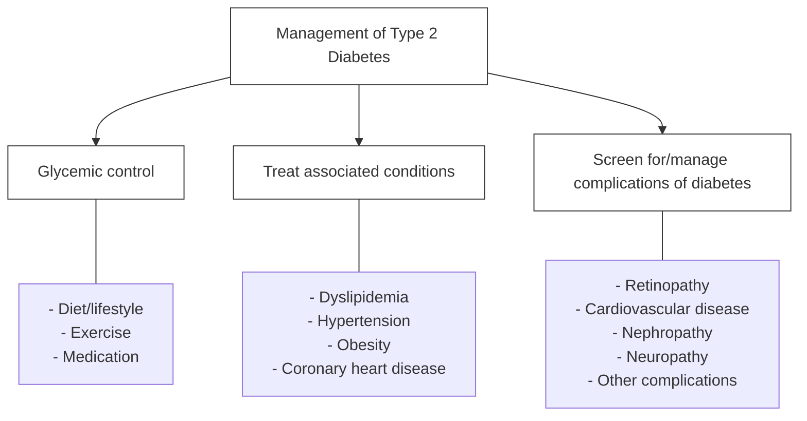

**Table 2. Oral hypoglycaemic drugs with their dose and their common ADRs**

<table>
  <thead>
    <tr>
        <th>Drugs</th>
        <th>Dose</th>
        <th>HbA1c reduction (%)</th>
        <th>Advantages</th>
        <th>Disadvantages</th>
        <th>Contraindications</th>
    </tr>
  </thead>
  <tbody>
    <tr>
        <td colspan="6">Biguanides</td>
    </tr>
    <tr>
        <td>Metformin</td>
        <td>Initially 500mg OD to max 2000 mg/d</td>
        <td>1-2</td>
        <td>Weight neutral, Do not cause hypoglycemia, inexpensive</td>
        <td>Diarrhoea, nausea, lactic acidosis</td>
        <td>Serum creatinine &gt;1.5 mg/dl (men) &gt;1.4 mg/dl (women), CHF, radiographic contrast studies, seriously ill patients, acidosis</td>
    </tr>
    <tr>
        <td colspan="6">Insulin secretagogues: Sulfonylureas</td>
    </tr>
    <tr>
        <td>Glimepiride<br/>Glipizide<br/>Glyburide</td>
        <td>1-8mg/d<br/>5-40mg/d<br/>1.25-20mg/d</td>
        <td>1-2</td>
        <td>Inexpensive</td>
        <td>Hypoglycemia, weight gain</td>
        <td>Renal/liver disease</td>
    </tr>
    <tr>
        <td colspan="6">Insulin secretagogues: Non-sulfonylureas</td>
    </tr>
    <tr>
        <td>Repaglinide</td>
        <td>0.5-16mg/d</td>
        <td>1-2</td>
        <td>Short onset of action, lower postprandial glucose</td>
        <td>Hypoglycemia</td>
        <td>Renal/liver disease</td>
    </tr>
    <tr>
        <td colspan="6">Thiazolidinediones</td>
    </tr>
    <tr>
        <td>Pioglitazone</td>
        <td>15-45 mg/d</td>
        <td>0.5-1.4</td>
        <td>Lower insulin requirements</td>
        <td>Peripheral edema, CHF,</td>
        <td>CHF, liver disease</td>
    </tr>
  </tbody>
</table>

119

Endocrine Diseases

<table>
  <thead>
    <tr>
        <th></th>
        <th colspan="2"></th>
        <th></th>
        <th></th>
        <th></th>
        <th>weight gain,<br/>fractures,<br/>macular edema</th>
        <th colspan="2"></th>
    </tr>
    <tr>
        <th colspan="6">-Glucosidase inhibitors</th>
        <th colspan="3"></th>
    </tr>
  </thead>
  <tbody>
    <tr>
        <td>Acarbose</td>
        <td>50-100mg</td>
        <td>0.5-0.8</td>
        <td>Reduce postprandial glycemia</td>
        <td>GI flatulence, liver function tests</td>
        <td>Renal/liver disease</td>
        <td colspan="3"></td>
    </tr>
    <tr>
        <td>Voglibose</td>
        <td>0.2-0.3mg (per meal)</td>
        <td></td>
        <td></td>
        <td></td>
        <td></td>
        <td colspan="3"></td>
    </tr>
    <tr>
        <th colspan="6">Dipeptidyl peptidase IV inhibitors</th>
        <th colspan="3"></th>
    </tr>
    <tr>
        <td>Saxagliptin</td>
        <td>2.5-5mg/d</td>
        <td>0.5-0.8</td>
        <td>Do not cause hypoglycemia</td>
        <td rowspan="3"></td>
        <td>Reduce dose with renal disease</td>
        <td colspan="3"></td>
    </tr>
    <tr>
        <td>Sitagliptin</td>
        <td>100mg/d</td>
        <td rowspan="2"></td>
        <td rowspan="2"></td>
        <td colspan="4"></td>
    </tr>
    <tr>
        <td>Vildagliptin</td>
        <td>50-100mg/d</td>
        <td></td>
        <td></td>
        <td colspan="2"></td>
    </tr>
  </tbody>
</table>

### Patient education

- Education topics important for optimal diabetes care include self-monitoring of blood glucose; urine ketone monitoring (type 1 DM); insulin administration; guidelines for diabetes management during illnesses; prevention and management of hypoglycaemia, foot and skin care; diabetes management before, during, and after exercise; and risk factor–modifying activities.
- Medical nutrition therapy (MNT) is a term used to describe the optimal coordination of caloric intake with other aspects of diabetes therapy (insulin, exercise, weight loss). Primary prevention measures of MNT are directed at preventing or delaying the onset of type 2 DM in high-risk individuals (obese or with prediabetes) by promoting weight reduction.
- Explain about the warning symptoms and signs of hypoglycaemia and need to take sweets/candies/drinks in such a situation.
- Regular follow up to monitor BP (quarterly), HbA<sub>1</sub>C testing (2-4 times/year), eye examination (annual), foot examination (1-2 times/year by physician; daily by patient); screening for diabetic nephropathy (annual); lipid profile (annual).

120

Endocrine Diseases

# Figure 2. Diabetes algorithm for achieving glycemic control


```description
The image is a complex flowchart titled "AACE/ACE Diabetes algorithm for Glycemic Control".
It starts with "Lifestyle modification" at the top.
Below that, it branches into three A1c categories:
1. A1c 6.5-7.5%**: Leads to Monotherapy (MET, DPP4, GLP-1, TZD, AGI, SGLT2). If goal not met in 2-3 months, it moves to Dual therapy.
2. A1c 7.6-9.0%: Leads to Dual therapy (MET + GLP-1 or DPP4 or TZD or SGLT2 or SU/Glinide). If goal not met in 2-3 months, it moves to Triple therapy.
3. A1c > 9.0%: Splits into "Drug-naive" and "Under treatment". Drug-naive further splits by symptoms. Symptomatic patients go to Insulin ± other agents. Asymptomatic patients go to Dual or Triple therapy.

A sidebar on the right contains 9 numbered footnotes explaining specific clinical considerations for various drug classes and patient conditions.
```

Abbreviations: MET: Metformin, DPP4: dipeptidyl peptidase-4 inhibitors, TZD: thiazolidinediones, GLP-1: glucagon-like peptide-1, FPG: fasting plasma glucose, PPG: post prandial glucose, AGI: alfa glucosidase inhibitors, SU: sulfonylureas

## DIABETIC KETOACIDOSIS

Diabetic ketoacidosis is an acute complication of diabetes. It consists of hyperglycemia, ketosis (positive serum ketones) and metabolic acidosis (with increased anion gap).

121

_Endocrine Diseases_

### Salient features

> - Nausea, vomiting, abdominal pain, dehydration and altered sensorium.
> - DKA results from relative or absolute insulin deficiency combined with counter regulatory hormone excess (glucagon, catecholamines, cortisol, and growth hormone).
> - Precipitating factors for DKA include noncompliance, infection, trauma, infarction, pregnancy and drug abuse.

**Diagnosis**

- Demonstration of ketones in urine (or elevated levels in blood), hyperglycaemia, low arterial pH, low bicarbonate (>15 mmol/l) and high anion gap (>15 mmol/1).

**_Pharmacological treatment_**

- Admit to hospital; intensive-care setting may be necessary for frequent monitoring or if pH <7.00 or unconscious. If the patient is vomiting or has altered mental status, a nasogastric tube should be inserted to prevent aspiration of gastric contents.
- Assess: Serum electrolytes (K+, Na+, Mg2+, Cl–, bicarbonate, phosphate), acid-base status- pH, HCO3–, PCO2, $\beta$-hydroxybutyrate (or S.acetone), renal function (creatinine, urine output)
- Replace fluids: 2–3 L of 0.9% saline over first 1–3 hr (15–20 ml/kg per hour); subsequently, 0.45% saline at 250–500 ml/h; change to 5% glucose and 0.45% saline at 150–250 ml/h when plasma glucose reaches 200 mg/dl. Fluid replacement needs to be closely monitored in elderly and those with cardiac or renal compromise.
- Administer short-acting insulin: IV (0.1units/kg), then 0.1 units/kg per hour by continuous IV infusion; increase two- to threefold if no response by 2–4 h. If the initial serum potassium is <3.3 mEq/L, do not administer insulin until the potassium is corrected. If the initial serum potassium is >5.2 mEq/L, do not supplement K<sup>+</sup> until the potassium is corrected.
- Assess patient: Initiate appropriate workup for precipitating event (cultures, CXR, ECG).
- Replace K<sup>+</sup>: 10 meq/h when plasma K<sup>+</sup>< 5.0–5.2 mEq/L (or 20–30 mEq/L of infusion fluid), ECG normal, urine flow and normal creatinine documented; administer 40–80 mEq/h when plasma K<sup>+</sup>< 3.5 mEq/L or if bicarbonate is given. The goal is to maintain the serum potassium at >3.5 mEq/L.
- Bicarbonate replacement: Despite a bicarbonate deficit, bicarbonate replacement is not usually necessary. However, in the presence of severe acidosis (arterial pH <6.9), it is advised to administer bicarbonate [50 mEq/L of sodium bicarbonate in 200 ml of sterile water with 10 mEq/L KCl per hour for 2 h until the pH is >7.0].
- Phosphate and Magnesium: If the serum phosphate < 1 mg/dl, then phosphate supplement should be considered and the serum calcium monitored. Hypomagnesemia may develop during DKA therapy and may also require supplementation.

122

Endocrine Diseases

- Monitoring: Measure capillary glucose every 1–2 h; measure electrolytes (especially K<sup>+</sup>, bicarbonate, phosphate) and anion gap every 4 h for first 24 h. Monitor blood pressure, pulse, respirations, mental status, fluid intake and output every 1–4 hrs.
- Hyperglycemia usually improves at a rate of 75–100 mg/dl per hour. As ketoacidosis improves, $\beta$-hydroxybutyrate is converted to acetoacetate. Ketone body levels may appear to increase if measured by laboratory assays that use the nitroprusside reaction, which only detects acetoacetate and acetone.
- Continue above until patient is stable, glucose goal is 150–250 mg/dl, and acidosis is resolved. Insulin infusion may be decreased to 0.05–0.1 units/kg per hour.
- Administer long-acting insulin as soon as patient is eating. Allow for overlap in insulin infusion and SC insulin injection.

**Hyperglycemic Hyperosmolar Nonketotic Coma**

- It is an acute metabolic derangement whose notable features are marked hyperglycemia, hyperosmolality (>350 mOsmol/L), and prerenal azotemia.
- In HONC, fluid losses and dehydration are usually more pronounced than in DKA due to the longer duration of the illness.
- The patients are usually older, more likely to have mental status changes, even with proper treatment, HHS has a substantially higher mortality rate than DKA.

**Chronic Complications of DM**

<table>
  <thead>
    <tr>
        <th>Microvascular Complications</th>
        <th>Treatment</th>
    </tr>
  </thead>
  <tbody>
    <tr>
        <td>Diabetic Retinopathy</td>
        <td>* Proliferative retinopathy is usually treated with panretinal laser photocoagulation, whereas macular edema is treated with focal laser photocoagulation.<br/>* Regular fundus examination is required to monitor the retinopathy.</td>
    </tr>
    <tr>
        <td>Diabetic Nephropathy</td>
        <td>* Administration of ACE inhibitors or ARBs<br/>* Insulin and other OHA requirement may decrease<br/>* give drugs according to renal clearance</td>
    </tr>
    <tr>
        <td>Diabetic Neuropathy</td>
        <td>* Once fully developed is difficult to treat.<br/>* The following drugs can be tried amitriptylin, pregabalin, gabapentin, carbamazepine, SSRI<br/>* Can lead to autonomic dysfunction and orthostatic hypotension.<br/>* Foot and joints most be examined for presence of injury.</td>
    </tr>
    <tr>
        <td>Diabetic Gastropathy</td>
        <td>* Smaller, more frequent meals that are easier to digest.<br/>* Dopamine antagonist's metoclopramide, 5–10 mg, and</td>
    </tr>
  </tbody>
</table>

123

Endocrine Diseases

<table>
  <tbody>
    <tr>
        <td rowspan="2"></td>
        <td>domperidone, 10–20 mg, before each meal. Erythromycin may promote gastric emptying.<br/>\* Diabetic diarrhoea treated with loperamide and may respond to octreotide (50–75 g three times daily, SC).</td>
    </tr>
    <tr>
        <td>Diabetic Cystopathy</td>
        <td>\* Timed voiding or self-catheterization, possibly with the addition of bethanechol.<br/>\* Drugs that inhibit type 5 phosphodiesterase are effective for erectile dysfunction</td>
    </tr>
    <tr>
        <td colspan="2">Macrovascular Complication- Atherosclerotic cardiovascular disease are the common cause of death in diabetic population</td>
    </tr>
    <tr>
        <td colspan="2">Atherosclerotic CVD are the common cause of death in diabetic population.<br/>Risk factor reduction is important. The important lipid target are as follows<br/>\* LDL &lt; 2.6 mmol/l (100 mg/dl);<br/>\* HDL &gt;1 mmol/l (40 mg/dl) in men and &gt;1.3 mmol/l (50 mg/dl) in women; and<br/>\* Triglycerides&lt;1.7 mmol/l (150 mg/dl).<br/>If the patient is known to have CHD, an LDL goal of &lt;1.8 mmol/L (70 mg/dl).</td>
    </tr>
  </tbody>
</table>

**Gestational Diabetes**
Please refer Obstetrics and Gynecology chapter – Pregnancy with diabetes.

124

_Chapter 8_

# GASTROINTESTINAL DISEASES

## APHTHOUS ULCERS

### Salient features

> - Recurrent, painful, rounded ulcer with yellowish gray fibrinoid centre.
> - Ulcer typically has recurrent appearance even after successful treatment

Rule out secondary causes like malabsorption syndrome, inflammatory bowel disease, Behcet's disease and recurrent trauma from tooth/denture and treat accordingly

**Non- pharmacological treatment**
Oral hygiene - repeated mouth wash with plain water specially after eating any thing

**Pharmacological treatment**

- Symptomatic treatment with application of any gel containing local anaesthetic before taking meals.
- Only in severe cases with large multiple ulcers.
- Pellets hydrocortisone 5 mg to be kept on the ulcer and sucked every 4 hours for 3-5 days.
  Or Tab. prednisolone 0.5 mg/kg/day in a single dose for 3-5 days.

**Patient education**

- Maintain good oral hygiene.
- Avoid precipitating factors, if any.
- Ensure toothbrush has aligned bristles.
- Avoid chewing betel leaf and other condiments, excessive carbonated drinks and spicy or sharp/crispy foods.
- Take plenty of green leafy vegetables.

## DYSPEPSIA

It is a non-specific group of symptoms related to the upper gastrointestinal tract. It is also referred to as non-ulcer dyspepsia / functional dyspepsia.

### Salient features

> - Epigastric burning pain, early satiety, post prandial fullness, hiccups, halitosis.

**Pharmacological treatment**

- Cap. omeprazole 20 mg once a day 45 minutes before breakfast for 4 to 6 weeks or
- Tab. ranitidine 150 mg twice a day 45 min. before breakfast and dinner for 4 to 6 weeks.
- Antacids 2 to 3 teaspoon or 2 tabs (chewable) when symptomatic despite above medication.
- For those with dysmotility symptoms,

125

Gastrointestinal Diseases

- Tab. domperidone 10 mg three times a day 30 minutes Before breakfast, lunch and dinner
- **Duration**: Short courses of therapy (4 to 6 weeks) of the drug may be repeated or long-term treatment may be continued for up to a year. Intermittent therapy or biweekly PPI is also recommended in those requiring long-term treatment
- Anti-_H.pylori_ treatment is recommended for those on long term NSAIDs or those with Duodenal / gastric ulcers (complicated e.g. bleeding). Combination of Cap.omeprazole 20 mg twice a day with Cap. amoxicillin 500 mg thrice a day with Tab. metronidazole 400 mg thrice day Followed by Cap. omeprazole 20 mg once a day for three weeks. It is desirable that the anti-H pylori regimen is taken for at least 14 days.

**Patient education**

- Avoid excess tea, coffee, fried food items and abstain from alcohol and smoking.
- Avoid unnecessary NSAIDs: prefer paracetamol especially those with ulcer like symptoms or those with documented duodenal/gastric ulcer.
- Follow meals at regular intervals: 4 hourly (including snacks)
- Daily exercise to maintain optimum weight.

### PEPTIC ULCER DISEASE

There is ulceration of the gastric or duodenal mucosa due to acid and pepsin.

#### Salient features

- Heart burn, relation with foods. In advance cases upper abdominal pain, weight loss, anorexia, cachexia may develop.
- History of NSAIDs or steroid ingestion.
- In case of perforation: severe abdominal pain, guarding, rigidity, shock.

**_Pharmacological treatment_**
Recommended for patients on long term NSAIDs, bleeding peptic ulcer. Preferred two-week triple therapy (Table 1), followed by Proton Pump Inhibitor (PPI) for 3 weeks.

**Table 1. Preferred regimen for eradication of _H.pylori_**

<table>
  <thead>
    <tr>
        <th>Drug</th>
        <th>Dose(mg)</th>
        <th>Frequency</th>
        <th>Duration</th>
    </tr>
  </thead>
  <tbody>
    <tr>
        <td>Bismuth subsalicylate</td>
        <td>2 tab</td>
        <td>QID</td>
        <td rowspan="3">Two Week</td>
    </tr>
    <tr>
        <td>Tetracycline</td>
        <td>250 mg</td>
        <td>QID</td>
    </tr>
    <tr>
        <td>Metronidazole</td>
        <td>500 mg</td>
        <td>QID</td>
    </tr>
    <tr>
        <td>Bismuth citrate</td>
        <td>400 mg</td>
        <td>BD</td>
        <td rowspan="3">Two Week</td>
    </tr>
    <tr>
        <td>Amoxicillin</td>
        <td>500 mg</td>
        <td>BD</td>
    </tr>
    <tr>
        <td>Metronidazole</td>
        <td>500 mg</td>
        <td>BD</td>
    </tr>
    <tr>
        <td>Omeprazole</td>
        <td>20 mg</td>
        <td>BD</td>
        <td rowspan="3">Two Week</td>
    </tr>
    <tr>
        <td>Amoxicillin</td>
        <td>1 gm</td>
        <td>BD</td>
    </tr>
    <tr>
        <td>Clarithromycin</td>
        <td>500 mg</td>
        <td>BD</td>
    </tr>
  </tbody>
</table>

126

Gastrointestinal Diseases

Non-_Helicobacter pylori_ peptic ulcer

- Any PPI for 4 to 6 weeks, 45 minutes before breakfast.
- Tab. ranitidine 150 mg BD OR Tab. famotidine 40 mg OD equally efficacious but takes longer time for symptom relief.

**Patient education**

- Stop smoking.
- Curtail alcohol intake.
- Avoid NSAIDs, prefer paracetamol.
- Avoid foods which aggravate symptoms; no ride for bland diet or excess milk.
- Meals at regular intervals.

### VOMITING

Vomiting is the forceful expulsion of the gastric contents due to contraction of abdominal musculature and simultaneous relaxation of gastric funds and lower esophageal sphincter.

**_Pharmacological treatment_**

- Hospitalize the patient to give intravenous fluids in case of dehydration. Start oral fluids as soon as the patient can tolerate. Appropriate analgesics if patient has severe pain.
- Acute vomiting : Rule out gastric outlet obstruction then Inj. odansetron 8 mg IV repeat 8 hourly if needed or Inj. metoclopramide 10 mg IM, repeat after 6 hours if needed or Tab. domperidone 10 mg three times a day or Tab. metoclopramide 10 mg three times a day
- In pregnancy avoid all drugs, if possible. Tab. promethazine 25 mg oral/injection is safe in the first trimester
- If there is history of motion sickness then give Tab. cyclizine 50 mg 3 times daily.

**Patient education**

- Avoid stale food, cut vegetables, fruits kept in open, drink potable water only.
- Avoid NSAIDS, especially if ulcer symptoms are present.
- Prevent dehydration: Encourage patients to take sips of liquids at short intervals to prevent dehydration.
- Endoscopy is necessary, if symptom persists.
- Prevent motion sickness by avoiding heavy meal before travel.

### IRRITABLE BOWEL SYNDROME (IBS)

A constellation of gastrointestinal symptoms associated with lower bowel symptoms that occur in absence of an organic disease.

#### Salient features

> - Abdominal pain, alternate diarrhea and constipation.
> - Abdominal distension, relief of abdominal symptoms with bowel motions, increased frequency of stool, sense of incomplete evacuation.
> - Pencil thin stool, heart burn, bloating, back pain, weakness, faintness, palpitation

127

_Gastrointestinal Diseases_

**Pharmacological treatment**

- If pain is predominant: Tab. mebeverine hydrochloride 270 mg three times a day given for long term or Tab. drotaverine 40 to 80 mg 3 times a day
- In those with depressive symptom: Tab. amitriptyline 10 mg HS for 4 to 6 weeks
- In those with diarrheal symptoms Tab. loperamide 2 to 4 mg daily for several days / weeks depending on the critical response.
- In those with constipation symptoms: Isotonic polyethylene glycol (PEG electrolyte) solution 125-250 ml. Or Lactulose solution 15 to 20 ml at night

**Patient education**

- Diet should contain high fiber and supplemented with bulk forming agents such as isaphghul husk.
- Avoid caffeine and alcohol.
- Avoid milk and other dietary constituents, which worsen the symptoms.
- Psychotherapy may be helpful in selected cases

### ACUTE GASTRO ENTERITIS

It is a self-limiting illness characterized by diarrhoea, abdominal cramps, nausea and vomiting, usually caused by viruses or bacteria (_E. coli, V. cholerae, Staph. aureus, Bacillus cereus_, etc). Most of these are noninvasive or toxic diarrhoea. Less commonly patients present mainly with diarrhoea with passage of mucous and/or blood in stools. This may be associated with significant systemic symptoms like fever, malaise, etc.

#### Salient features

> - Watery profuse loose motions which are unaffected by fasting, nausea and vomiting, abdominal cramps, dehydration, hypotension

**Pharmacological treatment (Figure 1)**

- In acute gastro enteritis the aim is to correct dehydration and electrolyte imbalance. There is usually no need to investigate for the etiology immediately.
- Further investigations are necessary if there is bloody diarrhea, clinical evidence of toxicity or prolonged diarrhea.
- Oral rehydration salt (ORS) : given in mild to moderate dehydration , 75 ml/kg in 4 hours in case of moderate dehydration
- IV fluid given in patients with severe dehydration (100 ml/kg). 30 ml/kg to be given in 30 minutes followed by 70 ml/kg in 2½ hours
- Tab ciprofloxacin 500 mg two times a day for 3 to 5 days. Indicated only in very ill patients with systemic symptoms associated with bloody diarrhea
- In amoebic dysentery Tab. metronidazole 400mg three times a day for 5 to 7 days. Oral Tab. tinidazole 600 mg twice a day for 3 to 5 days.

128

Gastrointestinal Diseases

- In acute giardiasis Tab. tinidazole 1000 mg single dose or Tab. metronidazole 400 mg three times a day for 3 days. Hospitalization is needed when there are clinical signs of dehydration especially in young children or in the elderly, suspected cholera, immune suppressed patients and those with severe systemic symptoms.

**Patient education**

- In the absence of vomiting patient should be asked to take sips of fluid.
- Fluids used at home can be juices, soups and ORS.
- Milk and related products are avoided for at least 2 weeks, because of secondary lactase deficiency.

**Figure 1. Algorithm for the treatment of acute diarrhea**

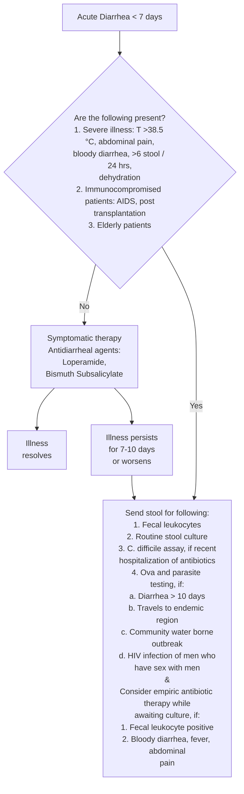

129

Gastrointestinal Diseases

# ULCERATIVE COLITIS (UC)

## Salient features

> - Patient may present in acute stage with bloody diarrhoea, may be associated with systemic symptoms of low to moderate fever, backache, arthralgias.
> - The diagnosis is confirmed by sigmoidoscopic examination and mucosal biopsies.
> - The disease almost always involves rectum and rest of the colon may be involved to variable length.
> - Acute disease is graded as mild (2-4 stool/day), moderate (4-6 stools/day) or severe (> 6 stools/day). During remission patient may be asymptomatic or may have extra-intestinal symptoms.

### Non- pharmacological treatment

There is no specific dietary restriction but patient may avoid any food if the patient is uncomfortable.

### Pharmacological treatment

**Mild to moderate acute ulcerative colitis (distal/left colonic involvement)**

- Tab. sulphasalazine 1 g 3-4 times a day. Or Tab. mesalazine 800 mg 3-4 times a day. Or Tab. olsalazine 1-3 g/day in divided doses.
- Prednisolone phosphate enema, 20 mg in 100 ml saline 1-2 time a day or Hydrocortisone enema 100-125 mg in 100 ml saline 1-2 times a day (to be prepared fresh).
- Or if disease limited to rectum, Hydrocortisone foam 125 mg 1-2 times a day.

**Moderate to severe or extensive acute disease**

- Start as above.
- Tab. prednisolone 20-60 mg/day in single or divided doses.

### Follow-up

If the symptoms do not improve or worsen, patient will need hospitalization.

**Acute severe disease with systemic symptoms (requires hospitalization under the care of specialist)**

- Inj. hydrocortisone 100 mg IV 4 times a day or Inj. dexamethasone 4 mg IV 3-4 times a day.
- Patient should be kept 'nil by mouth' and should be given adequate intravenous fluids and electrolytes.
- Blood transfusion to be given as per requirement.
- Patient switched over to oral steroids and aminosalicylates to be started as in I after 5 days when patient is allowed to take orally.
- If patient fails to respond to steroids, refer the patient to gastroenterologist for immunosuppressive therapy or surgery. Once the remission is induced, steroids are tapered slowly over 4-6 weeks period. For acute attack, there is no use of giving steroids for more than 12 weeks.

130

Gastrointestinal Diseases

**Follow-up**

- Close clinical/biochemical/radiological monitoring is required for any complications like toxic megacolon/perforation.

**Maintenance of remission**

- Any of the drugs used in I should be given lifelong.

**Patient education**

- Patient should be followed up at 6 monthly intervals and maintenance treatment should be continued.
- In any patient who has disease for more than 10 years, a regular sigmoidoscopy and rectal biopsy should be done at 6 monthly intervals to look for any dysplasia and total colonoscopic examination should be done at 2-3 year interval.
- Patient should be explained about chronic nature of the disease and continuation of maintenance treatment for life long with regular follow-up and risk of colonic cancer after 10 years of onset of disease

### GASTROESOPHAGEAL REFLUX DISEASE

Gastro esophageal reflux is a normal physiologic phenomenon experienced intermittently by most people, particularly after a meal. Gastro esophageal reflux disease (GERD) occurs when the amount of gastric juice that refluxes into the esophagus exceeds the normal limit, causing symptoms with or without associated esophageal mucosal injury (i.e., esophagitis).

#### Salient features

> - Heartburn, regurgitation, and dysphasia. However, a diagnosis of GERD based on the presence of typical symptoms is correct in only 70% of patients.
> - In addition to these typical symptoms, abnormal reflux can cause atypical (extraesophageal) symptoms, such as coughing, chest pain, and wheezing.
> - For patients with symptoms and history consistent with uncomplicated GERD, the diagnosis of GERD may be assumed and empirical therapy begun. Patients who show signs of GERD complications or other illness or who do not respond to therapy should be considered for further diagnostic testing.

**Investigations**

- Upper GI endoscopy - Endoscopy can help confirm the diagnosis of reflux by demonstrating complications of reflux (esophagitis, strictures, Barrett oesophagus) and can help in evaluating the anatomy (e.g., hiatal hernia, masses, strictures)
- Manometry helps surgical planning by determining the lower esophageal sphincter (LES) pressure and identifying any oesophageal motility disorders.
- Optional studies include: 24-hour pH probe test and nuclear medicine gastric emptying study

**Treatment**

131

_Gastrointestinal Diseases_

- Treatment of GERD involves a stepwise approach. The goals are to control symptoms, to heal esophagitis, and to prevent recurrent esophagitis or other complications.
- The treatment is based on lifestyle modification and control of gastric acid secretion through medical therapy with antacids or PPIs or surgical treatment with corrective anti reflux surgery.

### Pharmacological treatment

- Omeprazole 40 mg twice day half an hour before meals. Along with domperidone 30 mg sustained release
- This therapy causes resolution of GERD symptoms at 4 weeks and healing of esophagitis at 8 weeks so the treatment should be continued up to 8 weeks.

### Surgical Treatment

Indications for surgical treatment include the following:

- Patients with symptoms that are not completely controlled by PPI therapy can be considered for surgery.
- The presence of Barrett esophagus
- The presence of extraesophageal manifestations of GERD may indicate the need for surgery; these include the following: (1) respiratory manifestations (e.g., cough, wheezing, aspiration); (2) ear, nose, and throat manifestations (e.g., hoarseness, sore throat, otitis media); and (3) dental manifestations (e.g., enamel erosion)
- Young patients
- Poor patient compliance with regard to medications
- Postmenopausal women with osteoporosis
- Patients with cardiac conduction defects
- Cost of medical therapy
- Types of surgery: Open / Laparoscopic Nissen fundoplication

### Patient education

- Lifestyle modifications include the following losing weight (if overweight), avoiding alcohol, chocolate, citrus juice, and tomato-based products. Recent guidelines also suggest avoiding peppermint, coffee, and possibly the onion family as well.
- Avoiding large meals and waiting 3 hours after a meal before lying down, elevating the head of the bed 8 inches. Lifestyle modification is as effective as antacid therapy.

## UPPER GASTROINTESTINAL BLEEDING

Upper gastrointestinal haemorrhage remains a major medical problem. Causes includes esophageal, gastric, duodenal ulcer, erosions of esophageal, gastric, duodenal, Mallory Weiss tear, oesophageal varices, tumour, vascular lesion, e.g. dieulafoy's disease and others

### Investigations

- Hb, Abo-Rh, PT, APTT, Upper G.I. Scopy, Ultrasonography

**Treatment:** Primary and general management includes

132

_Gastrointestinal Diseases_

**_Pharmacological treatment_**

- Get wide bore access with IV cannula (16G preferable) for rapid fluid resuscitation, Ryle's tube insertion, catheterization,
- Inj. pantoprazole 40 mg IV 12 hourly, Inj. tranexamic acid 500 mg TDS
- Inj. octreotide 100 mcg IV 6 hourly, banding-in oesophageal varices, gastric balloon of Sengstaken blackmore tube- in oesophageal varices,
- Injection sclerotherapy- in oesophageal varices, argon diathermy- in peptic ulcers, laser-in peptic ulcers

**_Surgical treatment_**

- Exploratory laprotomy and search for the cause and treat the cause or TIPPS (Tran jugular intrahepatic portosystemic shunts) - in uncontrolled portal hypertension cases.

### ACUTE PANCREATITIS

Acute pancreatitis is the most common pathology of pancreas. It ranges from self limiting mild pancreatitis to life threatening necrotizing pancreatitis which accounts for 10-20% of total cases. Causes of acute pancreatitis: alcoholism gall stone disease, hypercholesterolemia hypercalcemia, hypermagnesemia pancreatic divism, viral infections, familial pancreatitis, others, idiopathic

#### Salient features

> - Epigastric pain, history of alcoholism, gall stone disease, Cholesterol and metabolic abnormalities, history of similar complains in family.
> - Per abdomen examination- look for tenderness, guarding, rigidity. Look for fever, tachycardia, tachypnoea, shock.

**Investigations**
TC with DC which shows increased with neutrophillia, S.amylase, increased more than 3 fold normal value, S. lipase (more specific), increased more than 3 fold of normal value, S. calcium below normal values, USG- Abdomen, shows edema of pancreas, necrosis, CECT- Abdomen (in unresolving and severe cases), delineates pancreatic anatomy more clearly, Chest X Ray, to rule out systemic complications like Acute Respiratory Distress Syndrome (ARDS)

**Prognostic indicators:** Ranson's score, Glasgow score, APACHE II score

**_Non pharmacological treatment_**
Nil by mouth, nasogastric tube insertion, avoid alcohol

**_Pharmacological treatment_**

- Fluid resuscitation, Correction of electrolyte imbalance
- Inj. diclofenac sodium 75 mg IM 8 hourly and gradually proceeding towards opioid analogue like Inj. tramadol 50 mg once day

133

Gastrointestinal Diseases

- Inj. pantoprazole 40 mg IV 12 hourly and Inj. octreotide 100 microgram IV/SC 6 hourly to 12 hourly till resolution of symptoms

**_Surgical treatment_**

- Usually no surgical intervention is required for acute non necrotising pancreatitis.
- Cholecystectomy for gall stone pancreatitis after acute pancreatitis is resolved

**Acute necrotising pancreatitis**
**_Non pharmacological treatment_**

- ICU monitoring, oxygen by mask, nil by mouth, nasogastric tube insertion per urethral catheterization

**_Pharmacological treatment_**

- Fluid resuscitation, correction of electrolyte imbalance
- Inj. meropenem 1 gm IV 8 hourly
- Inj. diclofenac sodium 75 mg IM 8 hourly
- Inj. pantoprazole 40 mg IV 12 hourly
- Inj. octreotide 100 microgram IV/SC every 6 hourly to 8 hourly

**_Surgical treatment_**

- Pancreatic necrosectomy, distal pancreatectomy ( for disease in body and tail)
- Cholecystectomy for gall stone pancreatitis after acute pancreatitis is resolved.

### CHRONIC PANCREATITIS

Chronic pancreatitis is a disease of pancreas characterized by pancreatic atrophy, fibrosis, calcification and at times ductal dilatation. It is most commonly caused by repeated alcoholic pancreatitis.

#### Salient features

> - Dull epigastric pain, Weight loss, Malnutrition, Pancreatic diabetes
> - History of alcoholism, History of previous attacks of acute pancreatitis.
> - Usually non specific, Signs of cachexia and malnutrition

**Investigations**
S. amylase and S. Lipase has usually no role. X-ray abdomen, may show calcification in pancreatic region. USG- Abdomen shows atrophic pancreas with or without foci of calcification and ductal dilatation. Magnetic Resonance Cholangiopancreatography (MRCP) gives excellent anatomy of ductal system. Endoscopic Retrograde Cholangiopancreatography (ERCP), reserved for chronic pancreatitis due to peri ampullary obstruction

**_Non- pharmacological treatment_**

- Avoidance of alcohol, low fat, Low protein diet

**_Pharmacological treatment_**

- Enteric coated pancreatic enzymes, for replacement of pancreatic function,

134

Gastrointestinal Diseases

- Inj. diclofenac sodium 75 mg IM 8 hourly and gradually proceeding towards opioid analogue like Inj. tramadol 50 mg
- Inj. pantoprazole 40 mg IV 12 hourly

**_Surgical treatment_**

- Indicated in severe pain non responding to pharmacological therapy
- Peustaw procedure ( LPJ, Longitudinal Pancreatico-jejunostomy), Frey's procedure ( LPJ with coring out of head ), Duval procedure ( Distal Pancreatico-jejunostomy ), Distal pancreatectomy, for lesion confined to body and tail,
- Duodenum preserving pancreatic head resection, DPPHR, Beger's procedure, for lesion confined to head region. Endoscopic stenting, for obstruction in pancreatic duct, coeliac block, for patients unfit for surgery.

### CONSTIPATION

Commonest cause is habitual, the important contributory factors being insufficient dietary fiber, physical inactivity, suppression of defaecatory urges occurring at inconvenient moments, prolonged travel etc. Constipation may also occur following an attack of diarrhoea on the day after taking a purgative; this needs no treatment. The important secondary causes may include neurological, hormonal, colonic, malignancy, depression. Secondary causes should be looked for in case of recent onset or constipation of severe symptoms.

#### Salient features

> - Constipation is defined as decrease in frequency and liquidity of stool compared to the normal pattern in a particular individual.
> - Important complaints suggesting constipation include straining at defaecation >25% of time, lumpy/hard stools, sensation of incomplete evacuation, or less than 3 bowel actions per week.

**_Non- pharmacological treatment_**

- Reassurance - since many patients with normal stools and in pregnancy, imagine that they are constipated.
- High fiber diet and increased intake of fluid with decrease in consumption of caffeinated drinks.
- Retraining of bowels (avoiding suppression of urge to defecate, making a regular habit).
- Bulk forming agents like 'isapghula husk' or 'psyllium seeds' also help to relieve mild constipation.
- Regular physical exercise such as walk for 1/2 to 1 hour daily and abdominal exercises.

**_Pharmacological treatment_**
(Usually required for moderate to severe constipation).

- Lactulose Soln 15-20 ml orally at night. Or Susp. magnesium sulphate 15-20 ml at night. Or Tab. sodium picosulphate 10 mg at night. Or

135

_Gastrointestinal Diseases_

- Isotonic polyethylene glycol (PEG) electrolyte solution 125-250 ml.
- Any of these may be given 2-4 times a week. Some patients may require treatment for several weeks or months if there is no improvement.
- Tab. mosapride 5 mg 2 or 3 times a day. In some patients may be required for several weeks.
- Phosphate enemas to be used on as and when required basis in patients having acute problem with severe constipation or sub-acute intestinal obstruction.

**Follow-up**

- If patient continues to have severe constipation or symptoms worsen, refer the patient to a specialist for investigations to rule out secondary causes.
- Recent unexplained constipation (not acute) in an elderly person whose bowel habits were always regular should be investigated.
- Acute constipation especially when the patient is vomiting and has not passed even wind and appears ill, suspect GIT obstruction and refers immediately to a higher centre.

**Patient education**

- Do not use purgative frequently to treat constipation as it may form a habit.
- Do not use purgatives to treat constipation with fever and following heart attack. A suppository or simple enema is preferred.
- In pregnancy ispaghula is preferred.

### AMOEBIC LIVER ABSCESS

Amoebic liver abscess is most common type of liver abscess in tropical countries. It is caused by infection by _Entamoeba histolyticum_ through feco-oral route which reaches liver via portal circulation, causing necrosis of liver tissue resulting in what is known as anchovy sauce pus.

#### Salient features

> - Abdominal pain in right upper quadrant, fever, history of diarrhea in past 7-10 days.
> - Physical examination revels tenderness in right hypochondriac region, Palpable liver and signs of jaundice.

**Investigations**

- TC with D increased, PT, APTT: elevated, Liver Function Tests (S. Billirubin, SGPT, and Albumin).
- Chest X Ray (elevated right diaphragm, rules out perforation). USG Abdomen, CECT Abdomen ( if rupture of abscess is suspected extra peritoneal )
- Diagnostic aspiration of abscess followed by routine microscopic and culture- sensitivity of pus

**_Non- pharmacological treatment_**

- High glucose diet, Low protein diet

136

_Gastrointestinal Diseases_

**_Pharmacological treatment_**

- Tab. metronidazole 800 mg TDS for 2 weeks followed by Tab. diloxanide furoate 500 mg BD for 10 days.
- Inj. diclofenac sodium 75 mg IM 8 hourly.
- Inj. pantoprazole 40 mg IV 12 hourly.
- Vit. K injections if PT/APTT is altered.

**_Surgical treatment_**

- Amoebic liver abscess usually does not require drainage. Percutaneus aspiration can be done in abscess having large size (>100 cc).
- Exploratory laparotomy with drainage of abscess is required in suspected ruptured liver abscess

### PYOGENIC LIVER ABCESS

It is the most common type of liver abscess in western world. It can be caused by ascending infection from biliary tract, infection via portal blood supply, hematogenous via hepatic artery, direct spread ( gall bladder, duodenum, colon ) or cryptogenic.

#### Salient features

> - Abdominal pain in right upper quadrant (RHC), fever, tenderness in RHC.
> - Palpable liver and jaundice

**Investigations**

- TC with DC, elevated with neutrophillia, PT, APTT is elevated
- Liver Function Tests (S. bilirubin, SGPT, albumin), Chest X Ray ( elevated right diaphragm, rules out perforation ), USG Abdomen, CECT Abdomen ( if rupture of abscess is suspected extra peritoneally).
- Diagnostic aspiration of abscess followed by routine microscopic and culture- sensitivity of pus

**_Non- pharmacological treatment_**

- High glucose diet, low protein diet

**_Pharmacological treatment_**

- Inj. ceftrioxone 1-2 g IV BD
- Inj. diclofenac sodium 75 mg IM 8 hourly
- Inj. pantoprazole 40 mg IV 12 hourly
- Vit. k injections if PT/APTT are altered

**_Surgical treatment_**

- Percutaneous aspiration can be done in abscess cavity and usually requires 2-3 settings of aspirations done alternate day. Percutaneus pigtail catheter can be used to avoid repeated aspirations. Laparoscopic drainage of liver abscess if site of abscess permits.
- Exploratory laparotomy with drainage of abscess is required in suspected ruptured liver abscess.

137

_Chapter 9_

# INFECTIONS

## TETANUS

It is an acute neurological disorder resulting from contamination of a wound by an obligate anaerobic organism _Clostridium tetani_.

### Salient features

> - Generalized tetanus starts with trismus or lockjaw followed by rigidity, violent, painful, generalized muscle spasms and seizures provoked by slightest stimulation. Generalized muscle spasm may compromise respiration, fever and tachycardia may be present.
> - Prognosis and management depends on grade.

### Investigations

- Clinical - culture of _C. tetani_ from a wound provides supportive evidence. The few conditions that mimic generalized tetanus include strychnine poisoning and dystonic reactions to antidopaminergic drugs. Abdominal muscle rigidity is characteristically continuous in tetanus but is episodic in the latter two conditions. Cephalic tetanus can be confused with other causes of trismus, such as oropharyngeal infection.
- Hypocalcemia and meningoencephalitis are included in the differential diagnosis of neonatal tetanus.

### Grading

- Mild or grade 1 – muscle rigidity with few or no spasms.
- Moderate or grade 2- trismus, dysphagia, rigidity and short lasting spasms.
- Severe or grade 3- frequent explosive spasms, autonomic dysfunction particularly sympathetic over activity may be present.
- Very severe or grade 4- features of grade 3 plus violent autonomic disturbances involving the CVS – severe hyper or hypotension.

### Non-pharmacological treatment

- Admit in a quiet room or ICU with minimum stimulation.
- Protection of airways (intubation/tracheostomy) with or without mechanical ventilation. Monitor cardiovascular parameters.
- Cleaning/exploration/debridement of wound
- Maintain hydration and enteral/parentral nutrition with high calorie and high protein diet.

### Pharmacological treatment

#### Grade 1

- Tab. diazepam 5-20 mg 3 times a day; slow IV infusion in moderate to severe tetanus; not exceed a dose of 80-100mg in 24 hours.
- If spasms not controlled, Inj. phenobarbitone 200mg IM every 8-12 hours or Inj. chlorpromazine 50 mg IM in adults 4 times a day.

138

Infections

- The ideal sedative and muscle relaxant schedule for each patient should be individualized. An objective guide to decrease in rigidity is relaxation of abdominal muscles.

**Grade 2**

- Tracheostomy

**Grade 3 and 4**

- Ventilatory support
- Inj. pancuronium 2-4mg or gallamine 20-40mg IV.
- If hypotension, give vasopressor support and if hypertension, give antihypertensive.
- For bradyarrythmias, Inj. atropine 0.6-1.2 mg IV.

**In addition, give following to all patients;**

- Inj. crystalline 2 mega units 6 hourly IV for 10 days or Inj. metronidazole 500mg 8 hourly or 1gm 12 hourly. Requirement may be according to the infected wound.
- Inj. human tetanus immunoglobulin (TIG) 3000-5000 units IV or IM or Inj. equine antiserum 10000 units by slow IV injection after sensitivity test when human TIG is not available.
- Antiserum should be given before local manipulation of the wound.

### LEPTOSPIROSIS

Leptospirosis is an infectious disease caused by the spirochete _Leptospira_.

#### Salient features

> - Rodents are the important reservoirs. Leptospires may enter the host through abrasions in the skin or intact mucosa, the conjunctive and the lining of oro-and naso-pharynx in contact with water contaminated with leptospira.
> - 90% of symptomatic persons have the mild and usual anicteric form of leptospirosis, with or without meningitis. Severe leptospirosis with profound jaundice – Weil’s syndrome-occurs in 5 to 10% of patients. The common finding in anicteric leptospirosis is fever with conjunctival suffusion. Mild jaundice may be present.

**Investigations**

- Culture- Blood, CSF and urine is the definite way of confirming the diagnosis of leptospirosis
- Micro agglutination (MAT)
  - Sero conversion / four fold rise in the titer a
- ELISA / MSAT
  - Positive

**Pharmacological treatment**

- All clinically suspected leptospirosis patients in endemic area during rainy season should be given presumptive treatment of leptospirosis and malaria. Tab. doxycycline 100 mg

139

Infections

twice daily for 7 days and Tab. chloroquine 600mg (base) stat followed by 600 mg after 24 hours and 300 mg after another 24 hours in malaria endemic areas in adults.

**Note:** In children less than 6 years 30-50 mg/kg/day of Cap. amoxicillin / Cap. ampicillin should be given in divided doses 6 hourly for 7 days in place of doxycycline.

**Definitive treatment**

- Inj. crystalline penicillin 20 lacs IU IV 6 hourly after negative test dose (ANTD) for 7 days. For children the dose of crystalline penicillin should be 2-4 lacs IU/kg/day for 7 days.
- For penicillin sensitive patients, Inj.ceftrioxone 1 gm IV. once daily for 7 days or Inj.cefotaxime 1 gm. IV. 6 hours daily for 7 days

**Symptomatic and supportive treatment**

- Care of fluid and electrolyte balance. Hypovolemia and hypotension need prompt treatment with IV fluids. Patients with oligouria, if prerenal azotemia is suspected, prompt diuresis should be attempted with fluid therapy.
- Headache and myalgia to be treated with analgesic. Fever with antipyretic.
- Restlessness and anxiety with sedatives and anemia with blood transfusion.
- Peritoneal dialysis has been found to be safe, simple and effective procedure for management of renal failure due to leptospirosis. If there is contraindication to peritoneal dialysis, hemodialysis can be done.

### CHOLERA

It is an acute diarrheal disease that occurs in few hours, result in profound, rapidly progressive dehydration and death. Caused by _V. cholerae_ serogroup O1 or O139—i.e., the serogroups with epidemic potential.

#### Salient features

> - Asymptomatic or have mild diarrhoea; some may have sudden onset of explosive and life-threatening diarrhoea (_cholera gravis_). In a non-immune individual, after 24 to 48h incubation period, characteristic sudden onset of painless watery voluminous diarrhoea. Patients often vomit. In severe cases, volume loss can exceed 250 ml/kg in the first 24 h. If fluids and electrolytes are not replaced, hypovolemic shock and death may ensue.
> - Fever is usually absent. Muscle cramps due to electrolyte disturbances are common. The stool has a characteristic appearance: a nonbilious, gray, slightly cloudy fluid with flecks of mucus, no blood, and a somewhat fishy, inoffensive odour, known as "rice-water" stool.
> - Clinical symptoms parallel volume contraction: At losses of <5% of normal body weight, thirst develops; at 5–10%, postural hypotension, weakness, tachycardia, and decreased skin turgor are documented; and at >10%, oliguria, weak or absent pulses, sunken eyes (and, in infants, sunken fontanelles), wrinkled ("washerwoman") skin, somnolence, and coma.
> - Complications due to volume and electrolyte depletion- renal failure.

140

Infections

### Investigation

- Identification of _V. cholerae_ in stool examination directly by dark-field microscopy on a wet mount of fresh stool, and its serotype by immobilization with specific antiserum. Laboratory isolation of the organism requires the use of a selective medium such as taurocholate-tellurite-gelatin (TTG) agar or thiosulfate–citrate–bile salts–sucrose (TCBS) agar. Standard microbiologic biochemical testing for _Enterobacteriaceae_ will suffice for identification of _V. cholerae_. All vibrios are oxidase-positive.
- A point-of-care antigen-detection cholera dipstick assay is now commercially available for use in the field or where laboratory facilities are lacking.

### Non- pharmacological treatment

- ORS may be made by adding safe water to prepackaged sachets containing salts and sugar or by adding 0.5 teaspoon of table salt (NaCl; 3.5 g) and 4 tablespoons of table sugar (glucose; 40 g) to 1 L of safe water.
- Potassium intake in bananas or green coconut water should be encouraged.

### Pharmacological treatment

- Euvolemia should first be rapidly restored, and adequate hydration should then be maintained to replace ongoing fluid losses (Table 1& 2).
- WHO recommends "low-osmolarity" ORS for treatment of dehydrating diarrhea. If available, rice-based ORS is considered superior to standard ORS in the treatment of cholera. ORS can be administered via a nasogastric tube to individuals who cannot ingest fluid.
- Optimal management for severe dehydration includes the administration of IV fluid and electrolytes. Ringer's lactate is the best choice among commercial products. It must be used with additional potassium supplements, preferably given by mouth. The total fluid deficit in severely dehydrated patients (>10% of body weight) can be replaced safely within the first 3–6 h of therapy, half within the first hour. Transient muscle cramps and tetany are common. Thereafter, oral therapy can usually be initiated, with the goal of maintaining fluid intake equal to fluid output.
- Patients with continued large-volume diarrhea may require prolonged IV treatment to match gastrointestinal fluid losses. Severe hypokalemia can develop but will respond to potassium given either IV or orally. In the absence of adequate staff to monitor the patient's progress, the oral route of rehydration and potassium replacement is safer than the IV route.

**Table 1. Assessing the Degree of Dehydration in Patients with Cholera**

<table>
  <thead>
    <tr>
        <th>Degree of Dehydration</th>
        <th>Clinical Findings</th>
    </tr>
  </thead>
  <tbody>
    <tr>
        <td>None or mild, but diarrhea</td>
        <td>Thirst in some cases; &lt;5% loss of total body weight</td>
    </tr>
    <tr>
        <td>Moderate</td>
        <td>Thirst, postural hypotension, weakness, tachycardia, decreased skin turgor, dry mouth/tongue, no tears; 5–10% loss of total body weight</td>
    </tr>
  </tbody>
</table>

141

Infections

<table>
  <tbody>
    <tr>
        <td>Severe</td>
        <td>Unconsciousness, lethargy, or "floppiness"; weak or absent pulse; inability to drink; sunken eyes (and, in infants, sunken fontanelles); &gt;10% loss of total body weight</td>
    </tr>
  </tbody>
</table>

### Table 2. Treatment of Cholera, Based on Degree of Dehydration

<table>
  <thead>
    <tr>
        <th>Degree of Dehydration, Patient's Age (Weight)</th>
        <th>Treatment</th>
    </tr>
  </thead>
  <tbody>
    <tr>
        <td colspan="2">None or Mild, but Diarrhea</td>
    </tr>
    <tr>
        <td>&lt;2 years</td>
        <td>1/4–1/2 cup (50–100 ml) of ORS, to a maximum of 0.5 L/d</td>
    </tr>
    <tr>
        <td>2 – 9 years</td>
        <td>1/2–1 cup (100–200 ml) of ORS, to a maximum of 1 L/d</td>
    </tr>
    <tr>
        <td>More than 10 years</td>
        <td>As much ORS as desired, to a maximum of 2 L/d</td>
    </tr>
    <tr>
        <td colspan="2">Moderate</td>
    </tr>
    <tr>
        <td>&lt;4 months (&lt;5 kg)</td>
        <td>200–400 ml of ORS</td>
    </tr>
    <tr>
        <td>4–11 months (5–&lt;8 kg)</td>
        <td>400–600 ml of ORS</td>
    </tr>
    <tr>
        <td>12–23 months (8–&lt;11 kg)</td>
        <td>600–800 ml of ORS</td>
    </tr>
    <tr>
        <td>2–4 years (11–&lt;16 kg)</td>
        <td>800–1200 ml of ORS</td>
    </tr>
    <tr>
        <td>5–14 years (16–&lt;30 kg)</td>
        <td>1200–2200 ml of ORS</td>
    </tr>
    <tr>
        <td>15 years ( ≥ 30 kg)</td>
        <td>2200–4000 ml of ORS</td>
    </tr>
    <tr>
        <td colspan="2">Severe</td>
    </tr>
    <tr>
        <td>All ages and weights</td>
        <td>IV fluid replacement with Ringer's lactate (or, if not available, normal saline): 100 ml /kg in first 3-h period (or first 6-h period for children &lt;12 months old); start rapidly, then slow down; total of 200 ml/kg in first 24 h; continue until patient is awake, can ingest ORS, and no longer has a weak pulse</td>
    </tr>
  </tbody>
</table>

- Tab. doxycycline (a single dose of 300 mg) or tetracycline (12.5 mg/kg four times a day for 3 days) may be effective in adults but is not recommended for children <8 years of age because of possible deposition in bone and developing teeth. Pregnant women and children are usually treated with erythromycin or azithromycin (10 mg/kg in children).

### INFLUENZA INFECTION

It is a respiratory disease of pigs affecting human beings, caused by types A influenza viruses with regular outbreaks in pigs. Source of the virus in swine are avian, human and swine. All three viruses re-assort and form a new virus which is a mixture of all three. At present there are four types H1N1, H1N2, H3N2 and H3N1. The present pandemic is by influenza AH1N1 type.

142

Infections

**Case Definitions**

- A confirmed case of H1N1 infection is defined as a person with an acute febrile respiratory illness with laboratory confirmed H1N1 infection at CDC by one or more of the following tests: realtime RT-PCR, viral culture or four fold increase in H1N1 virus specific neutralizing antibodies.
- A probable case of H1N1 is a defined as a person with acute respiratory illness who is positive for influenza A but negative to H2 and HB by RT-PCR.
- A suspected case of H1N1 is defined a person with an acute febrile respiratory illness who has had dose contact with a person who is a swine-origin influenza confirmed case or travelled to a community one or more confirmed swine origin influenza cases or resides in a community where there are one or more confirmed swine origin influenza A (H1N1) cases.

**Salient features**

> - Symptoms include fever, headache, cough, sore throat, rhinorrhea, myalgia, fatigue, vomiting, or diarrhea. Patients appear flushed and the skin is hot and dry. Pharynx is normal despite a severe sore throat.
> - There may be mild cervical lymphadenopathy. Illness generally resolves over 2-5 days and recovery occurs in 1 week. Cough may persist 1-3 weeks longer and post influenza asthenia may persist for several weeks.
> - Frank dyspnoea, hyperpnoea, cyanosis, diffuse rales and signs of consolidation are indicative of pulmonary complications. Symptoms of severe disease may include apnea, tachypnoea, dyspnoea, cyanosis, dehydration, altered mental status and extreme irritability.

**Investigations**
Upper respiratory specimens, nasopharyngeal swab or wash, nasal, aspirate or tracheal aspirate should be tested by the state public health laboratory. Real time RT-PCR, viral cultures are to be performed to confirm the H1N1 infection.

**_Pharmacological treatment_**
The guiding principles are:

- Early implementation of infection control precautions to minimize nosocomical / household spread of disease
- Prompt treatment to prevent severe illness & death.
- Early identification and follow up of persons at risk.
- Tab. oseltamivir is the recommended drug both for prophylaxis and treatment. Dose for treatment is as follows: By weight <15kg 30 mg BD for 5 days , 15-23kg 45 mg BD for 5 days , 24 ≤ 40kg 60 mg BD for 5 days , >40kg 75 mg BD for 5 days
- For infants < 3 months 12 mg BD for 5 days, 3-5 months 20 mg BD for 5 days 6-11 months 25 mg BD for 5 days. If needed dose & duration can be modified as per clinical condition.

143

Infections

Caution: Oseltamivir is generally well tolerated, gastrointestinal side effects (transient nausea, vomiting) may increase with increasing dose.

**Supportive therapy**

- IV fluids, parentral nutrition.
- Oxygen therapy/ ventilatory support.
- Antibiotics for secondary infection.
- Vasopressors for shock.
- Paracetamol or ibuprofen is prescribed for fever, myalgia and headache. Patient is advised to drink plenty of fluids. Smokers should avoid smoking. For sore throat, short course of topical decongestants, saline nasal drops, throat lozenges and steam inhalation may be beneficial.
- Salicylate / aspirin is strictly contra-indicated in any influenza patient due to its potential to cause Reye's syndrome.
- The suspected cases would be constantly monitored for clinical / radiological evidence of lower respiratory tract infection and for hypoxia (respiratory rate, oxygen saturation, level of consciousness).
- Patients with signs of tachypnea, dyspnea, respiratory distress and oxygen saturation less than 90 per cent should be supplemented with oxygen therapy. Types of oxygen devices depend on the severity of hypoxic conditions which can be started from oxygen cannula, simple mask, partial re-breathing mask (mask with reservoir bag) and non re-breathing mask. In children, oxygen hood or head boxes can be used.
- Patients with severe pneumonia and acute respiratory failure (SpO<sub>2</sub> < 90% and PaO2 <60 mmHg with oxygen therapy) must be supported with mechanical ventilation. Invasive mechanical ventilation is preferred choice. Non invasive ventilation is an option when mechanical ventilation is not available. To reduce spread of infectious aerosols, use of HEPA filters on expiratory ports of the ventilator circuit / high flow oxygen masks is recommended.
- Maintain hydration, electrolyte balance and nutrition.
- If the laboratory reports are negative, the patient would be discharged after giving full course of oseltamivir. Even if the test results are negative, all cases with strong epidemiological criteria need to be followed up.
- Immunomodulating drugs have not been found to be beneficial in treatment of ARDS or sepsis associated multi organ failure. High dose corticosteroids in particular have no evidence of benefit and there is potential for harm. Low dose corticosteroids (Tab. hydrocortisone 200-400 mg/ day) may be useful in persisting septic shock (SBP < 90).
- Suspected cases not having pneumonia do not require antibiotic therapy. Antibacterial agents should be administered, if required, as per locally accepted clinical practice guidelines. Patient on mechanical ventilation should be administered antibiotics prophylactically to prevent hospital associated infections.

144

Infections

# HIV AND AIDS

Human immunodeficiency virus (HIV) infection leads to progressive immunodeficiency and increased susceptibility to infections, including tuberculosis. The rate of disease progression is highly variable between individuals, ranging from 6 months to than 20 yrs. The median time to develop Acquired Immunodeficiency Syndrome (AIDS) after transmission is 10 yrs in the absence of Antiretroviral therapy (ART). The case definition of AIDS is fulfilled at least 2 major signs and at least 1 minor sign are present where HIV testing facilities are not available. In children if 2 major and 2 minor signs are present (if no other causes for immunosuppression)

### Salient features

> **Major signs and symptoms:**
>
> - Weight loss (> 10 kg or > 20% of original weight)
> - Diarrhoea (> 1 month)
> - Fever for more than 1 month
>
> **Minor signs:**
>
> - Herpes zoster (shingles), Pruritic popular rash.
> - Kaposi’s sarcoma
> - Persistent generalized lymphadenopathy (PGL)
> - Oral candidiasis, Oral hairy leukoplakia
> - Persistent painful genital ulceration
> - The persistence of either Kaposi’s sarcoma or cryptococcal meningitis is sufficient for the case definition of AIDS.
>
> **HIV disease is characterized by three phase.**
>
> - Acute primary illness, Asymptomatic chronic illness, Symptomatic chronic illness

### Investigations

- HIV serology
- CD4 + T lymphocytes counts (if available)
- Complete blood count and chemistry of profile and pregnancy test

**Supplementary test indicated by history and physical examination**

- Chest x-ray
- Urine for routine and microscopic examination
- Hepatitis C Virus (HCV) and Hepatitis B Virus (HBV) serology (depending on test availability and resources)

**Important note:** It is most important to confirm the diagnosis of HIV infection by tests performed by a trained technician, preferably in a diagnostic laboratory. The test results should include the type of test performed to establish the diagnosis based on WHO guidelines. In case there is any doubt, the test should be repeated in a standard/referral laboratory.

145

Infections

**WHO Clinical staging of HIV Disease for Adults**

**Primary HIV Infection**

- Asymptomatic
- Acute retroviral syndrome

**Clinical stage I**

- Asymptomatic
- Persistent generalized lymphadenopathy (PGL)

**Clinical Stage 2**

- Moderate unexplained weight loss (< 10% of presumed or measured body weight)
- Recurrent respiratory tract infections.
- Sinusitis, Bronchitis, otitis media, pharyngitis
- Herpes zoster, angular cheilitis, recurrent oral ulcerations.
- Papularpruritic eruptions, seborrhoeic dermatitis
- Fungal nail infections of fingers.

**Clinical stage 3-** Conditions where a presumptive diagnosis can be made on the basis of clinical signs or simple investigations.

- Severe weight loss (> 10% of presumed or measured body weight)
- Unexplained chronic diarrhea for longer than one month.
- Unexplained persistent fever (intermittent or constant for longer than one month)
- Oral candidiasis, Oral hairy leukoplakia
- Pulmonary tuberculosis (TB), Severe bacterial infections (e.g. pneumonia, emphysema, pomposities, bone or joint infection, meningitis, bacteraemia)
- Acute necrotizing ulcerative stomatitis, gingivitis or periodontitis

**Clinical stage 4-** Conditions where the diagnosis can be made on the basis of clinical signs or simple investigations.

- HIV wasting syndrome
- Pneumocystic pneumonia, recurrent severe or radiological bacterial pneumonia.
- Chronic herpes simplex infection (orolabial, genital or anorectal of more than one month's duration)
- Esophageal candidiasis
- Extra-pulmonary tuberculosis including tuberculous lymphadenopathy.
- Kaposi sarcoma
- Central nervous system (CNS) toxoplasmosis
- HIV encephalopathy.

_Conditions where confirmatory diagnostic testing is necessary:_

- Extra – pulmonary crytococcosis including meningitis.
- Disseminated nontuberculous mycobacterial infection.
- Progressive multifocal leukoencephalopathy (PML)

146

Infections

- Candida of trachea, bronchi or lungs
- Crytosporiodiosis, isosporiasis
- Visceral herpes simplex infection.
- Cytomegalovirus (CMV) infection (retinitis or of an organ other than liver, spleen or lymph nodes)
- Any disseminated mycosis (e.g. histoplasmosis, coccidiomycosis, penicilliosis)
- Recurrent non-typhoidal salmonella septicaemia
- Cerebral or B-cell Non-Hodgkin lymphoma
- Invasive cervical carcinoma
- Visceral leishmaniasis

**Table 3. Initiation of ART in Adults and Adolescents National Guidelines, 2011**

<table>
  <thead>
    <tr>
        <th colspan="2">Based on WHO Clinical Staging and CD4 Count</th>
    </tr>
    <tr>
        <th>WHO Clinical Staging</th>
        <th>CD4 (cells/cu.mm)</th>
    </tr>
  </thead>
  <tbody>
    <tr>
        <td>I and II</td>
        <td>Treat if CD4 Count &lt;350</td>
    </tr>
    <tr>
        <td>III and IV</td>
        <td>Treat irrespective of CD4 Count</td>
    </tr>
  </tbody>
</table>

Initiation of ART in PLHIV with Pregnancy (Table 4): Same as above. Avoid efavirenz during first trimester. Strict Monitoring for Adverse effects of Nevirapine is needed if CD4 count is >250.

**Table 4. Initiation of ART in Person living with HIV (PLHIV) with TB Co-infection**

<table>
  <thead>
    <tr>
        <th>Type of Tuberculosis</th>
        <th>Eligible Clinical Staging and CD4 Counts</th>
        <th>Timing of ART in relation to start of TB treatment</th>
    </tr>
  </thead>
  <tbody>
    <tr>
        <td>Pulmonary TB (Stage III)</td>
        <td rowspan="2">Start ART irrespective of any clinical stage and irrespective of CD4 counts</td>
        <td rowspan="2">Start ATT first;<br/>Start ART as soon as TB treatment is tolerated after 2 wks &amp; before 2mth.</td>
    </tr>
    <tr>
        <td>Extra pulmonary TB (Stage IV)</td>
    </tr>
  </tbody>
</table>

**Table 5. Initiation of ART in PLHIV with Hepatitis B or Hepatitis C Co-infection**

<table>
  <thead>
    <tr>
        <th>Co-infection</th>
        <th>WHO Clinical Staging</th>
        <th>CD4 (cells/cu.mm)</th>
    </tr>
  </thead>
  <tbody>
    <tr>
        <td rowspan="2">HIV-HBV or HIV-HCV co-infection without evidence of chronic active Hepatitis</td>
        <td>I and II</td>
        <td>Start ART at CD4 Count &lt;350</td>
    </tr>
    <tr>
        <td>III &amp; IV</td>
        <td>Start ART irrespective of CD4 Count</td>
    </tr>
    <tr>
        <td>HIV-HBV or HIV-HCV co-infection with documented evidence of chronic active Hepatitis</td>
        <td>All Clinical stages</td>
        <td>Start ART Irrespective of any CD4 count</td>
    </tr>
  </tbody>
</table>

147

Infections

**Table 6. First line ART Regimens National AIDS Control Organization (NACO) Guidelines 2009**

<table>
  <thead>
    <tr>
        <th>Regimen</th>
        <th>National ART Regimen</th>
        <th>Preference</th>
    </tr>
  </thead>
  <tbody>
    <tr>
        <td>Regimen I</td>
        <td>Zidovudine + Lamivudine + Nevirapine</td>
        <td>Preferred regimen<br/>for patients with Hb &gt;9 gm/dl</td>
    </tr>
    <tr>
        <td>Regimen I (a)</td>
        <td>Tenofovir + Lamivudine + Nevirapine</td>
        <td>For patients with Hb &lt;9 gm/dl</td>
    </tr>
    <tr>
        <td>Regimen II</td>
        <td>Zidovudine + Lamivudine + Efavirenz</td>
        <td>Preferred for patients on anti-tuberculosis treatment, if Hb &gt;9 gm/dl</td>
    </tr>
    <tr>
        <td>Regimen II (a)</td>
        <td>Tenofovir + Lamivudine + Efavirenz</td>
        <td>For patients on anti-tuberculosis treatment and Hb &lt;9 gm/dl</td>
    </tr>
  </tbody>
</table>

**Table 7. Second line ART Regimen for Adults and Adolescents in India**

<table>
  <thead>
    <tr>
        <th>Second Line ARVs</th>
        <th>Dosage</th>
        <th>Dosing schedule</th>
    </tr>
  </thead>
  <tbody>
    <tr>
        <td>TDF + 3TC</td>
        <td>Fixed dose combination<br/>of TDF 300 mg + 3TC 300 mg</td>
        <td>0 –0 –1<br/>(One tablet in the night)</td>
    </tr>
    <tr>
        <td rowspan="2">ATV/r</td>
        <td>Cap. atazanavir 300 mg</td>
        <td>0 –0 –1<br/>(One tablet in the night)</td>
    </tr>
    <tr>
        <td>Tab. ritonavir 100 mg</td>
        <td>0 –0 –1<br/>(One tablet in the night)</td>
    </tr>
  </tbody>
</table>

### OPPORTUNISTIC INFECTIONS

The common conditions and diseases related to AIDS include tuberculosis, pneumocystis carinii pneumonia, oesophageal candidiasis, cryptococcosis, toxoplasmosis, cryptosporidiosis, cytomegalovirus (CMV), and mycobacterium avium complex (MAC). Diagnosis and management of common opportunistic infections is given herewith.

#### I. PNEUMOCYSTIS CARINII PNEUMONIA (PCP)

Pneumocystis Carinii is a fungus that infects the lungs

**Salient features**

> - Sub-acute onset of symptoms over a period of weeks.
> - Typically fever, dry cough and progressive difficulty in breathing, also weight loss, night sweats and fatigue.

**Investigations**

- X-ray
- Induced sputum examination or bronchoscopy, CD-4 count <200

148

Infections

**Pharmacological treatment**

- Severe disease – hospitalization, intravenous trimethoprim/sulphamethoxazole (TMP/SMX) (15mg/kg/day for 21 days), supplemental oxygen for patients with severe hypoxemia (PaO2 < 70 mmHg breathing room air at rest). Corticosteroids, prednisolone, 40 mg twice daily for 5 days followed by 40 mg once daily for 5 days, followed by 20 mg once daily for 11 days.
- For moderate disease, an oral agent may be used on outpatient basis, although hospitalization should be considered. While mild cases, oral TMP/SMX can be given as above.

**Preventive therapy**

- Tab. dapsone 100 mg once a day for 21 days – preferred second- line option.
- Tab. clindamycin 450 mg 4 times a day + primaquine 15 mg once daily for 21 days.
- Tab. atovaquone 750 mg once a day for 21 days.
- Inj. pentamidine (intravenous) 3-4 mg/kg/day for 21 days.

### II. OESOPHAGEAL CANDIDIASIS

Candidiasis is a fungal infection that frequently occurs in the mouth and vagina. It is considered to be an opportunistic infection when it occurs in the oesophagus.

#### Salient features

> - Difficulty in swallowing or retrosternal discomfort. Weight loss is common
> - CD4 count < 100
> - Usually made directly in presence of oral candidiasis and dysphagia. Endoscopy is indicated who fail to respond to a clinical trial of appropriate treatment.
> - The diagnosis of esophageal candidiasis should be reconsidered if oral candidiasis is not present.
> - Associated fever and oral ulceration are not common.

**Pharmacological treatment**

- Preventive therapy: not recommended because current drugs effectively treat (prophylaxis) disease
- Antifungal resistance may develop and drug-drug interactions may occur
- Tab. fluconazole 100-400 mg once a day for 2 weeks is the treatment of choice. Alternative treatment is Inj. amphotericin B 0.3 -0.5 mg/kg/day.
- Maintenance therapy by Tab. fluconazole 50 – 100 mg once a day
- Stopping maintenance therapy when there is evidence that patient who achieves CD4 counts > 100 on ART may cease treatment.

149

Infections

### III. CRYPTOCOCCOSIS

Cryptococcosis is a fungus that is inhaled and can cause meningitis.

**Salient features**

> - Headache, nausea, fever, malaise, altered mental status, irritability and seizures, cough, chest pain, breathlessness
> - Presentation: Sub-acute with progressive symptoms over weeks to months or acute with symptoms over days.
> - CD4 count: < 100

**Investigations**

- Lumbar puncture to test for the presence of _Cryptococcus_ or cryptococcal antigen in cerebral spinal fluid. ICP is often raised.
- CSF protein and glucose are generally normal and there may be few white blood cells.

**Pharmacological treatment**

- Inj. amphotericin B 0.5 – 0.8 mg/kg/day + flucytosine 100 mg/day 4 times a day for 2 weeks then 8 to 10 weeks. Alternative treatment is liposomal amphotericin.
- Maintenance therapy by flucanozole 200 mg once a day. Cohort studies suggest that maintenance therapy can be ceased in patients with sustained CD4 response to ART (CD4 > 200) for > 3 months

### IV. TOXOPLASMOSIS

Toxoplasmosis is a parasite that has a predilection for the brain.

**Salient features**

> - Altered mental state (confusion, unusual behavior), headaches, fever, seizures, paralysis, coma.
> - Presentation: acute to sub acute over days to weeks, CD4 count <100

**Investigations**

- Typical appearance on CT or MRI scans.
- Diagnosis is usually presumptive on the basis of appearance on scan. May show ring shaped contrast enhancing lesions.

**Pharmacological treatment**

- Tab. pyrimethamine 100 – 200 mg loading dose and then 50 – 75 mg once a day given in combination with sulphadiazine 4 – 6 g/day, 4 times a day or Tab. clindamycin 2 – 4 g/day, 4 times a day for 6 – 8 weeks duration depending upon response. If sulphadiazine is used, Tab. folinic acid 25 mg once a day should be given in the presence of cerebral edema.

150

Infections

- Alternative treatment: pyrimethamine in combination with one of the following: Tab. azithromycin 1 – 15 mg/day or Tab. atovaquone 3 g/day or Tab. dapsone 100 mg/day or Tab. clarithromycin 2 g/day
- Maintenance therapy is therapy by Tab. pryimethamine (25 – 75 mg once a day) + sulphadiazine (50 – 100 mg 4 times a day for several days with leucovorin)

### AMOEBIASIS (INTESTINAL)

It is an infection caused by intestinal protozoa _Entamoeba histolytica_, which usually spreads by infective cysts in stool that contaminate food and drinking water.

> **Salient features**
>
> - Lower abdominal pain. Mild diarrhea develops gradually and may lead to full blown dysentery. 0-12 stools per day with blood and mucus and little fecal matter.
> - Caecal involvement may mimic acute appendicitis. Chronic form i.e. amoebic colitis, can be confused with inflammatory bowel disease.
> - Untreated or incompletely treated intestinal infection may result in amoebic liver abscess and involvement of other extra intestinal site.

**Investigations**

- Demonstration of cysts and/or trophozoites of _Entamoeba histolytica_ in the stool.

**Pharmacological treatment**

- **Asymptomatic cyst passers-** Tab. diloxanide furoate 500 mg TDS for 10 days
- **Acute amoebic dysentery and chronic infection**
  - Tab. metronidazole 400 – 800 mg 8 hourly PO for 10 days. In children 15 mg/kg divided in three doses for 7 days or Tab. tinidazole (300 mg, 500 mg and 1 g) 2 g orally as single dose. In children 50 mg/kg/day in three divided doses for 10 days
  - Followed by Tab. diloxanide furoate 500 mg 8 hourly for 10 days

### GIARDIASIS

It is an intestinal disease caused by parasite _Giardia lamblia_ that spreads by direct faeco-oral transmission.

> **Salient features**
>
> - Acute giardiasis-although diarrhea is common, upper intestinal manifestations such as abdominal pain, bloating, belching, flatus, nausea and vomiting may predominate.
> - Chronic giardiasis – history of one or more episodes of acute diarrhea, increased flatus, loose stools, abdominal distension, borborygmi, eructation of foul tasting gas and passage of foul smelling flatus, and weight loss.
> - Symptoms could be intermittent, recurring and gradually debilitating: severe disease may result in malabsorption, weight loss, growth retardation and dehydration.

151

Infections

### Investigations

- Demonstration of cysts and or trophozoites in the stools.

### Pharmacological treatment

- Tab. tinidazole 2 g as single dose in adults. In children 50 mg/kg as a single dose Or
- Tab. metronidazole 400 mg every TDS for 7 days in adults. In children 15 mg/kg divided in three doses for 7 days.

### Patient education

- Infections spread by ingestion of food or water contaminated with cysts. Properly cooked food, use of clean drinking water, proper sanitation and good personal hygiene- hand washing with soap after defecation and before meals may prevent infection.
- Infection can be minimized by avoiding unpeeled fruits and vegetables.
- Side effects are usually mild and transient and include nausea, vomiting, abdominal discomfort, metallic taste and a disulfiram like reaction, therefore, avoid use of alcohol during treatment.

## HOOKWORM INFESTATION

The majority of worm infestations are asymptomatic Infections caused by _A.duodenale_ and _N.americanus_. The infective larvae penetrate through skin usually the food and travel through subcutaneous issue to the intestines. The adult forms live in the jejunum and feed on blood, thus leading to chronic blood loss and anemia.

### Salient features

> - Asymptomatic or present with symptoms of anemia (Hypochromic microcytic).
> - Pruritic maculopapular dermatitis (ground itch) at site of skin penetration by infective larvae, serpigenous tracts of subcutaneous migration in previously sensitized host.
> - Mild transient pneumonitis because of larvae migration through lungs.
> - Intestinal manifestations – epigastric pain often with post-prandial accentuation, inflammatory diarrhea.
> - Major consequences – progressive iron deficiency anemia and hypoproteinemia

### Pharmacological treatment

- Tab. mebendazole 100mg BD for 3 days in children above 2 years of age.
  (Caution: contraindicated in children less than 2 years) or
- Tab. pyrantel pamoate (250mg); once daily for 3 days.
  (Caution; not used in children below 1 year of age)
- In children more than 1 year, susp. pyrental palmoate 10mg/kg as a single dose or Tab albendazole 400mg to be given as a single dose. In children between 1-2 years of age syrup albendazole 200mg as a single dose. In children more than 2 years of age syrup albendazole 400 mg as a single dose.

152

Infections

**Patient education**

- Hookworm infestation occurs through skin penetration by the infective larvae.
- The disease can be prevented by use of boots and gloves while working in the fields.

### ASCARIASIS (ROUNDWORM INFESTATION)

Ascariasis is caused by _Ascaris lumbricoides_, the largest nematode parasite of humans reaching up to 40 cm in length. The worm is located in the large intestine.

#### Salient features

> - Most individuals are asymptomatic. Features of pulmonary involvement because of larval migration include irritating nonproductive cough, bronchospasm or pneumonitis and burring substernal discomfort aggravated by coughing or deep inspiration, dyspnoea, fever, eosinophilic pneumonities.
> - Small bowel obstruction may get complicated by perforation intussusceptions or volvulus.
> - Aberrant migration of a large worm may cause biliary colic, cholangitis, cholecystitis pancreatic and oral expulsion of the worm.

**_Pharmacological treatment_**

- Tab mebendazole 100 mg 12 hourly for 3 days in children above 2 years of age. (Caution: contraindicated in children < 2 years)
- Tab. pyrantel pamoate 11 mg/kg as a single dose or Tab. albendazole 400 mg as a single dose. In heavy infestation, however, a 2-3 day course is indicated. (Caution: contraindicated in pregnancy)
- In children between 1 – 2 years of age Syr. albendazole 200 mg as a single dose. In children more than 2 years, Syr. albendazole 400 mg as a single dose.

**Patient education**
Proper sanitation and good personal hygiene- hand washing with soap after defecation and before meals may prevent infection. Avoid unpeeled fruits and vegetables and use of clean drinking water.

### ENTEROBIASIS

Infection is caused by _Enterobius vermicularis_ (Pin worm). Adult pinworm is around 1 cm long and dwells in the bowel lumen in the small and large intestine around caecum area.

#### Salient features

> - Most infestations are asymptomatic. Cardinal symptoms are perianal pruritis, worse at night due to migration of female worms. Excessive itching can lead to perianal excoriation and bacterial superinfection. Heavy infection causes abdominal pain and weight loss.
> - Rarely, in female's vulvovaginitis and pelvic or peritoneal granulomas occur. Eosinophilia.

153

Infections

**Investigations**
Demonstration of the ova of _Enterobius vermicularis_ in perianal swabs or a cellophane tape should be pressed against perianal skin. In the morning, when the child gets up, eggs stick to the tape and can be examined under the microscope.

**Pharmacological treatment**

- Tab. mebendazole 100 mg as a single dose in adults and children more than 2 years of age. (Contraindicated in pregnancy and in children below one year of age). Or Tab. pyrantel pamoate 11 mg/kg body weight as a single dose. Or Tab. albendazole 400 mg as a single dose.
- Children (1-2 years) Syr. albendazole 200 mg as a single dose; More than 2 years 400 mg as a single dose.
- Repeat treatment after two weeks.

**Assessment of response of worm infestation to therapy**

- Repeat stool, perianal swab examination for ova of _Enterobius vermicularis_.
- Absolute eosinophil count, haemoglobin and peripheral blood smear examination at monthly intervals for 3-6 months.
- Serum albumin level in hookworm infection.

**Patient education**

- Treatment of all family members is required to eliminate asymptomatic reservoirs of potential re infection.
- Proper sanitation and good personal hygiene, hand washing with soap after defecation and before meals may prevent infection.
- Infection can be minimized by avoidance of unpeeled fruits and vegetables and use of clean drinking water. Regular washing and disinfection of linen.

### FILARIASIS

Filariasis is caused by _wuchereria bancrofti_ in 90% of cases. Lymphatics are mainly affected, resulting in gross limb swellings.

**Salient features**

> - In acute presentation episodic attacks of fever with lymphadenitis and lymphangitis. Occasionally adult worms may be felt subcutaneously.
> - Chronic presentation as a case of lymphatic obstruction due to worm or fibrosis causing massive lower limb oedema, non pitting type, with skin thickening, hydrocele, chyluria, chylous ascitis, chylothorax.

**Investigations:** Total and differential count shows eosinophilia. Immature worms (microfilaria) seen in nocturnal peripheral blood smears.

**Non- pharmacological treatment**

- Manual lymphoedema drainage

154

_Infections_

- Multilayer lymphoedema bandage
- Compression garments, exercise
- Skin care to prevent athlete foot with 3% benzoic acid, for dry skin paraffin ointment, for hyperkeratosis 5% salicylic acid,

**_Pharmacological treatment_**
Tab. diethylcarbamazine 6mg/kg for 21 days .for acute cases and antipyretics for fever

**_Surgical treatment_**

- Bypass procedures
- Omental pedicle
- Nodovenous shunt
- Limb reduction procedures

155

**Chapter 10**

# ENT DISEASES

## EAR-WAX

External ear wax is the accumulated secretion from ceremonious gland situated in outer part of meatus may form a solid, often hard mass giving rise to deafness and discomfort in the ear.

### Salient features

> - Blocked ear and pain
> - Tinnitus, reflex cough on manipulation, vertigo

**Investigations**

- Otoscopy
- Brownish-black mass in external auditory canal.

**Pharmacological treatment**

- For severe pain Tab. ibuprofen 400 mg SOS, in children 20 g/kg/day divided into 3 doses.
- Wax softener (turpentine oil - 15%, benzocaine - 2.7%), chlorbutol - 5%, paradichlorobenzene - 2%) 3-4 days before cleaning the ear when the wax is hard.
- Followed by surgical removal (to be carried out by an Otolaryngologist).
- Syringing with sterile saline solution at body temperature pushed along the posterior wall of the meatus to take out the wax. The meatus should be mopped dry after syringing. (Caution: if there is previous history of ear discharge or perforated drum or instrumental manipulation with ring probe, hook or forceps and suction cleaning).

**Patient education**

- Wax is a normal secretion and provides protection to the ear drum and should be removed only if it disturbs hearing.
- Avoid cleaning the ear with buds as it can push the wax to the deeper canal.

**References**

1. Diseases of the External Ear. In: Logan Turner's Diseases of the Nose, Throat and Ear, 10th Edition, pp 265-67.

## KERATOSIS OBTURANS

Collection of desquamated epithelium mixed with wax in external auditory canal causing ballooning of the canal is known as Keratosis obturans.

### Salient features

> - Difficulty in hearing and severe pain
> - Serosanguinous discharge

156

ENT Diseases

### Investigations

Otoscopy - cerumen admixed with desquamated debris, external canal granulations and bone erosion

### Treatment

- Initially soften the mass with sodium bicarbonate ear drops daily for several days followed by syringing.
- Removal under general anaesthesia using microscope.

## FURUNCLE

Furuncle is the infection of the root of a hair follicle caused by _staphylococcus aureus_ in cartilaginous external auditory canal.

### Salient features

> - Blocked ear, movement of pinna painful
> - Severe pain and occasionally discharge
> - Regional lymphadenitis

### Investigations

- History of recent cold and influenza, sign of middle ear infection
- Otoscopy examination may reveal boils
- Maximum tenderness over tragus and post-auricular lymphadenitis
- Obliteration of post aural sulcus with forward displacement of aurical
- Mastoid radiograph show well developed clear cell on affected side

### Non- pharmacological treatment

- Local heat

### Pharmacological treatment

- 10% ichthamol in glycerine wick pack or antibiotic steroid cream wick pack (polymyxin B sulphate 500 IU, neomycin sulphate 3400 IU, zinc bacitracin 400 IU, hydrocortisone 10 mg, per g) wick packing to be done on alternate day till swelling subsides followed by/or
- Local ear drops (polymyxin B sulphate 1000 U, neomycin sulphate 3400 U, hydrocortisone 10 mg/ml).
- Systemic antibacterial like Cap. amoxicillin 500mg TDS 5-7 days or azithromycin 500mg OD for 3-5 days antibiotics
- Tab. ibuprofen 400 mg as and when required or Tab. nimesulide 100 mg twice a day.
- Incision and drainage may be necessary in some cases.

### Patient education

- Patients with recurrent boils, diabetes mellitus should be ruled out
- Avoid ear picking.

157

ENT Diseases

# OTOMYCOSIS

Otomycosis is the fungal infection of the ear canal. Secondary growth occurs in patients using topical antibiotics for otitis externa or middle ear suppuration.

### Salient features

> - Irritation and itching of ear discharge (thick white debris like.)
> - If the discharge is white like blotting paper – _candida_, black mass with mycelia – _aspergillus Niger_ and pale blue and green – _aspergillus fumigatus_.

### Investigations

- Direct otoscopic examination
- Microscopic examination in 10% KOH
- Culture in sabourd’s Dextrose agar

### Non- pharmacological treatment

- Regular ear toilet- by suction/dry mopping/instrumentation.

### Pharmacological treatment

- Topical clotrimazole as 1% powder or liquid 3 - 4 times a day to be continued for at least a week after clinical resolution of the infection.
- Tab. ibuprofen 400 mg as and when required. In children 20 mg/kg/day in 3 divided doses.

### Patient education

- Ear is to be kept dry; entry of water into the ear should be prevented.

### References

1. Diseases of the External Ear. In: Logan Turner's Diseases of the Nose, Throat and Ear, 10th Edition, pp 274-75.
2. External Auditory Meatus. In: Scott- Brown's Otolaryngology, JB Booth (ed) Vol 3, 6th Edition, 1997, Butterworth-Heinemann, pp 3/6/14-15.

# MALIGNANT OTITIS EXTERNA

External otitis in diabetic patients or those who are using immunosuppressive drugs due to _Pseudomonas aeruginosa_ infection

### Salient features

> - Severe pain and swelling around the ear / facial weakness

### Investigations

- Otoscopy shows external canal inflammation and granulation
- Cranial nerve paralysis or facial palsy is common
- To exclude diabetes / CT scan temporal bone to rule out osteomyelitis of temporal bone.

158

ENT Diseases

**Pharmacological treatment**

- Topical anti-pseudomonal antibacterials (ciprofloxacin, carbenicillin, amikacin, tobramycin, ticarcillin, third generation cephalosporins)
- Surgical debridement of devitalised tissue and bone to be done judiciously.

### ACUTE SUPPURATIVE OTITIS MEDIA

It is an acute inflammation of middle ear caused by pyogenic organism. It is common in children, associated with upper respiratory infection and exanthematous fevers.

#### Salient features

> - Pain, fever and ear discharge
> - Hearing impairment and tinnitus
> - Symptoms in children include fever, vomiting, diarrhea, sleeplessness, incessant cry and irritability

**Investigations**

- Otoscopy shows congested and bulging tympanic membrane
- Mucopurulent discharge

**Non pharmacological treatment**

- Steam inhalation and to keep the ear clean in case of pus discharge.

**Pharmacological treatment**

- Tab. paracetamol 500 mg SOS
- Cap. amoxicillin 250-500 mg 8 hourly for 7 days. In complicated cases and children <2 years duration of treatment 10 days or Cap. cephalexin 250-500 mg 8 hourly. In children 20-40 mg/kg/day in 3 divided doses. Switch antibiotics if no clinical improvement by 3<sup>rd</sup> day.
- Xylometazoline HCl 0.1% 1-2 nasal drops in each nostril 1-2 times daily. In Children (0.05%) 1-2 nasal drops 1-2 times daily or oxymetazoline 0.05% 1-2 nasal drops in each nostril 2 times daily. In Children (0.01%) 1-2 drops 2 times daily.
- Refer to an Otolaryngologist if there is intense pain, bulging of the ear drum or persisting fever despite treatment for myringotomy.

**Patient education**

- Treat upper respiratory and sinus infections at the earliest.

**References**

1. Acute Suppurative Otitis Media and Acute Mastoiditis. In: Scott Brown's Otolaryngology, Vol 3, JB Booth 6th Edition, pp 3/9/1-15.
2. Acute Otitis Media in Adults. In: Logan Turner's Diseases of the Nose, Throat and Ear 10th Edition, pp 280-81.
3. Diseases of the Middle Ear Cleft. In: A Synopsis of Otolaryngology, 4th Edition, 91-109.

159

_ENT Diseases_

# CHRONIC SUPPURATIVE OTITIS MEDIA

Chronic Suppurative Otitis Media (CSOM) a long standing infection of middle ear clef, characterized by ear discharge and permanent perforation of tympanic membrane. It is classified as tubo tympanic disease (safe ear) and attico-antral disease (unsafe ear).

> ### Salient features
>
> - Ear discharge - Mucopurulent / intermittent / not foul smelling / profuse / not blood stained. Associated with upper respiratory tract infection
> - Hearing loss (conductive) and Tinnitus
> - There are two stages- active and inactive (no discharge, only hearing loss)
> - _Proteus, Pseudomonas, Klebsiella, E. Coli., Staphylococcus aureus_ are the most common organisms. While anaerobes organisms include _Bacteroides fragilis_ (most common) and anaerobic _Streptococci_.

### Investigations

- Otoscopy shows discharge mucopurulent / mucoid / dry, perforation – central perforation
- Conductive deafness (tuning fork test) (confirm degree and type of hearing loss)
- Middle ear mucosa - normal in quiescent stage, edematous and velvety in active stage
- Examination under microscope, audiogram
- Pus culture and sensitivity
- X-ray mastoids -both ears sclerotic. May be pneumatised with clouding of air cells to assess co-morbid status
- HRCT temporal bone which help in (1) establishing cholesteatoma (2) operative planning

### _Non- pharmacological treatment_

- Aural toilet by dry mopping or careful suction.

### _Pharmacological treatment_

- Topical antibiotics like ciprofloxacin HCl 0.3% w/v ear drops 2-3 drops 3-4 times daily
- When associated with marked inflammation, add prednisolone 0.5% + chloramphenicol 5% + lignocaine 2% + acetic acid 2% to be used as 3-4 drops 3-4 times daily.
- For profuse mucopurulent discharge and associated upper respiratory tract infection (URTI), Cap. amoxicillin 750-1500 mg in 3 divided doses. In children 20-40 mg/kg in 3 divided doses. The choice of antibiotic depends on the culture and sensitivity report.

### _Surgical treatment_

- Once the ear is dry and any local nidus of infection has been treated the ear can be taken up for myringoplasty after assessing the hearing status.

### Patient education

- Avoid water or dust to enter the ear. Explain the patient to take immediate treatment in case of URTI. Not to instill oil if there is a discharge from the ear or if the patient is known to have perforation of ear drum.

160

_ENT Diseases_

**References**

1. Diseases of the External Ear. In: Logan Turner's Diseases of the Nose, Throat and ear 10th Edition, pp 271-73.
2. Management of Chronic Suppurative Otitis Media. In: Scott Brown's Otolaryngology', JB Boothy (ed), Vol 3, 6th Edition, 1997, pp 3/10/1-11.

### SEROUS OTITIS MEDIA

It is characterized by the presence of non-purulent fluid in middle ear cleft which may be due to Eustachian tube dysfunction, unresolved acute otitis media or viral infection. It is one stage further then Eustachian tube catarrh where fluid having a consistency of glue collects in the middle ear producing conductive deafness.

#### Salient features

> - Deafness, sensation of fluid, tinnitus. Earache and ear drum appear to be normal, lusterless retracted or fluid level or air bubbles may be seen behind the drum.

**Investigations**

- Audiogram reveal conductive deafness
- Impedance audiometry show flat type of curve (B curve)

**_Pharmacological treatment_**

- Cap. amoxycillin 250 mg with clavulanic acid 375 mg, TDS before meals for 21 days.
- Tab. pseudoephedrine 120 mg 8 hourly. In children 1-2 mg/kg twice daily.

**_Surgical treatment_**

- For patients not responding to long term pharmacological measures. This include myringotomy with or without grommet insertion, adenoidectomy, treatment for sinusitis and even mastoidotomy in refractory cases.

**Patient education**

- Do not instill oil in the ear.

**References**

1. Management of Chronic Otitis Media. In: Scott Brown's Otolaryngology, JB Booth (ed), Vol. 3, 6th Edition, 1997, Butterworth-Heinemann, pp 3/9/1-15.

### ACUTE SINUSITIS

It is inflammation of paranasal sinuses. Acute maxillary sinusitis is the commonest type of sinusitis while acute ethmoidal sinusitis is more common in infants and children.

#### Salient features

> - Headache, nasal obstruction, hawking and postnasal drip. Fever, malaise, congested nasal mucosa, pus in the middle meatus and tender sinuses.

161

ENT Diseases

**Investigations**

- X ray paranasal sinuses – Water’s view - haziness or opacity /fluid level.
- CT-para nasal sinuses in selected cases where WBC, ESR, Positive blood culture confirm
- Trans illumination test reveal opaque sinuses

**Non- pharmacological treatment**

- Steam inhalation via nose 2-3 times/day for 2-3 days and rest.

**Pharmacological treatment**

- Tab. paracetamol 500 mg 3-4 times a day for 5 days (children 10 kg/dose) or Tab. ibuprofen 400 mg - 600 mg 3 times a day for 5 days (children 10 mg/kg/dose.)
- Cap. amoxicillin 500 mg 8 hourly for 5-7 days (children 50 mg/kg/day).

**Sinusitis of dental origin**

- Cap. amoxicillin 500 mg 3 times a day for 5-7 days.
- Tab. metronidazole 400 mg 3 times a day for 5-7 days.
- Tab. bromhexine 8 mg 3 times a day for 7 days.

**If nasal obstruction or rhinorrhoea,**

- Normal saline nasal 1-2 drops in each nostril 2-3 times a day. _Or_ ephedrine 0.75% nasal drops in isotonic saline 1-2 drops in each nostril 2 times a day. In children 0.5% 1-2 drops in each nostril 2 times daily. _Or_ oxymetazoline HCl 0.05% nasal drops. 1-2 drops in each nostril 2 times a day. In children 0.025% 1-2 drops in each nostril 2 times daily.
- Xylometazoline 0.1% nasal drops 2-3 drops in each nostril 2-3 times a day. In Children 0.05% 1-2 drops in each nostril 2 times daily.

(Caution: Medicated nasal drops should not be used for more than 7 days).

Improvement is seen in symptoms viz. pain tenderness, nasal obstruction and discharge within 48-72 hours after initiation of therapy. If there is no desirable response patient should be referred to an Otolaryngologist.

**Patient education**

- To take full course of systemic antibiotics to avoid the risk of developing antimicrobial resistance.
- Prolonged use of topical decongestants more than a week to be avoided as it can cause atrophic rhinitis, anosmia and rhinitis medicamentosa.

**References**

1. Acute Rhinosinusitis. In: Logan Turner's Diseases of Nose, Throat and Ear. 10th Edition pp 34-6.

### EPISTAXIS

Epistaxis is defined as bleeding through the nose. The common cause in children may be due to nose picking, in adolescents (especially males) due to juvenile nasopharyngeal angiofibroma and hypertension /neoplasm in elderly.

162

_ENT Diseases_

**Investigations**

- Baseline investigations including complete hemogram, coagulation profile, blood grouping and typing
- X ray paranasal sinuses and CT para nasal sinuses – if necessary

**Treatment**

- Resuscitative measures if clinical parameters suggestive of hemodynamic compromise
- Cauterization
- Anterior and posterior nasal packing
- Surgical – endoscopic cautery and ligation of vessels

**Patient education**

- Avoid inserting fingers into the nose, especially children.
- As first aid, explain how to pinch the nose tightly and apply ice pack over the nose, while waiting for proper medical attention.

**References**

1. Epistaxis. In: Scott Brown's Otolaryngology, IS MacKay and TR Bull (eds) Vd4, 6th Edition, 1997, London: Butterworths. pp 4/18/1-19.

### ALLERGIC RHINITIS

Allergic rhinitis is an IgE mediated type I hypersensitivity reaction of mucus membrane of nasal cavity sometimes affecting paranasal sinuses due to mucosal continuity.

#### Salient features

> - Sneezing, itching, watery nasal discharge and a feeling of nasal obstruction. It may be associated with allergic conjunctivitis and bronchial asthma.
> - Sneezing, itching watery rhinorrhoea and conjunctivitis are prominent symptoms in seasonal allergic rhinitis (SAR/Hay fever) while perennial allergic rhinitis (PAR) due to long standing nasal mucosal congestion with purulent nasal discharge associated with nasal blockage, post nasal discharge and hyposmia.

**Investigations**

- Peripheral blood eosinophilia
- Nasal smear – shows eosinophilia
- X ray nose and para nasal sinuses
- Intranasal provocation test
- Specific IgE antibody test

**_Non- pharmacological treatment_**

- Avoid allergens.

**_Pharmacological treatment_**

- Tab. cetrizine 10-20 mg in a single daily dose for 7 days In children 5 mg od or

163

_ENT Diseases_

- Tab. chlorpheniramine maleate 4 mg 6-8 hourly for 7 days. (Caution: Not recommended for children under 1 year) Or
- Tab. pheniramine maleate 25-50 mg 8 hourly for 7 days. In children 0.5mg/kg/day divided in 3 doses. The duration of treatment may need to be extended depending upon the response of the patient.
- If nasal obstruction and rhinorrhoea, Normal saline nasal drops 1-2 drops in each nostril 2 times daily or xylometazoline 0.1% nasal drops 1-2 drops 2-3 times daily for 5-7 days. In children 0.05% 1-2 drops 2 times daily. or oxymetazoline 0.5% nasal drops 2-3 drops 2-3 times daily for 5-7 days. In children 0.025% 1-2 drops 2 times in each nostril
- If the signs and symptoms are persistent, Betamethasone/ hydrocortisone nasal drops 2-3 times/ day. Beclomethasone inhaler (50 mcg/puff) 2 puffs 12 hourly or budesonide (50-100 mcg/puff) 1-2 puffs a day or fluticasone 150 mcg/puff 1-2 puffs a day. Or Topical azelastine intranasal spray 2-3 times a day.
- In case of no response to the above treatment, Tab. prednisolone 5-60 mg/day in 3-4 divided doses for 5-7 days or Tab. dexamethasone 0.5-5.0 mg/day in 3-4 divided doses for 5-7 days. Or Tab. betamethasone 0.5-5.0 mg/day in 3-4 divided doses for 5-7 days.

### Patient education

- This disease is due to hypersensitivity and there is no cure but symptoms can be controlled effectively by the judicious use of drugs and the patient can lead a normal life.
- Avoid prolong use of topical decongestant nasal drops as it can cause atrophic rhinitis, anosmia and rhinitis medicamentosa.
- Chlorpheniramine, pheniramine etc. can cause sedation, cognitive impairment. Patient should avoid tasks requiring alertness and skill. These drugs can also cause dryness of the mouth and urinary hesitancy.
- Systemic steroids should not be stopped abruptly. Dose to be tapered off before cessation of therapy.
- Medicated nasal drops should not be used for more than seven days.

### References

1. Mechanism and Treatment of Allergic Rhinitis. In: Scott Brown's Otolaryngology. JB Booth (ed), 6th Edition, 1997. Butterworth's-Heinemann, pp 4/6/1-16.

## COMMON COLD (CORYZA)

It is one of the most common viral infection affecting upper respiratory tract.

### Salient features

> - Nasal stuffiness, rhinorrhea, sneezing and low grade fever. Nasal obstruction, profuse mucopurulant secretions
> - Sore throat for 1 or 2 days followed by cough and nasal discharge.

164

ENT Diseases

**_Non- pharmacological treatment_**

- Steam inhalation 2-3 times/day
- For nasal obstruction, saline nasal drops 1-2drops in each nostril 2-3 times daily

**_Pharmacological treatment_**

- Tab. chlorpheniramine 4mg 8 hourly for 5-7 days. (in children 0.35mg/kg/day in 3 equal doses) or Tab. pheniramine 25mg 2-3 times daily for 5-7days ( in children 0.5mg/kg/day divided in equal doses) or Tab. cetirizine dihydrochloride 10mg once a day 5-7days (in children 5mg once per day).
- If patient has malaise and fever,
- Tab. paracetamol 1500mg 3-4 times a day for 2-3 days and then as when required (in children 40-60mg/kg/day divided in 4 doses)

If nasal obstruction is severe,

- Ephedrine 0.75% nasal drop,1-2drops in each nostril 3 times a day for 2-3 days or oxymetazoline HCL 0.05% nasal drops,1-2drops in each nostril 3 times a day for 2-3 days( in children 0.025% nasal drops,1 drop 2 times daily or xylometazoline 0.1%, 1-2drops in each nostril 3 times a day for 2-3 days( in children 0.05%, 1-2 drops 2 times daily) (Caution: Not recommended in children below 6yrs of age, medicated nasal drops should not used for more than 7 days)

**Patient education**

- This is a self-limiting viral infection and usually subsides in one week requiring only symptomatic relief.
- Antibiotics have no role.
- Chlorpheniramine and pheniramine can cause sedation and cognitive impairment, therefore should be avoided for tasks requiring alertness and skill.
- Medicated nasal drops used for longer periods can cause rebound congestion and rhinitis medicamentosa.

**References**

1.  Acute Rhinosinusitis. In: Logan Turner's Disease of the Nose, Throat and Ear. 10th Edition, PP 34

### FURUNCULOSIS OF NOSE (VESTIBULITS)

Furunculosis is acute infection of hair follicle with _Staphylococcus aureus_.

#### Salient features

> - Sever pain and tenderness over the tip of nose. There may be headache, malaise and pyrexia. Examination reveals congestion and swelling of vestibule.

**_Non- pharmacological treatment_**

- Local application of moist heat will enhance the localization of infection and promote drainage.

165

ENT Diseases

**Pharmacological treatment**

- Cap. amoxicillin 500mg 8hrly for 5-7 days (in children 25-50mg /kg/day in 3 divided dose) or Cap. amoxicillin 250/500mg plus clavulanic acid 125mg 8 hr for 5-7days
- Tab ibuprofen 400-600mg 3 times in a day for 5 days (In children 10mg/kg/dose or Tab paracetamol 500 mg 6hrly for 2-3days then as and when required till pain and fever subsides (in children 10mg/kg/dose 6-8hrly).
- Usually improvement in pain, tenderness and inflammation occur within 24-48hr after imitation of treatment, patient should be monitored regularly. However, if there is flaring of infection in the form of spreading facial cellulitis then patient should be hospitalized and shifted to systemic IV antibiotics. If patient is having recurrent furunculosis, then the patient must be investigated for diabetes mellitus.

**Patient education**

- Do not fidget with the furuncle as this lies in the dangerous area of the face and cause serious complications.
- Complete antibiotic therapy to avoid risk of developing antimicrobial resistance

**References**

1. Disease of external nose and nasal vestibule. In diseases of ear nose and throat, PL Dhingra’s 2<sup>nd</sup> edition.

### ACUTE TONSILLITIS

The common cause is viral infection due to _adenovirus_ and _Epstein-Barr virus_. Secondary bacterial infection due to Group A $\beta$ haemolytic _Streptococci_, _Haemophilus influenza_, _Staphylococcus_ also occurs.

#### Salient features

> - Throat pain, difficulty in swallowing.
> - Pyrexia, cervical lymphadenopathy.
> - Inflamed tonsils with exudates

**Pharmacological treatment**

- Tab. paracetamol 500 mg 3-4 times a day for 5 days (children 10 kg/dose) or Tab. ibuprofen 400 mg - 600 mg 3 times a day for 5 days (children 10 mg/kg/dose.)
- Cap. amoxicillin 500mg TDS for 5 days. Or Tab. erythromycin 500mg QID for 5-7

### CHRONIC TONSILLITIS

Chronic inflammation of tonsil starts as an acute inflammation. Minute abscesses get walled by chronic inflammation. It can be chronic parenchymatous or hypertrophic type tonsillitis.

166

_ENT Diseases_

### Salient features

> - Tonsils are uniformly enlarged and congested. Chronic follicular tonsillitis shows beads of white discharge on surface of tonsil. Tonsils are small and inflamed, occur in adults, anterior pillars are congested in chronic fibrotic tonsillitis
>   **Symptoms**
> - Repeated attacks of sore throat with little remission between attacks
> - Odynophagia, fever, cough and irritation in throat. Halitosis –foul breath. Thick speech, difficulty in breathing, swallowing and snoring
>   **Signs**
> - Hypertrophied tonsils, congestion of anterior pillar, enlarged non-tender jugulodigastric nodes
> - Extrusion of purulent discharge on pressure over the tonsil with a tongue depressor – Irwin Moore’s sign

**_Pharmacological treatment_**

- Cap. amoxicillin 500mg TDS/ tab. azithromycin 500mg OD for 5-7 days
- Tab. paracetamol 500mg TDS for 5 days
- Bed rest
- Surgery – tonsillectomy for recurrent episodes of tonsillitis

### ACUTE PAROTITIS

Known as mumps, caused by paramyxovirus. It usually affects children less than 15 years. the incubation period –2-3 weeks.

#### Salient features

> - Bilateral parotid swelling, pain over gland, ear pain
> - Low-grade fever, arthralgia, malaise, headache

**_Non- pharmacological treatment_**

- Supportive measures- bed rest, adequate hydration, antipyretics
- Prevention – Measles Mumps Rubella (MMR) vaccine

### BACTERIAL PAROTITIS

Mechanical blockage of salivary duct or due to stasis of salivary secretions coupled with secondary infection results in bacterial parotitis. It is prevalent in debilitated patients. Retrograde migration of intra-oral bacteria contributes to development of acute bacterial parotitis. Sialolithiasis is the cause of acute parotitis in non-debilitated patients.

#### Salient features

> - Pain, swelling, tenderness, indurations of gland. Erythema of skin and oral mucosa, fever.

167

_ENT Diseases_

**Investigations**

- Leucocytosis
- Milking of gland for purulent discharge through the duct for culture and sensitivity
- Palpation and X- ray for stone

**_Non- pharmacological treatment_**

- Adequate hydration, good oral hygiene
- Warm compression and repeated massage of the gland. Stone in the distal duct – expressed manually or removed after enlarging the duct orifice with a small incision. Failure indicates an abscess, which is confirmed by CT scan or USG.

**_Pharmacological treatment_**

- Cap. amoxicillin 500mg thrice a day / Tab. amoxicillin with clavulanic acid 625 mg (in adult) TDS for 7 days.

168

**_Chapter 11_**

# EYE DISEASES

## STYE (EXTERNAL HORDEOLUM)

Stye is an acute suppurative inflammation of glands of Zeis due to _staphylococci_ infection and is common in young adults and debilitated persons.

### Salient features

> - Acute pain and tenderness over inflamed Zeis gland, seen as a localised painful and hard swelling seen near the lid margin. The lid margin is red and oedematous.
> - An abscess may form which points near the base of the lash. The pain subsides after evacuation of the pus.

**_Non- pharmacological treatment_**

- Dry hot fomentation applied frequently in early stage is useful.

**_Pharmacological treatment_**

- Evacuation of the pus by pulling the involved lash or incising the abscess.
- Antibiotic eye drops and ointment- to control and prevent spread of infection (fluoroquinolones e.g. moxifloxacin 0.5% eye drops 4 to 6 hourly until infection subsides)
- Systemic antibiotics (e.g. Tab. amoxicillin with clavulanic acid 625 mg TDS for 5 days)
- For pain and inflammation e.g. Tab. ibuprofen 400 mg TDS till inflammation subsides.

**Patient education**

- Maintain ocular hygiene to prevent recurrence.

## CHALAZION

A chalazion (meibomian cyst) is a chronic, sterile, granulomatous inflammatory lesion caused by retained sebaceous secretion leaking from the meibomian or other sebaceous glands into adjacent stroma. A chalazion secondarily infected is referred as an internal hordeolum.

### Salient features

> - A gradually enlarging painless nodule. Very rarely a large upper lid chalazion may press on the cornea, induce astigmatism and cause blurred vision. A ‘marginal’ chalazion is similar except that it involves a gland of Zeis and is therefore located not in the tarsal plate but on the anterior lid margin.
> - Patients with meibomian gland disease or rosacea are at increased risk of chalazion formation which may be multiple and/or recurrent.

169

_Eye Diseases_

**_Non- pharmacological treatment_**

- Treatment may not be required because at least a third of chalazia resolve spontaneously and an internal hordeolum may discharge and disappear. Persistent lesions may be treated as follows:
- Dry hot fomentation applied frequently in early stage is useful.

**_Pharmacological treatment_**

- Steroid injection into the lesion is preferable if close to the lacrimal punctum because of the risk of surgical damage.

* Between 0.2 and 2 ml of 5 mg/mL triamcinolone diacetate aqueous suspension diluted with lidocaine (or equivalent) to a concentration of 5 mg/mL is injected through the conjunctiva into the tissue around the lesion with a 30-gauge needle.
* The success rate following one injection is about 80%. In unresponsive cases a second injection can be given 2 weeks later.

- Cap. doxycycline (100 mg BD for 7 days) may be required as prophylaxis in patients with recurrent chalazia, particularly if associated with acne rosacea.
- Incision and curettage, in case of large chalazia, if present for more than 3 – 4 months or if cosmetically unacceptable.

**_Patient education_**

- Recurrence may occur; common causes are uncorrected refractive error, blepharitis and diabetes.

### VIRAL CONJUNCTIVITIS

#### Salient features

> - Common symptoms include itching, foreign body sensation, watering of eyes. It can also present as pharyngoconjunctival fever and acute haemorrhagic conjunctivitis.
> - Frequently a history of recent upper respiratory tract infection or contact with a patient. It often starts in one eye and involves the fellow eye a few days later.
> - On examination, inferior palpebral conjunctival follicles and pinpoint subconjunctival haemorrhages are observed. The common organism responsible is _Adenovirus_.
> - Conjunctival cultures/swabs are not needed unless the discharge is excessive or the condition becomes chronic.

**_Non- pharmacological treatment_**
Self-limiting condition that typically gets worse for the first 4 to 7 days after onset and may not resolve for 2 to 3 weeks or longer if there is corneal involvement. It is highly contagious, usually for 10 to 12 days from onset as long as the eyes are red (when not on steroids).

- Use dark goggles and avoid close contact with other persons for two weeks.
- Restrict work and school for patients with significant exposure to others.
- Frequent handwashing and cool compresses several times per day.

170

_Eye Diseases_

**_Pharmacological treatment_**

- Preservative-free artificial tears (carboxy methyl cellulose 0.5% eye drops) four to eight times per day for 1 to 3 weeks. Use single-use vials to limit tip contamination and spread of disease.
- Antihistamine (e.g., epinastine 0.05% BD) if itching is severe. Anti-inflammatory drops like ketorolac 0.5% may also be used if needed.
- If a membrane / pseudomembrane are present, use a steroid in form of drops with or without ointment (e.g. loteprednol 0.5% QID, flurometholone 0.1% ointment QID or dexamethasone 0.3% ointment QID). Steroid treatment is maintained depending upon the response and then slowly tapered.
- Routine / unsupervised use of topical antibiotics or steroids should be discouraged.

**_Patient education_**

- Patients should avoid touching their eyes, shaking hands, sharing handkerchiefs, towels with family members.
- Patient's drops or ointment must not be used by other members of the family.

### ALLERGIC CONJUNCTIVITIS

It occurs as a result of hypersensitivity reaction due exposure to allergic substances.

#### Salient features

> - The patient present with marked itching and watery discharge. History of allergy is usually present.
> - On examination, conjunctival papillae and edema over eyelids is seen.

**_Non- pharmacological treatment_**

- Cool compresses several times per day and avoid offending agents.

**_Pharmacological treatment_**

- Topical anti-inflammatory and anti-histaminic drops, depending on the severity (olopatadine 0.1% OD/BD, nedocromil 2% TDS, or ketotifen 0.025% BD, ketorolac 0.5% QID).
- In severe cases, mild topical steroid (e.g., loteprednol 0.2% or fluorometholone 0.1%, QID for 1 to 2 weeks) may have to be added. Steroids are gradually tapered as patient responds to medications.
- Preservative free artificial tears four to eight times per day.
- Investigate for offending agents and avoidance of the same.
- Oral antihistamine (e.g., diphenhydramine 25 mg TDS/QID. or cetrizine/levocetrizine/montelukast/loratadine 10 mg OD) can be helpful in severe cases and in cases with associated systemic allergy.

171

_Eye Diseases_

# VERNAL / ATOPIC CONJUNCTIVITIS

Vernal keratoconjunctivitis (VKC) is a recurrent bilateral disorder in which both IgE- and cell-mediated immune mechanisms play important roles. It primarily affects boys and onset is generally from about the age of 5 years onwards (mean age 7 years).

> **Salient features**
>
> - Common symptoms include marked itching, thick ropy discharge and seasonal occurrence (during spring/summer)
> - History of atopy may be present. Usually seen in young patients, especially boys.
> - Large conjunctival papillae seen under the upper eyelid or along the limbus (limbal vernal). Often they are so large as to give a cobble stone appearance.
> - Superior corneal "shield" ulcer (a well-delineated, sterile, gray-white infiltrate) maybe seen in some cases.

### _Treatment_

- Treat as for allergic conjunctivitis.
- Mast cell stabilizer (e.g. sodium chromoglycate QID) or a dual action mast cell stabilizer and antihistamine (e.g., olopatadine 0.1% OD/BD) or ketotifen 0.025%, or azelastine 0.05% for 2 to 3 weeks, prophylactically, before the season starts).
- If a shield ulcer is present, add topical steroid (e.g., loteprednol 0.5% or flurometholone 0.1%, prednisolone 1%, etc) four to six times per day. Taper steroids over 4 week as condition of patient improves. Shield ulcers may need to be scraped to remove superficial plaque-like material before re-epithelialization will occur.
- Topical antibiotic (e.g., moxifloxacin 0.3% eye drop, tobramycin 1% QID) is given if associated infection is there or steroids are prescribed
- Cycloplegic agent (e.g., cyclopentolate 1% BD drops or atropine 1% TDS in form of drops or ointment) if cornea is involved, when there is much pain due to ciliary spasm.
- Consider cyclosporine 0.05% BD if not responding to the preceding treatment. Maximal effect may not be seen for several weeks.
- Follow-up should be done every 1 to 3 days in the presence of a shield ulcer; otherwise, every few weeks. Steroids are tapered slowly as improvement is noted.
- Anti-allergy drops are maintained for the duration of the season and are often reinitiate a few weeks before the next spring.
- Patients on topical steroids should be monitored regularly, including IOP monitoring, even if used only on the skin.
- Patients and relatives of children should be strictly instructed not to use or continue steroids, in any form, without medical advice

### **Patient education**

- Avoid exposure to substances causing atopy. Maintain hygiene to prevent secondary infection.

172

Eye Diseases

### BACTERIAL CONJUNCTIVITIS (NON-GONOCOCCAL)

Acute bacterial conjunctivitis is a common and usually self-limiting condition caused by direct eye contact with infected secretions. The most common isolates are _S. pneumoniae_, _S.aureus_, _H. influenzae_ and _Moraxella catarrhalis_.

#### Salient features

> - The patient complains of redness, foreign body sensation, mucoid or mucopurulent discharge. Itching is much less prominent.
> - On examination, purulent discharge, conjunctival papillae and chemosis are seen.
> - If severe or recurrent, conjunctival swab for routine cultures and sensitivities and immediate Gram stain to evaluate for gonococcus.

#### _Non- pharmacological treatment_

- Patients should avoid touching their eyes, shaking hands, sharing handkerchiefs, towels, etc.
- Restrict work and school for patients with significant exposure to others.
- Frequent hand washing.

#### _Pharmacological treatment_

- Use topical antibiotic therapy [moxifloxacin 0.5% drops QID or more frequent in severe cases] for 5 to 7 days.
- _H. influenzae_ conjunctivitis should be treated with oral amoxicillin/clavulanic acid (20 to 40 mg/kg/day in three divided doses) because of occasional extra ocular involvement (e.g., otitis media, pneumonia, and meningitis). Antibiotic therapy is adjusted according to culture and sensitivity results.
- If associated with dacryocystitis, systemic antibiotics are necessary.

#### Patient education

- Follow up every 2 to 3 days initially, then every 5 to 7 days until resolved.
- Maintain ocular hygiene

### GONOCOCCAL CONJUNCTIVITIS

#### Salient features

> - Clinical symptoms start within 12 to 24 hours and include severe purulent discharge, swelling of eyelids
> - On examination, conjunctival papillae, marked chemosis and preauricular adenopathy is observed. Examination of entire cornea for peripheral ulcers (especially superiorly) should be done because of the risk for rapid perforation.
> - Conjunctival scrapings for immediate Gram stain and for culture and sensitivities (e.g., blood agar and chocolate agar) should be taken.

#### _Pharmacological treatment_

173

_Eye Diseases_

Initiated if the Gram stain shows gram negative intracellular diplococci or there is a high suspicion clinically of gonococcal conjunctivitis.

- Inj. ceftriaxone 1 g intramuscularly in a single dose.
- If corneal involvement exists, or cannot be excluded because of chemosis and eyelid swelling, hospitalize the patient and treat with Inj. ceftriaxone 1 g intravenously every 12 to 24 hours.
- In penicillin-allergic patients, consider an oral fluoroquinolone (e.g., Tab. ciprofloxacin 500 mg, for 5 days) or a single oral dose of Tab. azithromycin 1 g.
- Topical ciprofloxacin ointment QID or fluoroquinolone drops every two hours (e.g., gatifloxacin, moxifloxacin, or ciprofloxacin).
- Saline irrigation QID until the discharge resolves.
- Treat for possible chlamydial co-infection (e.g., Tab. azithromycin 1 g single dose or Tab. doxycycline 100 mg BD for 7 days).
- Treat sexual partners with oral antibiotics for both gonorrhea and chlamydia as described previously.

**Patient education**

- The patient should be followed daily until consistent improvement is noted, and then every 2 to 3 days until the condition resolves.
- The patient and sexual partners should be evaluated by their medical doctors for other sexually transmitted diseases.

### TRACHOMA

Trachoma is an infectious disease caused by the _Chlamydia trachomatis_ type A, type B, type C bacterium which produces a characteristic roughening of the inner surface of the eyelids. It is also called granular conjunctivitis and Egyptian ophthalmia and is the leading cause of infectious blindness in the world.

#### Salient features

> - Complaints of mild itching and irritation of the eyes and eyelids, purulent or mucoid discharge from the eyes, photophobia, blurred vision and eye pain are common.
> - Diseases progresses slowly, and the more painful symptoms may not emerge until adulthood.
> - Presence of at least two of the following signs: superior tarsal follicles, limbal follicles (Herbert's pit), typical conjunctival scarring and vascular pannus.
> - Transmission of the disease occurs vial ocular and nasal secretions (direct spread, indirect via fomites, coughing/sneezing).

**Grading of severity**

174

_Eye Diseases_

**_MacCallan Classification_**

- **Stage 1:** Superior tarsal follicles, mild superior SPK, and pannus, often proceeded by purulent discharge and tender preauricular nodes.
- **Stage 2:** Florid superior tarsal follicular reaction (2a) or papillary hypertrophy (2b) associated with superior corneal SEIs, pannus, and limbal follicles.
- **Stage 3:** Follicles and scarring of superior tarsal conjunctiva.
- **Stage 4:** No follicles, extensive conjunctival scarring.
- **Late complications:** Severe dry eyes, trichiasis, entropion, keratitis, corneal scarring, superficial fibrovascular pannus, Herbert pits (scarred limbal follicles), corneal bacterial superinfection, and ulceration.

**_World Health Organization (WHO) Classification_**

- **TF** (Trachomatous inflammation: follicular): More than five follicles on the upper tarsus.
- **TI** (Trachomatous inflammation: intense): Inflammation with thickening obscuring more than 50% of the tarsal vessels.
- **TS** (Trachomatous scarring): Cicatrization of tarsal conjunctiva with fibrous white bands.
- **TT** (Trachomatous trichiasis): Trichiasis of at least one eyelash.
- **CO** (Corneal opacity): Corneal opacity involving at least part of the pupillary margin.

**_Treatment_**
The SAFE strategy for trachoma management supported by the WHO and other agencies encompasses
**S** Surgery for trichiasis,
**A** Antibiotics for active disease,
**F** Facial hygiene and
**E** Environmental improvement

- Antibiotics should be administered to those affected and to all family members. Single antibiotic course is not always effective in eliminating infection in an individual, and communities may need to receive annual treatment to suppress infection.
  - A single dose of azithromycin (20 mg/kg up to 1g) is the treatment of choice.
  - Topical 1% tetracycline ointment is less effective than oral treatment; it should be given for 6 weeks.
- Facial cleanliness is a critical preventative measure.
- Environmental improvement such as access to adequate water and sanitation, as well as control of flies, is important.
- Surgery is aimed at relieving entropion and trichiasis and maintaining complete lid closure with bilamellar tarsal rotation.

**CORNEAL ULCER**

175

_Eye Diseases_

Defect in the integrity of corneal epithelium along with infiltration of underlying stroma is defined as corneal ulcer. It can be due to direct corneal trauma, chronic eyelid disease, tear film abnormalities, hypoxic trauma from contact lens wear, and deficient nutrition as in keratomalacia or neuroparalytic keratitis (Bell's palsy). It is classified as;

1. Infective keratitis may be bacterial, fungal or viral.
2. Non infective like traumatic (chemical/thermal/radiation), neoplastic or immune mediated

### BACTERIAL KERATITIS

#### Salient features

> - Source of infection can be exogenous or endogenous (from other ocular structures)
> - Patient presents with history of trauma to the eye with pain and redness. Concomitant photophobia, discharge and dimness of vision can also be present.
> - On examination, conjunctival and circumcorneal vessels may be engorged and inflamed with localized epithelium disintegrated and cast off. Ulcer is saucer shaped, walls project above the normal corneal surface. Surrounding area shows grey discoloration (cloudiness) suggestive of the progressive stage of the ulcer-microscopic tissue examination reveals leucocytic infiltration. In severe cases there is pronounced anterior chamber reaction, often with hypopyon.

**Investigations**

- Conjunctival swab and ulcer scrapings can be tested with Gram stain, KOH preparation and culture to determine the etiology.
- Routine investigations like complete blood count, blood sugar, urine examination should be done. Septic foci should be found.

**_Non- pharmacological treatment_**

- Maintain proper ocular hygiene by cleaning discharge twice a day.
- Removal of contributory factors like trichiasis, foreign body etc.
- The eye can be covered with a pad, unless the discharge is copious. In such case, shield the eye with dark goggles.
- Prevention and treatment of complications – secondary glaucoma

**_Pharmacological treatment_**

- Control of infection with antibiotics-Start with empirical broad spectrum antibiotics, which can be changed according to sensitivity report (Table 1).

**Table 1. Indication and doses of antibacterials in treatment of bacterial corneal ulcer**

<table>
  <thead>
    <tr>
        <th>Name</th>
        <th>Special Indication</th>
        <th colspan="3">Dose</th>
    </tr>
    <tr>
        <th></th>
        <th></th>
        <th>Systemic</th>
        <th>Subconjunctival</th>
        <th>Topical</th>
    </tr>
  </thead>
  <tbody>
    <tr>
        <td>Gentamicin</td>
        <td>Gm -ve org. and Staph. species</td>
        <td>3-5 mg/kg/day I/V or I/M in divided doses</td>
        <td>20 mg</td>
        <td>0.3% drops and ointment</td>
    </tr>
  </tbody>
</table>

176

Eye Diseases

<table>
  <thead>
    <tr>
        <th></th>
        <th></th>
        <th>8 hourly</th>
        <th></th>
        <th></th>
    </tr>
  </thead>
  <tbody>
    <tr>
        <td>**Tobramycin**</td>
        <td>Same as gentamicin</td>
        <td>Same as gentamycin</td>
        <td>5-20 mg</td>
        <td>0.3% drops</td>
    </tr>
    <tr>
        <td>**Cefazolin**</td>
        <td>Gm +ve cocci and Gm -ve rods</td>
        <td>25-50 mg/kg/day IV or IM divided doses 8hrly</td>
        <td>100 mg</td>
        <td>5% concentration used as topical drops</td>
    </tr>
    <tr>
        <td>**Ceftazidime**</td>
        <td>Gm -ve specially *Pseudomonas*</td>
        <td>1-2 gm IV 8-12 hourly</td>
        <td>100 mg</td>
        <td></td>
    </tr>
    <tr>
        <td>**Ciprofloxacin**</td>
        <td>Broad spectrum including most aerobic Gm-ve org., *S. aureus* and *S. epidermidis*</td>
        <td>500 mg orally 12 hourly, 200 mg IV 12 hourly</td>
        <td></td>
        <td>0.3% drops and ointment</td>
    </tr>
    <tr>
        <td>**Ofloxacin**</td>
        <td>Broad spectrum</td>
        <td>200-800 mg/day orally 200 mg I/V 12 hourly</td>
        <td></td>
        <td>0.3% drops</td>
    </tr>
    <tr>
        <td>**Norfloxacin**</td>
        <td>Gm +ve and Gm -ve org. including *Pseudomonas*. Not effective against anaerobes</td>
        <td>400 mg orally 12 hourly</td>
        <td></td>
        <td>0.3% drops</td>
    </tr>
    <tr>
        <td>**Lomefloxacin**</td>
        <td>Good coverage of Gm -ve. Less potent against Gm +ve</td>
        <td>400 mg orally or IV 12 hourly</td>
        <td></td>
        <td>Initially 5 drops in 20 min or 1 drop every hour for 6/10 hours. Then 1 drop 2-3 times a day.</td>
    </tr>
    <tr>
        <td>**Sparfloxacin**</td>
        <td>Broad spectrum. Gm +ve and Gm -ve org. including anaerobes</td>
        <td>400 mg orally on day 1, followed by 200 mg once a day</td>
        <td></td>
        <td>0.3% drops</td>
    </tr>
    <tr>
        <td>**Ampicillin**</td>
        <td>Gm +ve org. (except penicillinase producing *Staph.*) and some Gm -ve org.</td>
        <td>500 mg orally 6 hourly, 3-6 g/day IV or IM divided doses 6 hourly</td>
        <td>50-100 mg</td>
        <td></td>
    </tr>
    <tr>
        <td>**Cloxacillin**</td>
        <td>Penicillinase</td>
        <td>250-500 mg orally, 6</td>
        <td colspan="2"></td>
    </tr>
  </tbody>
</table>

177

_Eye Diseases_

<table>
  <thead>
    <tr>
        <th></th>
        <th>producing *Staph.*</th>
        <th>hourly</th>
        <th></th>
        <th></th>
    </tr>
  </thead>
  <tbody>
    <tr>
        <td>Cephalexin</td>
        <td>Gm +ve cocci and Gm -ve rods</td>
        <td>500 mg orally 6 hourly</td>
        <td colspan="2"></td>
    </tr>
  </tbody>
</table>

- Use atropine 1% eye drops or ointment for controlling iridocyclitis, to relieve ciliary spasm and to prevent synechia formation.
- Other measures like scraping and cauterization. If the ulcer progresses in spite of the pharmacological treatment, the removal of the necrotic material may be hastened by scraping or ulcer may be cauterized with 100% carbolic acid, 10% trichloracetic acid 10% or 5% povidone iodine.
- In case of non resolving ulcers, surgical methods like vasculoplasty, conjuctival hooding and patch graft, tectonic penetrating keratoplasty and tarsorraphy can be considered.

**Patient education**

- Use dark goggles and avoid close contact with other persons for two weeks.
- Restrict work and school for patients with significant exposure to others.
- Frequent handwashing

### FUNGAL KERATITIS

#### Salient features

> - Common organisms are _aspergillus_, _penicillium_, _fusarium_ and _candida_. Risk factors are leukemia and diabetes, pre existing corneal disease like dry eye, vegetative injury and long term treatment with antibiotic and steroids.
> - On examination, definite white ring in the mid periphery of the cornea with healthy cornea between the ring and ulcer margin is seen (Immune ring- diagnostic of fungal infection)
> - Presence of hypopyon is the rule. Higher the hypopyon more ominous the sign and chances of perforation.

**_Non -pharmacological treatment_**

- Use dark goggles and avoid close contact with other persons for two weeks.
- Restrict work and school for patients with significant exposure to others.
- Frequent handwashing

**_Pharmacological treatment_**

- Treatment should be instituted promptly with topical antifungal drops, initially every hour during the day tapered to 4 hrly interval for 3-4 days, then reduced to 4 times a day for at least 14-21 days or till there is resolution of active stage (Table 2).
- Subconjunctival injections also may be used in cases of severe keratitis, or when poor compliance exists.
- An oral antifungal (eg, ketoconazole, fluconazole 100mg) should be considered for cases of deep stromal infection.

178

Eye Diseases

- Fluconazole has been shown to penetrate better into the cornea after systemic administration compared to other azoles and is associated with fewer adverse effects.

**Table 2. Doses of antifungal drugs used in the treatment of fungal infections**

<table>
  <thead>
    <tr>
        <th>Drugs</th>
        <th>Topical</th>
        <th>Sub conjunctival/oral</th>
        <th>Intravitreal</th>
    </tr>
  </thead>
  <tbody>
    <tr>
        <td>Amphotericin –B</td>
        <td>1-10mg/ml drops</td>
        <td>0.37mg sc</td>
        <td>5-10µg</td>
    </tr>
    <tr>
        <td>Natamycin</td>
        <td>5% drops</td>
        <td></td>
        <td>25µg</td>
    </tr>
    <tr>
        <td>Miconazole</td>
        <td>1% drops<br/>2% oint</td>
        <td></td>
        <td></td>
    </tr>
    <tr>
        <td>Ketokonazole</td>
        <td>1%</td>
        <td>200-800mg oral/day</td>
        <td>0.5mg</td>
    </tr>
    <tr>
        <td>Fluconazole</td>
        <td>0.2%-2%</td>
        <td>100-200mg 6 hourly</td>
        <td>0.1mg</td>
    </tr>
  </tbody>
</table>

**Intra-cameral**

- Inj. amphotericin-B (5 - 7.5% µg in 0.1ml in 5% dextrose)

**Intra-corneal**

- Inj. amphotericin-B (5µg in 0.1ml) four to five places around the lesion intrastromaly, not in thin area
- Inj. voriconazole (50 µg in 0.1% in RL solution)

**Systemic antifungal**
Oral fluconazole and ketoconazole are absorbed systemically with good levels in the anterior chamber and cornea - therefore they should be considered in the management of deep fungal keratitis fungal abscess, endothelial plaque.

- Cycloplegics are mandatory and antiglaucoma drugs may be added to the treatment depending on the intraocular pressure etc.
- Frequent corneal debridement with a spatula is helpful. It debulks fungal organisms and epithelium, and enhances penetration of the topical antifungal agent
- Surgery is considered in those patients who fail to respond to medical treatment and may result in corneal perforation. The treatment of choice is therapeutic penetrating keratoplasty.

### VIRAL KERATITS

Common viruses that cause corneal disease are _Herpes simplex virus_ (HSV), _Varicella zoster_, _Epstein Barr_ and _Adenovirus_. _Cytomegalovirus_ can also cause keratitis and is more commonly associated with AIDS.

### HERPES SIMPLEX KERATITIS

**Salient features**

179

_Eye Diseases_

> - Herpes simplex keratitis occurs in two forms – primary and recurrent
> - Primary infection of any of the 3 branches (ophthalmic, maxillary, mandibular) of cranial nerve V leads to latent infection of nerve cells in trigeminal ganglion.
> - Interneuronal spread of HSV within ganglion allows patients to develop ocular disease without ever having had primary ocular HSV infection
> - Recurrent infection has been thought of as reactivation of virus in the sensory ganglion.
> - The disease manifests as vesicular blepharoconjunctivitis occasionally with corneal involvement as punctate keratitis.
> - The patient presents with irritation, photophobia, reduction in vision (when central cornea is affected) and corneal anaesthesia.
> - Corneal ulceration and scarring can occasionally be the only sign of recurrent herpetic infections. Typical branching, linear pattern with feathery edges and terminal bulbs at ends are visualized by fluorescein staining.

**_Pharmacological treatment_**

- **Antiviral drugs**
  - Trifluridine and acyclovir are much more effective in epithelial disease than others.
  - Idoxuridine and trifluridine are frequently associated with toxic reactions.

**Table 3. Antiviral drugs used in the treatment of viral keratitis**

<table>
  <tbody>
    <tr>
        <td>Drug</td>
        <td>Strength</td>
        <td>Frequency</td>
    </tr>
    <tr>
        <td>Trifluridine</td>
        <td>1% solution</td>
        <td>Every 2 hours while awake</td>
    </tr>
    <tr>
        <td>Acyclovir</td>
        <td>3% ointment</td>
        <td>5 times daily</td>
    </tr>
    <tr>
        <td>Idoxuridine</td>
        <td>0.1% solution</td>
        <td>Hourly while awake</td>
    </tr>
    <tr>
        <td>Vidarabine</td>
        <td>3% ointment</td>
        <td>5 times daily</td>
    </tr>
  </tbody>
</table>

- Oral acyclovir may be useful in treatment of severe herpetic eye disease particularly in atopic individuals.
- For active treatment 400 mg five times daily in non immunocompromised patients.
- 800 mg five times daily in compromised and atopic patients.
- Prophylactic dosage in recurrent disease is 400 mg twice daily.
- Famciclovir or valacyclovir may also be used.

* Topical corticosteroids accelerate corneal thinning, increasing risk of corneal perforation
* Epithelial debridement is an effective way to treat dendritic keratitis before acyclovir. Infected epithelium is easy to remove with tightly wound cotton tip applicator. Adjunctive therapy with topical antiviral accelerates epithelial healing
* Surgical management like penetrating keratoplasty is indicated for visual rehabilitation in patients with severe corneal scarring. It should not be undertaken until herpetic disease has been inactive for many months.

**GLAUCOMA**

180

_Eye Diseases_

The classical triad of increased intraocular pressure (IOP), optic nerve head cupping and visual field changes are always present and are signs of progress of the disease and bench mark for assessing response to therapy.

### PRIMARY OPEN ANGLE GLAUCOMA

In open angle glaucoma the structure of the trabecular meshwork appears normal but offers an increased resistance to the outflow of aqueous which results in an elevated ocular pressure.

#### Salient features

- The disease is insidious and usually asymptomatic, until it has caused a significant loss of visual field. Patients may experience mild headache, eye ache and visual field defect in late cases.
- Reading and close work often present increasing difficulties owing to accommodative failure due to constant pressure on the ciliary muscle and its nerve supply. Therefore, patients usually complain of _frequent changes in presbyopic glasses_.
- Ocular examination including slit-lamp biomicroscopy may reveal normal anterior segment. In late stages pupil reflex becomes sluggish and cornea may show slight haze.
- In the initial stages the IOP may not be raised permanently, but there is an exaggeration of the normal diurnal variation. Therefore, repeated observations of IOP (every 3-4hour), for 24 hours is required during this stage (_Diurnal variation test_). Applanation tonometry should be preferred over Schiotz tonometry.
- Gonioscopy reveals open angles. Optic disc changes are typically progressive, asymmetric and present a variety of characteristic clinical patterns. It is essential, therefore, to record the appearance of the nerve head in such a way that will accurately reveal subtle glaucomatous changes over the course of follow-up period.

#### Investigations

- Perimetry to detect the visual field defects.
- Nerve fibre layer analysis and disc topography analysis to detect early damage and for progression analysis.

#### Pharmacological treatment

- _Identification of target pressure._ From the baseline evaluation data a 'target pressure' should be identified for each patient. Progression of disease is uncommon if IOP is maintained at less than 16 to 18 mm of Hg in patients having mild to moderate damage and 10 to 12 mmHg in patients with severe damage.
- _Single drug therapy._ One topical antiglaucoma drug should be chosen after due consideration to the patient's personal and medical factors. If the initial drug chosen is ineffective or intolerable, it should be replaced by the drug of second choice.

181

Eye Diseases

- _Combination therapy._ If one drug is not sufficient to control IOP then a combination therapy with two or more drugs should be tried.
- _Monitoring of therapy_ by disc changes, field changes and tonometry is most essential on regular follow-up. In the event of progression of glaucomatous damage, the target pressure should be reset at a lower level and any risk factors should be evaluated (Table 4).

**Table 4. Drugs used for treatment of glaucoma**

<table>
  <thead>
    <tr>
        <th>Topical agent</th>
        <th>Side effects</th>
    </tr>
  </thead>
  <tbody>
    <tr>
        <td>Beta-blockers (timolol 0.5%, levobunolol 0.5%, betaxolol 0.5%-selective)</td>
        <td>Exacerbate asthma and chronic airway disease, hypotension, bradycardia</td>
    </tr>
    <tr>
        <td>Parasympathomimetic (pilocarpine 2%)</td>
        <td>Visual blurring in young patients, in patient with cataracts, headache due to ciliary spasm</td>
    </tr>
    <tr>
        <td>Sympathomimetic (adrenaline 0.5%, dipivefrine 0.1%)</td>
        <td>Redness, headache, mydriasis</td>
    </tr>
    <tr>
        <td>Alpha-2 agonist (brimonidine 0.2%)</td>
        <td>Redness, headache, drowsiness, allergic reaction</td>
    </tr>
    <tr>
        <td>Carbonic anhydrase inhibitors (Systemic –acetazolamide, topical – dorzolamide 2%, brinzolamide 1%)</td>
        <td>Stinging, bitter test</td>
    </tr>
    <tr>
        <td>Prostaglandin analogues (latanoprost 0.005%, bimatoprost 0.3%, travoprost 0.004% )</td>
        <td>Redness, aggravation of inflammation, increased pigmentation of iris and peri ocular skin, lengthening of cilia, rarely macular edema.</td>
    </tr>
    <tr>
        <td>Hyper osmotic agents 1-1.5g/kg glycerol, mannitol 1-2g/kg</td>
        <td>Mannitol contraindicated in hypertensives and in patient with pulmonary edema. Glycerol not to be given in diabetics</td>
    </tr>
  </tbody>
</table>

### Laser treatment

Argon laser trabeculoplasty (ALT) or selective laser trabeculoplasty (SLT) are indicated in patients intolerant to topical medication, failure of medical therapy or non compliance to treatment. Since IOP reduction with laser is seldom greater than 30%, an IOP higher than 28 mmHg is unlikely to be adequately controlled by laser alone.

### Surgical treatment

- Uncontrolled glaucoma despite maximal medical therapy and laser trabeculoplasty.
- Non-compliance of medical therapy and
- Intolerance to medical therapy
- Eyes with advanced disease i.e., having very high IOP, advanced cupping and advanced field loss should be treated with filtration surgery as a primary line of management.

182

_Eye Diseases_

- Types of surgeries- trabeculectomy, shunt & valve surgeries, non penetrating glaucoma

**Patient education**

- Treatment of glaucoma whether medical or surgical is aimed to decrease further damage to optic nerve. Once damage has occurred, it is irreversible

### PRIMARY ANGLE-CLOSURE GLAUCOMA

The term 'angle-closure' refers to occlusion of the trabecular meshwork by the peripheral iris, obstructing aqueous outflow.

#### I. ACUTE ANGLE CLOSURE GLAUCOMA

**Salient features**

> - Patient presents acutely (congestive glaucoma) with coloured halos around lights due to corneal oedema, ocular pain and headache.
> - The IOP rise maybe often be so severe as to cause nausea and vomiting and mimic a case of acute abdomen.
> - Precipitating factors include watching television or movie in a darken room, reading, pharmacological mydriasis or miosis, acute emotional stress and rarely systemic medications like parasympathetic antagonists or sympathetic agonists (e.g. inhalers, motion sickness patches and cold remedies) and topiramate.
> - On examination, IOP is usually very high (> 40 - 50 mmHg) with conjunctival hyperaemia, corneal edema, unreactive mid dilated vertically oval pupil.
> - Fellow eye generally shows an occludable angle.

**_Pharmacological treatment_**
Treatment intensity should be individualized dependent on severity. Hospital admission is usually required in an acute presentation.

- The patient should assume a supine position to encourage the lens to shift posteriorly under the influence of gravity.
- Inj. mannitol 20% 1–2 g/kg intravenously over half hour or glycerol 50% 1 g/kg orally, having checked for contraindications.
- Pilocarpine 2–4% one drop to the affected eye, repeated after half an hour, and one drop of 1% as prophylaxis into the fellow eye. Some practitioners prefer to omit pilocarpine in an acutely presenting eye with very high IOP until a significant IOP fall has taken place, as the associated ischaemia will compromise the action of pilocarpine on the pupillary sphincter and it may also aggravate the pupillary block.
- An additional oral dose of Tab. acetazolamide 500 mg may be given.
- Topical timolol 0.5%, prednisolone 1% or dexamethasone 0.1% to the affected eye, leaving 5 minutes between each instillation.
- Analgesia and an antiemetic may often be required.

**Subsequent medical treatment**

183

_Eye Diseases_

- Pilocarpine 2% QID to the affected eye and 1% QID to the fellow eye.
- Topical steroid (prednisolone 1% or dexamethasone 0.1% QID) if the eye is acutely inflamed.
- Any or all of the following should be continued as necessary according to response: timolol 0.5% BD and oral acetazolamide 250 mg QID may be required.

**_Surgical treatment_**

- Definitive treatment is laser iridotomy or iridoplasty after corneal oedema clears. Topical steroids and any necessary hypotensives can be continued for at least a week. Surgical options in resistant cases include surgical peripheral iridectomy, lens extraction, goniosynechialysis and trabeculectomy.

**_Patient education_**

- Do not ignore headache or chronic ache in the eyes and report to the ophthalmologist if coloured halos around light appear.

### II. CHRONIC ACUTE ANGLE CLOSURE GLAUCOMA

#### Salient features

> - Many patients with angle-closure maybe asymptomatic, including those with intermittently or chronically elevated IOP.
> - They may have intermittent milder symptoms of blurring ('smoke-filled room') unassociated with pain.

**_Pharmacological treatment_**

- Timolol 0.5% or betaxolol 0.5% eye drops twice a day usually required lifelong.

**_Surgical treatment_**

- Laser or surgical iridotomy is done to eliminate any element of pupillary block in affected as well as fellow eye.

### III. LENS INDUCED GLAUCOMA

Lens induced glaucoma is classified into phacolytic, phacomorphic, phacoanaphylactic glaucoma, lens particle glaucoma and glaucoma due to dislocated lens. In addition to medically lowering the IOP, the cataractous lens needs to be removed, under steroid cover to suppress the inflammatory element.

### ANTERIOR UVEITIS

It is the inflammation of the uveal tract i.e. iris, ciliary body and choroid. Inflammation of iris and ciliary body constitutes iridocyclitis and anterior uveitis.

#### Salient features

184

_Eye Diseases_

> - Symptoms of acute uveitis include pain, redness, photophobia, consensual photophobia (pain in the affected eye when a light is shown in the fellow eye), excessive tearing and decreased vision.
> - Symptoms of chronic uveitis include decreased vision (from vitreous debris, cystoid macular edema (CME), or cataract, periods of exacerbations and remissions with few acute symptoms [e.g. juvenile idiopathic (rheumatoid) arthritis].
> - Cells and flare in the anterior chamber, ciliary flush and keratic precipitates (KP) are observed by slit lamp microscopy.
> - Complete ocular examination, including an IOP check and a dilated fundus examination. The vitreous should be evaluated for cells.

### _Non- pharmacological treatment_

- Wear dark glasses

### _Pharmacological treatment_

- Cycloplegic e.g., cyclopentolate 1% eye drops BD for mild to moderate inflammation; atropine ointment 1% TDS for severe inflammation.
- Topical steroid like prednisolone acetate 1% one drop 1 to 6 hourly, depending on the severity. Most cases of moderate to severe acute uveitis require 1 to 2 hourly dosing initially. Consider FML (flurometholone) 1% ophthalmic ointment at night.
- If the anterior uveitis is severe and is not responding to topical steroids, then consider periocular repository steroids (e.g., triamcinolone 20 to 40 mg subtenon injection).
- If there is no improvement on maximal topical and repository steroids, or if the uveitis is bilateral and severe, consider systemic steroids (Tab. prednisolone 1mg/kg), or immunosuppressive therapy.
- Treat secondary glaucoma with beta blockers, not with pilocarpine or prostaglandin analogues.
- If an exact etiology for the anterior uveitis is determined (herpes, tuberculosis, ankylosing spondylitis etc.), then appropriate systemic management is required.
- Follow-up is done every 1 to 7 days in the acute phase, depending on the severity and every 1 to 6 months when stable. At each visit, the anterior chamber reaction and IOP should be evaluated.
- If the anterior chamber reaction is improving, then the steroid drops can be slowly tapered [usually one drop per day every 3 to 7 days (e.g., QID for 1 week, then TDS for 1 week, then BD for 1 week)].

### **Patient education**

- Recurrent nature of the disease which may interfere with vision should be explained and possible complications like cataract and glaucoma should be mentioned.
- Possible side effects of long term topical, periocular and systemic corticosteroid therapy should be explained.

185

_Eye Diseases_

### ORBITAL CELLULITIS

Orbital cellulitis refers to an acute infection of the soft tissues of the orbit behind the orbital septum. The infection can be exogenous (trauma, foreign body), endogenous (septicemia) or extension of infection from neighbouring structures (paranasal sinuses, teeth, face, eyelids).

#### Salient features

> - Common causes include _Streptococcus pneumoniae_, _Staphylococcus aureus_, _Streptococcus pyogenes_ and _Haemophilus influenzae_.
> - Symptoms include swelling of eyelids, severe pain which is increased by movements of eye or pressure and fever, nausea, vomiting and sometimes loss of vision.
> - A marked swelling of lids with chemosis of conjunctiva is observed. Restriction of ocular movements is also seen.
> - Fundus examination may show congestion of retinal veins and signs of papillitis or papilloedema
> - Bacterial cultures should be performed from nasal and conjunctival swabs and blood samples, X-ray to identify associated sinusitis and orbital ultrasonography to detect intra-orbital abscess should be done.

#### Non- pharmacological treatment

- Warm compresses

#### Pharmacological treatment

- Intensive antibiotic therapy:
  - After obtaining nasal, conjunctival and blood culture samples, intravenous higher broad spectrum antibiotics should be administered.
  - Tab. amoxicillin and clavulanic acid 625mg TDS should be given OR
  - Inj. cefotaxime 1-2 gm every 12 hours in adults and 100-150 mg/kg in 2 to 3 divided doses in children are given. Antibacterials are changed according to the culture sensitivity reports and continued till resolution of symptoms.
  - Ciprofloxacin or vancomycin may be used an alternative.
- Analgesic and anti-inflammatory drugs are helpful in controlling pain and fever.
- Surgical intervention is needed when the patient is unresponsive to antibacterials, decrease in vision and presence of an orbital or subperiosteal abscess.

#### Patient education

- Any ear, sinus or dental infection especially in children should be treated promptly
- Any patient presenting with unexplained lid edema or cellulitis should be immediately referred to an ophthalmologist.

### ENDOPHTHALMITIS

186

Eye Diseases

It is an inflammation of the internal coats of the eye along with inflammatory conditions of intraocular cavities, aqueous and vitreous humour, retina and uvea. Endophthalmitis can be endogenous (due to hematogenous spread of infective agents) and exogenous (direct inoculation of infecting agents through breach in continuity of ocular coats e.g. post traumatic).

### Salient features

> - Etiological agents include _Staphylococcus aureus_, coagulase negative _Staphylococci_, _Streptococci_, _Pseudomonas aeruginosa_, _Hemophilus influenza_ and fungus like _Candida_, _Aspergillus_, _Histoplasma_ etc.
> - History of eye surgery, penetrating injury, fever, infection or predisposing systemic diseases leading to metastatic endophthalmitis.
> - Symptoms include visual loss, pain, discharge, photophobia, lid swelling. Signs include conjunctival congestion, hypopyon, vitrous exudates and loss of red fundus reflex.
> - Smear of aqueous humour, vitreous humour can be taken for smear and culture testing. Antibiotic susceptibility testing can also be done.

#### Pharmacological treatment

- **Post operative endophthalmitis**
  - Intravitreal injection of antibiotics - Inj. vancomycin hydrochloride 1 mg in 0.1 ml plus Inj. ceftazidime 2 mg in 0.1 ml or Inj. amikacin sulfate 0.4 mg in 0.1 ml.
  - Subconjunctival Inj. vancomycin 25 mg/0.5 ml plus Inj. ceftazidime 100 mg/0.5 ml plus dexamethasone 0.25 mg/0.5 ml.
  - Vancomycin eye drops 50 mg/ml plus amikacin eye drops 15 mg/ml 1 drop every 6 hours.
  - Homatropine 2% eye drops 3 times a day or atropine 1% eye ointment 2 times a day.
  - Prednisolone acetate 1% eye drops or dexamethasone or betamethasone 0.1% eye drops every 6 hours.
  - Tab. prednisolone 1 mg/kg/day in a single morning dose after 24 hours of antibiotic use and continue for 10-14 days 2 times a day for 5-10 days.
  - Parenteral antibiotics are of questionable value and given only as a supportive therapy.

#### Surgical treatment

Pars plana vitrectomy is indicated if visual acuity is limited to light perception or if there is poor response to above treatment in 30-36 hours.

- **Traumatic endophthalmitis**
  - Hospitalize the patient and give immunization for tetanus.
  - Inj. vancomycin 1 g IV infused over 1 hour, 12 hourly.
  - Inj. gentamicin 2 mg/kg every 12 hour or Inj. ceftazidime 2 g IV every 12 hour or inj. ceftriaxone 2 g IV/day.
  - Topical fortified eye drops, subconjunctival injection and intravitreal injection and cycloplegic drops as in cases of postoperative bacterial endophthalmitis.

187

_Eye Diseases_

- **Surgery**
  - Repair the ruptured eyeball at the earliest.
  - Pars plana vitrectomy - indications are similar to that of postoperative bacterial endophthalmitis.
- **Treatment for fungal endophthalmitis**
  Exogenous fungal infections may occur postoperatively or secondary to trauma. Endogenous bacterial endophthalmitis should be treated as an emergency treatment.
  - Vitrectomy to debulk the vitreous of fungi.
  - Intravitreal Inj. amphotericin B 5-10 mcg/0.1 ml or Inj. fluconazole 25 mcg/0.1 ml.
  - Inj. amphotericin B 0.5-1.5 mg/kg/day slow infusion over 2-6 hours. (50 mg vial in powder form and is dissolved in 5% dextrose) for 10-14 days. Or
  - Tab. fluconazole 400 mg loading dose followed by 200 mg daily, total dose should not exceed 600 mg/day. In children 12 mg/kg loading dose followed by 6 mg/kg/day. Or
  - Tab. ketoconazole 200 mg orally 2 times a day or daily. In children above 2 years of age, 3.3-6.6 mg/kg/day.
  - Homatropine 2% eye drops 4 times a day or atropine 1% eye ointment 2 times a day.

**Patient education**

- All patients with open globe injury must contact an ophthalmologist after getting initial treatment.
- Cataract operated cases should never ignore pain, tearing and photophobia and decrease in vision in the operated eye and must consult the ophthalmologist at the earliest.

### OPTIC NEURITIS

Optic neuritis includes inflammatory and demyelinating disorders of the optic nerve like papillitis (inflammation of the optic disc), retrobulbar neuritis (inflammation of retro-ocular portion of optic nerve) and neuroretinitis (when both optic nerve and retina are inflamed). Etiology may be hereditary, systemic bacterial/viral infections, endophthalmitis, orbital cellulitis, demyelinating disorders or idiopathic in nature.

**Salient features**

188

_Eye Diseases_

> - Sudden, progressive and profound visual loss is the hallmark of acute optic neuritis.
> - Decreased dark adaptation and impairment of colour vision, visual obscuration in bright light and episodic obscuration on physical exertion, hot bath, fatigue etc.
> - Depth perception, particularly for the moving object may be impaired (Pulfrich’s phenomenon). Patient may complain of mild dull eye ache. It is more marked in patients with retrobulbar neuritis than with papillitis. Pain is usually aggravated by ocular movements, especially in upward or downward directions due to attachment of some fibers of superior rectus to the dura mater.
> - Marked abnormality in papillary responses to light reflex (sluggish or afferent pupil defect).
> - Fundus examination reveals hyperaemia of the disc and blurring of the margins. Disc becomes oedematous and physiological cup is obliterated. Retinal veins are congested and tortuous. Splinter haemorrhages and fine exudates may be seen on the disc.
> - Slit-lamp examination may reveal inflammatory cells in the vitreous. The most common field defect in optic neuritis is a relative central or centrocaecal scotoma.

### **_Pharmacological treatment_**

- Efforts should be made to find out and treat the underlying cause. There is no effective treatment for idiopathic and hereditary optic neuritis and that associated with demyelinating disorders.
- Corticosteroid therapy may shorten the period of visual loss, but will not influence the ultimate level of visual recovery in patients with optic neuritis.
- Oral prednisolone therapy alone is contraindicated in the treatment of acute optic neuritis, since, it did not improve visual outcome and was associated with a significant increase in the risk of new attacks of optic neuritis.
- Indications for intravenous methylprednisolone in acute optic neuritis patients with a normal brain MRI scan are:
  - Visual loss in both eyes simultaneously or subsequently within hours or days of each other.
  - When the only good eye is affected.
  - When the slow progressive visual loss continues to occur.
- Inj. methylprednisolone 1gm/day (or 15 mg/kg/day) intravenously in 2-4 divided doses for 3 days followed by Tab. prednisolone 1 mg/kg/day orally for 11 days tapered over the next week.

### **Patient education**

- Explain the recurrent nature of the disease and that permanent vision loss can occur.
- Avoid factors provoking transient visual obsurations like physical exertion, hot weather, stress, anger etc.

### **DIABETIC RETINOPATHY**

189

_Eye Diseases_

It is the microangiopathy of retinal vasculature occurring in long standing diabetes mellitus classified as non proliferative and proliferative. It is the sixth leading cause of blindness in the world. Risk factors include increased duration of diabetes, uncontrolled diabetes, abnormal lipid profile, smoking, renal disease etc.

**Non- pharmacological treatment**

- Early diagnosis, proper diabetic control, regular follow up and fundus examination are important. In certain cases laser photocoagulation and vitrectomy surgery can help.

**Pharmacological treatment**

- No tested or proven pharmacological treatment exists which can delay, prevent or curdiabetic retinopathy.

**Patient education**

- Explain the importance of yearly fundus examination. Laser treatment can prevent deterioration of vision but cannot correct existing visual defects.

### RETINAL DETACHMENT

Retinal detachment (RD) is the separation of the sensory retina from retinal pigment epithelium. It may be localized or entire retina may be involved. Retinal detachment that includes the macula results in significant visual loss. The three types are Rhegmatogenous RD, exudative RD and tractional RD.

#### Salient features

> - Rhegmatogenous RD is characterized by formation of a tear in the retina. Symptoms include flashes of light, presence of floaters in visual field and loss of central vision, if macula is involved. The diagnosis is done by examination of the fundus with indirect ophthalmoscopy. The retina appears grey wit oscillating folds.
> - Tractional RD is caused by gliotic bands on retina.
> - Exudative RD is caused by collection of serous fluid between neurosensory retina and retinal pigment epithelium.

**_Non- pharmacological treatment_**

- Treatment of choice is reattachment surgery involving identification of all retinal breaks areas of vitreous or retinal tractions and induction of aspectic chorioretinal inflammation around the breaks to seal them.
- Ensuring chorioretinal apposition by approximating choroid/retinal pigment epithelium to neurosensory retina by external tamponade, internal tamponade and drainage of subretinal fluid
- Adhesion between retinal pigment epithelium and retina can be achieved by cryotherapy, diathermy or photocoagulation.

**_Pharmacological treatment_**

190

_Eye Diseases_

No pharmacological treatment which can prevent or cure rhegmatogenous RD. Exudative RD due to inflammatory conditions like panuveitis can be treated with systemic corticosteroids as described in treatment of uveitis. The refractory patients can be treated with immunosuppressants.

**Patient education**

- Patients with high myopia, family history of RD, post cataract surgery, past episodes of chorioretinal inflammation should be warned about the premonitory signs of impending RD (sudden onset of floaters, flashes of light and sudden obscuration of one part of visual field). In such cases, an ophthalmologist should be contacted immediately.

### VITAMIN A DEFICIENCY

The term xerophthalmia is now reserved (by a joint WHO and USAID Committee, 1976) to cover all the ocular manifestations of vitamin A deficiency, including not only the structural changes affecting the conjunctiva, cornea and occasionally retina, but also the biophysical disorders of retinal rods and cones functions.

#### Salient features

> - Vitamin A deficient diet is the main reason especially in young growing children of developing countries. It is usually associated with protein energy malnutrition.
> - In some cases, decreased absorption of vitamin A due to gastro-intestinal disorders like lipid malabsorption or chronic alcoholism can occur.
> - Presentation can be as
>   - Nyctalopia- night blindness is the earliest presenting symptom.
>   - Conjunctival xerosis
>   - Bitot spot: It is a metaplastic keratinisation of conjunctiva.
>   - Persistent epithelial defect (usually in chronic alcoholics) and corneal ulcer
>   - Keratomalacia: a diffuse corneal necrosis occurring in severe vitamin A deficiency.

**WHO Classification**

<table>
  <thead>
    <tr>
        <th>Primary signs</th>
        <th>Secondary signs</th>
    </tr>
  </thead>
  <tbody>
    <tr>
        <td>X1: Conjunctival Xerosis:</td>
        <td>XN: Night blindness</td>
    </tr>
    <tr>
        <td>X1A- without Bitot spot</td>
        <td>XF: Fundal changes</td>
    </tr>
    <tr>
        <td>X1B- with Bitot spot</td>
        <td>XS: Corneal scarring</td>
    </tr>
    <tr>
        <td>X2:  Corneal Xerosis</td>
        <td></td>
    </tr>
    <tr>
        <td>X3: Cornel ulceration</td>
        <td></td>
    </tr>
    <tr>
        <td>X3A: &lt; 1/3 of corneal ulceration</td>
        <td></td>
    </tr>
    <tr>
        <td>X3B: &gt; 1/3 of corneal ulceration</td>
        <td></td>
    </tr>
  </tbody>
</table>

**_Pharmacological treatment_**

191

_Eye Diseases_

- Severe xerophthalmia is a medical emergency, so treatment should begin as early as possible.
- Treatment is aimed at restoring vitamin A level to normal and addressing associated protein energy malnutrition.

* Oral vitamin A:
  - 0-6 month of age : 50,000 IU (on 0 day, 1<sup>st</sup> day & after 4 weeks)
  - 6-12 month of age : 1 lakh IU (on 0 day, 1<sup>st</sup> day & after 4 weeks)
  - More than 1 year of age : 2 lakh IU (on 0 day, 1<sup>st</sup> day & after 4 weeks)

- Intramuscular water soluble vitamin A is given to children with persistent vomiting or severe malabsorption.
- Topical preservative free lubricating eye drops and antibiotic drops (e.g. moxifloxacin eye drops 1 to 6 hourly) to prevent secondary infection can be given.

**Patient education**

- Regular consumption of Vitamin A rich foods particularly fresh dark green leafy vegetables which constitute very rich and cheap sources.
- Pregnant women and lactating mothers should also consume Vitamin A rich diet regularly.
- Breast feeding including feeding of new born with rich colostrum.
- High dose universal distribution schedule for prevention of Vitamin A deficiency.
  - Infants less than 6 months of age – 50,000 IU orally
  - Infants 6-12 months of age - 100,000 IU orally.
  - Children more than 12 months - 200,000 IU orally every 4-6 months till 5 years of age.
- Mothers - 200,000 IU orally within 8 weeks of delivery.

### SENILE CATARACT

It is age related opacification of crystalline lens affecting persons of either sex usually above the age of 50 years. By 70 years, over 90% of the individuals develop senile cataract. The condition is usually bilateral, but almost always one eye is affected earlier than the other.

**Salient features**
192

_Eye Diseases_

> - Gradual painless progressive diminution of vision in one or both eyes. Symptoms include glare, uniocular diplopia or polyopia, coloured haloes, distortion of images and misty vision and fixed black spots in visual field. Ocular examination reveals greyish white to white lenticular opacity on torch light examination which depends on the stage of cataract. Depending upon the location and maturation of cataract, the visual acuity may range from 6/9 to just perception of light.
> - Slit-lamp examination should be performed with a fully-dilated pupil. The examination reveals complete morphology of opacity (site, size, shape, colour pattern and hardness of the nucleus).

### Surgical treatment

No medical management can halt the progression of cataract. Surgery in the form of small incision cataract surgery or phacoemulsification is the preferred option.

**Patient education**

- Do not wait for maturation of cataract for undergoing lens extraction.
- Secondary glaucoma or other complications can develop if total cataract remains unoperated for a long time.
- Visual rehabilitation in early post operative period is faster in small incision cataract surgery.

## REFRACTIVE ERRORS

Refractive errors (ametropia) are the optical defects of eye in which the parallel rays of light entering the eye do not come to focus on the fovea centralis. Ametropia includes myopia, hypermetropia and astigmatism.

### Salient features

> - Hypermetropia (hyperopia) or long-sightedness is the refractive state of the eye wherein parallel rays of light coming from infinity are focused behind the retina with accommodation being at rest. Symptoms include astheopic symptoms (tiredness and watering of eyes, frontal headache) and defective vision, more for near vision.
> - Myopia or short-sightedness is a type of refractive error in which parallel rays of light coming from infinity are focused in front of the retina when accommodation is at rest.
> - Astigmatism - The optical power of the cornea in different planes is not equal. Parallel rays of light passing through these different planes are brought to different points of focus.

### Surgical treatment

- No pharmacological treatment is available for ametropia.
- Accurate retinoscopy and corrective spectacles or contact lens. Keratorefractive surgery

## STRABISMUS (SQUINT)

193

_Eye Diseases_

### Salient features

> Any child presenting with strabismus should have the following conditions ruled out:
>
> - Refractive error - refraction should be done under full cycloplegia i.e. Atropine Ointment 1% 3 times a day for 3 days prior to performing retinoscopy. If any refractive error is present, that should be fully corrected by spectacles for at least 3-6 months, before performing definitive surgical therapy for strabismus.
> - Any opacity in the media e.g. cataract, corneal opacity, retinoblastoma etc.
> - Amblyopia element whether induced by strabismus or vice versa should be treated with occlusion therapy or other modality before treating strabismus.

**_Surgical treatment_**

- Correct the refractive error or associated cataract, corneal opacity etc. Fusion exercises for intermittent exotropia and other orthoptic exercises. Definitive therapy is surgical realignment of axis once other associated features have been treated.

**Patient education**
Functional improvement in strabismus is best between 3-5 years of age. It is a misconception that squint is spontaneously corrected as the child grows.

### COMPUTER VISION SYNDROME

Computer Vision Syndrome (CVS) is the complex of eye and vision problems related to near work which are experienced during or related to computer use.

#### Salient features

> - Characterized by visual symptoms which result from interaction with a computer display or its environment. In most cases, symptoms occur because the visual demands of the task exceed the visual abilities of the individual to comfortably perform the task.
> - Contributing factors: Decreased blinking reflex, prolonged near focusing efforts, repeated head posture change/fixation in a wrong posture, Environmental factors of computer workstations like contrast and resolution of the display, viewing distances and angles, room lighting, sustained viewing etc.
> - Symptoms include tiredness of eyes, headache, blurred near and distant vision, dry or irritated eyes, neck pain and/or backaches, diplopia (double vision), difficulty in re-focusing the eyes. Diagnostic tests include tear film break-up time and Schirmer test. Cervical spondylitis, anxiety and migraine are the differential diagnosis.

**_Non- pharmacological treatment_**

194

_Eye Diseases_

- Counselling regarding the syndrome and work environment modification

**Steps for relieving computer eye strain**

- Get a computerized eye exam before start using computer. Repeat once a year.
- Use proper lighting. Eliminate exterior light by closing drapes, shades or blinds. Reduce interior lighting by using lower intensity bulbs and tubes.
- Minimize glare: To install an anti-glare screen on your monitor. Paint bright white walls a darker color with a matt finish.
- Upgrade your display. Use LCD monitor instead of a CRT monitor.
- Adjust the brightness and contrast of your computer screen.
- Blink more often.
- Exercise your eyes: Follow 20-20-20 rule i.e. after every 20 minutes, look at 20 feet distance for 20 seconds.
- Take frequent breaks - two 15-minute breaks -four additional five-minute "minibreaks" throughout the work day (6-8 hrs).
- Modify your workstation. Proper posture during computer work. Position computer screen 20 to 24 inches from your eyes. The center of your screen should be about 10 to 15 degrees below your eyes. Top of the screen tilted back slightly (10-20 degree) away from the operator.
- Consider customized eyeglasses specific for use during work on a computer screen. Anti-reflective coating in the lenses should be used and avoid contact lens use during computer work.

**_Pharmacological treatment_**

- Tear substitute should be considered if symptoms are aggravated during computer work. Commercially available tear substitutes include sodium carboxymethylcellulose and hydroxypropyl methylcellulose.

**References**

1. Kanski, Clinical Ophthalmology 7<sup>th</sup> edition
2. Ready reckoner in ophthalmology by AIOS
3. Wills Eye Manual, The: Office and Emergency Room Diagnosis and Treatment of Eye Disease, 5th Edition
4. Shields textbook of glaucoma; 6<sup>th</sup> edition Orbit, Eyelids, and Lacrimal System Section 7 2011-2012 by American Academy of Ophthalmology.

195

_Chapter 12_

# SKIN DISEASES

## BACTERIAL SKIN INFECTIONS

### Salient features

- Impetigo (Figure 1) - commonly seen in childhood at muco-cutaneous junctions and presents with bullae that evolves into yellow or honey colored crusts.
- Ecthyma (Figure 2) – it is deeper variant of impetigo.-characterised by thick chocolate colored crust with indurated base that heals with scar.
- Folliculitis (Figure 3) – inflammation of the ostium of hair follicle. Commonly affects scalp hair margin, beard and extremities.
- Boil/ furuncle (Figure 4) – inflammation of entire hair follicle, perifollicular region and subcutaneous tissue. Seen as inflammatory indurated nodule associated with fever and malaise.
- Carbuncle (Figure 5) – group of multiple furuncles, commonly seen in diabetics at back of neck, shoulder.
- Erysipelas (Figure 6) - it involves upper subcutaneous tissue and lymphatic vessels. Skin becomes tense, erythematous and slightly elevated which later on becomes brown and edematous giving peau d’ orange appearance.
- Cellulitis (Figure 7) - it involves deeper subcutaneous tissue, involves larger area and associated with fever and malaise
- Diagnosis is mainly clinical; if required gram stain and culture-sensitivity.

### _Non- pharmacological treatment_

- Good personal hygiene and proper nutrition.
- Wash with soap and water, drainage of pus.

### _Pharmacological treatment_

- Topical antibacterial creams like neomycin or silver sulfadiazine or framycetin to be applied on the affected sites twice a day for 7-10day
- Systemic antibacterial like Tab. azithromycin 500 mg OD for 3-5 days or Cap. amoxicillin 250 mg QID/ 500 mg TDS for 7 days or Tab. erythromycin (500 mg QID) for 5 days.

## LEPROSY

It is a chronic bacterial infection caused by _Mycobacterium leprae_ that primarily affects skin and peripheral nerves.

196

Skin Diseases

### Salient features

> - Hypopigmented / erythmatous skin lesion with or without loss / impairment of sensation, sweating and hair (Figure 8)
> - Thickening / tenderness of peripheral nerves with or without loss / impairment of sensation
> - Slit skin smear show acid fast bacilli (_M. Leprae_)

**Diagnosis**

- Clinical examination of skin and peripheral nerves including sensation.
- Slit skin smear and biopsy.

**Pharmacological treatment**
**WHO Classification for treatment purpose (Table 1)**
Paucibacillary (PB) leprosy - $\le$ 5 skin lesions and/or single nerve involvement, slit skin smear negative.
Multibacillary (MB) leprosy - $\ge$ 5 skin lesions and/or more than one nerve involvement, slit skin smear positive.

**Table 1. Treatment as per NLEP guideline**

<table>
  <thead>
    <tr>
        <th>Type of leprosy</th>
        <th>Drugs</th>
        <th>Supervised</th>
        <th>Supervised</th>
        <th>Duration for blister pack</th>
    </tr>
  </thead>
  <tbody>
    <tr>
        <td>MB (adult)</td>
        <td>Dapsone (100mg) daily</td>
        <td>Rifampicin (600mg) monthly</td>
        <td>Clofazimine (300mg) monthly + 50 mg daily</td>
        <td>12 months</td>
    </tr>
    <tr>
        <td>PB (adult)</td>
        <td>Dapsone (100mg) daily</td>
        <td>Rifampicin (600mg) monthly</td>
        <td></td>
        <td>6 months</td>
    </tr>
    <tr>
        <td>MB (pediatric)</td>
        <td>Dapsone (50mg) daily</td>
        <td>Rifampicin (450mg) monthly</td>
        <td>Clofazimine (150mg) monthly + 50 mg alternate day</td>
        <td>12 months</td>
    </tr>
    <tr>
        <td>PB (pediatric)</td>
        <td>Dapsone (50mg) daily</td>
        <td>Rifampicin (450mg) monthly</td>
        <td></td>
        <td>6 months</td>
    </tr>
  </tbody>
</table>

**Non- pharmacological treatment**

- Care of insensitive hands and feet – emollient application, avoidance of trauma, burn, daily inspection, and rest.
- Care of eyes – protective glasses.
- Proper nutrition.
- Active and passive exercises.
- In case of deformity – use correct splints, modula grip aids for household works, MCR (Micro cellular rubber) shoes.

197

Skin Diseases

**Lepra reaction**

- It is immunologically mediated episodes of acute or chronic inflammation which interrupt the chronic course of disease affecting skin, nerves, mucous membrane and systemic involvement.
- Type 1 reaction: Characterized by pain, tenderness of pre-existing lesions with or without new lesions/ peripheral nerves (neuritis).
- Type 2 reaction: Characterized by sudden appearance of tender nodules or plaques which are evanescent, neuritis, pain and swelling of joints with or without systemic involvement.

**Treatment**
Type 1 reaction

- Mild reaction- NSAIDS like Tab. paracetamol (500 mg) TDS/Tab. aspirin (375-625 mg) BD
- Severe reaction- corticosteroids like Tab.prednisolone (1-2 mg/kg/day) in tapering dose
- Surgical decompression of nerves SOS

Type 2 reaction

- Mild to moderate reaction- Rest and NSAIDs like Tab. paracetamol (500 mg) TDS /Tab.aspirin (375-625 mg) BD
- Severe reaction : As above plus,
  - Cap.clofazimine 300 mg daily.
  - Corticosteroids (in tapering dose) such as Tab.prednisolone 40 mg daily for 15 days followed by 30 mg daily for 15 days, 20 mg daily for 15 days, 15 mg daily for 15 days,10 mg daily for 15 days and 5 mg daily for 15 days.
  - Thalidomide (to be used with caution especially in chronic recurrent and steroid dependent cases at tertiary care centre).
- Surveillance / follow up for 2 years and 5 years period for PB and MB cases respectively for relapse and reactions.

**Patient education**

- Leprosy is curable disease. The treatment is widely available and free of charge under NLEP (National leprosy eradication programme).
- Risk of developing disease is very low. Children and elderly are more prone.
- Early detection and proper treatment prevents disabilities.
- Disease can be managed easily.The patient should not suffer any discrimination. Patient should be encouraged and supported by the family and society so that they are able to live a normal life.
- Explain the importance of multidrug treatment and patient compliance, ADRs of drugs. All members of family and close contacts should be examined.

198

Skin Diseases

### CUTANEOUS TUBERCULOSIS

It is caused by _mycobacterium tuberculae_ and has varied manifestations depending on the host immunity and root of entry.

#### Salient features

> - **Lupus vulgaris** – occurs in high immunity host having granulomatous lesion with marginal activation, central clearing and atrophy.
> - **Scrofuloderma** – seen in low immunity host, involvement of skin overlying any internal tuberculous focus such as bone, lymph node and joint.
> - **Tuberculosis veruccosa cutis (Figure 9)** - occurs in high immunity host with verrucous plaque.

**Diagnosis**

- Clinical
- CBC, ESR, mantoux test, chest x-ray
- Sputum AFB and biopsy

**Non- pharmacological treatment**

- Proper nutrition

**Pharmacological treatment**
According to the National TB management guidelines, treatment is given in two phases:
_Category 1_: newly diagnosed cases

- Initial phase - 2 HRZE
- Continuation phase - 4 HR

_Category 2_: recurrence, relapse, defaulter

- Initial phase : 1HRZES + 2HRZE
- Continuation phase: 5HRE

H – isoniazid R- rifampicin Z- pyrazinamide E- ethambutol S-streptomycin

**Patient education**

- Explain that it is a curable disease.
- Counselling for regular follow up and adherence to treatment. Screening of close contacts for tuberculosis.

### SCABIES

Scabies is caused by arthropod mite (_sarcoptes scabiei_), transmitted by close personal contact. Family history is positive.

#### Salient features

> - Characterized by nocturnal itching, excoriated papules, papulo vesicles, burrows on inter digital clefts of hands, wrist, axillary folds, breasts, periumblical region, medial side of thigh and genitals. Face, palms, soles and scalp involvement in infants

199

Skin Diseases

### Diagnosis

- Clinical
- Inspection of mites from scabetic burrows.

### _Non pharmacological treatment_

- Maintenance of personal hygiene.
- Disinfection of bedding and clothing.
- All family members should be treated simultaneously.

### _Pharmacological treatment_

- Tab. ivermectin 200 mcg/kg as a single stat dose to be repeated after 2 weeks.
- Antihistamines like Tab. cetirizine 10 mg daily
- Gamma benzene hexachloride (GBHC) lotion 1%. Single overnight application below neck on entire body surface after a thorough scrub bath, to be washed off next morning.
- For infants, neonates, children, pregnant and lactating mothers.
- Permethrin 5% to be applied generously, after bath, at bedtime, covering entire surface of the body below neck (except face).
- Systemic and topical antibacterial SOS

### PEDICULOSIS (LICE INFESTATION)

- Three different species namely _pediculosis humanus corporis_ (body louse), _pediculosis humanus capitis_ (head louse), _pediculosis humanus pubis_ (pubic louse).
- Transmission occurs by personal contact, sharing of combs, infected clothing, poor personal hygiene while transmission of pubic lice is by sexual-contact.

#### Salient features

> - Pediculosis capitis - localised to scalp, mainly confined to sub-occipital region predominant symptom is itching,- nits are attached to hair shaft.
> - Pediculosis corporis – characterised by intense itching accompanied by erythematous macules, excoriated papules and scratch marks.
> - Phthiriasis pubis – itching of pubic region, Peduculli and nits are seen in pubic region, blue grey macules (maculae caeruleae) are seen in lower abdomen and upper thigh.

### Diagnosis

- Finding lice in occipital region in P. capitis, in sieves of clothes in P. corporis and in pubic region in phthiriasis pubis.

### _Non- pharmacological treatment_

- Maintenance of personal hygiene.
- Disinfection of bedding and clothing.
- All the family member should be treated simultaneously.

200

Skin Diseases

- To shave pubic hair.
- Treatment of partner in case of pubic lice infestation.

**_Pharmacological treatment_**

- Antihistamines like Tab. cetirizine 10mg daily or Tab. pheniramine maleate 25 mg 3 times a day for 7 days.
- Lotion GBHC/ permethrin 1% to be applied on scalp (in head louse infestation) for a period of more than 30 minutes to be washed off later.

### MYIASIS (MAGGOTS)

Myiasis is the infestation of the body by fly larvae that feed on body tissues in people with poor hygiene.

#### Salient features

> Three forms seen:
>
> - Creeping myiasis – most superficial
> - Furuncle myiasis – boil like lesion and
> - Wound myiasis

**_Non- pharmacological treatment_**

- Apply liquid paraffin, turpentine oil.
- Remove mechanically by forceps.
- Explain the patient about personal hygiene and proper care of wound.

**_Pharmacological treatment_**

- Systemic antihelminthics like Tab. albendazole 400mg stat.
- Systemic antibiotics if secondary infection present.
- Wound management.

### ITYROSPORUM INFECTIONS

Mild superficial fungal infection of stratum corneum characterised by scaly hypo or hyperpigmented irregular macules caused by mycelial form of malassezia species (Fig. 10).

#### Salient features

> - Asymptomatic hypo or hyperpigmented irregular macules with branny scales usually seen on upper trunk. Recurrence is common.

**Diagnosis**

- Clinical
- Wood’s lamp – yellowish fluorescence.
- 10 % KOH mount - non branching mycelia and yeasts giving “banana and grapes” appearance.

201

_Skin Diseases_

**Pharmacological treatment**

- Topical antifungal cream like – ketoconazole or miconazole or clotrimazole or terbinafine
- Topical selenium sulfide 2.5% shampoo or lotion
- Systemic antifungals like Cap. fluconazole 400 mg stat
- For recurrence Tab.ketoconazole 400 mg once per month

### PITYRIASIS CAPITIS (DANDRUFF)

Mild superficial fungal infection of stratum corneum caused by yeast form of malassezia.

#### Salient features

> - Diffuse itchy scaly lesions over scalp, eyebrows, eyelashes and naso-labial folds

**Diagnosis**

- Clinical

**Non- pharmacological treatment**

- Frequent hair washes by shampooing with light massage.
- Avoid oil and soap application.

**Pharmacological treatment**

- Antifungal lotions / shampoos that contain antifungals like ketoconazole or econazole, keratolytics like salicylic acid or coal tar that should be applied 15 min before bath to the affected areas.
- Topical steroids like betamethasone lotion in combination with antifungal lotion after hair wash.

### TINEA CRURIS AND CORPORIS

Tinea cruris is a superficial fungal infection of groin and axilla, also known as dhobi’s itch. Tinea corporis involves trunk and extremities. It is more common in obese and diabetics.

#### Salient features

> - Sharply marginated patches with active scaly border and central clearing.
> - Extremely pruritic condition

**Diagnosis**

- Clinical and KOH mount

**Non- pharmacological treatment**

- Maintain hygiene and avoid tight clothing.

**Pharmacological treatment**

- Topical antifungals like– clotrimazole or miconazole or ketoconazole cream to be applied twice daily.

202

_Skin Diseases_

- Extensive cases – in addition to topicals, systemic antifungals like Cap.fluconazole-150 mg/ week x 2-4 weeks or Tab. terbinafine (62.5 mg daily for <20 kg weight, 125 mg daily for 20-40 kg weight, 250 mg daily for >40 kg weight) for 2 weeks.
- Cap. itraconazole- 200 mg daily for 1 week.

### TINEA CAPITIS

Tinea capitis is a dermatophyte infection of the scalp most commonly seen in childhood.

#### Salient features

> - Gray patch: Circular patches of partial hair loss that are broken off, dull gray and lusterless in appearance
> - Black Dot: Multiple, polygonal areas of sparse hair, broken hair follicles are seen as black dots.
> - Kerion: Inflamed, boggy, indurated and tender swelling studded with vesicles and pustules (Figure 11).
> - Favus: Rare type of tinea capitis presenting with cup shaped scutula around the hair orifice.

**Diagnosis**

- Clinical
- Wood's lamp: greenish yellow fluorescence
- KOH mount and hair mount

**_Non- pharmacological treatment_**

- Not to share caps and combs.
- Removal of matted crusts.

**_Pharmacological treatment_**

- Tab. griseofulvin: 15- 25 mg / kg per day with food preferably at night for 4-6 weeks.
- Tab. fluconazole: 3- 6 mg / kg per day administered for 6 wks.
- Tab. terbinafine: according to weight of the patient.
- Cap. itraconazole -5mg/kg/d for 7 days.

### ONYCHOMYCOSIS

Onychomycosis is fungal infection of nail.

#### Salient features

> - Characterized by involvement of only a few nails, brownish or yellowish streaks, onycholysis and thickend nail plate.
> - Types- distal and lateral subungual onychomycosis (Figure 12), white superficial onychomycosis, proximal subungual onychomycosis, total dystrophic onychomycosis.

**Diagnosis**

- Clinical.

203

_Skin Diseases_

- Microscopy- KOH mount.
- Culture- sabouraud’s dextrose agar.

**_Non pharmacological treatment_**

- Avoid tight fitting footwear and working in wet areas.

**_Pharmacological treatment_**

- Topical antifungal agents like clotrimazole, miconazole or tolnaftate.
- Oral antifungal agents such as Tab.fluconazole:150-300mg once a week for 6 -12 months or Tab. terbinafine: 250mg daily for 6-12 weeks or Cap. itraconazole 200mg daily for 2-3 months.

### CANDIDIASIS

Candidiasis is an infection caused by the yeast candida albicans or sometimes other species of candida.

#### Salient features

> - Neonatal candidiasis (due to infection acquired during delivery or postnatally) is characterized by oral thrush as well as pink–red patches with satellite papules and pustules that favor the diaper area, other intertriginous sites and the face.
> - Oral candidiasis is characterized by curdy white patches covered by pseudomembrane over the gums, teeth, cheeks and palate (Figure 13).
> - Flexural candidiasis (candidal intertrigo) it is characterized by moist erythematous exudates deep in the folds and gradually develops characteristic fringed erosions. Satellite popular or pustular lesions are characteristic.
> - Balanoposthitis (_candida_ balanitis) is acquired through direct sexual contact with a partner who has vulvovaginal candidiasis presents with intense erythema with desquamation/superficial erosions, maculopapular rash over glans and foreskin is seen a white subpreputial discharge, increased skin marking, fissuring of glans and foreskin may be seen.
> - Vulvovaginitis: vulvar pruritus, vaginal discharge, dysuria, and dyspareunia physical examination findings include a vagina and labia that are usually erythematous, a thick curd like discharge, and a normal cervix upon speculum examination.

**Diagnosis**

- Clinical
- Microscopy- demonstration of candida by 10% KOH –yeast cells, mycelia is seen.

**_Non- pharmacological treatment_**

- Daily bath and maintain personal hygiene.
- Keep the affected area dry and clean.
- Control of diabetes mellitus.
- Care of dental prosthesis.
- Avoid prolonged use of diaper.

204

Skin Diseases

**Pharmacological treatment**
Topical antifungals (1% clotrimazole, 1% ciclopirox, 2% miconazole nitrate etc) creams.
Clotrimazole vaginal pessaries for vulvovaginal candidiasis.
Systemic – Cap.fluconazole 150mg single dose.

### DIAPER DERMATITIS

Known as napkin dermatitis or diaper rash is a prototypical example of irritant contact dermatitis; caused by overhydration of the skin, maceration, prolonged contact with urine and feces, retained diaper soaps, and topical preparations and often triggered by an episode of diarrhoea; commonly seen in infants; induced by occlusion of areas covered by impermeable diapers.

#### Salient features

> - Diaper dermatitis is characterized by joined patches of erythema and scaling mainly seen on the convex surfaces, with the skin folds spared.
> - Signs and symptoms are restricted in most individuals to the area covered by diapers.
> - Diagnosis is mainly clinical.

**_Non- pharmacological treatment_**

- Avoid impermeable diapers and keep affected skin dry.
- Maintain personal hygiene.
- Avoid use of topical antiseptics and medicated soaps.

**_Pharmacological treatment_**

- Zinc oxide paste.
- Antifungal (clotrimazole 1% cream; econazole nitrate cream; miconazole 2%) cream after every diaper change or at least 4 times per day can be applied.
- Topical corticosteroids e.g. hydrocortisone 1% can be used for the first 1-2 days.

### HERPES LABIALIS

- It is an infection of the lip by herpes simplex virus (HSV-1) (Figure 14).

#### Salient features

> - Most common form occurring between 1-5 years.
> - Disease starts with fever and malaise and subsequently small vesicles develop.
> - Vesicular lesions rupture to form shallow ulcers with yellow exudative base and erythematous halo.

**Diagnosis**

- Clinical
- Microscopy- Tzanck smear showing multinucleate giant cells.

205

_Skin Diseases_

**_Pharmacological treatment_**

- 1% silver sulphadiazine cream.
- Tab. acyclovir 200 mg 5 times daily for 5/7 days or Tab. famcyclovir 250 mg TDS for 7 days or Tab. valacyclovir 1000 mg BD for 7 days.
- Tab. paracetamol 500mg TDS for 5 days.

**_Patient education_**

- Patient should avoid contact until all the lesions are crusted.

### CHICKEN POX

It is a febrile illness characterized by generalized pruritic vesicular rash, caused by varicella zoster virus, providing lifelong immunity and is most prevalent in childhood.

#### Salient features

> - Generalized pruritic vesicular rash, preceded by 2-3 days of fever, chills, headache, malaise, anorexia. Characterized by polymorphic vesicular lesions with central haemorrhagic crusting, centripetal in arrangement, mainly over trunk

**_Diagnosis_**

- Clinical and microscopy- Tzanck smear.

**_Non- pharmacological treatment_**

- Rest, cold compresses, tepid baths

**_Pharmacological treatment_**

- Symptomatic treatment with rest, analgesics, antibiotics and topical calamine lotion.
- In severe varicella and immune-compromised oral acyclovir: children 20 mg/ kg QID, adults 800 mg 5 times for 10 days.

### HERPES ZOSTER

Localized disease caused by reactivation of varicella zoster virus lying dormant in sensory ganglia (Figure 15).

#### Salient features

> - Prodromal symptoms fever, malaise, paraesthesia. Characterized by unilateral radicular severe pain and grouped vesicular eruption involving dermatome, not crossing the midline. Mucous membrane of the affected dermatome is also involved.

**_Diagnosis_**

- Clinical and microscopy – Tzanck smear.

**_Non- pharmacological treatment_**

- Rest and isolation

**_Pharmacological treatment_**

- Topical like calamine lotion till symptoms resolve.

206

Skin Diseases

- Tab. acyclovir 15-20 mg/kg 5 times daily for 5/7 days or Tab. valacyclovir 1000 mg BD for 7 days.

### MOLLUSCUM CONTAGIOSUM

It is a viral infection of the skin caused by molluscum contagiosum virus seen in children.

#### Salient features

> - The lesions are generally multiple, occur on exposed part.
> - It is characterized by shiny, pearly white, hemispherical, umbilicated papule which may show a central pore (Figure 16).

**Diagnosis**

- Clinical
- Extraction of molluscum body and biopsy

**_Non- pharmacological treatment_**

- Avoid scratching.
- Avoid shared towels, contact sports and communal bathing.

**_Pharmacological treatment (at tertiary care centres)_**

- Chemical cauterisation by trichloroacetic acid 10-20%, phenol or salicylic acid or potassium hydroxide 10% solution (to be applied on the lesion with application of liquid paraffin over surrounding area).
- Surgical removal by curettage.

### WART

It is a viral infection of the skin caused by different groups of human papilloma viruses.

#### Salient features

> - Manifest as common warts, flat warts, filiform warts; depending on the site, palmar and plantar warts. Characterised by asymptomatic skin coloured verrucous papules or plaques.

**Diagnosis**

- Clinical and biopsy

**_Non pharmacological treatment_**

- Avoid scratching.
- Avoid shared towels, contact sports and communal bathing.
- Safe sex practice in case of genital warts.

**_Pharmacological treatment_**

- Podophyllotoxin 0.5% solution or 0.15% cream twice daily for 3 days followed by 4 days rest-give for 3 cycles.
- Cryotherapy.

207

Skin Diseases

- Trichloroacetic acid application.
- Podophyllin 10%- 25%.

### ACNE VULGARIS

It is chronic, self limiting, inflammatory disease of pilosebaceous unit, manifesting generally in adolescence. In addition to pathogens- the _p.acnes_, hormonal, immunological, environmental and genetic factors also play a role.

#### Salient features

> - Peak in 14-17 years in women and 16-19 years in men
> - Characterized by comedones (mild), papules (moderate), nodules (severe) over face, back and shoulders (Figure 17).
> - Sequelae are hyperpigmentation, acne excoriee and different types of scars

**Diagnosis**

- Clinical.
- Hormonal assay if severe acne, menstrual irregularity, hirsutism is present.

**_Non- pharmacological treatment_**

- Avoid sugar rich diet, milk, etc.
- Avoid use of drugs causing acne like steroid, androgens, halogens.
- Avoid use of oils, pomades and cosmetics.
- Patient education about premenstrual flare and stress.
- Washing or cleaning of face to keep skin dry, shampooing of scalp.

**_Pharmacological treatment_**

- Mild – benzoyl peroxide (2.5%) cream or azelaic acid 10% cream.
- Moderate – Topical retinoids like tretinoin 0.025% gel or adapelene 0.1% gel and topical antibacterials clindamycin 1% cream or nadifloxacin 1% cream.
- Severe – in addition to topical therapy, systemic antibiotics like Tab. azithromycin 500 mg daily for 5 days in a month or Cap. doxycycline 100mg BD or, Tab. minocycline 50/100 mg daily or Tab. isotretinoin 0.5-1mg/kg for 3-6 months (tertiary care centre).
- Hormonal therapy for unresponsive female patients with menstrual irregularity.

### MILIARIA

Miliaria is a common ailment in hot and humid conditions during the summer season.

#### Salient features

> - _Miliaria crystalline_ is characterized by itchy, discrete or confluent transparent thin walled vesicles. _Milaiaria rubra_ is characterized by discrete erythematous macules and papules. _Miliaria profunda_- characterized by flesh coloured 1-3 mm sized papules.

208

Skin Diseases

**Diagnosis**

- Clinical

**Non- pharmacological treatment**

- Cool baths, aeration.
- Avoid heat and occlusion due to tight clothing, oils, creams, cosmetics etc.

**Pharmacological treatment**

- Calamine lotion and talc.
- Systemic antibacterial if infection present.

### ECZEMA

Eczema is an inflammatory response of the skin to various exogenous and endogenous allergens. Exogenous allergens cause irritant contact dermatitis, allergic contact dermatitis, photodermatitis and infective dermatitis. The endogenous allergens result into atopic dermatitis, seborrheic dermatitis, nummular eczema, asteatotic eczema, stasis dermatitis.

**Salient features**

> - Lesions are characterized by itching, redness, edema, and papulovesicles in acute stage, edema and scaling in subacute stage and lichenification in chronic stage.

**Diagnosis**

- Clinical and skin biopsy.

**Non- pharmacological treatment**

- Avoid allergens, cold compresses, emollients.

**Pharmacological treatment**

- Topical corticosteroids like betamethasone valerate 0.05 % cream and mometasone furoate 0.05% cream/ointment.
- Topical and /or oral antibacterial in case of secondary infection.
- Oral antihistaminics like Tab. cetirizine (10mg/day) and Tab. Chlorpheniramine 4mg/day
- Severe cases Tab. prednisolone 0.5-1 mg/kg/day.
- Regular follow up of the patient.

**Patient education**

- Explain about the side effects of local and systemic corticosteroids

### CONTACT DERMATITIS

Inflammatory response of skin to an exogenous substance immunologically or none immunologically mediated (Figure 18). Common allergens are cement (nickel, chromium, cobalt), epoxy resins, rubber, plastics, photographic chemicals, paints, flowers, clothing, shoe materials, watches, jewellery, cosmetics (bindi, lipstick, sindoor, hair dyes), topical medications (antibacterials, antifungals and antiseptic lotions), plants, fertilizers, insecticides, pesticides, soap, detergents, vegetables, toothpaste.

209

_Skin Diseases_

### Salient features

> - Irritation, itching, pain. Erythema, papules, vesicles, erosions, scaling and crusts can be seen.
> - Lesions may or may not be confined to the site of contact.
> - Diagnosis is clinical

**_Non- pharmacological treatment_**

- Evaluation of alleged contactants and their avoidance.
- Wet compresses and soaks for exudative lesions.

**_Pharmacological treatment_**

- Topical corticosteroids like betamethasone valerate 0.05 % cream or mometasone furoate 0.05% cream/ointment.
- Topical and oral antibacterial in case of infection.
- Oral antihistaminics like Tab.cetrizine (10mg/day) or Tab. chlorpheniramine (4mg/day).
- Severe cases Tab. prednisolone 0.5-1 mg/kg/day.
- Regular follow up.

### PITYRIASIS ALBA

Usually found in children, mostly on face. They present as asymptomatic hypopigmented, mildly scaly lesions, generally over face. Diagnosis is clinical.

**_Treatment_**

- Emollient
- Topical steroids: fluticasone (0.005%) or fluocinolone (0.05%) or mometasone (0.1%) to be applied till the lesion heal.

### VITILIGO

It is an acquired primary, progressive melanocytopenia of unknown etiology and characterized by asymptomatic depigmented lesions.

### Salient features

> - A typical lesion is well-defined depigmented patch, which shows depigmented hair without any change in skin texture .
> - Common sites are extensors body surfaces such as pre tibial lesion, sides of ankle, knees, elbows and skin overlying the digits, periocular region located generally bilaterally symmetrical.

**Diagnosis**

- Clinical

**_Non- pharmacological treatment_**

- Counselling and reassurance.

210

_Skin Diseases_

- Good general health and balanced nutritious diet enriched with adequate proteins, vitamin B complex, vitamin E, minerals such as copper, zinc and iron.
- Avoid trauma.
- Avoid soaps and detergents containing phenolic compound and rubber goods.

**_Pharmacological treatment_**

- Topical steroids like mometasone furoate 0.1 % cream, betamethasone valerate 0.05% cream ointment.
- Topical calcineurin inhibitors like tacrolimus 0.03% or 0.1% ointment.
- PUVA therapy Tab. methoxsalen (0.6mg/kg) or topical psoralens followed by sun exposure.

### ALBINISM

Albinism (from latin albus, "white") is a congenital disorder characterized by the complete or partial absence of pigment in the skin, hair and eyes due to absence or defect of tyrosinase. There is generalised and diffuse depigmentation of skin with white hair from birth. Diagnosis is clinical.

**_Treatment_**

- Reassurance, patient education, protection from sunlight.

### MELASMA

It is a pigmentary disorder of the skin characterized by malar hyperpigmentation. It is particularly common in women, especially during pregnancy and those taking oral contraceptives or hormone replacement therapy.

**Diagnosis**
Clinical and woods lamp examination

**_Non- pharmacological treatment_**

- Reassurance in pregnancy induced melasma.
- Avoid sun exposure and causative factor like hormonal therapy.

**_Pharmacological treatment_**

- Topical agents like hydroquinone 2-5% cream or azelaic acid 10-20% cream or glycolic acid 6-12% cream or hydroquinone + tretinoin + steroid (fluticasone, mometasone, fluocinolone).
- Photoprotection.

### URTICARIA

Urticaria is characterized by transient erythematous wheals with burning or stinging sensation. Most common causes are idiopathic, infections, food and drugs.

**Salient features**

> - It can be acute (less than 6 weeks) or chronic (>6 weeks). Characteristic wheals with or without angioedema. Dermatographism may be present.

211

_Skin Diseases_

**Diagnosis**

- Clinical

**_Non- pharmacological treatment_**

- Eradicate the etiological factor if any.
- Avoid the food causing urticaria.
- Cold water sponging and soothing applications.
- Clearance of airway in case of laryngeal oedema.

**_Pharmacological treatment_**

- Acute urticaria with/without angioedema- Inj. chlorpheniramine maleate, Inj. dexamethasone IV or IM.
- Chronic urticaria with/without angioedema- Tab. levocetrizine 5mg OD and/or Tab. chlorpheniramine maleate 4mg HS.
- Laryngopharyngeal edema Inj. epinephrine 0.5 to 1 ml SC and Inj. hydrocortisone 100mg IV immediately.

### PSORIASIS

Psoriasis is characterized by hyperproliferation and abnormal differentiation of epidermal keratinocytes, lymphocyte infiltration and various endothelial vascular changes in the dermis. It is a multifactorial condition where both genetic and environmental factors act together.

**Salient features**

> - Chronic plaque psoriasis (Figure 19) is clinically characterized by erythematous scaly plaques with micaceous scaling predominantly over extensor surfaces of body, scalp scaling and nail pitting is seen (when involved). Winter aggravation is a feature.
> - Scalp psoriasis- erythematous scaly plaques on the scalp with itching.
> - Guttate psoriasis- dew drop like crop of erythematous scaly papules and plaques all over body. Associated with preceding streptococcal infection.
> - Psoriatic arthritis- asymmetrical oligoarticular arthritis involving distal interphalangeal joints of fingers and toes.

**Diagnosis**

- Clinical and skin biopsy.

**_Non- pharmacological treatment_**

- Identify and avoid triggering factors.
- Avoid stress, alcohol and smoking.
- Avoid beta blockers and chloroquine.

**_Pharmacological treatment_**

- Topical agents( if < 10% BSA is involved) such as emollients- liquid paraffin, vaseline, light liquid paraffin, white soft paraffin, clobetasol and betamethasone either alone or in combination and salicylic acid 3-6%.
- Vitamin D3 analogues- calcitriol, calcipotriol (SOS).

212

Skin Diseases

- Systemic therapy ( if > 20% BSA is involved) at tertiary care centre - Tab. methotrexate 5-7.5 mg/week or Tab. cyclosporine 100-200 mg/day (SOS) or Tab. acitretin 25 mg/day.
- Phototherapy SOS.

### LICHEN PLANUS

It is an inflammatory autoimmune, papulosquamous disorder affecting skin, nails and/or mucous membranes.

#### Salient features

> - Erythematous to violaceous, flat topped, polygonal papules associated with intense pruritus (Figure 20).
> - Sites- Dorsal surface of the hands, flexor surfaces of the wrists and forearms; anterior aspect of the lower legs, neck and sacral area are also common sites.

**Diagnosis**

- Clinical and skin biopsy

**_Pharmacological treatment_**

- Mild – topical fluocinonide 0.05% or clobetasol propionate 0.05% cream and calcineurin inhibitors like tacrolimus ointment 0.03%.
- Moderate or severe cases- Tab. prednisolone 0.5-1 mg/kg) in gradually tapering doses over 6 weeks.
- Inj. triamcinolone acetonide (0.5-1 mg/kg) per month for 3-6 months.
- Retinoids – Tab. acitretin (25-50 mg / day for 6-8 weeks).

**Patient education**

- Inform the patient that condition is non-infectious, self limiting and recurrence may occur.

### ALOPECIA AREATA

It is a common condition characterized by patchy loss of hair without scarring.

#### Salient features

> - Asymptomatic, smooth, well defined round to oval totally bald patch slightly depressed below the surface.
> - Paraesthesia or mild erythema may precede. At the margins of the expanding lesion, the characteristic ‘exclamation’ mark hair can be found.

**Diagnosis**

- Clinical
- Biopsy – peribulbar lymphocytic infiltrate in “swarm of bees” pattern.

**_Non- pharmacological treatment_**

- Counselling and reassurance – disease is self limiting.

213

Skin Diseases

**_Pharmacological treatment_**

- Procedures is done at tertiary care centres with topical application of irritants - anthralin, phenol, tazarotene, azelaic acid, tincture iodine or contact sensitizers- squaric acid dibutyl ester, diphencyprone or
- Intralesional- Triamcinolone acetonide 10 mg/ml 0.2-0.5ml per patch every 3 weeks.
- Topical therapy by hydrocortisone acetate ointments or cream 1% or fluticasone dipropionate 0.1% or psoralen or minoxidil.

**Systemic therapy** – for progressive lesions, not responding to topical agents.

- Systemic corticosteroids-pulsed therapy in form of monthly Inj. triamcinolone (40mg/ml) or oral mini pulse Tab. prednisolone 40mg two successive days in a week.(duration of the therapy depends on the response).
- Systemic immunomodulators – Tab. cyclosporine(2mg/kg/day)
- Oral phototherapy (PUVA) (should be given at tertiary centres because it is associated with side effects and cumulative dose dependent toxicities).

### PEMPHIGUS VULGARIS

A group of blistering autoimmune diseases that affect the skin and mucous membranes. It is characterised by mucosal involvement, flaccid blister over apparently normal skin (Figure 21) and positive Nikolsky sign.

**Diagnosis**

- Clinical
- Tzanck smear to demonstrate acantholysis
- Biopsy or anti-desmoglein autoantibodies to confirm

**_Non- pharmacological treatment_**

- Hospitalization.
- Fluid replacement.

**_Pharmacological treatment (only at tertiary care centre)_**

- Oral: to prevent infection (Tab. azithromycin 500 mg OD for 5 days/ Tab. cotrimoxazole 2 BD for 7 days according to culture sensitivity if there is infection).
- IV dexamethasone (1mg/kg -2mg/kg bw).

### CUTANEOUS ADVERSE DRUG REACTIONS

#### I. MACULOPAPULAR RASH

It is milder form of drug reaction also known as scarletiniform rash or morbilliform rash. Dugs causing maculopapular rash are penicillin, sulfonamides, aspirin, phenytoin, phenylbutazone, tetracycline, digitalis, thiacetazone, quinine, pas, rifampicin, ibuprofen etc. It is confluent erythematous maculopaplar rash with itching.

**Diagnosis**

- Clinical

214

Skin Diseases

**_Pharmacological treatment_**

- Stop the causal drug.
- Topical calamine lotion and Tab. cetirizine (10 mg/ day).

### II. ERYTHEMA MULTIFORME

A self-limited but potentially recurrent disease characterised by appearance of dull red erythematous maculopapular lesions with a central vesicle and sometimes with a marginal ring of vesicle usually acral (hands and feet) distribution. Most common cause is infection with herpes simplex virus and drugs.

Common drugs causing erythema multiforme are penicillin, sulfonamides, aspirin, phenytoin, phenylbutazone, tetracycline, codeine, digitalis, thiacetazone, quinine, isoniazid, PAS, rifampicin, glucocorticoids, methotrexate, clindamycin, ibuprofen, minoxidil, griseofulvin, streptomycin, piroxicam, anticholinergic eye drops, perfumes topical like vitamin E, 5-fluorouracil, nitrogen mustard.

#### Salient features

> - Classical iris or target lesions (central dusky erythema, purpura or blister middle ring of pale edema with erythematous halo) are present in an acral distribution, may involve palms, dorsa of hands, feet, elbows and knees.
> - Lesions usually fade in one to two weeks.
> - Mucosal lesions- lips palate and gingivae are common sites.

**Diagnosis**

- Clinical and Complete blood count, liver function tests.

**_Non- pharmacological treatment_**

- Discontinue the causal drug.

**_Pharmacological treatment_**

- Topical antiseptics for eroded skin lesions.
- Antiseptic and local anaesthetic solutions for oral lesion in case of herpes simplex.
- Topical ophthalmic preparations like normal saline or lubricating eye drops for eye lesions.
- Tab. cetirizine (10 mg) or Tab.chlorpheniramine (4 mg) for 3 or 4 days.
- Tab. prednisone [0.5–1 mg/kg/day].

### III. FIXED DRUG ERUPTION

Characteristically recur at the same site following the administration of the offending drug or occasionally member of the same group of drugs. Occur in 30 mins to 8 hours after drug administration. Common drugs include sulfonamides, NSAIDs, tetracycline, dapsone, chlordiazepoxide, barbiturates, ciprofloxacin, phenytoin, codeine, quinine, griseofulvin, mebendazole, metronidazole, ampicillin and antituberculous drugs.

215

Skin Diseases

### Salient features

- Round, sharply demarcated erythematous/ hyperpigmented patches are seen, sometimes with a central blister or detached epidermis (Figure 22).
- Sites: lips, face, hands, feet and genitalia.
- Generalised bullous FDE is characterized by multiple, sharply defined, deep red macules and blisters with bilateral symmetrical distribution.

### Diagnosis

- Clinical

### _Non- pharmacological treatment_

- Stop the offending drug.
- Enlist the drugs to be avoided.

### _Pharmacological treatment_

- Topical calamine lotion.
- Tab. cetirizine (10 mg/ day) or Tab. chlorpheniramine (4 mg/day).
- Tab. prednisolone 0.5-1 mg/kg/ day) for generalized bullous FDE.

## IV. STEVENS JOHNSON SYNDROME/ TOXIC EPIDERMAL NECROLYSIS

Stevens Johnson Syndrome is an adverse cutaneous drug reactions, characterized by <10% body surface area of epidermal detachment and mucocutaneous tenderness and erythema (Figure 23). Toxic epidermal necrolysis (TEN) is an adverse cutaneous drug reactions, characterized by >30% body surface area of epidermal detachment and mucocutaneous tenderness and erythema.

Common drugs causing SJ Syndrome/TEN are ampicillin, allopurinol, carbamazepine, cotrimoxazole, isoniazid, lamotrigine, nevirapine, NSAIDs, phenobarbitol, phenylbutazone, phytoin, ciprofloxacin, rifampicin, salicylates, tetracyclines, thiacetazone

### Salient features

- Lesions consist of wide spread flat atypical target or purpuric macules distributed centrally with involvement of at least two mucosal sites.
- Cutaneous lesions are preceded by fever, arthralgia, malaise, headache, vomiting, diarrhea and myalgia. Mucosae involved are eyes, mouth and genitalia.
- In TEN, confluent erythema is present, the epidermis separates in a set forming raised, flaccid bullae. Pain, burning and tenderness of the skin are marked.

### Diagnosis

- Clinical

### _Non- pharmacological treatment_

- Withdraw offending drug.
- Oral liquid diet with protein supplements.

216

_Skin Diseases_

- Oral care: oral hygiene should be maintained with antiseptic mouth washes.
- Maintain optimum temperature of 30-32° C.

**Pharmacological treatment (_tertiary care centre_)**

- Hospitalisation.
- Management of fluid and electrolytes.
- Measures to prevent secondary infections.
- Ophthalmic care: saline or antibiotic eye drops
- Systemic antibiotics to prevent infection according to culture sensitivity: Macrolides- Tab. azithromycin 500mg OD for 3/5days/ Tab.erythromycin 500mg QID for 5/7 days.
- Tab. prednisolone (1-2 mg/kg/day), parentral (Inj. dexamethasone 8-16mg/day). It should be started within 72hr of onset and continued for 3-5days with rapid tapering.
- Tab. cyclosporine (3-5 mg/kg/day) for two weeks followed by weaning over another two weeks SOS.

### HERPES GENITALIS

Herpes genitalis most commonly caused by HSV 2.

#### Salient features

> - Characterized by grouped vesicles followed by erosive lesions associated with burning and pain. Primary genital herpes-systemic symptoms are prominent and prolonged
> - Recurrent genital herpes-recurrent episodes are milder lasting only for 5-7 days

**Diagnosis**

- Clinical and Tzank smear and serological- HSV IgM antibody.

**Treatment (_Table 2_)**

- Kit 5 by NACO.

**Patient education**

- Avoid sexual contact and treatment of the partner.

### SYPHILLIS

Syphilis is a systemic disease caused by the spirochete, _treponema pallidum_.

#### Salient features

> - Primary syphilis- characterized by single well defined painless indurated ulcer and enlarged, discrete, non tender firm lymphnodes with rubbery consistency.
> - Secondary syphilis- begins after 2-12 weeks after the primary chancre. Presentation- macular, papular, pustular, annular, follicular, mucus membrane lesions and lues maligna (Figure 24(a)). Tertiary syphilis-Gummatous lesions of covering structures / viscera, Cardiovascular syphilis, Neurosyphilis- Meningeal/ Parenchymatous / Gummatous

217

Skin Diseases

**Diagnosis**

- Dark field microscopy
- Direct fluorescent antibody test for treponema pallidum
- Non treponemal test- VDRL, RPR and Treponemal test- FTA-ABS, TPHA, MHA-TP

**Treatment (Table 2)**

- Kit 3 by NACO

**Patient education**

- Regular follow up and serological examination
- Treatment of partner
- Counseling about safe sex practice

### CHANCROID

Chancroid is caused by the small gram-negative rod, _Haemophilus Ducreyi_.

**Salient features**

> - Multiple painful, non indurated genital ulceration with painful inguinal lymphaedenopathy (Figure 24(b)).
> - Diagnosis is mostly clinical and confirmation with gram stain and bacterial culture can be done.

**Treatment (Table 2)**

- Kit 4 by NACO

### LYMPHOGRANULOMA VENERUM

Lymphogranuloma venereum (LGV) is caused by _chlamydia trachomatis_ serovars l1, l2, or l3.

**Salient features**

> - Small transient painless papule or herpetiform ulcer develops at the site of inoculation, most often goes unnoticed by the patient.
> - The primary ulcer resolves without treatment after 2 to 6 weeks. The second stage of the disease is known as the inguinal syndrome/ano rectal genital syndrome.

**Diagnosis**

- Clinical

**Treatment (Table 2)**

- Kit 4 by NACO

### URETHRAL DISCHARGE

Caused by _Neisseria gonnorhoe_, _Chlamydia trachomatis_, _Mycoplasma_ and _Ureaplasma urealyticum_. Manifests as thick whitish-yellow discharge per urethra associated with dysuria.

**Diagnosis**

- Clinical

218

Skin Diseases

- Gram stain and Culture

**_Treatment (Table 2)_**

- Kit 1 by NACO.

**_Non- pharmacological treatment_**

- Educate and counsel the client and sexual partner regarding sexually transmitted infection/ reproductive tract infection safer sex practices and importance of taking complete treatment.
- Treat partner. Advice sexual abstinence or condom use during the course of treatment. Provide condoms, educate about correct and consistent condom use.
- Refer all patients to ICTC.
- Follow up after 7 days for all sexually transmitted infections; on 3<sup>rd</sup>, 7<sup>th</sup> and 14<sup>th</sup> day for lower abdominal pain and on 7<sup>th</sup>, 14<sup>th</sup> and 21<sup>st</sup> day for inguinal bubo.
- If symptoms persist, re-assess for re-infection and advice prompt reference.
- Consider immunization against Hepatitis B.

**Table 2. Drug kits provided by NACO**

<table>
  <thead>
    <tr>
        <th>Kit</th>
        <th>Color</th>
        <th>Composition of kit</th>
        <th>Syndrome/disease</th>
    </tr>
  </thead>
  <tbody>
    <tr>
        <td>1</td>
        <td>Grey</td>
        <td>Tab. azithromycin 1g stat +<br/>Tab cefixime 400 mg stat</td>
        <td>Urethral discharge , cervical<br/>discharge , anorectal discharge,<br/>painful scrotal swelling</td>
    </tr>
    <tr>
        <td>2</td>
        <td>Green</td>
        <td>Tab. secnidazole 2g stat +<br/>Cap. fluconazole 150mg stat</td>
        <td>Vaginal discharge</td>
    </tr>
    <tr>
        <td>3</td>
        <td>White</td>
        <td>Inj. benzathine penicillin 2.4 mu IM<br/>stat + Tab. azithromycin 1g stat</td>
        <td>Genital ulcerative disease<br/>(non herpetic)</td>
    </tr>
    <tr>
        <td>4</td>
        <td>Blue</td>
        <td>Cap. doxycycline 100mg BD for 15<br/>days + Tab. azithromycin 1g stat</td>
        <td>Genital ulcerative disease<br/>(non-herpetic)</td>
    </tr>
    <tr>
        <td>5</td>
        <td>Red</td>
        <td>Tab. acyclovir 400mg TDS for 7<br/>days</td>
        <td>Genital ulcerative disease (herpetic)</td>
    </tr>
    <tr>
        <td>6</td>
        <td>Yellow</td>
        <td>Tab. cefixime 400mg stat +<br/>Tab. metronidazole 400mg BD for<br/>15 days + Cap. doxycycline 100mg<br/>BD for 14 days</td>
        <td>Lower abdominal pain (lap)</td>
    </tr>
    <tr>
        <td>7</td>
        <td>Black</td>
        <td>Cap. doxycycline 100mg BD for 21<br/>days + Tab. azithromycin 1g stat</td>
        <td>Inguinal bubo</td>
    </tr>
  </tbody>
</table>

### DERMATOLOGICAL EMERGENCY

Severe acute allergic reactions include urticaria, angioedema, anaphylaxis, Steven Johnson Syndrome, toxic epidermal necrolysis, life threatening stings and bites. Life threatening infections include necrotizing soft tissue infections, fungal and viral infections with complications. Severe dermatological conditions include: autoimmune vesiculo bullous

219

_Skin Diseases_

disorders, collagen vascular disorders, psoriasis- unstable, cutaneous involvement in paraneoplastic disorders and systemic infections.

**Treatment**
Dermatological emergencies can only be managed at tertiary care centre.

**_Non- pharmacological treatment_**

- Treat the primary cause.
- Maintain CAB (circulation, airway and breathing).
- Careful monitoring of the vitals.
- Fluid and electrolyte management.
- Input and output chart.

**_Pharmacological treatment (only at tertiary centres)_**

- Systemic corticosteroids for autoimmune blistering and collagen vascular disorders (dose depending on the severity of involvement and taper according to the response on follow up).
- Appropriate antibiotics like Tab .azithromycin 500 mg OD for 3/5days/Tab .erythromycin 500 mg QID for 5/7 days., antiviral like Tab. acyclovir 400 mg TDS for 7 days ; antifungals like Cap. fluconazole 50-100 mg/day for 7-10 days(depending on severity).
- Immunosuppressant drugs used with caution and monitoring like cyclophosphamide 1-1.5mg/kg/day, azathioprine 1-2mg/kg/day, cyclosporine (2mg/kg/day).
- IV Immunoglobulin and biological agents (rarely used).

220

_Chapter 13_
**OBSTETRICS AND GYNECOLOGY**

### NORMAL PREGNANCY

It is a transient physiological state during a woman's reproductive years. However, it requires utmost antenatal care regarding diet, lifestyle and drug therapies to achieve a good foetal outcome with minimal maternal morbidity and mortality.

**Instruct the woman regarding**

- **Diet**
  Caloric requirements depend on the physical work done by the women. The increased requirement of 300 cals for the pregnancy state is to be made available by exogenous supply of diet. An ideal pregnancy diet should be light, nutritious, easily digestible and rich in proteins, vitamins and minerals. The diet should consist of at least half-a-liter of milk, plenty of green leafy vegetables (one katori serving in each meal) and fruits as available, in addition to normal Indian diet consisting of a balanced cereals and pulses combination. Foods rich in iron like green vegetables, jaggery, and protein rich foods like nuts should be stressed upon. Fat consumption can be predominantly of animal source so as to take care of vitamins A & D.

- **Exercise**
  Any exercise, the woman is accustomed to can be continued, but not to the point of fatigue. Antenatal exercises done under medical supervision are useful in pregnancy and labour. No new exercise should be initiated during pregnancy. Sedentary women should be allowed only walking. Women with multiple foetuses and complications like heart disease, pregnancy induced hypertension, intrauterine growth retardation, history of preterm labour, anti partum hemorrhage (APH), threatened abortion should not exercise.

- **Clothing**
  Should be non-constricting.

- **Travel**
  Road travel is allowed with safety belt. Traveling in a pressurized aircraft is of no risk, should walk about every 2 hours.

- **Employment**
  Jobs requiring prolonged standing (>8 hours/day) are associated with a minimum risk of pre-term delivery.

- **Clinical check up**
  During each antenatal visit, BP, weight-gain, oedema feet, cardio-vascular, respiratory and breast examination symphyseal-fundal height, presentation, foetal heart rate(s), amniotic fluid volume, inquiry about daily foetal movement charting, and pelvic assessment at 38 weeks. Rh negative women (with Rh positive husband) need to be monitored on similar lines with additional testing with Indirect Coomb's test (ICT) at first visit, 28 weeks and 34-36 weeks. Immunoglobulin 300 mcg IM is recommended in ICT negative patients at 28 weeks of pregnancy and postpartum 300 mcg IM if baby is Rh positive. ICT positive patients are to be

229

Obstetrics and Gynecology

managed only at centers with facilities for amniocentesis and/or cordocentesis, amniotic fluid optical density estimation and intrauterine foetal transfusions.

Tab. folic acid 5 mg once daily, at least 3 months before conception, and continue till 12 weeks of gestation. Dose of iron (60-100 mg elemental iron) and folic acid (Tab. iron folic acid) once daily and Tab. calcium gluconate 500 mg tablet twice daily from 16 weeks till 3 months postpartum.

- **Immunization**
  2 doses of tetanus toxoid 4-6 weeks apart, (_MMR vaccines is contraindicated_). Rest of the vaccines can be administered, if indicated as in non pregnant state.
- **Investigations during pregnancy**
  Haemoglobin, urine (routine and microscopy), blood groups and Rh typing, screen for syphilis, hepatitis B infection, HIV, cervical cytology, ultrasound for foetal anomalies if indicated, diabetes screening

**Patient education**

- Advise the woman on how to prepare for delivery, when to go, what to bring and where to go in emergency. Explain the danger signals when she should report to the health center immediately, day or night, without waiting such as vaginal bleeding, convulsions, severe headaches with blurred vision, severe abdominal pain, fast or difficult breathing, escape of fluid from vagina or change in frequency or intensity of foetal movements, persistent vomiting, oliguria. She should go to the health centre as soon as possible if any of the following signs: swelling on face or hands, abdominal pain, fever, dysuria, feels ill.
- Explain about black staining of stools due to oral iron, therefore, not to worry about it. Iron and calcium supplements should be taken at different times of the day at least 2 hours apart.
- Discuss birth spacing after delivery and counsel on the importance of family planning. Give advice on correct and consistent use of condoms for dual protection from sexually transmitted infections or HIV and pregnancy
- Sexual intercourse should be avoided when abortion/pre-term labour threatens, and during last 4 weeks in any pregnancy.
- Bowel: constipation, fissures and haemorrhoids are common during pregnancy and should be treated with fluids, exercise and bulk laxatives and stool softeners.
- Smoking, alcohol and drug abuse are contraindicated. Caffeine is best avoided.
- Daily foetal movement charting (DFMC): After 28 weeks, the woman should keep foetal movement count.
- Follow-up visits: every 4 weeks till 28 weeks, every 2 weeks till 36 weeks and weekly thereafter.

### NAUSEA AND VOMITING IN EARLY PREGNANCY

Nausea and vomiting of mild to moderate intensity are especially common complaints in early pregnancy until about 16 weeks. In few cases it may progress to hyperemesis.

230

Obstetrics and Gynecology

### Salient features

> - Common complaint on rising in the morning but sometimes occurs at other times of the day; vomitus is usually small and clear and doesn't produce any impairment of health or restrict the normal activities of the pregnant woman.
> - Severe nausea and persistent vomiting progress to hyperemesis leading to weight loss, ketosis and there may be muscle wasting. There are usually signs of dehydration with postural hypotension and tachycardia.
> - Diagnosis is by exclusion of medical and surgical causes of vomiting like liver or GIT disorders, pyelonephritis, diabetes mellitus etc. and molar (and multiple) pregnancy should be ruled out in all cases of hyperemesis by ultrasound.

#### Mild and moderate cases

**_Non pharmacological treatment_**

- Reassurance and advice to take frequent small, dry carbohydrate rich meals and avoid fatty or spicy foods, especially avoid large volume of drinks in the morning.

**_Pharmacological treatment_**

- Tab. doxylamine succinate 10 mg + Tab. pyridoxine HCl 10 mg 1-2 tablets at bed time. If required one more tablet can be added in the morning and afternoon. Or
- Tab. metoclopramide 10 mg 2-4 times a day in moderately severe cases.

#### Hyperemesis gravidum

**_Non pharmacological treatment_**
Admit all cases in the hospital away from a stressful home environment.

- Stop oral intake of fluids and nutrition.
- Serum electrolytes and urinary ketones to be checked at admission and 6 hourly.
- Emotional support, psychiatric referral if required.
- Rule out multiple or molar pregnancy and liver disorders.

**_Pharmacological treatment_**
Adequate and appropriate fluid and electrolyte replacement. Normal saline or Ringer's lactate solutions are appropriate solutions and KCl is added as required.

If urinary ketones are present, then 1 liter of 10% dextrose is transfused over 3-4 hours.

_For prolonged vomiting_

- Tab. thiamine 25-50 mg 3 times a day (if orally tolerated). If vomiting are not controlled with fluid and electrolytes replacement in 6 - 8 hours.
- Inj. metoclopramide 10 mg IV or IM 8 hourly
- Inj. ranitidine 50-100 mg 6 hourly.
- If not controlled, Inj. promethazine chloride 25-50 mg IM or IV 8 hourly or Inj. chlorpromazine 25-50 mg IM 4-6 hourly.
- Once vomiting is controlled for 24 hours, oral intake is gradually started. If well tolerated then only IV fluids are omitted. At first dry carbohydrate foods are given in the form of

231

Obstetrics and Gynecology

small meals at frequent intervals. Gradually full diet is introduced. In prolonged and severe disease, parenteral nutrition may be necessary. Give Tab. metoclopramide 10 mg TDS and Tab. ranitidine 150 mg BD

- If well tolerated for 48 hours, patient can be discharged from the hospital with dietary advice, reassurance and continue Tab. metoclopramide for 5-7 days or longer depending on the response.

**Patient education**

- Adjust timing of medication in relation to the time of sickness.
- This is a benign disorder and gets relieved by 14-16 weeks of pregnancy

### FIRST TRIMESTER BLEEDING

#### Salient features

> - Bleeding in first trimester of pregnancy can be due to pregnancy related complications such as abortion (threatened/inevitable/ incomplete/missed), ectopic pregnancy and molar pregnancy or due to local causes such as trauma, erosion, polyp, infection, premalignant or malignant lesions.
> - Local lesions are diagnosed on per speculum examination.

**_Treatment_**

- Abortion can be treated at a primary centre.
- Molar and ectopic pregnancy should be treated at a secondary/tertiary centre (Table 1)
- Check Bleeding time, clotting time, CRT in missed abortion

**_Surgical treatment_**

- Manual vacuum aspiration or suction evacuation, dilatation and evacuation or only evacuation in all cases of abortion and molar pregnancy except threatened abortion.
- Laparotomy/laparoscopic removal of ectopic pregnancy except a few selected cases of unruptured ectopic pregnancy.

**Table 1. Diagnosis of etiology of first trimester bleeding**

<table>
  <tbody>
    <tr>
        <td>Diagnosis</td>
        <td>Clinical findings</td>
        <td>USG/ HCG</td>
    </tr>
    <tr>
        <th>Threatened abortion</th>
        <th>Uterine size = period of gestation<br/>(POG) Internal Os closed</th>
        <th>Consistent with live foetus</th>
    </tr>
    <tr>
        <th>Inevitable abortion</th>
        <th>Uterine size = POG<br/>Internal Os open, excessive<br/>bleeding and pain</th>
        <th>Cardiac activity + Internal<br/>Os dilated</th>
    </tr>
    <tr>
        <th>Incomplete abortion</th>
        <th>History of passing products of<br/>conception (POC) Uterine size &lt; POG<br/>Internal Os open/ closed</th>
        <th>POC in uterine cavity</th>
    </tr>
    <tr>
        <th>Missed abortion</th>
        <th>Uterine size &lt; POG Internal Os closed<br/>Brownish discharge +</th>
        <th>Cardiac activity absent</th>
    </tr>
  </tbody>
</table>

232

Obstetrics and Gynecology

<table>
  <tbody>
    <tr>
        <td>Molar pregnancy</td>
        <td>History of passing vesicles<br/>± Uterine size &gt; or = or &lt; than POG<br/>Internal Os open/closed</td>
        <td>Honeycomb appearance<br/>hCG levels very high</td>
    </tr>
    <tr>
        <td>Ectopic pregnancy</td>
        <td>Cervical excitation +<br/>Unilateral tender fornix,<br/>adnexal mass</td>
        <td>Pseudogestational sac<br/>empty uterine cavity<br/>adenexal mass, HCG rise<br/>&lt;66% in 48 hours</td>
    </tr>
  </tbody>
</table>

### Patient education

- Exact etiology of abortions is not always apparent. Very early abortions are often nature's selection to abort a nonviable, chromosomally abnormal conceptus.
- Increased abortions are seen with increasing parity and maternal age. Recurrent abortions 3 or more consecutive abortions should be investigated before planning the next pregnancy.
- Effective contraception should be initiated soon after abortion as ovulation can occur as early as 2-3 weeks after an abortion.

## THREATENED ABORTION

**_Non- pharmacological treatment_**
Bed rest

**_Pharmacological treatment_**

- Inj. pentazocin 15 mg and Inj. promethazine 12.5 mg IM stat for those who have pain and are anxious. If not available Inj. diazepam 10 mg IM or Tab. alprazolam 0.5 mg.
- Tab. folic acid 5 mg daily.
- Monitor for the continuation of pregnancy after confirming cardiac activity by USG.
- Discharge the patient 48 hours after bleeding stops.
- Progesterone supplementation if serum progesterone < 15 ng/ml only after confirming cardiac activity in cases of spontaneous conception.

**Patient education**

- To report immediately if bleeding recurs or it is more than normal periods. Continue bed rest for at least 2 weeks.
- Abstinence till at least two follow-up visits in the next 4 weeks when normal continuation of pregnancy is documented. High fiber diet to be given to avoid constipation.
- Need of follow up after 2 weeks for fetal growth by clinical and/or USG parameters.

**After suction evacuation for abortion**

- Reassurance if no living child.
- Need for contraceptive - can be started immediately after evacuation. Can resume coitus after 4 weeks if no complications.
- When to attempt conception - after at least 6 months

233

Obstetrics and Gynecology

# SEPTIC ABORTION

Any abortion associated with fever and signs of pelvic or generalized sepsis are considered septic abortion. Most septic abortions result from illegal abortions but sepsis may follow spontaneous and elective abortions

### Salient features

> - Fever, tachycardia, abdominal distension and tenderness, pelvic tenderness, and purulent vaginal discharge. In severe cases there may be endotoxic shock and end organ failure.
> - Complications like injury to viscera like uterus and bowel, internal or external haemorrhage, peritonitis, disseminated intravascular coagulation, renal failure, hepatic failure, endotoxic shock and tetanus can occur.

Before starting antibiotic therapy, high vaginal or cervical swab and blood culture should be obtained.

### Pharmacological treatment

- IV fluids for correction of electrolyte imbalance
- Oxygen by facemask in severe cases. In cases of adult respiratory distress syndrome intubation and ventilatory support is required, and hydrotherapy if required.
- If blood pressure is not controlled with fluid replacement, Inj. dopamine infusion in 5% Dextrose 2 - 5 mcg/kg/min and dose titrated according to clinical and haemodynamic response.
- In case of shock, acidosis is corrected by IV sodium bicarbonate 50-100 mEq in normal saline.
- Inj. ampicillin 2 g stat followed by 500 mg IV 6 hourly (after test dose) Or
- Inj. cefuroxime or ceftazidime 1-2 g IV 2 times a day (after test dose).
- Inj. gentamicin 1.5mg/kg then 1mg/kg IV 8hourly or Inj. amikacin 250 - 500 mg IV 8 hourly.
- Inj. metronidazole 500mg IV 8hourly or Inj. clindamycin 600 mg IV 6 hourly
- Continue antibiotic therapy for 48-72 hours until culture sensitivity results provide an indication for changing the initial antibiotic regimens or patient does not respond to therapy. Monitor pulse, temperature, blood pressure, respiratory rate, urine output, and serum electrolytes. In severe cases, central venous pressure (CVP) and arterial blood gas (ABG) monitoring is required. Therapeutic goals are to maintain systolic BP >90 mmHg, urine output >30 ml/min, arterial PO<sub>2</sub> >60 mmHg, and CVP 6 - 12 cm of H<sub>2</sub>O.

### Surgical treatment

- Uterine curettage: if patient's condition is stable, within 1 hour of antibiotic therapy, evacuation of the uterus by gentle curettage to remove infected products. If general condition is low at admission, curettage after 6 -8 hours of antibiotic therapy and treat hypovolaemia.

234

Obstetrics and Gynecology

- Laparotomy in case of injury to the uterus, suspected injury to the gut, presence of foreign body in the abdomen as evidenced by X ray or felt through the fornix, peritonitis or colpotomy in cases of pelvic abscess.

### ECTOPIC PREGNANCY

Treatment of ectopic pregnancy should be undertaken at a secondary/tertiary care level set up. Laparoscopic surgery or laparotomy is done in all cases of ectopic pregnancy except in a few selected cases that are highly compliant and reliable and fulfill the following criteria:

- Unruptured ectopic pregnancy in haemodynamically stable patient.
- Gestational sac size <3.5 cm in greatest diameter.
- Serum hCG titer < 10,000 mIU/ml.
- Gestation <6 weeks.
- Absence of foetal cardiac activity.

**Pharmacological treatment (for unruptured ectopic pregnancy)**

- Obtain pretreatment hCG titers, haemogram, liver and renal function tests.
- Inj. methotrexate 50 mg/sq meter body surface area IM given on day 1.
- Repeat hCG titers on day 4 and 7.
- If day 7, hCG titers reflect a drop of at least 15% from maximum levels then weekly hCG titers till negative.
- If fall <15% or there is rise then repeat Inj. methotrexate.

**Patient education**

- Resolution of ectopic pregnancy may take up to 6 weeks.
- 5-10% cases require surgery despite medical therapy.
- Signs and symptoms of tubal rupture such as vaginal bleeding, abdominal pain, weakness, dizziness or syncope must be reported promptly.
- Patient should refrain from alcohol and folic acid containing vitamins during this period.
- Sexual intercourse should be avoided during therapy.

### MEDICAL TERMINATION OF PREGNANCY

The government of India has legalized Medical Termination of Pregnancy (MTP) up to 20 weeks of gestation by MTP Act 1971. Under this act, pregnancy can be terminated under following clauses:

**Clauses and requirements**

1. Damage to the life of the pregnant woman.
2. Grave injury to the physical or mental health of the pregnant woman.
3. Pregnancy caused by rape.
4. Substantial risk, that if the child was born, it would suffer from such physical or mental abnormalities as to be seriously handicapped.
5. Failure of any contraceptive method or device.

235

Obstetrics and Gynecology

Necessary consent form as laid down in the Act should be duly filled and signed. Opinion of two registered medical practitioners is mandatory for second trimester MTP (>12 weeks).

**First trimester MTP methods**

**_Medical methods_**

- It can be done up to 49 days amenorrhoea after proper counseling and excluding contraindications.
- Tab. mifepristone 200-600 mg given on day 1.
- On day 3 Tab. misoprostol 400mcg orally or 800 mcg vaginally in hospital. Woman generally aborts in next 4-8 hours and USG on day 14 to confirm complete abortion.
- Asked to report if excessive bleeding anytime in between. The procedure should be done only in centers approved under MTP Act.

**_Surgical method_**

- Suction and evacuation done in all centers approved under MTP Act. Manual Vacuum Aspiration (MVA) can be done in all PHCs.

**Patient education**

- Details of the method and small risk of complications should be explained. Medical method fails in around 5% cases and these will require surgical curettage.
- Patient should be motivated for concurrent contraception and option of all available methods both temporary and permanent should be discussed.

**Second trimester MTP methods**

- To be conducted in secondary and tertiary care level. None of the second trimester methods are 100% safe and effective. That is why many methods both surgical and medical, are available and being used. For second trimester MTP medical methods are preferred.
- Methods are usually combined so as to increase the success rate and to shorten induction abortion interval. Most commonly extra amniotic 0.1% ethacridine lactate 10 ml per week of gestation (maximum 150 ml) with IV oxytocin after 6-24 hours or IM 15 methyl PGF2. Abortion is induced in 32 – 36 hours with a success rate of 75-80%.
- Better results if some method for cervical ripening is used 6 - 12 hours before.
- If some method fails switch over to other method or surgical method

### ANEMIA IN PREGNANCY

Prevalence of anaemia in pregnancy in India is 80% and severe anaemia is 10-15%. Causes of anaemia in pregnancy are the same as those encountered in the non pregnant state. However, iron deficiency anaemia is commonest in pregnancy. In about 40-50% of cases there is associated folic acid deficiency. Anaemia in pregnancy is defined as haemoglobin concentration of less than 11 g/dl and haematocrit of less than 33%. It is further classified depending on Hb levels as mild 10-11 g%, moderate 7-10 g% and severe <7 g%.

236

Obstetrics and Gynecology

### Salient features

> - Mild to moderate cases- weakness, exhaustion, lassitude, anorexia, glossittis, and stomatitis, while severe cases present with palpitation, dyspnoea, oedema and cardiac failure.
> - Important basic investigations required are haemoglobin, haematocrit, total RBC counts, peripheral smear for type of anaemia and haematological indices, plasma proteins and stool for ova and cyst.

**Iron deficiency anemia**
All cases of severe anaemia to be admitted especially those with features of anoxia or cardiac insufficiency.

**Non pharmacological treatment**

- Diet rich in iron - jaggery, green leafy vegetable, sprouted pulses, meat, cooking food in iron utensils.
- Diet rich in protein - pulses, lentils, milk and milk products, nuts, eggs and meat.

**Pharmacological treatment**

- Oral iron therapy- ferrous sulfate and ferrous fumarate. Recommended dose is 200 mg elemental iron daily in divided doses. Not to be taken with meals, milk, coffee or tea. Continue therapy till blood picture returns to normal and then continue with 100 mg elemental iron for 3 months to build up the stores. Government of India recommends minimum of 100 mg of elemental iron and 5 mg folic acid for 100 days starting at 20 weeks (Common side effects are epigastric pain, nausea, vomiting, constipation, and diarrhoea).
- Deworming to be done after first trimester, if necessary. Tab. mebendazole 100 mg 2 times a day for 3 days or Tab. albendazole 400 mg single dose.

**Monitoring of response to therapy**
Subjective improvement of feeling better, weight gain and improved appetite is seen after 1-2 weeks. Reticulocyte response observed in 5-10 days (increases to 5-6%) and rise in Hb/haematocrit in 2-3 weeks. The concentration is expected to rise at the rate of 0.1-0.25 g/dl/day or 0.8 -1 g/dl/week. If no improvement in 3 weeks, reevaluate for: incorrect diagnosis, non compliance, defective absorption, continuing loss, associated deficiencies.

Role of parenteral therapy is limited as rate of rise of haemoglobin with parenteral iron is similar to oral iron preparation.

**Specific indications**
Severe intolerance to oral iron, malabsorption, non compliance and moderate to severe anaemia in advanced pregnancy

Total dose of iron to be given is calculated using following formulae:
$$2.4 \times \text{weight in kg} \times \text{deficit in Hb in gm} + 500 \text{ mg should be added for pregnancy.}$$
(Caution: Oral iron is suspended at least 24 hours prior to therapy to avoid reaction).
Intravenous route is to be given after hospitalization.

237

Obstetrics and Gynecology

- Inj. iron dextran is diluted in 5% dextrose. Initial infusion is given slowly at 8 drops per min. for half an hour to watch for reaction, and then increase gradually to 40 drops/min. Total iron dose is administered in a single sitting. If >2000 mg then only half dose is given in one day. Monitor for adverse reactions like rigors, chest pain, and hypotension. If present stop the infusion.
- Inj. iron dextran or iron sorbitol complex (available as 50 mg ml) IM after an initial test dose of 0.5 ml intramuscularly, the injections are given daily or on alternate days in doses of 2 ml IM using Z technique. To prevent staining of skin one can pass small amount of saline/air down the needle before withdrawing it.
- Inj. iron sucrose intravenously given in each infusion 200mg of elemental iron in 100 ml of 0.9% NaCl infused over 20-30 minutes. No test dose required. Two infusion of each 200 mg of elemental iron is recommended twice in a week.
  (Caution: Emergency drugs to be kept ready for resuscitation in case of anaphylactic reaction).

**Indications for blood transfusion**
Severe blood loss, severe anemia beyond 36 weeks of pregnancy or anemia refractory to oral and parental therapy or anemic patient with anoxia or cardiac failure. Management of anemic patients during labour:

- Propped up position, oxygen therapy.
- Sedation and pain relief.
- Cut short 2nd stage of labour by forceps.
- Active management of 3rd stage of labour with Inj. methylergometrine maleate 0.2 mg IV at the delivery of anterior shoulder or injection oxytocin 10 U IM.
- Inj. methylergometrine to be avoided in patients of anaemia with cardiac failure.
- Packed cell transfusion if necessary and if Hb < 5 g after giving diuretics.

### MEGALOBLASTIC ANAEMIA IN PREGNANCY

**Salient features**

> - Patients may be asymptomatic or may have vomiting, diarrhoea, pallor, hepatosplenomegaly, and polyneuropathy.
> - Diagnosis: is by MCV > 96.11 mc, MCH > 33 pg and MCHC normal. Peripheral smear macrocytic anaemia with hypersegmentation of neutrophils, neutropenia and thrombocytopenia.

**Pharmacological treatment**

- Tab. folic acid 5 mg daily to be continued for at least 4 weeks in puerperium.
- Inj. cyanocobalamine 250 mcg intramuscular every month.

**Dimorphic anaemia**

- Both iron and folic acid in therapeutic doses.

**Patient education**

238

Obstetrics and Gynecology

- Dietary advice as mentioned earlier.
- Common side effects of therapy should be explained to the patient. Explain to the patient that stools turn black after oral iron therapy, so no need for concern.
- Iron supplementation should continue for at least 3 months in postpartum period.
- Adequate spacing of at least 3 years between two pregnancies.

### PREGNANCY INDUCED HYPERTENSION (PIH)

- Hypertension is diagnosed when diastolic blood pressure is 90 mm Hg or more on two consecutive readings taken four hours or more apart.
- If hypertension occurs after 20 weeks of gestation, during labour and/or within 48 hours of delivery it is classified as pregnancy induced hypertension.
- If hypertension occurs before 20 wks of gestation, it is classified as chronic hypertension.
- Diastolic blood pressure alone is an accurate indicator of hypertension in pregnancy. Elevated blood pressure with proteinuria, is defined as pre-eclampsia.
- Women with pregnancy-induced hypertension disorders may progress from mild disease to a more serious condition. The classes of pregnancy-induced hypertension are: hypertension without proteinuria; mild pre-eclampsia; severe pre-eclampsia; eclampsia.
- Mild pre-eclampsia often has no symptoms.
- Increasing proteinuria is a sign of worsening pre-eclampsia.
- Oedema of the feet and lower extremities is not considered a reliable sign of pre-eclampsia.
- In pregnancy-induced hypertension, there may be no symptoms and the only sign may be hypertension.

### PRE-ECLAMPSIA

Pre-eclampsia is one of the commonest causes of maternal and perinatal morbidity and mortality. It affects around 5-8% of all pregnancies. Pre-eclampsia is principally a syndrome of signs, occurring more frequently in primigravida. When superimposed with convulsions it is termed as eclampsia. Other high risk factors are - multiple pregnancy, hydramnios, and molar pregnancy.

#### Salient features

> - Hypertension (blood pressure > 140/90 mmHg recorded at 4-6 hours interval) with proteinuria and/or non-dependant oedema, developing after 20 weeks of gestation in a previously normotensive nonproteinuric patient.
> - Pre-eclampsia is considered mild if diastolic BP < 100 mmHg, protineuria trace to 1+ with minimal elevation of liver enzymes.
> - Signs of severe pre eclampsia are: BP > 160/110, 24 hour's urinary proteins >2 g, elevated serum uric acid, thrombocytopenia (platelet count <50,000/ mm<sup>3</sup>), microangiopathic haemolysis, raised liver enzymes, has diastolic BP 110 mmHg and foetal growth retardation.

239

Obstetrics and Gynecology

### _Treatment_

Hospitalize all cases. Definitive therapy is to terminate pregnancy. The choice between immediate delivery and expectant management depends on: severity of disease, condition of mother and foetus and period of gestation (POG).

#### **Mild pre-eclampsia**

Expectant management: in cases of mild pre-eclampsia without foetal and maternal compromise, with gestational age less than 37 weeks.

**Non pharmacological treatment**

- Complete bed rest preferably in left lateral position and regular diet adequate in proteins and calories with omission of extra table salt.

**Pharmacological treatment**

- Antihypertensive treatment is started if there is persistent diastolic blood pressure over 100 mmHg. Aim of treatment is to achieve a systolic BP about 130 mmHg and diastolic BP around 90 mmHg. Tab. methyldopa 250 mg 8 hourly or 6 hourly (maximum dose 2 g/day) or Tab. atenolol 50-100 mg once a day.
- If BP is not controlled in 72 hours with the above, add any of the following:
  Cap. nifedipine 10 mg 8 hourly or Tab. nifedipine retard 10 mg 12 hourly (maximum 30 mg 12 hourly) or Tab. labetalol 100-200 mg 8 hourly (maximum 600 mg 6 hourly).
- Daily monitoring of weight gain, BP, urine albumin, urine output.
- Weekly lab investigations - haemogram with platelet count, liver and kidney function tests specially serum uric acid, fundoscopy.
- Foetal monitoring by clinical and USG growth assessment, daily foetal movement count, non stress test twice weekly and biophysical score weekly, doppler studies in IUGR.
- In case of mild pregnancy induced hypertension without proteinuria, if after hospitalization BP is controlled with rest without any antihypertensive drug, patient can be discharged after initial evaluation if no maternal/foetal compromise is detected. It can be practiced only in reliable patients who will follow instructions for monitoring as above, and also will report ominous symptoms immediately (ominous symptoms are persistent severe headache, visual disturbances such as dimness of vision, double vision or blindness, epigastric pain, nausea, vomiting and oliguria).

**Definitive management**
Induction of pregnancy by labour induction/caesarean section in the following conditions:

- Gestational age $\ge$ 37 weeks, foetal compromise like severe growth retardation, oligohydramnios, abnormal non-stress test or biophysical score, maternal compromise like development of features of severe pre-eclampsia, onset of labour, rupture of membrane or bleeding.

#### **Severe pre-eclampsia**

Treatment is preferably done in a tertiary care center.

**Non pharmacological treatment**

- Observation in intensive care unit for 24 hours.

240

Obstetrics and Gynecology

- Assessment of maternal and foetal conditions. BP monitoring 2-4 hourly, hourly urine output monitoring, watch for sign and symptoms of impending eclampsia and foetal distress.
- Lab Investigations: haemogram with platelet count, liver and kidney function tests, urinary proteins, coagulation profile, fundus examination, obstetric ultrasound with BPS.
- Intravenous fluids Ringer's lactate at rate of 60 ml/h (maximum 125 ml/h).

**Pharmacological treatment**
The aim of the treatment is gradual lowering of blood pressure so that diastolic BP is maintained between 90-100 mmHg.

**Immediate management**

- Tab. nifedipine 10 mg orally can be repeated after 30-60 min. (maximum dose 20 mg 4 hourly).
  (Caution: Side effects- Tachycardia, headache, flushing, and aggravation of angina. Rapid fall in BP can cause foetal distress).
- If BP is not controlled with oral treatment then IV drugs are started with intensive monitoring.
- Inj. labetalol initial dose is 50 mg slow IV followed by infusion at 60 mg/h, doubling every 15 min until BP is controlled or maximum dose 220 mg in 24 hours is reached.

**Maintenance therapy**

- After initial control of acute hypertension, patient is started on maintenance therapy with antihypertensives as described in management of mild pre-eclampsia.
- Manage with antihypertensives, bed rest and more frequent maternal and foetal monitoring.

**Definitive management is induction of pregnancy**
Pregnancy beyond 34 weeks - stabilize maternal condition and induce pregnancy.
Pregnancy less than 24 weeks - stabilize maternal condition and induce pregnancy.
Patient on expectant management develops following features: uncontrolled hypertension despite maximum dose of 2 antihypertensive drugs, eclampsia, raised liver enzyme >2 time with right upper quadrant pain and tenderness, pulmonary oedema, platelet < 1 lac/mm<sup>1</sup>, creatinine > 1 mg/dl over baseline
After delivery, intensive monitoring should be continued for 72 hours with prophylactic anticonvulsant continued till 24 hours postpartum. Dose of antihypertensives should be gradually reduced.

**Prophylactic anticonvulsants**

- Required in women with severe pre-eclampsia especially in cases with signs and symptoms of impending eclampsia. Dose is same as for eclampsia.

241

Obstetrics and Gynecology

- Loading dose is magnesium sulfate - 4g IV as 20% solution over 20 minutes and 10 g IM as (50% solution, 10 ml (5 g) in each buttock (total of 14 g) followed by second dose in alternate buttocks every 4 hours.
- Before each dose, monitor for presence of patellar reflex, respiratory rate >16/min and urine output > 25 ml/h. It should be discontinued after 24 hours after BP is lowered.
- After initial evaluation and stabilization of the patient further management is decided depending on foetal maturity and maternal response.
- Expectant management- Considered if pregnancy is between 24-34 weeks and hypertension controlled with maximum of two drugs, urine output is normal, lab investigations are normal and no foetal compromise. Patient should be hospitalized till delivery.

### ECLAMPSIA

#### Salient features

> - Occurrence of generalized convulsions associated with signs of pre eclampsia during pregnancy, labour or within 7 days of delivery and not caused by epilepsy or other convulsive disorders.
> - Eclampsia occurs antepartum in 46%, intrapartum in 16% and postpartum in 36% cases.
> - Patient may develop acute left ventricular failure, cerebral haemorrhage, renal cortical necrosis, DIC, foetal distress, abruptio placentae, foetal death and maternal death.

**_Treatment (to be managed at a tertiary care level)_**
Principles of management are control and prevention of recurrence of convulsion and control of hypertension. Treat any complication that arise and deliver safely as soon as possible. Continue anticonvulsant therapy 24 h after delivery or last fit whichever is latest.

**_Non pharmacological treatment_**

- Place the patient in left lateral position in a separate, quiet room.
- Secure and maintain airway.
- Use mouth gag or airway to prevent tongue biting/tongue falling back.
- Intubate if patient is deeply unconscious, poor arterial blood gases, extensive laryngeal oedema, and extreme restlessness.
- Suction to remove oropharyngeal secretions. Oxygen by face mask.
- Set up IV access.
- Monitor heart rate and respiration, BP, urine output.
- Laboratory investigations: haemogram with platelet count, liver and kidney function tests, urinary proteins, coagulation profile, serum electrolytes, fundus examination.

**_Pharmacological treatment_**

- Inj. magnesium sulphate loading dose of 14 g of which, 4 g as 20% solution given slowly IV over 5 -10 minutes and 5 g as 50% solution given deep IM in each buttock (total 10 g

242

Obstetrics and Gynecology

IM) If fits are not controlled in 15 min, give 2 g magnesium sulfate as 20% solution slow IV.

- Maintenance dose 5 g magnesium sulfate as 50% solution deep IM every 4 hours in alternate buttock Or Continuous IV regimen 4 g loading dose over 20 minutes followed by 1 g/h slow continuous IV infusion. (Caution: Side effects are respiratory depression and neuromuscular depression in mothers. Neonatal respiratory and neuromuscular depression). If respiratory depression occurs, give calcium gluconate 1 g IV as 10% sol. If respiratory arrest occurs, immediate endotracheal intubation and ventilation is to be done. Monitor: Check for respiratory rate to be more than 16/min, patellar reflex to be present and urine output >25 ml/h before giving magnesium sulfate. Or
- Inj. phenytoin loading dose of 15-25 mg/kg slow IV not exceeding 25 mg/ min diluted in normal saline for first 750 mg and then 12.5 mg/min followed by 100 mg IV 8 hourly.
  - ECG tracing to be taken every minute for 10 min during infusion of first 750 mg.
  - Fluid management should be closely monitored to prevent complications such as pulmonary oedema, left ventricular failure and adult respiratory distress syndrome.
- Antihypertensives: as described in pre-eclampsia. Aim is to gradually lower the BP to 140-150/90-100 mm Hg.

**Definitive management** is termination of pregnancy irrespective of the foetal maturity. Termination is by labour induction and vaginal delivery or caesarean section.

Indications of caesarean section are: all deeply unconscious patients unless delivery is imminent, uncooperative patient due to restlessness, if vaginal delivery is unlikely to occur within 6-8 hours from the onset of 1st eclamptic seizure or eclamptic seizures are not controlled in 6-8 hours, and other obstetric indications.

### Care after delivery

- Patients of eclampsia and severe pre-eclampsia need intensive monitoring for at least initial 72 hours.
- Continue anticonvulsant till 24 hours after delivery or fit, whichever occurs later. Gradually decrease the dose of antihypertensives.
- Patient is discharged after 10-14 days of delivery or earlier if BP controlled without antihypertensives.
- Follow up after 6 weeks for reevaluation.

### Patient education

- Delivery is the only definitive treatment. Underlying disease remains till delivery and complications can arise despite control of BP on treatment.
- Symptoms of severe pre-eclampsia like headache, vomiting, epigastric pain, decreased urine output, blurring of vision should be immediately reported.
- Need for prolonged hospitalization.
- Early booking in next pregnancy as there is 25-30% risk of recurrence.
- Prophylactic measures like low-dose aspirin can be started in early pregnancy.

243

Obstetrics and Gynecology

- Need for reevaluation at 6 weeks postpartum for reclassification and investigations of hypertension and need for long-term antihypertensives. High risk of development of chronic hypertension in later life.

### PREGNANCY WITH DIABETES

Pregnancy can be complicated by pre-existing insulin dependent or noninsulin-dependent diabetes or gestational diabetes. Gestational diabetes is defined as the carbohydrate intolerance of variable severity with onset or first recognition during pregnancy.
_Normal values_ - FBS less than 90 mg%, 2 hrs post prandial less than 120 mg%, RBS less than 100. All pregnancies in diabetic females should be managed at a tertiary care center.

**_Non pharmacological treatment_**
**Dietary advice**

- Total daily calorie intake should be 30 Cal/kg.
- Complex carbohydrates should provide about 50% of the total calories, which should be well distributed throughout the day.
- Meals should be split in 3 major meals and 3-4 snacks.
- High fiber diet is beneficial with 30-50 g fibers daily. Total diet should be distributed in 3 major meals and 3 mid meal snacks.

**General measures**

- Ultrasound assessment of foetal gestational age is to be done as early as possible.
- Foetal congenital anomalies should be ruled out by level II USG scan at 16 - 18 weeks, foetal echo at 22 weeks.
- Serial USG for foetal growth monitoring and biophysical scoring for assessment of foetal well being after 32 weeks of gestation.

**_Pharmacological treatment_**
**(I) Antenatal management.**
Initial evaluation should include blood sugar and fundoscopy.
_(a) Pre-existing diabetes_

- Oral hypoglycaemic agents are contraindicated during pregnancy. If patient is on oral hypoglycaemics, switch over to insulin therapy as soon as pregnancy is diagnosed.
- Inj. Insulin: 0.6-0.8 U/kg in 1st trimester, 0.7 - 0.9 U/kg in 2nd trimester and 0.8 - 1.2 U/kg in 3rd trimester.
- Usually a combination of intermediate acting and regular insulin in proportion of 2:1 is given. 2/3 of the total requirement is given in the morning before breakfast and 1/3 is given at night with regular insulin before dinner and intermediate at bedtime.
- Dose adjustment is done to maintain blood sugar level between fasting <95 mg% and postprandial between 70 and 120 mg%.
- Sampling of blood should be done initially fasting, pre and post breakfast, pre and post lunch, pre and post dinner and 2 AM regularly till controlled and then daily monitoring by fasting and postmeal sugars.

244

Obstetrics and Gynecology

- Hospitalization is required in cases of excessive vomiting, infections, maternal complications like hypertension, retinopathy, nephropathy, foetal compromise like macrosomia or intra uterine growth retardation (IUGR) or poor diabetic control.

**(b) _Gestational diabetes._**
General management is same as outlined above.

- Patient is reassessed after 1 week. If control not achieved, insulin therapy is started. Confirmation of blood sugar and regular insulin if required may be given before breakfast, before lunch and before dinner or combination of regular and long acting can be given before breakfast and dinner. Hypoglycaemia should be avoided.
- If fasting plasma sugar is > 105 mg% insulin is usually required for control. Regular insulin is adjusted to normalize post breakfast glucose and intermediate for post lunch glucose control. If evening or fasting glucose is elevated, 2nd daily injection is added. If both are elevated, mixture of intermediate and regular insulin before dinner is added. If only fasting is elevated, add intermediate acting insulin at bedtime. Or
- Inj. regular insulin 3 times a day before each main meal which can be combined with one dose of intermediate acting insulin at bed time in case there is fasting hyperglycaemia.
- Apart from routine antenatal monitoring, blood sugar monitoring is required throughout pregnancy. Therapeutic goal is to achieve plasma blood sugar levels fasting <95 mg% and 2 hour postprandial <120 mg%. When levels are high daily monitoring with insulin dose adjustment is required. Once control is achieved, patient can be managed at home with weekly blood sugar profile.
- Glycosylated Hb (HbA<sub>1c</sub>) to be done in 1st trimester. Value of 9% or above indicates poor glycemic control, carries higher risk of congenital malformation; MTP may be offered after proper evaluation.

**(II) _Management during labour_**

- In uncomplicated case with good glycaemic control pregnancy can be continued till expected date of delivery.
- In presence of complications or foetal compromise pregnancy is terminated at 38 weeks or earlier if required.
- If estimated foetal weight is >4 kg, caesarean section is performed.
- Labour is managed with intensive monitoring. Blood sugars are monitored 3-4 hourly aim is to keep blood sugars between 100-120 mg%, using the sliding scale method using regular insulin. In the postpartum period, the requirement of insulin is decreased.

**Patient education**

- In known diabetics, good blood sugar control should be achieved in preconception period to avoid high risk of congenital anomalies.
- Strict adherence to the dietary advice and insulin therapy is essential throughout pregnancy. As insulin requirements change throughout pregnancy therefore, frequent blood sugar monitoring is required throughout pregnancy.

245

Obstetrics and Gynecology

- Patient on insulin therapy should be told about symptoms of hypoglycaemia like palpitations, sweating, dizziness, and its management.
- In cases of gestational diabetes, there is risk of recurrence in subsequent pregnancies and later on risk of frank diabetes is there.

### Contraceptive advice

Combined oral contraceptive pills and intrauterine devices are preferably avoided. Barrier methods, progestogen only pills/ implants/injectables or sterilization can be offered.

## PREGNANCY WITH HEART DISEASE

Organic heart disease in pregnancy is commonly due to rheumatic heart disease or congenital heart disease. Pregnancy with its increased cardiovascular stress is a potential cause for worsening of the existing heart disease.

### Salient features

> - All pregnant women with heart disease should be managed at a tertiary level center with multidisciplinary approach. Depending on the limitation of physical activity patient is classified into class I to IV of New York Heart Association (NYHA).
> - Severe or progressive dyspnoea, progressive orthopnoea, paroxysmal nocturnal dyspnoea, haemoptysis, syncope with exertion or chest pain related to effort or emotions. Echocardiography is diagnostic
> - Clinical approach to the pregnant women with heart disease is according to NYHA class irrespective of the aetiology of the heart disease.

### Non- pharmacological treatment

- NYHA class III and IV patients are to be hospitalized throughout the pregnancy while class I and II can be managed as outdoor patients with more frequent antenatal visits and admission at 38 weeks.
- Rest for 10 hours each night and 1 to 2 hour after each meal. Light housework and walking without climbing stairs is permitted. No heavy work is allowed.
- Avoid high salt intake.
- Screen and treat at the earliest for excessive weight gain, abnormal fluid retention, anaemia, pregnancy induced hypertension, infections.

### Pharmacological (in consultation with the cardiologist)

In case of rheumatic heart disease,

- Inj. benzathine penicillin 1.2 mega units IM 3 weekly.
- Treat any infections with appropriate antibiotics.
- In patients with mechanical prosthetic valves, give Inj. heparin throughout pregnancy to maintain PTT at 1.5 to 2.5 times the normal control.

(Caution: Oral anticoagulants are not safe during pregnancy because of risk of congenital anomalies in the foetus. But if required, can be given after first trimester and continued till 4 weeks before delivery. However, oral anticoagulants are safe during lactation).

246

Obstetrics and Gynecology

**Labour management**
Caesarean is performed for only obstetrical indications.

- Pain relief is important during labour. Best option is to give continuous epidural analgesia. It is contraindicated in women with intra cardiac shunts, aortic stenosis, pulmonary hypertension, and hypertrophic cardiomyopathy. Inj. morphine can also be given for pain relief.
- Fluids should be restricted to 75 ml/min. Bolus oxytocin and methyl ergometrine should be avoided.
- Antimicrobial prophylaxis for infective endocarditis required in all patients with cardiac lesions undergoing any operative procedure or in labour.
- Inj. ampicillin 2 g and Inj. gentamicin 1.5 mg/kg (maximum 120 mg) IV or IM 30 min before procedure followed by Cap. ampicillin 1 g IM or IV; or Cap. amoxycillin 1 g orally 6 hours after initial dose.
- If patient is allergic to penicillin Inj. vancomycin 1 g IV (over 1-2 hours) plus Inj. gentamicin 1.5 g/kg (maximum 120 mg). Infusion to be completed within 30 min before procedure.

**Patient education**

- Depending on the type and severity of cardiac lesion maternal risk of pregnancy should be discussed with the patient ideally before pregnancy
- Option of corrective surgery preferably before pregnancy.
- 2 - 5% risk of congenital heart disease in foetus if mother has congenital heart disease.
- Contraceptive advice: sterilization after 2 weeks, progestogen only method or barrier method. Counsel husband for male sterilization preferably by nonscalpel vasectomy.
- In severe cases option of medical termination of pregnancy if pregnancy <12 weeks.

### ANTEPARTUM HEMORRHAGE (APH)

Antepartum haemorrhage is defined as bleeding from genital tract after 20 weeks of pregnancy and before completion of second stage of labour. It is a major cause of maternal morbidity, mortality and perinatal loss. APH is due to placental cause in as high as 70% cases and in 25-30% of cases cause may remain undetermined.

**Salient features**

> - Clinical presentation varies depending on the severity of blood loss and cause of bleeding
> - In mild haemorrhage there may be no maternal or foetal compromise, while massive haemorrhage can lead to hypovolaemic shock, coagulation failure, renal failure, foetal distress and may result in maternal and foetal death.
> - Ultrasound is confirmatory for placenta praevia.

247

Obstetrics and Gynecology

## Clinical presentation and severity of blood loss

<table>
  <thead>
    <tr>
        <th>Acute blood loss</th>
        <th>Clinical findings</th>
    </tr>
  </thead>
  <tbody>
    <tr>
        <td>1000 ml</td>
        <td>None</td>
    </tr>
    <tr>
        <td>1000- 1500 ml</td>
        <td>Orthostatic blood pressure changes, positive tilt test,<br/>Pulse Pressure = 30 mmHg, reduced peripheral perfusion,<br/>prolong capillary refill time</td>
    </tr>
    <tr>
        <td>1500-2000 ml</td>
        <td>Cold clammy skin, tachycardia, tachypnoea, hypotension</td>
    </tr>
    <tr>
        <td>2000 ml</td>
        <td>Profound shock, non-palpable pulse, intrauterine death of the foetus</td>
    </tr>
  </tbody>
</table>

## Causes of bleeding

<table>
  <thead>
    <tr>
        <th>Placenta praevia</th>
        <th>Abruptio placentae</th>
    </tr>
  </thead>
  <tbody>
    <tr>
        <td>Painless recurrent bleeding</td>
        <td>Associated pain abdomen</td>
    </tr>
    <tr>
        <td>Relaxed non-tender uterus</td>
        <td>Tense tender uterus</td>
    </tr>
    <tr>
        <td>Free-floating presenting part</td>
        <td>Foetal parts not easily palpable</td>
    </tr>
    <tr>
        <td>Abnormal lie</td>
        <td>Foetal heart irregular or absent</td>
    </tr>
    <tr>
        <td></td>
        <td>Pregnancy induced hypertension</td>
    </tr>
  </tbody>
</table>

### _Treatment_

All patients of APH should be hospitalized in a well equipped center with facilities for blood transfusion, emergency caesarean section and neonatal care unit.

### (I) Massive hemorrhage

Following resuscitative measures are started immediately in massive hemorrhage. Simultaneously prepare the patient for induction of labour by vaginal, caesarean section depending on the cause of bleeding.

#### Non- pharmacological treatment

- Establish intravenous line (one or two 14/16 gauge cannula
- Draw 20 ml blood for cross-match, haemogram, coagulation profile.
- Start fluid therapy rapidly as described below.
- Head down tilt, keep the patient warm.
- Oxygen by mask at 8 liters/minute.
- Empty bladder (Foley's catheter for urine output).

#### Pharmacological treatment

- IV fluids and blood replacement therapy.
- Definitive treatment is induction of labour by caesarean section in cases of placenta praevia and by vaginal/caesarian section in cases of abruptio placentae.

### (II) Mild APH

#### Expectant management

- In a case of placenta praevia without maternal and foetal compromise, expectant management is planned if pregnancy is less than 37 weeks and patient is not having active bleeding and labour pains.

248

Obstetrics and Gynecology

- Hospitalize and bed rest with foetal and maternal monitoring.
- Inj. dexamethasone 12 mg IM 12 hourly for 2 doses should be given for foetal lung maturity if POG < 35 weeks.
- Definitive treatment is induction of labour in case of following: occurrence of life-threatening bleeding, pregnancy > 37 weeks, patient is in labour, in all cases of abruptio placentae, baby is dead, congenitally malformed baby and bleeding recurring or premature rupture of membranes on expectant management leading to maternal or foetal compromise.
- Indications for caesarean section are: major degree placenta praevia, non vertex presentation, case of abruptio placentae with live foetus if cervix is unfavourable (labour is likely to be longer than 6 hours), Failure to progress after amniotomy and oxytocin infusion and other obstetrical indications for caesarean section.
- Indications for vaginal delivery in APH are: Minor degree placenta praevia with vertex presentation and slight bleeding with favourable cervix and abruptio placentae with mild bleeding and no increased uterine tone, foetus is dead or has major congenital malformation incompatible with life.
- For induction artificial rupture of membranes followed by oxytocin infusion is done. Oxytocin infusion is continued in the postpartum period to prevent postpartum haemorrhage. In abruptio placentae monitoring is done to detect maternal complication early (pulse, BP, uterine height girth chart, vaginal bleeding, urinary output, BT, CT, clot retraction time).

**Patient education**

- APH irrespective of type and cause results in increased perinatal morbidity and mortality.
- Incidence of placental abruption and placenta praevia are both increased with increasing age and parity.
- Hypertension, cigarette smoking, cocaine abuse etc. predispose to placental abruption.

### PREMATURE RUPTURE OF MEMBRANES

Prelabour rupture of membranes (PROM) is rupture of the membranes before labor has begun. PROM can occur either when the fetus is immature (preterm or before 37 weeks) or at term.

**General management**

- Confirm accuracy of calculated gestational age, if possible.
- Per speculum examination to assess vaginal discharge (amount, colour, odour) and exclude urinary incontinence.

**Diagnosis of vaginal discharge (Table 2)**
a) Light bleeding: takes longer than five minutes for a clean pad or cloth to be soaked.
b) Determine cause and treat accordingly.

**Confirm diagnosis**

- The typical odour of amniotic fluid confirms the diagnosis.

249

Obstetrics and Gynecology

- If membrane rupture is not recent or when leakage is gradual, confirming the diagnosis may be difficult:
- Place a vaginal pad over the vulva and examine it (visually and by odour) one hour later.
- On per speculum examination: Fluid may be seen coming from the cervix or forming a pool in the posterior fornix; and on coughing; there may a gush of fluid.
- If available, perform tests:
  - The nitrazine test depends upon the fact that vaginal secretions and urine are acidic while amniotic fluid is alkaline.
  - For the ferning test, spread some fluid on a slide and let it dry. Examine it with a microscope. Amniotic fluid crystallizes and may leave a fern-leaf pattern. False negatives are frequent.

**Table 2. Clinical presentation of patients with vaginal discharge in pregnancy**

<table>
  <tbody>
    <tr>
        <td>Presenting symptoms and symptoms &amp; signs</td>
        <td>Present symptoms and signs sometimes present</td>
        <td>Probable diagnosis</td>
    </tr>
    <tr>
        <td>Watery vaginal discharge</td>
        <td>• Sudden gush or intermittent leaking of fluid<br/>Fluid seen at introitus<br/>•No contractions within 1 hour</td>
        <td>Premature rupture of membranes</td>
    </tr>
    <tr>
        <td>Foul smelling watery discharge after 22 weeks</td>
        <td>• Fever/chills<br/>• Abdominal pain<br/>• History of loss of fluid<br/>• Tender uterus<br/>• Rapid fetal heart rate<br/>• Light vaginal bleeding</td>
        <td>Amnionitis</td>
    </tr>
    <tr>
        <td>Foul smelling vaginal discharge</td>
        <td>• No history of loss of fluid<br/>• Itching, Frothy/curdish discharge<br/>• Abdominal pain<br/>• Dysuria</td>
        <td>Vaginitis or cervicitis</td>
    </tr>
    <tr>
        <td>Bloody vaginal discharge</td>
        <td>•Abdominal pain<br/>Loss of fetal movements<br/>• Heavy, prolonged vaginal bleeding</td>
        <td>Antepartum haemorrhage</td>
    </tr>
  </tbody>
</table>

**_Treatment_**

- If there is vaginal bleeding with intermittent or constant abdominal pain, suspect abruptio placentae.
- If there are signs of infection (fever, foul-smelling vaginal discharge), give antibiotics as for amnionitis
- If there are no signs of infection and the pregnancy is less than 37 weeks (when fetal lungs are more likely to be immature): give antibiotics to reduce maternal and neonatal infective morbidity and to delay delivery
- Pre-labour rupture of membranes

250

_Obstetrics and Gynecology_

- Tab. erythromycin 250 mg by mouth three times per day for seven days or amoxicillin 500 mg by mouth three times per day for seven days;
- Consider transfer to the most appropriate service for care of the newborn, if possible
- Give corticosteroids to the mother to improve fetal lung maturity: betamethasone 12 mg IM, two doses 24 hours apart or Inj. dexamethasone 6 mg IM, four doses 12 hours apart.

**Note:** Corticosteroids should not be used in the presence of frank infection.

- Induce labour using oxytocin at 37 weeks and give prophylactic antibiotics to help reduce Group B streptococcus infection in the neonate, even if the woman received antibiotics previously: penicillin G 2 million units IV every six hours until delivery; or Inj. ampicillin 2 g IV every six hours until delivery.
- If there are palpable contractions and blood-stained mucus discharge, suspect preterm labour.
- If there are no signs of infection and the pregnancy is 37 weeks or more:
  - If the membranes have been ruptured for more than 18 hours, give prophylactic antiboitics to help reduce Group B streptococcus infection in the neonate.
  - Assess the cervix
  - If the cervix is favourable (soft, thin, partly dilated), induce labour using oxytocin.
  - If the cervix is unfavourable (firm, thick, closed), ripen the cervix using prostaglandins and infuse oxytocin or deliver by caesarean section.

### Amnionitis

- Give a combination of antibiotics until delivery
  - Inj. ampicillin 2 g IV every six hours; plus gentamicin 5 mg/kg body weight IV every 24 hours
  - If the woman delivers vaginally, discontinue antibiotics postpartum
  - If the woman has a caesarean section, continue antibiotics and give Inj. metronidazole 500 mg IV every eight hours until the woman is fever-free for 48 hours.
- Assess the cervix
  - If the cervix is favorable (soft, thin, partly dilated), induce labour using oxytocin
  - If the cervix is unfavourable (firm, thick, closed), ripen the cervix using prostaglandins and infuse oxytocin or deliver by caesarean section.
- If metritis is suspected (fever, foul-smelling vaginal discharge), give antibiotics.
- If newborn sepsis is suspected, arrange for a blood culture and antibiotics.

## PRETERM LABOR

Onset of labour pains in pregnant women after 20 weeks and before 37 weeks of gestation associated with progressive dilatation and effacement of the cervix is known as preterm labour.

251

Obstetrics and Gynecology

### Salient features

> - Uterine contraction of duration of 30 sec or more at interval of 10 minutes or less accompanied by cervical dilatation and effacement with or without leaking or bleeding per vaginum.
> - Risk factors include: low socioeconomic status, heavy manual labour, extremes of age (<20 years and >40 years), previous history of abortion or preterm delivery, cervical or vaginal infection, multiple gestation or over distended uterus, hypoxic conditions like anaemia, heart disease, preeclampsia, IUGR, foetal congenital malformations and antepartum haemorrhage in present pregnancy.

#### Non pharmacological treatment

- Hospitalization with complete bed rest, preferably in a centre with neonatal intensive care unit.
- Laboratory investigations: haemogram, urine culture, endocervical swab for culture and sensitivity.

#### Pharmacological treatment

- Inj. pentazocine 15mg + Inj. promethazine 25 mg IM stat and can be repeated 8 hourly.
- Immediate tocolysis in pregnancies <35 week
- If membranes are intact and labour is not advanced (cervical dilatation <4 cm), there is no indication for immediate delivery and no contraindication for tocolysis.
- Inj. isoxsuprine HCl 10 mg IM every 6 hours in case of mild contraction; Intravenous infusion if strong contractions are established 0.2-0.4 mcg/min in 5% dextrose. Maximum dose is 0.8 mcg/min to be continued at least 2 hours after the contractions cease. Followed by IM therapy for 24 hours.
  (Caution: Side effects tachycardia and hypotension, hypokalaemia, neonatal tachycardia, hypotension and rarely pulmonary oedema and acute respiratory distress syndrome). Or
- Inj. ritodrine infusion 3 ampoules (150 mg) in 500 ml of 5% dextrose or ringer lactate at 50- 100 mcg/min (5-6 drops/min), increase by 50 mcg every 10 min till contractions cease or side effects appear (maximum dose 350 mcg/min), continue for 12 hour after contractions stop. This is followed by oral treatment - 10 mg every 2 hours for 24 hours then 10-20 mg every 4-6 hours. (Contraindications: Poorly controlled diabetes or thyroid disease, sickle cell disease). Or
- Cap. Nifedipine 30 mg loading dose followed by 10-20 mg every 4-6 hours.
  (Caution: Do not administer along with magnesium sulfate; contraindicated in maternal hypotension (< 90/50 mmHg), cardiac disease. Use with caution in renal disease. Maternal side effects include flushing, headache, nausea, dizziness, and hypotension.) Or
- Inj. magnesium sulfate 4-6 g as 20% solution bolus over 30 minutes followed by infusion of 4-6 g/h. (Contraindicated in patients with myasthenia gravis, cardiac decompensation. Use with caution in renal disease. It can cause flushing, lethargy, headache, muscle

252

Obstetrics and Gynecology

weakness, dryness of mouth, nausea and foetal distress, transient non-reactive non-stress test (NST).

- Monitor pulse, BP, and cessation of the uterine contractions. If pulse rate >120/min and BP < 90/50 mmHg stop tocolysis. Monitoring in magnesium sulfate therapy is as outlined in eclampsia. Monitor for onset of chorioamnionitis (fever, tachycardia with uterine tenderness).

**Maintenance therapy**

- Tab. isoxsuprine orally 10 mg 6 hourly or 20 mg 12 hourly (maximum daily-dose is 40 to 80 mg/day) to be continued till 34 weeks of pregnancy (long term therapy is controversial).
- In pregnancies at 28 - 34 weeks of maturity, steroids are given for foetal lung maturity.
- Inj. betamethasone 12 mg IM 2 doses 24 hours apart or Inj. dexamethasone 6 mg IM four doses 12 hours apart or 12 mg IM two doses 12 hours apart.
  (Caution: Contraindicated if clinical or laboratory evidence of chorioamnionitis is present).
- Cap. ampicillin 500 mg or erythromycin 500 mg 4 times a day for 5-7 days, only if PROM is present.
- Patient may be discharged after 1 week of tocolysis followed by regular antenatal surveillance.

**Delivery**
In cases of ineffective tocolysis or with contraindications for tocolysis, labour is allowed to progress and mode of delivery is decided as per obstetric indications. Careful foetal monitoring required throughout labour. If any sign of hypoxia, caesarean section is better but foetus should have a fairly good chance of survival depending on neonatal care facility.

**Patient education**

- Restricted physical activity after discharge.
- Sexual abstinence till at least 34 weeks of gestation.
- Explain the risk of recurrence in subsequent pregnancy. Therefore need for early booking and prophylactic measures in next pregnancy.

# NORMAL LABOUR

**Diagnosis**

- Painful uterine contractions after 22 weeks gestation;
- Pain associated with blood-stained mucus vaginal discharge (show);
- Watery vaginal discharge or a sudden gush of water.
- Cervical dilatation and effacement

253

Obstetrics and Gynecology

### Table 3. Stages of normal labour

<table>
  <tbody>
    <tr>
        <td>Stages of labour</td>
        <td>Definition</td>
        <td colspan="2">Duration</td>
    </tr>
    <tr>
        <th></th>
        <th></th>
        <th>Nullipara</th>
        <th>Multipara</th>
    </tr>
    <tr>
        <td rowspan="2">First stage</td>
        <td>Cervical dilatation</td>
        <td></td>
        <td></td>
    </tr>
    <tr>
        <td>Latent phase</td>
        <td>&lt; 3 cm</td>
        <td>12h</td>
        <td>8h</td>
    </tr>
    <tr>
        <td>Active phase</td>
        <td>&gt; 3 cm</td>
        <td>6-8 h or rate of cervical<br/>dilatation 1 cm/h</td>
        <td>4-6 h or rate of cervical<br/>dilatation 1.5 cm/h</td>
    </tr>
    <tr>
        <td>Second stage</td>
        <td>Full dilatation of cervix to<br/>explusion of foetus</td>
        <td>1 h</td>
        <td>30 min</td>
    </tr>
    <tr>
        <td>Third stage</td>
        <td>From expulsion of foetus<br/>to the delivery of placenta</td>
        <td>15 min</td>
        <td>15 min</td>
    </tr>
  </tbody>
</table>

### Management of labour

When the patient reports to the hospital with labour pains, examination should be conducted by a doctor on duty and risk category to be assigned (Table 4).

### Table 4. Common risk factors during labour

<table>
  <thead>
    <tr>
        <th>Maternal factors</th>
        <th>Past reproductive history</th>
        <th>Present pregnancy</th>
        <th>Associated medical/ surgical problem</th>
    </tr>
  </thead>
  <tbody>
    <tr>
        <td>Age &lt; 16, &gt;35</td>
        <td>&gt;1 abortion</td>
        <td>Bleeding in pregnancy</td>
        <td>Heart disease</td>
    </tr>
    <tr>
        <td>Parity - 0, &gt;5</td>
        <td>Previous stillbirth</td>
        <td>Prematurity, PROM</td>
        <td>Diabetes</td>
    </tr>
    <tr>
        <td>Obesity</td>
        <td>Previous caesarean section</td>
        <td>Postmaturity</td>
        <td>Anaemia</td>
    </tr>
    <tr>
        <td>Height &lt; 145 cm</td>
        <td>Prev PPH/MRP</td>
        <td>PIH</td>
        <td>Jaundice</td>
    </tr>
    <tr>
        <td></td>
        <td>PIH, Eclampsia</td>
        <td>IUGR</td>
        <td>Hypertension</td>
    </tr>
    <tr>
        <td></td>
        <td>IUGR</td>
        <td>Multiple pregnancy</td>
        <td>Renal disease</td>
    </tr>
    <tr>
        <td></td>
        <td>Congenital anomaly in baby</td>
        <td>Malpresentation</td>
        <td>Thyroid disease</td>
    </tr>
    <tr>
        <td></td>
        <td>Previous early neonatal Death</td>
        <td>Malposition</td>
        <td>Epilepsy</td>
    </tr>
    <tr>
        <td></td>
        <td>    </td>
        <td>    </td>
        <td>Asthma</td>
    </tr>
  </tbody>
</table>

### General examination

- Record height and weight.
- Pulse rate (PR), blood pressure (BP), respiratory rate (RR), temperature.
- Look for pallor, pedal oedema, jaundice and cyanosis.
- Auscultate cardiovascular and respiratory system.

### Per abdomen examination

- Height of the uterus/POG.
- Presentation, attitude, palpable foetal head (rule of fifths).
- Foetal heart rate.

254

Obstetrics and Gynecology

- Uterine contractions - +/-, intensity, duration and frequency per 10 minutes.
- Amount of liquor.
- Size of the baby/estimated baby weight.
- Look for overriding of foetal head over symphysis pubis.
- Features of obstructed labour and contour of the uterus.

**Per vaginum examination**

- Observe aseptic precautions - hand washing and sterile gloves. Note:
- Cervical dilatation and effacement.
- Presentation and station of presenting part.
- Position and degree of flexion (sutures and fontanelle).
- Status of membranes and if leaking present then colour of liquor.
- Cord prolapse or presentation to be ruled out.
- Pelvic adequacy and rule out cephalopelvic disproportion (CPD).
- Vaginal examination should be carried out atleast once every 4 hours during first stage of labour and after rupture of membranes.

**Investigations**

- Minimum investigations required during labour are:
- Hb, urine albumin and sugar, blood grouping.
- Urine acetone in prolonged/obstructed labour.

### ASSESSMENT OF PROGRESS OF LABOUR

- Measure changes in cervical effacement and dilatation during the latent phase
- Measure the rate of cervical dilatation and fetal descent during the active phase
- Assess further fetal descent during the second stage.
- Progress of the first stage of labour should be plotted on a partograph once the patient enters the active phase of labour.

**PARTOGRAPH**
The WHO partograph has been modified to make it simpler and easier to use. The latent phase has been removed and plotting on the partograph begins in the active phase when the cervix is 4 cm dilated. Record the following on the partograph:

**_Patient information_**

- Name, gravida, para,
- Hospital number, date and time of admission,
- Time of ruptured membranes or time elapsed since rupture of membranes (if rupture occurred before charting on the partograph began).

**_Fetal heart rate:_** Record every half hour.

**_Amniotic fluid:_** Record the colour of amniotic fluid at every vaginal examination:

- I: membranes intact;
- R: membranes ruptured;

255

Obstetrics and Gynecology

- C: membranes ruptured, clear fluid;
- M: meconium-stained fluid;
- B: blood-stained fluid.

**Moulding:**

- 1: sutures apposed;
- 2: sutures overlapped but reducible;
- 3: sutures overlapped and not reducible.

**_Cervical dilatation:_** Assessed at every vaginal examination and marked with a cross (**X**).
Begin plotting on the partograph at 4 cm.
**_Alert line:_** A line starts at 4 cm of cervical dilatation to the point of expected full dilatation at the rate of 1 cm per hour.
**_Action line:_** Parallel and four hours to the right of the alert line.
**_Descent assessed by abdominal palpation:_** Refers to the part of the head (divided into five parts) palpable above the symphysis pubis; recorded as a circle (**O**) at every abdominal examination. At 0/5, the sinciput (S) is at the level of the symphysis pubis.
**_Hours:_** Refers to the time elapsed since onset of active phase of labour .
**_Time:_** Record actual time.
**_Contractions:_** Chart every half hour; count the number of contractions in a 10-minute time period, and their duration in seconds.

- Less than 20 seconds:

```description
A square with light stippling/dots inside.
```

- Between 20 and 40 seconds:

```description
A square with diagonal hatching lines.
```

- More than 40 seconds:

```description
A solid black square.
```

**_Oxytocin:_** Record the amount of oxytocin per volume IV fluids in drops per minute every 30 minutes when used.
**_Drugs given:_** Record any additional drugs given.
**_Pulse:_** Record every 30 minutes and mark with a dot (●).
**_Blood pressure:_** Record every four hours and mark with arrows.
**_Temperature:_** Record every two hours.
**_Protein, acetone and volume:_** Record when urine is passed.
Partograph passes to the right of **Alert line** - reassess and consider criteria for referral; call senior person, if available.
Partograph passes to the right of **Action line** - refer urgently to hospital unless birth is imminent.
Drugs and IV fluids if administered are recorded.
Maintain intake-output chart

### SECOND STAGE OF LABOUR

- Shift the patient to delivery table.
- Inform the paediatrician. Ensure all delivery equipment and supplies, including newborn resuscitation equipment, are available, and place of delivery is clean and warm (25°C).
- Put her in dorsal/squatting position.

256

Obstetrics and Gynecology

- Observe universal precautions
- Clean and drape the parts.
- Infiltrate the perineum with local anaesthetic agent if episiotomy is planned.
- Woman is encouraged to bear down.
- Episiotomy is given if required
- To control birth of the head, keep the baby's head flexed and gently support the perineum as the head delivers. Suction of the nose and mouth.
- After external rotation, deliver the shoulders one at a time followed by rest of the foetus.
- Clamp and cut the umbilical cord.
- Ensure establishment of respiration in baby or institute resuscitation if required.
- Administration of oxytocin 5 Units IM at the delivery of the anterior shoulder to prevent PPH.

### THIRD STAGE OF LABOUR

- Recognize signs of placental separation: Uterus becomes globular and firmer, suprapubic bulge appears, sudden gush of blood and permanent lengthening of cord.
- Deliver the placenta by controlled cord traction. As the placenta passes through the introitus, care is taken to prevent the membranes from being torn off and left behind.
- Examine the placenta for its completeness and anomalies.
- Administer Inj. oxytocin 5-10 U IM.
- Active management of third stage should be done unless contraindicated.
- Examine the woman for any tears and repair if any. Stitch the episiotomy. Observe the woman closely for one hour after delivery, record her PR and BP.
- Evaluate the uterus frequently, and inspect the perineum to detect excessive bleeding and haematoma formation.

#### _Transfer from labour room_

- Observe for 2 hours
- Check the following before transfer: pulse rate, BP, uterus, bleeding pre vaginum, inspect external genitalia for condition of stitches and any haematoma, passed urine.

#### _Episiotomy (Incision of the perineum)_

- Not to be performed routinely.
- Applied selectively for: breech, forceps or vacuum delivery, occiput posterior positions, rigid perineum, scarred perineum, and shoulder dystocia.
- Clean the area with antiseptic solution.
- Infiltrate beneath the vaginal mucosa, beneath the skin and deeply into the perineal muscle using 10 ml of 0.5 - 1% lignocaine.
- Check at the incision site for effect of local anaesthetics by pinching with a forceps before giving incision.
- Perform episiotomy at crowning. Place two fingers between the baby's head and the perineum and cut 3-4 cm of perineum in mediolateral direction.

257

Obstetrics and Gynecology

- After delivery of the baby and placenta, carefully examine for extensions of tears.
- Repair the episiotomy with vicryl rapide 2-0 suture (chromic catgut if vicryl is not available). Close the vaginal mucosa with continuous suture starting 1 cm above the apex. Perineal muscles are approximated using interrupted sutures. Skin is closed with subcuticular (or interrupted) sutures.

**Care of episiotomy**
Perineal hygiene: Clean the area with antiseptic solution after urination and defaecation.
Analgesics are prescribed for allaying pain.

**_Respond to following problems during labour and delivery_**
Assess facilities and expertise available and appropriate timely referral if foetal heart rate < 120 or > 160 beats per minute, prolapsed cord, breech presentation, stuck shoulders, multiple births

### FETAL DISTRESS IN LABOR

Abnormal fetal heart rate (less than 100 or more than 180 beats per minute) with thick meconium-stained amniotic fluid.

**_General management_**

- If a maternal cause is identified (e.g. maternal fever, drugs), initiate appropriate management.
- If a maternal cause is not identified and the fetal heart rate remains abnormal throughout at least three contractions, perform a vaginal examination to check for explanatory signs of distress:
- If there is bleeding with intermittent or constant pain, suspect abruptio placentae.
- If there are signs of infection (fever, foul-smelling vaginal discharge) give antibiotics as for amnionitis.
- A normal fetal heart rate may slow during a contraction but usually recovers to normal as soon as the uterus relaxes.
- A very slow fetal heart rate in the absence of contractions or persisting after contractions is suggestive of fetal distress.
- A rapid fetal heart rate may be a response to maternal fever, drugs causing rapid maternal heart rate (e.g. terbutaline or ritodrine), hypertension or amnionitis. In the absence of a rapid maternal heart rate, a rapid fetal heart rate should be considered a sign of fetal distress.
- If the cord is below the presenting part or in the vagina, manage as prolapsed cord.
- If fetal heart rate abnormalities persist or there are additional signs of distress (thick meconium-stained fluid), plan delivery:
- If the cervix is fully dilated and the fetal head is not more than 1/5 above the symphysis pubis or the leading bony edge of the fetal head is at 0 station, deliver by vacuum extraction or forceps

258

Obstetrics and Gynecology

- If the cervix is not fully dilated or the fetal head is more than 1/5 above the symphysis pubis or the leading bony edge of the fetal head is above 0 station, deliver by caesarean section

### MECONIUM STAINED LIQUOR

Meconium staining of amniotic fluid is seen frequently as the fetus matures and by itself is not an indicator of fetal distress. A slight degree of meconium without fetal heart rate abnormalities is a warning of the need for vigilance. **Thick meconium** suggests passage of meconium in reduced amniotic fluid and may indicate the need for expedited delivery and management of the neonatal upper airway at birth to prevent meconium aspiration. In **breech presentation**, meconium is passed in labour because of compression of the fetal abdomen. This is not a sign of distress unless it occurs in early labour

**_Management_**

- Prop up the woman or place her on her left side.
- Stop oxytocin if it is being administered.
- Give oxygen 4–6 L by mask or nasal cannulae.

**_Advice on postpartum care_**

- To always have someone near her for the first 24 hours to respond to any change in her condition.
- Not to insert anything into the vagina.
- To have adequate rest and sleep.
- The importance of hand washing to prevent infection of the mother and her baby.
- To wash perineum daily and after faecal excretion.
- To avoid sexual intercourse until the perineal wound heals.
- Counsel for birth spacing and family planning (for details see section on contraception).
- Advise on routine postpartum care visits- within the first week, preferably within 2-3 days and second visit after 4-6 weeks. Earlier if problems- fever, UTI, perineal infection, hypertension, urinary incontinence, severe anaemia, postpartum blues, HIV positive.

**_Counsel on exclusive breastfeeding_**

- Babies should start breastfeeding within 1 hour of birth. The baby should not be given any other food or drink before breastfeeding.
- Babies should be exclusively breastfed for the first 6 months of life.
- Breast milk contains exactly the nutrients a baby needs, is easily digested and protects the baby against infection.

### INDUCTION AND AUGMENTATION OF LABOUR

Induction of labour refers to stimulating the uterus to begin labour. While augmentation of labour means stimulating the uterus during labour to increase the frequency, duration and strength of contractions.

259

Obstetrics and Gynecology

A good labour pattern is established when there are three contractions in 10 minutes, each lasting more than 40 seconds. If the membranes are intact, it is recommended practice in both induction and augmentation of labour to first perform artificial rupture of membranes (ARM). In some cases, this is all that is needed to induce labour. Membrane rupture, whether spontaneous or artificial, often sets off the following chain of events:

- Amniotic fluid is expelled;
- Uterine volume is decreased;
- Prostaglandins are produced, stimulating labour;
- Uterine contractions begin (if the woman is not in labour) or become stronger (if she is already in labour).

**Artificial rupture of membranes**

- Note: In areas where HIV and/or hepatitis are highly prevalent, it is prudent to leave the membranes intact for as long as possible to reduce perinatal transmission of HIV
- Monitor the fetal heart rate.
- Ask the woman to lie on her back with her legs bent, feet together and knees apart.
- Wearing sterile gloves, use one hand to examine the cervix and note the consistency, position, effacement and dilatation.
- Use the other hand to insert an amniotic hook or a Kocher clamp into the vagina.
- Guide the clamp or hook towards the membranes along the fingers in the vagina.
- Place two fingers against the membranes and gently rupture the membranes with the instrument in the other hand. Allow the amniotic fluid to drain slowly around the fingers.
- Note the colour of the fluid (clear, greenish, bloody). If _thick meconium_ is present, suspect fetal distress.
- After ARM, listen to the fetal heart rate during and after a contraction. If the fetal heart rate is abnormal (less than 100 or more than 180 beats per minute), suspect fetal distress.
- If membranes have been ruptured for 18 hours, give prophylactic antibiotics to help reduce _Group B streptococcus_ infection in the neonate - penicillin G 2 million units IV; , or Inj. ampicillin 2 g IV, every six hours until delivery
- If good labour is not established one hour after ARM, begin oxytocin infusion
- If labour is induced because of severe maternal disease (e.g. sepsis or eclampsia), begin oxytocin infusion at the same time as ARM.

**Assessment of the cervix**

- The success of induction of labour is related to the condition of the cervix at the start of induction. To assess the condition of the cervix, a cervical exam is performed and a score is assigned based on the criteria (Table 5):
- If the cervix is favourable (has a score of 6 or more), labour is usually successfully induced with oxytocin alone.
- If the cervix is unfavourable (has a score of 5 or less), ripen the cervix using prostaglandins or a Foley catheter before induction.

260

Obstetrics and Gynecology

### Table 5. Assessment of cervix for induction of labour

<table>
  <thead>
    <tr>
        <th>Rating factor</th>
        <th>Dilatation</th>
        <th>Length of cervix</th>
        <th>Consistency</th>
        <th>Position</th>
        <th>Descent by station of head</th>
    </tr>
  </thead>
  <tbody>
    <tr>
        <td>0</td>
        <td>Closed</td>
        <td>More than 4</td>
        <td>Firm</td>
        <td>posterior</td>
        <td>-3</td>
    </tr>
    <tr>
        <td>1</td>
        <td>1-2</td>
        <td>3-4</td>
        <td>Average</td>
        <td>Mid</td>
        <td>-2 to -1</td>
    </tr>
    <tr>
        <td>2</td>
        <td>3-4</td>
        <td>1-2</td>
        <td>Soft</td>
        <td>Anterior</td>
        <td>0+1</td>
    </tr>
    <tr>
        <td>3</td>
        <td>More than 5</td>
        <td>Less than 1</td>
        <td>Soft</td>
        <td>Anterior</td>
        <td>+2</td>
    </tr>
  </tbody>
</table>

**Oxytocin**

- Use oxytocin with great caution, as fetal distress can occur from hyperstimulation and, rarely, uterine rupture can occur. Multiparous women are at higher risk for uterine rupture.
- The effective dose of oxytocin varies greatly between women. Cautiously administer oxytocin in IV fluids (dextrose or normal saline), gradually increasing the rate of infusion until good labour is established (three contractions in 10 minutes, each lasting more than 40 seconds). Maintain this rate until delivery. The uterus should relax between contractions.
- Monitor the woman's pulse, blood pressure and contractions, and check the fetal heart rate.
- When oxytocin infusion results in a good labour pattern, maintain the same rate until delivery.
- _Carefully observe women receiving oxytocin._
- Record the following on a partograph every 30 minutes rate of infusion of oxytocin.
- Look for fetal heart rate. Listen every 30 minutes, always immediately after contraction. If the fetal heart rate is less than 100 beats per minute, stop the infusion and manage for fetal distress.
- Infuse oxytocin 2.5 units in 500 mL of dextrose (or normal saline) at 10 drops per minute in case of multigravida. In case of primigravida start with 5 unit oxytocin in 500 ml of dextrose.
- Increase the infusion rate by 10 drops per minute every 30 minutes until a good contraction pattern is established (three contractions in 10 minutes, each lasting more than 40 seconds).
- Maintain this rate until delivery is completed.
- If _hyperstimulation occurs_ (any contraction lasts longer than 60 seconds) or if there are more than four contractions in 10 minutes, stop the infusion and relax the uterus using tocolytics:
  - terbutaline 250 mcg IV slowly over five minutes or
  - salbutamol 10 mg in 1 L IV fluids (normal saline or Ringer's lactate) at 10 drops per minute.
- _If a good contraction pattern has not been established with the infusion rate at 60 drops per minute:_

261

Obstetrics and Gynecology

- Increase the oxytocin concentration to 5 units in 500 ml of dextrose (or normal saline) and adjust the infusion rate to 30 drops per minute (15 mIU per minute);
- In multigravida and in women with previous caesarean scars, induction has failed; deliver by caesarean section.

**Prostaglandins**
Prostaglandins are highly effective in ripening the cervix during induction of labour.

- Monitor the woman’s pulse, blood pressure and contractions, and check the fetal heart rate. Record findings on a partograph.
- Prostaglandin E2 (PGE2) is available in several forms (3 mg pessary or 2–3 mg gel). The prostaglandin is placed high in the posterior fornix of the vagina and may be repeated after six hours if required.
- Discontinue use of prostaglandins and begin oxytocin infusion if: membranes rupture;, cervical ripening has been achieved;, good labour has been established;, or 12 hours have passed.

**Misoprostol**

- Use misoprostol to ripen the cervix only in highly selected situations such as severe pre-eclampsia or eclampsia when the cervix is unfavourable and safe caesarean section is not immediately available or the baby is too premature to survive; fetal death in-utero if the woman has not gone into spontaneous labour after four weeks and platelets are decreasing.
- Place misoprostol 25 mcg in the posterior fornix of the vagina. Repeat after six hours, if required.
- If there is no response after two doses of 25 mcg, increase to 50 mcg every six hours;
- Do not use more than 50 mcg at a time and do not exceed four doses (200 mcg).
- _Monitor uterine contractions and fetal heart rate of all women undergoing induction of labour with prostaglandins._

**Foley catheter (mechanical dilation)**
The Foley catheter is an effective alternative to prostaglandins for cervical ripening and labour induction. It should, however, be avoided in women with obvious cervicitis or vaginitis.

- Gently insert a high-level disinfected or sterile speculum into the vagina.
- Hold the catheter with a high-level disinfected or sterile forceps and gently introduce it through the cervix. Ensure that the inflatable bulb of the catheter is beyond the internal os.
- Inflate the bulb with 30ml of water. Give traction to rest of the catheter and strap it with the thigh. Leave the catheter in place until contractions begin, or for at least 12 hours.
- Deflate the bulb before removing the catheter and then proceed with oxytocin infusion to augment induction of labour.

262

Obstetrics and Gynecology

# POSTPARTUM HAEMORRHAGE (PPH)

Postpartum haemorrhage is excessive blood loss from the genital tract after delivery of the foetus exceeding 500 ml or affecting the general condition of the mother.

### Salient features

- Primary PPH i.e. bleeding within 24 hours of delivery is commonly due to atonic uterus (90% cases) or cervical/vaginal tears (traumatic PPH). It can also be due to occult uterine inversion, rupture uterus or coagulation defect.
- Abnormal bleeding can also occur between 24 hours and 6 weeks of delivery (secondary PPH) due to sepsis, retained placental bits, or placental polyp, choriocarcinoma.
- PPH requires prompt and effective management, failing which it may result in complications like hypovolaemic shock, coagulation failure, renal failure, hepatic failure, adult respiratory distress syndrome and may also result in maternal death.
- Monitor pulse rate, blood pressure, respiratory rate and urine output. While resuscitative measures are underway, a thorough clinical examination is made to ascertain the cause of PPH and definitive treatment is planned accordingly.

**_Pharmacological treatment_**
IV fluids and blood replacement therapy

## ATONIC PPH

**_Prevention_**
Identify risk factors and anticipate the problem.
Active management (oxytocin 5 units intramuscularly at the birth of anterior shoulder or after delivery of placenta) should be done in all cases unless contraindicated.

**_Non pharmacological treatment_**
Placental removal with cord traction if already separated uterine massage and bimanual compression.

**_Pharmacological treatment (Table 6)_**

- Oxytocin infusion (10-40 units in 500 ml Ringer's lactate/normal saline at 125 ml/min)
- Methyl ergometrine maleate 0.2 mg IV may be repeated IM after 5-10 min. (Caution: Contraindicated in heart disease, hypertension).

**Table 6. Drugs used in the treatment of post partum haemorrhage**

<table>
  <tbody>
    <tr>
        <td>Drug</td>
        <td>Dose and Route</td>
        <td>Continuing Dose</td>
        <td>Maximum Dose</td>
        <td>Precautions and Contraindications</td>
    </tr>
    <tr>
        <td>Oxytocin</td>
        <td>IV: Infuse 20 units in 1 L IV fluids at 60 drops per minute<br/>IM: 5-10 units</td>
        <td>IV: Infuse 20 units in 1 L IV fluids at 40 drops per minute</td>
        <td>Not more than 3 L of IV fluids containing oxytocin</td>
        <td>Do not give as an IV bolus</td>
    </tr>
    <tr>
        <td>Ergometrine/</td>
        <td>IM or IV</td>
        <td>Repeat 0.2 mg</td>
        <td>Five doses (Total</td>
        <td>High blood</td>
    </tr>
  </tbody>
</table>

263

Obstetrics and Gynecology

<table>
  <tbody>
    <tr>
        <td>Methyl-Ergometrine</td>
        <td>(slowly): 0.2 mg</td>
        <td>IM after 15 minutes. If required, give 0.2 mg IM or IV (slowly) every four hours</td>
        <td>1.0 mg)</td>
        <td>pressure, pre-eclampsia, heart disease</td>
    </tr>
    <tr>
        <td>15-Methyl Prostaglandin F2</td>
        <td>IM: 0.25 mg</td>
        <td>0.25 mg every 15 minutes</td>
        <td>Eight doses (Total 2 mg)</td>
        <td>Asthma</td>
    </tr>
  </tbody>
</table>

- Prostaglandins should not be given intravenously. It may be fatal
- If bleeding is not controlled 15-methyl PGF<sub>2A</sub> 0.25 mg IM intramyometrial, may be repeated every 15-90 min up to a maximum of 2 mg. (Caution: Contraindicated in bronchial asthma, epilepsy).
- In patients with bronchial asthma and epilepsy, administer with caution Tab. misopristol 600 mcg per rectum.

**Indication for referral**
If patient is still bleeding despite medical therapy and if facilities for transfusion and further management are not available arrange for transfer to a higher center. Intrauterine packing may be done in the mean time.

**_Surgical treatment_**

- Retained placenta - Manual removal of placenta under general anaesthesia (GA)
- Cervical/ vaginal tears - Exploration and repair
- Rupture uterus - Laparotomy with repair/ hysterectomy
- Uterine inversion - Reposition under GA
- Atonic PPH not controlled - Laparotomy with uterine artery ligation with medical measures
- Internal artery ligation/Hysterectomy

**Patient education**

- Higher parity and previous atonic PPH predispose to PPH.
- Hospital delivery is mandatory in women with PPH in a previous pregnancy, grand multipara, multiple pregnancy, APH and severe anaemia.

### PREVENTION OF MATERNAL TO CHILD TRANSMISSION

Transmission rate during pregnancy 5-10%, during labor and delivery 10-15% and during breastfeeding 5-20%.

**Risk factors for vertical transmission**

- Viral load >50000 RNA copies/ml at time of delivery
- CD4 count <700/cumm
- Chorioamnionitis
- Duration of ruptured membranes over 4 hrs doubles the risk
- Intrapartum haemorrhage

264

Obstetrics and Gynecology

- Mode of delivery
- Invasive fetal monitoring
- Breastfeeding

**Basic mechanism for mother to child transmission**

- Transplacental
- Exposure to maternal blood and vaginal secretion at the time of delivery.
- Postnatal exposure to maternal secretions such as breast milk.

**2006 guidelines** recommended that only women with a low CD4 count should receive a combination of HIV and AIDS drugs to prevent mother-to-child transmission and all HIV-positive mothers were advised to exclusively breastfeed for 6 months and then rapidly wean to avoid transmitting HIV to their infant.

New **2010 guidelines**, recommended that all HIV-positive mothers, identified during pregnancy, should receive a course of antiretroviral drugs to prevent mother-to-child transmission. All infants born to HIV-positive mothers should also receive a course of antiretroviral drugs and should be exclusively breastfed for 6 months and complementary fed for up to a year.

**Four key strategies for preventing mother-to-child transmission**

1.  Keeping women of reproductive age and their partners HIV-negative through reproductive health and HIV prevention services.
2.  Avoiding unwanted pregnancies among HIV-infected women and women at risk of HIV, through family planning and HIV testing and counselling services.
3.  Ensuring HIV testing of pregnant women and timely access to effective antiretroviral therapy, both for the health of HIV-infected mothers and for PMTCT, during pregnancy, delivery and breastfeeding.
4.  Better integration of HIV care, treatment and support for HIV-infected women and their families.

**Following should be avoided**

- Artificial rupture of membranes
- Routine use of fetal scalp electrodes for fetal monitoring
- Operative delivery with forceps or a vacuum extractor and/or episiotomy

CD4 count has to be done. If CD4 count less than or equal to 350 cells/mm<sup>3</sup> start antiretroviral drugs for their own health. CD4 count higher than 350 cells/mm<sup>3</sup> – no need of ART for mother’s health. But helps in preventing transmission.

Mothers, when identified in pregnancy as being HIV positive, should begin a triple antiretroviral regimen immediately after being diagnosed, irrespective of their CD4 count. Mothers should remain on the same triple antiretroviral regimen throughout pregnancy and continuing for life.

265

Obstetrics and Gynecology

Infants born to HIV positive mothers should receive a course of medication for PMTCT. Under the infant should receive daily NVP or AZT from birth until age 4-6 weeks, regardless of infant feeding method.

**Three options for PMTCT (Table 7):**

**Table 7. Treatment options for prevention of mother to child transmission of HIV**

<table>
  <thead>
    <tr>
        <th></th>
        <th>Treatment<br/>(for CD4 count &lt;350 cells/mm3)</th>
        <th>Prophylaxis<br/>( for CD4 count &gt;350 cells/mm3)</th>
        <th>Infant recieves</th>
    </tr>
  </thead>
  <tbody>
    <tr>
        <td>Option A</td>
        <td>Triple ARVs starting as soon as diagnosed, continued for life</td>
        <td>*Antepartum*: AZT starting as early as 14 weeks gestation<br/>*Intrapartum*: at onset of labour<br/>-single-dose NVP and first dose of AZT/3TC<br/>*Postpartum*: daily AZT/3TC through 7 days postpartum</td>
        <td>Daily NVP from birth until 1 week after cessation of all breastfeeding; or, if not breastfeeding or if mother is on treatment, through age 4–6 weeks</td>
    </tr>
    <tr>
        <td>Option B</td>
        <td>Triple ARVs starting as soon as diagnosed, continued for life</td>
        <td>Triple ARVs starting as early as 14 weeks gestation and continued intrapartum and through childbirth if not breastfeeding or until 1 week after cessation of all breastfeeding</td>
        <td>Daily NVP or AZT from birth through age 4–6 weeks regardless of infant feeding method</td>
    </tr>
    <tr>
        <td>Option B+</td>
        <td>Triple ARVs starting as soon as diagnosed, continued for life</td>
        <td>Triple ARVs starting as soon as diagnosed, continued for life</td>
        <td>Daily NVP or AZT from birth through age 4–6 weeks regardless of infant feeding method</td>
    </tr>
  </tbody>
</table>

AZT: Zidovudine, sd-NVP: Single-dose Nevirapine, NVP: Nevirapine,
AZT: Zidovudine, 3TC: Lamivudine

### VAGINAL DISCHARGE

Reproductive tract infections (RTI), including sexually transmitted infections (STI), represent a major public health problem. Syndromic management of symptomatic individuals is recommended. NACO algorithm for the management of vaginal discharge (Figure 1, Table 8):

266

Obstetrics and Gynecology

# Figure 1. NACO algorithm for the management of vaginal discharge

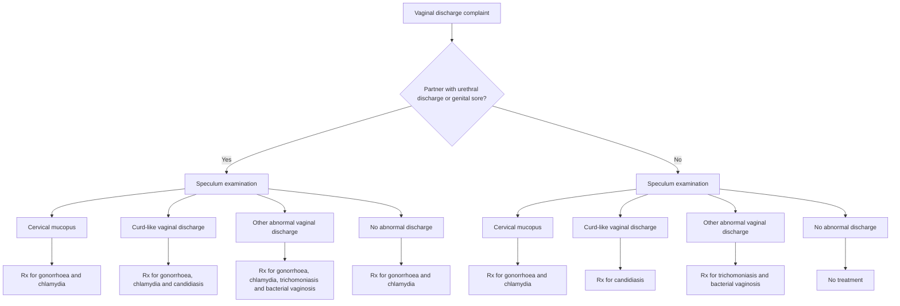

# Table 8. NACO algorithm for the management of vaginal discharge

There are seven pre-packed colour coded STI/RTI drug kits under NACP for syndromic management of STI/RTI and procured by NACO. These drug kits have been developed based on the National Guidelines on Prevention, Management and Control of Reproductive Tract Infections including Sexually Transmitted Infections, Ministry of Health & FW, August 2007. Syndromic Case Management Protocol

<table>
  <thead>
    <tr>
        <th>Kit No.</th>
        <th>Syndrome</th>
        <th>Colour</th>
        <th>Contents</th>
    </tr>
  </thead>
  <tbody>
    <tr>
        <td>Kit 1</td>
        <td>Cervicitis<br/>Urethral Discharge<br/>Presumptive treatment</td>
        <td>Grey</td>
        <td>T. Azithromycin 1 g (1) and<br/>T. Cefixime 400 mg (1)</td>
    </tr>
    <tr>
        <td>Kit 2</td>
        <td>Vaginitis</td>
        <td>Green</td>
        <td>T. Secnidazole 2g (1) and<br/>T. Fluconazole 150 mg (1)</td>
    </tr>
    <tr>
        <td>Kit 3</td>
        <td>Genital Ulcer Disease – Non Herpetic</td>
        <td>White</td>
        <td>Inj. Benzathine Penicillin 2.4 MU (1) and T. Azithromycin 1 g (1)</td>
    </tr>
    <tr>
        <td>Kit 4</td>
        <td>Genital Ulcer Disease – Non Herpetic (for patients allergic to Penicillin)</td>
        <td>Blue</td>
        <td>T. Doxycycline 100 mg (30) and<br/>T. Azithromycin 1 g (1)</td>
    </tr>
    <tr>
        <td>Kit 5</td>
        <td>Genital Ulcer Disease - Herpetic</td>
        <td>Red</td>
        <td>T. Acyclovir 400 mg (21)</td>
    </tr>
    <tr>
        <td>Kit 6</td>
        <td>Lower Abdominal Pain (PID)</td>
        <td>Yellow</td>
        <td>T. Cefixime 400 mg (1) and<br/>T. Doxycycline 100 mg (28) and<br/>T. Metronidazole 400 mg (28)</td>
    </tr>
    <tr>
        <td>Kit 7</td>
        <td>Inguinal Bubo</td>
        <td>Black</td>
        <td>T. Doxycycline 100 mg (42) and<br/>T. Azithromycin 1 g (1)</td>
    </tr>
  </tbody>
</table>

267

Obstetrics and Gynecology

# PELVIC INFLAMMATORY DISEASE (PID)

Pelvic inflammatory disease (PID) results from infection of cervix, uterus, tubes, ovaries and pelvic peritoneum. The disease may have acute or chronic presentation. The commonest cause is sexually transmitted diseases, however, other causes include post abortal and puerperal sepsis, operative procedures like dilatation and curettage, endometrial biopsy, and insertion of intrauterine device.

### Salient features

> - Lower abdominal pain, cervical motion tenderness and adenexal tenderness, fever, cervical discharge and leucocytosis.
> - In severe cases patient may be toxic with high-grade fever, vomiting, dehydration, and abdominal distension.
> - Long term sequelae can be infertility, ectopic pregnancy, chronic pelvic pain.
> - Failure of acute PID to resolve completely results in chronic PID with features of severe, persistent and progressive pelvic pain, repeated acute exacerbation of PID, tubo-ovarian inflammatory mass, dyspareunia or bilateral ureteral obstruction from ligamentous cellulitis.

### Investigations

- Haemogram with ESR, LFT, RFT, serum electrolytes, blood culture, endocervical swab culture, ultrasonography if adenexal mass.

### Treatment (Acute PID)

The patient can be treated as an outpatient or inpatient depending on the severity of clinical features.

#### I. Outpatient treatment- mild PID

Either of the following two regimens can be given:

**Regimen A**

- Inj. cefoxitin 2 g IM, plus probenecid 1 g orally, as a single dose or Inj. ceftriaxone 250 mg IM as a single dose or Inj. ceftizoxime or cefotaxime 500 mg IM as a single dose.
- Cap. doxycycline 100 mg 2 times a day for 14 days.

**Regimen B**

1. Tab. ofloxacin 400 mg oral 2 times a day for 4 days.
2. Tab. Clindamycin 450 mg oral 4 times a day for 14 days or Tab. metronidazole 400 mg 2 times a day for 14 days

Follow up after 2 - 3 days of initiation of therapy; patient is reevaluated for clinical response. If poor response, patient is to be admitted for intravenous antibiotics.

#### II. Indoor treatment- severe illness or nausea and vomiting, HIV positive, unable to follow or tolerate an outpatient regimen and outpatient therapy failed.

- Bed Rest. Hydrotherapy, if febrile.
- IV fluids in cases of vomiting and dehydration and correction of electrolyte imbalance.

268

Obstetrics and Gynecology

**Monitoring**
Clinical condition, vital monitoring, signs and symptoms of pelvic abscess and peritonitis. Either of the following regimens may be instituted at the earliest without waiting for culture reports:

_Regimen A_

- Inj. cefoxitin 2 g IV every 6 hours or Inj. cefotetan 2 g IV every 12 hours.
- Inj. doxycycline 100 mg IV or orally every 12 hours.
- Inj. metronidazole 500 mg IV 8 hourly.

_Regimen B_

- Inj. clindamycin 900 mg IV every 8 hours.
- Inj. gentamicin 2 mg/kg IV followed by 1.5 mg/kg every 8 hours.
- Inj. diclofenac sodium 75 mg deep IM 8 hourly or Inj. paracetamol 500 mg IM SOS.
- Inj. metronidazole 500 mg IV 8 hourly.

Injectable regimen should be continued for at least 48 hours after the patient demonstrates clinical improvement (becomes afebrile, decrease in lower abdomen and pelvic tenderness, improvement in constitutional symptoms). After this, doxycycline 100 mg 2 times a day orally or clindamycin 450 mg oral 4 times a day should be continued for total of 14 days. Clinical improvement should occur within 3 days of initiation of therapy. Consider further diagnostic tests /laparoscopy if symptoms do not improve or worsen. Different procedures may be required in the following situations:

- Colpotomy for drainage of midline pelvic abscess
- Dilatation and evacuation of septic products of conception in post abortal sepsis.
- Laparotomy in cases of pyoperitoneum, resistant peritonitis, intestinal obstruction, ruptured tubo-ovarian abscess, enlarging pelvic mass despite medical therapy,
- Laparoscopy: if diagnosis is uncertain, no response to treatment, to reconfirm the diagnosis, obtain cultures from cul de sac and fallopian tubes and drain pus if necessary.

**Treatment of the sexual male partner**
Asymptomatic male partner: Inj. ceftriaxone 125 mg IM followed by oral doxycycline 200 mg 2 times a day for 14 days.

**Treatment (Chronic PID)**
Treatment is surgical, considering pathological lesion, patient's age, and desire for child bearing. Definitive surgery is total abdominal hysterectomy with bilateral salpingo-oophorectomy, but in young females conservative surgery is preferred. Chronic PID can be due to pelvic tuberculosis.

_Treatment (Pelvic tuberculosis)_
Primary treatment is medical therapy with anti tubercular drugs for 6 months. Daily dose of the drugs is:

- Tab. isoniazid 5 mg/kg (maximum 300 mg).
- Cap. rifampicin 10 mg/kg (maximum 600 mg).

269

Obstetrics and Gynecology

- Tab. pyrazinamide 15-30 mg/kg (maximum 2 g).
- Cap. ethambutol 15-25 mg/kg (maximum 2.5 g).

All 4 drugs are given in the initial phase for 2 months followed by INH and rifampicin for 4 months.

Indications of surgery are: primary unresponsiveness, persistence or enlargement of adenexal mass after 4 - 6 months of treatment, persistence or recurrence of pelvic pain on treatment. Definitive surgery is total abdominal hysterectomy with bilateral salpingo-oophorectomy.

**Patient education**

- Emphasize behavioural and contraceptive methods to prevent the acquisition of STDs.
- Encourage to complete the antibiotic treatment for the full course i.e. 14 days.
- Sexual abstinence until complete treatment. Sexual partner of patient diagnosed with PID must be treated to prevent reinfection.

# PREMENSTRUAL SYNDROME

Premenstrual syndrome (PMS) is a cyclic recurrence of physical, psychological or behavioural symptoms after ovulation and resolve after the onset of menstruation. It requires treatment when the symptoms are severe to interfere with the woman's lifestyle, relationships and occupational functioning.

### Salient features

> - Somatic symptoms include feeling of bloating, bodyaches, breast tenderness, headache, food cravings and poor concentration.
> - Emotional symptoms include emotional hypersensitivity, depression, irritability, mood swings, anxiety, tension, fear of loss of control and confusion.
> - Diagnosis is confirmed by excluding the concomitant medical or psychiatric disorders with which it may be confused (depending on the symptoms).

**_Non- pharmacological treatment_**
Life-style advice should be offered to all women as first line of treatment.

1.  Daily charting of symptoms for two months.
2.  Dietary modifications like: increase complex carbohydrate meals, reduce or eliminate, especially in the luteal phase - salts, chocolate, caffeine and alcohol; and several small meals per day.
3.  Moderate regular aerobic exercise like brisk walk 1-2 miles per day for 4-5 days/week.
4.  Stress management courses/counseling.

**_Pharmacological treatment_**

1.  Tab. pyridoxine 100 mg/day for 10-14 days (during luteal phase) (maximum daily dose is 150 mg) or Tab. Evening primrose oil 500 mg 3 times a day.
2.  NSAIDs like mefenamic acid 500 mg 3 times a day for premenstrual dysmenorrhea.
3.  In case of predominantly physical symptoms (bloatedness, irritability swelling,

270

Obstetrics and Gynecology

weight gain, breast tenderness), Tab. spironolactone 100 mg/day Or Tab. bromocriptine 1.25 - 5 mg/day in the luteal phase for mastalgia. (Common side effects are nausea and vomiting. Tablet can be given vaginally if side effects are very severe.) 4. If no relief in symptoms with above measures in 2 - 3 cycles and symptoms are predominantly emotional, then the following drugs are used preferably in consultation with a psychiatrist: Tab. fluoxetine 5-20 mg/day 5. In non-responders to the above therapy, ovulation suppression may be beneficial; any of the following can be used: Low dose combined oral contraceptive pills, 1 pill daily from 5<sup>th</sup> to 25th day of the cycle.

### DYSFUNCTIONAL UTERINE BLEEDING (DUB)

Dysfunctional uterine bleeding (DUB) is an abnormal uterine bleeding in the absence of organic disease of the genital tract.

#### Salient features

> - Disturbances of the menstrual cycle, regular and irregular uterine bleeding and alteration in the amount or duration of the menstrual blood loss.
> - Due to anovulatory cycles but can also occur in the ovulatory cycles. Anovulatory cycles are usual in postmenarche, premenopausal age groups and are usually irregular, variable in duration and amount of bleeding.

**_Treatment (Acute bleeding-first episode)_**
**I. Severe bleeding (hemodynamically unstable patient)**

- IV line, fluid replacement, blood transfusion, oxygen inhalation and monitoring of vitals.
- Dilatation and curettage to arrest bleeding except in cases of puberty menorrhagia where medical management is preferred. IV tranexamic acid can be tried before resorting to surgical intervention.

**II. Less severe bleeding (haemodynamically stable patient)**

- High dose progestogen: norethisterone 10 mg 3 times a day until bleeding stops (not >3 days) followed by norethisterone 5-10 mg or medroxyprogesterone acetate 10 mg per day for 21 days. Withdrawal bleeding occurs after 2-4 days of stopping the drug and stops in 4-5 days. Or combined oral contraceptive pills (OCs) containing 50 mcg ethinyloestradiol 1 pill 2 times a day for 7 - 10 days followed by progestins for 7-10 days, followed by withdrawal bleeding.

**III. If bleeding is not controlled with progestogens**
Patient is having heavy bleeding for many days, endometrial curettage yields minimal tissue, or when the patient has been on progestogen medication (OC's or Depot MPA) and the endometrium is shallow and atrophic.
Treatment schedules of high dose oestrogens, depending on the severity of the bleeding the following can be used:

1. Conjugated oestrogen 25 mg IV every 4 h till bleeding abates or for 12 h. Progestin

271

Obstetrics and Gynecology

treatment is started at the same time. 2. Oral treatment conjugated oestrogen 1.25 mg or 2 mg oestradiol valerate given orally every 4 h for maximum of 24 h followed by single daily dose for 7-10 days.

All treatments must he followed by progestin coverage (10 mg MPA daily) along with oestrogen for 7 days.

### Monitoring

Clinical monitoring by vital charting and observation of blood loss per vaginum

### Treatment (Chronic DUB - not actively bleeding)

- Iron therapy: elemental iron maximum 60 mg 3 times a day
- Histopathological diagnosis is must before starting hormonal therapy in all cases except puberty menorrhagia.

#### I. Anovulatory DUB

- If contraception is desired: OCPs for 3 - 6 cycles or norethisterone 5-10 mg.
- Medroxyprogesterone acetate (MPA) 10 mg 16-25th day of the cycle for 3-6 cycles.
- In cases of endometrial hyperplasia without atypia on histology norethisterone acetate 5 mg three times a day or MPA 10 mg twice a day 5-25th day of cycle for 3-9 cycles followed by repeat endometrial biopsy.
- If fertility desired: ovulation induction is advised.
- Levonorgestrel IUD can be offered after counseling and is beneficial in DUB.

#### II. Ovulatory DUB

- NSAIDs: mefenamic acid 500 mg 3 times a day for 3 -5 days during periods. Or
- Oral combined contraceptive pills if contraception is desired.

If the above treatment is not effective in first cycle patient should be referred for tertiary care. Following treatment can be considered as an alternative to surgery:

- Tab. danazol 200 mg daily for 3 months.
- Levonorgestrel IUCD can be offered after counseling and is beneficial in DUB.

### Follow up

After 1, 3, 6 months of therapy. Treatment is stopped after 3-6 months. If symptoms recur medical treatment is to be continued or surgery can be offered.

### Surgical treatment - endometrial curettage

- Acute bleeding in haemodynamically unstable patient to quickly control the bleeding.
- In acute episode, if bleeding doesn't decrease significantly in 12-24 hours with medical treatment, then reevaluation is mandatory and surgical curettage should be done.
- If age is >35 years - premenstrual dilatation and curettage for endometrial histology is a must to rule out endometrial pathology.

If medical therapy is not effective then endometrial ablation or hysterectomy is to be performed.

272

Obstetrics and Gynecology

**Patient education**

- Common side effects of high dose oestrogens are: nausea, vomiting, headache, depression, and fluid retention. Contraindicated in liver disease, history of thromboembolic disorder, cardiovascular disease, and oestrogen dependant neoplasm.
- Common side effects of progestogens are depression, fluid retention, fatigue, insomnia, dizziness, nausea, and breast tenderness.

### MENOPAUSE

Permanent cessation of menses for one year is known as menopause. The usual age is between 40 to 50 years, mean age being 48 years. Long term consequences due to decreased oestrogens can increase the risk of ischaemic heart disease due to adverse lipid profile and pathological fractures due to osteoporosis.

#### Salient features

> - Hot flushes, night sweats, palpitations, vaginal dryness, itching, atrophy of the breast and skin, urethral syndrome, stress incontinence, mood changes like anxiety, irritability, depression, insomnia and joint pains.
> - Diagnosis is always clinical. However, in doubt, estimate serum FSH levels and oestradiol levels may be helpful.

**_Non-pharmacological treatment_**

- Balanced diet with fruits, vegetables, semi-skimmed milk adequate in vitamins and minerals. A reduction or avoidance of smoking and alcohol consumption.
- Exercise: walking or swimming for 20-30 min every day.

**_Pharmacological treatment_**

- Tab. calcium 1500 mg daily.
- Hormone replacement therapy (HRT). Rule out contraindications to HRT like endometrial/breast cancer, acute phase myocardial infarction, undiagnosed breast lump/abnormal vaginal bleeding and acute liver disease. Hypertension and diabetes if present should be controlled before HRT is prescribed.

**Oestrogen therapy**

- For hysterectomized patients- conjugated equine oestrogen 0.625 -1.25 mg. or oestriol 1-2 mg is given daily 1-25th day every month or daily without any break. If symptoms recur during drug free period then give continuous therapy. Or
- Transdermal oestradiol patch 50 or 100 mcg/day applied twice a week away from breast, preferably on the shaved skin of buttock, thigh or legs (Limiting factor is local skin reactions). Transdermal oestradiol patch is preferred in case of gall bladder disease, hypertriglyceridimea, history of thromboembolism, poorly-controlled hypertension, recent myocardial infarction, vascular diseases, migraine, chronic hepatic dysfunction, malabsorption syndrome.
- Combined therapy with oestrogens and progestin in women with intact uterus.

273

Obstetrics and Gynecology

i. Oestrogen therapy as above.
ii. Progestogen-medroxyprogesterone acetate 5 - 10 mg, or dihydrogesterone 10 - 20 mg or norethisterone 2.5 mg or 200 ml micronized progesterone is added from 13th to 25th days in cyclic sequential regimen and 1st to 12th of every month in continuous sequential regimen.

If withdrawal bleeding is not acceptable then give continuous combined treatment (0.625 mg conjugated equine oestrogen + 2.5 mg medroxyprogesterone acetate or 1 mg micronized oestrogen + 100 mg micronized progesterone).

**If conventional HRT is contraindicated**

- Tab. Tibolone 2.5 mg per day (major side effects are weight gain, oedema, breast tenderness, GIT symptoms and vaginal bleeding).
- In symptomatic elderly women with atrophic vaginitis and other urogenital symptoms who do not desire long term HRT: Oestriol cream daily application of 0.5 g delivering 0.5 mg of oestriol for 3 weeks followed by twice weekly application for 3 - 4 weeks. (Key indicator of response to therapy is improvement in symptoms).
- Follow up at 2-3 months then at 6 monthly intervals. Yearly mammography, Pap's smear, pelvic USG and serum oestradiol are advisable.
  Short term treatment is advocated for acute symptoms and oestrogen use for long term benefits is controversial.

**Patient education**

- Explain about the side effects of estrogen and progestogens
- Follow up visits at 2 - 3 months then at 6 monthly intervals are necessary.

### POSTMENOPAUSAL BLEEDING

Postmenopausal bleeding (PMB) is bleeding that occurs after menopause has been established for at least one year. It is different from infrequent, irregular periods that occur around the time of menopause.

**Salient features**

> - Obese women and women taking hormone replacement therapy (HRT), vaginal atrophy, lesions and cracks on the vulva may bleed. Bleeding from the upper reproductive system can be caused by hormone replacements, endometrial cancer (5-10%), endometrial polyps, cervical cancer, cervical lesions, uterine tumours, ovarian cancer or oestrogen secreting tumors in other parts of the body.
> - Diagnosis is confirmed by endometrial or cervical biopsy. Non-invasive tests include saline infusion sonography (SIS), a refinement of vaginal probe ultrasound. Dilatation and curettage (D &C) is often necessary for definitive diagnosis.

274

Obstetrics and Gynecology

### Treatment

Treatment of postmenopausal bleeding according to cause

<table>
  <tbody>
    <tr>
        <td>Cause</td>
        <td>Treatment</td>
    </tr>
    <tr>
        <td>Benign &amp; malignant neoplasm of vulva</td>
        <td>Refer to higher center or treat cervix, vagina, uterus or ovaries according to cause and facilities available.</td>
    </tr>
    <tr>
        <td>Indiscriminate use of oestrogen for HRT</td>
        <td>Stop oestrogen therapy</td>
    </tr>
    <tr>
        <td>Infections</td>
        <td>Antibiotics</td>
    </tr>
    <tr>
        <td>Injuries</td>
        <td>Repair</td>
    </tr>
    <tr>
        <td>Coagulation disorder</td>
        <td>Treat accordingly</td>
    </tr>
    <tr>
        <td>Endometritis</td>
        <td>Antibiotics</td>
    </tr>
    <tr>
        <td>Postmenopausal atrophic vaginitis</td>
        <td>Vaginal oestrogen cream/ointment</td>
    </tr>
  </tbody>
</table>

#### Indication for referral to a higher level of care

**Urgent referrals:**

- Palpable pelvic mass or lesions suspicious of cancer on vulva or vagina or cervix on examination or on ultrasound.
- More than one or a single heavy episode of PMB in women aged >55 years (not on HRT).
- Postcoital bleeding (PCB) in a woman aged >35 years that has persisted for more than 4 weeks.
- Prolonged or unexpected bleeding that persists for more than 4 weeks after stopping HRT.

**Early Referral (within 4-6 weeks)**
Any other woman with PMB not on HRT who does not satisfy the criteria for `urgent referral' of postmenopausal bleeding

- Unexplained repeated postcoital bleeding.

Note - in women over 45 years with persistent abdominal distension or pain, ovarian cancer should be considered and therefore a pelvic examination should be performed. If excessive bleeding, give hemostatic drugs (oral or intravenous) Postmenopausal bleeding that is not due to cancer and cannot be controlled by any other treatment usually requires a hysterectomy.

### EARLY DETECTION OF CANCER

**Screening for Breast Cancer (ACS Guidelines)**

- Early detection of breast cancer in average risk women begins at 20 years and consist of a combination of clinical breast examination (CBE), counseling to raise awareness of breast symptoms and regular mammography beginning at age 40.
- Between 20 and 39 years, women should undergo clinical breast examination every 3 years. The average risk women should begin annual mammography at 40years and should continue to be screened with mammography. Self examination of breast should also be

275

Obstetrics and Gynecology

advised to every woman at 20 years.

- Self breast examination from the age of 20years
- Clinical examination once in 3 years by a physician
- Baseline mammogram from age of 40 years and once in 2 years afterwards
- Annual mammography from the age of 50 years
- In countries with limited resources, mammogram is available for diagnostic purposes not for screening.

**Screening for Cervical Cancer**

- Screening for cervical cancer should be approximately 3 years after the onset of vaginal intercourse, but not later than age of 21 years.
- Annual screening with conventional cytology smears or biennial screening using liquid based cytology is recommended until the age of 30 years. At or after 30 years, a woman who has had 3 consecutive, technically satisfying normal/negative cytology results may undergo screening every 2 – 3 years using conventional or liquid based cytology.
- After 30 years of age, women who have the same history of normal cytology results may undergo HPV DNA testing with conventional or liquid based cytology every 3 years. Average risk for women aged 70 years and older with an intact cervix may choose to cease cervical cancer screening if they have no abnormal /positive cytology tests within the 10 year period before the age of 70 years.
- Women who are immune-compromised by organ transplantation, chemotherapy or corticosteroid treatment or HIV+ should be tested twice during the first year after diagnosis and annually thereafter.
- Women with a history or absence of CIN 2/3 before as the indication for the hysterectomy, should continue until there is a 10 year history of no abnormal positive cytology tests.
- Every woman at 30 years should undergo Pap smear at least once as it helps in diagnosis of early cervical cancer (ICMR guidelines).

**Screening for cervical cancer**
**Age group-** 3 years after sexual activity, not later than 21years. In countries with limited resources all women around the age of 30 years should have one Pap test.

**Method**

- Pap smear (or) VIA (visual inspection after application of 5%acetic acid) in countries with limited resources.

Precautions - Prior to a pap smear

- Not to douche for 48 hours, or use vaginal cream for 1 week, abstain from coitus for 24 hours, smear to be done on 7th day after menstrual period

_Technique_

- PAP TEST includes samples from ecto-cervix and endo-cervix
- Use bivalved speculum

276

Obstetrics and Gynecology

- Place the endocervical brush or cotton tipped swab and roll it firmly against the canal
- Remove the endocervical brush or cotton tipped swab and place samples on the glass slide
- Place the spatula against the cervix with the longer protrusion in the cervical canal
- Rotate the spatula 360° firmly against the cervix, scrape the entire transformation zone
- Place the sample immediately from the spatula onto the glass slide and fix it (spray fixative or placing it in a bottle of fixative – 95% ethanol.

Follow up - Abnormal smears should be referred for colposcopy and biopsy

### Screening for Endometrial Cancer

Women at high risk due to known hereditary non polyposis colon cancer (HNPCC) associated genetic mutation carrier status should consider beginning annual testing for early endometrial cancer detection at an age of 35. The endometrial biopsy is still the most common technique used to obtain endometrial tissue.

- Women at high risk (due to hereditary non-polyposis colon cancer carrier status) should consider annual testing from the age of 35.
- Endometrial biopsy is the most common technique used to obtain endometrial tissue.

## CONTRACEPTION

A method or a system, which allows intercourse and yet prevents conception, is called a contraceptive method. This contraception may be temporary when the effect lasts only till the couple uses the method but the fertility returns after the use is discontinued. The permanent contraceptive methods are surgical and are aimed to achieve sterility after the surgical procedure.

A couple in the reproductive age group, who desires contraception should be provided information about all the available methods of contraception and should be counselled and helped so as to choose a method most suitable for that couple. Various contraceptive methods available are:

### I. Temporary methods

#### 1. Hormonal contraceptives

- Combined oral contraceptive pills.
- Injectable hormonal contraceptives (DMPA and NET-EN)
- Progesterone only pill [ketodesogestrel]

#### 2. Non-hormonal contraceptive pills

- Centchroman.

#### 3. Intrauterine contraceptive device

- CuT 200B.
- Multiload 250 and Multiload 375.
- CuT 380A
- LNG IUCD [mirena]

#### 4. Barrier methods

277

Obstetrics and Gynecology

- Male condoms.
- Vaginal diaphragms with spermicidal jelly.
- Contraceptive sponge.

### II. Permanent methods

#### 1. Female sterilization

- Postpartum sterilization.
- Interval ligation (laparoscopic or minilap ligation).
- Ligation concurrent with MTP.

#### 2. Male sterilization

- Vasectomy (traditional or non scalpel).

### TEMPORARY CONTRACEPTIVE METHODS

#### I. Hormonal contraceptives

**(i) Combined oral contraceptive pills**
Low dose combined oral contraceptive pill containing 30 mcg ethinyl oestradiol and a progestin (0.3 mg Norgestrel or 0.15 mg Norgestrel or 0.15 mg Desogestrel) can be prescribed. One tablet to be taken daily with meals at a consistent time. It should be started during first seven days of the menstrual cycle or at any other time when it is reasonably certain that she is not pregnant. If started after first 7 days of menstrual cycle, back up method (abstinence or barrier method) should be used for 7 days. Pills should be taken for three weeks followed by 1 week of pill-free interval during which placebo tablets are to be taken if pack contains 28 tablets.

In women >40 years of age very low dose pills containing ethinyl oestradiol 20 mcg and desogestrel 0.15 mg can be used. After age 50 years, if woman on oral pills, check FSH during 5 - 7 days of pill free interval. If FSH >30 IU/l change to HRT regimens.

**Contraindications**

- Combined oral contraceptive pills are contraindicated in cases with current or history of, thromboembolic disease, cerebrovascular disease, coronary artery disease, complicated valvular heart disease, acute liver disease., current or past breast cancer., undiagnosed vaginal bleeding, pregnancy, heavy smokers over 35 years of age, migraine with neurological symptoms, diabetes >20 years or with vascular disease, current gall bladder disease, uncontrolled hypertension (BP > 160/100).
- Combined oral contraceptive pills should not be taken during first 6 months postpartum if breastfeeding and first 3 weeks postpartum in non-breastfeeding females. Pills can be started immediately after spontaneous or induced abortion; can be used with caution in cases with controlled hypertension, diabetes, migraine without neurological symptoms, non-smokers with age more than 35 years of age without any other medical illness.

**Follow up**
First follow up should be within 3 months and then annually. Follow up involves history, blood pressure, urinalysis, breast examination, liver palpation and pelvic examination.

278

Obstetrics and Gynecology

**Patient education**

- Common side effects are nausea, vomiting, GI upset, breast changes, weight gain, acne, breakthrough bleeding, amenorrhoea, rash, vaginal candidiasis. Side effects decrease usually after 2 - 3 months of use.
- Report immediately in case of symptoms like chest pain, leg pain, severe headache, severe stomachache, swelling of one or both legs, visual impairment.
- It is one of the most effective contraceptive methods with failure rate of about 0.1%.
- It has non-contraceptive health benefits like regular periods with less pain and bleeding, improves premenstrual symptoms, and decreases functional ovarian cysts, pelvic inflammatory disease, ovarian and endometrial cancer, endometriosis.
- Forgotten pill - if one pill is forgotten, take as soon as remembered and next day take next pill and continue the schedule. Use back up method for 7 days.
- If 2 pills are forgotten take 2 pills and next day again take 2 pills, and then continue as per schedule. Use back up method for 7 days.
- If 3 pills are forgotten, this cycle is not protected, use back up method till next cycle and then restart with new pack.
- Should be discontinued at least 4 weeks prior to any planned major surgery.
- Medicines like rifampicin, barbiturates, phenytoin, carbamazepine, primidone, griseofulvin interfere with the effects of oral pills. So use alternative method during their intake.

**(ii) Injectable hormonal contraceptives**
Highly effective oestrogen free long acting contraceptive can be given when oestrogens are contraindicated like sickle cell disease, seizure disorders, age >35 years who smoke; breastfeeding females after first 6 weeks. In non-breastfeeding females, injections can be safely given immediately postpartum.

Depot medroxy progesterone acetate - 150 mg injection to be given deep IM every three months. Next injection can be delayed by 2 weeks Or Norethisterone enanthate - 200 mg injection to be given deep IM every 2 months. Next injection can be delayed by 1 week.

**Absolute contraindications**

- Pregnancy
- Unexplained genital bleeding.
- Severe coagulation disorder.
- Previous sex steroid induced liver adenoma, active liver disease.
- Breast feeding during initial 6 weeks.
- Current or history of thromboembolic disease, cerebrovascular disease, coronary artery disease.
- Current or past breast cancer
- Diabetes >20 years or with vascular disease
- Uncontrolled hypertension (BP > 180/110).

279

Obstetrics and Gynecology

**Patient education**

- Common side effects are irregular bleeding, breast tenderness, weight gain, depression, headache, dizziness, abdominal pain.
- Beneficial effects and efficacy is same as that of oral contraceptive pills.
- Fertility return is slightly delayed after discontinuation of use.
- Drug interactions are same as with oral hormonal pills.

**II. Non-hormonal oral contraceptive pills (Centchroman)** 30 mg tablet started on first day of periods. Take twice weekly for three months and then continue as once weekly.
**Contraindications**
Polycystic ovarian disease, cervical intraepithelial neoplasia, severe allergy, recent history of liver disease, and first 6 months of lactation
**Patient education**

- It is a non-steroidal contraceptive pill, has no hormonal effects with failure rate is 1-2%.
- Delayed periods can occur in 6% cases. If delay is >15 days, perform urine pregnancy test.
- If one tablet is missed take as soon as possible and resume scheduled intake. Add back up method till next period. If tablet missed for >7 days, start fresh regimen.

**III. Intrauterine contraceptive devices (IUCD)**
Any of the following devices can be inserted inside uterus by trained health personnel. It should be inserted during or shortly after menstruation and after immediately after spontaneous or induced abortion. After delivery it should be inserted during 4-8 weeks postpartum. It can be inserted within 5 days of unprotected coitus. These devices need to be changed after the duration of their lifespan.

**Lifespan of intrauterine contraceptive devices (IUCD)**

<table>
  <tbody>
    <tr>
        <td>CuT 200B</td>
        <td>3 yrs</td>
    </tr>
    <tr>
        <td>Multiload 250</td>
        <td>3 yrs</td>
    </tr>
    <tr>
        <td>Multiload 375</td>
        <td>5 yrs</td>
    </tr>
    <tr>
        <td>CuT 380 A</td>
        <td>10 yrs</td>
    </tr>
  </tbody>
</table>
**Follow up** - first follow up should be after next period to check for complications and to rule out expulsion, after that follow up annually.

**Contraindications**
Pregnancy, postpartum <4 weeks, septic abortion, distorted uterine cavity, uterine fibroids, current or within past 3 months PID or STD, increased risk of STD, HIV positive, AIDS, pelvic tuberculosis, unexplained vaginal bleeding, trophoblastic disease, genital tract malignancy, complicated valvular heart disease.

**Patient education**

- Common side effects are increased menstrual bleeding and dysmenorrhea. These decrease after initial 2-3 months.
- No protection for STDs.
- Failure rates are 0.5 - 3%. Ectopic pregnancy can still occur.

280

Obstetrics and Gynecology

- IUCD may get spontaneously expelled. Therefore monthly palpation of IUCD string is important. If not palpable, report immediately.

### 4. Barrier methods

These are cheap, available over the counter, coitus dependant methods. Male condoms, vaginal diaphragm, spermicidal jellies, vaginal sponge can be used.

**Male condoms**
Any of the available condoms can be used. For each act of coitus a new condom is to be used. If during intercourse, condom breaks or if there is spillage or leakage, woman should contact a clinician within 72 hours and emergency contraception should be provided to her.

**Contraindication**- severe allergy to latex rubber.

**Vaginal diaphragm**
Available in different sizes. Proper size should be checked by a clinician by pelvic examination. Can be inserted 6 hours prior to intercourse. About a tablespoonful of spermicidal cream or jelly should be placed in the dome of diaphragm prior to insertion; should be left in place for approximately 6 hours (but not >24 hours) after coitus. Additional spermicide should be placed in vagina before each additional episode of sexual intercourse. After removal wash with soap and water, rinse and dry.

**Follow up.** Annually to assess proper fitting of diaphragm.

**Contraceptive sponge**
Contains spermicidal agent Nonoxynol 9. It should be removed at least 6 hours after sexual intercourse. Maximal wear time is 30 hours.

**Patient education**

- Barrier methods provide protection against STDs and PID. Only condom has been proven to prevent HIV infection.
- Other advantages are prevention of diseases like pelvic inflammatory disease, carcinoma cervix, chronic pelvic pain.
- It can be used soon after delivery.
- No hormonal side effects.
- Side effects like vaginal dryness, itching, irritation, allergic reactions can occur.
- Failure rates are very high. Typical failure rates are with condoms 14%, diaphragm with spermicidal jelly 20%, highest with sponge 28%.

## PERMANENT CONTRACEPTIVE METHODS

Permanent contraception is provided by sterilization operation in male or female partners.

- Male client should be <60 years of age.
- Female client should be >22 years and <45 years of age.
- Client must make informed decision voluntarily and must give consent on the consent form for sterilization.

### I. Female sterilization

Done by laparoscopic ligation in interval ligation and first trimester abortions or tubectomy.

281

Obstetrics and Gynecology

### **_Timing_**

- Interval sterilization - within 7 days after menstrual period is over.
- Postpartum sterilization - after delivery till 7 days but preferably within 48 hours. Later on after 6 weeks postpartum.
- MTP - concurrently
- Spontaneous abortion - concurrently but under antibiotic cover and in the absence of infection and anaemia.

### **Contraindications**

There are no absolute contraindications. Relative contraindications are psychiatric disorder, acute febrile illness, jaundice, Hb< 8 g%, chronic systemic disease, malignancy, bleeding disorder, severe nutritional deficiency. Postpartum sterilization is contraindicated in puerperial sepsis or fever, severe pre-eclampsia/eclampsia, premature rupture of membrane >24 hours, severe APH or PPH, genital tract trauma.

Post abortal sterilization is contraindicated in sepsis, fever, haemorrhage, severe trauma, uterine perforation, acute haematometra.

### **Follow-up**

First follow up should be done seven days after the surgery for wound examination. Second follow up is recommended after one month or next menstrual period whichever is earlier. Subsequent follow-ups if client develops any complication or has query.

## **II. Male sterilization**

### **Contraindications**

There are no absolute contraindications. Relative contraindications include psychiatric and physical illness, local genital conditions, including large varicocele, hydrocele, inguinal hernia, filariasis, cryptorchidism, previous scrotal surgery, intra scrotal mass.

**Follow-up.** First follow up after 7 days of surgery for wound examination and stitch removal. Second follow up after 3 months with semen analysis. Subsequent follow up required in cases of any complication or queries.

### **Patient education**

- In non scalpal vasectomy stitches are not required.
- It is a safe and simple procedure.
- It is a permanent method to prevent future pregnancies.
- It does not affect sexual pleasure, ability or performance.
- It has a small chance of failure even if performed under optimum circumstances.
- After vasectomy it is necessary to use a back up contraceptive method either for 20 ejaculations or for a period of 3 months.
- Sterilization does not provide protection against reproductive tract infections/ STDs or HIV/AIDS.
- Failure rates with female sterilization are < 0.5% and male sterilization < 0.1 %.

282

Obstetrics and Gynecology

**Emergency contraception**

Method used to prevent pregnancy after a likely fertile unprotected act of sexual intercourse; can be used in cases of condom rupture, rape or other circumstances of unprotected sex.

First dose should be taken within 72 hours following unprotected sex and second dose 12 hours after the first dose. Any of the following can be used:

Levonorgestrel 0.75 mg 1 tablet 12 hourly for 2 doses. Or combined oral contraceptive pills containing 50 mcg ethinyl oestradiol with 0.5 mg norgestrel 2 tablets 12 hourly for 2 doses. Or Low dose combined oral contraceptive pills containing 30 mcg ethinyl oestradiol with 0.3 mg norgestrel 4 tablets 12 hourly for 2 doses.

**Patient education**

- Side effects are nausea, vomiting, dizziness, fatigue, headache, lower abdominal pain, breast tenderness, vaginal bleeding.
- It must be used under medical supervision.
- It decreases risk of pregnancy by 70 - 90%. Earlier it is taken, success is more.
- If vomiting occurs within 2 hours of the dose, it must be repeated.
- There are no contraindications for emergency contraception.
- After this use a barrier method for each act of intercourse until next menstrual period.
- If period delayed >5 days, rule out pregnancy.
- Use regular contraceptive method.

283

_Chapter 14_

# PSYCHIATRY DISORDERS

### Introduction and General Guidelines

The incidence and prevalence of psychiatric disorders is on a rise in the 21<sup>st</sup> century. The awareness, regarding the nature of mental illnesses and the need for treatment, and their acceptance is also improving. Although psychopharmacology forms the backbone of treatment in most psychiatric disorders, certain points need to be especially emphasized while managing psychiatric patients:

1. The formation of a trusting, confidential, non-judgemental and empathetic doctor - patient relationship is crucial to the practice of psychiatry.
2. Knowing the person as a whole rather than only his symptoms endorses patient improvement.
3. The psychotic patient often loses his judgement and reality perception. Such patients often have to be treated against their will.
4. Family has an important role in the causation and management of psychiatric disorders.
5. All patients do well with holistic treatment which includes psychopharmacology, other biological treatments, psychotherapy and rehabilitation.
6. Psychiatric treatment often continues for a long period, so compliance is a major issue.

### SCHIZOPHRENIA AND OTHER PSYCHOTIC DISORDERS

Schizophrenia is a chronic debilitating psychiatric disorder of varied and profoundly disruptive psychopathology affecting cognition, perception, emotion and other aspects of behavior. Its usual age of presentation is around 25 yrs and affects all social classes equally.

**Salient features**

- The common symptoms of schizophrenia are false, fixed, firm beliefs (delusion), perceptual abnormalities e.g. hearing of voices while alone (hallucinations).
- Abnormalities in speech and behavior as irrelevant speech, talking to self, crying or laughing for no reason are also prominent.
- schizophrenia has been divided into following subtypes for the ease of practice.
  - Paranoid schizophrenia- Delusions and hallucinations form predominant features along with other symptoms.
  - Catatonic schizophrenia-Characterized by marked psychomotor retardation or agitation.
  - Hebephrenic schizophrenia-Characterized by marked abnormalities of behavior.
  - Residual schizophrenia Simple schizophrenia

**_Non- pharmacological treatment_**

- Cognitive behaviorally oriented psychotherapy - understanding of illness, identification of target symptoms, and development of strategies to cope up with these symptoms.

284

_Psychiatry Disorders_

- Rehabilitation of the patients in the form of supported employment, individualized job development, ongoing job support, integration of vocational and mental health services.
- Social skills training, behavior based instructions, corrective feedback, and contingent social reinforcement.

**_Pharmacological treatment_**

- Hospitalization is indicated in suicidal patients, non compliant patients, treatment resistant cases and diagnostically difficult cases (Figure 1).
- Antipsychotics (typical and atypical) are the main treatment for such patients (Table 1).
- Co-administration of Tab. trihexyphenidyl (2 – 12 mg/day) is recommended with typical antipsychotics.
- Benzodiazepines (Inj. lorazepam 2-4 mg, orally, IM or IV preparation) may be co-administered in uncooperative patients initially.
- ECT (electro convulsive therapy) - electric shock of 100-120 volts may be given in patients with associated suicidal intention and treatment resistant cases. It is given for 1-3 seconds under general anesthesia so that it produces short lasting generalized tonic clonic convulsions.

285

Psychiatry Disorders

**Table 1. Dosage schedule and adverse effects of commonly used antipsychotics**

<table>
  <tbody>
    <tr>
        <td>Drugs</td>
        <td>Effective dose</td>
        <td>Dosage schedule</td>
        <td>Adverse effect</td>
    </tr>
    <tr>
        <th>Typical antipsychotics</th>
        <th colspan="3"></th>
    </tr>
    <tr>
        <td>Haloperidol</td>
        <td>5 – 20 mg/day,<br/>available as tablets,<br/>syrup, injection and<br/>depot preparation<br/>(50 mg/ampoule)</td>
        <td>Start with 5 mg twice a<br/>day or 10 mg HS and<br/>increase the dose by<br/>5mg if no response.<br/>Depot injection to be<br/>given once two to three<br/>weeks.</td>
        <td rowspan="4">More extra-pyramidal side<br/>effects viz slowness of<br/>movements, blunted facial<br/>expressions, tremors,<br/>rigidity, excessive<br/>salivation, etc.<br/>*Non specific* - sedation,<br/>reduction in seizure<br/>threshold, orthostatic<br/>hypotension,<br/>anticholinergic side effects<br/>*CVS* - cardiac toxicity,<br/>sudden death,<br/>*Hematological* - leucopenia<br/>*Endocrinal* -<br/>hyperprolactinemia<br/>*Sexual* - anorgasmia and<br/>decreased libido,<br/>*GIT* - nausea, vomiting,<br/>hepatotoxicity</td>
    </tr>
    <tr>
        <td>Trifluoperazine</td>
        <td>Available as 5mg<br/>Tab.</td>
        <td>Start with 5mg/ day and<br/>can be gradually<br/>titrated upto a<br/>maximum of 40<br/>mg/day</td>
    </tr>
    <tr>
        <td>Fluphenazine<br/>decanoate</td>
        <td>Depot injection<br/>5 mg/2ml</td>
        <td>Once in 15-20 days</td>
    </tr>
    <tr>
        <td>Zuclopenthixol</td>
        <td>Depot injection<br/>200mg/ml</td>
        <td>One ampoule IM once<br/>in 2-3 weeks.</td>
    </tr>
    <tr>
        <th>Atypical antipsychotics</th>
        <th colspan="3"></th>
    </tr>
    <tr>
        <td>Risperidone</td>
        <td>2-10 mg/day,<br/>available as tablets,<br/>syrup and depot<br/>preparation (25<br/>mg/ampoule)</td>
        <td>Start with 2mg once a<br/>day or twice a day and<br/>titrate it to 8mg/day<br/>gradually. Deport<br/>injection to be given<br/>deep IM once every 15<br/>days</td>
        <td rowspan="4">Less extra-pyramidal side<br/>effects<br/>*Non specific* - dizziness,<br/>hyperkinesias, somnolence,<br/>anti-cholinergic side effects<br/>like dry mouth,<br/>constipation, delirium<br/>*GIT* - nausea, vomiting.<br/>*Endocrinal* -<br/>hyperprolactinemia,<br/>hyperglycemia.<br/>*Hematological* - leucopenia<br/>*Sexual* - erectile<br/>dysfunction,<br/>orgasmic dysfunction<br/>*General* - weight gain</td>
    </tr>
    <tr>
        <td>Olanzapine</td>
        <td>5 – 30 mg/day,<br/>available as tablets</td>
        <td>Start with 5 mg once a<br/>day or HS and titrate<br/>gradually by 5 mg/day<br/>if no improvement.</td>
    </tr>
    <tr>
        <td>Quetiapine</td>
        <td>Available as 50,<br/>100, 200 mg<br/>tablets</td>
        <td>Start with 50mg twice a<br/>day and build upto 300-<br/>800 mg/ per day</td>
    </tr>
    <tr>
        <td>Clozapine</td>
        <td>25 – 300 mg/ per<br/>day, available as<br/>tablets</td>
        <td>Get complete blood<br/>counts done before<br/>starting clozapine.<br/>Start with 25 mg HS or<br/>50mg HS gradually<br/>titrate to 500mg.</td>
    </tr>
  </tbody>
</table>

286

Psychiatry Disorders

**Figure 1. Treatment guidelines for schizophrenia**

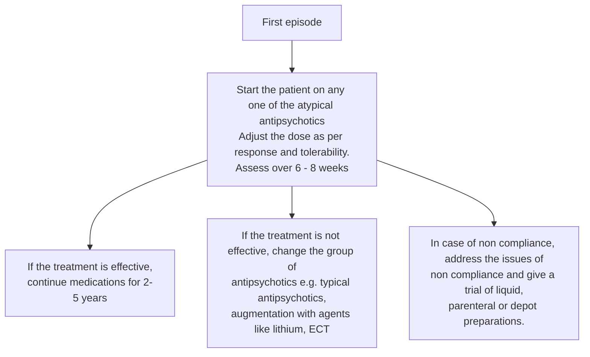

**Patient education**

- Both, the patient and the primary caregiver should be explained that although schizophrenia is a chronic illness and requires long term treatment, it can be effectively treated in most cases.
- Mild to moderate side effects may develop to medications, but usually tolerance develops to them.
- Medicines should not be stopped abruptly.
- Family should be encouraged to take up the responsibility for regular treatment and follow-up. Family interventions include illness education, crisis intervention, emotional support and training for coping skills.

### OTHER PSYCHOTIC DISORDERS

**Schizophreniform disorder**

- Clinical features similar to schizophrenia
- Differs from schizophrenia in that duration of symptoms is lesser than 6 months
- Pharmacological treatment is similar as schizophrenia

**Brief psychotic disorder**

- Clinical features similar to schizophrenia
- Differs from schizophrenia in that duration of symptoms is less than 1 month
- Pharmacological treatment is similar to schizophrenia

287

Psychiatry Disorders

**Delusional disorder**

- Clinical features - characterized by single or multiple non bizarre (false fixed but feasible beliefs) delusions of 1 month duration
- Differs from schizophrenia in that duration of delusions is 1 month and functioning and behavior in other areas of life than delusional one is intact
- Insight oriented psychotherapy forms mainstay of treatment whereas Pharmacological treatment is similar to schizophrenia

**Schizoaffective disorder**

- Symptoms of schizophrenia are present continuously and features of bipolar affective disorder overlap
- Differs from schizophrenia by prominence of affective features
- Pharmacological treatment is with antipsychotics and mood stabilizers as in schizophrenia and bipolar disorder respectively

### MAJOR DEPRESSIVE DISORDER

Major depressive disorder (MDD), more commonly known as depression, is one of the most common psychiatric disorders with lifetime prevalence of about 10-20 %. Incidence in females are almost twice that in males.

#### Salient features

> - Common symptoms of depression are (for a minimum period of two weeks):
>   - Persistent sadness of mood and decreased interest in previously pleasurable activities
>   - More than 5 % weight loss or gain
>   - Sleep disturbance – insomnia or hypersomnia
>   - Marked slowing of activity or agitation and easy fatigability
>   - Lack of concentration
>   - Feelings of worthlessness, helplessness, hopelessness, guilt and suicidal thoughts / attempts
>   - Anxiety symptoms often coexist

**Investigations**

- Diagnosis is based on history and mental state examination (MSE). Test for thyroid function can be done to rule out the co morbidity.
- Investigations for associated neurological co-morbidities can be done particularly in elderly patients presenting with depression

**Non pharmacological treatment**

- Psychological factors are very important in the causing, maintaining as well as improving depression. For holistic management of depression, some form of psychotherapy should be co-administered.

288

Psychiatry Disorders

- Psychodynamic approach aims at promoting personality change through understanding of major conflicts, achieving insight into defenses, ego distortions, providing role model permitting cathartic relief or aggression.
- Cognitive behavioral approach aims at providing symptomatic relief through alteration of target thoughts, identifying cognitive distortions, modifying erroneous assumptions, promoting self control over thinking patterns.
- Interpersonal approach aims at providing symptoms relief through solving current interpersonal problems, reducing stress involving family and work, improving interpersonal communication skills.
  Supportive approach with techniques such as catharsis, realistic problem solving is also useful.

**Pharmacological treatment**

- Hospitalization is needed in severely suicidal patients, treatment resistant cases and non compliant patients.
- SSRIs (selective serotonin reuptake inhibitors) are currently the drug of choice for depression.
  - Tab. fluoxetine - start with 20 mg/day increase to 40 mg/day, if no response in 4-6 weeks
  - Tab. escitalopram - start with 10 mg/day depending on tolerability and gradually increase upto 30 mg/day
  - Tab. sertraline - start with 25 mg/day or 50 mg/day depending on the severity of symptoms in 1 HS dosage preferably and gradually increase to maximum of 300mg/day
- Tab. mirtazepine - start with 7.5 mg/day and gradually increase upto maximum 30 mg/day.
- Tricyclic antidepressants like Tab. imipramine for depression with somatic complaints. Start with 25mg twice a day and gradually increase by 25 mg/day to maximum of 300 mg/day if no response (should be avoided in patients with heart disease, glaucoma, benign prostatic enlargement and epilepsy).
- Antidepressant action takes about 2-3 weeks and needs to be continued for 6-9 months in first episode and for longer period in recurrent depression.
- Initially benzodiazepines may need to be co-administered to manage insomnia and anxiety.
- In cases of bipolar depression, there might be a sudden switch to mania in which case anti-depressant should be withdrawn.
- ECT (Electroconvulsive therapy) is a very safe, effective and economical mode of treatment and is indicated in severe depression with or without suicidal ideas, retarded depression and resistant depression.

289

Psychiatry Disorders

**Patient education**

- Explain the nature of illness, consequences of untreated depression, suicidal risk, need for adequate does for adequate duration and other supportive measures.
- The therapeutic response takes time to appear but side effects may appear earlier. Common side effects of tricyclic antidepressants are dry mouth, constipation, postural hypotension (giddiness), blurred vision, sweating, palpitation, tremors, delayed micturition, sedation, etc.
- Common side effects of fluoxetine are agitation, headache, nausea or heartburn, tremors, changes in sexual performance, blurred vision, dry mouth and loss of appetite.

### BIPOLAR MOOD DISORDER

Bipolar mood disorders are characterized by episodes of mania and depression or mania alone with intervening periods of normalcy.

#### Salient features

> - In manic episode, an elevated, expansive or irritable mood is the hallmark. The elevated mood is euphoric and characterized by euphoria, impaired judgement, denial of illness, overtly religious, over familiar behavior, increased talkativeness, increased self esteem, increased psychomotor activities and goal directed activities, increased sexual drive and engaging into high risk behavior.
> - Patients with depressed mood experience loss of energy and interest, feelings of guilt, difficulty in concentrating, loss of appetite and thoughts of death or suicide.
> - Other signs and symptoms of mood disorders include change in activity level, cognitive abilities, speech and vegetative functions (e.g. sleep, appetite, sexual activity and other biological rhythms).
> - These disorders virtually always result in impaired interpersonal, social and occupational aspects of life.

**Non pharmacological treatment**

- Psychoeducation, family therapy and rehabilitation for manic phases
- Psychotherapeutic measures same as in unipolar depression for depressive phases.

**Pharmacological treatment (Figure 2, Table 2)**

- Antipsychotics like risperidone and olanzapine are used as an adjuvant in treatment.
- Episode of depression is to be treated as in major depressive disorder but Tab. lamotrigine 25-100 mg is the treatment of choice.
- Prophylactic treatment: to be given to prevent recurrent episodes: Tab. lithium carbonate 900-1500 mg /day in divided doses or Tab. sodium valproate 600- 2000 mg /day in divided doses or Tab. carbamazepine 600-1200 mg / day in divided doses

290

Psychiatry Disorders

### Figure 2. Management of current manic episode

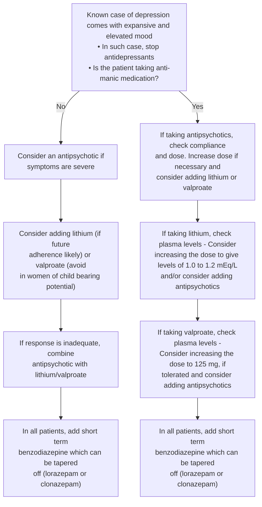

### Table 2. Dosage schedule of anti-manic drugs

<table>
  <thead>
    <tr>
        <th>Drug treatment of mania : recommended doses</th>
        <th colspan="2">Dosage schedule</th>
    </tr>
  </thead>
  <tbody>
    <tr>
        <td>Lithium</td>
        <td>400 mg / per day. Adjusted after 3 – 4 days according to plasma levels</td>
        <td>Start with 600 to 900 mg/day after getting baseline investigations done</td>
    </tr>
    <tr>
        <td>Sodium valproate</td>
        <td>As sodium valproate slow release: Dose is 20 – 30 mg/ kg/ day</td>
        <td>Start with 200mg thrice a day and gradually increase upto the per kg maximum dose if no or less response</td>
    </tr>
    <tr>
        <td>Oxcarbazepine</td>
        <td>300mg, build upto 1500 mg</td>
        <td>Has lesser side effect than carbamazepine</td>
    </tr>
  </tbody>
</table>

**Patient education**

- Emphasize about recurrent course of illness and not to get too much worried regarding recurrences.
- Relapses can be treated as successfully as the first episode.
- When on lithium, advice to take plenty of fluids especially during summer; not to restrict salt.

291

_Psychiatry Disorders_

- If fever, vomiting or diarrhea develops while on lithium, reduce the dose of lithium to half and contact the physician or the psychiatrist.

### INSOMNIA

Insomnia is one of the commonest complaints in psychiatric, medical and general clinical practice. Common causes include recent stress, psychiatric illnesses like depression and anxiety disorders, pain or substance abuse.

#### Salient features

> - Difficulty in initiating sleep, frequent awakenings from sleep, early morning insomnia or non-restorative sleep.
> - In the elderly, the physiological reduction in number of hours of sleep does not amount to insomnia. If the patient is distressed by decreased sleep, treatment may be given to increase the duration of sleep.
> - Stressful situation leading to insomnia or the symptoms of the causative illness can be elicited on careful enquiry.
> - Duration of symptoms may vary from few days to many months or years depending on the cause.

**_Non pharmacological treatment_**
**Sleep hygiene**

- Keep a regular time for going to bed and arising up; avoid day time naps.
- Limit daily in-bed time to the usual amount present before the sleep disturbance
- Avoid large meals near bedtime; eat at regular times daily. No stimulant medication or food beverages (caffeine, nicotine, alcohol, etc.) especially in the evenings.
- Mild to moderate physical exercise in the morning.
- Avoid evening stimulation: substitute radio or relaxed reading for television.
- Practice meditation or progressive muscular relaxation.
- Maintain comfortable sleeping conditions.

Treat the underlying cause. In both primary insomnia (where no cause is identifiable) and insomnia due to other causes, management includes introducing good sleep hygiene and medications for short period, if required.

**_Pharmacological treatment_**
If still sleep is inadequate,

- Tab. nitrazepam 5-10 mg or Tab. clonazepam 1-2mg or Tab. zopiclone 7.5-15mg or Tab. zolpidem 5-10 mg can be given for 2-6 weeks, ½ to 1 hr before bedtime.
- Patients must be cautioned regarding risk of dependence in diazepam and nitrazepam.

**Patient education**
Follow sleep hygiene instructions, look for tapering off benzodiazepines in 4-6 weeks

292

_Psychiatry Disorders_

# GENERALIZED ANXIETY DISORDER

Generalized and persistent anxiety that is not restricted to any particular situation or environment is an essential feature of this condition. One year prevalence of GAD is 3 to 8% and it is twice as common in women as men.

### Salient features

> - Generalized anxiety or excessive worries along with associated symptoms as shakiness, restlessness, headaches
> - Breathlessness, excessive sweating, palpitations and nausea, GI disturbance, sleep disturbance, irritability, hypervigilance.
> - Diagnosis is based on history and mental status examination
> - Investigations for co-morbidities like hyperthyroidism, hypothyroidism, hypo parathyroidism, pheochromocytoma and nutritional deficiencies should be done to rule out organic causes of anxiety.

**_Non pharmacological treatment_**
3 main psycho-therapeutic approaches are used.

- Cognitive behavior therapy aims at finding out the cognitive distortions and altering faulty coping strategies. Major techniques used are relaxation and biofeedback.
- Supportive therapy aims at offering reassurance and comfort to the patients.
- Insight orientated psychotherapy focuses on uncovering unconscious conflicts and identifying ego strengths.

**_Pharmacological treatment_**

- Benzodiazepines are the drug of choice like diazepam (start from 5mg HS or 10 mg HS), or Tab. clonazepam (start from 0.5 mg HS or TDS depending on the severity of symptoms), or Tab. lorazepam (start from 2 mg HS increase upto 8 mg maximum).
- SSRIs like sertraline, escitalopram or paroxetine (start with Tab. paroxetine 10 mg or 20 mg per day upto maximum 50 mg/day) is effective in GAD.
- Beta blockers (Tab. propranolol 20 mg BD or sustained release preparation upto 80 mg/day in divided doses is used) is used for symptomatic relief.

**_Patient education_**

- It is a chronic disease though easily treatable, but treatment needs to be taken regularly for a long time.
- Do not stop treatment without consulting your doctor.
- The drugs are quite safe and do not cause any serious side effects even if taken for a long time.

293

Psychiatry Disorders

### **PANIC DISORDER**

An acute intense attack of anxiety accompanied by feelings of impending doom is known as panic disorder. Life time prevalence of panic disorder is 1 to 4%. Women are 2-3 times more of likely to be affected than men.

#### **Salient features**

> - Recurrent panic attacks formed an essential feature of panic disorder. Panic attack is characterized by intense fear or discomfort reaching a peak within 10 minutes. Associated with palpitations, sweating, shaking, breathlessness, chest pain, nausea, fainting, feeling of choking, fear of dying or going crazy.
> - Persistence concern about having more attacks.
> - Change in behavior related to attacks
> - Worries about consequences of the attacks

#### **_Non- pharmacological treatment_**

Main approaches used are cognitive and behavioral therapies which aim at providing psycho education and correcting cognitive distortions. It also includes educating the patient about relaxation techniques and respiratory training.

- Family therapy includes providing psycho education and support
- Insight orientated psychotherapy is focused on helping patients to understand unconscious meaning of anxiety and resolution of conflicts.

#### **_Pharmacological treatment_**

- SSRIs particularly paroxetine are effective in treating panic disorders. Other SSRIs like escitalopram, citalopram, fluvoxamine and sertraline are also useful.
- Alprazolam is the most widely used benzodiazepine (start with 0.25 mg/day 1 HS upto maximum of 6 mg/day). They are used for providing rapid symptomatic relief.
- Inj. lorazepam 2mg/ml and diazepam 5ml/ml can be used in patients presenting with acute anxiety.
- Tri cyclic anti depressants like amitriptyline are also useful

#### **Patient education**

- General reassurance about benign nature of symptoms and possibility of spontaneous recovery of individual
- Continuing with breathing exercises.

### **OBSESSIVE COMPULSIVE DISORDER (OCD)**

It is characterized by recurrent irrational intrusive thoughts, images or impulses that are ego dystonic i.e. distressing in nature. Life time prevalence in general population is 2-3%. Men and women are equally affected by this disorder.

294

Psychiatry Disorders

### Salient features

> - Repetitive intrusive thoughts, images or impulses (obsessions) that creates anxiety and mental and physical acts are done to relieve the anxiety (compulsions) are the presenting features of this disorder.
> - Commonly observed obsessions are
>   - Repetitive thoughts and fear of dirt and contamination or germs
>   - Fear that something terrible will happen
>   - Forbidden or sexual thoughts and images or impulses.
> - Commonly observed compulsions are excessive hand washing, bathing, checking, ordering and arranging.

#### _Non -pharmacological treatment_

- Behavioral therapy is considered as treatment of choice for OCD. Principle approaches used are exposure and response prevention. Other techniques used are desensitization, thought stopping, flooding, implosion therapy and aversive conditioning.
- Psychotherapy in form of Cognitive Behavior Therapy (CBT), psychoanalytical and psychodynamic therapies are also c+onsidered useful in the treatment.
- Resistant cases can also be treated by ECTs or surgeries.

#### _Pharmacological treatment_

- SSRIs like fluoxetine, fluoxamine, paroxetine (start with 10 mg gradually increase to 50mg/day), sertraline are agents of choice in treating OCD.
- Tab. clomipramine is start with 75mg sustained release preparation once daily and depending on severity of symptoms gradually increase upto 300mg. It is the only effective tricyclic anti-depressant used in treating OCD.
- Augmenting agents like sodium valproate, lithium or carbamazepine are added to enhance the response to treatment.
- Benzodiazepines may be used as adjuvant treatment.

#### _Patient education_

- Reassure the patient that although disease is distressing and disabling, it is treatable.
- The drug takes about 2 weeks for its therapeutic response to manifest.
- Side effects may appear before the onset of therapeutic response. Common side effects of clomipramine are dry mouth, constipation, postural hypotension (giddiness), blurred vision, and sedation. Side effects of fluoxetine include gastrointestinal distress, nausea, headache, nervousness, anorexia, restlessness and sexual side effects. Patient usually adapts to these side effects with time.
- Advice the patient that treatment may continue for a long time. He/she should not leave drugs without medical advice.
- In case of any untoward effects of drugs, he/she must immediately get in touch with his clinician.

295

Psychiatry Disorders

- Patient must continue all his regular activities as far as possible.
- Yoga, meditation, physical exercises are useful measures along with drug therapy.

## PHOBIC DISORDERS

### Salient features

> - Phobia is defined as excessive, irrational fear of specific object, circumstance or situation. Social phobias are characterized by marked and persistent fear of social or performance situations exposing a person to unfamiliar people or scrutiny by others. Women are more likely to be affected by phobia than men.
> - Examples of specific phobias are agoraphobia (fear of open spaces), claustrophobia (fear of closed spaces), acrophobia (fear of heights), etc.
> - Exposure to phobic stimulus provokes immediate anxiety sometimes leading to panic attack. The patient is aware of the irrational nature of fears and avoids the anxiety provoking stimulus.
> - Causes marked distress in interpersonal, occupational and social areas of life.

### _Non- pharmacological treatment_

- Systematic desensitization is the most commonly used behavioral technique which exposes patient to fearful stimulus in a serially graded manner. Imagined or actual exposure to the phobic stimulus is given as long as the patient can tolerate.
- Insight orientated psycho therapy aims at enabling patients to understand the origin of phobia, secondary gains and role of resistance and helps them to seek healthy ways of coping with phobic stimuli.
- Hypnosis, supportive therapy and family therapy are useful in treatment of phobias.

### _Pharmacological treatment_

Following agents are used most commonly in treating phobias.

- SSRIs (e.g. Tab. paroxetine 12.5 -50 mg / day in divided doses)
- Benzodiazepines as mentioned above

### Patient education

With regular treatment, most patients show improvement but treatment needs to be continued for a long time, particularly in childhood onset phobias.

## POST-TRAUMATIC STRESS DISORDER (PTSD)

Exposure to a traumatic event consisting of either a direct personal experience or witnessing an event involving threat of death, serious injury or serious harm can lead to post traumatic stress disorder (PTSD) in 1.3 to 8% of victims.

296

Psychiatry Disorders

### Salient features

> Common examples of such traumatic events are physical or sexual abuse, domestic/community violence, kidnapping, terrorist attacks, accidents or disasters like floods, hurricanes, etc. It is characterized by a set of symptoms (for more than 1 month) such as:
>
> - Re-experiencing – distressing recollections, flashbacks, imageries of the traumatic event
> - Persistent avoidance – conscious effort to avoid places, situations, or events that will remind the person of the traumatic event
> - Hyperarousal – vivid dreams, night terrors, startling responses to even minor stimuli leading to palpitations, sweating, tremors and other anxiety features
> - Sense of detachment from usual social groups and situations, i.e. (emotional numbing is seen)
> - Sleep disturbance, checking for safety and exaggerated startled reactions are also present.
>   If these symptoms are present for less than 4 weeks it is called Acute Stress Disorder.

**_Non -pharmacological treatment_**
Focused Cognitive Behavior Therapy is aimed at giving psycho education to the patient regarding the nature of typical emotional and physiological reactions to traumatic events and PTSD. It also includes teaching techniques of muscle relaxation, focused breathing, affective modulation, thought stopping and cognitive coping techniques to deal with the stress.

- Gradual exposure: The reminders of traumatic events are gradually introduced.
- Crisis Intervention/Psychological Debriefing: It consists of encouraging the patient to describe the traumatic event in a supportive environment.

If the symptoms persist for more than a year, they do not improve after many years in one third of patients; so early intervention and treatment is useful.

**_Pharmacological treatment_**

- SSRIs are the agents of choice for treating PTSD, the doses are same as in depression.
  Propranolol has been used to treat PTSD symptomatically.

### CONVERSION DISORDER

It is a type of somatoform disorder characterized by symptoms or deficits affecting voluntary motor or sensory functions that is judged to be caused by psychological factors. Illness is preceded by conflicts or stressful situations. It is twice more common in women than men and is more commonly seen in lower socio economic strata of the society.

297

Psychiatry Disorders

### Salient features

> - Paralysis, blindness and mutism are most common symptoms.
> - Parasthesias (altered sensations) and anaesthesias (loss of sensations) especially of the extremities are also seen.
> - Abnormal movements, gate disturbance, weakness and paralysis are possible motor symptoms.
> - Diagnosis is based on history and mental status examination. However conversion episodes should be differentiated from seizures. Seizures are characterized by repetitive, involuntary jerky movements or episodes of unresponsiveness associated with tongue bite, frothing, injuries, fecal or urinary incontinence and amnesia (memory loss) during episodes. Seizures can also occur during sleep and when patient is alone. Absence of the above features is suggestive of conversion disorder. EEG and other investigations can be used to rule out organic cause.

**_Pharmacological treatment_**

- Spontaneous resolution of symptoms occurs but insight orientated, supportive or behavioral therapies can facilitate the same.
- Hypnosis, psychodynamic and psychoanalytical approaches can also be useful.
- Benzodiazepines are used as an adjuvant therapy.
- SSRIs can be used if co morbid depression is present.

### DISSOCIATIVE DISORDERS

Dissociative disorders are characterized by disruption of integrated functions of consciousness like memory, identity and perception of environment which can be dissociative amnesia, dissociative fugue or dissociative identity disorder

**Dissociative amnesia**

- Characterized by disturbances in the ability to recall important personal information, usually traumatic in nature.
- The memory loss is too extensive to be explained by simple forgetfulness. The disturbances cause socio occupational impairment.

**Dissociative fugue**

- The disturbance is characterized by sudden, unexpected travel away from home or customary places of work etc with inability to recall the past events along with partial or complete assumption of new identity. It causes significant socio occupational impairment.

**Dissociative identity disorder**

- Presence of two or more personality or identities each with its own pattern of reacting to the environment.
- These personalities take control of person's behavior and often are accompanied by inability to recall personal information.

298

Psychiatry Disorders

### _Treatment_

- Psychotherapeutic interventions like psychoanalytic psychotherapy, cognitive psychotherapy, behavioral therapy and hypnotherapy are the mainstay of treatment.
- Pharmacological treatment-antidepressants and antipsychotics have been used with limited benefits.

## ALCOHOL USE DISORDER

Alcohol use disorder is a common lethal condition that often masquerades as other psychiatric syndromes. At any time, one of three men are drinkers, with a ratio of persisting alcohol intake of approximately 1.3 men to 1.0 women.

### Salient features

> - Dependence is characterized by compulsion to drink, tolerance, intoxication, withdrawal and persistence of drinking inspite of overtly harmful consequences.
> - Alcohol intoxication is characterized by recent intake of alcohol and behavioral changes like slurred speech, unsteady gait, incoordination, nystagmus, impairment in attention and memory, etc. In extreme cases it can lead to stupor and coma.
> - Simple alcohol withdrawal is characterized by abrupt cessation of heavy intake of alcohol and development of symptoms like sweating, palpitations, tremors, nausea, vomiting, insomnia, transient visual/tactile/auditory hallucinations and psychomotor agitation.
> - Withdrawal may be complicated in the form of seizures, delirium tremens, etc.

### _Non- pharmacological treatment_

- Motivation enhancing, individual, group and family therapy

### _Pharmacological treatment_

- Hospitalization is advised to most patients for smooth detoxification and to avoid or manage withdrawal complications including seizures and delirium tremens as well as medical co-morbidities.
- Tab. chlordiazepoxide start from 25mg TDS and may be increased upto 100 mg/day, used only if liver function tests are normal or
- Tab. lorazepam starting from 2 mg TDS increased upto 8 mg is used, preferred when liver functions are compromised or not known.
- Tab. thiamine supplementation to prevent and treat vitamin deficiency (start from 75 mg BD and can be increased upto 300 mg/day)
- Injectable vitamins can be used when signs of severe vitamin deficiency are present.
- Once the patient is stable, the dose should be gradually tapered off (20% per day) over a period of 10 to 14 days.

299

Psychiatry Disorders

- Fluid and electrolyte disturbance should be corrected especially if there is vomiting or fever.
- Seizures – Rum fits (appearing within 24 hours of abstinence) can be treated with Inj. diazepam 10 mg or lorazepam 2 mg IV stat especially when seizures are repeated. Prophylactic treatment is not recommended for true alcohol withdrawal fits.
- Delirium tremens – The patient should be preferably treated in an intensive care unit.
- An intravenous line should be started immediately and thiamine 100 mg IV should be administered. Thiamine along with multivitamin should be continued parenterally till normal diet is resumed.
- IV dextrose and saline should be given at a rate adequate to replace fluid losses and maintain blood pressure.
- Hyperthermia should be managed with cold sponge. Tab. paracetamol 500 mg orally 4 times a day may be used in absence of any hepatic dysfunction.
- Inj. diazepam 10 mg should be given slowly IV and should be repeated every 15-20 minutes till sedation is achieved.
- Physical restraint may be necessary if the patient is combative.
- Associated medical and surgical problems should be simultaneously investigated and treated appropriately.
- Tab. disulfiram (250mg to 500mg daily) is used for relapse prevention. Informed consent for treatment with disulfiram is mandatory before administering it.
- Information about the disulfiram reaction and the potential lethality of the same is explained.

**Patient education**
Education regarding short-term and long term complications (medical, psychological, social, legal, etc.) of substance use.

### OPIOID USE DISORDERS

Opioid use disorders consist of physiological, behavioral, cognitive symptoms which indicate repeated continued use of opioid drugs despite the problems related to it.

#### Salient features

> - Opioid intoxication is characterized by recent opioid intake and development of symptoms as initial euphoria, later dysphoria, apathy, psychomotor agitation or retardation, impaired judgement, pupillary constrictions with drowsiness, slurred speech, impairment in attention and memory.
> - There usually is impaired social or occupational functioning.
> - Opioid withdrawal is characterized by cessation of heavy prolonged use of opioid and development of symptoms as dysphoric mood, lacrimation, nausea vomiting, muscle aches, diarrhoea, yawning, fever, insomnia, pupillary dilatation, piloerection, sweating.

300

Psychiatry Disorders

**_Non- pharmacological treatment_**

- Individual counseling, family support and encouraging the patient to join the self help groups are also important to help him maintain long-term abstinence.
- However opiate dependence is a highly relapsing disorder, and prolonged inpatient stay in settings that also provide rehabilitative inputs is usually beneficial.

**_Pharmacological treatment_**

- Tab. paracetamol 500 mg and dextropropoxyphen 32.5 mg - start from BD dosage and gradually increase to 2 tablets TDS.
- Tab. buprenorphine 2 mg and naloxone 0.5 mg – start from 1 tablet BD to maximum of TDS or QID dosages depending on the severity of withdrawal symptoms.
- Tab. clonidine 50 mcg BD is given for symptomatic management of withdrawal. Careful monitoring of BP is needed.
- NSAIDs are given for muscular pains.

_Long term (to be treated by a psychiatrist)_

- Tab. naltrexone 50 mg/day orally is used to reduce craving and thereby to help patient maintain long-term abstinence (who have remained opioid free for at least 7-10 days).
- Baseline hepatic functions should be assessed, and to be monitored once a month while on naltrexone treatment.
- The drug is usually continued for a period of 6 months, however, it may have to be withdrawn in presence of significant liver disease (i.e. several fold increase in the serum levels of transaminases).

**Patient education**
Patient should be told about nature of illness, course and treatment modalities available through individual sessions.

### CANNABIS USE DISORDERS

**Salient features**

> It is characterized with repetitive and compulsive consumption of ganja, charas, etc.
>
> - Recent intake of cannabis followed by development of symptoms as impaired motor co ordination, euphoria, anxiety, slowed perception of time, impaired judgement, social withdrawal, conjunctival congestion, increased appetite, dry mouth, tachycardia etc.
> - Chronic dependence can lead to apathy.
> - Mild cannabis withdrawal is characterized by restlessness, craving for cannabis and dysphoria. Only symptomatic treatment is given for cannabis withdrawal.

**_Pharmacological treatment_**
Symptomatic treatment for nausea, insomnia and anxiety may be given

**_Non- pharmacological treatment_**
Motivation enhancing counseling, individual, family & group counseling

301

_Psychiatry Disorders_

# AUTISTIC DISORDER

It is characterized by qualitative impairment in social interactions, impairment in communications and restricted, repetitive and stereotypical patterns of behavior. Its prevalence is 0.08% and is 4 - 5 times more common in boys than girls.

### Salient features

> - Behavioral characteristics include lower intelligence, lack of social smile, poor eye contact, low level of attachment to caregivers and extreme anxiety when their routine is disturbed.
> - There is a notable deficit in interactions with peer group, delay in development of spoken language, repetitive movements like hand or finger flapping, rocking body movements and head banging.
> - Diagnosis is based on delayed history and clinical mental status examination (MSE).

### Non- pharmacological treatment

- Educational and behavioral interventions are the treatment of choice.
- Structured classroom training in combination with behavioral methods is the most effective treatment for many autistic children.
- Behavioral therapies to reinforce socially acceptable behaviors and encourage self care skills.
- Training of parents with regards to the concepts and skills of behavioral modification has proved beneficial.
- Language development is added to facilitate communication.

### Pharmacological treatment

- No medication has proven its efficacy in treatment of core symptoms of autism but symptomatic treatment for hyperactivity, obsessions, compulsions, aggression and self injurious behavior can be given by using escitalopram, methylphenidate, haloperidol, risperidone, olanzapine, quetiapine. Lithium can be used in self injurious behaviors.
- Guidelines for Tab. risperidone prescribing with autism spectrum disorders in children and adolescents are as follows:
  - Initiating dose at 0.25 mg per day for patients less than 20 kg and 0.5 mg per day for patients weighing 20 kg or more.
  - On day 4, the dose may be increased by 0.25 mg for patients being less than 20 kg or more and by 0.5 mg for patients above 20 kg.
  - Assess the response after 2 weeks.

# ATTENTION DEFICIT HYPERACTIVITY DISORDER

It is characterized by a pattern of diminished sustained attention and higher levels of impulsivity in a child or adolescent than expected for someone of that age and developmental level. Age of onset is before 7 years. Incidence of ADHD is 2 to 20%. It is 2-9 times more common in boys.

302

Psychiatry Disorders

### **Salient features**

> - Common symptoms include careless mistakes in school work, lack of concentration, inability to follow simple instructions, difficulty in organizing tasks and activities, easily distractible by external stimulus.
> - Hyperactivity is seen as fidgety hands or feet, frequently leaving seat in classroom, running or climbing excessively in inappropriate situations, talking excessively and blurts out before questions are completed
> - Diagnosis is based on through case history and Mental Status Examination (MSE).

**_Non- pharmacological treatment_**
Social skills training, behavioral therapy and group therapy for patient and families are considered beneficial.

**_Pharmacological treatment_**

- Drug of choice is Tab. methylphenidate 5-20mg.
- Other agents are atomoxetine, bupropion, venlafaxine, clonidine, guanfacine.

### **MENTAL RETARDATION**

It is characterized by deficits in cognitive abilities and in behaviors required for social and personal sufficiency also known as adaptive functioning. An assessment of social adaptation as well as Intelligence Quotient (IQ) is necessary to determine the level of mental retardation. Point prevalence of mental retardation is 1-3% of population. It is 1.5 times more common among men than among women.

**Classification of mentally retardation**
According to the degrees of severity, mental retardation has been classified into four groups:

- _Mild Mental Retardation – (IQ Range 50 – 70)_
  These people can live independently with adequate support and raise their own families.
  They can obtain academic skills approximately upto sixth grade.
- _Moderate Mental Retardation – (IQ Range 35 – 50)_
  These people can acquire language and can communicate adequately during early childhood.
  They are academically challenged and are unable to go beyond second to third academic level.
  As adults they are able to perform semi-skilled work under appropriate supervision.
- _Severe Mental Retardation (IQ Range 20 – 35)_
  These people may fail to develop communication skills in childhood but can learn to count and recognize words critical to functioning. In adulthood, they may adapt well to supervise living situations and may be able to perform work related tasks under supervision.
- _Profound Mental Retardation (IQ Range Below 20)_

303

_Psychiatry Disorders_

They can be taught some self-care skills and can learn to communicate their needs if they are given appropriate training.

**Investigations**

- Detailed history, standardized intellectual assessment and assessment of adaptive functions in needed for diagnosing mental retardation.
- Examination of physical signs and neurological abnormalities is always necessary to search for organic causes of MR.
- Laboratory tests – tests like chromosomal analysis, urine and blood testing for metabolic disorder and neuroimaging are done for ascertaining the cause.

**Non- pharmacological treatment**
No treatment measures are available except for those to control behavioural symptoms.
Preventive measures form an important strategy.

- Primary prevention
  It is aimed at implementing measures such as to increase the knowledge and awareness about MR, to ensure and upgrade public health policies and laws to provide optimal health care to mother and child, to eradicate known disorders associated with CNS damage, etc.
- Secondary and tertiary prevention
  - It is aimed at treating the associated disorder if any to shorten the course of illness (secondary prevention) and to minimize the sequelae or consequent disabilities (tertiary prevention).
  - Specialized educational programmes addressing the training & adaptive skills, social skills and vocation should be developed to improve quality of life.
  - Group therapy has also been successful.
  - Behaviour therapy to reinforce desired behaviours and to reduce objectionable behaviours is considered useful.
  - Cognitive therapies like dispelling false beliefs and relaxation exercises have been recommended.
  - Psychodynamic therapy has been used with patients and families to decrease conflicts about unrealistic expectations.
- Family Education
  Educating the family and providing them counseling and supportive help is an important aspect of management of MR.
- Social Intervention
  It is aimed at improving the quantity and quality of social competence of people with MR.

**Pharmacological treatment**

- Methylphenidate is used successfully for patients of MR with Attention Deficit Hyperactivity Disorder.
- Antiepileptic agents like sodium valproate and carbamazepine are used for controlling aggressive and self-injurious behaviour.

304

Psychiatry Disorders

- Antidepressants are used to treat comorbid depression and antipsychotics like haloperidol, chlorpromazine are used for reducing stereotyped movements.
- Beta-blockers like propranolol are used to control explosive rages or anger outbursts.
- Development of special schools, supportive groups and NGOs form an essential part of supportive strategies for people with MR.

### SUICIDAL PATIENT

Patients with suicidal ideation need immediate psychiatric intervention. Suicidal ideation can occur in the background of depression, schizophrenia, adjustment disorders and alcohol and other psychoactive substance abuse. About two thirds of all depressed patients contemplate suicide, and 10 to 15 percent commit suicide.

**Assessment of suicidal risk can be done with the help of specific questions**
Whether the patient often feels sad?
Whether the patient has lost all hopes in life?
Thoughts that it is better to be dead than to face the constant miseries of life.
Thoughts of causing death to self (suicide plans)

**Risk factors for predicting the risk of suicide**

- Male sex, age above 45 years in men and above 55 years in women
- Suicidal attempt in past
- Presence of psychiatric illness especially schizophrenia and depression, substance abuse or dependence
- Recent bereavement, social isolation, family history of suicide, unemployment
- Physical illnesses like malignancy, chronic pain, epilepsy, AIDS and recent will.

**_Non pharmacological treatment_**
Treatment is specifically directed at the cause, if identifiable. The patient should be referred to a psychiatrist immediately after ensuring the following steps:

- Patient should not be left alone and be kept under constant observation.
- Family should be explained the seriousness of the problem and actively included in management.
- Patient should be offered psychological support and reassurance and not criticized.
- No dangerous or potentially dangerous objects such as knife, blade, sharp edged objects, rope, medication supply, etc. should be available in immediate vicinity of the patient.
- Specific treatment for depression, psychotic disorder or whatever may be the cause should immediately be started.

**Patient education**
Family should be advised to follow a supportive approach towards the patient and should not criticize. Suicidal attempt is indicative of distress and needs treatment of the causative illness.

305

_Psychiatry Disorders_

# PSYCHOTROPIC DRUGS IN SPECIAL POPULATIONS

### A. Recommendations for use of psychotropic drugs in renal impairment

<table>
  <thead>
    <tr>
        <th>Drug groups</th>
        <th>Recommended drugs</th>
    </tr>
  </thead>
  <tbody>
    <tr>
        <td>Antipsychotics</td>
        <td>Haloperidol, olanzapine</td>
    </tr>
    <tr>
        <td>Antidepressants</td>
        <td>Citalopram, sertraline</td>
    </tr>
    <tr>
        <td>Mood stabilizers</td>
        <td>Valproate, carbamazepine, lamotrigine</td>
    </tr>
    <tr>
        <td>Anxiolytics and hypnotics</td>
        <td>Lorazepam, zopiclone</td>
    </tr>
  </tbody>
</table>

### B. Recommendations for use of psychotropic drugs in hepatic impairment

<table>
  <thead>
    <tr>
        <th>Drug groups</th>
        <th>Recommended drugs</th>
    </tr>
  </thead>
  <tbody>
    <tr>
        <td>Antipsychotics</td>
        <td>Haloperidol, sulpiride/amisulpiride</td>
    </tr>
    <tr>
        <td>Antidepressants</td>
        <td>Imipramine, paroxetine, citalopram</td>
    </tr>
    <tr>
        <td>Mood stabilizers</td>
        <td>Lithium</td>
    </tr>
    <tr>
        <td>Anxiolytics and hypnotics</td>
        <td>Lorazepam, oxazepam, temazepam, zopiclone</td>
    </tr>
  </tbody>
</table>

### C. Recommendations for use of psychotropic drugs in pregnancy

<table>
  <thead>
    <tr>
        <th>Drug groups</th>
        <th>Recommended drugs</th>
    </tr>
  </thead>
  <tbody>
    <tr>
        <td>Antipsychotics</td>
        <td>Chlorpromazine, haloperidol, trifluperazine</td>
    </tr>
    <tr>
        <td>Antidepressants</td>
        <td>Nortriptyline, amitriptyline, fluoxetine</td>
    </tr>
    <tr>
        <td>Mood stabilizers</td>
        <td>Consider using anti-psychotics</td>
    </tr>
    <tr>
        <td>Anxiolytics and hypnotics</td>
        <td>Non pharmacological measures preferred</td>
    </tr>
  </tbody>
</table>

### D. Recommendations for use of psychotropic drugs during breast feeding

<table>
  <thead>
    <tr>
        <th>Drug groups</th>
        <th>Recommended drugs</th>
    </tr>
  </thead>
  <tbody>
    <tr>
        <td>Antipsychotics</td>
        <td>Sulpiride, olanzapine</td>
    </tr>
    <tr>
        <td>Antidepressants</td>
        <td>Sertraline, paroxetine, imipramine, nortriptyline</td>
    </tr>
    <tr>
        <td>Mood stabilizers</td>
        <td>Consider using anti-psychotics</td>
    </tr>
    <tr>
        <td>Anxiolytics and hypnotics</td>
        <td>Lorazepam, zolpidem</td>
    </tr>
  </tbody>
</table>

306

_Psychiatry Disorders_

### MANAGEMENT OF WANDERING MENTALLY ILL PATIENT OR A MENTALLY ILL PATIENT WITH NO FAMILY MEMBER OR ATTENDANT

- Mental Health Act, 1987 has provision for hospitalization of the mentally ill patients in mental hospital.
- If one happens to come across a psychiatric patient wandering aimlessly or indulging in socially disorganized behavior in a public place, one can approach the local police station.
- The in charge of the local police station under whose jurisdiction the place lies, has a duty under the Act to take the patient to the concerned Metropolitan Magistrate (in metropolitan cities) or the Sub-Divisional Judicial Magistrate or Chief Judicial Magistrate or any Magistrate of first class (in other cities). The Magistrate can issue a reception order for admission of the patient to a mental hospital after getting him examined by a medical officer.
- Admission to mental hospital can also be made on the request of the patient, if the patient is willing to consent (voluntary admission) or on the request of family members, if they so desire (admission under special circumstances).

### PERSONALITY DISORDERS

A pervasive and enduring pattern of behavior, which begins in early adulthood and which gives colour to person's attitude behavior is known as personality. Behavioral patterns that deviate from person's sociocultural background are known as personality disorders.

Clusters of personality disorders

- Cluster A - schizoid, schizotypal, paranoid
- Cluster B - borderline, histrionic, narcissistic, antisocial
- Cluster C - avoidant dependent personality, obsessive compulsive personality disorders.
  Treatment of personality disorders is difficult. Psychotherapies and pharmacological treatment for symptomatic management can be used with restricted benefits.

307

**Chapter 15**

# ORTHOPEDIC CONDITIONS

## OSTEOARTHRITIS

Osteoarthritis (OA) of the knee is an end result of the degeneration of articular cartilage.

### Salient features

> - Pain, stiffness after rest, difficulty in climbing stairs, difficulty in getting up from squatting position, grating sensations and off and on episodes of flare and swelling.
> - Erythema and palpable warmth are possible but rare. Genu -varum deformity and/or fixed flexion contracture in severe cases.
> - Classical radiological triad - joint space narrowing, peripheral osteophyte formation and subchondral sclerosis

### Non-pharmacological treatment

- Weight reduction (if overweight); cold fomentation for acutely swollen knee, however, hot fomentation may give symptomatic relief to some chronic patients.
- Supervised non-traumatic muscle conditioning and rehabilitation regimens e.g. isometric quadriceps strengthening exercise (all vigorous exercises to be avoided in acutely swollen/painful knee).
- Compressive bandage or crepe bandage for effusion.
- Assistive devices like cane (to be held in the hand contralateral to more painful side), walker for patients with severe deformities or unsteady gait.
- Brace for various instability helps while walking.

### Pharmacological treatment

- Topical applications- containing salicylates, capsaicin, nicotinates, menthol, camphor, NSAIDs in various combinations may provide symptomatic relief. (Caution: Avoid hot fomentation immediately after topical applications). Non-steroidal anti-inflammatory drugs (NSAIDs) for pharmacological pain palliation. The choice of NSAID depends upon dosing convenience, physician and patients comfort, price and the past experience on its frequency and severity of side effects as all are equipotent in full therapeutic dose (Avoid intra-articular or oral steroids). Commonly used NSAIDs for OA knee
  i. **Acute painful situation/moderate pain (for initial 7-14 days), preferably take NSAIDs after meals.** - Tab. paracetamol 500 mg 4-6 hourly (maximum daily dose 4000 mg) - Tab. ibuprofen 400 -600 mg 2 or 3 times a day (maximum daily dose 3200 mg) - Tab. diclofenac sodium 50 mg 3 times a day or 75 mg 2 times a day (maximum daily dose 200 mg) - Tab. aspirin 350 mg 2 tablets 4-6 hourly (maximum daily dose 5000 mg).

**For mild to moderate pain/chronic pain control (for 3-6 weeks and then SOS)**

308

Orthopedic Conditions

- All above medicines in reduced frequency of dosages. Or
- Tab. diclofenac sodium 100 mg/75 mg sustained release once a day. Or
- Tab. piroxicam 20 mg once a day.

* All patients do not uniformly respond to a particular NSAID. It is not unusual for several different NSAIDs to be tried before a suitably effective and well-tolerated agent is identified for a particular patient.
* Caution: NSAIDs may cause dose related gastric irritation, nausea, vomiting and dyspepsia; GI ulceration, perforation and haemorrhage and sometime renal toxicity. However, one-third remains asymptomatic. NSAIDs can interfere with antihypertensive therapy due to salt and water retention)
* In case of epigastric burning or nausea or vomiting either discontinue and switch over to safer NSAID or administer Cap. omeprazole 20 mg half an hour before breakfast, in patients on prolonged therapy with NSAIDs monitor haemoglobin, stool for occult blood as these drugs may also cause leucopenia, thrombocytopenia and agranulocytosis.
* Refer the patient to an orthopaedic surgeon in case of persistent swelling, presence of constitutional symptoms or mechanical symptoms like locking or frequent giving away sensations. Surgical intervention may be required for severe deformities, contractures and advanced disease with intractable pain, severe enough to affect independent performance of activities of daily living, for prolonged periods.

**Patient education**

- There is no curative pharmacological agent for osteoarthritis knee and the disease is irreversible. Non-pharmacological treatment has a major role to play in treatment
- Take minimal possible medication that provide symptomatic relief and to wait for 1-2 weeks for drug to show its effect. Topical applications do not penetrate into the joint through skin directly.
- Intra-articular steroid injections give only temporary relief and risks of repeated intra-articular injections far outweigh its advantages.
- To avoid activities which exacerbate pain like sitting cross legged or squatting on floor.
- To use ramp instead of stairs wherever feasible. Not to do vigorous exercises with acutely inflamed knee.
- To report back if recurrent effusions in knee or systemic symptoms. Former may be caused by mechanical disorder along with OA knee like loose body or meniscal tear. Later situation could be caused by diseases of knee other than OA

**References**

1. Acetabular Bone Destruction Related to Non Steroidal Anti-inflammatory Drugs. Lancet 1985; 2:11-14.
2. Osteoarthritis. In: Harrison's Principles of Internal Medicine. Rasper DL, Braunwald E, Fauci AS et al (eds), 16th Edition, 2005, McGraw Hill Company Inc., New York, pp 2036-2047.
3. Osteoarthritis. In: Conn's Current Therapy, Robert E Rakel (ed), 1999, WB Saunders Company, Philedelphia.

309

Orthopedic Conditions

# RHEUMATOID ARTHRITIS

Rheumatoid arthritis (RA) is characterized by persistent inflammatory synovitis (usually involving small and large peripheral joints in symmetrical fashion) causing cartilage destruction and bone erosion leading to changes in joint integrity.

### Salient features

> - The revised criterion of American College of Rheumatology (1987) aids in diagnosis and classification. Suspect rheumatoid arthritis if:
>   - \> 3 swollen joints
>   - \>30 minutes of morning stiffness and involvement of metacarpophalangeal or metatarsophalangeal joints, symmetric arthritis, rheumatoid nodule

### Non-pharmacological treatment

- Since the etiology of RA is unknown, therapy remains empirical and palliative, aimed at relieving the signs and symptoms of the disease.
- In acute pain rest and splint. Otherwise exercises directed at maintaining muscle strength and joint mobility without exacerbating joint inflammation. A variety of orthotic (splints) and assistive devices (cane, walker) can be helpful in supporting and aligning deformed joints to reduce pain and improve function.

### Pharmacological treatment

- In acute inflammation any of the NSAIDs as given in section on osteoarthritis may be given except paracetamol. The anti-inflammatory action of the NSAIDs may take 2-4 weeks to become evident. Evaluation of persistent polyarthritis.
- Reduced NSAID dosages have to be used in the elderly and in patients with impaired renal function. Concomitant use of more than one NSAID only increases toxicity, and has no additional benefit. Patient not responding to one NSAID may still show a good response to another.
- Topical applications- containing salicylates, capsaicin, nicotinates, menthol, camphor and NSAIDs in various combinations may provide symptomatic relief.
- Refer to a specialist (physician) at a higher centre. Begin disease modifying antirheumatic drugs (DMARD) early in the disease. Prediction of response to a particular DMARD is not possible. It takes 4-6 weeks to show its effect.
- Tab. methotrexate 7.5 mg to 15 mg every week. Concomitant Tab. folic acid 1 mg/day reduces side effects.
  **Caution:** Nausea, mouth sores, liver damage, increases in incidence of chest infection, macrocytic anaemia. Regular monitoring of LFT is required. Avoid alcohol during therapy
- For patients with severe disease, affecting activities of daily living and not responding to adequate trial of NSAIDs and DMARD for sufficient duration consider following treatment,

310

_Orthopedic Conditions_

- Tab. prednisolone 40-60 mg/day for 2-4 weeks. Review periodically and possibly taper down slowly. If required for a longer duration administer at doses of 5-10 mg/day
- Intra-articular corticosteroids: methylprednisolone acetate, 20-80 mg may be needed in selected cases with predominantly monoarticular arthritis of a large joint.
- Refer the patient to a higher centre if no response to medical therapy after 4-8 weeks, severe extra-articular symptoms, deformities or contractures present, patient is crippled/or not able to carry out activities of daily living despite adequate medical treatment.

**Surgical treatment**
Synovectomy in patients with predominantly monoarticular involvement, not responding to conservative therapy, might be helpful. Reconstructive surgery is indicated for disorganized joints.

**Patient education**

- The disease can be controlled but no curative agent is known. There can be remissions and exacerbations.
- At the onset of disease it is difficult to predict the natural history of an individual patient's illness. No characteristic features of patients have emerged that predict responsiveness to a particular DMARD.
- Life style modification may be required depending on the degree of disability.
- Regular mild exercises as prescribed by the doctor helps in prevention of deformity maintain range of motion of the joints and muscle strength.
- Magic drug for rheumatic arthritis might contain steroids. Better to consult a qualified doctor before taking it.

**References**

1. Rheumatoid Arthritis. In: Harrison's Principles of Internal Medicine. Kasper DL, Braunwald E, Fauci AS et al (eds), 16th Edition, 2005, McGraw Hill Company Inc., New York, pp 1968-1977
2. Rheumatoid Arthritis. In: Conn's Current Therapy. Robert E. Rakel (ed), 1999, WB Saunders Company, Philadelphia.

### CERVICAL AND LUMBAR SPONDYLOSIS

It is a clinical syndrome resulting from degeneration of intervertebral discs and facet joints.

#### Salient features

> - Pain and stiffness with decreased range of movement of gradual onset. Occasional acute flare ups of pain with muscle spasm. Neck pain may radiate to occiput, scapular area and down to one or both arms (may be associated with paraesthesias).
> - Back pain is usually diffuse and may radiate up to knees through back of thighs.
> - Radiological narrowing of one or more intervertebral spaces, spur formation (osteophytes) and subchondral sclerosis are the hallmark.

311

_Orthopedic Conditions_

### _Non- pharmacological treatment_

- In acute painful situation rest, moist heat in cold weather and light massage (improves tone, circulation and elasticity) to paraspinal muscles. Cervical traction in the position of maximum comfort to neck (5-10 pounds) for 10-15 minutes. Ultrasonic exposure on painful trigger points in cervical and shoulder muscles. Inter ferential therapy (IFT) for acute neck and back pain. Removable soft cervical collar/back corset/ back belt for symptomatic relief.
  (Caution: No exercises in acute painful situation).
- In chronic pain mobilization and strengthening exercises, moist heat and cervical traction.

### **Pharmacological treatment**

Same as described for osteoarthritis of knee.

### **Patient education**

- In cervical spondylosis avoid prolonged desk work, if must, then intermittent rest is required and proper writing, typing, sitting posture (avoid low table, use tilt table) and care of the neck.
- In lumbar spondylosis explain the patient how to manage weight since extra weight puts greater stress on the back muscles and to maintain proper body alignment while standing with feet slightly apart. When standing for long periods, use a small stool to keep one foot up with knee bent. Do not tense up or concentrate on standing up straight, just stand naturally. Try to avoid carrying heavy bags on shoulders.
- Care of back while sitting by using well designed fully adjustable chair to provide plenty of support to the lower back. If chair is uncomfortable use a rolled up towel or small pillow to support the back. When sitting for long periods rest your feet on low stool and use arm rests to support weight of your body. Try not to sit in the same position for long periods. If prolonged sitting is must take rest for a minute or two every hour.
- To lift weight cautiously by keeping the back as much upright (vertical) and straight (not hunched over) as one can. Not to bend over at waist to pick up the object, instead squat, get under or next to object not on top of it. Lift with your leg muscles rather than back or abdominal muscles. Hold the object close to your body while lifting and carrying and do not twist your body.
- To sleep safely on a firm bed. While sleeping supine legs should be supported with pillows. Not to sleep on your stomach. Sleeping on your side with knees bent and hips tilted forward is probably the best.
- Refer to a higher centre in case of severe pain that disturbs sleep/not responding to conservative treatment for more than 2 weeks/associated with severe restriction of neck or back movements or torticollis or sciatic pain or constitutional symptoms/neurological symptoms with back or neck pain.

312

_Orthopedic Conditions_

### SPRAINS

An injury to a ligament(s), by sudden unnatural or excessive movement of a joint, is termed is a sprain. Symptoms are pain, swelling, discolouration of the skin, especially bruising and impaired joint function.

#### Salient features

> - **Mild or grade I sprains**- partial tearing of ligament fibers, minimal swelling and no joint instability.
> - **Moderate or grade II sprains** - pain, oedema, ecchymosis, joint tenderness with some loss of joint motion but no joint instability.
> - **Severe or grade III sprains**- gross instability of the joint with complete tearing of all fibers, marked swelling and severe pain.

**_Non- pharmacological treatment_**

- Check sensation and circulation distal to the injury. Obtain X-rays of the involved region to rule out a fracture. Stress X-rays may show abnormal opening of the joint in a grade III sprain.
- Protection, support and rest.
- Restrict the movement of the affected area.
- Apply cold compresses immediately (this will help to reduce swelling).
- Avoid using ice directly on the skin.
- Elevation of the limb above the level of the heart- especially at night while sleeping.
- In a grade I sprain, apply a compression bandage for a period of 5-7 days, patient may be allowed to bear weight after a week.
- In a grade II sprain, splintage (slab later on converted to cast) may be used to restrict joint motion, but the patient has to remain non-weight bearing for 4-6 weeks.

**_Pharmacological treatment_**

- Tab. ibuprofen 400 mg 3 times a day for 5-7 days. Or Tab. diclofenac sodium 50 mg 3 times a day for 5-7 days.

**Patient education**

- Don't massage or hot fomentation in acute stage; it will increase the swelling.
- To give rest to the injured area until the pain subsides (usually 7 to 10 days for mild sprains and 3 to 5 weeks for severe sprains). Avoid activities that cause pain or swelling. Practice moderation in physical activities. If the pain and swelling decreases within 48 hours after a sprain, move the affected joint in all directions. To avoid high heeled shoes (for ankle sprains).

**Reference**

1. Apley's System of Orthopaedics and Fractures, 6th edition, 1982, Butterworths and Co. London.

313

Orthopedic Conditions

# ACUTE PYOGENIC OSTEOMYELITIS

Acute osteomyelitis is acute infection of the bone, commonly seen in children less than 10 years of age.

### Salient features

> Diagnosis considered if any of the following two criteria are present,
>
> - Classic symptom of localized pain, fever (with or without chills and rigours), swelling in the metaphyseal area, warmth, and limited range of motion of the adjacent joint; pus aspirated from the bone; positive bone or blood culture for pyogenic organism; radiographic changes typical of acute osteomyelitis (soft tissue swelling, periosteal reaction, lytic areas in the metaphysis).
> - The X-ray changes usually appear 7-10 days after the onset of illness.

**Non- pharmacological treatment**

- Rest, splintage to the part, elevation of the limb and sponging for fever. If aspiration is positive for pus, drain the pus (must be performed by an orthopaedic surgeon) and send for culture and sensitivity for antibiotics.
- Postoperative duration of splintage depends upon extent of damage to the bone. Usual duration is 4-6 weeks. Gradually mobilize the limb and permit gradual weight bearing thereafter. In case of extensive destruction, bone might require support for a few months.

**Pharmacological treatment**
Broad spectrum intravenous antibiotics are started depending upon most likely organism present. Commonest bacterial pathogen is _Staphylococcus aureus_ (40-80% of cases). The antibiotic later on may be changed depending upon culture report or response to therapy. Intravenous administration of antibiotics is continued till favorable clinical response is achieved, followed by oral antibiotics. Total duration of antibiotic(s) administration ranges from 4-6 weeks.

- Inj. cloxacillin 50-100 mg/kg/day in four divided doses for 1-2 weeks.
- Inj. gentamicin 5-7.5 mg/kg/day in 2 divided doses for 1-2 weeks Or Inj. amikacin 15 mg/kg/day in 2-3 divided doses if resistant _Pseudomonas aeruginosa_. Or
- Inj. ceftriaxone 100 mg/kg/day in 2 divided doses for 1-2 weeks (maximum dose 2 g/day) or
- Inj. cefotaxime 100-200 mg/kg/day by IV infusion or IM or IV in 2-4 divided doses for 1-2 weeks. Or
- If patient is hypersensitive to penicillins and cephalosporins, Inj. clindamycin 40 mg/kg/day in 4 divided doses for 1-2 weeks. Or
- If Methicillin resistant _Staph. aureus_ suspected, Inj. vancomycin by IV infusion 500 mg over at least 60 minutes every 6 hours or 1 g over at least 100 minutes every 12 hours; Neonates upto 1 week 15 mg/kg initially then 10 mg/kg every 12 hours; Infants 1-4 weeks 15 mg/kg initially then 10 mg/kg every 8 hours; Children over 1 month 10 mg/kg

314

Orthopedic Conditions

every 6 hours. Alternatively linezolid can be given in appropriate dose.

- Oral Tab. paracetamol 500 mg for fever.
- Monitor therapy by clinical response. Favourable response characterized by decrease in swelling and fever, improvement in general well being and movements of limb, fall in ESR and C-Reactive protein (better indicator than ESR because CRP closely follows the clinical response). After 7-10 days of symptoms, repeat the X-ray to assess the extent of destruction and damage to bone. Oral therapy usually started 1-2 weeks of IV antibiotic therapy, if response is favourable.
- The choice of oral antibiotic largely depends on culture and sensitivity report. In the absence of culture report give oral: Syr./Cap. cloxacillin 50-100 mg kg day in 4 divided doses for 3-4 weeks. Or Syr./Cap. cephalexin 25-50 mg/kg/day in 4 divided doses for 3-4 weeks. Or
- Refer the patient to an orthopaedic surgeon if aspiration yields pus from bone or acute osteomyelitis suspected in an adult/diabetic/haemodialysis patient/IV drug user/ patient with orthopaedic implant/immunocompromised host.

### Patient education

- Antibiotic therapy may be required for a few weeks depending upon the response. Plaster (or any other splintage) might be required for prolonged periods. Not to make the child walk (in case of lower limb bone involvement) unless permitted.

### References

1.  A Comparative Study of Osteomyelitis and Purulent Arthritis with Special Reference to Aetiology and Recovery. Infection, 1984; 12: 75.
2.  Osteomyelitis and Suppurative Arthritis. In: Nelson's Textbook of Paediatrics. Berhman, Kliegman, Jenson et al (eds), 17th Edition, 2004, W.B. Saundcr Company, Philadelphia, pp 2297-2302.
3.  Bone and Joint Sepsis. In: Lovell and Winter's Paediatric Orthopaedics. Morissy RT, Weinstein SL (eds), Vol. 4, 1996, Lippincott - Raven, Philadelphia.

## ACUTE SEPTIC ARTHRITIS

It is inflammation of joint caused by pyogenic microorganisms, usually seen in children <10 years. Hip and knee are the commonest joints to be affected.

### Salient features

> - Inability to move the affected joint, refusal to walk or limp, hip pain referred to knee acute local signs of inflammation (warm and painful joint with effusion) and clinical signs of sepsis (fever, malaise). More than two thirds of infant with septic arthritis are afebrile.
> - Neonates present with pseudo paralysis of extremities, discomfort while changing the diaper, unhappy or out of sorts but rarely appears to be ill or moribund. Ultrasound examination of suspected septic hip joint greatly aids in diagnosis.

315

Orthopedic Conditions

Refer the patient immediately to an orthopaedic surgeon.

**Non- pharmacological treatment**

- Keep the joint in position of comfort.
- Aspiration of the joint for gram staining, culture and sensitivity.
- If aspirate is purulent, drainage of the joint on an emergency basis.
- Drain the joint even if the joint aspiration is doubtful in the presence of a strong clinical suspicion, because the risks of negative arthrotomy are far too less than not draining an infected joint having pus. The latter situation may be disastrous for the joint resulting in lifelong permanent disability to the patient.
- After drainage splint the joint with a POP slab or skin traction to relieve pain and prevent contractures till the patient is a febrile, pain free and the joint is clinically quiescent. Intermittent mobilization is permitted to preserve the range of movement of the joint.

**Pharmacological treatment**
The choice of antibiotics, duration of therapy and monitoring of the therapy are same as mentioned in the section on acute pyogenic osteomyelitis.

**References**

1.  Osteomyelitis and Septic Arthritis. In: Nelson's Textbook of Paediatrics. Berhman, Kliegman, Jenson et al (eds), 17th Edition, 2004, W.B. Saunder Company, Philadelphia, pp 2297-2302.
2.  Bone and Joint Sepsis. In: Lovell and Winter's Paediatric Orthopaedics. Morissy RT, Weinstein SL, Vol. 4, 1996, Lippincott Raven, Philadelphia.

316

**Chapter 16**

# SURGERY

## PRE-OPERATIVE ASSESSMENT AND PREPARATIONS

Pre operative preparation consists of-

- Gather and record concisely all relevant information
- Devise a plan to minimise risk and maximise the benefit to the patients
- Consider possible adverse events and how to deal with them
- Ensure that everyone, including the patient, understands the surgical plan.

### Preoperative assessment of the patient

For achieving the desired optimum result in a surgical patient, apart from evaluating the nature and extent of the diseases and choice of surgery from available options the assessment of the patient to withstand the stress of surgery and anaesthesia is very important. The factors that must be considered in preoperative assessment are

- The disease (and its extent) for which the surgery is planned.
- The condition of the patient, organ system.
- The relative urgency of the surgery.
- The type of surgery and its alternatives.
- The relative morbidity and mortality of the disease and the surgical procedure.
- All these factors are interdependent and this assessment is the most fundamental task to be performed in a surgical patient. Surgeon may at times, need the help of a physician, cardiologist or anesthetist, to take the right decision. The preoperative assessment should also include discussion on drugs being taken by the patient and documentation of known allergies.

### Informed consent

Informed consent should be taken after a detailed discussion by the surgeon (or his responsible assistant) with the patient and his close relatives, informing them about the nature of the procedure planned, benefits expected, risks involved and possible alternatives, giving full opportunity to them to ask questions and clear doubts.

### Preoperative preparation

- Routine investigations Hb, TLC, DLC, CT, BT, urine routine examination, and in patients over 30 years, chest X-ray and ECG should be done.
- Special and specific investigations depending upon the nature of the procedure planned and the physical condition of the patient for evaluating fitness for surgery.
- Lipstick, nail polish and other cosmetics which may mask cyanosis and interfere with pulse oximetry should be removed.
- Dentures, spectacles, contact lenses, artificial limbs, artificial eyes, hearing aid and jewellery, cash and mobile phones should be removed before shifting the patient to operation theatre.

317

Surgery

- Withholding feeds before surgery depending upon age of the patient and nature of anaesthesia and surgery planned.
- Bathing, if possible, patient should take a proper bath on the day prior and on the morning of surgery giving special attention to the operative area. Patient should wear only clean hospital clothing.
- Hair removal should be done as close to the time of surgery as possible. If
- The skin is to be shaved which is best done immediately before surgery. These are best removed with a clipper or chemical depilator. Shaving results in damage to skin and leads to abrasions that may not be visible and may lead to post operative wound infection.
- One should ask for history of allergic reactions to any chemical solutions.
- While scrubbing, one should work away from the operative site. Visibly soiled skin should be washed with soap and water before using surgical scrub. Preanaesthetic medication as per policy.
- Skin preparation for surgery: Preoperative surgical antisepsis aims at blocking infection in to surgical wound and consists of hand washing, gloving along with application of antiseptic to surgical site. Different surgical scrubs available for skin preparation before surgical procedure include any of the following:

**Povidone-iodine:** It acts by oxidation/substitution of free iodine. Povidone iodine is used as a surgical scrub after combining with detergent. It is effective against gram positive bacteria but weaker against other microorganisms. It has a residual activity and is active in presence of organic substance. It is absorbed through skin. It can be used on mucus membranes. Patient skin sensitivity is occasionally a problem.

**Chlorhexidine gluconate**
It is a broad spectrum antiseptic that is better than povidone-iodine as a bactericidal. This has a residual activity that continues to kill microorganisms after application. It is not effective in presence of organic material like soap sand oils, blood and body fluids. It should be avoided in preparation of eye. It may be used alone or in combination with cetrimide.

**Alcohol (70% ethyl or isopropyl alcohol):** It is 95% effective against gram negative and gram positive bacteria, mycobacteria, fungi and viruses. It is not completely effective against spores. All traces of alcohol should be dry before drapes are put. Alcohol is never used on mucus membranes and open wounds as it may causes desiccation.

- Drug treatment: e.g. prophylactic antibiotics (see section on antibiotic prophylaxis), antihypertensives, IV fluids, anticoagulants, Vitamin K etc. where relevant.
- Non drug treatment e.g., rectal washouts, stomach wash, etc. where relevant.
- Handling of medicolegal cases: First aid has to be provided in all cases who report in an emergency state. After stabilizing the patient, patient should be properly guided and helped in shifting to the appropriate centre.
- In case where we treat medicolegal cases, we must send information (in duplicate) to the police. Prepare a medicolegal report. Preserve and seal clothes etc. Preserve fluid and stain samples where indicated. Respond to information sought by the police. Arrange to

318

_Surgery_

take dying declaration, where indicated. Preserve all X-rays and patient records. Respond to court summons. In case of death, handover the body to the police. In case of discharge/referral, police needs to be informed. Care during transfer. This would depend on a number of factors like nature, patient's condition, and reasons for referral, readiness of the referral centre to accept the patient and whether the transfer is an emergency or elective.

**Emergency transfer**

- Identify the degree of emergency.
- Resuscitative measures to be adopted in serious patients with management of shock, oxygen etc.
- Transfer in a well equipped ambulance to appropriate referral center with prior intimation and confirmation the readiness at the referral centre.
- Doctor or paramedical staff to accompany the sick patient.
- Referral slip should contain information on: Condition of the patient when first seen. Diagnosis and resuscitative measures taken. Reasons for referral. Where referred Precautions advised during transportation. Any other information (e.g. any staff or equipment sent along with, any communication given to referral centre or specialist concerned).

### POST-OPERATIVE CARE

#### I. POSTOPERATIVE PAIN RELIEF

- Postoperative pain is associated with all surgical procedures. This varies according to the surgical procedure. Severe pain can prolong gastrointestinal ileus, urinary retention, impair respiratory movements producing atelectasis and predisposes to deep vein thrombosis due to immobilization.
- Various methods to alleviate postoperative pain are NSAIDs, opioids (intra muscular, transdermal or transmucosal), patient controlled analgesia, local infiltration of anaesthetic drugs, epidural analgesia and intrapleural analgesia. The method used depends upon the site and the magnitude of surgery done, severity of pain, whether the patient is allowed orally, facilities and expertise available. It is necessary to give analgesics by intramuscular or intravenous route in the immediate postoperative period and till the patient is able to accept orally.

Commonly used agents are

- Inj. diclofenac sodium 75 mg 6-8 hourly Or
- Inj. tramadol (50 mg/ml) IM/IV 4-6 hourly,
- Inj. pentazocine (30mg/ml) 30-60mg IM/IV repeated 3-4hourly.
- Inj. morphine (15 mg/ml) 10-15mg, can be repeated 4-6 times.
- In tertiary care centers, epidural analgesia, intravenous patient controlled analgesia, intrapleural analgesia can be used under expert care.

319

Surgery

When patient is able to accept orally,

- Tab.paracetamol 500mg 3-4 times a day. Or
- Tab.ibuprofen 400-600mg 8 hourly.

### II. POSTOPERATIVE NAUSEA AND VOMITING

- Post operative nausea and vomiting lead to significant morbidity and prolonged hospitalization. It has an incidence of 20-30% after abdominal surgery.
- Predisposing factors are diabetes mellitus, pregnancy, dehydration, electrolyte imbalance, gastroesophageal reflux, emergency surgery, use of certain anaesthetic drugs and opioids.

**_Non- pharmacological treatment_**
Bowel obstruction (mechanical or paralytic ileus) should be ruled out as a cause of vomiting by proper examination and investigations. Nausea and vomiting are managed with bed rest, intravenous fluids, analgesics to relieve postoperative pain, nasogastric decompression

**_Pharmacological treatment_**

- Inj. metoclopramide (5mg/ml) 10 mg IM/IV TDS or SOS. Or
- Inj. ondansetron (2mg/ml) 4 mg slow IV or IM OD

### III. POSTOPERATIVE PNEUMONIA

- Pulmonary disorders remain the most frequent postoperative problem and 10- 15% of patients are considered to have clinically significant chest complication after surgery under general anaesthesia.
- Factors predisposing to increased chest complications are smoking, obesity, chronic restrictive and obstructive lung disease, prolonged general anaesthesia and presence of nasogastric tube. Postoperative pneumonia is caused by pathogens such as _Pseudomonas, Serratia, Klebsiella, Proteus_ and _Streptococcus_

**Salient features**

> - Fever, productive cough, dyspnoea, chest pain.
> - Bronchial breathing and presence of rales.
> - Chest X-ray shows area of consolidation

**_Pharmacological treatment_**

- Antibiotics: Depending upon sputum culture and sensitivity. Initial treatment can be started with amino glycoside and cephalosporin.
- Inj. diclofenac 75mg IM every 6-8 hours.
- Chest physiotherapy
- Nebulized bronchodilators may be used if bronchospasm is present.

**Antibiotic prophylaxis in surgery**
The goals of prophylactic administration of antibiotics to surgical patients are to:

- Reduce the incidence of surgical site infection;

320

_Surgery_

- Use antibiotics in a manner that is supported by evidence of effectiveness; minimize the effect of antibiotics on the patient's normal bacterial flora; adverse effects. Prophylaxis is uniformly recommended for all clean-contaminated, contaminated and dirty procedures. It is considered optional for most clean procedures, although it may be indicated for certain patients and clean procedures that fulfill specific risk criteria. It is important to emphasize that surgical antibiotic prophylaxis is an adjunct to, not a substitute for good surgical technique.
- Antibiotics prophylaxis should be regarded as one component of an effective policy for the control of hospital acquired infection in procedure that requires the insertion of implants or prosthetic devices, the term. Surgical site infection is used to encompass the surgical wound and the implant. Surgical site infection also encompasses infections involving the body cavity (e.g. subphrenic abscess), bones, joints, meninges and other tissues involved in the operation. Throughout this guideline the term surgical site infection (SSI) is used, unless the evidence relates specifically to surgical wound infection.

### SURGICAL SITE INFECTION

**Criteria for defining a surgical site infection (SSI)**
**Superficial incisional SSI**

- Infection occurs within 30 day after the operation and infection involves only skin of subcutaneous tissue of the incision and at least one of the following
- Purulent drainage, with or without laboratory confirmation, from the superficial incision
- Organisms isolated from an aseptically obtained culture of fluid or tissue from the superficial incision.
- At least one of the following signs or symptoms of infection: Pain or tenderness, localized swelling, redness, heat and superficial incision is deliberately opened by a surgeon, unless, incision is culture-negative
- Diagnosis of superficial incisional SSI by the surgeon or attending physician

**Deep incisional SSI**

- Infection occurs within 30 days after the operation if no implant is left in place or within one year if implant is in place and the infection appears to be related to the operation and infection involves deep soft tissues (e.g. fascial and muscle layers)of the incision and at least one of the following
- Purulent drainage from the deep incision but not from the organ/space component of the surgical site.
- A deep incision spontaneously dehisces or is deliberately opened by a surgeon when the patient has at least one of the following signs or symptoms: fever (>38°C) localized pain tenderness unless site is culture-negative
- An abscess or other evidence of infection involving the deep incision is found on direct examination, during re-operation, or by histopathology or radiologic examination.

321

Surgery

- Diagnosis of deep incisional SSI by a surgeon or attending physician.

### Organ/space SSI

- Infection occurs within 30 days after the operation if no implant is left in place or within one year if implant is in place and the infection appears to be related to the operation and infection involves any part of the anatomy (e.g. organs or spaces), other than the incision, which was opened or manipulated during an operation and at least one of the following
- Purulent discharge from a drain that is placed through a stab wound in to the organ/space.
- Organisms isolated from an aseptically obtained culture of fluid or tissue in the organ/space.
- An abscess or other evidence of infection involving the organ/space that is found on direct examination, during re-operation, or by histopathologic or radiologic examination.
- Diagnosis of an organ/space SSI by a surgeon or attending physician.

### Pharmacological treatment

- The antibiotics selected for prophylaxis must cover the common pathogens. Antibiotics election is influenced by the organism most commonly causing wound. Infection in the specific procedure and by the relative costs of available agents.
- Gastrointestinal procedures, oral and intravenous administration of agents with activity against gram-negative and anaerobic bacteria are warranted, as well as mechanical preparation of the bowel. Ceftriaxone/cefotaxime provides adequate coverage for most other types of procedures. The antibiotics chosen for prophylaxis can be those used for active treatment of infection. However, the chosen antibiotics must reflect local disease-specific information about the common pathogens and their antimicrobial susceptibility. A past history of a serious adverse event should preclude administration of a particular antibiotic like penicillin.

### Timing and duration of prophylaxis

- The first dose should always be given before the procedure, preferably within 30 minutes before incision. Re-administration at one to two half-lives of the antibiotic is recommended for the duration of the procedure. In general, postoperative administration is not recommended.
- There may be situations where overriding factors alter the normal timing of administration. For example, during a caesarean section prophylaxis should be delayed until the cord is clamped in order to prevent the drug reaching the neonate. When a tourniquet is to be applied the necessary tissue concentration must be achieved prior to its application rather than the time of incision. This probably occurs within 10 minutes of administration of an IV antibiotic injection. Antibiotics should also be administered immediately after unexpected contamination of the tissues additional doses during the operation.

The individual surgeon should be free to give an extra dose for prolonged operations with major blood loss if they wish. However, there is insufficient evidence to make a general recommendation. Antibiotic prophylaxis should be confined to the peri operative period.

322

Surgery

**Route of administration**
Intravenous administration of antibiotic prophylaxis immediately before or after induction of anesthesia is the most reliable method for ensuring effective serum antibiotic concentrations at the time of surgery.

**Dose selection**
A single dose of antibiotic at the therapeutic concentration is sufficient for prophylaxis under most circumstances. In adults, blood loss of up to 1500 ml during surgery or haemodilution up to 15 ml/kg does not require an additional dose of prophylactic agent.

In the event of major intraoperative blood loss (>1500ml) additional doses of prophylactic antibiotic should be given after fluid replacement. Antibiotic prophylaxis in all cardiac surgeries and interventions is recommended.

**Table 1. Incidence of surgical site infections (SSI) with various types of surgery**

<table>
  <tbody>
    <tr>
        <td>Type of surgery</td>
        <td>Name of Surgeries</td>
        <td>SSI rate</td>
    </tr>
    <tr>
        <th>Clean</th>
        <th>Elective, not emergency, non traumatic, primarily closed; no acute inflammation ; no break in technique; respiratory, gastrointestinal, biliary and genitor urinary tracts not entered</th>
        <th>&lt;2</th>
    </tr>
    <tr>
        <th>Clean-contaminated</th>
        <th>Urgent or emergency case that is otherwise clean; elective opening of respiratory, gastrointestinal, biliary or genitourinary tract with minimal spillage (e.g. appendectomy) not encountering infected urine or bile; minor technique break</th>
        <th>&lt;10</th>
    </tr>
    <tr>
        <th>Contaminated</th>
        <th>Nonpurulent inflammation; gross pillage from gastrointestinal tract; entry into biliary or genitourinary tract in the presence of infected bile or urine; major break in technique; penetrating trauma &lt;4hours old; chronic open wounds to be grafted or covered</th>
        <th>~20</th>
    </tr>
    <tr>
        <th>Dirty</th>
        <th>Purulent inflammation (e.g. abscess);preoperative perforation of respiratory, gastrointestinal, biliary or genitourinary tract; penetrating trauma &gt;4hours old</th>
        <th>~40</th>
    </tr>
  </tbody>
</table>

323

Surgery

**Infection risk factors:** Factors associated with increased risk of infection are:
**Systemic factors:** Diabetes, corticosteroid use, obesity, extremes of age, malnutrition, recent surgery, massive transfusion, multiple (3 or more) preoperative co morbid medical diagnoses
**Local factors:** foreign body, electrocautery; injection with epinephrine; wound drains; hair removal with razor; previous irradiation of site.
**Development of local guidelines**
It is advisable to make local surgical site infection prevention protocols be developed by local hospital management.
**Postoperative wound management**

- Most postoperative wounds are covered with occlusive dressings The occlusive dressing (semi permeable to water vapours and oxygen but impermeable to liquids) consists of a hydrating layer (antibiotic ointments or petroleum jelly), a non-adherent contact layer, an absorbent and cushioning layer(gauze), and a securing layer like hypo allergic tape. Occlusive dressings should be applied within 2 hours of wounding and left on for at least 24 hours for optimal healing to occur for acute wounds. These should never be used on infected wounds. Dressing changes can be performed once or twice daily. If other types of occlusive are used, the timing of the dressing changes will vary between 1 to 7 days, depending on the wound characteristics.

### POSTOPERATIVE WOUND INFECTION

Wound infections are classified as

- Minor e.g. stitch abscess, cellulitis.
- Major e.g. presence of discrete collection of pus in wound.
- Superficial infections are limited to skin and subcutaneous tissue.
- Deep infections- involve the areas of wound below the fascia.
  **Postoperative cross infection in wards:** _Staphylococcus aureus_ is the most frequently involved organism. Other less common organisms are _Enterococci_, _Pseudomonas_, _Proteus_, _E. Coli_ and _Klebsiella_.

#### Salient features

> - Pain is unusually severe for the magnitude of procedure and last long. Fever: 101 to 102 F with tachycardia is usually present.
> - Local examination: Wound is warm to touch and may be swollen and oedematous. Redness of the surrounding area and cellulites is often present.
> - Wound infections are generally evident between 3rd to 6th postoperative days

324

Surgery

### Superficial infection

- **Drainage**: Wounds are managed by opening up the incision to provide adequate drainage.
- **Dressing**: Daily dressing with povidone-iodine 5% and a wick is placed to prevent premature closure of the wound.
- **Analgesics**: Tab. ibuprofen 400mg 3 times a day till pain is there.

### Deep infections

- Antibiotics are given on the basis of pus culture and sensitivity in addition to drainage of wound.

### Prevention

Postoperative wound infection rate can be minimized by adequate skin preparation, bowel preparation, prophylactic antibiotics, meticulous surgical technique

## WOUND CARE

Wounds can be classified as acute or chronic and further as arterial, venous trophic, malignant. Acute wounds heal uneventfully within an expected time frame e.g. burns. For the purpose of guidelines, chronic wounds can be defined as an ulcer present at least for 6 weeks.

### _Treatment_

Meticulous wound care includes adequate cleansing, debridement, oedema control and prevention of ischemia,

### Acute wounds

- The overall objective in caring for wounds that are incompletely clotted is to minimize unnecessary blood loss and to avoid the formation of a hematoma.
- Irrigate gently with copious quantities of water or normal saline. Debris and necrotic tissue should be removed without damaging healthy tissue. Sharp mechanical debridement may be necessary to expose viable tissue for large areas of fibrinous exudates or eschar. Chemical debridement is useful for those areas that are difficult to access by sharp debridement. Chemical debridement of the wounds may be done using topical antiseptics (chlorhexidine, povidoneiodine, alcohol, hydrogenperoxide, triclosan) and antibacterials (silver sulfadiazine, neomycin, polymyxin, bacitracin, mupirocin). When debridement is complete, dressings can be applied.
- Healing of acute wound is further facilitated by closure. Alternatively, closure can be delayed for several days to allow infection to clear. Wound healing is impaired by malnutrition, oedema, bacterial contamination, ischemia, smoking and immunosuppressant.

### Chronic wounds

Identify and treat the predisposing factors, e.g. diabetes mellitus, peripheral arterial or venous disease, severe anemia, protein deficiency, rheumatoid arthritis, systemic vasculitis, cushing's syndrome and conditions requiring systemic steroid therapy.

325

Surgery

### _Non- pharmacological treatment_

- Encourage daily or twice a day bath, to avoid walking bare foot or with slippers and patient should been courage to wear shoes and socks.
- Patients with leg ulcer to reduce standing or excessive walking. In leg ulcer due to chronic venous insufficiency or oedema, patients should be advised to wear elastic stockings, elevation of leg and foot end of the bed while a sleep along with some leg exercises to activate the calf muscle pump.

### _Pharmacological treatment_

Identify the microorganism and treat accordingly. Tubercular ulcer is treated with anti tubercular drug (2HRZE+7HR) for at least 9 months.

### _Surgical treatment_

- Surgical debridement in ulcer associated with necrotic tissue or slough. Clean the wound with physiological normal saline or tap water only (antiseptics delay wound healing).
- Daily dressing: Gauze adhere to the wound bed and it may remove viable tissue from the wound surface on removal , resulting in delayed wound healing. Some of the commonly used dressings are:
- Occlusive (moist ureretentive) dressings (Hydrocolloid gel) in case of clean and shallow ulcers without any pus discharge or other features of infection. Occlusive dressings have barrier properties that enable to prolong the presence of moisture and wound fluid in the wound bed.
- Calcium alginate dressing: For bleeding wounds and wounds with a cavity.

### **Patient education**

- To prevent ulcer in future, explain about the care of leg ulcers, wearing socks, shoes and compression stocking.
- Good personal hygiene (daily bath) and after bath the healed scar area should be massaged with an emollient cream such as lanolin or some other oil to keep the scar tissue soft and supple and prevent further breakdown.
- Regular use of calf muscle activating exercises and leg elevation and to avoid prolonged period of standing or sitting with legs down. In case of diabetic patients, control of diabetes is necessary.

## STERILIZATION AND DISINFECTION

### **Definitions**

Sterilization is removal of all viable micro-organisms, vegetative and spores. Disinfection is the removal of actively dividing vegetative micro-organisms. Antisepsis is the process whereby the risk of medical cross-infection by micro-organisms is reduced

326

Surgery

## Methods of Sterilization

I. Heat

- Dry heat (e.g. incineration, flaming to red hot) is effective but rarely useful. Dry heat requires temperatures of 160°C for at least 60min.
- Moist heat (e.g. autoclave heating using pressurized steam 121°C at 15lb/in<sup>2</sup> for 15min) is effective and useful especially in operating theatres.
  II. Irradiation, Gamma radiation effective for inorganic material Filtration: Air or fluids can be sterilized by ultrafine membrane filters but are rarely useful in hospital practice
  III. Chemical
- Acids/alkalis, e.g. bleach. Effective for non-human contact use.;
- Alcohols/phenols, e.g. ethyl alcohol skin swabs, alcohol solutions hand disinfection carbolic; chloroxylenols (Dettol), phenol (Clearsol)
- Oxidizers, e.g. povidone-iodine (Betadine) skin disinfection/surgical scrubbing; H<sub>2</sub>O<sub>2</sub> superficial wound cleansing; aldehydes (Cidex) surgical instruments such as endoscopes; Cationic solutions, e.g. Chlorhexidine antiseptic washes.;
- Organic dyes, e.g. Proflavin

Antisepsis: Principles of antisepsis include the following.

- Always remove gross contamination with simple soap first.
- Use high potency acid/alkali disinfection on inert surfaces.
- Use less corrosive oxidizers on delicate inert materials.
- Use weak alcohols, oxidizers for skin cleansing.

### SUTURING OF PRIMARY WOUND

Suturing is one of the first and foremost thing any surgeon will perform in his or her career. Consider following points while suturing primary wounds.

#### Salient features

> - Time of occurrence of wound and its etiology
> - Co morbidities like diabetes mellitus, anemia, scurvy, jaundice
> - Number, site, size, depth active bleeding, discharge, foreign material, associated neurovascular injury, tendon injury, bone fracture and make proper documentation of all injuries to be done in patient records.

**Investigations**

- Usually not required. X-rays of local part are needed if fracture or foreign body is suspected.

**_Pharmacological treatment_**

- Inj. tetanus toxoid 0.5 ml IM stat

327

Surgery

- Inj. diclofenac sodium 3 ml (75mg) IM stat
- Tab. ampicillin 500 mg three times day for 3-5 days
- Tab. diclofenac 50 mg twice day for 3-5 days
- Tab. multivitamins/Iron if patient is deficient of any for better healing
- Control of Diabetes mellitus, if present
- Management of local wound: if wound is recent(<6 hrs) cleaning followed by suturing is done. If duration of injury is >6 hrs, and contamination is present, wound is debrided and wound is closed by secondary suturing at a later date when wound is clean.
- For primary suturing: Thorough cleaning of wound by saline/Hydrogen Peroxide/Betadine.
- Removal of any foreign material and control of active bleeding.

**Choice of suture material**
The size of suture material is measured by its width or diameter and is vital to proper wound closure.

- 1-0 and 2-0: Used for high stress areas requiring strong retention, i.e. - deep fascia repair
- 3-0: Used in areas requiring good retention, i.e. - scalp, torso, and hands
- 4-0: Used in areas requiring minimal retention, i.e. extremities. Is the most common size utilized for superficial wound closure.
- 5-0: Used for areas involving the face, nose, ears, eyebrows, and eyelids.
- 6-0: Used on areas requiring little or no retention. Primarily used for cosmetic effects

**Suture Techniques:** Wound layers should be placed in close approximation. Minimal amount of tension across the suture line should be kept. Wound edges should be slightly everted. Equal bites, horizontally and vertically are important for wound position and healing. Debride devitalized tissue. Alternate day dressing with antiseptic solution till suture removal

**Suture removal**

- Duration will vary according to the location and depth of the wound. However, the average time frame is 7-10 days after application. The following general rules can be sued in deciding when to remove sutures:
- Face: 4-5 days.
- Body & scalp: 7 days.
- Soles, palms, back or over joints: 10 days
- Any suture with pus or signs of infections should be removed immediately. Once MO determines that the sutures should be removed, a suture removal kit, consisting of scissors and a pair of tooth forceps is utilized to remove the sutures.
- Using the tooth forceps, grasp the knot and snip the suture below the knot with the scissors as close as possible to the skin. Pull the suture line through the tissue and place on a 4x4. Once all sutures have been removed count the sutures. The number of sutures needs to match the

328

Surgery

number indicated in the patient's health record.

### ACUTE APPENDICITIS

It is inflammation of appendix caused by luminal obstruction due to fecoliths (50%), lymphoid hyperplasia, malignancy or rarely parasitic infection.

#### Salient features

> - Vague periumbilical or sometimes epigastic pain of visceral nature from a dilated appendix which migrates to right lower quadrant and becomes somatic in nature from contact of serosa of inflammed appendix against the parietal peritoneum.
> - Pain followed by anorexia, nausea and occasional vomiting, fever in 50% of cases
> - McBurney's sign : migratory nature of pain that settels at McBurney's point (one third of the distence from the anterior superior iliac spine to the umbilicus
> - Rebound tenderness
> - Perforated appendicitis may present with more severe abdominal pain ,progressing from focal peritonitis to generalized peritonitis with rebound tenderness, voluntory guarding followed by involuntary guarding and finally rigidity.

**Diagnosis**

- Blood counts (neutrophillia), USG Abdomen (shows inflamed appendix) CECT Abdomen, if RIF lump is palpable.

**Pharmacological treatment**

- In early catarrhal appendicitis, with minimally inflamed appendix patient can be given medical and conservative management which includes-

* Tab. ciprofloxacin 500mg BD and Tab. metronidazole 400 mg TDS or a second generation cephalosporin cefotaxim 1 gm BD

- Inj.diclofenac 75 mg IM
- Tab.ranitidine 150 mg BD or Cap. omeprazole 40 mg BD

**_Surgical treatment_** Appendicectomy by open or laproscopic approch

### HERNIA

#### I. INGUINAL HERNIA

Inguinal hernias are the most common hernias world wide. Most commonly seen in men. Several classifications are available worldwide but none has been prove to be perfect, besides, most surgeons in the world commonly classify them as being Direct or Indirect inguinal hernias. Direct inguinal hernia is the one which occurs medial to deep epigastric artery, through Hesselbach's triangle. Indirect inguinal hernia occurs through deep ring.

329

Surgery

### Salient features

> - Groin swelling reducible, impulsile, history of strenuous activity, heavy labour, chronic cough, chronic constipation, urinary complains. Examination of swelling is required.
> - Reducible, impulse on coughing present, examination of scrotum and penis
> - Per rectal examination, systemic examination of chest and abdomen is required.

**Investigations**

- Diagnosis of hernia is purely clinical, investigations are required where diagnosis is inconclusive or for evaluation of associated conditions.
- USG- local part for defect. USG- KUB for urinary complains.
- S. PSA if prostate is enlarged
- Prostatic biopsy. Pulmonary function tests for chronic cough

**_Pharmacological treatment_**

- Treatment of predisposing factors if present any
- Treatment of chronic cough according to cause
- Treatment of Chronic constipation
- Treatment of BPH if present, pharmacological as well surgical

**_Surgical treatment_**

- Herniotomy, for congenital hernias
- Hernioplasty for open gold standard for any type of adult hernia at present. Lichtenstein tension free hernioplasty
- By laparoscopic hernioplasty is preferred in small and bilateral hernia.
- TEP- Totally Extra peritoneal meshplasty
- TAPP- Trans Abdominal Preperitoneal meshplasty

### II. INCISIONAL HERNIA

Incisional hernia is defined as hernia occurring through any previous surgical incision. Predisposing factors are improper techniques of wound closure, wound infection, wound dehiscence, malnutrition, malignancy

#### Salient feature

> - In history evaluate nature of primary surgery, Wound complications following primary surgery, presence of malnutrition and associated comorbidities.
> - Physical examination of scar and defect and swelling, reducible impulsile on coughing

**Investigations**
USG local part for defect, Preoperative investigations

**Surgical Treatment**

330

Surgery

- Underlay: preperitoneal mesh placement under the defect, preferred route
- Inlay: mesh placement thought the defect
- Onlay/Overlay: Mesh placement above the defect in muscular plane
- Laparoscopic mesh placement under the defect, preferred whenever possible

### HYDROCOELE

Hydrocele is an abnormal collection of serous fluid in apart of the proccessus vaginalis, usually the tunica. Acquired hydrocele are primary or idiopathic, or secondary to testicular disease. Causes includes excessive production of fluid within the sac, e.g. secondary hydrocele, by defective absorption of fluid, e.g. primary hydrocele, by interference with lymphatic drainage of scrotal structures, by connection with the peritoneal cavity via a patent processus vaginalis.

#### Salient features

> - Hydroceles are translucent and it is possible to get above swelling. Primary vaginal hydrocele is most common in middle and later life but can also occur in older children. Swelling is painless. The testis may be palpable within a lax hydrocele, but an ultrasound scan is necessary to visualize the testis if the hydrocele sac is tense. Testicular malignancy is an uncommon cause of hydrocele that can be excluded by ultrasound examination of the scrotum.
> - About 5% inguinal hernia are associated with a vaginal hydrocele of that side. In congenital hydrocele, pressure on it does not always empty it but the hydrocele fluid may drain into the peritoneal cavity when the child is lying down.
> - Encysted hydrocele of cord is smooth oval swelling near the spermatic cord, which is liable to be mistaken for an inguinal hernia.
> - The swelling moves downwards and becomes less mobile if the testis is pulled gently downwards.
> - Hydrocele of canal of Nuck is similar condition in female. The cyst lies in relation to the round ligament and is always at least partially within the inguinal canal.

**_Surgical treatment_**
Congenital hydrocele requires herniotomy while acquired hydrocele -jaboulay's procedure or Lord's procedure

### CHOLELITHIASIS

Cholelithiasis or gall bladder stones are common problem in our country. It may lead to cholecystitis, cholangitis, choledocholithiasis with obstructive jaundice gall stone pancreatitis. Gall stones may be of cholesterol stones, pigment stones, mixed stones

331

Surgery

### Salient features

> - "Fatty forty flatulent fertile female" is the classical description of cholelithiasis.
> - Right upper quadrant epigastric pain, dyapepsia, nausea, vomiting.
> - Murphy's sign.

#### Investigations

Ultrasound abdomen, total and differential count, liver function test

#### Surgical treatment

- Definitive treatment is cholecystectomy in symptomatic and asymptomatic patients with diabetes or a solitary large stone or multiple small stones with wide cystic duct or porcelain gall bladder or anxious patients. If the patient comes after 48 hours manage conservatively and cholecystectomy after 6-8 weeks.
- In case of acute cholecystitis, empyema gall bladder, and stones in the CBD following treatment is instituted.

#### Pharmacological treatment

- Maintenance IV fluids
- Inj. ciprofloxacin (infusion 100 mg/50 ml) 100 ml IV twice a day and Inj. gentamicin (40 mg/ml) 2 ml IV 8 hourly.
- In case anaerobic bacterial infection is suspected or anticipated, give Inj. metronidazole (500 mg/100 ml) 100 ml IV 8 hourly.
- Inj. diclofenac sodium (25 mg/ml) 2-3 ml IM SOS or 6 hourly or Inj. pentazocine (30 mg/ml) 1 ml IM SOS.
- Inj. hyoscine butylbromide (20 mg/ml) 1 ml IV SOS.
- In patients having obstructive jaundice, add Inj. vitamin K (10 mg/ml) 1 ml IM once or twice a day till prothrombin time reaches to a satisfactory level.
- Antibiotics are usually stopped after 5-7 days unless the patient has evidence of persistent infection or has indwelling tube (e.g., T-tube).

#### Patient education

- To avoid fatty and fried meals for 3 months.
- Although ambulation is encouraged as early as possible, heavy physical exertion should be avoided for 2 weeks (after laparoscopic cholecystectomy) and for 3 months after conventional cholecystectomy.
- If T-tube has been placed, it should be removed after 2-3 weeks, after ensuring that the CBD is patent, non dilated and there is free flow of contrast into the duodenum during T-tube cholangiography.

332

Surgery

# HYDATID DISEASE OF LIVER

It is caused by _Echinococcus granulosus_ and _Echinococcus multilocularis_

### Salient features

> - Disease may be entirely asymptomatic. Abdominal lump in right upper quadrant. Pain may be characterized as heaviness in abdomen.
> - Obstructive jaundice when daughter cyst may communicate with biliary tree. Anaphylactic shock if cyst ruptures into peritoneal cavity.

### Classification by WHO

- Group 1- Active group- cysts larger than 2 cm and often fertile
- Group 2- Transition group- cysts starting to degenerate and entering a transitional stage because of host resistance or treatment but mat contain viable protoscolices
- Group 3- Inactive group- degenerated, partially or totally calcified cysts, unlikely to contain viable protoscolices

### Investigations

- TC and DC show eosinophillia. ELISA can point toward diagnosis. Ultrasound and CT scan are the investigations of choice. CT scan shown smooth space occupying lesion with several septa

### Pharmacological treatment

- Tab. albendazole 400 mg TDS for 28 days repeated for 3 cycles.

### Surgical treatment

- PAIR- Puncture, Aspiration, Injection (of a scolicidal agent), Reaspiration
- Radical or partial pericystectomy
- Hepatic segmentectomy
- Scolicidal agents used for surgery: hypertonic saline 15%, cetrimide 3%

# OBSTRUCTIVE JAUNDICE

Jaundice, also known as hyperbilirubinemia causes increased levels of bilirubin in the extracellular fluid. Concentration of bilirubin in blood is normally below 1.2 mg/dL. A concentration higher than 2.5 mg/dL (>50µmol/L) leads to jaundice. It can be caused by choledocholithiasis, periampullary mass, billiary atresia, cholangiocarcinoma, Mirizzi syndrome

### Salient features

> - Jaundice, itching, anorexia, weight loss, clay coloured stools, dark urine
> - Abdominal lump, abdominal examination, look for palpable mass, liver,
> - General examination: Jaundice, cachexia

333

Surgery

**Investigations**

- S. bilirubin: total, direct, indirect, hyperbilirubinemia with increased direct bilirubin, PT with INR, elevated, SGPT, SGOT- can be normal or elevated, SAP- increased more than 3 folds, CA 19-9, elevated in periampullary cancers
- USG- Abdomen, MRCP, CECT- Abdomen, ERCP

**_Non pharmacological treatment_**
Low fat, high carbohydrate diet

**_Pharmacological treatment_**

- IV fluids to maintain hydration and Correction of electrolyte imbalance
- Inj. vitamin k
- Fresh frozen plasma when indicated
- Prophylactic antibiotics, Inj. cefotaxime 1 gm IV 8 hourly

**_Surgical treatment_**

- ERCP with sphincterotomy and stenting, followed by cholecystectomy
- For choledocholithiasis, cholecystectomy with CBD exploration
- For stones not amenable for retrieved by ERCP
- Whipple procedure (pancreaticoduodenectomy), for resectable periampullary mass
- Bypass procedures (hepaticojejunostomy with/without gastrojejunostomy) for unresectable periampullary mass

# INTESTINAL OBSTRUCTION

**Causes**

- Intraluminal-impaction, foreign bodies, bezoars, gall stones
- Intramural-stricture, malignancy
- Extramural-bands/adhesion, hernia, volvulus intussusecption
- A dynamic-paralytic ileus ,mesenteric vascular occlusion ,pseudo obstruction

**Mechanism of obstruction**
Volvulus, incarceration, obstruction, intussusceptions

**Causes of strangulation**

- External: hernial orifices, adhesion/bands
- Interrupted blood flow: volvulus, intussusceptions
- Increased intraluminal pressure: closed loop obstruction
- Primary: mesenteric infarction

334

_Surgery_

### Salient features

> - Acute-sudden onset severe colicky central abdominal pain, distension, early vomiting, constipation
> - Acute on chronic -short history of distension and vomiting against a background of pain and constipation
> - Chronic in large bowel obstruction with lower abdominal colic ,absolute constipation followed by distension subacute implies incomplete obstruction
> - Other manifestation are dehydration, hypokalemia pyrexia, abdominal tenderness, clinical features of strangulation; constant pain, tenderness with rigidity, shock

**Investigations**

- X ray abdomen in standing position, shows multiple air fluid levels
- Total and differential counts
- Ultrasound abdomen
- Contrast enhanced ct scan abdomen with pelvis

**_Non surgical treatment_**

- Nasogastric decompression, correction of dehydration, correction of electrolytes imbalance and broad spectrum antibiotics

**_Surgical treatment_**

- Exploratory laprotomy with adhesiolysis, resection of non viable intestine or extirpation of obstructing lesion.

### TYPHOID PERFORATION

It is caused by _Salmonella typhi_.

#### Salient features

> - The patient resides or recently visited an endemic area. Patient presents in 2<sup>nd</sup> or 3<sup>rd</sup> week of illness.
> - Patients present with high temperature and very toxic, Ross spots, abdominal pain, malena, diarrhoea, abdominal tenderness and guarding.

**Investigations**
TC and DC shows relative neutropenia, Widal test, Blood and Stool culture, X ray abdomen standing shows free gas under diaphragm

**_Non pharmacological treatment_**

- Patient should be admitted to intensive care unit
- Vigorous resuscitation of fluids

335

Surgery

- Inj. ceftriaxone 2 gm loading dose followed by 1 gm IV 8 hourly
- Tab. metronidazol 400 mg IV 8 hourly

**_Surgical treatment_**

- Emergency exploratory laparotomy
- Commonest site of perforation is terminal ileum
- Having found a perforation, look for others
- In the very ill patient, look for some type of extoriorisation
- Close the peritoneum and leave the wound open for secondary healing

### SMALL BOWEL TUBERCULOSIS

#### Salient features

> - Weight loss, chronic cough, malaise, evening rise of temperature with sweating, vague abdominal pain with distension, alternating constipation and diahrrea.
> - May present with features of peritonitis with perforation or obstruction. Doughy feel of abdomen.

**Investigations**

- Hemogram shows anemia, raised ESR and CRP, positive sputum culture. Ultrasound of abdomen shows localized collection.
- Chest X Ray show pulmonary infiltrates.
- Barium meal and follow through shows multiple small bowel strictures in ileum and subhepatic caecum.

**_Surgical treatment_**

- Patient should ideally be treated under combined care of physician and surgeon. Vigorous supportive and full drug treatment is mandatory in all cases. Symptomatic strictures are treated by appropriate resections.
- Acute intestinal obstruction from distal illeal stricture is treated by thorough resuscitation followed by side to side illeo-transverse bypass. Once the patient has recovered with medical treatment, then the second stage definitive procedure of right hemicolectomy is done.
- One stage resection and anastomosis can be done if the patient's general condition permits. Perforation is treated by appropriate local resection and anastomosis or exteriorization if the condition of the patient is very poor, that is later followed by restoration of bowel continuity after patient is fully recovered of anti-tuberculous therapy.

336

_Surgery_

# ANAL FISSURE

## Salient features

> - Constipation, sharp agonizing pain during defecation, bright streaks of blood in stools.
> - Ulcer at the lower end of the anal canal seen when tightly closed puckered anus is stretched apart.

### Pharmacological treatment

- Lignocaine jelly or ointment (5%) applied locally 3-4 times a day;
- Tab. metronidazole 400 mg for 5 days, twice a day.
- Tab ibuprofen 400 mg one tablet 8 hourly
- Sitz bath (warm water with povidone iodine) twice a day
- Isapghula husk 1-2 teaspoon in water one or two times a day for control of constipation and straining during defecation Or
- Liquid paraffin (5-15 ml) at bed time for one month, if no relief with local lignocaine, application

### Surgical treatment

- Aim of therapy is to cause complete relaxation of the anal sphincter that will relieve pain and slowly heal the fissure.
- Anal dilation under general anaesthesia.
- Fissurectomy and sphincterotomy if needed.

# FISTULA IN ANO

A fistula-in-ano is a hollow tract lined with granulation tissue, connecting a primary opening inside the anal canal to a secondary opening in the perianal skin. Secondary tracts may be multiple and can extend from the same primary opening. Fistula-in-ano is nearly always caused by a previous anorectal abscess.

## Salient features

> - Patients often provide a reliable history of previous pain, swelling, and spontaneous or planned surgical drainage of an anorectal abscess. Signs and symptoms of fistula-in-ano, in order of prevalence, include the following perianal discharge, pain, swelling, bleeding, diarrhea, skin excoriation, external opening

337

Surgery

### Investigations

In selected cases of high fistula, multiple fistulae, and recurrent fistulae.

- Fistulography
- Endoanal/endorectal ultrasonography
- MRI
- Barium enema/small bowel series
- Anal manometry
- Examination under anesthesia
- Proctosigmoidoscopy/colonoscopy

### Surgical treatment

- Treatment of underlying cause, if any - surgical procedure for eradication of tract
- Fistulotomy and fistulectomy
- Mucosal advancement flap
- Seton placement – the following conditions - complex fistulas (i.e., high transsphincteric, suprasphincteric, extrasphincteric) or multiple fistulas
- Recurrent fistulas after previous fistulotomy
- Anterior fistulas in female patients
- Poor preoperative sphincter pressures
- Patients with Crohn’s disease or patients who are immunosuppressed

### Patient education

- Most patients can be treated in an ambulatory setting with discharge instructions and close follow-up care. Sitz baths, analgesics, and stool-bulking agents (eg, bran, psyllium products) are used in follow-up care. Frequent office visits within the first few weeks help to ensure proper healing and wound care.

## HAEMORRHOIDS

Haemorrhoids (commonly called piles) are the dilated tortuous veins occurring in relation to the anus. These can be primary or secondary to carcinoma of rectum, pregnancy, straining at micturition, or constipation. Classified into external, internal or mixed (externo-internal).

### Salient features

> - Bleeding per rectum, pruritus ani, something coming out per rectum, constipation.
> - Per rectal examination and proctoscopy shows haemmorrhoid with or without bleeding points at 3,7,11 clock position. Grade I- punctuate bleeding , non protruding. Grade II- protrudes during straining, reduces spontaneousl. Grade III- protrudes during straining needs to be manually reduced. Grade IV – prolapsed haemorrhoids. No other diagnostic modality needed other than proctoscopy

338

Surgery

**_Non pharmacological treatment_**

- High fiber diet
- Plenty of fluids
- Sitz bath-twice a day with lukewarm water

**_Pharmacological treatment_**

- Bulk forming laxative (esabgol husk),at bed time to relieve constipation.
- Local lignocaine 2% ointment if associated external haemorrhoids

**_Surgical measures_**

- Grade I- conservative management, injection sclerotherapy for bleeding hemmorrhoids.
- Grade II- conservative management and band ligation.
- Grade III/IV – hemorrhoidectomy.

### DIABETIC FOOT

It is infection, ulceration and /or gangrene of foot due to diabetes and/or its complication. Precipitating factors are moisture, trauma -mechanical causes like ill fitting shoes, in growing toe nail, thorn prick, physical, heat, cold and infection.

#### Salient features

> - Major factors are neuropathy, vasculopathy, infection.
> - Minor factors are arch collapse, microcirculatory abnormality, glycosylation of skin proteins, reduced host immunity, altered blood viscosity and rheological properties, associoted renal oedema, hypertension induced vessel thickness, increased weight bearing due to obesity.

**Clinical classification-** Maggit's classifacation
Grade 0- foot symptoms without ulcer
Grade 1-superficial ulcer
Grade 2-deep ulcer
Grade 3-deep ulcer with bone involvement
Grade 4-forefoot gangrene
Grade 5-whole foot gangrene

**Clinical classification of neuropathy**
Category 1- no loss of sensation
Category2-loss of sensation
Category 3- loss of sensation with deformity
Category 4- loss of sensation with ulcers

339

Surgery

**Investigations**
Hb, TC, DC, Blood sugar-FBS, PPBS, BUN, S. creatinine, urine-sugar/ketone bodies.
Local X-ray foot, biopsy from the edge off ulcer, pus swab for culture and sensitivity, Doppler to judge vascularity

**_Treatment_**
According to grade

- Grade 0: No specific treatment, take preventive measures to protect the limbs
- Grade 1: Prescribe special cushioned shoes to protect from pressure sore
- Grade 2: control of sugar, antibiotics according to culture reports, daily dressing and debridement.
- Grade 3: Apart from the management described above , drainage of abscess or local amputation
- Grade 4: Patients with forefoot gangrene require amputation
- Grade 5: Amputation and rehabilitation

### VARICOSE VEINS

These are defined as tortuous dilated vein. Affect 5% or more of the adult population.

**Salient features**

> - Aching in the veins at the end of day, after prolong standing, ankle swelling, itching, bleeding, superficial thrombophlebitis, eczema, lipodermatosclerosis and ulceration.
> - Tortuous dilated vein are the in subcutaneous tissue indicative of vericose vein. Varicocities in the thigh are indicative of long saphenous incompetence, whereas varicosities of back of leg are suggestive of short saphenous incompetence.

**Investigations**
Brodie Trendelenberg test, tourniquet test, Perthe's test, Perthe's test (modified), Schwartz test, Pratt's test, Morrissey's cough impulse test, Fegan's method to indicate the sites of perforators, pitting oedema, thickening, redness, tenderness at lower part of leg, lipodermatosclerosis

**_Non pharmacological treatment_**
Reassurance, elastic compression stockings - 6" elastic compression stockings applied with graduated pressure, foot end elevation

**_Pharmacological treatment_**

- Injection sclerotherapy
- Ultrasound guided foam sclerotherapy

**_Surgical treatment_**

- Saphenofemoral junction ligation and greater saphenous stripping with or without incompetent perforator ligation

340

_Surgery_

- Saphenopopleteal junction ligation and lesser saphenous stripping with or without incompetent perforator ligation
- Split thickness skin grafting for venous ulcers ,if present

### DEEP VENOUS THROMBOSIS

A venous thrombus is the formation of a semisolid coagulum within flowing blood in the venous system. Venous thrombosis of the deep veins of the leg is complicated by the immediate risk of pulmonary embolus and sudden death.

#### Salient features

> - Changes in the vessel wall (endothelial damage), stasis which is diminished blood flow through the veins, coagulability of blood (thrombophilia).
> - Pain and swelling in the calf of one of the lower limb, mild pitting oedema of ankle, dilated surface veins, stiff calf and redness over the course of the deep veins, Homan's sign; resistance (not pain) of the calf muscle to forcible dorsiflexion, low grade pyrexia.

**Patient factor:** age, obesity, varicose veins, immobility, pregnancy, puerperium, high dose oestrogen therapy, previous deep vein thrombosis or pulmonary embolism, thrombophilia

**Disease or surgical procedure:** trauma or surgery of pelvis , hip or lower limb, malignancy especially pelvic, and abdominal metastatic, heart failure, recent myocardial infarction, paralysis of lower limbs, infection, inflammatory bowel disease, nephrotic syndrome, polycythemia, paraproteinemia, homocystinemia

**Investigations**
D-dimer, PT, APTT, duplex ultrasound

**Pharmacological treatment**

- Start with low molecular weight heparin anticoagulated with warfarin.
- Warfarin started at a dose of 10 mg on day one, 10mg on day 2, 5mg on day three
- Patient taken on day three guides maintenence dose of warfarin
- Venous thrombectomy in severe cases.
- Venacaval filters in recurrent and high risk cases.

**Prophylaxis**
Mechanical methods-graduated elastic compression stockings, external pneumatic compression stockings.
Low molecular weight heparin

### CERVICAL LYMPHADENOPATHY

An enlarged cervical lymph node is the commonest cause of lump in the neck. Cervical lymph nodes may become enlarged as a result of inflammation or neoplastic process. Tuberculosisis is

341

Surgery

one of the commonest causes of cervical lymphadenopathy (Table 2).

**Table 2. Causes and clinical features of cervical lymphadenopathy**

<table>
  <tbody>
    <tr>
        <td>Condition</td>
        <td>Causes</td>
        <td>Clinical features</td>
    </tr>
    <tr>
        <th>Acute inflammation</th>
        <th>Infection of the digestive tract, head and neck or other</th>
        <th>Fever, sore throat,<br/>Firm tender 1-2 cm diameter nodes</th>
    </tr>
    <tr>
        <th>Chronic inflammation</th>
        <th>Tuberculosis, sarcoidosis, Histiocytosis X</th>
        <th>Swelling in the neck, firm, matted, fever may or may not be present</th>
    </tr>
    <tr>
        <th>Lymphomas</th>
        <th>Hodgkins / Non Hodgkins lymphoma</th>
        <th>Large painless rubbery lymph nodes.</th>
    </tr>
    <tr>
        <th>Metastatic</th>
        <th>Carcinomas of the upper digestive tract, skin tumours of the head and neck: squamous cell carcinoma, basal cell carcinoma, melanoma</th>
        <th>Symptoms related to primary disease,</th>
    </tr>
  </tbody>
</table>

### Salient features

- Detailed history and examination are essential to pinpoint specific etiology.
- Majority of the lymph nodes are reactive to viral infections of upper respiratory tract, therefore, do not require any treatment.

**_Pharmacological treatment_**

- In case of acute suppurative lymphadenopathy secondary to any focus of bacterial infection in the drainage area: Cap. cephalexin 250-500 mg every 6 hours for 7 days or Cap. amoxicillin 250-500 mg every 8 hours for 7 days.
- If lymph nodes persist, perform fine needle aspiration cytology (FNAC) and treat accordingly. If FNAC is non-conclusive take a biopsy from the enlarged lymph node and treat accordingly.
- In case of chronic lymphadenopathy perform FNAC and treat accordingly. If FNAC is non-conclusive, perform biopsy and treat accordingly.

**_Treatment of tubercular lymphadenopathy_**

- Start anti-tubercular therapy
- Reassess the patient after 6 months. If lymph nodes are either not present or less than 1 cm size, keep the patient under follow-up and continue treatment. However, if lymph nodes are palpable and more than 1 cm, take a biopsy of the node and treat accordingly and consider second line antitubercular drugs.

342

_Surgery_

# THYROID NODULE

- The normal thyroid gland is impalpable. The term goitre is used for generalized enlargement of thyroid gland. A discrete swelling in one lobe with no palpable abnormality elsewhere is termed as isolated or solitary swelling. Discrete swellings with evidence of abnormality elsewhere in the gland is termed as dominant
- Cause are physiological, puberty, pregnancy, Grave's disease, multinodular, toxic adenoma, neoplastic, benign, malignant, inflammatory, autoimmune, chronic lymphocytic thyroiditis, Hashimoto's disease, granulomatous, de Quervain 's thyroiditis, fibrosing Riedel's thyroiditis. Infective can be acute (bacterial, viral) or chronic (tubercular, syphilitic), other amyloid etiology and iodine deficiency.

### Salient features

> - The patient is euthyroid, the nodules are palpable often visible( smooth, firm),painless and moves with swallowing.

### Investigations

Thyroid function test, autoantibody titre, isotope scan, ultrasonography, FNAC, CT scan, MRI, PET scan, laryngoscopy and core biopsy

### _Prevention and treatment of simple goiter_

- Iodised salt
- In hyperplastic goiter, thyroxine 0.15-0.2mg daily for two months
- Multinodular goiter total or subtotal thyroidectomy. after subtotal resection, thyroxine is given to suppress TSH secretion

### _Surgical treatment_

- Total thyroidectomy = total lobectomy + isthmusectomy
- Subtotal thyroidectomy = subtotal lobectomy + isthmusectomy
- Near total thyroidectomy = total lobectomy + isthmusectomy + subtotal lobectomy
- Lobectomy = total lobectomy + isthmusectomy

# HYPERTHYROIDISM

### Salient features

> - Tiredness, emotional lability, weight loss, excessive appetite, palpitation, tachycardia, hot moist palms, exopthalmos, lid lag/retraction, agitation, thyroid goitre and bruit

### Investigations

Thyroid function test: normal T4, suppressed TSH, thyroid scan

### _Non pharmacological treatment_

Rest and sedation

343

Surgery

### _Pharmacological treatment_

- Tab. carbimazole 10 mg four times a day, when patient becomes euthyroid and maintenance dose of 5 mg two or three times a day for 6-24 months

### _Surgical treatment_

- Large toxic multinoduler goiter - total thyroidectomy
- Large diffuse toxic goiter - Promote elective surgery after a course of treatment with antithyroid drugs and beta blocker. A subtotal thyroidectomy is performed.
- Toxic solitary nodular goitre /toxic adenoma/autonomous hot nodule- hemithyroidectomy
- Thyrotoxicosis in pregnancy- subtotal thyroidectomy in mid trimester
- Hashimoto’s disease/lymphedenoid goiter - total thyroidectomy or total lobectomy

## BENIGN BREAST DISEASES

It may be cyclical or noncyclical mastalgia and benign breast lump (fibroadenoma)

### Salient features

> - Noncyclical usually of chest wall origin and more common in peri-menopausal women.
> - Cyclical mastalgia is common in child bearing age.
> - Benign lumpiness may be bilateral present in upper outer quadrant may confined to one quadrant. Increases before menstrual period.
> - Fibroadenoma presents as benign discreet lump

### Investigations

Ultrasound of breast and axilla, mammography for patients above 35 years of age.
FNAC may show fibroadenoma or changes of fibroadenosis.

### _Non pharmacological treatment_

- Reassurance
- Adequate support
- Exclusion of caffeine in some patients
- Evening primrose oil 1000 mg TDS for 3 months
- If does not respond, Tab. danazol 100 mg OD, can be increased upto TDS after discussing side effects of the drugs to the patient (hirtuism, contraception failure)
- For fibroadenoma, no treatment is required. Excision is done on patient’s will, suspicious cytology or large (>5 cm ) lump

## BREAST ABSCESS

Usually the abscess is superficial but deep ones, when they occur, are more difficult to diagnose and to treat.

344

Surgery

**_Pharmacological treatment_**
Early in the infection, non-surgical measures should be applied

- Tab. amoxicillin (PO) : 1-2 gm/ d divided in 2-3 doses for 5 days or
- Cap. ampicillin (PO) : 2-4 gm/ d divided in 2-3 doses for 5 days
- Tab. ibuprofen 400 mg thrice daily.

**_Non pharmacological treatment_**

- Apply constricting bandage, stop breast-feeding from this side
- Expression of milk with a breast pump to avoid engorgement.

**_Surgical treatment_**

- For superficial abscess: radial incision.
- For abscess near nipple: peri-alveolar incision.
- For deep abscess: beneath the breast
- Gentle exploration with finger or Kelly forceps. Abundant lavage with chlorhexidine-cetrimide solution. Insertion of a corrugated drain.

### CARCINOMA BREAST

Carcinoma of breast is most common malignancy in female population world wide and second most common in India.

#### Salient features

> - Middle age female, lump in breast and/or axilla, skin changes over breast, nipple discharge, weight loss.
> - Examination of breast as whole with nipple areola complex. Examination of axilla as well as the opposite breast and axilla.

**Investigations**
Mammography, look for the non palpable lesion in same breast as well as base line investigation in opposite breast. FNAC, true cut biopsy, excisional biopsy if mass < 4 cm in size, incisional biopsy if mass > 4 cm size

**_Surgical treatment_**

- Modified radical mastectomy is removal of whole breast tissue with nipple areola complex, skin overlying lump, pectoral fascia and axillary dissection.
- For Stage II B, Stage III A: Breast conservative surgery along with radiotherapy
- Lumpectomy/quadrentectomy/wide excision is indicated in solitary lump, tumor size < 4 cm, not involving nipple areola complex
- DCIS for Stage I, Stage II A

345

Surgery

### **_Pharmacological treatment_**

- Neo adjuvant chemotherapy: Adjuvant chemotherapy given before surgery for down staging of locally advanced breast cancer, Stage III B
- Adjuvant chemotherapy: Post operative chemotherapy for
  - all node positive cancers
  - node negative cancer, > 1 cm in size
  - node negative cancer, > 0.5 cm with adverse prognostic factors
  - (lymphovascular invasion, high nuclear grade, high histological grade, HER 2/neu over expression, negative hormone receptor status)
- Commonly used regimen for chemotherapy are-
  - CMF regimen: cyclophosphamide, methotrexate, 5- fluorouracil- 6 cycle, every 21 days
  - CAF regimen: cyclophosphamide, adriamycin, 5- Fluorouracil 6 cycle, every 21 days
  - Cyclophosphamide: 600 mg/ sqm body area IV
  - 5 Fluorouracil: 600 mg/sqm body area IV
  - Methotrexate: 40 mg/sqm body area IV
  - Adriamycin: 50 mg/sqm body area IV

**Hormonal regimen**
Tab. tamoxifen 20 mg orally daily, 5 years given to ER/PR positive patients.

### **RENAL STONES**

Renal stones are common in India and are caused because of low fluid intake, high salt concentrate in water. Vitamin A deficiency, renal infections, inadequate urinary drainage and urinary stasis, prolonged immobilization, hyperparathyroidism are also the common causes.
**Types of stone:** Oxalate stones, phosphate stones, uric acid stones (radiolucent stones), cystine stones, xanthine stones

#### **Salient features**

> - Salient calculus, colicky pain in lumbar region of the affected side, worsened by movements. hematuria, burning micturition.
> - Rigidity of lateral abdominal muscles but not the rectus abdominis. Tenderness in lumbar region

**Investigations**
X ray KUB, ultrasonography of KUB, intravenous urography, CT- IVP

**_Pharmacological treatment_**

- Inj. diclofenac sodium 3 ml IM stat
- Inj. dicyclomine 2 ml IM stat
- Tab. ciprofloxacin 500 mg BD for 5 days

346

Surgery

- Potassium citrate 5 ml in 100 ml of water 3-4 times/day
- Calculi less than 5 mm can pass spontaneously and require no surgical intervention

**Non pharmacological treatment**
High fluid intake is advised with avoidance of lithogenic food and beverages

**Surgical treatment**
**Kidney stones**

- Percutaneus nephrolithotomy (PCNL)
- Extracorporeal shockwave lithotripsy (ESWL)
- Open pyelolithotomy
- Nephrolithotomy

**Ureteric stones**

- Endoscopic removal by uretero renoscopy, dormia basket, ureteric meaotomy or open ureterolithotomy

### URINARY RETENTION

Urinary retention, also known as ischuria, is a lack of ability to urinate. It is a common complication of BPH- Benign Prostatic Hyperplasia.

#### Salient features

> - It is also be caused by neurogenic bladder (commonly pelvic splanchic nerve damage, cauda equina syndrome, descending cortical fibers lesion, pontine micturation or storage center lesions) or can be iatrogenic in nature (caused by medical treatment/procedure), scarring of the bladder neck (commonly from removal of indwelling catheters or cystoscopy operations) or damage to the bladder
> - In the prostate the causes may be BPH, prostate cancer and other pelvic malignancies, prostatitis.
> - In urethra- congenital urethral valves , phimosis or pinhole meatus, obstruction in the urethra, for example a stricture (usually caused either by injury or STD), a metastasis or a precipitated pseudo gout crystal in the urine
> - STD lesions (gonorrhoea causes numerous strictures, leading to a "rosary bead" appearance, whereas chlamydia usually causes a single stricture)
> - Inability to pass urine, thinning of urinary stream, dribbling of urine, pain in infraumbilical region or palpable urinary bladder above pubic symphysis is seen.

**Treatment**

- Insertion of a low diameter (10 to 12 French) urinary catheter or
- Insertion of Infant Feeding Tube (IFT, 5 to 7 French diameter) or
- Suprapubic catheterisation (SPC)

347

Chapter 17
RESPIRATORY DISEASES

# COMMUNITY ACQUIRED PNEUMONIA

Community acquired pneumonia (CAP) can be defined as inflammation of lung parenchyma due to infection by _Streptococcus pneumoniae_ followed by _Staphylococcus aureus_, _Klebsiella pneumoniae_ and _Haemophilus influenzae_. Atypical organisms include _Mycoplasma_, _Chlamydia_ and certain respiratory viruses.

## Salient features

> - Symptoms of acute lower respiratory tract illness (cough with or without expectoration, shortness of breath, pleuritic chest pain) for less than 1 week
> - Temperature >37.7ºC, chills with rigors, and/or severe malaise
> - Chest signs- bronchial breath sounds and/or crackles); with no other explanation for the illness.

## Investigations

- Chest X ray in all patients suspected with CAP. It should be repeated if the patient is not improving or having persistence or worsening of symptoms/physical signs.
- Centrilobular nodules favore non-bacterial pneumonia, while airspace nodules are common with bacterial pneumonia.
- CT of the chest should be performed in those with non-resolving pneumonia and for the assessment of complications of CAP.
- Legionella urinary antigen test is desirable in patients with severe CAP.

## Pharmacological treatment

Initial empirical antibiotic therapy may be useful in severe disease, co-morbid conditions like chronic heart, lung or renal diseases, diabetes mellitus, malignancies and immune-compromised conditions. The antibiotic can then be modified as per the response and sputum culture. The choice of the empirical antibiotic,

### Outpatients

**Previously healthy and no antibiotics in past 3 months**

- A macrolide [clarithromycin (500 mg orally BD) or azithromycin (500 mg orally once, then 250 mg qd)] or doxycycline (100 mg orally BD) for 7 to 14 days

**Co-morbidities or antibiotics in past 3 months: select an alternative from a different class**

- Co-morbidities like alcohol consumption, leucopenia, congestive heart failure, coronary artery disease, diabetes mellitus, immune-compromised state and increasing age.
- Fluoroquinolones [levofloxacin (750 mg orally OD) or moxifloxacin (400 mg orally OD)] for 10 to 14 days or
- beta-lactams [high-dose amoxicillin (1 g TDS) or amoxicillin/clavulanate (2 g TDS);

348

Respiratory Diseases

- _Alternatives_: ceftriaxone (1–2 g IV OD), cefpodoxime (200 mg orally BD), cefuroxime (500 mg orally BD)] plus macrolide [clarithromycin (500 mg orally BD) or azithromycin (500 mg orally once, then 250 mg OD)] for 10 to 14 days

**Inpatients, Non-ICU**

- A respiratory fluoroquinolone [levofloxacin (750 mg oral or IV OD), moxifloxacin (400 mg oral or IV OD)] for 10 to 14 days
- Alternatively beta-lactams [cefotaxime (1–2 g IV TDS), ceftriaxone (1–2 g IV OD), ampicillin (1–2 g IV every 4–6 hourly), ertapenem (1 g IV OD in selected patients)] plus macrolide [oral clarithromycin or azithromycin (as listed above for previously healthy patients) or IV azithromycin (1gm once then 500 mg daily)] – parentally for 5 to 7 days and then after orally for 10 days

**Inpatients, ICU**

- Beta-lactams [cefotaxime (1–2 g IV TDS), ceftriaxone (2 g IV OD), ampicillin-sulbactam (2 g IV TDS)] for 5 to 7 days plus azithromycin or fluoroquinolone (as listed above for inpatients, non-ICU) for 5 to 7 days and to continue after discharge oral medication for 10 days

**Special concerns**

- If _Pseudomonas_ is a considered,
  An antipseudomonal beta-lactam [piperacillin/tazobactam (4.5 g IV QID), cefepime (1–2 g IV BD), imipenem (500 mg IV QID), meropenem (1 g IV TDS)] plus either ciprofloxacin (400 mg IV BD) or levofloxacin (750 mg IV OD) or aminoglycoside [amikacin (15 mg/kg OD) or tobramycin (1.7 mg/kg OD)]
- If CA-MRSA (methicillin resistant _Staphylococcus aureus_) is a considered - Add linezolid (600 mg IV BD) or vancomycin (1 g IV BD). Total duration in above situations is 14 days including IV for 5 days and oral medication for remaining period.

**Recommendations for use of steroids in CAP**- They should be used in septic shock or ARDS secondary to CAP.

**Monitoring**

- Antimicrobial therapy should be changed according to the specific pathogen(s) isolated.
- Diagnostic/therapeutic interventions should be done for complications e.g. thoracocentesis, chest tube drainage, etc as required.
- If a patient does not respond to treatment within 48-72 hours, he/she should be evaluated for the cause of non-response including development of complications, presence of atypical pathogens, drug resistance, etc.
- Non-invasive ventilation should be used in patients with CAP and acute respiratory failure.

349

Respiratory Diseases

### Follow up

- Switch to oral from IV therapy if the patient shows improvement in moderate to severe CAP.
- Patient can be considered for discharge after they start accepting drugs orally, are afebrile, and hemodynamically stable for a period of at least 48 hr

### HOSPITAL ACQUIRED PNEUMONIA

_Hospital Acquired Pneumonia (HAP)_ is an inflammatory condition of lung parenchyma caused by infectious agents, neither present nor incubating at time of hospital admission. It is defined as pneumonia developing 48 h after admission to the hospital. It can be caused by a wide range of pathogens including gram negative bacilli such as _P.aeruginosa_, _E.coli_, _K.pneumoniae_ and _Acinobacter_. _Ventilator Associated Pneumonia (VAP)_ is defined as pneumonia (new onset of fever) that develops after 48 hour of endotracheal intubation.

#### Salient features

> New or progressive radiological deterioration along with any two below
>
> - New onset of fever, purulent discharge, leukocytosis and decline in oxygenation, purulent sputum, or increased respiratory secretions, dyspnea or tachypnoea
> - Altered mental status
> - Patients with Acute respiartory distress syndrome (ARDS) as harboring VAP if sustained increase in PEEP requirement >2.5 cm H<sub>2</sub>O after being stable or decreasing or Fraction of inspired oxygen (Fio<sub>2</sub>) requirement rise by > 0.15 after being stable or decreasing.
> - High risk for developing HAP/VAP e.g. chronic cardiovascular, pulmonary, renal or liver disease, diabetes mellitus, CSF leak, asplenia, immunocompromised condition/medication, influenza, compromised respiratory function or increased aspiration risk.
> - Blood should be sent for culture prior to antibiotics. However, appropriate management should not be delayed in clinically unstable patients for purpose of performing diagnostic sampling.

### Pharmacological treatment

**Risk factors for pneumonia:** Age >60 years, male gender, smoking, alcohol intake, underling disease, inspired O2 >0.50, renal failure/dialysis, chronic obstructive pulmonary disease, airway instrumentation, aspiration before intubation, tracheostomy, mechanical ventilation >2 days, coma, head trauma, continuous enteral feeding, prior antibiotics, nosocomial maxillary sinusitis, repeat intensive care unit admission

**Patients without risk factors for MDR pathogens** (Treatment duration is 10 to 14 days)
ceftriaxone (2 g IV OD) _or_ moxifloxacin (400 mg IV OD), ciprofloxacin (400 mg IV TDS), or levofloxacin (750 mg IV OD) _or_ ampicillin/sulbactam (3 g IV QID)

**Patients with risk factors for MDR Pathogens** (Treatment duration is 10 to 14 days)

350

Respiratory Diseases

1. **Beta-lactams**: ceftazidime (2 g IV TDS) or cefepime (2 g IV BD/TDS) or piperacillin/tazobactam (4.5 g IV QID), imipenem (500 mg IV QID or 1 g IV TDS), or meropenem (1 g IV TDS) **_plus_**
2. **A second agent active against gram-negative bacteria pathogens**: gentamicin or tobramycin (7 mg/kg IV OD) or amikacin (20 mg/kg IV OD) or ciprofloxacin (400 mg IV TDS) or levofloxacin (750 mg IV OD) **_plus_**
3. **An agent active against gram-positive bacteria pathogens**: linezolid (600 mg IV BD) or vancomycin (15 mg/kg, up to 1 g IV, BD)

**Follow up**

- Clinical improvement usually evident within 48–72 h of the initiation of antimicrobial treatment. Because findings on chest radiography often worsen initially during treatment, they are less helpful than clinical criteria as an indicator of clinical response in severe pneumonia.
- Seriously ill patients with pneumonia, often undergo follow-up chest radiography daily, at least until they are being weaned off mechanical ventilation. Once a patient has been extubated and is in stable condition, follow-up radiographs may not be necessary for a few weeks

**Patient education (to reduce the frequency of nosocomial pneumonia in mechanically ventilated patients)**

- General methods: Aggressive treatment of patient’s underlying disease, Review need and avoid antacids and H<sub>2</sub> blockers for stress ulcer prophylaxis, keep patient elevated at 30º, review nutrition regimen and tube feeding procedures, extubate and remove nasogastric tube as clinically indicated, controlled use of antibiotics.
- Respiratory care equipment: Discriminate between equipment with nebulizers and humidifiers 48-h circuit changes (tubing and humidifier) for mechanical ventilators with humidifiers; no changes for circuits with heat-moisture exchangers, proper removal of respiratory tubing condensate and education of staff to prevent washing contaminated condensate into the patient’s trachea, no transfer of equipment or devices between patients, review use and care of in-line medication nebulizers.
- Infection control: Surveillance in the ICU education and awareness programs on nosocomial infection, handwashing and/or barrier precautions, review technique for suctioning patients; type of catheter used, review method of condensate disposal, use effective methods of disinfection of devices and equipment, consider selective decontamination of the digestive tract with oral nonabsorbable antibiotics to prevent nosocomial infection.

### BRONCHIAL ASTHMA

Asthma is a chronic inflammatory disorder of the airways characterized by episode of wheezing, breathlessness, chest tightness and coughing, particularly at night or in the early

351

Respiratory Diseases

morning. It is associated with widespread but variable airflow obstruction that is often reversible either spontaneously or with treatment.

### Salient features

> - Precipitating allergens are dust, pollen, fish, nuts, strawberries, cold air, tobacco smoke, viral and bacterial infections, exercise, emotional stress and drugs like NSAIDs, aspirin, beta-blocker
> - Classical symptoms include cough, breathlessness, chest tightness and wheezing. Signs include tachypnoea, tachycardia, pulsus paradoxus, use of accessory muscles, silent chest

**Diagnosis**

- When asthma is suspected and other disorders have been ruled out (e.g. tumours in adults, foreign body in children; don’t assume the presence of wheeze means asthma), confirm the diagnosis with pulmonary function tests (PFTs).
- PFTs suffice as objective evidence of variable airflow obstruction:
  - A 12 % or greater improvement in forced expiratory volume (FEV1) in children and adults, and > 200 ml in adults from the baseline 15 minutes after use of an inhaled short-acting beta2 agonist.
  - Serial measures of peak expiratory flow (PEF): A > 20% change after administration of a bronchodilator.
- When there is some probability of asthma and the above tests are non-diagnostic, the following tests may be used to help diagnosis of asthma:
  - Methacholine challenge
  - Exercise challenge
  - Inhaled corticosteroid trial: appropriate doses of inhaled steroids for 4-6 weeks
  - Raised value of absolute eosinophil count (>6-8%)

**_Non pharmacological treatment_**

- Evaluate and assess impact and exposure to allergens and irritants in individual patients.
- Complete cessation of smoking and avoidance of environmental tobacco smoke is strongly recommended.
- Lifestyle management-refer patients to an asthma education program where available.

**_Pharmacological treatment_**

- If expiratory flows are normal and symptoms are controlled, an inhaled short-acting beta2 agonist as needed.
- If rescue beta2 agonist is needed more than 2 times per week (excluding preventative use prior to exercise) or if lung function is abnormal, an inhaled glucocorticosteroid used.
- _Use of spacer_: Technically, the most efficient way to maximize inhaled drug delivery to the lungs is through a metered dose inhaler (MDI) and spacing device. For adults, however, a dry powdered inhaler (DPI) has demonstrated efficacy and is more convenient

352

Respiratory Diseases

for most people. If using an inhaled corticosteroid MDI, a spacer device, in addition to usual oral hygiene, will minimize the risk of oral thrush.

**Step wise control of chronic asthma in patients more than 6 years of age (Table 1)**

- Patient should start treatment at the step most appropriate to the initial severity of their asthma.
- At each step, review medication adherence, inhaler technique, and patient education. Reconsider diagnosis if no or poor response to therapy.
- If symptom control is maintained over 3 months, consider stepping down to the least medication necessary to maintain control.

**Table 1. Step wise control of chronic asthma in patients more than 6 years of age**

<table>
  <tbody>
    <tr>
        <td>Step 1</td>
        <td colspan="2">Inhaled short-acting beta2 agonist (SABA) as required.</td>
    </tr>
    <tr>
        <td>Step 2</td>
        <td colspan="2">Add inhaled corticosteroid (ICS). In children age 6-11 years, start at a low dose.</td>
    </tr>
    <tr>
        <td>Step 3</td>
        <td rowspan="3">Add inhaled long-acting beta2 agonist (LABA) in combination with an ICS.<br/>Assess control of asthma:<br/>* Good response to LABA/ICS combination ➞ continue<br/>* Benefit from LABA/ICS combination but control still inadequate ➞ continue LABA and increase steroid dose to high dose ICS<br/>* No response to LABA/ICS combination ➞ stop LABA combination and continue high dose inhaled steroid and proceed to Step 4</td>
        <td></td>
    </tr>
    <tr>
        <td>Step 4</td>
        <td rowspan="3">Consider the following:<br/>* A short course of oral corticosteroids may be used in adults (i.e. prednisone 0.6 mg/kg/day for 5 days) to stabilize the patient<br/>* Referring patient for specialist care<br/>* Adding a third drug (e.g. leukotriene receptor antagonist, theophylline, or low dose daily oral steroids)</td>
    </tr>
  </tbody>
</table>

**Table 2 showing control of asthma**

<table>
  <tbody>
    <tr>
        <td>Characteristic</td>
        <td>Controlled (all of the following)</td>
        <td>Partly controlled (any measure present in any week)</td>
        <td>Uncontrolled</td>
    </tr>
    <tr>
        <td>Daytime symptom</td>
        <td>None (twice or less/wk)</td>
        <td>More than twice/week</td>
        <td rowspan="5">Three or more feature of partly controlled asthma present in any week</td>
    </tr>
    <tr>
        <td>Limitation of activities</td>
        <td>None</td>
        <td>Any</td>
    </tr>
    <tr>
        <td>Nocturnal symptom /awakening</td>
        <td>None</td>
        <td>Any</td>
    </tr>
    <tr>
        <td>Need for reliever/rescue treatment</td>
        <td>None (twice or less/wk)</td>
        <td>More than twice/week</td>
    </tr>
    <tr>
        <td>Lung function (PEF of FEV1)*</td>
        <td>Normal</td>
        <td>&lt; 80% predicted or personal best (if known)</td>
    </tr>
    <tr>
        <td>Exacerbation</td>
        <td>None</td>
        <td>One or more/year †</td>
        <td>One in any week‡</td>
    </tr>
  </tbody>
</table>

\* Lung function testing is not reliable for children 5 years and younger.

353

Respiratory Diseases

† Any exacerbation should prompt review of maintenance treatment to ensure that it is adequate.
‡ By definition, an exacerbation in any week makes that an uncontrolled asthma week.

### Table 3. Drugs and recommended dosage

<table>
  <thead>
    <tr>
        <th>Drugs</th>
        <th colspan="3">Adult (mcg per day)</th>
        <th colspan="3">Children (6-11 years) mcg per day</th>
    </tr>
    <tr>
        <th></th>
        <th>Low</th>
        <th>Medium</th>
        <th>High (Max)</th>
        <th>Low</th>
        <th>Medium</th>
        <th>High (Max)</th>
    </tr>
  </thead>
  <tbody>
    <tr>
        <td>Beclomethasone dipropionate pMDI</td>
        <td>250</td>
        <td>251-500</td>
        <td>&gt; 500 (800)</td>
        <td>100</td>
        <td>101-200b</td>
        <td>&gt; 200 (200)</td>
    </tr>
    <tr>
        <td>Budesonide DPI</td>
        <td>400</td>
        <td>401-800</td>
        <td>&gt; 800 (2400)</td>
        <td>200</td>
        <td>201-400b</td>
        <td>&gt; 400 (400)</td>
    </tr>
    <tr>
        <td>Ciclesonide pMDI</td>
        <td>200</td>
        <td>201-400</td>
        <td>&gt; 400 (800)</td>
        <td>100</td>
        <td>101-200b</td>
        <td>&gt; 200 (200)</td>
    </tr>
    <tr>
        <td>Fluticasone priopionate pMDI</td>
        <td>250</td>
        <td>251-500</td>
        <td>&gt; 500 (2000)</td>
        <td>100</td>
        <td>101-200b</td>
        <td>&gt; 200 (400)</td>
    </tr>
    <tr>
        <td>Fluticasone Priopionate DPI</td>
        <td>250</td>
        <td>251-500</td>
        <td>&gt; 500 (2000)</td>
        <td>100</td>
        <td>101-200b</td>
        <td>&gt; 200 (400)</td>
    </tr>
  </tbody>
</table>

#### Follow up

- An action plan to increase therapy when asthma is not controlled and to decrease therapy when asthma is well controlled
- Periodically discuss adequacy of asthma control with the patient. Identify and eliminate barriers to effective control.
- Consider measuring peak flow at each visit.
- Encourage the patient/family to actively manage their illness.
- If a patient is not responding to therapy, and compliance and inhaler technique is appropriate, consider an alternative diagnosis and/or referral for further assessment. .

#### Patient education

- Proper use of prescribed medication, techniques of administration, what constitutes "control" of asthma and how to monitor control with PEF measurement or symptom monitoring.
- Discuss strategies to assist patients to stop smoking and refer patients to smoking cessation programs.

### CHRONIC OBSTRUCTIVE PULMONARY DISEASE

Chronic Obstructive Pulmonary Disease (COPD) is defined as "A preventable and treatable disease characterized by persistent airflow limitation that is not fully reversible. The airflow limitation is usually progressive and associated with an abnormal inflammatory response of

354

Respiratory Diseases

the lung to noxious particles or gases with some significant extra pulmonary effects that may contribute to the severity in the individual patient”.

### Salient features

> - Chronic cough, which may be daily and productive, but can also be intermittent and unproductive. Breathlessness on exertion, initially intermittent and becoming persistent
> - Sputum production: any pattern of sputum production may indicate COPD. Frequent exacerbations of bronchitis
> - A history of exposure to risk factors, especially tobacco smoke, occupational dusts, home cooking and biomass fuels.

### Diagnosis

Diagnosis is made by spirometry and severity classified as per GOLD (Guidelines for Obstructive Lung Diseases) criteria (Table 4).

**Table 4. GOLD criteria for severity of COPD**

<table>
  <thead>
    <tr>
        <th>GOLD Stage</th>
        <th>Severity</th>
        <th>Symptoms</th>
        <th>Spirometry</th>
    </tr>
  </thead>
  <tbody>
    <tr>
        <td>0</td>
        <td>At Risk</td>
        <td>Chronic cough, sputum production</td>
        <td>Normal</td>
    </tr>
    <tr>
        <td>I</td>
        <td>Mild</td>
        <td>With or without chronic cough or sputum production</td>
        <td>FEV1/FVC &lt;0.7 and FEV1 80% predicted</td>
    </tr>
    <tr>
        <td>IIA</td>
        <td>Moderate</td>
        <td>With or without chronic cough or sputum production</td>
        <td>FEV1/FVC &lt;0.7 and 50% FEV1 &lt;80% predicted</td>
    </tr>
    <tr>
        <td>III</td>
        <td>Severe</td>
        <td>With or without chronic cough or sputum production</td>
        <td>FEV1/FVC &lt;0.7 and 30% FEV1 &lt;50% predicted</td>
    </tr>
    <tr>
        <td>IV</td>
        <td>Very Severe</td>
        <td>With or without chronic cough or sputum production</td>
        <td>FEV1/FVC &lt;0.7 and FEV1 &lt;30% predicted or<br/>FEV1 &lt;50% predicted with respiratory failure or signs of right heart failure</td>
    </tr>
  </tbody>
</table>

### Non pharmacological treatment

- **General Medical Care** - Patients with COPD should receive the influenza vaccine annually. Polyvalent pneumococcal vaccine is also recommended, although proof of efficacy is not definitive.
- **Pulmonary Rehabilitation** - This refers to a treatment program that incorporates education and cardiovascular conditioning. In COPD, pulmonary rehabilitation has been demonstrated to improve health-related quality of life, dyspnea, and exercise capacity and reduce rates of hospitalization over a 6- to 12-month period.
- **Lung Volume Reduction Surgery (LVRS)** offers both a mortality benefit and a symptomatic benefit in certain patients with emphysema. Patients with upper lobe-

355

Respiratory Diseases

predominant emphysema and a low post rehabilitation exercise capacity are most likely to benefit from LVRS.

- **Lung Transplantation** - COPD is currently the second leading indication for lung transplantation Current recommendations are that candidates for lung transplantation should be <65 years; have severe disability despite maximal medical therapy; and be free of co-morbid conditions such as liver, renal, or cardiac disease.

**Pharmacological treatment (Table 5)**

- _Bronchodilators_- Used for symptomatic benefit in patients with COPD. The inhaled route is preferred for medication delivery as the incidence of side effects is lower than that seen with the use of parenteral medication delivery.
- _Theophylline_ produces modest improvements in expiratory flow rates and vital capacity and a slight improvement in arterial oxygen and carbon dioxide levels in patients with moderate to severe COPD. Nausea is a common side effect; tachycardia and tremor have also been reported. Monitoring of blood theophylline levels is typically required to minimize toxicity.
- Supplemental oxygen is the only pharmacologic therapy demonstrated to unequivocally decrease mortality rates in patients with COPD. Patients with resting hypoxemia (resting O<sub>2</sub> saturation 88% or <90% with signs of pulmonary hypertension or right heart failure) require continual oxygen supplementation. Various delivery systems are available, including portable systems that patients may carry to allow mobility outside the home. Supplemental O<sub>2</sub> are commonly prescribed for patients with exertional hypoxemia or nocturnal hypoxemia.
- Glucocorticoids are not routinely recommended.
- Other agents that can be used as follows: N-acetyl cysteine 600 mg TDS for 10 to 14 days

**Table 5. Commonly used drugs and dosages for pharmacotherapy of stable COPD**

<table>
  <tbody>
    <tr>
        <td>Drug category</td>
        <td>Recommended dose</td>
        <td></td>
    </tr>
    <tr>
        <td>Inhaled agents *</td>
        <td></td>
        <td></td>
    </tr>
    <tr>
        <td>* Anti-cholinergics</td>
        <td></td>
        <td></td>
    </tr>
    <tr>
        <td>- Short acting Ipratropium bromide</td>
        <td>20-40 µg as needed</td>
        <td></td>
    </tr>
    <tr>
        <td>- Long acting Tiotropium</td>
        <td>18 µg once daily</td>
        <td></td>
    </tr>
    <tr>
        <td>* Beta-agonists</td>
        <td></td>
        <td></td>
    </tr>
    <tr>
        <td>- Short acting</td>
        <td>Salbutamol</td>
        <td>100-200 µg as needed</td>
    </tr>
    <tr>
        <td></td>
        <td>Levosalbutamol</td>
        <td>45-90 µg as needed</td>
    </tr>
    <tr>
        <td></td>
        <td>Terbutaline</td>
        <td>250-500 µg as needed</td>
    </tr>
    <tr>
        <td>- Long acting</td>
        <td>Salmeterol</td>
        <td>25-50 µg twice daily</td>
    </tr>
    <tr>
        <td></td>
        <td>Formoterol</td>
        <td>6-12 µg twice daily</td>
    </tr>
    <tr>
        <td></td>
        <td>Indaceterol</td>
        <td>150-300 µg once daily</td>
    </tr>
  </tbody>
</table>

356

Respiratory Diseases

<table>
  <thead>
    <tr>
        <th></th>
        <th>Corticosteroids</th>
        <th></th>
    </tr>
  </thead>
  <tbody>
    <tr>
        <td>- Fluticasone</td>
        <td>25-500 µg twice daily</td>
        <td></td>
    </tr>
    <tr>
        <td>- Budesonide</td>
        <td>100-400 µg twice daily</td>
        <td></td>
    </tr>
    <tr>
        <td>- Beclomethasone</td>
        <td>100-400 µg twice daily</td>
        <td></td>
    </tr>
    <tr>
        <td>- Ciclesonide</td>
        <td>80-160 µg twice daily</td>
        <td></td>
    </tr>
    <tr>
        <td>- Mometasone</td>
        <td>25-500 µg twice daily</td>
        <td></td>
    </tr>
    <tr>
        <th></th>
        <th>Oral agents</th>
        <th></th>
    </tr>
    <tr>
        <th></th>
        <th>Beta-agonists</th>
        <th></th>
    </tr>
    <tr>
        <td>- Salbutamol</td>
        <td>2-4 mg twice/thrice daily</td>
        <td></td>
    </tr>
    <tr>
        <td>- Bambuterol</td>
        <td>10-20 mg once daily</td>
        <td></td>
    </tr>
    <tr>
        <td>- Terbutaline</td>
        <td>2.5-5 mg TDS</td>
        <td></td>
    </tr>
    <tr>
        <th></th>
        <th>Methylxanthines</th>
        <th></th>
    </tr>
    <tr>
        <td>- Sustained release theophylline</td>
        <td>100-400 mg once daily</td>
        <td></td>
    </tr>
    <tr>
        <td>- Doxophylline</td>
        <td>400 mg twice/thrice daily</td>
        <td></td>
    </tr>
  </tbody>
</table>

\* Recommended doses are those for a MDI. These drugs are also available in DPI and for nebulizer use, for which doses may vary.

- Only three interventions—smoking cessation, oxygen therapy in chronically hypoxemic patients, and lung volume reduction surgery in selected patients with emphysema—have been demonstrated to influence the natural history of patients with COPD.
- All other therapies are directed at improving symptoms and decreasing the frequency and severity of exacerbations. The institution of these therapies should involve an assessment of symptoms, potential risks, costs, and benefits of therapy.

**Acute exacerbation of COPD (Table 6)**

- An exacerbation of COPD is an acute event characterized by a sustained worsening of any of the patient's respiratory symptoms (cough, sputum quantity and/or character, dyspnea) that is beyond normal day-to-day variation and leads to a change in medication, and where other causes of acute breathlessness have been clinically excluded.

**Table 6. Severity assessment (indications for hospitalization) of exacerbation of COPD**

**Symptoms**

- Marked reduction in activity of daily living due to dyspnea
- Altered sensorium
- New onset cyanosis

**Signs**

- Use of accessory respiratory muscles
- Paradoxical chest wall movements
- Central cyanosis
- Systolic blood pressure <90 mmHg

357

Respiratory Diseases

- RR >30/minute
- Heart rate >110/minute
- Asterixis
- Altered mental status

**Others**

- Presence of severe comorbid conditions
- Lack of social support

**Pulse oximetry**

- SpO<sub>2</sub><90%

\* Presence of any of these qualifies a patient with need for admission. The ultimate decision to admit depends on the overall clinical assessment of the physician

**Treatment of acute exacerbations**

**_Pharmacological treatment_**

- Bronchodilators
- Corticosteroids
- Antibiotics: First line (Tab. amoxicillin 500-1000 mg TDS or Cap. doxycycline 100 mg BD or Tab. azithromycin 500 mg OD); Second line: Tab. amoxicillin/clavulanic acid (625 mg TDS) or second-generation or third-generation cephalosporin (e.g. Tab. cefixime 200 mg BD) All antibiotics need to be administered for 5-7 days except azithromycin (three days)
- Adjunct therapies

* **_Non- pharmacological treatment_**
  - Oxygen therapy
  - Ventilatory support (Noninvasive and invasive ventilation) (Table 7 and 8)

**Table 7: Indications, protocol and parameters of failure of non invasive ventilation in acute exacerbation of COPD**

**Indications**

- Respiratory acidosis (arterial pH $\le$ 7.35 and/or PaCO<sub>2</sub> $\ge$ 45 mmHg)
- Severe dyspnea
- Respiratory rate > 30 breaths/ min
- Use of accessory muscles of respiration
- Presence of paradoxical breathing

**Protocol**

- Full face mask better tolerated in the acute setting
- Start with an inspiratory pressure support of 6-8 cm H<sub>2</sub>O and CPAP of 3-4 cm H<sub>2</sub>O
- Adjustments

358

Respiratory Diseases

- Increase inspiratory pressure and CPAP by 2 and 1 cm H<sub>2</sub>O respectively
- Titrate to tidal volume (>5 ml/kg), respiratory rate (<35 breaths/minute) and blood gases
- Maximum inspiratory pressure and CPAP generally used is 15-16 cm H<sub>2</sub>O and 7-8 cm H<sub>2</sub>O respectively

* Air leaks should be minimized

### Parameters for failure of NIV

- Failure in improvement of clinical parameters and gas exchange at 1 hour
- Development of alteration in sensorium
- Hemodynamic instability
- Inability to tolerate oronasal mask

**Table 8. Indications and protocol of invasive mechanical ventilation#**

**Indications**

- pH $\le$ 7.25
- Unable to tolerate NIV/or NIV failure
- Respiratory or cardiac arrest
- Massive aspiration
- Diminished consciousness
- Failure to handle secretions
- Heart rate <50/minute with loss of alertness
- Hemodynamic instability without fluid responsiveness
- Severe ventricular arrhythmias
- Life threatening hypoxia

<table>
  <thead>
    <tr>
        <th>Protocol</th>
        <th></th>
    </tr>
  </thead>
  <tbody>
    <tr>
        <td>Mode</td>
        <td>V-ACMV</td>
    </tr>
    <tr>
        <td>Initial tidal volumes</td>
        <td>4-6 ml/kg</td>
    </tr>
    <tr>
        <td>Respiratory rate</td>
        <td>8-12/min</td>
    </tr>
    <tr>
        <td>PEEP</td>
        <td>5-8 cm H2O</td>
    </tr>
    <tr>
        <td>I:E</td>
        <td>1:3-1:6</td>
    </tr>
    <tr>
        <td>Flow waveform</td>
        <td>Square waveform</td>
    </tr>
    <tr>
        <th>Goals</th>
        <th></th>
    </tr>
    <tr>
        <td>Plateau pressure</td>
        <td>30 cm H2O</td>
    </tr>
    <tr>
        <td>PaO2</td>
        <td>55-60 mm Hg</td>
    </tr>
    <tr>
        <td>pH</td>
        <td>7.2-7.4</td>
    </tr>
  </tbody>
</table>
#Modified from GOLD 2013

359

_Respiratory Diseases_

**Criteria for hospital discharge (Modified from GOLD 2013)**

- Able to use long acting bronchodilators. Inhaled short acting drugs no more than every 4 hours
- Patient if previously ambulatory-able to move across room, to eat and get adequate sleep
- Patient is clinically stable for at least 24 hours

**Follow up**

- Motivation to quit smoking
- Assessment of inhaler technique
- Measurement of FEV1
- Compliance with recommended treatment regimen
- Reassessing the need for long-term oxygen therapy and/or home nebulizer
- Status of co-morbidities

### BRONCHIECTASIS

Bronchiectasis is present when one or more bronchi are abnormally and permanently dilated.

#### Salient features

> - A preponderance of bronchiectasis on the left side and in the lower lobes has been noted.
> - Bronchiectasis is classified based on the pathological changes into: follicular, saccular and atelectatic types.
> - Patient usually presents with persistent cough productive of distressingly copious volumes of mucopurulent and sometimes fetid sputum, in a breathless and chronically disabled patient.
> - Mild cases of bronchiectasis often have no abnormal physical signs. When the disease is sufficiently developed, the characteristic finding is persistent early and mid-inspiratory crackles which are localized to one or more areas so that they are heard at the same site or sites on repeated examination. These crackles are frequently described as 'coarse' (as opposed to 'fine') and are not shifted by coughing.
> - Clubbing of the fingers and/or toes is a feature of gross disease with prolonged bronchial infection. There may also be cyanosis, with signs of pulmonary hypertension and right heart failure in such patients.

**Diagnosis**

- Clinical feature with radiological presentation of plain x-ray chest and a very specific High resolution computed tomography (HRCT) thorax pattern.
- Plain chest radiographic features include evidence of dilated bronchi, parallel "tramlines", solid tubular opacities, appearances of pulmonary hypertension.
- HRCT has become the investigation of choice in bronchiectasis (Table 9).

360

Respiratory Diseases

**Table 9. HRCT findings in bronchiectesis**

<table>
  <tbody>
    <tr>
        <td>Direct signs</td>
        <td>Indirect signs</td>
    </tr>
    <tr>
        <th>Direct signs</th>
        <th>Indirect signs</th>
    </tr>
    <tr>
        <td>Bronchial dilatation<br/>Increased bronchoarterial ratio, contour abnormalities</td>
        <td>Bronchial wall thickening<br/>Best assessed visually on images obtained at right angles through vertically oriented airways</td>
    </tr>
    <tr>
        <td>Lack of airway tapering &gt;2 cm distal to point of bifurcation</td>
        <td>Mucoid impaction/fluid-filled airways<br/>Tubular or Y-shaped structures; branching or rounded opacities in cross section +/- air-fluid levels</td>
    </tr>
    <tr>
        <td>Airway visibility within 1 cm of the costal pleura of fissures</td>
        <td>Bronchiolitis, clustered ill-defined centrilobular nodules with a tree-in-bud configuration</td>
    </tr>
    <tr>
        <td rowspan="3"></td>
        <td>Mosaic attenuation caused by air trapping –Best identified on expiratory HRCT images</td>
    </tr>
    <tr>
        <td>Mosaic perfusion of the pulmonary identified on contrast-enhanced dual energy CT of the pulmonary parenchyma</td>
    </tr>
    <tr>
        <td>Bronchial artery hyperplasia</td>
    </tr>
  </tbody>
</table>

**_Pharmacological treatment (Table 10)_**

The treatment of bronchiectasis may be medical or surgical. Medical treatment aims to relieve and control the symptoms, whereas surgical treatment is intended to eliminate the disease itself. The main arms of medical treatment are control of lower respiratory tract infection/inflammation with appropriate antibiotic treatment and the removal of bronchial secretions by postural drainage

**Table 10. Antibacterial agents for the treatment of bronchiectesis**

<table>
  <tbody>
    <tr>
        <td>Route</td>
        <td>Antibiotics</td>
        <td>Dose and duration</td>
    </tr>
    <tr>
        <th>Route</th>
        <th>Antibiotics</th>
        <th>Dose and duration</th>
    </tr>
    <tr>
        <td rowspan="4">Oral</td>
        <td>Amoxicillin/clavulanic acid</td>
        <td>625 mg BD for 10 days</td>
    </tr>
    <tr>
        <td>Quinolone (ciprofloxacin)</td>
        <td>750 mg BD for 7 to 10 days</td>
    </tr>
    <tr>
        <td>Azithromycin</td>
        <td>500 mg OD for 7 to 10 days</td>
    </tr>
    <tr>
        <td>Doxycycline</td>
        <td>100 mg BD for 10 days</td>
    </tr>
    <tr>
        <td rowspan="3">Intravenous</td>
        <td>Cefuroxime</td>
        <td>750 mg TDS for 10 days</td>
    </tr>
    <tr>
        <td>Ceftriaxone</td>
        <td>2 g BD for 7 to 10 days</td>
    </tr>
    <tr>
        <td>moxicillin/clavulanic acid</td>
        <td>1.2 g TDS for 8 to 10 days</td>
    </tr>
    <tr>
        <td rowspan="2">If Pseudomonas is causative organism isolated</td>
        <td>Piperacillin/tazobactum</td>
        <td>4.5 g TDS for 10 -14 days</td>
    </tr>
    <tr>
        <td>Ceftazidime</td>
        <td>2 g BD for 10 to 14 days</td>
    </tr>
  </tbody>
</table>

361

Respiratory Diseases

<table>
  <tbody>
    <tr>
        <td>Initially I/V followed by oral ciprofloxacin 750 mg for 10-14 days</td>
        <td>Meropenem + Aminoglycoside (dose as per weight)<br/>Gentamicin or amikacin given once daily infusion</td>
        <td>1 g TDS for 10 to 14 days</td>
    </tr>
  </tbody>
</table>

- **Anti-inflammatory therapy** - Corticosteroids- Inhaled and oral - NSAIDs- Inhaled and oral
  Additional agents

* Long-acting agonists
* Long-acting anticholinergics
* Methylxanthines
* LT receptor antagonists
  **_Non pharmacological treatment_**

- Surgical treatment plays only a small role in the present day management of bronchiectasis
- Chest Physiotherapy
  **Physiotherapy techniques available for use in bronchiectasis**
  Independent techniques- Active cycle of breathing techniques, Autogenic drainage
  Device-dependant techniques

* Positive expiratory pressure
* Oscillating positive expiratory pressure
* intrathoracic: Flutter, Acapella
* extrathoracic: high-frequency chest wall oscillations
* Intermittent positive pressure breathing
* Noninvasive ventilation
* Test of incremental respiratory endurance
  Manual techniques
* chest percussion/clapping
* chest wall vibrations
* overpressure
* Gravity-assisted positioning
* Modified postural drainage
  **Complications**

- Infective exacerbations occurring in patients with bronchiectasis are marked by both increased volume and purulence of sputum. They may follow upper respiratory tract infections in much the same way as exacerbations of chronic bronchitis.

362

_Respiratory Diseases_

- Haemoptysis occurs commonly in bronchiectasis. Such episodes are usually small, although major (>200mL per 24h) or rarely massive (>1000mL per 24h) haemoptyses may occur.
- Chronic paranasal sinusitis occurs in a high percentage of patients with bronchiectasis and is very common in severe cases.
- Brain abscess, operative complications include haemorrhage, atelectasis, pneumonia, empyema, bronchopleural fistula and pneumothorax.

### ROLE OF PHYSIOTHERAPY IN PULMONARY REHABILITIATION

- Pulmonary rehabilitation is a multidisciplinary service directed to a person with pulmonary disease by an interdisciplinary team of specialist, with the goal of achieving and maintaining the individual’s maximum level of independence and functioning in the community.
- The main aim of pulmonary rehabilitation is to promote healthy attitudes and recognition of the benefits of exercise in the management of a variety of conditions.
- Other aims of pulmonary rehabilitation are
  - Reduce dyspnoea, removal of secretion.
  - Improving thoracic mobility and increasing lung, increasing endurance and strength of muscles (peripheral and respiratory)
  - Reduction of fatigue and energy conservation, ensure long term commitment to exercise.
- Techniques to provide relaxation and promote breathing are
  - Diaphragmatic breathing = ask the patient to recruit diaphragm by placing the hand on abdomen.
- Segmental breathing = keeping the hands on the segment which is to be treated and asking the Patient to fill the air under the hands.
  - Pursed lip breathing = inhaling through nose and exhaling through pursed lips.
- Techniques to humidify the air mobilize the secretion and provide supplemental O<sub>2</sub>.
  - Humidifier = It is used to humidify the inhaled air, it is very important when the upper airway bypassed and Patients who has thick and tenacious secretions.
  - Nebulizer= Administration of Nebulizer containing Saline water, Bronchodilators or Mucolytics are used to liquify the secretions and to dilate the narrowed or spasmodic airways.
  - Oxygen therapy = It is administered when the patient‘s ventilator system is insufficient to provide required amount of oxygen to the body either during rest or during exercise.
- The techniques to remove the secretions are,

363

_Respiratory Diseases_

- ACBT (Active Cycle of Breathing Technique): It consists of repeated cycles of 3 ventilatory phases: breathing control, thoracic expansion and FET (Forced Expiratory Techniques)
- AD (Autogenic Drainage): It uses diaphragmatic breathing to mobilize secretions by varying expiratory airflow.
- Postural Drainage along with Percussion Vibration and Shaking: In PD Patient is placed in positions that allow the bronchopulmonary trees to be drained with assistance of gravity.
- Manual Hyperinflation: It is used in patients on endotracheal tube or tracheostomy two caregivers are needed one to use the bag to hyperinflate the lung during inspiration and provide a quick release to allow rapid exhalation. And second to apply shaking or vibrations at beginning of expiration.
- Positive Expiratory Pressure (PEP): It consists of a mouthpiece to which one way valve is connected which is attached with expiratory resister which provides pressure during expiration which helps in avoiding the collapsing airway and remove the secretions.
- High Frequency Chest Compression (HFCC): It is used to give oscillations and compressions to whole lungs in sitting position helps in mucus clearance.
- In diseases like Pleural Effusion the fluid gets accumulated in the pleural cavity so for that positioning in such a way that gravity assists the drainage of fluid faster through ICD occurs like side lying with sound side up and deep inspiration followed with maximum expiration eg. ballooning, bubble making etc.

364

_Chapter 18_

# PEDIATRIC CONDITIONS

## NEWBORN CARE

### Salient features

> - Essential newborn care (ENC) is a comprehensive strategy designed to improve the health of newborns through interventions before conception, during pregnancy, at and soon after birth, and in the postnatal period.
> - ENC comprises of:
>   - Basic preventive newborn care such as care before and during pregnancy, clean delivery practices, eye and cord care, prevention of hypothermia and infection
>   - Early and exclusive breastfeeding on demand day and night.
>   - Early detection of problems or danger signs (with priority for sepsis and birth asphyxia) and appropriate referral and care seeking.

### Treatment

#### Establishment of breathing at birth

- Most newborns cry immediately at birth and therefore need no assistance to establish breathing. If the baby is preterm, meconium stained or some evidence of infection, not crying or breathing or with poor muscle tone, then proceed to initial steps of resuscitation.
- For term babies, use 100% oxygen when baby is cyanotic or when positive pressure ventilation is required. If room air is being used, supplementary oxygen should be available to use if there is no appreciable improvement within 90 seconds of birth. If supplemental oxygen is not available, positive pressure ventilation should be continued with room air.
- Infants without signs of life (no heart beat and no respiratory effort) after 10 minutes of resuscitation show either a high mortality or severe neurodevelopmental disability. After 10 minutes of continuous and adequate resuscitative efforts, discontinuation of resuscitation may be justified if there are no signs of life.

#### Hypothermia

- Identification of hypothermia. An axillary (or rectal) temperature <36.0°C is hypothermia. Such a baby would feel cold to touch on the abdomen and periphery.
- Identification of cold stress: Baby's peripheries are cold but abdomen is warm. This usually corresponds to axillary temperature of 36-36.4°C.
- Prevention of hypothermia.
  - Dry the baby with warm dry linen at birth. Discard wet linen and wrap in dry linen.

Place baby after birth under a radiant warmer or 200 Watt bulb (placed at a distance of 45 cm above the baby). If neither is available, place the newborn infant on the mother's chest

365

_Pediatric Conditions_

and wrap baby and mother together to prevent heat loss from the exposed skin surfaces of the baby.

- Ensure that there are no open windows or fans turning in the delivery area where baby is being delivered or being observed.
- Suction mouth and then nose with mucous sucker
- Delay bathing of newborn for the first few days; this will prevent hypothermia. However, baby may be wiped with warm clean water to remove dried blood, vernix or secretions. Care must be taken to ensure that the room is warm and draught free when the baby is being cleaned or bathed. The baby should immediately be wrapped in dry linen after being wiped dry.
- After birth and for the first few days thereafter keep mother and baby in close proximity with baby being adequately clothed. In cold weather, the baby must have 2 layers of cotton vest with a woolen sweater, cap, socks and legs should be covered and baby should be wrapped in a blanket. In summer, cotton dress with a cotton diaper wrapped in a cotton cloth.

**Prevention of infection**

- Always clean hands with soap and water and wear sterile gloves if available before conducting the birth of the baby and while examining babies during the first few days of life.
- A sterilized blade (if that is not available a new razor blade or a blade boiled for at least 20 minutes) must be used for cutting the cord at delivery. The cord tie used must be sterile or boiled for 20 minutes before used for tying the cord after birth.
- The surface for conducting delivery and placing the baby after birth must be clean.
- Do not apply anything to the cord or eyes after birth.
- Do not give prelacteal feeds. Give exclusive breast-feeding from birth.

**Exclusive breastfeeding**

- Advise mothers to start breast feeding within one hour of birth. Not to give any prelacteal feeds such as honey, water, etc.
- Give breast feeds to baby on demand. Give the baby exclusive breast feeding for at least first 6 months of life. However, there may be situations where it may not be possible to provide human milk i.e., maternal death, severe maternal illness, HIV positive mothers and documented lactational inadequacy.
- Not to give water to the baby during period of exclusive breast feeding.

**Early identification of high-risk newborns**

- Babies born to mothers with eclampsia, antepartum haemorrhage, diabetes etc. are considered as high-risk newborns and delivery should be conducted at a centre where all facilities for the care of the newborn are available. The following examination at birth or during the first few days would help detect high risk babies who are in need of immediate referral to an appropriate health facility which has adequate newborn care.

366

Pediatric Conditions

- **Weigh baby.** Babies with birth weights <2000 g are at increased risk of morbidity and mortality and need careful assessment by a physician trained in child health.
- **Examine for major malformations.** Most major and life threatening malformations such as neural tube defects, oesophageal and anal atresias, diaphragmatic hernia, etc. can be detected at birth by careful examination. Some important clues to an underlying malformation are non-passage of meconium at 24 h of age or non-passage of urine at 48 h after birth.
- **Sucking, activity and cry.** Newborn infants who have poor sucking, are less active than normal and have a weak cry are very ill and need immediate referral.
- **Respiratory distress.** Babies who have a respiratory rate of >60 bpm (counted for at least 1 minute and persisting on repeat count) or have severe subcostal retractions have respiratory distress and need immediate referral.
- **Identification of severe jaundice.** Yellow staining of the skin within 24 h of age or when yellow staining of the skin includes the palms and soles at any age, this is severe jaundice and needs immediate referral.

**Immunization**
All newborns delivered at a health facility should be given BCG and one dose of oral polio vaccine within 24 hours of birth.

### LOW BIRTH WEIGHT BABIES

#### Salient features

> - Low birth weight (LBW) baby is one who weighs less than 2500 g at birth. Low birth weight may result from either prematurity (gestational age <37 weeks) or intrauterine growth retardation (IUGR), which is also called small-for-date baby.

**_Treatment_**
Indications for hospitalization are:

- Birth weight of less than 1800 g, gestation age of less than 34 weeks , neonate who is not able to take feeds from the breast or by cup (katori) and spoon (irrespective of birth weight and gestation), sick neonate (irrespective of birth weight and gestation).

**Keep the LBW babies warm**
Room temperature should be kept between 28-30°C. Following methods may be used:

- Maternal-baby skin to skin contact (Kangaroo mother care). Place the naked baby between the mother's breasts. Wrap baby and mother with a shawl. Cover the baby's head with a cap.
- Proper clothing - cap, woollen sweaters, socks and mittens. Blankets, Overhead radiant warmer, Incubator
- Nutrition-guidelines to provide fluids and nutrients to low birth weight babies are given in following table.

367

Pediatric Conditions

**Table 1. Guidelines to provide fluids and nutrients to low birth weight babies (LWB)**

<table>
  <tbody>
    <tr>
        <td>Age</td>
        <td colspan="3">Category of neonates</td>
    </tr>
    <tr>
        <td>Birth weight</td>
        <td>&lt;1200 g</td>
        <td>1200-1800 g</td>
        <td>&gt;1800 g</td>
    </tr>
    <tr>
        <td>gestation</td>
        <td>&lt;30 weeks</td>
        <td>30-34 weeks</td>
        <td>&gt;34 weeks</td>
    </tr>
    <tr>
        <td>Initial</td>
        <td>Intravenous fluids<br/>(60 ml/kg/day)with feed</td>
        <td>Gavage<br/>(60 ml/kg/day)</td>
        <td>Breast feeding. If not<br/>satisfactory, spoon feeds</td>
    </tr>
    <tr>
        <td>After 1-3 days</td>
        <td>Gavage (15-30 ml/kg/d),<br/>increase by 15-30 ml/kg/day<br/>to a maximum of 180<br/>ml/kg/day of expressed<br/>breast milk</td>
        <td>Katori/spoon<br/>maximum of<br/>150-180 ml/kg/d</td>
        <td>Breast feeding</td>
    </tr>
    <tr>
        <td>Later<br/>(2-4 weeks)</td>
        <td>Katori/spoon (150-180<br/>ml/kg/day)</td>
        <td>Breast feeding</td>
        <td>Breast feeding</td>
    </tr>
  </tbody>
</table>

**Vitamin supplementation**

- Vitamin K 1.0 mg IM at birth
- Vitamin A 1000 IU orally daily - from 1 week age onwards
- Vitamin D 400 IU orally daily - from 2 week age onwards
- Iron 2-4 mg/kg/day orally daily - from 4 weeks age onwards
- Vitamin E, calcium and phosphorus supplementation in very LBW (<1500 g, <32 week gestation).

**Early detection of sickness by periodic evaluation**
Referral to higher centre in the presence of any one or more of the following signs: Lethargy, refusal to feed, hypothermia, respiratory distress, grunt, apnoea, abnormal weight gain, jaundice over soles and palms, abdominal distension, feed intolerance, cyanosis, pallor, seizures and bleeding.

### NEONATAL JAUNDICE

#### Salient features

> - Characterized by yellow eyes, mucus membrane or skin. Common during the first week of life. About 60% of newborn develop transient, self-limiting jaundice - Physiological jaundice. About 5% of newborn develop pathological jaundice.
> - Progression of jaundice is cephalopedal. Yellow colouration of trunk indicates the serum bilirubin to range between 10 and 12 mg/dl whereas staining of palms and soles is ominous as it indicates a serum bilirubin of more than 15 mg/dl.
> - Physiological jaundice is characterized by its characteristic timeline – appears within 3<sup>rd</sup> day and resolves within 14 days of birth. Pathological jaundice may cause kernicterus when unconjugated bilirubin exceeds 20 mg/dl. If persists > 2 weeks, the baby should be investigated for cholestatic jaundice.

368

_Pediatric Conditions_

### **Treatment**

All neonates need assessment for jaundice. But not all jaundiced neonates require treatment.

- Phototherapy:
  - Mainstay of treatment and usually initiated when total serum bilirubin level reached phototherapy threshold (10 to 12 mg/dl for preterm and 15 mg/dl for term babies).
  - The naked infant (with covered eyes) is kept about 45 cm below the phototherapy unit. Phototherapy is administered continuously and interrupted only for nursing and feeding purpose with change in position every 2-4 hours.
  - Failure of phototherapy is defined as inability to observe a decline in bilirubin of 1-2 mg/dl after 4-6 hour and/or to keep the bilirubin level below the exchange transfusion level.
- Exchange transfusion:
  - It is indicated when bilirubin level exceeds threshold levels for age and gestational age or have features of bilirubin encephalopathy.
  - Choice of blood: Group and type specific, compatible packed RBCs with anticoagulant, <7 days old.
  - Complications include hypothermia, fluid overload, infection, electrolyte imbalance, hypoglycaemia, thrombosis and death.
  - Monitoring of heart rate, saturation, respiration, temperature, glucose and bilirubin levels is required.
- Adjunct treatment:
  - Intravenous immunoglobulin
  - Phenobarbitone

### **Follow up**

- Neurodevelopmental assessment at 3, 6, 9 and 12 months of age.
- Hearing assessment (BERA) at 3 month of age.
- Prognosis is excellent in uncomplicated cases.
- Prognosis is guarded if jaundice is severe and requiring exchange transfusion.

### **MANAGEMENT OF COMMON CLINICAL PROBLEMS IN NEWBORNS**

- **Regurgitation of feeds and vomiting:** Non-projectile expulsion of stomach contents without force (regurgitation) is normal and needs advice regarding feeding technique.
- **Bowel disorders:** No medication should be prescribed for passage of stools after each feed (exaggerated gastrocolic reflex) as this is normal in some babies. From 3<sup>rd</sup> to 14<sup>th</sup> day many exclusively breast-fed babies pass loose stools (10-15 times/ day) without illness/dehydration. These are transitional stools and require no medication.
- **Delayed passage of urine:** Non-passage of urine by 48 hours after birth may suggest urinary tract anomalies. Such babies need to be investigated. Crying before passing urine is normal.

369

_Pediatric Conditions_

- **Dehydration fever:** Transitory moderate fever (up to 38.5°C) usually during the second or third day of life in summer months in an active baby, who sucks well, is normal and responds to lowering the environmental temperature.
- **Excessive crying:** Most baby cry when either they are hungry or are having discomfort such as due to full bladder before passing urine, wet napkin, nose block etc. Excessive inconsolable crying or high-pitched crying is indicative of meningitis or any other painful inflammatory conditions.
- **Umbilical sepsis:** If there is pus discharge not extending to periumbilical skin, apply 10% gentian violet or povidone iodine locally twice a day. However, if there is periumbilical erythema or induration, administer syrup erythromycin 40 mg/kg/day in 3-4 divided doses. If the newborn has any other high risk factor, refer to a higher centre.
- **Umbilical granuloma:** A red flesh-like nodule at the base of umbilical cord can be managed by cautery with silver nitrate or application of common salt for 3 to 4 days.
- **Engorgement of breasts in both sexes and vaginal bleeding after 4 days of birth is normal.**

### IMMUNIZATION SCHEDULE

- A number of vaccines available for childhood immunization to protect against are important national causes of childhood morbidity and mortality.
- Both killed and live vaccines can be administered simultaneously without decreasing the efficacy of the individual vaccine. However, vaccines be administered at different sites using separate needles for each component. A gap of 1 month is recommended between 2 live vaccines if not given together.
- Avoid giving injections if skin is infected or compromised by a skin lesion. Prepare skin with a disinfectant. Always use a sterile syringe and needle for each injection and to reconstitute each unit of medication. After use syringes and needles should be disposed off carefully as per guidelines together.

**Table 2. National immunization schedule (Universal Immunization Programme)**

<table>
  <thead>
    <tr>
        <th>Vaccine</th>
        <th>Age recommended</th>
    </tr>
  </thead>
  <tbody>
    <tr>
        <td>BCG</td>
        <td>Birth or 6 weeks.</td>
    </tr>
    <tr>
        <td>OPV</td>
        <td>Birth, 6, 10, 14 weeks, 15-18 months.</td>
    </tr>
    <tr>
        <td>Hepatitis B</td>
        <td>Birth, 6, 10, 14 weeks</td>
    </tr>
    <tr>
        <td>DPT</td>
        <td>6, 10, 14 weeks, 15-18 months.</td>
    </tr>
    <tr>
        <td>Measles</td>
        <td>9 months.</td>
    </tr>
    <tr>
        <td>MMR</td>
        <td>15-18 months.</td>
    </tr>
    <tr>
        <td>DT</td>
        <td>5 years.</td>
    </tr>
    <tr>
        <td>TT</td>
        <td>10 and 16 years (if given for first time at this age,<br/>give 2 doses at 4 weeks Interval).</td>
    </tr>
  </tbody>
</table>

370

Pediatric Conditions

**Table 3. Immunization recommended by the Indian Academy of Pediatrics**

<table>
  <tbody>
    <tr>
        <td>Vaccine</td>
        <td>Age recommended</td>
    </tr>
    <tr>
        <th>BCG</th>
        <th>From birth to 2 weeks</th>
    </tr>
    <tr>
        <th>OPV</th>
        <th>At birth; 6,10 and 14 weeks</th>
    </tr>
    <tr>
        <th>DTP</th>
        <th>6,10 and 14 weeks; 15-18 months; 5 years (DT)</th>
    </tr>
    <tr>
        <th>Hepatitis B</th>
        <th>Birth, 6 and 14 weeks or Birth, 1 and 6 months or 6,<br/>10 and 14 weeks</th>
    </tr>
    <tr>
        <th>Hib</th>
        <th>6,10 and 14 weeks; 15-18 months</th>
    </tr>
    <tr>
        <th>Measles</th>
        <th>9 months + (special circumstances (epidemics) may<br/>be given earlier<br/>than 9 months)</th>
    </tr>
    <tr>
        <th>MMR</th>
        <th>15-18 months</th>
    </tr>
    <tr>
        <th>Typhoid</th>
        <th>2 years + (revaccination 3-4 years)</th>
    </tr>
    <tr>
        <th>TT</th>
        <th>10 and 16 years</th>
    </tr>
    <tr>
        <th>2 doses of TT</th>
        <th>Pregnant women at 1 month interval</th>
    </tr>
    <tr>
        <th>Newer Vaccines</th>
        <th></th>
    </tr>
    <tr>
        <th>Varicella</th>
        <th>Above 1 year</th>
    </tr>
    <tr>
        <th>Hepatitis A</th>
        <th>Above 1 year</th>
    </tr>
  </tbody>
</table>

- If the mother is known to be HBsAg negative, HB vaccine can be given along with DTP at 6, 10 and 14 weeks. If the mother's status HBsAg status is not known, it is advisable to start vaccination soon after birth to prevent perinatal transmission of the disease. If the mother is HBsAg positive (and especially HBeAg positive), the baby should be given Hepatitis B immune globulin (HBIG) within 24 hours of birth, along with HB vaccine.
- The only advantage of combination vaccines is convenience, however, should not be viewed as more effective than vaccines given separately. The manufacturer's instructions should be strictly followed whenever "mixing" vaccines in the same syringe prior to injections.

### Immunization in special circumstances

- **Immunization in preterm infants:** In general, all vaccines may be administered as per schedule according to the chronological age irrespective of birth weight or period of gestation. Very low birth weight/ preterm babies can be given immunization if they are stable otherwise.
- **Children receiving corticosteroids:** Children receiving oral corticosteroids in high doses (prednisolone 1-2 mg/kg/day) for more than 14 days should not receive live virus vaccines until the steroid has been discontinued for at least one month. Killed vaccines are safe but may not be completely effective in such situations. Patients on topical or inhaled steroids should not be denied their age appropriate vaccine.
- **Children awaiting splenectomy:** Immunization with pneumococcal, Hib and meningococcal vaccine should be initiated a few weeks prior to splenectomy.
- **Vaccination in children with HIV infection:** Immune response may be suboptimal as it depends on the degree of immunodeficiency at that point of time. Readministration of

371

Pediatric Conditions

childhood immunization may be considered when their immune status has improved following anti-retroviral therapy.

- Lapsed immunization: There is no need to restart a vaccine series regardless of the time that has elapsed between individuals dose. In case of unknown or uncertain immunization status, however, it is appropriate to start the schedule as for an unimmunized child.
- Minor illnesses like fever, diarrhoea, respiratory infections and malnutrition should not be construed as contraindications to immunization.

### FLUID AND ELECTROLYTES THERAPY IN CHILDREN

Fluid and electrolyte therapy is divided into three phases: Correction of pre-existing deficits like rehydration therapy for diarrhea. Provision of maintenance requirements for normal metabolism, correction of ongoing losses (diarrhea, vomiting) or removal (suction, aspiration). The maintenance requirements are as follows:

A guideline for estimating daily fluid and electrolyte requirement in a normal child under normal conditions is:

<table>
  <thead>
    <tr>
        <th>Weight</th>
        <th>Fluid requirement</th>
    </tr>
  </thead>
  <tbody>
    <tr>
        <td>3-10 kg</td>
        <td>100 ml/kg/day</td>
    </tr>
    <tr>
        <td>10-20 kg</td>
        <td>1000 ml + 50 ml/kg/day for each kg above 10.</td>
    </tr>
    <tr>
        <td>20 kg</td>
        <td>1500 ml + 20 ml/kg/day for each kg above 20.</td>
    </tr>
  </tbody>
</table>

Maintenance fluid requirement replaces water loss through skin (2/3 of losses), GIT, respiration, and urine. These losses are affected by ambient humidity, clothing, body temperature, respiratory rate, and age of the child. Situation specific adjustments are necessary when calculating maintenance fluids. The most commonly employed intravenous maintenance fluid employed in children is N/5 (0.18%) sodium chloride in 5% glucose + potassium chloride 20 mEq/ Liter. Commercially it is available as Isolyte P, Kidral etc.

**Maintenance requirements in newborns**
The following table provides the normal fluid electrolyte requirements in newborn babies.

**Table 4. Normal fluid requirements of newborns**

<table>
  <thead>
    <tr>
        <th>Age (days)</th>
        <th>Total fluids</th>
        <th>Glucose/Dextrose (ml/kg/day)</th>
        <th>Electrolyte</th>
    </tr>
  </thead>
  <tbody>
    <tr>
        <td>1</td>
        <td>60</td>
        <td>10% Dextrose in water</td>
        <td>None</td>
    </tr>
    <tr>
        <td>2</td>
        <td>70-80</td>
        <td>-do-</td>
        <td>None</td>
    </tr>
    <tr>
        <td>3</td>
        <td>80-90</td>
        <td>-do-</td>
        <td>Sodium 2-3 mmol/kg/day<br/>Potassium 2 mmol/kg/day</td>
    </tr>
    <tr>
        <td>4</td>
        <td>90-100</td>
        <td>-do-</td>
        <td>-do-</td>
    </tr>
    <tr>
        <td>5</td>
        <td>100-110</td>
        <td>-do-</td>
        <td>-do-</td>
    </tr>
    <tr>
        <td>6</td>
        <td>110-120</td>
        <td>-do-</td>
        <td>-do-</td>
    </tr>
  </tbody>
</table>

372

Pediatric Conditions

- From day 3 onwards, fluid containing glucose-electrolyte mixture can be provided using commercially available paediatric maintenance intravenous solutions provided 5% weight loss has been documented.
- The fluid and electrolyte requirement from day 7-28 remains the same. However, in babies <1500 g the fluid requirement after day 7 need to be increased by 10-20 ml/kg/day till a maximum of 150 ml/kg/day.

**Conditions that increase fluid requirement**

- Fever: for every 1°C increases over 37.5°C, the fluid requirement increases by 10 ml/kg/day.
- Phototherapy: this increases fluid requirement by 10-20 ml/kg/day.

**Conditions that decrease fluid requirement**

- Congestive cardiac failure: Fluid requirements are reduced to 2/3rd of the normal need for that age.
- Renal failure: In cases of decreased urinary output, the fluid regimen is 400 ml/m<sup>2</sup>/day for insensible water losses plus urinary output over the day. Potassium should be added with caution or omitted in suspected cases of acute renal failure.

### IRON DEFICIENCY ANAEMIA

#### Salient features

> - Iron deficiency anaemia occurs mainly due to dietary lack of iron containing food.
> - RBC indices like reticulocyte count, serum iron concentration, total iron binding capacity (TIBC) etc aids in diagnosis of iron deficiency anaemia.
> - Clinical features are easy tiredness, lack of concentration, decreased school performance, growth retardation. Severe cases may present with CCF.
> - Iron deficiency is uncommon in term breastfed children but prematurity, perinatal blood loss or cow milk feeding may lead to deficiency in infancy.

**_Non- pharmacological treatment_**

- After period of exclusive breastfeeding (6 months), cereal based diet should be added. Encourage green leafy vegetables and fruits.
- Treatment depends on hemoglobin levels and age of the patients

**_Pharmacological treatment- Oral Iron Therapy_**

- Oral ferrous salts (sulphate, gluconate etc) are the preferred therapeutic iron preparations.
- Therapeutic iron dose: 4 mg/kg/day of elemental iron in 2 – 3 divided doses to be given between meals for 2 months after normal Hb concentration for age is achieved.
- In prematurity start iron syrup from 2<sup>nd</sup> week of life to 1 year.
- Response to therapy – decreased irritability and improved appetite is seen within 12 – 24 hours. Rise in Hb levels seen within 7 days at the rate of 0.25 – 0.4 g/dl/day.

373

Pediatric Conditions

- If the response is inadequate, check for the prescribed dose, compliance, presence of diarrhoea or malnutrition, infections or thalassemia trait mistakenly diagnosed as iron deficiency anaemia.

**Parenteral Iron Therapy**

- It is rarely required. However, when oral iron is not tolerated, severe ADRs to oral iron or presence of malabsorption syndromes, parenteral iron therapy may be used.
- Total dose of iron is: $$Iron(mg) = wt(kg) \times Hb\ deficit\ (g/dl) \times 4$$
- Injection iron dextran or iron sorbitol citrate (50 mg/ml) deep gluteal IM injection is preferred.

**Blood Transfusion**

- When Hb is less than 3g% or Hb 4-6 g% in cardiac compromised patient
- PCV 15 ml/kg at rate of 4-5 ml/kg/hour

**Patient/ parent education**

- Iron deficiency anaemia occurs generally due to dietary deficiency of iron. Once the diet is modified, the patient should stick to that diet.
- Iron should be taken between meals and never with tea or milk
- Intake of iron usually causes harmless black discolouration of teeth and stools. The teeth discolouration can be prevented by rinsing the mouth with water after doses.

### MEGALOBLASTIC ANEMIA

#### Salient features

> - Folic acid and vitamin B<sub>12</sub> are two most essential micronutrients. Deficiency of both occurs due to dietary lack. B<sub>12</sub> deficiency is especially seen in strict vegetarians as its main dietary source is non vegetarian food.
> - Detailed diet history, Hb concentration, reticulocyte count, RBC indices help establishing diagnosis of megaloblastic anemia.
> - Clinical features are same as iron deficiency anemia. Young child may show tremors and typical pigmentation over knuckles.

**Pharmacological treatment**

- Folic acid Deficiency- Oral folic acid - <6 months of age: 15 mcg/kg for 3 months
  7 months – 13 year: 1 mg for 3 weeks followed by 0.1-0.5 mg for next 3 months
- Vitamin B<sub>12</sub> Deficiency
  - Oral/sublingual vitamin B12
    500-1000 mcg/day for 4-6 weeks
    25-50 mcg/day for next 3 months
  - Parenteral vitamin B12
    100 mcg IM for 2 weeks
    100-250 mcg/day IM till complete correction

374

Pediatric Conditions

# PROTEIN ENERGY MALNUTRITION

Nutritional marasmus and kwashiorkor are two extreme forms of malnutrition. Such extreme forms are rare; most cases suffer from mild and moderate nutritional deficit.

### Salient features

- Milder forms may just present with failure to thrive i.e. decreased rate of weight gain.
- Marasmus is characterized by gross wasting of muscle and subcutaneous tissues resulting in emaciation, marked stunting, and no oedema.
- Markedly retarded growth, psychomotor changes, and oedema of dependent parts are three essential clinical features of kwashiorkor.

* PEM is usually associated with anaemia due to iron, protein, vitamin B<sub>12</sub> or folic acid deficiency, xerophthalmia due to vitamin A deficiency, and other micronutrient deficiencies magnesium, copper, zinc, vitamins B, C, D and K.

### Assessment of nutritional status

Undernutrition is classified by WHO into moderate and severe forms as shown in the following table. Reference values for weight for height are also provided.

**Table 5. WHO classification for severity of undernutrition**

<table>
  <thead>
    <tr>
        <th></th>
        <th>Moderate undernutrition</th>
        <th>Severe undernutrition</th>
    </tr>
  </thead>
  <tbody>
    <tr>
        <td>Symmetrical edema</td>
        <td>No</td>
        <td>Yes<sup>a</sup></td>
    </tr>
    <tr>
        <td>Weight for height<br/>(measure of wasting)</td>
        <td>SD score<sup>b</sup> -2 to -3<br/>(70 – 79% of expected<sup>c</sup>)</td>
        <td>SD score &lt; -3<br/>(&lt;70% of expected)</td>
    </tr>
    <tr>
        <td>Height for age<br/>(measure of stunting)</td>
        <td>SD score<sup>b</sup> -2 to -3<br/>(85 – 89% of expected<sup>c</sup>)</td>
        <td>SD score &lt; -3<br/>(&lt;85% of expected)</td>
    </tr>
  </tbody>
</table>

a. This includes kwashiorkor and marasmic kwashiorkor
b. SD score = $$ \frac{\text{Observed value – expected value}}{\text{Standard deviation of reference population}} $$
c. Median (50th percentile of NCHS standards).

**Table 6. NCHS/WHO Normalized reference values for weight-for-height/length**

<table>
  <thead>
    <tr>
        <th colspan="3">Boys' weight (kg)</th>
        <th rowspan="2">Length(cm)</th>
        <th colspan="3">Girls' weight (kg)</th>
    </tr>
    <tr>
        <th>-3 SD</th>
        <th>-2 SD</th>
        <th>Median</th>
        <th>Median</th>
        <th>-2 SD</th>
        <th>-3 SD</th>
    </tr>
  </thead>
  <tbody>
    <tr>
        <td>2.2</td>
        <td>2.5</td>
        <td>3.3</td>
        <td>50</td>
        <td>3.4</td>
        <td>2.6</td>
        <td>2.3</td>
    </tr>
    <tr>
        <td>2.7</td>
        <td>3.3</td>
        <td>4.3</td>
        <td>55</td>
        <td>4.3</td>
        <td>3.3</td>
        <td>2.8</td>
    </tr>
    <tr>
        <td>3.7</td>
        <td>4.4</td>
        <td>5.7</td>
        <td>60</td>
        <td>5.5</td>
        <td>4.3</td>
        <td>3.7</td>
    </tr>
    <tr>
        <td>5.0</td>
        <td>5.7</td>
        <td>7.1</td>
        <td>65</td>
        <td>7.0</td>
        <td>5.5</td>
        <td>4.8</td>
    </tr>
    <tr>
        <td>6.3</td>
        <td>7.0</td>
        <td>8.5</td>
        <td>70</td>
        <td>8.4</td>
        <td>6.8</td>
        <td>6.0</td>
    </tr>
    <tr>
        <td>7.4</td>
        <td>8.2</td>
        <td>9.8</td>
        <td>75</td>
        <td>9.6</td>
        <td>7.9</td>
        <td>7.0</td>
    </tr>
    <tr>
        <td>8.3</td>
        <td>9.2</td>
        <td>10.9</td>
        <td>80</td>
        <td>10.6</td>
        <td>8.8</td>
        <td>8.0</td>
    </tr>
  </tbody>
</table>

375

Pediatric Conditions

<table>
  <tbody>
    <tr>
        <td>8.9</td>
        <td>9.9</td>
        <td>12.1</td>
        <td>85</td>
        <td>11.8</td>
        <td>9.7</td>
        <td>8.6</td>
    </tr>
    <tr>
        <td>9.8</td>
        <td>10.9</td>
        <td>13.3</td>
        <td>90</td>
        <td>12.9</td>
        <td>10.7</td>
        <td>9.5</td>
    </tr>
    <tr>
        <td>10.7</td>
        <td>11.9</td>
        <td>14.5</td>
        <td>95</td>
        <td>14.1</td>
        <td>11.6</td>
        <td>10.4</td>
    </tr>
    <tr>
        <td>11.6</td>
        <td>13.0</td>
        <td>15.7</td>
        <td>100</td>
        <td>15.4</td>
        <td>12.7</td>
        <td>11.3</td>
    </tr>
    <tr>
        <td>12.7</td>
        <td>14.2</td>
        <td>17.1</td>
        <td>105</td>
        <td>16.7</td>
        <td>13.8</td>
        <td>12.3</td>
    </tr>
    <tr>
        <td>13.8</td>
        <td>15.4</td>
        <td>18.7</td>
        <td>110</td>
        <td>18.2</td>
        <td>15.0</td>
        <td>13.4</td>
    </tr>
  </tbody>
</table>

SD - standard deviation score (or z score).

Indian Academy of Paediatrics (IAP) takes a weight of more than 80% of expected for age as normal. Grades of malnutrition are: Grade I (71-80%), Grade II (61-70%), Grade III (51-60%) and Grade IV (< 50%) weight of expected value for that age.

**_Treatment_**

**Mild to moderate undernutrition**

- Domiciliary treatment of malnourished children is economical, offers in-built advantage of practical health education, and is associated with minimal recurrence risk.
- The parents are advised to increase the food intake of the child, adequate amount of calories and protein in the diet, prepared from the locally available, inexpensive foods.
- Keep the child under surveillance by using a growth chart and effort should be made that he does not slip down to severe malnutrition.

**Severe malnutrition**

- Initial treatment involves managing complications. The aim is to treat complications and stabilize the child.
- Severely wasted children and those with oedema need hospitalization. Other indications for admission in an undernourished child are severe dehydration, severe diarrhoea, hypothermia, shock, systemic infection, jaundice, bleeding, age less than one year, or persistent loss of appetite.
- Those with severe stunting alone may be managed in the community.
- Refer, when child fails to (i) regain appetite by day 4, (ii) loose oedema by day 5, or (iii) gain weight by day 10 of therapy.
- Children who fail to respond to treatment should be screened for faulty feeding, inadequate feeding, persistent diarrhoea, malabsorption, giardiasis, shigellosis, amoebiasis, otitis media, pneumonia, UTI, fungal infections, scabies, tuberculosis, helminthiasis, malaria, and HIV/AIDS. If the search proves futile, one should also look for any underlying immunological disease, inborn errors of metabolism and malignancies. Hospital management of severe malnutrition is given in the following table.

**Table 7. Hospital management of severe malnutrition**

<table>
  <tbody>
    <tr>
        <td>Problem</td>
        <td>Management</td>
    </tr>
    <tr>
        <th>Hypothermia (rectal temperature &lt;35.5°C)</th>
        <th>Keep under heat source such as radiant warmer, room heater, hot air blower or 200 watt bulb and warm upto rectal temperature 37°C</th>
    </tr>
  </tbody>
</table>

376

Pediatric Conditions

<table>
  <thead>
    <tr>
        <th></th>
        <th>within 2 – 3 hours<br/>If electric gadgets are not available, cover the child well. Warm up with kangaroo technique (placing the naked child against mothers bare chest and covering them both together with cloth and blanket)<br/>Monitor rectal temperature half hourly. Investigate and treat for infection and hypoglycemia.</th>
    </tr>
  </thead>
  <tbody>
    <tr>
        <td>Hypoglycemia (blood sugar &lt;54 mg/dl)</td>
        <td>10% glucose 5 – 10 ml/kg IV immediately followed by IV infusion of a dextrose containing solution.<br/>Stop IV fluids as soon as blood glucose stabilizes and switch to oral feeds.</td>
    </tr>
    <tr>
        <td>Dehydration (as assessed by WHO classification)</td>
        <td>Some dehydration is to be corrected with 2/3<sup>rd</sup> diluted ORS over 12 hours.<br/>Severe dehydration: Administer Ringer’s Lactate or N/2 5% saline 30 ml/kg 2 hours. If still pulse is not palpable, consider septic shock and manage accordingly.</td>
    </tr>
    <tr>
        <td>Severe dehydration (weak pulse, oliguria)</td>
        <td>If pulse improves after 2 hours, give N/6 5% saline at 10 ml/kg/hour in next 10 hours followed by 5 ml/kg/hr in next 12 hours.<br/>After dehydration is corrected, start on maintenance fluids at 75-100 mg/kg/day till feeding is established.<br/>Add potassium to IV fluids at 30 mEq/l after the child passes urine.</td>
    </tr>
    <tr>
        <td>Septic shock (clinical features similar to severe dehydration)</td>
        <td>Give blood or plasma transfusion at 10 ml/kg over 3 hours.<br/>Start antibiotics as given in Infections<br/>Fluid management is similar to that of severe dehydration</td>
    </tr>
    <tr>
        <td>Dyselectrolytemia</td>
        <td>There is a risk of hypernatremia and hypokalemia.<br/>Restrict sodium intake and do not give hypertonic saline even in face of hyponatremia.<br/>Potassium supplements should be given at 30 – 40 mEq/L per day of fluids provided the child is passing urine freely.</td>
    </tr>
    <tr>
        <td>Infections</td>
        <td>No apparent signs of infection and no complications, then give cotrimoxazole (5 mg/kg of trimethoprim) twice daily for 5 days.<br/>Presence of septic shock, hypoglycemia, hypothermia, skin, respiratory, urinary infections or sick looking, give injection ampicillin 50 – 100 mg/kg IM or IV 6 hrly + gentamicin 7.5 mg/kg IM or IV once a day for 7 days<br/>If no response to above antibiotics in 48 hours, add chloramphenicol 25 mg/kg IM or IV 8 hourly. Give every 6 hourly if meningitis is suspected.<br/>If specific infections are detected such as dysentery, malaria, pneumonia, worm infestation, tuberculosis, treat as per STG of that</td>
    </tr>
  </tbody>
</table>

377

Pediatric Conditions

<table>
  <thead>
    <tr>
        <th></th>
        <th>particular condition.</th>
    </tr>
  </thead>
  <tbody>
    <tr>
        <td>Congestive cardiac failure (tachycardia, cardiomegaly)</td>
        <td>Restrict fluid intake.<br/>Give injection furosemide 1 mg/kg stat.</td>
    </tr>
    <tr>
        <td>Severe anaemia (hemoglobin &lt;4 gm %)</td>
        <td>If JVP is elevated, give a single dose of Inj. digoxin 5 mcg/kg<br/>Give packed red cells 10 ml/kg in 4 – 6 hours, carefully monitoring cardiac status.</td>
    </tr>
    <tr>
        <td>Vitamin A deficiency</td>
        <td>Give a single dose of vitamin A orally to all children less than 6 months – 50,000 IU, 6 months to 1 year – 1,00,000 IU, more than 1 year – 2,00,000 IU if the dose has not been given in the last month.<br/>If signs of vitamin A deficiency are present, repeat the above dose twice – the next day and then after 2 weeks.</td>
    </tr>
    <tr>
        <td>Vitamin K deficiency or severe bleeding</td>
        <td>Injection vitamin K 2.5 mg IM single dose.</td>
    </tr>
    <tr>
        <td>Magnesium deficiency</td>
        <td>Give 02 ml/kg of 50% solution of magnesium sulphate IV single dose.</td>
    </tr>
    <tr>
        <td>Folic acid deficiency</td>
        <td>Give folic acid 5 mg on day 1 followed by 1 mg/day.</td>
    </tr>
  </tbody>
</table>

### Initiation of cure

First seven days aim: start nutrition

#### Starting point

Once complications are taken care of and child is ready to tolerate feeds.

**Table 8. Initiation of cure**

<table>
  <thead>
    <tr>
        <th>Start feeding</th>
        <th>* Initiate feed as early as possible.<br/>* If oral feeding is not possible, give nasogastric feeding.<br/>* Start with a lower volume of feed at frequent intervals, number of feeds varying from 12 feeds on first and second day to 6 to 8 feeds on days 3 – 7.<br/>* If tolerated, milk based diets are most suitable (80 kcal/kg/day) and protein (0.7 gm/kg/day). The caloric intake should not exceed 100 kcal/kg/day on the first day. Increased gradually over one week to 150 kcal/kg/day of energy and 2 – 3 gm/kg/day of proteins. Total amount of fluids should be kept within 100 – 125 ml/kg/day.<br/>* Sugar and oil can be added to provide extra calories.</th>
    </tr>
  </thead>
  <tbody>
    <tr>
        <td>Lactose intolerance (stool pH, 5.5 on two separate occasions)</td>
        <td>* Reduce the total lactose load in the diet by diluting the milk for 3 to 4 days or substituting a part of milk feeds by formulae based on lactose free milk protein (calcium caesinate), sugar and oil, soyabean, meat or vegetable protein mixtures.</td>
    </tr>
    <tr>
        <td>Other nutrients</td>
        <td>* Supplement the diet with minerals and trace elements as follows:</td>
    </tr>
  </tbody>
</table>

378

Pediatric Conditions

<table>
  <tbody>
    <tr>
        <td rowspan="2"></td>
        <td>potassium chloride (1.2 to 2.4 g/L of feed), magnesium chloride (300 – 600 mg/L of feed), zinc acetate (20 mg per day), copper acetate (2 mg/L of feed), selenium (6 – 10 mcg/kg/day) and folic acid (1 mg/day). Do not give iron at this stage. Add iron only after one week of therapy.</td>
    </tr>
    <tr>
        <td>* Vitamins of B complex are not useful in initial therapy.</td>
    </tr>
    <tr>
        <td>**Signs of improvement**</td>
        <td>* During these seven days, a child of kwashiorkar will lose weight and a marasmic child gains little or nothing because the tissue gains are masked by excess water loss.</td>
    </tr>
    <tr>
        <td>**Rehabilitative phase (2 – 6 weeks)**</td>
        <td>* Aim: Restore normal weight for height.</td>
    </tr>
    <tr>
        <td></td>
        <td>* Starting point: Child has started showing signs of recovery of appetite and changes in expression.</td>
    </tr>
    <tr>
        <td>**Intensive feeding (too recover lost weight)**</td>
        <td>* Replace the initial milk diet with home diet as soon as possible.</td>
    </tr>
    <tr>
        <td></td>
        <td>* Provide therapeutic diet as follows: fluids 150 ml/kg/day, energy 175 – 200 kcal/kg/day, proteins 2 – 4gm/kg/day.</td>
    </tr>
    <tr>
        <td></td>
        <td>* The diet prescribed for the child should be such which the family can afford for the baby within its limited income, can be cooked easily at home, does not perish easily, is culturally acceptable, and easily available in the local market.</td>
    </tr>
    <tr>
        <td>**Treat concurrent nutritional deficiencies**</td>
        <td>* Start oral iron 3 mg/kg/day elemental iron once a day. Start other vitamins including B, C, D, E at double the RDA.</td>
    </tr>
    <tr>
        <td></td>
        <td>* Continue potassium, magnesium, zinc, copper, selenium and folic acid supplementation.</td>
    </tr>
    <tr>
        <td></td>
        <td>* Provide vitamin D 400 IU once daily for 4 weeks/.</td>
    </tr>
  </tbody>
</table>

### NUTRITIONAL RICKETS

#### Salient features

> - It is defective mineralization of growing skeleton caused by deficiency of vitamin D characterized by skeletal deformities like genu valgum/genu varum, broadening of wrists, susceptibility to fractures, weakness, hypotonia and disturbances in growth. Most often it is nutritional (lack of exposure to sunlight and inadequate dietary intake) and occurs between 2 months to 2 years of age.
> - X ray shows that increased thickness of epiphyseal growth plate, cupped with hazy metaphyseal borders. S. calcium is generally normal/ low, phosphate is low/ normal and alkaline phosphatase is raised in nutritional rickets.

- Encourage the child to play outdoors/ increase exposure to sunlight.
- Enhance dietary sources of vitamin D - dairy products, egg and fish liver oil.

**Pharmacological treatment**

379

Pediatric Conditions

- Vitamin D 600,000 IU stat oral or IM (if patient is sick due to intercurrent infection).
- Repeat X-ray wrist after 4 weeks. If the response is positive, i.e. healing line of rickets is seen on X-ray, continue oral vitamin D 400 IU/ day.
- If no response to therapy after 4 weeks refer to a higher centre for evaluation of non-nutritional rickets.

**Patient education**

- Exposure to sunlight is beneficial for a child with rickets.
- No special type of oil is required for massage.
- Consumption of dairy products which are rich in vitamin D should be emphasized.
- Most of the deformities improve in the due course of time.

### PICA

**Salient features**

> - Repeated and chronic ingestion of non-nutrient substances including mud, plaster, paint, earth, clay, etc. It is self-limiting and represents manifestations of family disorganization, poor supervision, and emotional neglect.

**_Treatment_**
Pica below two years does not need any intervention.
Children with pica are at increased risk of lead poisoning, iron deficiency, bezoars, and parasitic infections. They should be investigated for these problems and if present, treated suitably.

### PRIMARY NOCTURNAL ENURESIS

Most common cause in primary enuresis is inappropriate toilet training. Other causes could be genetic, sleep disorder, reduced ADH at night. Psychological causes may be found in secondary. Around 3% children have organic pathology, such as obstructive uropathy or UTI.

**Salient features**

> - Involuntary discharge of urine after the age at which bladder control should have been established (5 years). In primary nocturnal enuresis, child has never been dry at night while in secondary, child has been continent for at least 6 months before the child begins to wet again.

**_Non- pharmacological treatment (effective in 30% cases)_**

- Rule out organic causes. Restrict fluid intake in the evening. Bladder exercises:
  - hold urine as long as possible during the day.
  - practice repeated starting and stopping the stream at the toilet bowl.
- Practice getting up from bed and going to the bathroom at bedtime before sleep.

380

Pediatric Conditions

**Pharmacological treatment**

- Indicated only in children > 6 years where sufficient trial of non-pharmacological management has failed.
- Tab. imipramine: 6-8 year (25 mg), 9-12 year (50 mg), >12 year (75 mg) once a day at bedtime. Or desmopressin acetate (nasal spray, 10 mcg per spray): Start with 10 mcg given at bedtime daily and increase gradually by 10 mcg/per week to a maximum of 40 mcg per day. If effective, it should be used or 3-6 months.
- Refer the patient to a higher centre if organic cause is suspected or when diagnosis is in doubt.

**Patient education**

- Reassure the parents that condition is self-limiting.
- Ask the parents to maintain a diary record of dry nights; reward the child for such nights.

### WHEEZY CHILD

- Wheezing is a clinical symptom present in asthma and other illnesses including bronchiolitis and other viral infection, foreign body inhalation, tuberculosis, pneumonia, cystic fibrosis, hypersensitivity pneumonia and conditions compressing airways. Wheezing during infancy could be due to viral infections.
- Wheezing in asthma is recurrent, gets worse in night and after exercise, seasonal and may be associated with other allergic illnesses like atopic dermatitis, allergic rhinitis etc.
- Clinical features suggestive of other cause of wheezing are: neonatal onset, associated with difficulty in feeding, choking or vomiting, localized findings in chest or abnormality in cardiovascular system.

### ACUTE BRONCHIOLITIS

#### Salient features

> - It is an acute respiratory tract infection caused by respiratory syncytial virus. Bronchiolitis commonly occurs in infants below 6 months of age during during winter and early spring. Symptoms-running nose for 2-4 days followed by cough, wheeze and rapid respiration. With increasing severity of illness there may be lower chest indrawing, difficulty in feeding, excessive crying due to hypoxaemia, cyanosis and respiratory failure. History of viral URTI in other family members in the recent past.
> - Normal or minimal increase in total leucocyte counts with relative lymphocytosis. X-ray chest may show hyperinflation and small atelectasis. Clinical judgement remains the gold standard criteria for hospital admission. SpO2 monitoring is the most consistent clinical predictor of worsening.

381

Pediatric Conditions

**_Non- pharmacological treatment_**
For associated nasal block normal saline drops in both nostrils as and when required, especially before feeds, and use of home remedies (ginger, honey, tulsi) for control of cough and plenty of liquids orally. To be nursed in comfortable environment.

**_Pharmacological treatment_**

- Adequate hydration and oxygenation (humidified O2) remain the backbone of treatment.
- Treatment of mild disease (ambulatory treatment at home) - No antibiotics, Syr. paracetamol 10-15 mg/kg 4-6 hourly for fever.
- If patient shows overall improvement with no evidence of chest indrawing, cyanosis, difficulty in feeding continue treatment as above. If there is partial improvement patient should be called again after 2 days or earlier if patient deteriorates for reassessment.
- Hospitalize immediately if any of the following develop: chest indrawing, poor feeding, cyanosis, altered sensorium and convulsions and managed as severe disease.
- If there is no improvement or deterioration at any time during the illness, the patient should be managed as severe disease.
- Treatment of the severe disease (needs hospitalization for management) - oxygen administration by oxygen hood or nasal catheter and intravenous fluids if child is not able to feed.
- Adrenaline inhalation (injectable form) 0.3 mg/kg by nebulizer after dissolving the solution in 3 ml saline; can be repeated every 4-6 hourly as required. (No role of antibiotics, steroids, ribavirine inhalation in uncomplicated patients).
- If adrenaline not available, salbutamol inhalation (0.15 mg/kg dissolved in 3 ml soln.) may be tried and continued if response observed.
- Syr. paracetamol 10-15 mg/kg dose may be given 4-6 hourly.
- Do not use sedatives.
- Monitor improvement in respiratory rate, lower chest indrawing, difficulty in feeding, excessive crying, cyanosis and oxygen saturation, if available, every 4-6 hours till there is significant improvement. If child does not improve/deteriorate look for underlying heart disease i.e., myocarditis/congenital heart disease and get an X-ray chest and look for massive collapse of lung/infection/pneumothorax etc. and manage accordingly.

**Patient education**

- Mother should be educated about the signs of pneumonia i.e., rapid respiratory rate, chest indrawing, difficulty in feeding.
- Mother should be educated about identification of danger signals in a child suffering from pneumonia and report immediately to the health care facility.
- Inhaled systemic steroids have not been recommended for the treatment of acute bronchiolitis.

382

Pediatric Conditions

# PNEUMONIA

It is the inflammation of lung parenchyma. Pneumonia is responsible for 20% of under 5 mortality in India. The etiological agents vary with the age of the patient. Less than three months: Gram negative bacteria and _Group B streptococcus_, 3 months to 5 yrs. _S.pneumonie_, _H.influenza_, _Staph.aureus_, viruses, and >5 years _S.pneumonie_, _M.pneumonie_, viruses.

### Salient features

> - Classified as mild to very severe disease.
>
> * No pneumonia - no fast breathing and no indicators of severe or very severe pneumonia.
> * Pneumonia - fast breathing e.g. age below 2 months > 60 RR/min; 2 months- 12 months > 50 RR/min; 12 months - 60 months > 40 RR/min and no indicators of severe or very severe pneumonia.
> * Severe pneumonia - lower chest indrawing or nasal flaring and no signs of very severe pneumonia.
> * Very severe pneumonia - central cyanosis or not able to breastfeed or drink or convulsions or lethargy or unconsciousness or severe respiratory distress (e.g. head nodding).
>
> - Diagnosis: chest X ray need not be done routinely if no complication (pleural effusion, no improvement) suspected. Children up to 3 months of age and children with severe pneumonia are treated as in patient with parenteral antibiotics.

### Pharmacological treatment

- **For non-severe pneumonia (domicillary oral treatment and follow up)**
  - Patients with age more than 2 months and with absence of features of severe pneumonia can be treated at home.
  - Tab/Syr. amoxicillin 20-40 mg/kg/day in 3 divided doses for 7 - 10 days or Tab/Syr. cephalexin 20-40 mg/kg/day in 3 divided doses for 5-7 days. Or chloramphenicol 50-100 mg/kg/day in 4 doses for 7-10 days.
  - For severe pneumonia and children up to 3 months of age (Hospitalisation and IV antibiotics.) Up to 3 months (for 7-10 days)
  - Inj. cefotaxime 100 mg/kg/day 2 divided dose or Inj. cefuroxime 100 mg/kg/day in 2 divided doses for 7 – 10 days or Inj. ampicillin 100 mg/kg/day in 3 divided doses PLUS
  - Inj. gentamicin 5-7.5 mg/kg/day 2 divided dose
- **For severe pneumonia – age 3 months to 5 years, First line for 7 to 10 days**
  - Inj. ampicillin IV 100 mg/kg/day in 4 divided dose or Inj. chloramphenicol 50-100 mg/kg/day in 4 divided doses
  - Second line- Inj. cefotaxime 150-200 mg/kg/day.
- **In all age group, if staphylococcal pneumonia is suspected, treat for 14 days.**
  - Inj. cefotaxime/ceftriaxone Plus cloxacillin 100-200 mg/kg/day in 4 doses.

383

Pediatric Conditions

**Follow up and monitoring**

- Mild pneumonia- reassessed at 48 hours or earlier if child deteriorates. If child shows improvement, continued same treatment for 5-7 days. If deteriorates, patient is hospitalized and treated as severe pneumonia.
- Children who are hospitalized (severe and very severe pneumonia) are monitored more frequently. Children with severe/very severe pneumonia (age >2 month) on deterioration can be treated with cefotaxime/cefuroxime.

**Patient education**

- Explain the signs of pneumonia i.e., rapid respiratory rate, chest indrawing, difficulty in feeding etc.
- Explain the danger signals in a child suffering from pneumonia.

### THRUSH (ORAL CANDIDIASIS)

#### Salient features

> - Oral candidiasis may be seen as early as 7-10 days of age (peak 4th week of life) uncommon after 12 months of age, when it is secondary to broad-spectrum antibiotic.
> - Thick white patches on an erythematous base in the oral mucosa may spread to involve the lips, buccal mucosa, tongue and palate. Asymptomatic or may cause pain in the mouth, discomfort, anorexia and decreased feeding. Rarely may cause aspiration pneumonia.
> - Diagnosis is confirmed by the fact that on removing the plaques, punctate areas of bleeding are seen on the undersurface.

**_Non- pharmacological treatment_**
Correct faulty sterilization technique of feeding bottle; best to avoid bottle feeding.

**_Pharmacological treatment_**

- Clotrimazole 1% cream, gel or lotion, oral application 3-4 times/day after feeding for 5-7days (or 1-2 days beyond recovery) Or miconazole gel 25 mg 4 times a day for 5-7 days. Or gentian violet 1% aqueous solution 1-2 times a day, for 5-7 days (can stain tissues and clothes).
- In resistant/chronic cases (patients with major underlying disease) Tab. fluconazole 3-6 mg/kg once daily for 5-7 days. Or Tab. ketoconazole 3-6 mg/kg once daily for 5-7 days.
- In resistant recurrent/chronic thrush in a child with no obvious predisposing factor/ source of infection, look for underlying endocrinopathy, immune disorder, AIDS and malnutrition.

**Patient education**

- Emphasize on bottle hygiene, care/hygiene of the nipple and treatment of vaginal candidiasis in expectant mother.

384

Pediatric Conditions

# CONSTIPATION

## Salient features

> - Defined as the passage of hard stools that are difficult to pass irrespective of frequency. However, passage of stool less than twice a week is considered as constipation. Genuine hard stools may result from an inadequate milk intake, hunger stools, use of over-strength artificial feeds and low roughage diet.
> - True constipation may be due to imperforate anus, meconium plug, low intestinal obstruction, Hirschsprung's disease, or hypothyroidism but most of the time it is idiopathic.
> - Symptoms include fretfulness, poor appetite, intermittent abdominal pain, distension. Retentive posturing occurs with urge to defaecate, relieved after going to the toilet. There may be history of recurrent UTI. Weight gain may be impaired.

### _Non- pharmacological treatment_

- Dietary modification: Ensure adequate fluid intake in diet. In infants, breast milk should continue as it is less likely to be constipating than cow's milk, can add extra sugar in cow's milk if child is not breast-fed.
- Add fiber by cereals (wheat bran, oat), pulses, vegetables, salads and fruits and isabgol.
- Toilet training to achieve regular evacuation. Child is instructed to use bathroom after breakfast or dinner, to take advantage of meal stimulated increase in colonic motility.
- Maintain calendar to record evacuations.
- Positive reinforcement (reward/appreciation) for successful toileting (no punishment for failure).

### _Pharmacological treatment_

- Agarol or lactulose in infants 2.5-10 ml/day; children 40-90 ml/day in 3-4 divided doses. Or mineral oil (liquid paraffin) 5-15 ml/kg/day Or milk of magnesia 0.5-3 ml/kg/day. Dose is titrated to produce at least one stool/day.
- Enemas may be used in severe cases where sufficient trial of medical therapy has failed. To empty the bowel of faecoliths, enemas may be required daily or on alternate days for initial few days.
- In severe cases with faecal soiling, in the initial stages: bowel cleaning/ disimpaction may be required with enemas 1-2/day or suppositories 1-2/day. In very severe cases with multiple faecoliths, failed medical treatment, mental retardation etc., surgical disimpaction may be done.
- If a surgical cause is suspected patient should be investigated and treated accordingly. The main objective of medical management is to dislodge faecal mass, overcome withholding behaviour and promote regular bowel habits.

385

Pediatric Conditions

**Patient education**

- Importance of dietary modifications should be explained. Treatment should not be abandoned early after recovery.
- Bowel training should have only positive reinforcements. Negative reinforcement should be avoided at all costs.

### ACUTE DIARRHOEA

#### Salient features

> - Acute diarrhoea is defined as passage of 3 loose stools per day for duration of less than 7 days, and increased fluidity or volume of stools. It is caused commonly by _Rotavirus_, _E. coli_, _V. cholerae_, _Giardia_ or parenteral infections and invasive diarrhoea by _Shigella_, _Salmonella_ and _E. histolytica_.
> - Clinical features of diarrhoea are frequent stools, vomiting, fever and dehydration.
> - Dehydration is categorized into some dehydration and severe dehydration. In some dehydration child is thirsty and drinks voraciously, active and alert but irritable, with sunken eyes, depressed fontanelle, absent tears, loss of skin turgor and some decrease in urine output. In severe dehydration all these are more severe except that child is lethargic and does not want to drink water.

The following table lists the investigations that may be done if indication exists.

**Table 9. Investigations in acute diarrhoea**

<table>
  <thead>
    <tr>
        <th>Investigations</th>
        <th>Indications</th>
    </tr>
  </thead>
  <tbody>
    <tr>
        <td>Stool microscopy</td>
        <td>Dehydration or high fever, Diarrhoea persisting beyond 7 days, blood persisting in stool after 48 hour, of treatment</td>
    </tr>
    <tr>
        <td>Blood urea,<br/>S. electrolytes (SE) and<br/>arterial blood gas (ABG)</td>
        <td>All 3 investigations in moderate to severe dehydration, SE in persistent vomiting or signs of dyselectrolytaemia, ABG in respiratory distress and no chest signs and sepsis (correct it only if pH &lt;7.25).</td>
    </tr>
    <tr>
        <td>Infection screening by<br/>TLC, DLC, band cell count,<br/>ESR and CRP</td>
        <td>Fever persisting &gt;72 hours, PEM &gt; grade III or age &lt;3 months.</td>
    </tr>
    <tr>
        <td>Blood culture</td>
        <td>Suspected sepsis, Before starting antibiotics.</td>
    </tr>
    <tr>
        <td>Chest X-ray, CSF and others</td>
        <td>As and when required</td>
    </tr>
    <tr>
        <td>Stool culture</td>
        <td>No role</td>
    </tr>
  </tbody>
</table>

**_Non- pharmacological treatment_**

- Maintain hydration by home available fluids (HAF) in place of or along with ORS. These are rice, kanji, butter milk, dal soup, coconut water or weak tea etc. Soft drinks, sweetened fruit drinks and tea are unsuitable and could be potentially dangerous.

386

Pediatric Conditions

- Maintain nutrition: continue breast feeding. Continue normal light diet e.g. khichri, dalia, banana or mashed dal etc. Do not dilute or stop milk as there is not much role of lactose intolerance or milk protein allergy. Give extra food during recovery.

**Pharmacological treatment**

- Low osmolarity oral rehydration solution (ORS) is used in some dehydration 75 ml/kg in 4 hours under observation.
- After 4 hours if dehydration is corrected, or if child was not dehydrated at presentation, send home with instructions to give ORS in 2:1 dilution as accepted by the child. Asked to report back if vomiting persists or urine is not passed for >8 hours. As a rough guideline 10 ml/kg of ORS may be added for each large stool.
- If dehydration is not corrected after 4 hours, same amount of ORS may be repeated in next 4 hours and if dehydration is corrected, send the patient home. If dehydration does not improve in 8 hours or if it worsens, abandon oral rehydration therapy (ORT) and give IV fluids.
- Zinc ORS is not superior to supplementation of zinc separately, in malnourished children with diarrhoea.
- Principles of Oral Rehydration Therapy (ORT)
  - Give in small sips.
  - Vomiting is not a contraindication unless persistent.
  - Contraindicated in altered sensorium or paralytic ileus.
  - Stop as soon as diarrhoea stops.
- IV fluid therapy in case of severe dehydration or shock or contraindications or failure of ORT. N/2 saline is given over 8 hours (1:100 ml KG after child passes urine), as follows:
  - Some dehydration- 75 ml/kg.
  - Severe dehydration- 100 ml/kg (half in first 2-3 hours)
  - Shock- push 20 ml/kg of Ringer's lactate or normal saline over 15 minutes and can repeat twice more if shock persists use central venous pressure monitoring for further management if shock present after pushing 60 ml/kg.
- Specific therapy is indicated -Frank blood and mucus in the stool or >10 pus cells/HPF
  - Syr. ciprofloxacin 15-20 mg/kg/day in 2 divided doses (Shigella strains are largely resistant to ampicillin and cotrimoxazole) for 5 days

  _Giardiasis (only if trophozoites are seen on stool microscopy)_
  - Syr. metronidazole 15 mg/kg/day in 3 divided doses for 5 days Or
  - Syr. tinidazole 50 mg/kg/day single dose (max. 2 g)

  _Cholera (suspect in any child with severe watery diarrhoea)_
  Mainstay of treatment is fluid therapy and following antibiotic may be used to prevent spread: Syr. doxycycline 5 mg/kg (max 200 mg) in single dose. Or Syr. furazolidone 5 mg/kg/day in 4 divided doses for 3 days. Or Syr. cotrimoxazole (TMP) 8 mg/kg/day in 2 divided doses for 5 days. Or Syr. erythromycin 30 mg/kg/day for 3 days.

387

Pediatric Conditions

- Severe infections to be treated by appropriate parenteral antibiotics.
- There is not much role of antiemetics in a child with vomiting. Rule out meningitis, URI and dyselectrolytaemia and give ORS in sips. If vomiting persists give intravenous fluids. However, occasionally 1 or 2 doses of metoclopramide (0.5 mg/kg) or domperidone (0.5 mg/kg) may be tried before giving intravenous fluids. Binding agents e.g., Kaolin pectin etc. are not useful.
- Following drugs are contraindicated,
  - Antimotility agents e.g. diphenoxylate, atropine etc. and antisecretory agents e.g., loperamide, salicylates etc.
- Keep record of vitals e.g. pulse, BP, capillary filling time (CFT), respiratory rate (1 hourly) and temperature (6 hourly). Monitor for improvement or worsening of signs of dehydration. Record urine output and stool frequency and consistency.
- Modifications or step up treatment
  - Admit if PEM grade III or age <3 months (as higher chances of complications e.g. shock, hypoglycaemia etc.), associated severe systemic infections e.g. septicaemia, meningitis or pneumonia.
  - Investigate for lactose intolerance, incipient infections e.g., Urinary tract infection (UTI) or rare gut organisms, if diarrhoea persists for >7 days.
  - Exclude parenchymal renal failure, if child has not passed urine after hydration. Give a fluid challenge (20 ml/kg of normal saline) followed by frusemide injection (1-2 mg/kg). If urine is still not passed then parenchymal renal failure considered and managed accordingly.

**Patient education**

- Inform natural course of diarrhoea to avoid dissatisfaction and ORS only prevents dehydration i.e. purge rate and consistency usually improves by 3-7 days
- Explain the complications in diarrhoea are because of dehydration and thus ORS is the mainstay of therapy. Explain preparation of ORS and method of administration. Nutritional advice as mentioned earlier in non-pharmacological section. Education about food and water hygiene.

### ACUTE VIRAL HEPATITIS

It is a systemic infection affecting liver and is caused by Hepatitis A, B, C, D, E viruses etc. Commonest causes for infective hepatitis among children are Hepatitis A and Hepatitis E. Both of these are spread by faeco-oral route. Hepatitis B and C are more common in children receiving blood product for certain chronic illnesses.

#### Salient Features

> - Prodrome constituted by fever, malaise, nausea, emesis, anorexia and abdominal discomfort may precede the appearance of jaundice. It may go unnoticed or may be severe mimicking malaria or typhoid fever.

388

Pediatric Conditions

### _Non- pharmacological treatment_

- Rest if the patient feels exhausted or fatigued (forced rest does not help and does not shorten the time to recovery).
- Regular small frequent meals with high caloric content. High carbohydrate diets are acceptable but should be hygienic. Traditionally sugarcane juice is used as home therapy though it has no established benefit. Maintain adequate hydration in case of vomiting and avoid fatty meals.

### _Pharmacological treatment_

- There is no specific treatment for simple acute viral hepatitis. Uncomplicated cases can be treated at home. If patient has frequent vomiting, oral metoclopramide 0.1 mg/kg/dose can be given as and when required but not to be repeated before 6 hours.
- Usually fever abates after jaundice appears. Occasionally if the situation requires, paracetamol may be used sparingly.
- Persistent high grade fever suggests alternative diagnosis. Hospitalization required only in clinically severe illness e.g. alteration in sleep pattern, altered behaviour, abnormal movements, persistent vomiting, dehydration, decreased urinary output, bleeding from any site or any other complication.

### **Patient education**

- Continue breast feeding or other regular feeding. Observe carefully for any danger signs listed above. Usually a self limiting disease and fever subsides after the jaundice is evident clinically. Most patients start recovering in 7-14 days time. Total duration of illness is 3 weeks.
- Hepatitis A and B are two different diseases. Getting your child vaccinated with hepatitis B vaccine will not protect you against Hepatitis A. Hepatitis A spreads through contaminated food and water and close person to person contact.
- Raw or insufficiently cooked food (fruits, vegetables, salads) or cooked food handled by an infected individual can be the source of hepatitis A infection.

### **CHICKENPOX OR VARICELLA**

Varicella is the primary infection caused by varicella-zoster virus. It is highly infectious and is transmitted by droplet infection. The incubation period is about 14 days.

#### **Salient features**

> - Begins as crops of small red papules over the trunk appearing within 1 day of fever and systemic symptoms which quickly develop into clear, often oval vesicles on an erythematous base. Contents become cloudy in about 24 hours and then scab. Many such crops may appear for 3-4 days.
> - Bacterial superinfection, thrombocytopenia, arthritis, hepatitis, encephalitis or meningitis can complicate the disease. The disease is severe in adolescents and adults as well as immune compromised individual. Reactivation disease results in herpes zoster or shingles.

389

_Pediatric Conditions_

Itching is bothersome and scratching effect may be minimized by making the patient wear mittens. Daily change of clothes and good personal hygiene may decrease the risk of secondary infection.

**Pharmacological treatment**

- For management of fever: Aspirin and other salicylates are contraindicated due to risk of Reye's syndrome and should not be used.
- Local anti-pruritic agents like calamine lotion may alleviate itching. If itching is not relieved with above. Tab. pheniramine 25 mg 2 times a day Or Tab. cetirizine: in children (2-6 years) 5 mg; (>6 years) 10 mg once a day.
- In case of immuno-compromised children on long term treatment with steroids, anti-cancer drugs or other immunosuppressive therapy, HIV positive patients, children older than 12 years of age, those with chronic cutaneous or pulmonary disorders who are at increased risk of severe disease, oral acyclovir if started within few hours (<24 h) of the onset of rash may decrease the duration, magnitude of fever as well as the number of skin lesions.
- Tab. acyclovir 20 mg/kg/ day is given 6 hourly for 5 days. In case the patient is severely immuno-compromised or severe disease in adults, Inj. acyclovir should be started as soon as possible in all cases at the dose of 10 mg/kg 8 hourly IV for 7 days.

**Assessment of response to therapy**

- Most cases will stop having fever after the initial 3-4 days when new crops of vesicle stop appearing. The vesicles normally heal by scabbing in about a week's time. Persistence of fever may suggest secondary infection.

**Patient education**

- The disease is self limiting in healthy children. Child should be excluded from day care or school till after 6th day of the rash or till scabs are formed.
- Do not uses "over the counter" fever medicines as they may contain aspirin or other salicylates.
- An expensive but potent vaccine is available for protection against the disease and can be recommended only for those at risk of severe form of the disease and are immunocompetent.
- Post exposure prophylaxis with Varicella Zoster Immunoglobulin (VZIG, specific immunoglobulin) is recommended for the contacts that are severely immunocompromised or pregnant (particularly in the first trimester).

390

Pediatric Conditions

# MEASLES

## Salient features

> - It is characterized by fever, cough, coryza, conjunctivitis, an erythematous maculopapular rash appearing on the 4th day of the illness, and a pathognomonic enanthem (Koplik spots). Rash starts from behind the ears, along the hairline, involve the face and then the trunk and the limbs.
> - Fever usually subsides after the appearance of the rash unless there is some complication such as otitis media, bronchopneumonia, laryngotracheobronchitis (croup), and diarrhoea. Acute encephalitis, which frequently results in permanent brain damage, occurs in approximately 1 in every 1000 cases.

### _Non- pharmacological treatment_

- Isolate from others particularly unimmunized children for at least four days after the appearance of the rash.
- Bed rest and cold sponging may be required for febrile patients.
- Small frequent feeds and plenty of oral fluids should be continued.

### _Pharmacological treatment_

No specific antiviral treatment is available. Fever is managed with oral paracetamol.

#### Treatment of other co-existing problems

- Inj. vitamin A 100,000 IU or high dose oil based oral preparation (50,000 IU) is given IM for 2 consecutive days. A third dose may be given 4 weeks later particularly if there are manifesting signs of vitamin A deficiency.
- Treat appropriately secondary bacterial infection like bronchopneumonia and or gastrointestinal infection.

### Patient education

- The disease leads to marked anorexia and also often precipitates protein energy malnutrition (PEM) and other deficiencies. Regular frequent feeds must continue. Extra meal should be added during convalescence.
- The disease usually lasts 10-12 days and the maximum risk of infectivity is 5 days prior to and 4 days after the appearance of rash. The rash usually heals by desquamation and often leaves some hyperpigmented stains on the body which disappears over weeks subsequently.
- The parents must report to the hospital in case the child develops any of the following warning signs:
  - Stiff neck, convulsions (seizures), extreme drowsiness, loss of consciousness or altered behaviour.
  - Rapid and or laboured breathing, difficulty in feeding, cyanosis.
  - Significant dehydration as evident by sunken eyes or fontanelles, loss of skin turgor, dryness of tongue or lack of tears etc.
  - Blood in stools.

391

Pediatric Conditions

- Vaccination against measles is recommended at 7- 9 months of life and a subsequent booster with measles or MMR is mandated at 15 months of age particularly if the primary immunization was done at less than 9 months of age. There is no role of giving measles vaccination to a child who has already suffered from the disease.
- Unimmunized child below 5 year in contact with the patient may be immunized. Measles vaccine, if used early, can prevent or decrease the severity of the disease in the secondary contacts.

### MUMPS

Mumps is a disease caused by a virus that can infect many parts of the body, especially the parotid salivary glands.

#### Salient features

> - The parotid glands become swollen and painful over a period of one to three days. There is often a fever of up to 103°F (39.4°C), with headache and loss of appetite.
> - Mumps can also involve the brain, pancreas and other organs. The involvement of these organs signifies a severe disease and there is usually a recrudescence of high fever in such situations in addition to organ specific symptoms.
> - Meningoencephilitis is the commonest complication (250/100 000 cases). Other complications are orchitis, epididymitis, oophritis, pancreatitis, thyroiditis, myocarditis, deafness, optic neuritis and arthritis.

**_Non- pharmacological treatment_**

- Child should be encouraged to drink plenty of fluids. Water, decaffeinated soft drinks and tea are better tolerated than acidic fruit juices (like orange juice, grape fruit juice or lemonade) that make parotid pain worse.
- Either warm or cold packs - whichever feels better- may be used to sooth the swollen parotid glands.

**_Pharmacological treatment_**

- Most cases are treated symptomatically on OPD basis.
- Fever treated using non aspirin fever medications such as paracetamol (10-15 mg/kg/day SOS or every 4-6 hours). These medicines will also help relieve pain in the swollen parotid glands. (caution: aspirin is contraindicated in children with viral illnesses due to risk of Reye's syndrome).
- Being a viral illness, antibiotics have no role. There is no specific therapy available.
- Patients with abdominal pain, testicular swellings or signs of raised intracranial tension need to be admitted in the hospital.

**Patient education**

- Parents should be explained warning signs e.g. in boys, parents are told to watch for high fever, with pain and swelling of the testicles.

392

Pediatric Conditions

- Watch for abdominal pain that can mean involvement of the pancreas in either sex, or involvement of the ovaries in girls.
- Severe headache, stiff neck, convulsions (seizures), extreme drowsiness etc suggest CNS involvement and need for admission to a tertiary level center.
- Recurrence of high grade fever (above 101°F/38.3°C) often heralds onset of the above complication and can be used as an early referral sign.
- Children usually recover from mumps in about 10-12 days. First attack of mumps almost always gives lifelong protection against another, therefore, such children do not benefit from any immunization later.
- Mumps can be prevented by a vaccine which can be given alone, or as part of the mumps-measles-rubella (MMR) vaccine given at the age of 15 months. Mumps vaccine is effective in 75 to 95% of immunized persons.

### ACUTE FLACCID PARALYSIS

Acute Flaccid Paralysis (AFP) is defined as any child aged <15 years, with acute onset of flaccid paralysis without any obvious cause (e.g. severe trauma or electrolyte imbalance like hypokalaemia). AFP is a notifiable disease and all cases must be reported to Nodal Officer and District Surveillance Officer, NPSP Unit, Directorate of Family Welfare.

> **Salient features**
>
> - The paralysis is of acute onset (<4 weeks) and the affected limb(s) are flaccid (floppy or limp). If the AFP is due to polio, then sensation is never affected.
> - Pseudoparalysis due to pain in osteomyelitis, abscess, scurvy, unrecognized trauma leading to contusions, slipped epiphysis or fractures etc can also mimic AFP.

#### _Treatment for acute polio cases_

All cases should be treated as below except patients with isolated single lower limb involvement and reporting after 4 days of onset of paralysis and currently not progressing for more than 48 hours.

**Non- pharmacological treatment**

- Complete bed rest and correct positioning of the affected limbs in the optimal position as follows: Hip - slight flexion, knee - 5 degrees flexion, foot - 90 degrees with support against the soles. Both legs should be supported from the lateral sides with pillows or rolled towels or salt/sand packs to prevent rotation.
- When pain subsides, passive movements of the joints for about 10 minutes, 2-3 times a day.
- Warm water fomentation using hot packs with soaked towels wrapped around the affected parts for about 10 minutes, 2-3 times a day help in relieving pain. If transient urinary retention occurs, alternate hot and cold compresses over the suprapubic region.

**Caution:** No massage or intramuscular injections as it may further precipitate paralysis.
Watch for progression, particularly for the involvement of the respiratory muscles.

393

_Pediatric Conditions_

**Pharmacological treatment**
There is no specific drug therapy for polio. For fever and pain, use paracetamol or ibuprofen. Referral to a tertiary care level center with a ventilatory support facilities if there is progression of paralysis, respiratory distress, bulbar involvement, paralysis of upper limbs which is <3 days old (there is higher risk of diaphragmatic involvement in such cases), marked drowsiness or any other complication.

**Patient education**

- No dietary restrictions, however, continue breast feeding or other regular feeding.
- Paralysis progresses usually for about 4-7 days after onset. Recovery may start thereafter over days to weeks with little recovery of strength after 6 months of illness. A regular physiotherapy facilitates recovery of muscles. Note: Post polio residual paralysis should be referred for rehabilitative services to an appropriate centre.

### PERTUSSIS (WHOOPING COUGH)

The causative organism is _Bordetella pertussis_ which leads to this respiratory disorder.

#### Salient features

> - Beginning as a mild URTI (catarrhal stage), can progress to severe paroxysms of cough, often with a characteristic whoop, followed by vomiting.
> - The child runs out of breath with bulging eyes, flushed face, lacrimation. salivation, protrusion of tongue and distension of the neck veins etc. Such episodes are exhausting and precipitated by yawning, sneezing and eating.

**Pharmacological treatment**

- Syr./Tab. erythromycin, 40-50 mg/kg/day in 4 divided doses orally for 14 days initiated early in the coryzal phase of the disease i.e. first 14 days of the illness may shorten the course of whooping cough, which otherwise may last for weeks or months. Once the paroxysms start, no antimicrobial have any benefit except for eradication of any secondary pulmonary infection.
- In patients with severe coughing paroxysms salbutamol 1-2 mg/kg/ day in 3-4 divided doses for a week or so may be tried.
- Severe cases particularly those <6 months of age and those with respiratory distress need to be admitted for intravenous fluids and oxygen therapy.

**Supportive therapy**

- Oxygen therapy is required in severe cases with respiratory distress. Hydration should be maintained with intravenous or oral fluids in adequate amounts (cough suppressants are usually not helpful).

**Patient education**

- To continue feeding during the prolonged period of cough, adequate hydration and nutrition to prevent onset of malnutrition.

394

Pediatric Conditions

- Antibiotic therapy must be continued for at least 14 days to prevent relapse of the disease, even if they may not be providing any relief in the symptoms. All contacts below 7 years of age must be given erythromycin for 14 days.
- Contact the doctor immediately if the patient develops listlessness, apnoea or seizures. This is particularly more common in infants below 6 months.
- Immunization against pertussis is as triple antigen Diphtheria Pertussis Tetanus (DPT) and 3 primary doses are routinely advised for all infants followed by a booster after 1.5 years and 4.5 years after the primary immunization.

### CARDIAC FAILURE

Cardiac failure is defined as a state in which the heart cannot deliver an adequate cardiac output to meet the metabolic needs of the body. Clinical presentation is dependent on age and degree of cardiac reserve. Common causes according to age of presentation are: Neonate – Severe anaemia, heart block, congenital heart disease e.g. hypoplastic left heart, coarctation, left to right shunt and large mixing cardiac defects. Infant – Left to right shunt, supraventricular tachycardia Children – Rheumatic fever, myocarditis, cardiomyopathy, acute hypertension.

#### Salient features

> - Exertional dyspnoea, poor weight gain, feeding difficulties, fast breathing with improvement when upright, persistent cough and wheezing, excessive perspiration and irritability, puffiness of face and pedal oedema.
> - Tachypnoea, tachycardia, small volume pulse, peripheral cyanosis, pedal/facial/ sacral oedema, hepatomegaly, raised JVP (appreciated well in older children), gallop rhythm, cardiomegaly and failure to thrive.

**_Non- pharmacological treatment_**

- Restricted activity and bed rest with upright posture depending on cardiac reserve.
- In severe CHF, dietary modifications in infants by increasing calories per feed. Breast-feed supplementation, naso-gastric feed to avoid the exertion of active feeding.
- No added salt in diet and fluid restriction. Cold sponging in case of fever.

**_Pharmacological treatment_**
Identify and treat the underlying cause. Algorithm for treatment is shown in figure.

- Elixir/Tab. digoxin (Elixir 0.25 mg/5 ml, Tab. 0.25 mg)

Method of digitalization: 0.5 x digitalization dose initially, 0.25 x digitalizing dose 8 and 16 hours later.

Digitalizing dose: Newborn = IV, IM: 0.010 - 0.030 mg/kg divided or orally: 0.040 mg/kg divided in fractions.
Infants = IV, IM 0.030 - 0.040 mg/kg or orally 0.050 mg/kg in fractions.
Children = IV, IM, PO: 0.010 - 0.015 mg/kg in fractions.

395

Pediatric Conditions

- Maintenance dosage 24 hours after 1st fraction of digitalizing dose. Newborn = PO: 0.005 - 0.010 mg/kg/24 hours, divided every 12 hours. In infants and children orally 0.002 - 0.005 mg/kg/24 hours divided every 12 hours. (Caution: Avoid hypokalaemia during therapy with digoxin)
- Tab. furosemide 1-2 mg/kg every 12 hourly (may need K supplement). Or Tab. chlorothiazide 20-50 mg/kg/day in 2 divided doses. Or Tab. spironolactone 1-3 mg/kg/day in 2 divided doses.
- In cases with regurgitant cardiac lesions like severe MR where reduction in after load is required, Tab. captopril 0.1-0.2 mg kg/dose 8-12 hourly (maximum 4 mg/kg/day). Or Tab. enalapril 0.08-0.5 mg/kg/dose 12-24 hourly (maximum 1 mg/kg/day).
- Patients with hypotension and low cardiac output should be referred to a higher center for Inj. dopamine infusion (40 mg/ml) 2-20 mcg/kg/min prepared in normal saline or 5% dextrose. Hypovolaemia should be corrected before infusion is started and BP is monitored during the infusion. Or Inj. dobutamine infusion (250 mg/5 ml) 2- 20 mcg/kg/min. Both the drugs can be used simultaneously to have added response.

**Patient education**

- Decreased salt intake, sufficient rest and adequate sleep must be emphasized. Strict bed rest is necessary only in severe cases. Semi-upright position during sleep may make the patient more comfortable.

**Figure 1. Algorithm for treatment of congestive cardiac failure**

```mermaid
graph TD
    A["- Bed rest/upright position<br/>- Restricted fluid intake (2/3 of normal)<br/>- Salt restriction (in severe CHF)<br/>- Oxygen inhalation may be required<br/>- Appropriate antibiotics"] --> B[Digoxin]
    B --> C{Still controlled?}
    C -- PDA/VSD with high flow --> D[Diuretics<br/>if short of breath]
    C -- Left shunt<br/>Rheumatic lesions --> E[Digoxin + Diuretics]
    C -- No --> F[Vasodilators<br/>Enalapril]

    E --> G[Controlled heart size decreases<br/>The drug can be tapered off<br/>Symptomatic improvement]

    F --> H{Not controlled?}
    H -- Yes --> I[Probably refractory CHF, better<br/>referral to higher centres]

    I --> J["Inotropes - dopamine and<br/>dobutamine. Monitor BP to<br/>adjust dosage"]
    J --> K["Phosphodiesterase inhibitors<br/>Amrinone/ Milrinone"]
    K --> L["In cardiac outlines<br/>Cardiac transplantation"]

    M["Special situations:<br/>- Dilated cardiomyopathy -<br/>low dose beta blockers if in<br/>metoprolol, carvedilol<br/>- Late stage myocarditis<br/>steroids<br/>- Arrhythmias DC<br/>cardioversion"]
```

396

Pediatric Conditions

# DIABETES MELLITUS

## Salient features

> - Most cases of DM in children are of insulin dependent diabetes mellitus (IDDM) and have hyperglycaemia with glucosuria. While some present with classical symptoms of polyphagia, polydipsia, polyuria and weight loss, many children at the onset present in the state of diabetic ketoacidosis (DKA).
> - Diagnosis is made by demonstration of hyperglycaemia (random plasma glucose more than 200 mg/dl). Patients during DKA have moderate to severe dehydration with plasma glucose levels usually more than 300 mg/dl, metabolic acidosis, ketonuria and various electrolyte disturbances.

### Diagnosis

Table shows the cut off levels of plasma glucose used for diagnosis of DM, while doing oral glucose tolerance test (GTT)-after glucose dose of 1.75 g/kg of ideal body weight (maximum 75 g).

**Table 10. Cut off levels of plasma glucose for diagnosis of diabetes mellitus**

<table>
  <thead>
    <tr>
        <th>Impaired glucose tolerance</th>
        <th>Diabetes mellitus (DM)</th>
    </tr>
  </thead>
  <tbody>
    <tr>
        <td>Fasting glucose 110-125 mg/dl</td>
        <td>* Symptoms of DM plus random plasma glucose &gt;200 mg/dl</td>
    </tr>
    <tr>
        <td>2 h plasma glucose during the Or OGTT &lt;200 mg/dl but &lt; 140 mg/dl</td>
        <td>Fasting plasma glucose &gt;126 mg/dl<br/>Or 2 h plasma glucose during the OGTT<sup>#</sup> &gt;200 mg/dl</td>
    </tr>
  </tbody>
</table>

\* Symptoms include polyuria, polydipsia & unexplained weight loss with glycosuria and ketonuria
<sup>#</sup> OGTT Oral glucose tolerance test

### _Non- pharmacological treatment_

- **Diet:**
  - Regularity of eating pattern is very important so that diet and insulin dosing is synchronized.
  - General nutritional guidelines are followed. Calorie mixture should have 55% carbohydrates, 30% fat and 15% proteins.
  - Avoid carbohydrate with refined sugars to prevent metabolic swings. Carbonated drinks should be of sugar free variety.
  - Fats derived from animal sources to be reduced and should be replaced by fats of vegetable origin.
  - Calorie intake should be split as 20% breakfast, 20% lunch, 30% dinner and 10% each for 3 snacks at mid morning, mid afternoon and evening.
- **Physical activity and fitness:**
  - Usual exercises advised to diabetic children and adolescents include vigorous walking, jogging, swimming, tennis etc.

397

Pediatric Conditions

- Though, diabetics can undertake any exercise, but unusual exercise may require modification in insulin dosing. For the schedule day of unusual exercise, insulin dose may be reduced by 10-15%.

**_Pharmacological treatment_**

- **Initial therapy:**
  Treatment is initiated in the hospital with fast acting (regular) insulin. At the onset of DM (or after recovery from DKA) the dose of insulin is 0.5-1.0 unit/kg/day.
  Inj. Regular insulin 0.1-0.25 units/kg subcutaneous injections are given 6-8 hourly before meals.

* Simultaneous blood glucose level monitoring is done. One to two days therapy is required to find out total daily insulin requirement. Once the patient stabilizes on 6 hourly insulin injections, the patient is switched over to "2 daily injections" schedule.
* In "2 daily injections" schedule, the insulin is administered as follows:
  Combinations of intermediate acting (usually lente) insulin and fast acting (regular) insulin in the ratio of 2-3:1. Two third of total daily -dose is injected before breakfast and one third before dinner. Each injection has combination of both types of insulin e.g., total dose of insulin is 30 units -20 units (14 units lente and 6 units regular) are injected before breakfast and 10 units (6 units lente and 4 units regular) are injected before dinner.
* Blood glucose levels are monitored before each meal and the dose of insulin adjusted accordingly. Blood glucose levels should ideally be 80 mg/dl fasting and 140 mg/dl after meals (acceptable range between 80 -240 mg/dl). Early morning 3 AM blood glucose level should be more than 70 mg/dl.

- **Modification in the insulin doses:**

* Modification in the insulin doses will be required depending upon the blood glucose levels. Any increase or decrease in insulin dose is by 10 - 15% (generally not more than 6 units).
* After initial stabilization, newly diagnosed cases may have gradual decline in insulin requirement even upto 0.5 units/kg/day. This may persist for several weeks to several months.
* Decrease total dose of insulin by 10% at the time of discharge from hospital as the increased activity at home will decrease the insulin requirement.

- **Assessment of diabetic control or response to therapy**

* Blood glucose estimation should be done before each meal and at bed time in the first few weeks after diagnosis. After stabilization, it can be reduced to twice a week.
* Periodically blood glucose estimation at 3-4 AM is required to detect early morning hypoglycaemia.
* Urine for sugar is also monitored initially 3-4 times daily before meals. Urine for ketones once daily should be done.

398

Pediatric Conditions

- Glycosylated haemoglobin (HbA<sub>1c</sub> estimation-once every 3 months. - levels of 6-9% represent very good control of diabetes, 9 -12% show fair control and above 12% represent poor control.
- Serum lipids -cholesterol, HDL, LDL, VLDL, triglycerides and urine for protein should be done once every year. Serum cholesterol should be less than 200 mg/dl, LDL less than 130 mg/dl and triglycerides less than 140 mg/dl.
- Thyroid function tests should be done once every year to detect concomitant hypothyroidism.

**Patient education**

- Patient/parents should be taught self diabetic care which should include: Technique of measuring insulin in the syringe. Importance of drawing insulin always in the same sequence (usually regular insulin first) so that same type of insulin is left over in the dead space of the syringe. Explain technique of subcutaneous injections and importance of rotating the injection sites - arms, thighs (upper and lower), buttocks and abdomen.
- Adherence to diet and regular exercise. Recognizing the symptoms of hypoglycaemia and its home management.

### HYPOTHYROIDISM

#### Salient features

> - Most cases in children are due to congenital hypothyroidism causes such as aplasia, hypoplasia or ectopia of thyroid gland. Common causes of acquired hypothyroidism are iodine deficiency, lymphocytic thyroiditis and following irradiation of cervical region for malignant disorders.
> - The diagnosis is quite often missed in the initial months; hence neonatal screening is important. The diagnosis is based on demonstration of low serum T4. Serum T3 levels may be normal and are not useful for diagnosis. In primary hypothyroidism, TSH is elevated. Radionuclide scans are not essential for diagnosis but help to delineate the exact etiology.

**_Pharmacological treatment_**

- Thyroxin treatment should be started as soon as the diagnosis has been confirmed by thyroid function tests (preferably the same day as the evaluation).
- There remains some controversy regarding the initial starting dose of thyroxin and how quickly the Thyroid stimulating hormone (TSH) should be normalized. A recommended starting dose is approximately 10-15 mcg/kg/day.
- The initial dose for first 7 days may be on the higher end (14 mcg/kg/day) and then reduced to lower level (10 mcg/kg/day) and then tapered to 5-7 mcg/kg/day by 1<sup>st</sup> year.

399

Pediatric Conditions

**Table 11. Guideline for dosage of L-thyroxine in children**

<table>
  <thead>
    <tr>
        <th>Age</th>
        <th>Dose in (mcg/kg/day)</th>
    </tr>
  </thead>
  <tbody>
    <tr>
        <td>0-6 months</td>
        <td>8-15</td>
    </tr>
    <tr>
        <td>6-12 months</td>
        <td>7-10</td>
    </tr>
    <tr>
        <td>1-5 years</td>
        <td>5-7</td>
    </tr>
    <tr>
        <td>5-10 years</td>
        <td>3-5</td>
    </tr>
    <tr>
        <td>10 -12 years</td>
        <td>2-4</td>
    </tr>
  </tbody>
</table>

**Assessment of response**

- Early response is evident in initial few weeks with symptomatic improvement in alertness, relief of constipation, improvement in appetite and feeding. Increased linear growth and osseous maturation is seen over next few months.
- The child should be followed clinically every month for 6 months, 3 monthly till 2 years and thereafter once to twice every year. Recurrence of symptoms such as lethargy, constipation and weight gain suggest under treatment and diarrhoea, palpitations, increased appetite and weight loss suggest overdosing. Periodic check on thyroid function tests is needed (6 monthly or so). Serum T4 level should be maintained in upper normal range and TSH levels suppressed to normal.
- After few months of starting therapy, sometimes features suggestive of raised intracranial tension such as headache and vomiting may appear. The patient should be immediately admitted and treated.

**Patient education**

- Need for life long administration of the drug. Regular follow up at the interval described, important for proper monitoring and dose titration.
- Clinical symptoms of under or overdosage, including the danger signs of pseudotumour cerebri should be explained. In infants, thyroxine should be given by crushing the tablet with little milk or water, using a teaspoon or syringe. It should never be added to a bottle of milk or formula, as this reduces the bioavailability of thyroxin significantly. The dosage should be repeated if the baby vomits or regurgitates immediately afterwards.

400

Pediatric Conditions

# URINARY TRACT INFECTION (UTI)

## Salient features

> - It is a common bacterial infection in infants and children. It can be a presenting feature of underlying structural or functional abnormality of the urinary tract or associated with renal parenchymal damage, hypertension, and chronic kidney disease. All patients with recurrent UTI are more at risk and should be investigated and managed thoroughly.
>
> * Ask about bowel bladder habits, checking BP and examining the genitals for phimosis/balanitis/labial adhesion and spine. High risk factors for underlying structural abnormality, bladder voiding dysfunction and/or chronic kidney disease is: UTI in infant, severe symptoms (fever, loin pain, vomiting, poor response to initial management) or septicaemia
> * Recurrent UTI - Indication of bladder anomaly: severe constipation, urinary dribbling, poor urinary stream, straining, palpable bladder, renal disease: stunting, raised creatinine, hypertension, flank mass

## Pharmacological treatment

- Patients less than 3 months of age, systemically toxic with high fever, loin pain and vomiting, and with underlying structural abnormality of urinary tract, are better treated as inpatients and with parenteral antibiotics. All other patients can be treated as outpatients with oral antibiotics.
- The initial antibiotic choice should be guided by local culture and sensitivity report return. The duration of therapy is 10-14 days for infants and children with complicated UTI, and 7-10 days for uncomplicated UTI. Adolescents with cystitis may be treated with shorter duration antibiotics. Hydration must be maintained with oral or IV fluids as required.
- Analgesics and antipyretics are used as per necessity.
- Patients with obstructive uropathies may need urgent drainage without which resolution of UTI may be difficult.
- Maintain adequate hydration and encourage liberal fluid intake to alleviate dysuria. The antibiotics suggested for the treatment of UTI is as follows:

**Table 12. Antibiotics suggested for the treatment of UTI in children**

<table>
  <tbody>
    <tr>
        <td>Medication</td>
        <td>Dose, mg/kg/day</td>
    </tr>
    <tr>
        <td rowspan="6">Parenteral</td>
        <td></td>
    </tr>
    <tr>
        <td>Cefriaxone</td>
        <td>75-100, in 1-2 divided doses IV</td>
    </tr>
    <tr>
        <td>Cefotaxime</td>
        <td>100-150, in 2-3 divided doses IV</td>
    </tr>
    <tr>
        <td>Amikacin</td>
        <td>10-15, single dose IV or IM</td>
    </tr>
    <tr>
        <td>Gentamicin</td>
        <td>5-6, single doses IV or IM</td>
    </tr>
    <tr>
        <td>Comaxiclav</td>
        <td>30-35 of amoxicillin, in 2 divided doses IV</td>
    </tr>
    <tr>
        <td>Oral</td>
        <td>    </td>
    </tr>
  </tbody>
</table>

401

Pediatric Conditions

<table>
  <tbody>
    <tr>
        <td>Cefixime</td>
        <td>8-10 in 2 divided doses</td>
    </tr>
    <tr>
        <td>Amoxicillin</td>
        <td>30-50 of amoxicillin, in 3 divided doses</td>
    </tr>
    <tr>
        <td>Ciprofloxacin*</td>
        <td>10-20, in 2 divided doses</td>
    </tr>
    <tr>
        <td>Ofloxacin*</td>
        <td>15-20, in 2 divided doses</td>
    </tr>
    <tr>
        <td>Cephalexin</td>
        <td>50-70, in 2-3 divided doses</td>
    </tr>
  </tbody>
</table>
\* Fluoroquinolones should be avoided as first line medication; their use should be guided by results of culture and sensitivity.

**Monitoring and follow-up of high risk patients**

- An abdominal USG and repeat urine culture are necessary in patients who fail to show clinical response (reduction of fever and toxicity) within 48 hours of initial treatment.
- Child with more than one episode should be worked up for cause of recurrent UTI. Each episode is treated as mentioned above but child should be investigated in detail with ultrasound, Micturating Cystourethrogram(MCU) and DMSA scan.
- High risk patients are likely to have underlying abnormalities. Such patients must be identified early by careful history and examination and investigated. Many of these patients have recurrent UTI. Underlying vesico-ureteric reflux and bladder-bowel elimination disorders are the most common etiologies, and specific management depending on cause has to be initiated.

**Antibiotic prophylaxis**
Antibiotic prophylaxis has been recommended in the following situations:

- UTI below 1-yr age, while awaiting imaging studies
- Vesico urethral reflux
- Frequent febrile UTI even if the urinary tract is normal.

Antibiotic prophylaxis is not advised in patients with urinary tract obstruction, urolithiasis and neurogenic bladder, and inpatients on clean intermittent catheterization.

**Antibiotics for prophylaxis of urinary tract infections in children**

<table>
  <thead>
    <tr>
        <th>Drug</th>
        <th>Dose (mg/kg/day)</th>
        <th>Remarks</th>
    </tr>
  </thead>
  <tbody>
    <tr>
        <td>Cotrimoxazole</td>
        <td>1-2 (trimethoprim)</td>
        <td>Avoid in infants &lt;3 months age and G-6PD deficiency</td>
    </tr>
    <tr>
        <td>Nitrofurantoin</td>
        <td>1-2</td>
        <td>Gastrointestinal upset; avoid in infants &lt;3 months age, G-6 PD deficiency and renal insufficiency</td>
    </tr>
    <tr>
        <td>Cephalexin</td>
        <td>10</td>
        <td>Drug of choice in first 3-6 months of life</td>
    </tr>
  </tbody>
</table>

**Long-term follow-up**
Patients with recurrent UTI, renal scars, or risk factors mentioned above need long-term monitoring. Patients are advised to have plenty of oral fluids, void regularly, avoid constipation and maintain perianal hygiene. They should check a clean midstream urine after local cleansing if any recurrence of fever/any urinary or other symptoms suggestive of UTI.

402

Pediatric Conditions

# POSTSTREPTOCOCCAL ACUTE GLOMERULONEPHRITIS (AGN)

## Salient features

> - Commonest type of post infectious acute glomerulonephritis
> - Immunological disease occurring after group A beta hemolytic streptococcal throat or skin infection resulting in diffuse proliferative glomerulonephritis.
> - Sudden onset of hematuria, oliguria, edema and hypertension.
> - Children between 5-10 years are commonly affected.
> - Investigations reveal raised urea, creatinine, positive tests for streptococcal infection, low C3 level. Renal biopsy can be done in severe and prolonged case of AGN.
> - Complications include hyperkalemia, acute renal failure, hypertensive encephalopathy and severe fluid overload causing pulmonary edema.

### _Treatment_

- Monitoring of fluid intake, output, blood pressure, urea, creatinine and electrolytes required on regular basis. Complete blood count, Anti Streptolysin O Titre (ASOT), C3, renal ultrasound should be performed at presentation.
- Fluid restriction to urine output and insensible losses.
- Inj. Procaine penicillin 4 lac units once daily if evidence of sore throat or skin infection.
- Potassium restriction
- Treatment of complications such as hyperkalemia, hypertension and fluid overload. If conservative management of these complications is not sufficient for control, early dialysis should be initiated.
- **_Treatment of acute hyperkalemia_**

<table>
  <tbody>
    <tr>
        <td>1</td>
        <td>Restrict K intake</td>
    </tr>
    <tr>
        <td>2</td>
        <td>Transient reversal of cardiotoxicity with calcium gluconate(10%) 1ml/kg in distilled water, slow IV infusion</td>
    </tr>
    <tr>
        <td>3</td>
        <td>Temporary reduction of potassium in extracellular fluid with:<br/>Nebulised salbutamol<br/>Sodium Bicarbonate : 1-2 mmol/kg<br/>Glucose (0.5g/kg) + insulin (0.1U/kg) infusion</td>
    </tr>
    <tr>
        <td>4</td>
        <td>Removal of potassium from the body by:<br/>Frusemide (1-2 mg/kg)<br/>Potassium exchange resins(1g/kg/day)<br/>Dialysis</td>
    </tr>
  </tbody>
</table>

### Patient education

Parents should be explained the natural course. More than 95% recover within 2 – 4 weeks. Only a few patients may end up with chronic renal insufficiency.

403

_Pediatric Conditions_

# NEPHROTIC SYNDROME

Nephrotic syndrome is an important chronic disorder in children. It can be primary (idiopathic) or secondary (SLE, Henoch Schonlein purpura, amyloidosis etc). About 90% children with idiopathic nephrotic syndrome have 'minimal lesion' on renal histology and respond promptly to corticosteroids. Approximately three fourth patients have one or more relapses. Steroid toxicity and frequent serious infection complicate such cases.

### Salient features

> - Heavy proteinuria, hypoalbuminemia (S, Albumin <2.5 g/dl), hyperlipidemia (S. cholesterol >200 mg/dl) and oedema. Dipstick or heat coagulation of urine shows 3+/4+ proteinuria.
> - Investigations which help in diagnosis and management are urine analysis, blood counts, S. cholesterol, S. proteins, blood urea, S.creatinine, urine culture, X-ray chest, Mantoux, HBsAg.

### _Pharmacological treatment_

Definitions useful for guiding treatment are as follows:

- Remission: Urine albumin nil or trace (or proteinuria <4 mg/m<sup>2</sup>/h) for 3 consecutive days.
- Relapse: Urine albumin 3+ or 4+ (or proteinuria >40 mg/m<sup>2</sup>/h) for 3 consecutive days having been in remission previously.
- Frequent relapses: Two or more relapses in six months of initial response, or more than three relapses in any twelve months.
- Steroid dependence: Two consecutive relapses when on alternate day steroids or within 14 days of its discontinuation.
- Steroid resistance: Absence of remission despite therapy with 4 weeks of daily prednisolone in a dose of 2 mg/kg per day

* **Steroid Sensitive Nephrotic Syndrome (SSNS)**

- **The first episode:** Prednisolone 2 mg/kg/day (or 60 mg/m<sup>2</sup>/day) after food for 6 weeks, followed by 1.5 mg/kg/alternate day (or 40 mg/m<sup>2</sup>/alternate day) for 6 weeks.
- **Infrequent relapses:** Prednisolone 2 mg/kg/day until remission followed by 1.5 mg/kg/day for 4 weeks.
- **Frequent relapses and steroid dependant (SDNS):** the following options are used successively.
- Prednisolone for achievement of remission followed by maintenance of a low dose (<than 0.5 mg/kg) on alternate day basis for 12-18 months.
- Levamisole 2.5 mg/kg/alternate day for 6 to 24 months. Monitoring of CBC is required 1-2 monthly.
- Cyclophosphamide (CP) 2-3 mg/kg/day for 2-3 months to achieve a cumulative dose of 168 mg/kg. CBC monitoring is required 1-2 weekly.
- Mycophenolate mofetil (MMF) 20-30 mg/kg/day
- Tacrolimus (TAC) 0.1- 0.2 mg/kg/day

404

Pediatric Conditions

- Cyclosporine A (CSA) 3-5 mg/kg day
- Rituximab (RTX) is a relatively new and potent therapy which is used only rarely for extremely difficult cases that does not respond to other options.
- Note: A renal biopsy is advised before starting TAC or CSA. Immuno-suppressive therapy requires supervision by paediatric nephrologist and monitoring of hemograms (for all), liver function (MMF and TAC) and glucose and magnesium levels (TAC), renal function (TAC and CSA) and drug levels (MMF, TAC, CSA).

**Figure 2. Treatment of steroid sensitive nephritic syndrome without hypertension, hematuria and azotemia**

```mermaid
graph TD
    A["First episode of nephrotic syndrome<br/>Absence of hypertension, hematuria and azotemia"] --> B["Prednisolone 2 mg/kg daily for 6 weeks<br/>1.5 mg/kg on alternate days for 6 weeks"]
    B --> C["Infrequent relapses"]
    B --> D["Frequent relapses /<br/>Steroid dependence"]
    B --> E["Steroid resistance"]

    C --> F["Prednisolone 2 mg/kg<br/>daily since assessment then<br/>1.5 mg/kg on alternate<br/>days for 4 weeks"]

    D --> G["Offer for cyclophosphamide<br/>8-12 weeks or<br/>prednisolone to maintain<br/>remission, 0.5-0.7 mg/kg on<br/>alternate days"]

    E --> H["Refer for evaluation of<br/>further therapy based on<br/>renal biopsy findings"]

    F --> I["Threshold dose is low<br/>0.5 mg/kg on alternate<br/>days"]

    G --> J["Threshold dose is high<br/>0.5 mg/kg on alternate<br/>days or steroid toxicity"]

    I --> K["Alternate days<br/>prednisolone for 9-12<br/>months"]

    J --> L["Levamisole, cyclophosphamide,<br/>tacrolimus, mycophenolate<br/>mofetil, cyclosporine A"]
```

### Supportive Treatment

- Detect and treat infections rapidly.
- Mobilize the patient early
- Antacids, H2 receptor blockers or proton pump inhibitors are often prescribed along with steroids but they are no definite evidence to support this in patients who do not have any symptoms of gastritis.
- Calcium and vitamin D supplements may be used to reduce osteopenic effects of steroids, however definitive evidence and guidelines are not yet available.
- Diet: Avoid excessive salt intake in edematous patient. A balanced diet with less than 30% fats and at least 2 gm/kg/day protein is advised.
- Edema should be treated cautiously with diuretics while closely monitoring hypovolemia and renal function.
- Hypovolemia should be detected rapidly and treated by fluids and colloids.
- Patients who are chronically nephritic may have hyperlipidemia which is managed by diet and if persistent, with statins.
- Hypertension should be controlled and BP maintained below 90<sup>th</sup> percentile of age.

405

Pediatric Conditions

- Complete immunization when the patient is in remission. Vaccinate for varicella and pneumococcus. Avoid live vaccines during immunosuppressive therapy and for 3 months after cessation.
- Stress dose of hydrocortisone (2-4 mg/kg/day) should be used in patients who have received high dose steroids for 2 weeks or more in the past year, when they present with serious infections or other critical illnesses, or if undergoing major surgery.

**Follow up and monitoring**

- Monitor urinary protein at home and attend if it is 2+ or more
- Monitor blood pressure, growth and eye examination yearly
- Urine output and weight record

**Parent education**

- Assurance that despite a relapsing course, progression to end stage renal disease is rare
- Urine examination by sulfosalicylic acid (SSA), dipstick or boiling should be taught.
- Maintain a diary showing proteinuria and medication received.
- Ensure normal activity.
- Protection against infection

### FEBRILE SEIZURES

Febrile seizures are brief (2-5 min), generalized tonic-clonic and self limited seizures followed by a brief post-ictal period of drowsiness, in a febrile child of 6 months to 5 years of age, without any underlying neurological disease. They occur rarely before 6 months and after 5 year of age. The peak age of onset is approximately 14 -18 months of age, found in 3-4% of young children. There is a strong family history of febrile convulsions in siblings and parents, suggesting a genetic predisposition. Except for the cases at high risk, simple febrile seizures rarely develop into epilepsy.

#### Salient features

> - Febrile seizures usually occur when the temperature is rising rapidly, to generally 39°C (102°F) or more of core temperature.
>
> * They are of two types: Typical (Simple) febrile seizure occurs on day 1 of fever, does not last for more than 10 minutes; Atypical or complex febrile seizure may persist for more than 15 minutes; it could be focal in nature; more than one episode of seizure in 24 hours; associated with abnormal neurological findings or deficits. An organic cause such as an infectious or toxic process should be considered and investigated.
>
> - Examination of CSF is to rule out possibility of meningitis in cases with first episode of febrile seizures.
> - EEG is not required in a simple case of febrile seizures. However, in cases with atypical febrile seizure or in a child with high risk for developing epilepsy, it may be helpful.

406

Pediatric Conditions

**_Non- pharmacological treatment_**
Clear the airway, semi-prone lateral position and oxygen therapy.

**_Pharmacological treatment_**
Most febrile seizures are brief and would be over by the time a child is brought to the doctor or health facility. Careful search for the cause of fever and treat fever.

- In cases presenting with seizures, the mainstay of management is prompt administration of anticonvulsants.
- The best drug is diazepam in a dose of 0.3 mg/kg by slow intravenous or rectal route. It can be repeated if seizures do not subside (per rectal dose may be given up to 0.5 mg/kg/dose). Lorazepam can be used as an alternative.

**Intermittent prophylaxis (during febrile illness)**
Tab/Syr. diazepam 0.3 mg/kg/dose every 8 hours (1 mg/kg/day) for 2-3 days of febrile illness, started on the day of onset of fever. Dose can be adjusted if over sedation or ataxia noted.

**Continuous prophylaxis**
Phenytoin and carbamazepine are ineffective for prophylaxis and phenobarbitone has serious effects on cognitive function. Sodium valproate is effective but potential risk does not justify its use.

**Patient education( parents/care taker)**

- Assure the benign nature of the disease with no neurological deficit or mental retardation as a result of simple febrile seizure. Teach to control of fever and to give diazepam per rectally at home.
- Routine immunization as per schedule should be followed. After DPT vaccination, oral paracetamol 15 mg/kg/dose every 6 h for 2 or 3 days and similarly, after measles vaccination, oral paracetamol in the same dose started on the 4th day from the day of vaccination and given for 3 to 4 days to avoid precipitation of febrile seizures.

### ACUTE PYOGENIC MENINGITIS (CSF or clinically proven)

Acute meningitis is an acute inflammatory process involving brain tissue, due to infectious causes. The common aetiological agents are viruses and bacteria. Children of any age may be affected.

#### Salient features

> - Fever, headache, vomiting, irritability, altered state of consciousness, signs of meningeal irritation and seizures. CSF examination differentiates the viral from bacterial causes.

407

Pediatric Conditions

## Diagnosis

**Table 13. CSF findings in meningitis**

<table>
  <thead>
    <tr>
        <th></th>
        <th>Pressure (mmH<sub>2</sub>0)</th>
        <th>Leucocytosis (mm<sup>3</sup>)</th>
        <th>Protein (mg/dl)</th>
        <th>Glucose (mg/dl)</th>
    </tr>
  </thead>
  <tbody>
    <tr>
        <td>Normal</td>
        <td>50-80</td>
        <td>&lt;5, &gt;75% Lymphos</td>
        <td>20-45</td>
        <td>&gt;50 or 75% serum glucose</td>
    </tr>
    <tr>
        <td>Acute bacterial meningitis</td>
        <td>Usually elevated (100-300)</td>
        <td>100-10,000 PMN's* predominate</td>
        <td>100-500</td>
        <td>Decreased (&lt;40)</td>
    </tr>
    <tr>
        <td>Acute viral meningo-encephalitis</td>
        <td>Normal or elevated</td>
        <td>Rarely &gt;1000 PMN's early but Lymphos predominate in the most of the course</td>
        <td>50-200</td>
        <td>Normal rarely-decreased</td>
    </tr>
    <tr>
        <td>Tubercular meningo-encephalitis</td>
        <td>Usually elevated</td>
        <td>100-500 PMN's early but later lymphocytes predominate</td>
        <td>100-3000</td>
        <td>&lt;50</td>
    </tr>
  </tbody>
</table>

### Pharmacological treatment

Supportive treatment is the mainstay of therapy and is started immediately.

- Maintain airway, breathing and circulation.
- Control seizures with IV injection of diazepam 0.2 to 0.4 mg/kg stat followed by inj. phenytoin 10 – 20 mg/kg stat followed by 5 mg/kg/day in divided doses.
- Increased intracranial tension is treated by proper positioning of the patient with head elevated at 15 – 30° position, fluid restriction to 2/3<sup>rd</sup> of maintenance, 20% mannitol 5 ml/kg over 10 – 15 mins. followed by 3 ml/kg every 6 hours for 48 hours and then SOS Or glycerine 1 ml/kg/day through feeding tube may be added if increased intracranial tension persists.
- Fever is controlled as given in section of fever (do not give aspirin).
- The intravenous fluid is two thirds of the maintenance requirement initially.
- Feeding: Initially the patient is kept nil orally for the first 24 – 48 hours. Later on the feeding is guided by the level of sensorium. Tube feeding is helpful for feedings as well as giving medicines.

### Specific Management

- Until a bacterial cause is excluded, parenteral antibiotic therapy should be administered. The choice of antibiotics depends upon age of the patient and prevalence of organism in the area.

**Age 0-3 months**

- Inj. cefotaxime 200 mg/kg/day IV in 4 divided doses for 14 days.
- Inj. ampicillin 300 mg/kg/day IV in 4 divided doses for 14 days.

408

Pediatric Conditions

**_Age 3 months - 12 years_**

- Inj. ceftriaxone 100 mg/kg/day IV in 2 divided doses for 10 days Or Inj. cefotaxime 200 mg/kg/day IV in 3 divided doses for 10 days Or Inj ampicillin 300 mg/kg/day IV in 4 divided doses for 10 days
- Inj. chloramphenicol 100 mg/kg/day in 4 divided doses for 10 days
- If _Meningococci_ is suspected/isolated Inj. penicillin G 300,000 - 400,000 IU/kg/ day in 4 divided doses for 7-10 days.

**Advice at discharge**

- Regular follow up for neurological assessment including deafness is advised.
- Anticonvulsant therapy to be continued if seizures are recurrent during course of meningitis. Children with sequelae would require assessment of handicap and multidisciplinary management. Physiotherapy may be taught during hospital stay itself.

### TUBERCULAR MENINGITIS (TBM)

It is the inflammation of the meninges due to lymphohematogenous spread of the primary infection of tuberculosis.

#### Salient Features

> - Clinical progression is in three stages: 1<sup>st</sup> stage– lasts for 1 – 2 weeks, characterized by non specific symptoms, fever, headache, irritability, drowsiness, malaise. 2<sup>nd</sup> stage – begins more abruptly with common features of lethargy, neck rigidity, seizures, positive Kernig or Brudzinski’s sign, cranial nerve palsies and other focal neurological signs. 3<sup>rd</sup> stage – marked by coma, hemiplagia or paraplegia, decerebrate posturing, deterioration of vital signs and eventually death.
> - Complications include motor deficits, cranial nerve deficits, mental retardation, seizures, hydrocephalus, blindness etc.

**Diagnosis**

- CSF on lumbar puncture which shows lymphocytic leucocytosis with elevated proteins and a low sugar level. Demonstration of AFB in the CSF confirms the diagnosis but the yield is very poor.

**_Non- pharmacological treatment_**

- Nutrition rehabilitation should be done as given in section on protein energy malnutrition.
- Skin care and prevention of bedsores. Care of bowel and bladder.
- Physiotherapy and occupational therapy should be instituted early to prevent deformities and contractures.

**_Pharmacological treatment_**

- Appropriate fluid therapy to correct dehydration due to frequent vomiting and decreased oral intake.

409

Pediatric Conditions

- Inj. dexamethasone: 0.15 mg/kg IV 6 hourly for 2 weeks followed by Tab. prednisolone 1.5 mg/kg/day orally through feeding tube for 4 weeks. This should be tapered over another 2 weeks. A total of 6-8 weeks therapy with steroid is recommended.
- Mannitol (20% solution) 1.5 to 2 g/kg or 8-10 ml/kg over 30-60 minutes. Repeated every 6-8 hours for 7 days. Lower doses (0.25 g/kg/dose) can also be tried. Or Glycerol 1 ml/kg/dose every 6-8 hours, diluted in orange juice or water, given through feeding tube. Or Tab. acetazolamide 50 mg/kg/day, in 3 divided doses for 2-3 weeks.
- Presence of seizures necessitates treatment with phenytoin or carbamazepine in appropriate doses.
- Specific antitubercular therapy - as given in management of tuberculosis
- Surgical Treatment - Ventriculoperitoneal Shunt (VP Shunt): TBM shows some degree of hydrocephalus by 4 weeks. Obstructive hydrocephalus should be shunted immediately. Non obstructive hydrocephalus with increased intracranial pressure as shown by ventricular tap or CT scan will also be benefited by VP shunt. An early shunt is preferable.

### Follow up

- Patient should be kept under follow up after discharge from the hospital and assessed for neurological deficit and features of increased intracranial pressure (ICP). One of the common causes of increased ICP is untreated hydrocephalus or blocked shunt.
- Check compliance to drugs and ensure that occupational therapy/physiotherapy is being continued.
- Assess physical, mental, visual and auditory handicap and consider rehabilitation from specialists.

### Patient education

- Seriousness of disease must be explained. Contact survey must be done and any other members of the family found to have active TB should be counselled to attend TB clinic for therapy.
- Need for compliance must be explained.

## STATUS EPILEPTICUS

It is a single epileptic seizure of >30 minute in duration or a series of epileptic seizures during which consciousness is not regained between ictal events in a >30 min period (International League against Epilepsy).

**_Pharmacological treatment_**

- Inj. Lorazepam 0.1 mg/kg (max 4 mg) @ 2 mg/min Or Inj. Midazolam 0.15-0.2 mg/kg iv/im (max 5 mg), If iv access is not available, buccal midazolam 0.3 mg/kg (max 5 mg) or per rectal diazepam 0.5 mg/kg (max 10 mg)
- Establish airway, breathing, circulation. Monitor cardiorespiratory status / oxygenation
- Investigations:

410

Pediatric Conditions

- Glucose, sodium, potassium, Calcium, magnesium, CRP, AED level, LFT, RFT,

**After 10 minutes,**

- Inj. phenytoin 20 mg/kg in NS (max. 1000mg) @1 mg/kg/min Or Inj. fosphenytoin PE 20 mg/kg in NS @ 3 mg/kg/min

**If no response,**

- Repeat Inj. phenytoin 20 mg/kg in NS (max. 1000mg) @1 mg/kg/min

(Seizers occurring even after 10 mins. of phenytoin/ fosphenytoin administration refers to refractory status)

**At 25- 30 mins.**

- Inj. valproate 20 mg/kg iv @ 6 mg/kg/min or Inj. phenobarbitone 20 mg/kg iv @ 1.5 mg/kg/min

**If no response after 35- 45- mins.,**

- Inj. phenobarbitone 10 mg/kg iv

### HYPOVOLEMIC SHOCK

Hypovolemic shock, the most common cause in children is most frequently caused by diarrhea, vomiting or hemorrhage. The etiology of hypovolemic shock includes blood Loss: hemorrhage, burns, nephrotic syndrome, water/electrolyte loss- vomiting, and diarrhea

**Pharmacological treatment**

- IV or intraosseous access
- Rapid administration of 20 ml/kg of isotonic saline over 5-10 minutes.
- Repeat up to 60-80 ml/kg of isotonic saline if required; not unusual for severely affected patient to require this volume in first hour.
- Shock refractory to this requires inotropic therapy with dopamine, dobutamine or nor-epinephrine.
- Inj. dopamine: 3-20 microgram/kg/min IV or Inj. dobutamine: 1-10 microgram/kg/min IV or Inj. nor-epinephrine: 0.05-1.5 microgram/kg/min
- In case of heamorrhagic shock stop ongoing blood loss, PCV may be required
- In case of nephrotic syndrome IV albumin is required.
- Treat diarrhea and vomiting with appropriate antibiotics, anti-emetics and H<sub>2</sub> receptor blockers or proton pump inhibitors.

### DIPHTHERIA

Diphtheria is caused by <u>_Corynebacterium diphtheriae_</u>,

#### Salient features

> - Fever of 38°C (100.4°F), chills, fatigue, sore throat, hoarseness, cough, difficulty swallowing, painful swallowing, difficulty breathing, foul-smelling bloodstained nasal discharge

411

Pediatric Conditions

**_Non- pharmacological treatment_**

- Hydration and maintain Airway – tracheotomy if hypoxia

**_Pharmacological treatment_**

- Inj. diphtheria Antitoxin 20000 to 100000 IU after test dose
- Inj. crystalline penicillin 1,00,000-1,50,000 IU/Kg/Day IV in 4 divided doses for 14 days
  if patient allergic to penicillin erythromycin 40 mg/kg/day in 4 divided doses for 14 days

**_Prevention_**

- DTP as per immunization schedule

### SEVERE MALARIA

#### Salient features

> - Cerebral Malaria- failure to localize or respond to noxious stimuli (GCS </=8).
> - Convulsion- More than 2 generalized convulsions within 24 hours despite cooling.
> - Severe Normocytic normochromic anaemia - Hematocrit <15%, or hemoglobin <5g/dl
> - Acidosis – Arterial pH<7.25, plasma HCO<sub>3</sub> <15mMo1/L, venous lactate > 6mMo1/L
> - Renal failure - Urine output<0.5ml/kg/hr with no improvement on rehydration and S.creat >3mg/dl
> - Hypoglycemia- Whole blood glucose <40 mg/dl, Macroscopic hemoglobinuria
> - Minor criteria- Impaired consciousness- Less severe alteration of sensorium should be considered as correlate of cerebral malaria. Profound weakness unable to sit or walk with no neurological explanation
> - Hyperparasitemia - Parasite count >2,50,000/μl or >5% RBC’s parasitized
> - Jaundice - Detected clinically or S.bilirubin >3 mg/dl
> - Hyperpyrexia – Rectal temperature > 40<sup>0</sup>

**_Pharmacological treatment_**
**Choice of antimalarial drugs**

<table>
  <thead>
    <tr>
        <th>Drug</th>
        <th>Dose</th>
        <th>Duration</th>
    </tr>
  </thead>
  <tbody>
    <tr>
        <td>Artesunate</td>
        <td>2.4mg/kg IV f/b 1.2mg/kg after 12 &amp; 24 hrs &amp; then<br/>daily till orally can be started(4mg/kg/day)</td>
        <td>5 – 7 days</td>
    </tr>
    <tr>
        <td>Quinine</td>
        <td>20mg/kg IV loading of salt f/b 10mg/kg/dose q 8 hrly<br/>till orally can be started</td>
        <td>7 days</td>
    </tr>
    <tr>
        <td>Primaquine</td>
        <td>0.75mg/kg orally</td>
        <td>1 day</td>
    </tr>
  </tbody>
</table>

**_Supportive therapy_**

- Preferably manage the patients in ICU.
- Clinical assessment with special attention to level of consciousness, BP, rate and depth of respiration and pallor should be made.

412

Pediatric Conditions

- A good airway, semilateral position and nasogastric tube insertion in unconscious patients, ventilatory support for children with Balyntyre score < 11 is necessary.
- Oxygen, IV fluids and ionotropes for management of shock.
- Anti-convulsants. Anti-pyretics.
- Blood products to be given as indicated.
- Fluid input and output, daily weight of the patient to be done. Temperature and vitals monitoring. Frequent change of positions 2 hourly to avoid bed sores.

### HYPERTENSIVE ENCEPHALOPATHY

Most commonly associated with renal disease in children, including acute glomerulonephritis, chronic pyelonephritis and end-stage renal disease. In some cases may be the initial manifestation of underlying renal disease. Cerebral vasoconstriction which is caused by systemic hypertension leads to focal areas of cerebral edema and hemorrhage.

#### Salient features

> - Acute seizures and coma or may manifest with headache, drowsiness and lethargy, nausea and vomiting, blurred vision, transient cortical blindness and hemiparesis.

#### Pharmacological Treatment

**Anti-hypertensives**

<table>
  <thead>
    <tr>
        <th>Drug</th>
        <th>Dosage &amp; route</th>
        <th>Side-effects</th>
    </tr>
  </thead>
  <tbody>
    <tr>
        <td>Nifidipine</td>
        <td>0.25-0.5 mg/kg per dose (maximum dose 10 mg) sublingual or oral q 6 hr</td>
        <td>Flushing,headache, tachycardia</td>
    </tr>
    <tr>
        <td>Hydralazine</td>
        <td>0.1-0.2 mg/kg IM or IV repeat after 4-6 hr. For maintenance 1.5-3.5 mg/kg/day in 4 divided doses PO</td>
        <td>Flushing,headache, tachycardia</td>
    </tr>
    <tr>
        <td>Reserpine</td>
        <td>0.02 mg/kg/dose IM or PO q 12 hr, upto maximum of 0.07 mg/kg or 1 mg</td>
        <td>Drowsiness, nasal congestion, GI bleeding</td>
    </tr>
    <tr>
        <td>Diazoxide</td>
        <td>1 mg/kg IV bolus, repeat q 15 min till blood pressure is controlled or maximum dose of 5 mg/kg is given</td>
        <td>Hyperglycemia</td>
    </tr>
  </tbody>
</table>

- **Anti-convulsants**

<table>
  <thead>
    <tr>
        <th>Drug</th>
        <th>Dosage &amp; route</th>
        <th>Side-effects</th>
    </tr>
  </thead>
  <tbody>
    <tr>
        <td>Phenytoin</td>
        <td>20 mg/kg IV slowly @ 25 mg/min followed by maintenance dose of 5 mg/kg q 12 hr</td>
        <td>Watch for hypotension and arrhythmia</td>
    </tr>
    <tr>
        <td>Phenobarbitone</td>
        <td>20 mg/kg loading dose IV @ 2mg/kg/min followed by maintenance dose of 5 mg/kg q 12 hr</td>
        <td>Watch for respiratory depression</td>
    </tr>
  </tbody>
</table>

413

Pediatric Conditions

<table>
  <tbody>
    <tr>
        <td>Diazepam</td>
        <td>0.2-0.5 mg/kg IV bolus over 1-2 min</td>
        <td>Watch for respiratory depression and hypotension</td>
    </tr>
    <tr>
        <td>Lorazepam</td>
        <td>0.05-0.1 mg/kg(max upto 4 mg) IV over 1-2 min</td>
        <td>Although little but there is risk of respiratory depression and hypotension</td>
    </tr>
    <tr>
        <td>Midazolam</td>
        <td>0.2 mg/kg IV bolus.</td>
        <td>Respiratory depression.</td>
    </tr>
  </tbody>
</table>

- Treat underlying condition.

### ACUTE SEVERE ASTHMA

An acute exacerbation of asthma that does not respond to conventional therapy is called status asthmatics.

#### Salient features

<table>
  <thead>
    <tr>
        <th>Symptoms/signs</th>
        <th>Mild</th>
        <th>Moderate</th>
        <th>Severe</th>
    </tr>
  </thead>
  <tbody>
    <tr>
        <td>Respiratory rate</td>
        <td>Normal</td>
        <td>Increased</td>
        <td>Increased</td>
    </tr>
    <tr>
        <td>Alertness</td>
        <td>Normal</td>
        <td>Normal</td>
        <td>Restless/drowsy</td>
    </tr>
    <tr>
        <td>Dyspnoea</td>
        <td>Absent or mild</td>
        <td>moderate</td>
        <td>Severe</td>
    </tr>
    <tr>
        <td>Pulsus paradoxus</td>
        <td>&lt;10mmHg</td>
        <td>10 – 20mm Hg</td>
        <td>20 – 40mmHg</td>
    </tr>
    <tr>
        <td>Accessory muscle use</td>
        <td>No or mild intercostals retractions</td>
        <td>Moderate intercostals interactions with tracheosternal retractions</td>
        <td>Severe intercostal interactions with tracheosternal retractions with nasal flaring</td>
    </tr>
    <tr>
        <td>Colour</td>
        <td>Pink</td>
        <td>Pale</td>
        <td>Grey or cyanotic</td>
    </tr>
    <tr>
        <td>Auscultation</td>
        <td>End expiratory wheeze only</td>
        <td>Wheeze during expiration &amp; inspiration</td>
        <td>Breath sounds inaudible</td>
    </tr>
    <tr>
        <td>Oxygen saturation</td>
        <td>&gt;95%</td>
        <td>90 – 95%</td>
        <td>&lt;90%</td>
    </tr>
    <tr>
        <td>Paco2</td>
        <td>&lt;35mm Hg</td>
        <td>35 – 40 mmHg</td>
        <td>&gt;40 mmHg</td>
    </tr>
    <tr>
        <td>PEFR</td>
        <td>70 – 90% of predicted or best</td>
        <td>50 – 70% of predicted or personal best</td>
        <td>&lt;50% of predicted or personal best</td>
    </tr>
  </tbody>
</table>

- **Assessment of severity of acute attack of asthma**
<table>
  <tbody>
    <tr>
        <td>Life threatening asthma</td>
        <td>Silent chest, Cyanosis, Poor respiratory effort, Hypotension<br/>Exhaustion, Confusion, Spo2 &lt;92% , PEFR &lt;33% best/ predicted</td>
    </tr>
    <tr>
        <td>Acute severe asthma</td>
        <td>Can’t complete sentences in one breath or breathless to talk or feed<br/>Spo2 &lt;92%, PEFR 33 – 35% best or predicted<br/>Pulse &gt;140/min in 2 to 5 years<br/>&gt;125/min in &gt;5 years<br/>Respiration &gt;40breaths/min in 2 to 5 years, 30/min in 5 to 7 years</td>
    </tr>
  </tbody>
</table>

414

Pediatric Conditions

<table>
  <tbody>
    <tr>
        <td>Moderate asthma exacerbation</td>
        <td>Able to talk in sentences<br/>Spo2 &gt;/=92% , PEFR 50% best or predicted<br/>Pulse &lt;/=140/min in 2 to 5 years<br/>&amp;nbsp;&amp;nbsp;&amp;nbsp;&amp;nbsp;&amp;nbsp;&amp;nbsp;&amp;nbsp;&amp;nbsp;&lt;/=125/min in &gt;5 years<br/>Respiration &lt;/=40breaths/min in 2 to 5 years<br/>&amp;nbsp;&amp;nbsp;&amp;nbsp;&amp;nbsp;&amp;nbsp;&amp;nbsp;&amp;nbsp;&amp;nbsp;&amp;nbsp;&amp;nbsp;&amp;nbsp;&amp;nbsp;&amp;nbsp;&amp;nbsp;&amp;nbsp;&amp;nbsp;&amp;nbsp;&amp;nbsp;&lt;/=30/min in 5 to 7 years</td>
    </tr>
  </tbody>
</table>

**_Pharmacological treatment_**

**Initial assessment-**

_Impending respiratory failure, Moderate to severe attack-_

- Oxygen
- Nebulizer salbutamol + ipratropium
- Inj. terbutaline / adrenaline SC
- IV corticosteroids
- Transfer to ICU- Good response

_Life threatening attack_

- Same as above + Reassess after 1 hr.

If poor / partial response,

- Correct acidosis
- Trial of Mg So4/ terbutaline

If no response after 2-4 hrs.

- Continue above treatment and add Inj. amoniphylline infusion

415

_Chapter 19_

# DENTAL CONDITIONS

## TOOTH AVULSION

One of the commonest sequelae of facial trauma is tooth avulsion, exfoliation or articulation.

### Salient features

> - History of fall, interpersonal violence, sports injury, assault or accident.
> - Children are more common.
> - Central incisors and developing teeth are more frequently avulsed.
> - Patient presents extreme pain with a bleeding socket, clot in the socket and a raw wound with or without Lip & Labial mucosa injury.

**_Treatment_**

- Immediately refer to a dentist. Best result is observed if tooth is reimplanted within 5-20 minutes.
- Fixation of implanted tooth with periodontal wiring, arch bar wiring or composite resin; fixation period 6 to 8 weeks; root canal treatment done after reimplantation only (to avoid desiccation of periodontal ligament).

**_Interim storage_**

- Best method is to place back the tooth in the socket immediately. Other storage media are saliva, milk (placed in ice since this minimizes the adverse effects on the periodontal ligament) and saline.

**_Pharmacological treatment_**

- Cap. amoxycillin 250-500 mg 3 times a day for 5 days Or Tab. ciprofloxacin 250-500 mg twice a day for 5 days.
- Tab. diclofenac Potassium 50 mg b.d. or Tab. ibuprofen 400 mg 3 times for 3-5 days.

## TOOTHACHE

Direct causes are dental caries, periodontal pocket, abrasion, attrition & erosion, peridontitis, third molar eruption (Impacted Tooth). The indirect causes of toothache are maxillary sinusitis (recent bout of common cold) & trigeminal neuralgia.

**_Pharmacological treatment_**

- Cap. amoxycillin 250 - 500 mg 3 times a day for 5 days. Or Tab. ciprofloxacin 250 - 500 mg 2 times a day for 5 days.
- Tab. diclofenac potassium 50 mg b.d. or Tab. ibuprofen 400 mg 3 times for 3-5 days.

**_Surgical treatment_**

- Excavation of caries and sedative dressing with clove oil. Removal of plaque & calculus by scaling & local medicaments. Removal of irritant like high filling and high spot on crown or bridge. Anaesthetize the tooth and extirpate the pulp (if pulp is exposed).

416

_Dental Conditions_

- Removal of Impacted third molar.
- Treatment should be with radiographs to rule out cause & radiograph after 6 weeks to assess bone loss and root resorption.

**Patient education**

- Maintenance of oral hygiene.
- Importance of tooth preservation should be explained.
- Pit and fissure sealing in pediatric patient.
- Not to bite anything hard from anterior teeth during fixation period.

### TOOTH FRACTURE/ MANDIBLE OR MAXILLARY BONE FRACTURE

#### Salient features

> - Pain, mobility of fractured segment of tooth or bone
> - Step deformity, Painful or restricted TMJ movement
> - Bleeding from traumatic site

#### _Treatment_

- Perform primary treatment for bleeding & pain
- Primary sutures for soft tissue trauma
- Radiographs for fracture suspected sites
- Refer to oral maxilla facial surgeon for bone fractures

### DENTAL CARIES

This is a multifactorial infectious disease of hard tissues of teeth characterized by demineralization of inorganic and destruction of organic part of the tooth. (Enamel & Dentin)

#### Salient features

> - Usually asymptomatic in early stages.
> - Patient presents with tooth sensitivity and tooth ache only on cold & sweet intakes which may disappear on removal of stimuli.

#### _Treatment_

- Examine for stage of caries and treat accordingly.
- Careful assessment of oral cavity for presence of any white/ brown or black spot.

**Non-pharmacological treatment**

- In non-cavitated lesion and low risk patient with good oral hygiene practices, no treatment is given.
- In cavitated lesion, restoration is done.

**Pharmacological treatment**

- Patients with caries is likely to progress (in high risk patient) pit and fissure sealant.
- Topical 2% sodium fluoride.

417

_Dental Conditions_

- Mouth wash with 0.2% chlorhexidine twice a day.
- Advise fluorinated toothpaste or fluorinated mouthwashes.

**Assessment of response to therapy**

- For caries active patient - follow up visit every 3 months and to check the progression of white / brown or black spot on the teeth.
- For normal patients - follow up every 6 months to 1 year to check the development of the white spot cavitation.

**Patient education/prevention**

- For caries active/high risk patient preferably.
- Diet control and avoidance of sugar containing food.
- Frequent ingestion of food containing sucrose should be substituted by sugar free foods.
- Oral hygiene: (a) brushing of teeth twice a day (b) flossing (c) thorough rinsing after every meal.
- Fluoride application using Topical 2% sodium fluoride (by dentist) 4 applications at weekly intervals at the age of 3, 7, 11 and 13 years.
- 0.05% sodium fluoride daily rinse (should not be swallowed).
- 0.2% sodium fluoride supervised weekly rinse in school (age of children >7 years) only if these children have been identified as caries active patients.

**References**

1. Sturdevant CM. Roberson TM, Heymann HO, Sturdevant JR. In: The Art and Science of Operative Dentistry, 3rd Edition, Mosby 1995, pp 100-20.
2. Mitchell DA, Mitchel L. In: Oxford Handbook of Clinical Dentistry, 2nd Edition, reprint 1996, pp 28.

### DENTAL ABSCESS

Patient presents with pain and swelling. The most common types of dental abscesses are periapical abscess and lateral periodontal abscess.

#### I. PERIAPICAL ABSCESS

**Salient features**

> - Presence of caries or trauma. Severe throbbing pain, disturbed sleep
> - Tooth is tender to touch & extruded from socket. Tooth may be mobile and associated with localized or diffuse swelling.

**Immediate treatment**

- To give antibiotics as given below and refer to a dentist.

**Pharmacological treatment**

- Cap. amoxycillin 250 -500 mg 3 times a day for 5 days. Or Tab. ciprofloxacin 250-500 mg two times a day for 5 days.
- Tab. diclofenac potassium 50 mg b.d. or Tab. ibuprofen 400 mg 3 times a day for 3-5 days.

418

_Dental Conditions_

**_Surgical treatment_**

- Drainage of pus by entering the pulp chamber (pulpectomy) & relieve occlusion.
- If fluctuant swelling of soft tissue is present drain by incision.
- Extraction or root canal treatment should be done when acute symptoms subside.
- Spread of infection should be closely observed to prevent complications like Ludwig's angina or osteomyelitis.

**_Patient education_**

- Maintenance of oral hygiene (see details in section on oral hygiene).
- Control of diabetes mellitus, if present.
- No hot fomentation over the skin.

### II. LATERAL PERIDONTAL ABSCESS

#### Salient features

> - Same as in acute periapical abscess, often associated with bad taste.
> - Tooth is usually mobile and tender on percussion, associated with localized or diffuse swelling of the adjacent periodontium.
> - Vitality test usually positive if no associated pulpal problem.
> - Radiograph shows vertical or horizontal bone loss in relation to the tooth.

**_Pharmacological treatment_**

- Cap. amoxycillin 250-500 mg 3 times a day for 5 days.
- Tab. metronidazole 400 mg 3 times a day for 5 days.
- Tab. diclofenac potassium 50 mg b.d. or Tab. ibuprofen 400 mg 3 times/day for 3-5 days.

**_Surgical treatment_**

- Debridement of pocket and drainage of pus and irrigation with chlorhexidine. Spread of infection to be closely observed to prevent complications like Ludwig's angina.

**_Patient education_**

- Maintenance of oral hygiene. No hot fomentation over the skin. Control of diabetes mellitus if present.

### ADULT TYPE PERIODONTITIS

Most common dental disease of the gums & periodontium.

#### Salient features

> - Swollen gums, bleeding from gums either spontaneously or while brushing. Pain on eating something hard, difficulty in chewing food, dull pain in the gums, pus discharge from gum on pressing, loosening of teeth, recession of gums.
> - There is slowly progressive destruction of periodontitum, loss of periodontal attachment and presence of periodontal pocket.
> - Bad breath (Halitosis), sensitivity to hot & Cold intakes

419

_Dental Conditions_

### **_Non-pharmacological treatment_**

- Refer to a dentist for oral prophylaxis in form of thorough scaling and root planning.
- Advise brushing twice daily once after breakfast and once after dinner with super soft tooth brush for at least 3 minutes.

### **_Pharmacological treatment_**

#### **Local therapy**

- Advise antiplaque toothpaste containing antibiotics.
- Gel metronidazole to be massaged on the gums twice daily.
- Rinsing with 0.2% chlorhexidine mouthwash twice daily which is effective after scaling.

#### **Systemic therapy**

- In adults, Cap. tetracycline 250 mg 4 times a day for 5-7 days.
- In very deep pockets: Combination of drugs i.e., Tab. ciprofloxacin 500 mg twice daily & Tab. tinidazole 300 mg twice daily for 5-7 days.
- Recheck the depth of periodontal pockets, if it persists, refer to dentist for further management.

#### **References**

1. Ramford and Ash. Peridontology and Periodontitis. In: Modern therapy and practice. 1st Indian Edition, AITBS Publishers 1996, pp 163.
2. Mitchell D A, Mitcchell L. In: Oxford Handbook of Clinical Dentistry, 2nd Edition reprint. 1996, pp. 212.

### **JUVENILE PERIODONTITIS**

It is characterized by rapid destruction of periodontal tissues.

#### **Salient features**

> - Common in the age group of 13-25 years.
> - Mobility in incisors and molars, spacing in upper incisors, distolabial migration of upper incisors, arc shaped bone loss extending from distal surface of second premolar to mesial surface of second molar.

#### **_Pharmacological treatment_**

- Cap. tetracycline 250 mg 4 times a day for 14 days.

#### **_Surgical treatment_**

- Extraction of badly involved teeth. Refer the patient to periodontist for further periodontical management at the earliest

#### **Patient education**

- Proper brushing twice daily with super soft tooth brush.

### **INFLAMMATORY GINGIVAL ENLARGEMENTS**

The gingival enlargement can be acute which is very painful or they can be chronic which may be painless. There are many causes for gingival enlargements. Before giving treatment,

420

_Dental Conditions_

etiological factor must be evaluated.

**Salient features**

> - Acute enlargements may be localized or generalized, very painful, deep red in color, soft friable with shiny surface.
> - Chronic type may be localized or generalized, often painless and slowly progressive.

**_Pharmacological treatment_**

- Tab. ciprofloxacin 500 mg 2 times a day for 3-5 days.
- Tab. diclofenac potassium 50 mg b.d. or Tab. ibuprofen 400 mg 3 times a day for 3-5 days.
- Rinsing with 0.2% chlorhexidine mouthwash twice daily.
- Refer to a periodontist for surgical management and drainage of pus.

**_Patient education_**

- Proper brushing twice daily with super soft tooth brush.
- Shafer, Hine, Levy. In: A textbook of oral pathology. 4th Edition, Saunders, pp 782.

### DENTAL FLUOROSIS

**Salient features**

> - Mainly seen in patients who are drinking fluorinated water (> 3PPM) during tooth development time.
> - White chalky/ brown spots on crowns of teeth
> - Brownish discoloration on enamel mainly, involves anterior teeth & first molars

**_Treatment_**

- Oral hygiene maintainance as patients are more caries susceptible
- Bleaching of teeth (Whitening of teeth)
- Veneers or laminates for better esthetics

### TRIGEMINAL NEURALGIA

It is sudden, sharp, severe or short duration, like electric shock like pain.

**Salient features**

> - Presence of trigger zones involving trigeminal nerve areas
> - Unilateral sharp, shooting, lancinating type of pain may provoke on touch, washing face, shaving, on cold wind exposure.
> - Pain will be in recurrent bouts of attacks, may persist for second to minute

**_Treatment_**

- Diagnostic dose of carbamazepine given to establish diagnosis
- Evaluation of any primary lesion in brain by MRI

421

_Dental Conditions_

- Tab. carbamazepine 200 mg. t.d.s as per intensity & frequency of pain & attacks.
- Refer to Dentists for further evaluation & treatment.

### ORAL CANCER (HABIT RELATED DISEASE)

Oral cancer is most common and associated with smoking and tobacco containing habit. Adults are more commonly involved.

#### Salient features

> - Long standing (> 2 weeks) non-healing chronic ulcer in oral cavity. Bleeding & non painful ulcer or growth
> - Regional lymphadenopathy, mobility or exfoliation of teeth.
> - Decreased appetite, reduced weight, Poor Oral Hygiene, history of tobacco habit since long time. Altered speech, difficulty in opening of mouth (Trismus)

**_Treatment_**

- Refer to Oncologist after thorough clinical and histopathological examination.
- Advice symptomatic treatment if required.

### ORAL SUBMUCUS FIBROSIS (OSMF)

#### Salient features

> - Most common disease related with tobacco, lime and Betelnut
> - Gradually reduced mouth opening (Trismus)
> - Blanching (White opaque) oral mucosa
> - Recurrent ulcers & burning sensations on taking spicy food.
> - Change of voice, difficulty in deglutition.
> - Poor oral hygiene with gingivitis & periodontitis
> - Small shrunken uvula and decreased mobility of soft palate

**_Treatment_**

- Quit habit as soon as possible, mouth opening exercises (physical exercises)
- Oral Hygiene prophylaxis
- Local medicaments in form of steroids

### CYST OR TUMOR OF JAW

#### Salient features

> - Facial asymmetry, Non tender swelling or growth, Paresthesia of jaw
> - Displacement of teeth, improper occlusion
> - May be having discharge, Discoloration of teeth, Absence of teeth in arch

422

_Dental Conditions_

**_Treatment_**

- Refer to oral maxilla facial surgeon for bone fractures

### GENERAL MEASURES FOR GOOD ORAL HYGIENE

- Select the right quality of tooth brush which should be short, soft and have uniformly trimmed bristles. Change the brush at least after every 3 months
- Brush teeth at least twice a day for 2-3 minutes particularly at night before going to sleep.
- Use right technique of teeth brushing. Never use force while brushing. Use flossing at least once a day.
- Avoid too much sugar and aerated drinks. Avoid eating in between meals, if cannot be avoided rinse your mouth or preferably brush your teeth.
- Do not ingest or swallow fluorinated toothpaste while brushing.
- Ensure regular dental checkup at 6 monthly interval.

### ANTIBIOTIC PROPHYLAXIS IN DENTAL PROCEDURE

- If patient is in the high or moderate risk groups, then antibiotic prophylaxis is recommended for the following dental procedures:
- Dental extractions.
- Periodontal procedures including surgery, scaling and root planing, probing, and recall maintenance.
- Dental implant placement and reimplantation of avulsed teeth.
- Endodontic (root canal) instrumentation or surgery only beyond the apex.
- Sub gingival placement of antibiotic fibers or strips.
- Prophylactic cleaning of teeth or implants where bleeding is anticipated.

**Antibiotic prophylaxis not recommended for the following dental procedures**

- Restorative dentistry (operative and prosthodontic) with or without retraction cord.
- Local anesthetic injections (nonintraligamentary). Intracanal endodontic treatment; post placement and buildup.
- Placement of rubber dams, postoperative suture removal, taking of oral impressions, and fluoride treatments.
- Placement of removable prosthodontic or orthodontic appliances and orthodontic appliance adjustment.
- Taking of oral radiographs.
- Shedding of primary teeth.

423
